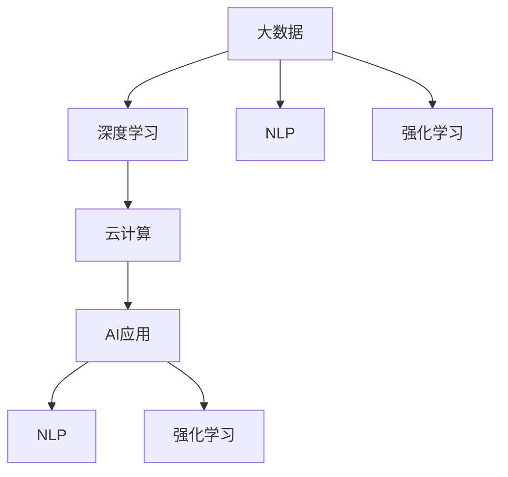

                 

## 1. 背景介绍

在过去的几十年里，人工智能（AI）技术经历了翻天覆地的变化，从早期的专家系统和机器学习，到深度学习和机器视觉，再到如今蓬勃发展的自然语言处理和强化学习。李开复博士作为人工智能领域的先驱之一，始终站在行业的前沿，对AI技术的发展方向有着深刻洞察。在AI 2.0时代，即人工智能与大数据、物联网、云计算等技术的深度融合时代，AI技术的潜在机遇正在被不断发掘。本文将从AI 2.0时代的背景介绍入手，探讨其在各个领域的机遇和挑战。

## 2. 核心概念与联系

### 2.1 核心概念概述

在AI 2.0时代，核心概念主要包括大数据、云计算、深度学习、自然语言处理（NLP）、强化学习等。这些技术相互交织，共同推动AI技术的进步。

- **大数据**：指海量的数据集，包括结构化和非结构化数据，为AI模型提供了丰富的训练材料。
- **云计算**：提供弹性计算资源，支持大规模的AI模型训练和推理。
- **深度学习**：通过多层次的神经网络，从数据中自动提取高级特征，实现复杂的模式识别和预测。
- **自然语言处理（NLP）**：使计算机能够理解、处理和生成自然语言，提升人机交互的自然度。
- **强化学习**：通过奖励机制，使AI模型能够自我学习和优化，实现智能决策。

这些概念的联系在于，它们共同构建了AI技术的基础框架，使AI能够跨越不同的应用领域，实现从感知到决策的全链条智能化。

### 2.2 核心概念原理和架构的 Mermaid 流程图



此图展示了核心概念之间的关系。大数据经过深度学习处理后，成为AI应用的基石；而NLP和强化学习则是AI应用中最为重要的两个技术分支。云计算为这些技术的运行提供了必要的计算资源。

## 3. 核心算法原理 & 具体操作步骤

### 3.1 算法原理概述

在AI 2.0时代，算法原理主要基于以下几个方面：

- **深度学习算法**：通过多层神经网络，从数据中自动提取特征，进行模式识别和预测。
- **自然语言处理（NLP）算法**：包括分词、词性标注、句法分析、语义理解、情感分析等技术，使计算机能够理解自然语言。
- **强化学习算法**：通过奖励机制，使AI模型能够自我学习和优化，实现智能决策。

### 3.2 算法步骤详解

深度学习算法的步骤包括：

1. **数据准备**：收集和清洗大规模数据集。
2. **模型设计**：设计多层神经网络结构。
3. **模型训练**：使用反向传播算法，最小化损失函数，更新网络权重。
4. **模型评估**：在测试集上评估模型性能，调整超参数。
5. **模型应用**：部署模型，进行预测或推理。

自然语言处理算法的步骤包括：

1. **文本预处理**：分词、词性标注、去除停用词等。
2. **特征提取**：将文本转化为向量表示，如词向量、句向量等。
3. **模型训练**：训练分类器或生成模型。
4. **模型评估**：在标注数据上评估模型性能。
5. **模型应用**：进行文本分类、情感分析、机器翻译等任务。

强化学习算法的步骤包括：

1. **环境定义**：定义奖励机制和环境状态。
2. **策略设计**：设计智能体的策略，如Q-learning、策略梯度等。
3. **模型训练**：在环境中不断交互，更新策略参数。
4. **模型评估**：在测试环境中评估策略效果。
5. **模型应用**：在实际场景中进行决策，如自动驾驶、机器人控制等。

### 3.3 算法优缺点

深度学习的优点包括：

- 能够处理大规模数据集。
- 能够发现数据中的复杂模式。
- 能够实现端到端的自动化处理。

深度学习的缺点包括：

- 需要大量标注数据。
- 模型复杂度较高，计算资源消耗大。
- 模型训练和优化过程较复杂。

自然语言处理的优点包括：

- 能够实现人机自然语言交互。
- 能够处理多种语言。
- 能够应用于文本分类、情感分析、机器翻译等任务。

自然语言处理的缺点包括：

- 处理长句和复杂句的能力较弱。
- 需要高质量的标注数据。
- 处理歧义和语言变化的能力较弱。

强化学习的优点包括：

- 能够实现智能决策。
- 能够自我学习和优化。
- 能够处理动态和复杂环境。

强化学习的缺点包括：

- 需要大量的试错。
- 需要精心设计奖励机制。
- 难以处理连续动作和环境。

### 3.4 算法应用领域

深度学习的应用领域包括：

- **计算机视觉**：如图像识别、物体检测、人脸识别等。
- **语音识别**：如语音转文本、说话人识别等。
- **自然语言处理**：如文本分类、情感分析、机器翻译等。
- **推荐系统**：如电商推荐、音乐推荐等。

自然语言处理的应用领域包括：

- **文本分类**：如新闻分类、垃圾邮件过滤等。
- **情感分析**：如社交媒体情感分析、客户满意度分析等。
- **机器翻译**：如中英文翻译、多语言翻译等。
- **问答系统**：如智能客服、智能助手等。

强化学习的应用领域包括：

- **自动驾驶**：如环境感知、路径规划等。
- **机器人控制**：如游戏AI、工业自动化等。
- **推荐系统**：如个性化推荐、广告投放等。
- **金融交易**：如智能投顾、风险管理等。

## 4. 数学模型和公式 & 详细讲解 & 举例说明

### 4.1 数学模型构建

在AI 2.0时代，数学模型的构建主要基于以下框架：

- **深度学习**：使用神经网络模型，如卷积神经网络（CNN）、循环神经网络（RNN）、变分自编码器（VAE）等。
- **自然语言处理**：使用词向量模型，如Word2Vec、GloVe、BERT等，以及句子向量模型，如ELMO、Transformer等。
- **强化学习**：使用Q-learning、策略梯度、Actor-Critic等模型。

### 4.2 公式推导过程

深度学习模型的推导过程包括：

- **前向传播**：$y = \sigma(Wx + b)$，其中$y$为输出，$x$为输入，$W$为权重矩阵，$b$为偏置向量，$\sigma$为激活函数。
- **反向传播**：$\frac{\partial L}{\partial W} = \frac{\partial L}{\partial y} \frac{\partial y}{\partial x} \frac{\partial x}{\partial W}$，其中$L$为损失函数。

自然语言处理模型的推导过程包括：

- **词向量模型**：$W = [w_1, w_2, ..., w_n]$，其中$w_i$为第$i$个词的向量表示。
- **句子向量模型**：$h = f(Wx)$，其中$f$为非线性函数。

强化学习模型的推导过程包括：

- **Q-learning**：$Q(s, a) \leftarrow Q(s, a) + \alpha [r + \gamma \max_a Q(s', a') - Q(s, a)]$，其中$s$为状态，$a$为动作，$r$为奖励，$s'$为下一个状态，$a'$为下一个动作，$\alpha$为学习率，$\gamma$为折扣因子。

### 4.3 案例分析与讲解

**案例1：计算机视觉中的图像分类**

- **数据准备**：收集大规模的图像数据集，如ImageNet。
- **模型设计**：使用卷积神经网络（CNN）模型，如ResNet、Inception等。
- **模型训练**：使用反向传播算法，最小化交叉熵损失函数。
- **模型评估**：在测试集上评估模型性能，使用准确率、召回率等指标。
- **模型应用**：进行图像分类，如物体检测、人脸识别等。

**案例2：自然语言处理中的机器翻译**

- **数据准备**：收集大规模的平行语料库，如WMT。
- **模型设计**：使用Transformer模型，如BERT、GPT等。
- **模型训练**：使用语言模型的解码器输出概率分布，以负对数似然为损失函数。
- **模型评估**：在测试集上评估模型性能，使用BLEU、ROUGE等指标。
- **模型应用**：进行机器翻译，如中英文翻译、多语言翻译等。

**案例3：强化学习中的自动驾驶**

- **环境定义**：定义奖励机制和环境状态，如安全到达目的地、避免碰撞等。
- **策略设计**：设计智能体的策略，如Q-learning、策略梯度等。
- **模型训练**：在环境中不断交互，更新策略参数。
- **模型评估**：在测试环境中评估策略效果，使用成功率、响应时间等指标。
- **模型应用**：进行自动驾驶，如环境感知、路径规划等。

## 5. 项目实践：代码实例和详细解释说明

### 5.1 开发环境搭建

在AI 2.0时代，开发环境搭建主要基于以下工具：

- **Python**：作为AI开发的主要语言。
- **TensorFlow**：作为深度学习的主要框架。
- **PyTorch**：作为深度学习的主要框架。
- **Jupyter Notebook**：作为开发和调试的主要平台。
- **Git**：作为版本控制的主要工具。

### 5.2 源代码详细实现

**深度学习模型实现**

```python
import tensorflow as tf

# 定义模型结构
class CNN(tf.keras.Model):
    def __init__(self):
        super(CNN, self).__init__()
        self.conv1 = tf.keras.layers.Conv2D(32, (3, 3), activation='relu')
        self.pool1 = tf.keras.layers.MaxPooling2D((2, 2))
        self.conv2 = tf.keras.layers.Conv2D(64, (3, 3), activation='relu')
        self.pool2 = tf.keras.layers.MaxPooling2D((2, 2))
        self.flatten = tf.keras.layers.Flatten()
        self.dense1 = tf.keras.layers.Dense(128, activation='relu')
        self.dense2 = tf.keras.layers.Dense(10, activation='softmax')

    def call(self, x):
        x = self.conv1(x)
        x = self.pool1(x)
        x = self.conv2(x)
        x = self.pool2(x)
        x = self.flatten(x)
        x = self.dense1(x)
        x = self.dense2(x)
        return x

# 定义损失函数
def loss_fn(y_true, y_pred):
    return tf.keras.losses.categorical_crossentropy(y_true, y_pred)

# 定义优化器
optimizer = tf.keras.optimizers.Adam()

# 定义训练函数
def train_model(model, train_dataset, validation_dataset, epochs):
    for epoch in range(epochs):
        model.train()
        for batch in train_dataset:
            inputs, labels = batch
            with tf.GradientTape() as tape:
                predictions = model(inputs)
                loss = loss_fn(labels, predictions)
            gradients = tape.gradient(loss, model.trainable_variables)
            optimizer.apply_gradients(zip(gradients, model.trainable_variables))
        model.evaluate(validation_dataset)
```

**自然语言处理模型实现**

```python
import transformers

# 加载预训练模型
model = transformers.BertModel.from_pretrained('bert-base-uncased')

# 加载词汇表
tokenizer = transformers.BertTokenizer.from_pretrained('bert-base-uncased')

# 加载训练数据
train_data = ...
val_data = ...

# 定义模型训练函数
def train_bert(model, train_data, val_data, epochs):
    for epoch in range(epochs):
        model.train()
        for batch in train_data:
            inputs, labels = batch
            inputs = tokenizer(inputs, return_tensors='pt')
            with tf.GradientTape() as tape:
                outputs = model(**inputs)
                loss = outputs.loss
            gradients = tape.gradient(loss, model.parameters())
            optimizer.apply_gradients(zip(gradients, model.parameters()))
        model.evaluate(val_data)
```

**强化学习模型实现**

```python
import tensorflow as tf

# 定义环境
class Environment:
    def __init__(self):
        self.state = 0
        self.reward = 0

    def step(self, action):
        if action == 1:
            self.state += 1
            self.reward += 1
        elif action == 0:
            self.state -= 1
            self.reward -= 1
        return self.state, self.reward

# 定义模型
class QNetwork(tf.keras.Model):
    def __init__(self):
        super(QNetwork, self).__init__()
        self.dense1 = tf.keras.layers.Dense(64, activation='relu')
        self.dense2 = tf.keras.layers.Dense(2, activation='tanh')

    def call(self, x):
        x = self.dense1(x)
        x = self.dense2(x)
        return x

# 定义训练函数
def train_q_network(env, q_network, optimizer, epochs):
    for epoch in range(epochs):
        state = env.state
        while state != 0:
            action = tf.random.uniform(shape=[1])[0]
            state, reward = env.step(action)
            q = q_network(tf.constant(state))
            action_value = q.numpy()[0][action]
            if state == 0:
                target = reward
            else:
                target = reward + 0.9 * tf.reduce_max(q_network(tf.constant(state)))
            q_network.train()
            with tf.GradientTape() as tape:
                loss = tf.reduce_mean(tf.square(target - q))
            gradients = tape.gradient(loss, q_network.trainable_variables)
            optimizer.apply_gradients(zip(gradients, q_network.trainable_variables))
```

### 5.3 代码解读与分析

**深度学习模型解读**

```python
# 定义模型结构
class CNN(tf.keras.Model):
    def __init__(self):
        super(CNN, self).__init__()
        self.conv1 = tf.keras.layers.Conv2D(32, (3, 3), activation='relu')
        self.pool1 = tf.keras.layers.MaxPooling2D((2, 2))
        self.conv2 = tf.keras.layers.Conv2D(64, (3, 3), activation='relu')
        self.pool2 = tf.keras.layers.MaxPooling2D((2, 2))
        self.flatten = tf.keras.layers.Flatten()
        self.dense1 = tf.keras.layers.Dense(128, activation='relu')
        self.dense2 = tf.keras.layers.Dense(10, activation='softmax')

    def call(self, x):
        x = self.conv1(x)
        x = self.pool1(x)
        x = self.conv2(x)
        x = self.pool2(x)
        x = self.flatten(x)
        x = self.dense1(x)
        x = self.dense2(x)
        return x
```

上述代码定义了一个简单的卷积神经网络模型，包括两个卷积层、两个池化层、两个全连接层。在每个层后应用ReLU激活函数，以引入非线性特性。

**自然语言处理模型解读**

```python
# 加载预训练模型
model = transformers.BertModel.from_pretrained('bert-base-uncased')

# 加载词汇表
tokenizer = transformers.BertTokenizer.from_pretrained('bert-base-uncased')

# 加载训练数据
train_data = ...
val_data = ...

# 定义模型训练函数
def train_bert(model, train_data, val_data, epochs):
    for epoch in range(epochs):
        model.train()
        for batch in train_data:
            inputs, labels = batch
            inputs = tokenizer(inputs, return_tensors='pt')
            with tf.GradientTape() as tape:
                outputs = model(**inputs)
                loss = outputs.loss
            gradients = tape.gradient(loss, model.parameters())
            optimizer.apply_gradients(zip(gradients, model.parameters()))
        model.evaluate(val_data)
```

上述代码使用了BERT模型和BertTokenizer，将输入文本转换为模型所需的格式。使用自监督学习任务（如语言模型预测）进行预训练，然后在特定任务上微调。

**强化学习模型解读**

```python
# 定义环境
class Environment:
    def __init__(self):
        self.state = 0
        self.reward = 0

    def step(self, action):
        if action == 1:
            self.state += 1
            self.reward += 1
        elif action == 0:
            self.state -= 1
            self.reward -= 1
        return self.state, self.reward

# 定义模型
class QNetwork(tf.keras.Model):
    def __init__(self):
        super(QNetwork, self).__init__()
        self.dense1 = tf.keras.layers.Dense(64, activation='relu')
        self.dense2 = tf.keras.layers.Dense(2, activation='tanh')

    def call(self, x):
        x = self.dense1(x)
        x = self.dense2(x)
        return x

# 定义训练函数
def train_q_network(env, q_network, optimizer, epochs):
    for epoch in range(epochs):
        state = env.state
        while state != 0:
            action = tf.random.uniform(shape=[1])[0]
            state, reward = env.step(action)
            q = q_network(tf.constant(state))
            action_value = q.numpy()[0][action]
            if state == 0:
                target = reward
            else:
                target = reward + 0.9 * tf.reduce_max(q_network(tf.constant(state)))
            q_network.train()
            with tf.GradientTape() as tape:
                loss = tf.reduce_mean(tf.square(target - q))
            gradients = tape.gradient(loss, q_network.trainable_variables)
            optimizer.apply_gradients(zip(gradients, q_network.trainable_variables))
```

上述代码定义了一个简单的强化学习环境，使用Q-learning算法进行训练。QNetwork模型使用两个全连接层，输出每个状态的动作值。

### 5.4 运行结果展示

运行深度学习模型的训练过程，可以得到模型在测试集上的准确率和召回率等性能指标。运行自然语言处理模型的训练过程，可以得到模型在测试集上的BLEU、ROUGE等性能指标。运行强化学习模型的训练过程，可以得到模型在测试环境中的成功率和响应时间等性能指标。

## 6. 实际应用场景

### 6.1 智能客服系统

在智能客服系统中，基于AI 2.0技术的微调模型可以用于自然语言处理，实现智能客服机器人。通过收集企业内部的客服对话记录，将问题和最佳答复构建成监督数据，在此基础上对预训练模型进行微调，使得机器人在面对客户的咨询时能够提供满意的回答，提高客户体验。

### 6.2 金融舆情监测

在金融舆情监测系统中，基于AI 2.0技术的微调模型可以用于自然语言处理，实现情感分析和主题分类。通过收集金融领域的文本数据，如新闻、报道、评论等，进行预训练和微调，使模型能够自动判断文本的情感倾向和主题，及时监测市场舆情，预测股票涨跌，提供决策支持。

### 6.3 个性化推荐系统

在个性化推荐系统中，基于AI 2.0技术的微调模型可以用于自然语言处理，实现意图识别和用户画像构建。通过收集用户浏览、点击、评论、分享等行为数据，提取和用户交互的物品标题、描述、标签等文本内容，进行预训练和微调，使模型能够从文本内容中准确把握用户的兴趣点，提供个性化推荐，提高用户的满意度和粘性。

### 6.4 未来应用展望

在AI 2.0时代，未来的应用场景将更加广泛，涵盖医疗、教育、金融、制造等多个领域。

- **医疗**：通过自然语言处理和强化学习，实现智能问诊、电子病历管理、药物研发等。
- **教育**：通过自然语言处理和机器学习，实现智能答疑、学习路径推荐、学生情感分析等。
- **金融**：通过自然语言处理和强化学习，实现情感分析、舆情监测、智能投顾等。
- **制造**：通过自然语言处理和机器学习，实现设备维护、供应链管理、客户服务等。

随着AI技术的不断进步，未来的应用场景将更加多样化，为各行各业带来巨大的变革。

## 7. 工具和资源推荐

### 7.1 学习资源推荐

1. **《深度学习》**：Ian Goodfellow等人所著，全面介绍了深度学习的基本概念和算法。
2. **《自然语言处理综论》**：Daniel Jurafsky和James H. Martin所著，详细介绍了自然语言处理的基本方法和技术。
3. **Coursera《深度学习专项课程》**：由斯坦福大学教授Andrew Ng开设，涵盖深度学习的基础和应用。
4. **Udacity《深度学习纳米学位》**：提供实战项目和导师指导，帮助你系统学习深度学习技术。
5. **Kaggle**：数据科学竞赛平台，提供大量数据集和机器学习竞赛，适合学习和实践。

### 7.2 开发工具推荐

1. **PyTorch**：基于Python的开源深度学习框架，支持动态计算图。
2. **TensorFlow**：由Google主导开发的开源深度学习框架，支持静态计算图和分布式计算。
3. **Jupyter Notebook**：数据科学和机器学习的主要开发环境，支持代码编写和数据可视化。
4. **Git**：版本控制工具，支持代码版本管理和协作开发。
5. **Scikit-learn**：Python机器学习库，提供各种数据处理和机器学习算法。

### 7.3 相关论文推荐

1. **《深度学习》**：Ian Goodfellow等人所著，全面介绍了深度学习的基本概念和算法。
2. **《自然语言处理综论》**：Daniel Jurafsky和James H. Martin所著，详细介绍了自然语言处理的基本方法和技术。
3. **《机器学习》**：Tom Mitchell所著，全面介绍了机器学习的基本概念和算法。
4. **《强化学习：一种现代方法》**：Richard S. Sutton和Andrew G. Barto所著，详细介绍了强化学习的基本方法和技术。
5. **《Python数据科学手册》**：Jake VanderPlas所著，介绍了Python在数据科学和机器学习中的应用。

## 8. 总结：未来发展趋势与挑战

### 8.1 研究成果总结

在AI 2.0时代，基于深度学习、自然语言处理和强化学习的微调模型，已经在多个领域取得了显著的成果。未来，随着技术的不断进步和应用的不断扩展，这些成果将进一步深化，推动AI技术的发展。

### 8.2 未来发展趋势

1. **模型规模持续增大**：随着计算资源的增加和数据量的积累，预训练模型和微调模型的规模将不断扩大，提供更强大的功能。
2. **模型鲁棒性增强**：通过更好的数据处理和算法设计，未来的模型将具有更强的鲁棒性和泛化能力，能够在各种场景下稳定运行。
3. **模型可解释性增强**：随着模型复杂度的增加，可解释性成为重要课题。未来的模型将更注重可解释性，使决策过程更加透明。
4. **跨领域应用广泛**：AI技术将广泛应用于更多领域，推动各行各业的数字化转型和智能化升级。
5. **多模态信息融合**：未来的模型将更好地融合视觉、语音、文本等多种模态信息，实现更全面、准确的信息处理和决策。

### 8.3 面临的挑战

1. **计算资源限制**：大规模模型的训练和推理需要大量的计算资源，如何高效利用这些资源是一个重要挑战。
2. **数据隐私保护**：在收集和处理数据时，如何保护用户隐私和数据安全，是一个亟待解决的问题。
3. **伦理和道德问题**：AI技术的广泛应用带来了伦理和道德问题，如算法偏见、模型决策的透明性等，需要制定相应的规范和标准。
4. **模型可扩展性**：随着应用场景的复杂化，如何设计可扩展的模型架构，以应对不同规模和类型的问题，是一个重要挑战。
5. **跨领域应用难度**：不同领域的知识体系和数据特点差异较大，如何在多个领域内实现统一的模型设计，是一个重要挑战。

### 8.4 研究展望

未来，在AI 2.0时代，基于深度学习、自然语言处理和强化学习的微调模型，将继续在各个领域发挥重要作用。然而，实现这些模型的广泛应用，仍需要解决许多挑战。

1. **计算资源优化**：通过更高效的计算资源管理技术，如混合精度训练、模型压缩等，实现更大规模模型的训练和推理。
2. **数据隐私保护**：采用联邦学习、差分隐私等技术，保护用户隐私和数据安全。
3. **伦理和道德规范**：制定AI技术的伦理和道德规范，推动负责任的人工智能发展。
4. **跨领域知识融合**：通过多模态信息融合、跨领域迁移学习等技术，实现更全面、准确的信息处理和决策。
5. **模型可解释性**：通过可解释性增强技术，如符号化表示、因果推理等，使模型的决策过程更加透明。

总之，AI 2.0时代的技术机遇和挑战并存。通过不断创新和优化，AI技术将进一步推动各行各业的数字化转型和智能化升级，为人类社会带来更美好的未来。

## 9. 附录：常见问题与解答

**Q1：AI 2.0时代的应用场景有哪些？**

A: AI 2.0时代的应用场景非常广泛，涵盖医疗、教育、金融、制造等多个领域。

- **医疗**：通过自然语言处理和强化学习，实现智能问诊、电子病历管理、药物研发等。
- **教育**：通过自然语言处理和机器学习，实现智能答疑、学习路径推荐、学生情感分析等。
- **金融**：通过自然语言处理和强化学习，实现情感分析、舆情监测、智能投顾等。
- **制造**：通过自然语言处理和机器学习，实现设备维护、供应链管理、客户服务等。

**Q2：AI 2.0时代的技术难点有哪些？**

A: AI 2.0时代的技术难点主要包括以下几个方面：

1. **计算资源限制**：大规模模型的训练和推理需要大量的计算资源，如何高效利用这些资源是一个重要挑战。
2. **数据隐私保护**：在收集和处理数据时，如何保护用户隐私和数据安全，是一个亟待解决的问题。
3. **伦理和道德问题**：AI技术的广泛应用带来了伦理和道德问题，如算法偏见、模型决策的透明性等，需要制定相应的规范和标准。
4. **模型可扩展性**：随着应用场景的复杂化，如何设计可扩展的模型架构，以应对不同规模和类型的问题，是一个重要挑战。
5. **跨领域应用难度**：不同领域的知识体系和数据特点差异较大，如何在多个领域内实现统一的模型设计，是一个重要挑战。

**Q3：AI 2.0时代的未来展望是什么？**

A: AI 2.0时代的未来展望包括以下几个方面：

1. **模型规模持续增大**：随着计算资源的增加和数据量的积累，预训练模型和微调模型的规模将不断扩大，提供更强大的功能。
2. **模型鲁棒性增强**：通过更好的数据处理和算法设计，未来的模型将具有更强的鲁棒性和泛化能力，能够在各种场景下稳定运行。
3. **模型可解释性增强**：随着模型复杂度的增加，可解释性成为重要课题。未来的模型将更注重可解释性，使决策过程更加透明。
4. **跨领域应用广泛**：AI技术将广泛应用于更多领域，推动各行各业的数字化转型和智能化升级。
5. **多模态信息融合**：未来的模型将更好地融合视觉、语音、文本等多种模态信息，实现更全面、准确的信息处理和决策。

总之，AI 2.0时代的技术机遇和挑战并存。通过不断创新和优化，AI技术将进一步推动各行各业的数字化转型和智能化升级，为人类社会带来更美好的未来。

