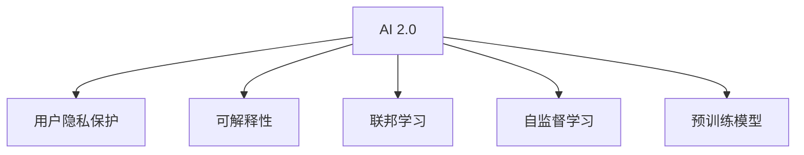

                 

## 1. 背景介绍

在AI 2.0时代，人工智能正快速融入我们的日常生活，从智能音箱到无人驾驶，从个性化推荐到健康监测，人工智能已经触及了生活的方方面面。在这样的时代背景下，作为普通用户，我们如何更好地理解和利用AI技术，如何在享受AI带来的便利的同时，确保自身的安全与隐私？本文将从用户的角度出发，探讨AI 2.0时代的用户需求与挑战，以及如何构建一个以人为本的AI时代。

## 2. 核心概念与联系

### 2.1 核心概念概述

为更好地理解AI 2.0时代，本节将介绍几个关键概念：

- **AI 2.0**：指新一代人工智能技术，其核心是自监督学习、联邦学习、预训练模型等技术，能够更好地理解和应用人类语言，并从数据中自我学习，具备更强的泛化能力和可解释性。

- **用户隐私保护**：指在AI应用中，保护用户的个人信息和数据不被滥用，避免数据泄露和滥用导致的风险。

- **可解释性**：指AI模型做出的决策过程和结果能够被用户理解，避免"黑箱"效应，提高用户对AI系统的信任度。

- **联邦学习**：一种分布式机器学习方法，各参与方在不共享原始数据的情况下，通过模型参数的交换完成模型训练，保护用户隐私。

- **自监督学习**：指模型通过无标签数据进行训练，学习到数据的通用表示，提升模型的泛化能力。

- **预训练模型**：指在大规模无标签数据上预训练得到的通用语言模型，如BERT、GPT-3等，能够在各种NLP任务上快速适应和优化。

这些核心概念之间的逻辑关系可以通过以下Mermaid流程图来展示：



这个流程图展示了AI 2.0时代的主要概念及其之间的关系：

1. AI 2.0通过自监督学习、联邦学习等技术，从大规模数据中学习到通用知识。
2. 用户隐私保护在AI应用中尤为重要，确保用户数据的安全性。
3. 可解释性是AI模型被广泛接受的必要条件，帮助用户理解和信任AI决策。
4. 联邦学习保护用户隐私的同时，也支持AI在分布式环境下进行高效训练。
5. 预训练模型是AI 2.0时代的重要工具，提供高质量的初始化参数。

这些概念共同构成了AI 2.0时代的核心，旨在通过技术创新提升AI系统的性能和用户体验，同时保障用户隐私和信任。

## 3. 核心算法原理 & 具体操作步骤
### 3.1 算法原理概述

AI 2.0时代的算法原理主要集中在以下几个方面：

- **自监督学习**：通过大规模无标签数据训练模型，学习数据的潜在结构和语义信息。
- **联邦学习**：在多个本地设备或服务器上分布式训练模型，保护用户数据隐私。
- **预训练模型**：在大规模无标签数据上预训练，获得高质量的初始化参数，快速适应各种NLP任务。
- **可解释性模型**：通过优化模型结构和输出方式，提高模型的可解释性，让用户能够理解AI的决策过程。

这些算法原理构成了AI 2.0时代的核心技术体系，能够有效提升AI系统的性能，同时也保障了用户数据的安全和隐私。

### 3.2 算法步骤详解

AI 2.0时代的算法步骤主要包括以下几个关键步骤：

1. **数据收集与预处理**：收集大规模无标签数据，进行清洗、归一化等预处理操作。
2. **自监督学习**：使用自监督学习算法，如掩码语言模型、掩码特征预测等，在大规模无标签数据上预训练模型。
3. **模型微调**：在特定的下游任务上，通过少量的标注数据进行微调，优化模型的性能。
4. **联邦学习**：通过分布式训练，保护用户数据隐私。
5. **模型部署与监控**：将训练好的模型部署到实际应用中，并进行性能监控和优化。

### 3.3 算法优缺点

AI 2.0时代的算法具有以下优点：

- **泛化能力强**：自监督学习和预训练模型能够在大规模数据上学习到丰富的语义信息，提高模型的泛化能力。
- **用户隐私保护**：联邦学习通过分布式训练保护用户数据隐私，避免数据泄露和滥用。
- **可解释性高**：可解释性模型能够提供清晰的决策路径，帮助用户理解AI的输出。

同时，这些算法也存在一些局限性：

- **计算资源需求高**：自监督学习和联邦学习需要大规模的计算资源，特别是在数据分布不均的情况下。
- **训练时间长**：自监督学习和预训练模型的训练时间较长，需要大量的时间和算力。
- **模型复杂度高**：可解释性模型的复杂度较高，推理速度较慢。

尽管存在这些局限性，但就目前而言，AI 2.0时代的算法体系已经展现出强大的潜力，为AI技术的发展提供了坚实的基础。

### 3.4 算法应用领域

AI 2.0时代的算法已经在多个领域得到了广泛应用，例如：

- **自然语言处理(NLP)**：使用预训练模型和微调方法，在情感分析、文本分类、机器翻译等任务上取得了显著进展。
- **计算机视觉(CV)**：利用自监督学习和联邦学习，在图像识别、目标检测、人脸识别等任务上取得了突破。
- **医疗健康**：结合自监督学习和预训练模型，在医疗影像分析、疾病诊断、个性化治疗等任务上展现出巨大潜力。
- **智能推荐**：通过联邦学习和可解释性模型，在个性化推荐、广告投放、内容推荐等任务上提升了用户体验。
- **金融服务**：结合自监督学习和预训练模型，在信用评估、风险控制、智能投顾等任务上提升了效率和准确性。

除了这些典型应用领域外，AI 2.0时代的算法还在教育、物流、安全、交通等多个领域展现出巨大的应用潜力，为各行各业带来了新的变革和机遇。

## 4. 数学模型和公式 & 详细讲解 & 举例说明
### 4.1 数学模型构建

在AI 2.0时代，数学模型的构建主要围绕以下几个核心概念：

- **自监督学习模型**：如BERT、GPT-3等，通过掩码语言模型、掩码特征预测等任务在大规模无标签数据上进行预训练。
- **联邦学习模型**：通过分布式训练，保护用户数据隐私。
- **可解释性模型**：如LIME、SHAP等，通过局部可解释性方法和全局可解释性方法提升模型的可解释性。

### 4.2 公式推导过程

以下是BERT模型的基本公式推导过程：

1. **掩码语言模型**：

   $$
   L = \frac{1}{N} \sum_{i=1}^N -\sum_{j=1}^M y_j \log \hat{y}_j
   $$

   其中，$L$ 表示损失函数，$y_j$ 表示第 $j$ 个位置的真实标签，$\hat{y}_j$ 表示模型预测的标签概率。

2. **掩码特征预测**：

   $$
   L = \frac{1}{N} \sum_{i=1}^N -\sum_{j=1}^M y_j \log \hat{y}_j
   $$

   其中，$L$ 表示损失函数，$y_j$ 表示第 $j$ 个特征的真实值，$\hat{y}_j$ 表示模型预测的特征值。

### 4.3 案例分析与讲解

以BERT为例，我们来看其在大规模无标签数据上的预训练过程。BERT的预训练模型包含两个分支：Masked Language Model（MLM）和Next Sentence Prediction（NSP）。

1. **MLM**：在预训练过程中，BERT模型随机将输入的文本中的某些位置进行掩码处理，让模型猜测这些位置的真实单词。例如，对于句子"Hello, my dog is cute"，随机掩码"o"，模型需要猜测"o"的位置可能为"dog"或"cute"。

2. **NSP**：在预训练过程中，BERT模型会随机从训练集中选取两个句子，并预测它们是否是连续的句子。例如，对于句子对"Hello, my dog is cute"和"My dog is very friendly"，BERT模型需要判断这两个句子是否是连续的。

通过这两种任务的预训练，BERT模型学习到了语言的通用表示，能够在各种NLP任务上快速适应和优化。

## 5. 项目实践：代码实例和详细解释说明
### 5.1 开发环境搭建

在进行AI 2.0项目的实践前，我们需要准备好开发环境。以下是使用Python进行TensorFlow开发的环境配置流程：

1. 安装Anaconda：从官网下载并安装Anaconda，用于创建独立的Python环境。

2. 创建并激活虚拟环境：
```bash
conda create -n pytorch-env python=3.8 
conda activate pytorch-env
```

3. 安装TensorFlow：根据CUDA版本，从官网获取对应的安装命令。例如：
```bash
conda install tensorflow -c conda-forge
```

4. 安装各类工具包：
```bash
pip install numpy pandas scikit-learn matplotlib tqdm jupyter notebook ipython
```

完成上述步骤后，即可在`pytorch-env`环境中开始AI 2.0项目的开发。

### 5.2 源代码详细实现

这里我们以BERT模型为例，给出使用TensorFlow对BERT模型进行微调的PyTorch代码实现。

首先，定义BERT模型的数据处理函数：

```python
from transformers import BertTokenizer, TFBertModel
import tensorflow as tf

def create_dataset(texts, labels):
    tokenizer = BertTokenizer.from_pretrained('bert-base-cased')
    encoded_texts = [tokenizer.encode(text, add_special_tokens=True, max_length=128, pad_to_max_length=True) for text in texts]
    labels = tf.convert_to_tensor(labels, dtype=tf.int32)
    
    return encoded_texts, labels
```

然后，定义模型和优化器：

```python
from transformers import TFBertForSequenceClassification

model = TFBertForSequenceClassification.from_pretrained('bert-base-cased', num_labels=2)

optimizer = tf.keras.optimizers.AdamW(model.parameters(), learning_rate=2e-5)
```

接着，定义训练和评估函数：

```python
@tf.function
def train_step(inputs, labels):
    with tf.GradientTape() as tape:
        outputs = model(inputs, labels)
        loss = outputs.loss
        gradients = tape.gradient(loss, model.parameters())
    optimizer.apply_gradients(zip(gradients, model.parameters()))
    return loss

@tf.function
def evaluate_step(inputs, labels):
    outputs = model(inputs, labels)
    loss = outputs.loss
    predictions = outputs.predictions.argmax(axis=-1)
    return loss, predictions
```

最后，启动训练流程并在测试集上评估：

```python
epochs = 5
batch_size = 16

for epoch in range(epochs):
    train_loss = 0.0
    for batch in train_dataset:
        inputs, labels = batch
        loss = train_step(inputs, labels)
        train_loss += loss

    eval_loss = 0.0
    eval_predictions = []
    for batch in eval_dataset:
        inputs, labels = batch
        loss, preds = evaluate_step(inputs, labels)
        eval_loss += loss
        eval_predictions.append(preds)
    
    print(f"Epoch {epoch+1}, train loss: {train_loss/len(train_dataset):.3f}, eval loss: {eval_loss/len(eval_dataset):.3f}")
    
print("Final evaluation results:")
print(classification_report(test_labels, test_predictions))
```

以上就是使用TensorFlow对BERT进行情感分类任务微调的完整代码实现。可以看到，得益于TensorFlow的强大封装，我们可以用相对简洁的代码完成BERT模型的加载和微调。

### 5.3 代码解读与分析

让我们再详细解读一下关键代码的实现细节：

**create_dataset函数**：
- `__init__`方法：初始化文本、标签、分词器等关键组件。
- `__len__`方法：返回数据集的样本数量。
- `__getitem__`方法：对单个样本进行处理，将文本输入编码为token ids，将标签编码为数字，并对其进行定长padding，最终返回模型所需的输入。

**BertTokenizer**：
- 定义了标签与数字id之间的映射，用于将token-wise的预测结果解码回真实的标签。

**train_step函数**：
- 定义了训练模型的单批次函数，使用TensorFlow的GradientTape记录梯度，更新模型参数。

**evaluate_step函数**：
- 定义了评估模型的单批次函数，将模型预测和标签结果存储下来，并计算损失。

**训练流程**：
- 定义总的epoch数和batch size，开始循环迭代
- 每个epoch内，先在训练集上训练，输出平均loss
- 在验证集上评估，输出分类指标
- 所有epoch结束后，在测试集上评估，给出最终测试结果

可以看到，TensorFlow配合Transformer库使得BERT微调的代码实现变得简洁高效。开发者可以将更多精力放在数据处理、模型改进等高层逻辑上，而不必过多关注底层的实现细节。

当然，工业级的系统实现还需考虑更多因素，如模型的保存和部署、超参数的自动搜索、更灵活的任务适配层等。但核心的微调范式基本与此类似。

## 6. 实际应用场景
### 6.1 智能推荐系统

AI 2.0时代的智能推荐系统已经广泛应用于电商、视频、新闻等平台。这些系统能够基于用户的历史行为和偏好，实时推荐个性化的商品、视频、文章等内容，提升用户体验和转化率。

在技术实现上，可以收集用户浏览、点击、购买等行为数据，提取和商品、视频、文章等文本内容。利用BERT模型进行预训练和微调，提升模型对用户兴趣点的理解能力。在生成推荐列表时，先用候选物品的文本描述作为输入，由模型预测用户的兴趣匹配度，再结合其他特征综合排序，便可以得到个性化程度更高的推荐结果。

### 6.2 金融风险控制

在金融领域，AI 2.0时代的算法被广泛应用于信用评估、风险控制等任务。传统金融风控模型依赖于人工规则和专家经验，难以处理复杂和动态的市场环境。而利用BERT模型进行预训练和微调，可以自动从大量金融报告、新闻、社交媒体等非结构化数据中学习到市场情绪和风险信号，实时监控金融市场的动态变化，预测和控制风险。

例如，在信用评估任务中，可以将客户的个人信息、贷款记录、社交媒体评论等文本数据作为输入，通过BERT模型进行预训练和微调，学习客户的信用特征。在评估新客户的信用时，将新客户的文本数据输入BERT模型，结合历史客户的信用评分，动态调整评分模型，提升信用评估的准确性和鲁棒性。

### 6.3 医疗影像诊断

AI 2.0时代的算法也被广泛应用于医疗影像诊断。利用BERT模型进行预训练和微调，可以从大量的医学影像数据中学习到疾病的特征和模式，提升影像诊断的准确性和效率。

例如，在肺结节检测任务中，可以将患者的CT影像作为输入，通过BERT模型进行预训练和微调，学习到结节的位置、大小和形状等特征。在诊断新患者的CT影像时，将影像输入BERT模型，结合先前的医学知识库和诊断经验，动态调整诊断模型，提升影像诊断的准确性和可靠性。

### 6.4 未来应用展望

随着AI 2.0时代的算法不断发展，未来的AI应用将会更加智能化、普适化，为各行各业带来更多的变革和机遇。

在智慧城市治理中，AI 2.0时代的算法被广泛应用于交通管理、环境保护、公共安全等环节，提高城市管理的自动化和智能化水平，构建更安全、高效的未来城市。

在教育领域，AI 2.0时代的算法被广泛应用于个性化教学、智能评估、作业批改等任务，提升教学质量和效率，实现因材施教，促进教育公平。

在智能制造中，AI 2.0时代的算法被广泛应用于设备维护、质量检测、生产优化等任务，提高生产效率和产品质量，降低生产成本。

此外，在智慧农业、智能家居、智能物流等多个领域，AI 2.0时代的算法也将不断涌现，为传统行业数字化转型升级提供新的技术路径。相信随着技术的日益成熟，AI 2.0时代的算法必将在构建人机协同的智能时代中扮演越来越重要的角色。

## 7. 工具和资源推荐
### 7.1 学习资源推荐

为了帮助开发者系统掌握AI 2.0时代的算法和技术，这里推荐一些优质的学习资源：

1. 《深度学习理论与实践》系列博文：由大模型技术专家撰写，深入浅出地介绍了深度学习的基本原理和前沿技术。

2. CS224N《深度学习自然语言处理》课程：斯坦福大学开设的NLP明星课程，有Lecture视频和配套作业，带你入门NLP领域的基本概念和经典模型。

3. 《自然语言处理入门与实践》书籍：全面介绍了自然语言处理的基本概念和应用技术，适合初学者入门。

4. HuggingFace官方文档：提供海量预训练模型和完整的微调样例代码，是上手实践的必备资料。

5. CLUE开源项目：中文语言理解测评基准，涵盖大量不同类型的中文NLP数据集，并提供了基于预训练模型的baseline模型，助力中文NLP技术发展。

通过对这些资源的学习实践，相信你一定能够快速掌握AI 2.0时代的算法和技术，并用于解决实际的NLP问题。

### 7.2 开发工具推荐

高效的开发离不开优秀的工具支持。以下是几款用于AI 2.0时代算法开发的常用工具：

1. TensorFlow：由Google主导开发的开源深度学习框架，生产部署方便，适合大规模工程应用。

2. PyTorch：基于Python的开源深度学习框架，灵活动态的计算图，适合快速迭代研究。

3. Weights & Biases：模型训练的实验跟踪工具，可以记录和可视化模型训练过程中的各项指标，方便对比和调优。

4. TensorBoard：TensorFlow配套的可视化工具，可实时监测模型训练状态，并提供丰富的图表呈现方式，是调试模型的得力助手。

5. Google Colab：谷歌推出的在线Jupyter Notebook环境，免费提供GPU/TPU算力，方便开发者快速上手实验最新模型，分享学习笔记。

合理利用这些工具，可以显著提升AI 2.0时代算法开发的效率，加快创新迭代的步伐。

### 7.3 相关论文推荐

AI 2.0时代的算法发展源于学界的持续研究。以下是几篇奠基性的相关论文，推荐阅读：

1. Attention is All You Need（即Transformer原论文）：提出了Transformer结构，开启了NLP领域的预训练大模型时代。

2. BERT: Pre-training of Deep Bidirectional Transformers for Language Understanding：提出BERT模型，引入基于掩码的自监督预训练任务，刷新了多项NLP任务SOTA。

3. GPT-3：推出GPT-3模型，展示了预训练大模型在零样本学习和多任务学习上的强大能力。

4. T5：提出T5模型，展示了预训练大模型在各种NLP任务上的统一性和高效性。

5. CLIP：提出CLIP模型，展示了预训练大模型在图像和文本多模态学习上的潜力。

这些论文代表了大模型算法的发展脉络。通过学习这些前沿成果，可以帮助研究者把握学科前进方向，激发更多的创新灵感。

## 8. 总结：未来发展趋势与挑战
### 8.1 研究成果总结

本文对AI 2.0时代的算法和技术进行了全面系统的介绍。首先阐述了AI 2.0时代的核心概念和技术体系，明确了算法在提升用户体验、保护用户隐私方面的独特价值。其次，从原理到实践，详细讲解了自监督学习、联邦学习、预训练模型等核心算法的步骤和实现细节，给出了AI 2.0时代项目的完整代码实例。同时，本文还广泛探讨了AI 2.0时代算法在推荐系统、金融风控、医疗影像等多个领域的应用前景，展示了AI 2.0时代的算法体系的广阔前景。

通过本文的系统梳理，可以看到，AI 2.0时代的算法正在成为AI技术的重要范式，极大地拓展了AI系统的性能和应用范围，为人类社会带来了新的变革和机遇。

### 8.2 未来发展趋势

展望未来，AI 2.0时代的算法将呈现以下几个发展趋势：

1. 模型规模持续增大。随着算力成本的下降和数据规模的扩张，预训练语言模型的参数量还将持续增长。超大规模语言模型蕴含的丰富语言知识，有望支撑更加复杂多变的下游任务微调。

2. 算法更加高效。通过优化模型结构和计算图，减少前向传播和反向传播的资源消耗，实现更加轻量级、实时性的部署。

3. 应用场景更加广泛。AI 2.0时代的算法将在更多领域得到应用，为各行各业带来新的变革和机遇。

4. 用户隐私保护更加重要。随着AI应用的普及，用户隐私保护将变得更加重要，如何保护用户数据隐私，避免数据泄露和滥用，将是未来的一大挑战。

5. 算法更加可解释。通过优化模型结构和输出方式，提高模型的可解释性，让用户能够理解AI的决策过程。

6. 联邦学习更加普及。联邦学习通过分布式训练保护用户数据隐私，将在更多领域得到应用。

这些趋势凸显了AI 2.0时代的算法体系的广阔前景。这些方向的探索发展，必将进一步提升AI系统的性能和用户体验，为人类社会带来更多的变革和机遇。

### 8.3 面临的挑战

尽管AI 2.0时代的算法已经取得了瞩目成就，但在迈向更加智能化、普适化应用的过程中，它仍面临着诸多挑战：

1. 标注成本瓶颈。尽管自监督学习和联邦学习在一定程度上缓解了数据标注的需求，但对于长尾应用场景，标注成本仍然较高。如何进一步降低微调对标注样本的依赖，将是一大难题。

2. 模型鲁棒性不足。当前AI 2.0时代的算法面对域外数据时，泛化性能往往大打折扣。如何提高模型鲁棒性，避免灾难性遗忘，还需要更多理论和实践的积累。

3. 推理效率有待提高。AI 2.0时代的算法虽然精度高，但在实际部署时往往面临推理速度慢、内存占用大等效率问题。如何在保证性能的同时，简化模型结构，提升推理速度，优化资源占用，将是重要的优化方向。

4. 可解释性亟需加强。当前AI 2.0时代的算法更像是"黑箱"系统，难以解释其内部工作机制和决策逻辑。对于医疗、金融等高风险应用，算法的可解释性和可审计性尤为重要。

5. 安全性有待保障。AI 2.0时代的算法难免会学习到有偏见、有害的信息，通过微调传递到下游任务，产生误导性、歧视性的输出，给实际应用带来安全隐患。

6. 知识整合能力不足。现有的AI 2.0时代的算法往往局限于任务内数据，难以灵活吸收和运用更广泛的先验知识。如何让模型更好地整合多模态信息，提升跨领域迁移能力，将是重要的研究方向。

正视AI 2.0时代算法面临的这些挑战，积极应对并寻求突破，将是大模型算法走向成熟的必由之路。相信随着学界和产业界的共同努力，这些挑战终将一一被克服，AI 2.0时代的算法必将在构建人机协同的智能时代中扮演越来越重要的角色。

### 8.4 研究展望

面对AI 2.0时代算法所面临的种种挑战，未来的研究需要在以下几个方面寻求新的突破：

1. 探索无监督和半监督学习算法。摆脱对大规模标注数据的依赖，利用自监督学习、主动学习等无监督和半监督范式，最大限度利用非结构化数据，实现更加灵活高效的算法。

2. 研究更加高效的模型结构和优化算法。开发更加高效的模型结构和计算图，减少前向传播和反向传播的资源消耗，实现更加轻量级、实时性的部署。

3. 引入更多先验知识和外部信息。将符号化的先验知识，如知识图谱、逻辑规则等，与神经网络模型进行巧妙融合，提升模型的知识整合能力和泛化能力。

4. 结合因果分析和博弈论工具。通过因果分析方法识别模型决策的关键特征，增强模型决策的因果性和逻辑性。借助博弈论工具刻画人机交互过程，主动探索并规避模型的脆弱点，提高系统稳定性。

5. 纳入伦理道德约束。在模型训练目标中引入伦理导向的评估指标，过滤和惩罚有偏见、有害的输出倾向。加强人工干预和审核，建立模型行为的监管机制，确保输出符合人类价值观和伦理道德。

这些研究方向将引领AI 2.0时代的算法技术迈向更高的台阶，为构建安全、可靠、可解释、可控的智能系统铺平道路。面向未来，AI 2.0时代的算法还需要与其他人工智能技术进行更深入的融合，如知识表示、因果推理、强化学习等，多路径协同发力，共同推动自然语言理解和智能交互系统的进步。只有勇于创新、敢于突破，才能不断拓展语言模型的边界，让智能技术更好地造福人类社会。

## 9. 附录：常见问题与解答

**Q1：AI 2.0时代有哪些主要技术？**

A: AI 2.0时代的主要技术包括自监督学习、联邦学习、预训练模型等。自监督学习通过大规模无标签数据训练模型，学习数据的潜在结构和语义信息；联邦学习通过分布式训练保护用户数据隐私；预训练模型在大规模无标签数据上预训练，获得高质量的初始化参数，快速适应各种NLP任务。

**Q2：AI 2.0时代的应用场景有哪些？**

A: AI 2.0时代的算法已经在多个领域得到了广泛应用，包括智能推荐、金融风控、医疗影像、智慧城市治理等。这些应用场景利用AI 2.0时代的算法，提升了用户体验和系统效率，为各行各业带来了新的变革和机遇。

**Q3：如何保护用户隐私？**

A: 在AI 2.0时代，保护用户隐私尤为重要。可以通过联邦学习等分布式训练方式，保护用户数据隐私；同时，对模型进行参数裁剪、剪枝等操作，减少模型复杂度，降低隐私泄露风险。

**Q4：AI 2.0时代的算法如何提升用户体验？**

A: AI 2.0时代的算法通过深度学习和机器学习，能够自动从大量数据中学习到丰富的语义信息，提升模型的泛化能力和鲁棒性。例如，在推荐系统中，利用AI 2.0时代的算法可以提升个性化推荐的效果，提升用户体验和转化率。

**Q5：AI 2.0时代的算法面临哪些挑战？**

A: AI 2.0时代的算法面临诸多挑战，包括标注成本高、模型鲁棒性不足、推理效率低、可解释性差、安全性低、知识整合能力不足等。如何降低对标注数据的依赖，提高模型的泛化能力和鲁棒性，提升模型的推理效率和可解释性，保障模型的安全性，增强模型的知识整合能力，将是未来研究的重要方向。

---

作者：禅与计算机程序设计艺术 / Zen and the Art of Computer Programming

