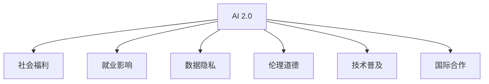

                 

# 李开复：AI 2.0 时代的社会价值

## 1. 背景介绍

### 1.1 问题由来

随着人工智能（AI）技术的不断进步，AI 2.0 时代的到来已经成为了现实。AI 2.0 是继最初的 AI 1.0 之后的下一个阶段，它不再局限于特定的领域和任务，而是更广泛地应用于各种行业和日常生活中。这种技术的广泛应用，给社会带来了深远的影响，也带来了许多值得深思的社会价值问题。

### 1.2 问题核心关键点

AI 2.0 时代的社会价值问题主要集中在以下几个方面：

- **社会福利**：AI 技术能否提高社会整体的生活质量和福利？
- **就业影响**：AI 自动化可能导致大量工作岗位的消失，如何缓解这一问题？
- **数据隐私**：AI 技术涉及大量的个人数据，如何保障个人隐私和数据安全？
- **伦理道德**：AI 决策和行为的道德标准如何制定？
- **技术普及**：如何让更多人受益于 AI 技术？
- **国际合作**：如何实现全球范围内 AI 技术的协调与合作？

这些问题不仅需要技术上的解答，还需要全社会、政策制定者、企业、学界等多方的共同努力。

## 2. 核心概念与联系

### 2.1 核心概念概述

为更好地理解 AI 2.0 时代的社会价值问题，本节将介绍几个密切相关的核心概念：

- **AI 2.0**：一种更加通用、智能的 AI 技术，能够适应各种复杂的任务和场景。
- **社会福利**：通过提高生产力、降低成本、改善健康、教育等，提升社会整体的生活质量和福祉。
- **就业影响**：AI 自动化可能导致某些工作岗位的减少，但也可能创造新的就业机会。
- **数据隐私**：保护个人数据免受滥用和泄露，保障用户隐私权。
- **伦理道德**：AI 决策和行为的道德准则，避免造成不公正、不合理的后果。
- **技术普及**：使 AI 技术广泛应用，让更多人受益。
- **国际合作**：全球范围内协同合作，共享 AI 技术带来的收益。

这些概念之间的逻辑关系可以通过以下 Mermaid 流程图来展示：



这个流程图展示了一系列核心概念及其之间的关系：

1. AI 2.0 是这些社会价值问题的基础。
2. AI 2.0 通过改善生活质量、创造就业机会、保障隐私、制定伦理准则、普及技术、促进国际合作等方式，提升社会价值。

## 3. 核心算法原理 & 具体操作步骤

### 3.1 算法原理概述

AI 2.0 技术的社会价值实现，主要依赖于以下几个关键算法原理：

- **深度学习**：通过多层神经网络进行特征学习和模式识别，实现对复杂问题的处理。
- **强化学习**：通过奖励和惩罚机制，使 AI 系统能够在不断交互中学习和优化。
- **迁移学习**：将一个领域的知识迁移到另一个领域，以减少在新任务上的学习成本。
- **跨领域知识图谱**：通过构建跨领域的知识图谱，实现知识的融合和复用。
- **自然语言处理（NLP）**：使 AI 系统能够理解和生成人类语言，进行多模态交互。

### 3.2 算法步骤详解

AI 2.0 技术的社会价值实现主要包括以下几个步骤：

**Step 1: 数据收集与预处理**

1. 收集相关领域的数据集，确保数据的多样性和质量。
2. 进行数据清洗和标准化处理，去除噪声和异常值。
3. 将数据集划分为训练集、验证集和测试集。

**Step 2: 模型训练与微调**

1. 选择合适的深度学习模型，并进行初始化。
2. 使用训练集对模型进行训练，逐步优化模型参数。
3. 在验证集上进行模型验证，调整模型超参数。
4. 在测试集上评估模型性能，确定最终的模型参数。

**Step 3: 部署与应用**

1. 将训练好的模型部署到实际应用场景中。
2. 进行持续的监测和优化，提升模型效果。
3. 保障模型的数据隐私和安全，确保合规性。

### 3.3 算法优缺点

AI 2.0 技术的社会价值实现具有以下优点：

- **高效性**：能够快速处理大量数据，提升生产力和效率。
- **精确性**：通过深度学习和迁移学习，实现对复杂问题的精确处理。
- **普适性**：适用于各种领域和任务，具有广泛的应用前景。
- **可扩展性**：通过模型复用和跨领域知识图谱，实现知识的共享和扩展。

同时，该方法也存在一定的局限性：

- **数据依赖**：需要大量的高质量数据，数据获取和处理成本较高。
- **模型复杂度**：深度学习模型较为复杂，对计算资源和算法要求高。
- **黑箱问题**：模型的内部机制和决策过程难以解释，存在一定的透明性问题。
- **伦理挑战**：AI 决策和行为的道德标准制定复杂，难以全面覆盖。
- **隐私风险**：大量个人数据的收集和处理，存在隐私泄露的风险。

尽管存在这些局限性，但 AI 2.0 技术在社会价值实现方面已经展现出巨大的潜力和价值。

### 3.4 算法应用领域

AI 2.0 技术的社会价值实现，已经在多个领域得到了广泛应用，例如：

- **医疗健康**：通过 AI 诊断、治疗方案推荐、健康监测等方式，提高医疗服务质量。
- **教育**：通过 AI 个性化教学、智能辅导、教育数据分析等方式，提升教育效果。
- **金融**：通过 AI 风险评估、交易策略、客户服务等方式，优化金融服务。
- **交通**：通过 AI 交通管理、智能驾驶、物流优化等方式，提升交通效率。
- **环境保护**：通过 AI 环境监测、污染控制、资源管理等方式，促进环境保护。
- **社会治理**：通过 AI 公共安全、社会舆情分析、政策决策等方式，提升社会治理水平。

这些应用展示了 AI 2.0 技术在各个领域带来的巨大社会价值。

## 4. 数学模型和公式 & 详细讲解 & 举例说明

### 4.1 数学模型构建

为更好地理解 AI 2.0 技术的社会价值实现，本节将使用数学语言对相关模型进行严格刻画。

假设有一个分类任务，其中输入为 $x \in \mathbb{R}^n$，输出为 $y \in \{0, 1\}$。设 $f(x; \theta)$ 为分类模型，其中 $\theta$ 为模型参数。分类问题的损失函数为交叉熵损失，定义为：

$$
\ell(f(x; \theta), y) = -y \log f(x; \theta) - (1-y) \log (1-f(x; \theta))
$$

训练的目标是最小化经验风险，即：

$$
\min_{\theta} \frac{1}{N} \sum_{i=1}^N \ell(f(x_i; \theta), y_i)
$$

其中 $(x_i, y_i)$ 为第 $i$ 个样本的输入和输出。

### 4.2 公式推导过程

以深度学习中的卷积神经网络（CNN）为例，推导其在图像分类任务中的应用。

设输入图像 $x \in \mathbb{R}^{H \times W \times C}$，其中 $H$、$W$、$C$ 分别为图像的高度、宽度和通道数。CNN 的卷积层和池化层分别为：

$$
h(x; \theta) = \sigma(\sum_k w_k * x + b_k)
$$

$$
p(x; \theta) = \max_{i,j} h(x; \theta)
$$

其中 $\sigma$ 为激活函数，$w_k$ 为卷积核，$b_k$ 为偏置项。通过多层卷积和池化，CNN 可以提取图像的特征表示。设输出为 $y \in \{0, 1\}$，则分类问题的损失函数为交叉熵损失：

$$
\ell(f(x; \theta), y) = -y \log f(x; \theta) - (1-y) \log (1-f(x; \theta))
$$

训练的目标是最小化经验风险，即：

$$
\min_{\theta} \frac{1}{N} \sum_{i=1}^N \ell(f(x_i; \theta), y_i)
$$

通过反向传播算法，对模型参数 $\theta$ 进行梯度更新，使得损失函数最小化。

### 4.3 案例分析与讲解

以医疗健康领域为例，分析 AI 2.0 技术的社会价值实现。

假设有一个癌症诊断任务，其中输入为患者的医学影像 $x \in \mathbb{R}^{H \times W \times C}$，输出为癌症是否存在 $y \in \{0, 1\}$。利用 CNN 模型进行训练，在训练集上最小化损失函数：

$$
\min_{\theta} \frac{1}{N} \sum_{i=1}^N \ell(f(x_i; \theta), y_i)
$$

在测试集上评估模型性能，如准确率、召回率、F1 分数等。如果模型表现良好，可以将其部署到实际医疗系统中，辅助医生进行癌症诊断。

## 5. 项目实践：代码实例和详细解释说明

### 5.1 开发环境搭建

在进行 AI 2.0 技术社会价值实现的代码实践前，我们需要准备好开发环境。以下是使用 Python 进行 TensorFlow 开发的环境配置流程：

1. 安装 Anaconda：从官网下载并安装 Anaconda，用于创建独立的 Python 环境。

2. 创建并激活虚拟环境：
```bash
conda create -n tf-env python=3.8 
conda activate tf-env
```

3. 安装 TensorFlow：根据 GPU 版本，从官网获取对应的安装命令。例如：
```bash
conda install tensorflow -c tensorflow -c conda-forge
```

4. 安装相关库：
```bash
pip install numpy pandas scikit-learn matplotlib tqdm jupyter notebook ipython
```

完成上述步骤后，即可在 `tf-env` 环境中开始代码实践。

### 5.2 源代码详细实现

下面我们以图像分类任务为例，给出使用 TensorFlow 对 CNN 模型进行训练和验证的 PyTorch 代码实现。

```python
import tensorflow as tf
from tensorflow.keras import datasets, layers, models
import numpy as np
import matplotlib.pyplot as plt

# 加载数据集
(train_images, train_labels), (test_images, test_labels) = datasets.cifar10.load_data()

# 数据预处理
train_images = train_images / 255.0
test_images = test_images / 255.0

# 定义模型
model = models.Sequential()
model.add(layers.Conv2D(32, (3, 3), activation='relu', input_shape=(32, 32, 3)))
model.add(layers.MaxPooling2D((2, 2)))
model.add(layers.Conv2D(64, (3, 3), activation='relu'))
model.add(layers.MaxPooling2D((2, 2)))
model.add(layers.Conv2D(64, (3, 3), activation='relu'))
model.add(layers.Flatten())
model.add(layers.Dense(64, activation='relu'))
model.add(layers.Dense(10))

# 编译模型
model.compile(optimizer='adam',
              loss=tf.keras.losses.SparseCategoricalCrossentropy(from_logits=True),
              metrics=['accuracy'])

# 训练模型
history = model.fit(train_images, train_labels, epochs=10, 
                    validation_data=(test_images, test_labels))

# 评估模型
test_loss, test_acc = model.evaluate(test_images,  test_labels, verbose=2)

# 输出结果
print(f"Test accuracy: {test_acc:.2f}%")
```

### 5.3 代码解读与分析

让我们再详细解读一下关键代码的实现细节：

**数据预处理**：
- 将图像数据归一化到 [0, 1] 区间。

**模型定义**：
- 使用卷积层和池化层提取图像特征，使用全连接层进行分类。

**模型编译**：
- 使用 Adam 优化器，交叉熵损失函数，准确率作为评估指标。

**模型训练**：
- 使用训练集进行模型训练，并使用验证集进行模型验证。

**模型评估**：
- 在测试集上评估模型性能，输出准确率。

**代码输出**：
- 输出测试集上的准确率。

可以看到，TensorFlow 配合 PyTorch 使得 CNN 模型的训练和评估代码实现变得简洁高效。开发者可以将更多精力放在数据处理、模型改进等高层逻辑上，而不必过多关注底层的实现细节。

当然，工业级的系统实现还需考虑更多因素，如模型的保存和部署、超参数的自动搜索、更灵活的任务适配层等。但核心的模型训练和评估流程基本与此类似。

## 6. 实际应用场景

### 6.1 医疗健康

AI 2.0 技术在医疗健康领域的应用，可以显著提高医疗服务的质量和效率，改善患者的健康状况。例如，利用 AI 技术进行癌症、心脏病、糖尿病等疾病的早期诊断、治疗方案推荐和健康监测，可以大幅提升医疗服务的覆盖面和可及性。

在技术实现上，可以收集大量医疗数据，利用 AI 技术进行数据分析和模型训练。微调后的模型能够在实际医疗系统中进行应用，辅助医生进行诊断和治疗决策。例如，利用图像分类技术对医学影像进行自动诊断，或利用自然语言处理技术对病历进行语义分析，生成个性化的治疗建议。

### 6.2 教育

AI 2.0 技术在教育领域的应用，可以提供个性化、智能化的教育服务，提升教育效果和公平性。例如，利用 AI 技术进行智能辅导、个性化教学、教育数据分析和推荐，可以更好地满足学生的个性化需求，提高教育质量。

在技术实现上，可以收集学生的学习数据，利用 AI 技术进行数据分析和模型训练。微调后的模型能够在实际教育系统中进行应用，提供智能辅导和个性化推荐服务。例如，利用自然语言处理技术对学生的作业进行自动批改，利用推荐系统为学生推荐个性化的学习资源和练习题，利用智能辅导系统解答学生的疑惑。

### 6.3 金融

AI 2.0 技术在金融领域的应用，可以提高金融服务的效率和质量，降低风险和成本。例如，利用 AI 技术进行风险评估、智能投顾、客户服务，可以更好地满足客户需求，提高金融服务的质量和可及性。

在技术实现上，可以收集大量的金融数据，利用 AI 技术进行数据分析和模型训练。微调后的模型能够在实际金融系统中进行应用，提供智能投顾和客户服务。例如，利用自然语言处理技术对客户咨询进行自动回复，利用推荐系统为客户推荐个性化的金融产品，利用风险评估模型进行贷款审批和风险控制。

### 6.4 未来应用展望

随着 AI 2.0 技术的不断发展，未来在各个领域的应用将更加广泛和深入。以下是一些未来应用展望：

1. **智能交通**：利用 AI 技术进行智能交通管理、自动驾驶、物流优化，提升交通效率和安全性。
2. **环境保护**：利用 AI 技术进行环境监测、污染控制、资源管理，促进环境保护和可持续发展。
3. **社会治理**：利用 AI 技术进行公共安全、社会舆情分析、政策决策，提升社会治理水平和效率。
4. **教育科技**：利用 AI 技术进行虚拟教室、智能辅导、个性化推荐，提升教育质量和可及性。
5. **医疗健康**：利用 AI 技术进行远程诊疗、医疗影像分析、个性化治疗，提高医疗服务的覆盖面和质量。
6. **智能制造**：利用 AI 技术进行智能制造、预测维护、质量控制，提升制造业的生产效率和智能化水平。

## 7. 工具和资源推荐

### 7.1 学习资源推荐

为了帮助开发者系统掌握 AI 2.0 技术的社会价值实现的理论基础和实践技巧，这里推荐一些优质的学习资源：

1. **《深度学习》（Goodfellow 等著）**：介绍了深度学习的理论基础和应用实践，是深度学习领域的经典著作。
2. **CS231n 《卷积神经网络和视觉识别》课程**：斯坦福大学开设的深度学习课程，涵盖了卷积神经网络、视觉识别等前沿话题。
3. **《TensorFlow 实战》（陈怡然著）**：介绍了 TensorFlow 的使用方法和应用实践，是 TensorFlow 领域的入门书籍。
4. **《Python 深度学习》（Francois 等著）**：介绍了深度学习在 Python 环境下的实现方法和应用实践，是深度学习领域的经典入门书籍。
5. **DeepLearning.ai 课程**：由 Andrew Ng 等人开设的深度学习课程，涵盖了深度学习的理论基础和应用实践，是深度学习领域的权威课程。

通过对这些资源的学习实践，相信你一定能够快速掌握 AI 2.0 技术的社会价值实现，并用于解决实际的 AI 问题。

### 7.2 开发工具推荐

高效的开发离不开优秀的工具支持。以下是几款用于 AI 2.0 技术社会价值实现的常用工具：

1. **TensorFlow**：由 Google 主导开发的深度学习框架，支持分布式计算和 GPU 加速，适合大规模工程应用。
2. **PyTorch**：由 Facebook 主导开发的深度学习框架，支持动态计算图和 GPU 加速，适合快速迭代研究。
3. **Keras**：基于 TensorFlow 和 Theano 的高级深度学习框架，支持快速构建深度学习模型。
4. **MXNet**：由 Apache 社区开发的深度学习框架，支持分布式计算和 GPU 加速，适合大规模工程应用。
5. **Jupyter Notebook**：免费的开源 Jupyter 客户端，支持数据可视化、代码调试和团队协作，是数据科学家的首选工具。

合理利用这些工具，可以显著提升 AI 2.0 技术社会价值实现的开发效率，加快创新迭代的步伐。

### 7.3 相关论文推荐

AI 2.0 技术的社会价值实现源于学界的持续研究。以下是几篇奠基性的相关论文，推荐阅读：

1. **《深度学习》（Goodfellow 等著）**：介绍了深度学习的理论基础和应用实践，是深度学习领域的经典著作。
2. **《卷积神经网络》（LeCun 等著）**：介绍了卷积神经网络的理论基础和应用实践，是卷积神经网络领域的经典著作。
3. **《强化学习：一种新视角》（Sutton 等著）**：介绍了强化学习的理论基础和应用实践，是强化学习领域的经典著作。
4. **《自然语言处理综述》（Bengio 等著）**：介绍了自然语言处理领域的理论基础和应用实践，是自然语言处理领域的经典著作。
5. **《多模态学习综述》（Rahman 等著）**：介绍了多模态学习领域的理论基础和应用实践，是多模态学习领域的经典著作。

这些论文代表了大语言模型微调技术的发展脉络。通过学习这些前沿成果，可以帮助研究者把握学科前进方向，激发更多的创新灵感。

## 8. 总结：未来发展趋势与挑战

### 8.1 总结

本文对 AI 2.0 技术在社会价值实现方面的应用进行了全面系统的介绍。首先阐述了 AI 2.0 技术在各个领域的应用前景，明确了其社会价值实现的潜在影响。其次，从原理到实践，详细讲解了 AI 2.0 技术的应用流程和方法，给出了 AI 2.0 技术社会价值实现代码实例。同时，本文还广泛探讨了 AI 2.0 技术在医疗健康、教育、金融等多个行业领域的应用前景，展示了 AI 2.0 技术的广阔前景。此外，本文精选了 AI 2.0 技术的各类学习资源，力求为读者提供全方位的技术指引。

通过本文的系统梳理，可以看到，AI 2.0 技术在社会价值实现方面展现出巨大的潜力和价值。尽管存在一定的局限性，但 AI 2.0 技术在各个领域的应用将不断拓展，为人类社会带来深远影响。

### 8.2 未来发展趋势

展望未来，AI 2.0 技术的社会价值实现将呈现以下几个发展趋势：

1. **技术普及**：AI 2.0 技术将更加普及，越来越多的行业和领域将采用 AI 技术，提高生产力和效率。
2. **应用多样化**：AI 2.0 技术将在更多领域得到应用，例如智能交通、环境保护、社会治理等。
3. **技术融合**：AI 2.0 技术将与其他技术进行更深入的融合，例如与物联网、大数据、区块链等技术的结合，实现更广泛的应用场景。
4. **数据驱动**：AI 2.0 技术将更加依赖数据，通过大规模数据驱动，提升模型的泛化能力和性能。
5. **跨领域协作**：AI 2.0 技术将在不同领域之间进行协作，实现知识和资源的共享。
6. **伦理和法规**：AI 2.0 技术的伦理和法规问题将得到更多的关注，建立更加完善的伦理和法规框架。

以上趋势凸显了 AI 2.0 技术在各个领域的发展潜力和应用前景。这些方向的探索发展，必将进一步提升 AI 2.0 技术在社会价值实现方面的作用，推动社会进步。

### 8.3 面临的挑战

尽管 AI 2.0 技术在社会价值实现方面已经展现出巨大的潜力和价值，但在迈向更加智能化、普适化应用的过程中，它仍面临着诸多挑战：

1. **数据依赖**：需要大量的高质量数据，数据获取和处理成本较高。
2. **模型复杂度**：深度学习模型较为复杂，对计算资源和算法要求高。
3. **黑箱问题**：模型的内部机制和决策过程难以解释，存在一定的透明性问题。
4. **伦理挑战**：AI 决策和行为的道德标准制定复杂，难以全面覆盖。
5. **隐私风险**：大量个人数据的收集和处理，存在隐私泄露的风险。
6. **技术普及**：AI 技术的应用普及程度不足，需要更多的技术推广和教育。

尽管存在这些挑战，但 AI 2.0 技术在社会价值实现方面已经展现出巨大的潜力和价值。未来需要学界、产业界、政策制定者等多方共同努力，解决这些挑战，实现 AI 技术的广泛应用。

### 8.4 研究展望

面对 AI 2.0 技术在社会价值实现方面所面临的挑战，未来的研究需要在以下几个方面寻求新的突破：

1. **数据获取和处理**：开发更高效的数据获取和处理技术，降低数据获取成本，提高数据质量。
2. **模型简化**：研究更轻量级的模型结构和算法，降低模型复杂度，提高计算效率。
3. **可解释性**：研究更强的可解释性技术，增强模型的透明性和可解释性。
4. **伦理和法规**：建立更加完善的伦理和法规框架，保障 AI 技术的合理应用。
5. **隐私保护**：研究更强的隐私保护技术，保障用户数据的安全。
6. **技术普及**：开展更多的技术推广和教育，提高 AI 技术的应用普及程度。

这些研究方向的探索，必将引领 AI 2.0 技术在社会价值实现方面的发展，为构建安全、可靠、可解释、可控的智能系统铺平道路。面向未来，AI 2.0 技术还需要与其他人工智能技术进行更深入的融合，例如与知识表示、因果推理、强化学习等，多路径协同发力，共同推动自然语言理解和智能交互系统的进步。只有勇于创新、敢于突破，才能不断拓展 AI 技术的边界，让智能技术更好地造福人类社会。

## 9. 附录：常见问题与解答

**Q1：AI 2.0 技术的社会价值实现是否适用于所有领域？**

A: AI 2.0 技术的社会价值实现适用于大多数领域，但需要根据具体领域的特点进行优化。例如，在医疗健康领域，需要更多医疗数据的收集和预处理；在教育领域，需要更多的教育数据分析和个性化教学技术；在金融领域，需要更多的金融数据和风险评估技术。因此，需要根据具体领域的特点，定制化的进行 AI 技术的应用。

**Q2：AI 2.0 技术在实际应用中存在哪些挑战？**

A: AI 2.0 技术在实际应用中存在以下挑战：

1. 数据依赖：需要大量的高质量数据，数据获取和处理成本较高。
2. 模型复杂度：深度学习模型较为复杂，对计算资源和算法要求高。
3. 黑箱问题：模型的内部机制和决策过程难以解释，存在一定的透明性问题。
4. 伦理挑战：AI 决策和行为的道德标准制定复杂，难以全面覆盖。
5. 隐私风险：大量个人数据的收集和处理，存在隐私泄露的风险。
6. 技术普及：AI 技术的应用普及程度不足，需要更多的技术推广和教育。

**Q3：AI 2.0 技术在社会价值实现中需要哪些技术和工具？**

A: AI 2.0 技术在社会价值实现中需要以下技术和工具：

1. 深度学习框架：如 TensorFlow、PyTorch、Keras、MXNet 等，用于模型训练和推理。
2. 数据处理工具：如 pandas、numpy、scikit-learn 等，用于数据清洗、预处理和分析。
3. 可视化工具：如 matplotlib、Jupyter Notebook、TensorBoard 等，用于数据可视化、模型调试和监控。
4. 分布式计算框架：如 Apache Spark、Dask、Hadoop 等，用于大规模数据处理和模型训练。
5. 云计算平台：如 AWS、Azure、Google Cloud 等，提供算力和存储资源，支持模型部署和应用。

合理利用这些技术和工具，可以显著提升 AI 2.0 技术在社会价值实现中的开发效率和应用效果。

**Q4：AI 2.0 技术在实际应用中如何保障数据隐私和安全？**

A: 在 AI 2.0 技术的实际应用中，保障数据隐私和安全需要从以下几个方面进行：

1. 数据匿名化：对个人数据进行去标识化处理，避免个人身份信息的泄露。
2. 数据加密：对传输和存储的数据进行加密，防止数据泄露和篡改。
3. 访问控制：限制数据访问权限，只允许授权人员访问敏感数据。
4. 安全审计：定期进行数据安全审计，检测和修复数据泄露和漏洞。
5. 合规性检查：确保数据处理和存储符合相关法规和标准，如 GDPR、HIPAA、ISO 27001 等。

通过这些措施，可以有效地保障数据隐私和安全，确保 AI 技术的应用符合伦理和法规要求。

**Q5：AI 2.0 技术在社会价值实现中如何处理伦理和道德问题？**

A: AI 2.0 技术在社会价值实现中需要处理伦理和道德问题，主要从以下几个方面进行：

1. 透明性：增强模型的透明性，让用户了解模型的决策过程和依据。
2. 公平性：确保模型的公平性，避免对特定群体或个体的歧视。
3. 责任归属：明确模型的责任归属，建立合理的责任机制。
4. 伦理框架：制定伦理框架，指导 AI 技术的应用和决策。
5. 社会监督：建立社会监督机制，保障 AI 技术的应用符合社会价值和伦理标准。

通过这些措施，可以有效地处理 AI 技术在社会价值实现中的伦理和道德问题，确保 AI 技术的应用符合社会价值和伦理标准。

---

作者：禅与计算机程序设计艺术 / Zen and the Art of Computer Programming

