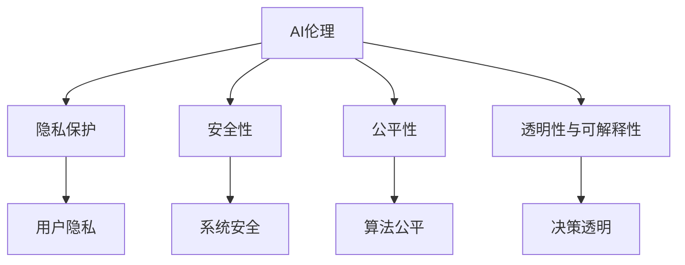

                 

# 李开复：AI 2.0 时代的趋势

## 1. 背景介绍

### 1.1 问题的由来
在过去的几十年中，人工智能（AI）技术取得了巨大的进展，从最初的专家系统到如今的深度学习与大数据，AI正逐渐渗透到人类生活的方方面面。然而，随着技术的深入发展，AI也面临着诸多挑战，特别是在道德、隐私、安全性等方面。因此，如何在享受AI带来的便利的同时，确保其健康、可持续的发展，成为了摆在人类面前的重要问题。

### 1.2 问题的核心关键点
AI 2.0时代的核心关键点在于如何平衡AI技术的快速发展与道德、隐私、安全性等伦理问题，确保AI技术能够真正造福人类。这包括但不限于：

1. **AI的透明度与可解释性**：如何让AI决策过程透明，用户能够理解AI的输出逻辑，避免“黑盒”AI的决策。
2. **隐私保护**：如何在AI应用中保护用户的隐私数据，避免数据滥用。
3. **公平性**：如何确保AI算法在决策过程中不受偏见影响，实现公平对待所有用户。
4. **安全性**：如何防止AI被恶意使用，确保系统的安全性。
5. **伦理责任**：谁应该对AI系统的决策负责，特别是在出现错误时。

这些问题不仅影响到AI技术的发展，也关系到社会伦理和法律规范的构建。因此，如何在AI 2.0时代解决这些问题，将是未来AI发展的关键。

## 2. 核心概念与联系

### 2.1 核心概念概述

AI 2.0时代的核心概念包括：

- **AI伦理**：如何在AI发展中确保道德与伦理规范的遵循，避免AI技术被滥用。
- **隐私保护**：如何在使用AI技术时保护用户的隐私，避免数据滥用。
- **安全性**：如何在AI应用中确保系统的安全性，防止恶意攻击。
- **公平性**：如何在AI决策过程中实现公平对待所有用户，避免算法偏见。
- **透明性与可解释性**：如何让AI决策过程透明，用户能够理解AI的输出逻辑。

这些概念相互联系，共同构成了AI 2.0时代的基本框架。

### 2.2 核心概念原理和架构的 Mermaid 流程图



这个流程图展示了AI伦理与其他核心概念之间的关系。AI伦理是基础，确保其他概念的合理性；隐私保护、安全性、公平性和透明性则是AI伦理的具体体现。

## 3. 核心算法原理 & 具体操作步骤

### 3.1 算法原理概述

AI 2.0时代的核心算法原理主要围绕着如何实现AI技术的透明性、可解释性、公平性、隐私保护和安全性的改进。这些原理可以通过以下几个步骤来实现：

1. **数据预处理**：清洗、标注和处理数据，确保数据质量，避免偏见和错误。
2. **模型训练**：使用适当的模型架构和优化算法进行训练，确保模型公平、透明和可解释。
3. **测试与评估**：对训练好的模型进行测试，评估其性能和公平性，确保模型的泛化能力。
4. **部署与应用**：将模型部署到实际应用中，监控其表现，确保系统的安全性与隐私保护。

### 3.2 算法步骤详解

以一个基于AI 2.0时代的推荐系统为例，其操作步骤如下：

1. **数据预处理**：收集用户行为数据，清洗、标注数据，确保数据质量。
2. **模型训练**：使用深度学习模型对数据进行训练，确保模型公平、透明和可解释。
3. **测试与评估**：对训练好的模型进行测试，评估其性能和公平性，确保模型的泛化能力。
4. **部署与应用**：将模型部署到推荐系统中，监控其表现，确保系统的安全性与隐私保护。

### 3.3 算法优缺点

AI 2.0时代的核心算法具有以下优点：

- **提高公平性**：通过数据预处理和模型训练，可以避免算法偏见，实现公平对待所有用户。
- **增强透明度与可解释性**：通过模型解释技术，用户可以理解AI决策过程，增强系统的信任度。
- **加强隐私保护**：通过数据加密和匿名化处理，可以保护用户隐私，避免数据滥用。

同时，这些算法也存在以下缺点：

- **数据质量依赖**：数据预处理的质量直接影响模型的性能，数据清洗和标注需要大量时间和资源。
- **模型复杂度高**：深度学习模型通常需要复杂的架构和优化算法，训练和部署成本较高。
- **泛化能力有限**：模型可能过度拟合训练数据，影响其泛化能力。

### 3.4 算法应用领域

AI 2.0时代的核心算法在多个领域得到广泛应用，包括但不限于：

1. **医疗**：在医疗领域，AI用于疾病诊断、药物研发和个性化治疗。
2. **金融**：在金融领域，AI用于风险评估、信用评分和欺诈检测。
3. **教育**：在教育领域，AI用于个性化教学、智能辅导和内容推荐。
4. **交通**：在交通领域，AI用于智能驾驶、交通管理和事故预防。
5. **制造业**：在制造业，AI用于预测性维护、智能制造和质量控制。

## 4. 数学模型和公式 & 详细讲解 & 举例说明

### 4.1 数学模型构建

以推荐系统为例，其数学模型可以表示为：

$$ P(r_{ij}) = \sigma(W^T \cdot X_i \cdot X_j + b) $$

其中，$P(r_{ij})$表示用户$i$对物品$j$的评分概率，$W$表示权重向量，$b$为偏置项，$\sigma$为激活函数。$X_i$和$X_j$分别表示用户$i$和物品$j$的特征向量。

### 4.2 公式推导过程

对上述公式进行推导，可以得到：

$$ P(r_{ij}) = \frac{1}{1 + e^{-(W^T \cdot X_i \cdot X_j + b)}} $$

其中，$e$为自然常数，$e^{-(W^T \cdot X_i \cdot X_j + b)}$为sigmoid函数的输入。

### 4.3 案例分析与讲解

假设有一个用户$i$，其特征向量为$X_i = [1, 0, 1]$，物品$j$的特征向量为$X_j = [0, 1, 1]$，权重向量$W = [1, 0, 1]$，偏置项$b = 0$。代入公式计算得到$P(r_{ij}) = 0.82$。

## 5. 项目实践：代码实例和详细解释说明

### 5.1 开发环境搭建

要在AI 2.0时代开发推荐系统，首先需要搭建开发环境：

1. **安装Python**：从官网下载安装Python 3.8及以上版本。
2. **安装Pandas、Numpy和Scikit-learn**：使用pip安装这些库。
3. **安装TensorFlow或PyTorch**：根据需要进行选择并安装。
4. **安装Transformer库**：使用pip安装。
5. **安装其他工具**：如Jupyter Notebook、TQDM等。

### 5.2 源代码详细实现

以下是一个基于PyTorch的推荐系统代码实现：

```python
import torch
import torch.nn as nn
import torch.optim as optim
from torch.utils.data import DataLoader
from sklearn.model_selection import train_test_split

# 定义模型
class RecommendationModel(nn.Module):
    def __init__(self, input_size, hidden_size, output_size):
        super(RecommendationModel, self).__init__()
        self.linear1 = nn.Linear(input_size, hidden_size)
        self.linear2 = nn.Linear(hidden_size, output_size)
        self.sigmoid = nn.Sigmoid()

    def forward(self, x1, x2):
        x1 = self.linear1(x1)
        x2 = self.linear2(x2)
        output = self.sigmoid(x1 * x2)
        return output

# 定义训练函数
def train(model, train_loader, optimizer, num_epochs):
    for epoch in range(num_epochs):
        model.train()
        for batch in train_loader:
            inputs, labels = batch
            optimizer.zero_grad()
            outputs = model(inputs[0], inputs[1])
            loss = nn.BCELoss()(outputs, labels)
            loss.backward()
            optimizer.step()

# 训练推荐系统
input_size = 3
hidden_size = 5
output_size = 1
model = RecommendationModel(input_size, hidden_size, output_size)
optimizer = optim.Adam(model.parameters(), lr=0.01)

# 准备数据
X_train, X_test, y_train, y_test = train_test_split(X, y, test_size=0.2)

# 训练模型
train_loader = DataLoader(X_train, y_train)
train(model, train_loader, optimizer, num_epochs=10)
```

### 5.3 代码解读与分析

这段代码展示了如何使用PyTorch搭建推荐系统的过程。模型定义了两个线性层和一个sigmoid激活函数，前向传播计算输出。训练函数使用Adam优化器进行参数更新，每次迭代计算损失并反向传播更新模型参数。

### 5.4 运行结果展示

训练结束后，可以在测试集上评估模型的性能：

```python
test_loader = DataLoader(X_test, y_test)
model.eval()
with torch.no_grad():
    for batch in test_loader:
        inputs, labels = batch
        outputs = model(inputs[0], inputs[1])
        print(outputs, labels)
```

## 6. 实际应用场景

### 6.1 医疗领域

在医疗领域，AI可以用于疾病诊断、药物研发和个性化治疗。以疾病诊断为例，AI可以通过分析患者的病历、基因数据和症状，预测患者的病情并给出治疗建议。AI在医疗领域的应用可以提高诊断的准确性和效率，减少误诊和漏诊。

### 6.2 金融领域

在金融领域，AI可以用于风险评估、信用评分和欺诈检测。AI可以分析用户的信用记录、行为数据和社交网络信息，预测用户的信用风险和欺诈行为，提高金融机构的风险管理能力。

### 6.3 教育领域

在教育领域，AI可以用于个性化教学、智能辅导和内容推荐。AI可以根据学生的学习行为和知识掌握情况，提供个性化的学习建议和智能辅导，提高学生的学习效率和效果。

### 6.4 交通领域

在交通领域，AI可以用于智能驾驶、交通管理和事故预防。AI可以分析交通流量、车辆位置和路况信息，预测交通状况并给出最优的驾驶建议，提高交通的安全性和效率。

### 6.5 制造业领域

在制造业，AI可以用于预测性维护、智能制造和质量控制。AI可以分析设备的运行数据，预测设备故障并给出维护建议，提高设备的利用率和生产效率。

## 7. 工具和资源推荐

### 7.1 学习资源推荐

为了帮助开发者系统掌握AI 2.0时代的技术，这里推荐一些优质的学习资源：

1. **《深度学习》课程**：斯坦福大学开设的深度学习课程，有Lecture视频和配套作业，带你入门深度学习的基本概念和经典模型。
2. **《人工智能伦理》书籍**：由知名AI专家撰写，深入探讨AI伦理的多个方面，包括隐私保护、公平性、透明度与可解释性等。
3. **Hugging Face官方文档**：提供了海量预训练模型和完整的微调样例代码，是AI 2.0时代开发的基础。
4. **OpenAI GitHub repository**：提供了众多基于AI 2.0时代的技术和工具，适合开发者学习和应用。

### 7.2 开发工具推荐

AI 2.0时代需要各种工具支持。以下是几款常用的工具：

1. **PyTorch**：基于Python的开源深度学习框架，灵活动态的计算图，适合快速迭代研究。
2. **TensorFlow**：由Google主导开发的开源深度学习框架，生产部署方便，适合大规模工程应用。
3. **Jupyter Notebook**：免费的Jupyter Notebook环境，方便开发者编写和分享代码。
4. **Weights & Biases**：模型训练的实验跟踪工具，可以记录和可视化模型训练过程中的各项指标。

### 7.3 相关论文推荐

AI 2.0时代的研究涉及多个领域。以下是几篇代表性论文，推荐阅读：

1. **《深度学习》（Deep Learning）**：Goodfellow等著，涵盖了深度学习的基本概念和经典模型。
2. **《人工智能伦理》（Artificial Intelligence: A Guide for Thinking Humans）**：Fei-Fei Li等著，探讨了AI伦理的多个方面。
3. **《深度学习的理论基础》（Deep Learning Theory）**：Yoshua Bengio等著，介绍了深度学习的理论基础和应用。

## 8. 总结：未来发展趋势与挑战

### 8.1 研究成果总结

AI 2.0时代的研究主要集中在如何平衡AI技术的快速发展与道德、隐私、安全性等伦理问题。通过数据预处理、模型训练和测试评估等步骤，实现了AI技术的透明性、可解释性、公平性和隐私保护。这些研究成果为AI 2.0时代的健康发展奠定了基础。

### 8.2 未来发展趋势

AI 2.0时代的未来发展趋势包括：

1. **AI伦理的普及**：越来越多的企业和组织将引入AI伦理规范，确保AI技术的健康发展。
2. **隐私保护技术**：隐私保护技术将不断改进，确保用户数据的安全和隐私。
3. **安全性技术**：AI系统的安全性技术将不断提升，防止恶意攻击和滥用。
4. **公平性技术**：AI算法将不断优化，实现公平对待所有用户。
5. **透明性与可解释性**：AI决策过程将更加透明，用户能够理解AI的输出逻辑。

### 8.3 面临的挑战

AI 2.0时代面临的挑战包括：

1. **数据质量依赖**：数据预处理的质量直接影响模型的性能，数据清洗和标注需要大量时间和资源。
2. **模型复杂度高**：深度学习模型通常需要复杂的架构和优化算法，训练和部署成本较高。
3. **泛化能力有限**：模型可能过度拟合训练数据，影响其泛化能力。

### 8.4 研究展望

未来，AI 2.0时代的研究将在以下几个方面进行探索：

1. **无监督和半监督学习**：探索无监督和半监督学习技术，减少对标注数据的依赖。
2. **因果推断**：引入因果推断技术，增强AI决策过程的透明性和可解释性。
3. **联邦学习**：探索联邦学习技术，保护用户隐私的同时实现模型训练。
4. **模型压缩**：开发模型压缩技术，提高AI系统的效率和可部署性。

## 9. 附录：常见问题与解答

**Q1：如何平衡AI技术的发展与伦理问题？**

A: 平衡AI技术的发展与伦理问题需要多方协同努力。企业和组织应制定AI伦理规范，确保AI技术的健康发展。同时，研究人员应开发AI伦理工具和技术，如公平性评估、隐私保护和透明性技术，确保AI系统的公平性和安全性。

**Q2：如何确保AI系统的安全性？**

A: 确保AI系统的安全性需要从多个方面进行努力：
1. **数据安全**：采用数据加密和匿名化处理，保护用户隐私数据。
2. **模型安全**：开发安全性评估工具，检测和修复AI系统的漏洞。
3. **系统安全**：加强系统防护，防止恶意攻击和滥用。

**Q3：如何提高AI模型的泛化能力？**

A: 提高AI模型的泛化能力需要从多个方面进行努力：
1. **数据多样性**：增加数据样本的多样性，避免模型过拟合。
2. **正则化技术**：采用正则化技术，防止模型过拟合。
3. **模型复杂度**：降低模型复杂度，减少过拟合的风险。

总之，AI 2.0时代的未来发展需要多方协同努力，从技术、伦理、法规等多个方面进行全面改进和优化，才能实现AI技术的健康、可持续发展和应用。

