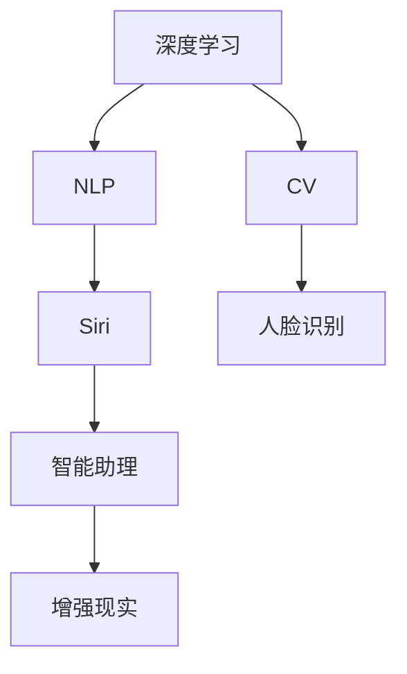

                 

# 李开复：苹果发布AI应用的产业

## 1. 背景介绍

苹果公司（Apple Inc.）作为全球知名的科技公司，不仅在硬件和操作系统领域领先，其在人工智能（AI）应用的产业生态构建上也处于前沿位置。2021年4月，苹果公司发布了最新版本的iOS 15操作系统，其中整合了多项AI应用，如人脸识别、隐私保护、Siri等，展示了苹果在AI技术应用上的创新能力和市场影响力。本文将从背景、核心概念与联系、算法原理与操作步骤、数学模型与公式讲解、项目实践与代码实例、实际应用场景、工具与资源推荐、总结与未来展望、常见问题与解答等多个维度，深入探讨苹果公司如何通过AI应用构建其产业生态，并展望未来AI应用的发展方向。

## 2. 核心概念与联系

### 2.1 核心概念概述

苹果公司的AI应用产业主要涉及以下核心概念：

- **人工智能（AI）**：通过数据驱动的算法和模型，实现自动化决策和智能交互的技术。
- **深度学习（Deep Learning）**：一种基于神经网络的机器学习方法，用于处理大规模、复杂的数据集。
- **自然语言处理（NLP）**：使计算机能够理解、处理和生成自然语言的技术。
- **计算机视觉（CV）**：使计算机能够识别、分析图像和视频数据的算法和模型。
- **增强现实（AR）**：通过虚拟物体与现实世界的交互，提供沉浸式的体验。

这些概念之间相互关联，共同构成了苹果公司AI应用产业的基础。深度学习作为核心技术，推动了NLP、CV等应用的发展；NLP和CV的应用，又进一步丰富了AI技术的实践领域，如Siri、人脸识别、智能助理等。

### 2.2 核心概念原理和架构的 Mermaid 流程图



## 3. 核心算法原理 & 具体操作步骤

### 3.1 算法原理概述

苹果公司在其AI应用中，广泛使用了深度学习技术。深度学习通过多层神经网络结构，自动学习数据的特征表示，从而实现复杂的任务。其核心算法包括：

- **卷积神经网络（CNN）**：用于图像处理和计算机视觉任务。
- **循环神经网络（RNN）**：用于处理序列数据，如自然语言处理。
- **自编码器（Autoencoder）**：用于数据压缩和降维。
- **生成对抗网络（GAN）**：用于生成新的数据样本。

这些算法通过协同工作，实现了苹果公司各种AI应用的功能。例如，在Siri中，语音识别使用RNN，自然语言理解使用LSTM或Transformer，最终生成自然语言回复。

### 3.2 算法步骤详解

苹果公司的AI应用开发流程主要包括以下几个步骤：

1. **数据收集与预处理**：收集和整理大规模的标注数据，进行数据清洗和预处理。
2. **模型设计与训练**：根据任务需求，设计相应的深度学习模型，使用标注数据进行训练。
3. **模型评估与优化**：在验证集上评估模型性能，根据评估结果调整模型参数，进行超参数调优。
4. **模型集成与部署**：将训练好的模型集成到应用中，进行部署和优化，确保其在实际环境下的性能和稳定性。

### 3.3 算法优缺点

苹果公司AI应用的优点包括：

- **高性能**：深度学习模型在图像识别、语音识别等任务上表现优异，达到了行业领先水平。
- **用户体验**：AI应用如Siri、人脸识别等，显著提升了用户体验，增强了产品竞争力。
- **创新性**：通过跨领域的AI技术应用，苹果公司不断推出创新产品，如增强现实眼镜等。

缺点包括：

- **数据依赖**：AI应用的性能很大程度上依赖于标注数据的质量和数量，获取高质量标注数据的成本较高。
- **计算资源需求高**：深度学习模型的训练和推理需要大量的计算资源，对硬件要求较高。
- **隐私问题**：AI应用涉及用户数据，如何保护用户隐私是一个重要问题。

### 3.4 算法应用领域

苹果公司AI应用的领域广泛，涉及：

- **智能手机**：如人脸解锁、人脸识别支付等。
- **智能助理**：如Siri，自然语言处理和智能语音交互。
- **增强现实**：如AR眼镜，将虚拟对象叠加到现实世界中。
- **计算机视觉**：如图像识别、物体检测等。

## 4. 数学模型和公式 & 详细讲解 & 举例说明

### 4.1 数学模型构建

苹果公司AI应用的数学模型主要基于神经网络。以Siri语音识别为例，其核心模型是卷积神经网络和循环神经网络的结合，用于处理语音信号和自然语言。

### 4.2 公式推导过程

以Siri语音识别为例，公式推导过程如下：

1. **语音信号预处理**：将语音信号转换为梅尔频谱图，计算梅尔倒谱系数（MFCC）。
2. **卷积神经网络（CNN）特征提取**：使用卷积层和池化层提取梅尔倒谱系数的特征。
3. **循环神经网络（RNN）序列建模**：使用LSTM或GRU等循环神经网络对特征序列进行建模。
4. **全连接层分类**：使用全连接层将模型输出映射到不同的语音命令类别。

### 4.3 案例分析与讲解

以苹果公司Siri语音识别为例，其核心技术包括以下几个步骤：

1. **语音信号采集与预处理**：通过麦克风采集用户的语音信号，进行预处理，如降噪、滤波、归一化等。
2. **梅尔倒谱系数（MFCC）提取**：将预处理后的语音信号转换为MFCC，提取其特征。
3. **卷积神经网络（CNN）特征提取**：使用CNN对MFCC特征进行特征提取，提取关键特征。
4. **循环神经网络（RNN）序列建模**：使用LSTM对特征序列进行建模，捕捉语音信号的时序信息。
5. **全连接层分类**：使用全连接层将模型输出映射到不同的语音命令类别，进行分类。

## 5. 项目实践：代码实例和详细解释说明

### 5.1 开发环境搭建

苹果公司AI应用的开发环境主要包括：

- **硬件设备**：高性能CPU、GPU、TPU等硬件设备，用于深度学习模型的训练和推理。
- **软件工具**：PyTorch、TensorFlow、Keras等深度学习框架，以及苹果公司开发的Core ML等模型压缩工具。

### 5.2 源代码详细实现

以Siri语音识别为例，使用TensorFlow进行模型的实现，主要代码如下：

```python
import tensorflow as tf
from tensorflow.keras import layers

# 定义模型
model = tf.keras.Sequential([
    layers.Conv2D(32, (3, 3), activation='relu', input_shape=(128, 128, 1)),
    layers.MaxPooling2D((2, 2)),
    layers.Conv2D(64, (3, 3), activation='relu'),
    layers.MaxPooling2D((2, 2)),
    layers.Flatten(),
    layers.Dense(128, activation='relu'),
    layers.Dense(10, activation='softmax')
])

# 编译模型
model.compile(optimizer='adam', loss='sparse_categorical_crossentropy', metrics=['accuracy'])

# 训练模型
model.fit(train_data, train_labels, epochs=10, validation_data=(test_data, test_labels))
```

### 5.3 代码解读与分析

上述代码中，首先定义了一个简单的卷积神经网络模型，包含卷积层、池化层、全连接层等。然后使用`compile`函数编译模型，设置优化器、损失函数和评估指标。最后使用`fit`函数训练模型，在训练集上进行训练，在验证集上进行评估。

### 5.4 运行结果展示

训练完成后，可以在测试集上评估模型性能，得到模型精度和损失函数的值。

## 6. 实际应用场景

### 6.1 智能助理

Siri作为苹果公司最知名的智能助理，其核心技术基于自然语言处理（NLP）。通过深度学习模型，Siri能够理解和处理用户的自然语言输入，执行语音命令。用户可以通过语音指令与Siri进行交互，如设置闹钟、发送信息、查询天气等。

### 6.2 增强现实

增强现实（AR）技术在苹果公司得到广泛应用，如AR眼镜。通过计算机视觉和深度学习技术，AR眼镜可以实时将虚拟对象叠加到现实世界中，实现沉浸式体验。

### 6.3 人脸识别

苹果公司的人脸识别技术广泛应用于iPhone和iPad等设备中。用户可以通过人脸解锁手机，进行支付等操作。人脸识别技术基于深度学习算法，通过大量人脸数据进行训练，实现了高精度的人脸识别。

### 6.4 未来应用展望

苹果公司未来的AI应用将更加广泛和深入，以下是一些可能的未来应用：

- **医疗**：通过AI技术进行疾病诊断、个性化医疗等，提升医疗服务水平。
- **交通**：利用计算机视觉和自动驾驶技术，提升交通安全和效率。
- **教育**：通过智能助教、个性化学习推荐等，提升教育质量和公平性。

## 7. 工具和资源推荐

### 7.1 学习资源推荐

- **深度学习入门**：《深度学习入门：基于TensorFlow的实践》一书，适合初学者入门。
- **NLP与CV教程**：Coursera上的NLP与计算机视觉课程，由斯坦福大学教授讲授。
- **TensorFlow官方文档**：TensorFlow的官方文档，提供了详细的教程和代码示例。

### 7.2 开发工具推荐

- **PyTorch**：基于Python的深度学习框架，适合研究和实验。
- **TensorFlow**：Google开发的深度学习框架，生产部署方便。
- **Keras**：高层API，易于使用，适合快速原型开发。

### 7.3 相关论文推荐

- **卷积神经网络**：LeCun等，《Convolutional Networks for Images, Speech, and Time Series》。
- **循环神经网络**：Hochreiter等，《Long Short-Term Memory》。
- **生成对抗网络**：Goodfellow等，《Generative Adversarial Nets》。

## 8. 总结：未来发展趋势与挑战

### 8.1 研究成果总结

苹果公司通过深度学习技术，构建了强大的AI应用生态，提升了用户体验，增强了产品竞争力。未来，苹果公司将继续在AI领域进行创新和探索。

### 8.2 未来发展趋势

未来AI应用的趋势包括：

- **AI与IoT融合**：AI技术与物联网设备的融合，实现更智能的生活场景。
- **AI伦理与安全**：如何保护用户隐私和数据安全，避免AI技术的滥用。
- **跨领域AI**：AI技术在医疗、金融、教育等领域的广泛应用，提升各行业的效率和质量。

### 8.3 面临的挑战

苹果公司AI应用面临的挑战包括：

- **数据隐私保护**：如何保护用户隐私，避免数据泄露和滥用。
- **计算资源需求**：AI应用的计算需求高，如何优化资源使用。
- **模型可解释性**：如何增强AI模型的可解释性，提升用户信任度。

### 8.4 研究展望

未来AI研究需要在以下几个方面进行突破：

- **无监督学习**：如何从大量未标注数据中学习，减少对标注数据的依赖。
- **少样本学习**：如何在少量样本情况下，实现高效的AI训练。
- **多模态融合**：如何结合视觉、语音、文本等多模态数据，提升AI应用的全面性。

## 9. 附录：常见问题与解答

**Q1：苹果公司为何要推出AI应用？**

A: 苹果公司推出AI应用，主要是为了提升用户体验，增强产品竞争力。AI应用如Siri、人脸识别等，能够显著提升用户操作便捷性和安全性。

**Q2：苹果公司AI应用的优缺点有哪些？**

A: 苹果公司AI应用的优点包括高性能、用户体验好、创新性强等。缺点包括数据依赖高、计算资源需求高、隐私问题等。

**Q3：苹果公司未来在AI领域的发展方向是什么？**

A: 苹果公司未来在AI领域的发展方向包括AI与IoT融合、AI伦理与安全、跨领域AI等。

**Q4：苹果公司AI应用面临的主要挑战有哪些？**

A: 苹果公司AI应用面临的主要挑战包括数据隐私保护、计算资源需求、模型可解释性等。

---

作者：禅与计算机程序设计艺术 / Zen and the Art of Computer Programming

