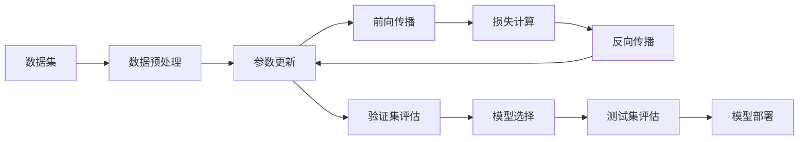

                 

## 1. 背景介绍

人工智能(AI)正逐步渗透到我们生活的方方面面，带来了无数的创新和变革。李开复，作为世界级的人工智能专家和科技创业者，一直在推动AI技术的发展和应用。他的观点和见解，无论对于学术界还是产业界，都具有重要的参考价值。近期，他对于苹果公司发布的AI应用发表了一系列看法，值得我们深入思考。

### 1.1 苹果AI应用的背景

苹果公司（Apple）在AI领域的布局已久，推出了一系列的应用和服务，如Siri语音助手、Face ID人脸识别、天气预测等。这些应用不仅提升了用户体验，也为AI技术在消费电子产品的普及奠定了基础。

2023年9月，苹果发布了新一代的AI应用——全新AI芯片M2芯片和操作系统iOS 17，进一步加强了其在AI领域的布局。

### 1.2 苹果AI应用的现状

当前，苹果的AI应用主要集中在以下几个领域：

- **Siri**：智能语音助手，提供自然语言处理和语义理解功能。
- **Face ID**：基于人脸识别技术的安全解锁方案。
- **天气预测**：通过深度学习模型分析气象数据，提供精准天气预报。
- **健康监测**：利用机器学习算法监测健康数据，提供个性化健康建议。
- **自动驾驶**：通过车联网和AI技术，实现智能驾驶辅助功能。

这些应用展示了苹果在AI技术上的深耕和创新，为用户提供了便捷高效的使用体验。

## 2. 核心概念与联系

### 2.1 核心概念概述

要全面理解李开复对于苹果AI应用的看法，需要首先明确一些核心概念及其联系：

- **人工智能(AI)**：通过算法和计算技术，使计算机具备类似人类的智能，实现对复杂问题的分析和决策。
- **机器学习(Machine Learning, ML)**：利用数据和算法训练模型，使机器能够自主学习和改进。
- **深度学习(Deep Learning, DL)**：一种特殊的机器学习方法，通过构建多层神经网络，实现对高维度数据的自动提取和表示。
- **自然语言处理(Natural Language Processing, NLP)**：使计算机能够理解、处理和生成人类语言的技术。
- **计算机视觉(Computer Vision, CV)**：使计算机能够从图像和视频中提取信息的技术。

这些概念紧密联系，共同构成了AI技术的基础架构。深度学习是当前AI领域的主流技术，自然语言处理和计算机视觉是AI应用的主要方向。

### 2.2 核心概念的联系

以下是一个简化的Mermaid流程图，展示了核心概念之间的联系：

```mermaid
graph LR
    A[人工智能(AI)] --> B[机器学习(ML)]
    B --> C[深度学习(DL)]
    A --> D[自然语言处理(NLP)]
    A --> E[计算机视觉(CV)]
    C --> D
    C --> E
```

从图中可以看出，机器学习是连接人工智能和具体应用技术（如深度学习、自然语言处理、计算机视觉）的桥梁，深度学习是机器学习的高级形式。自然语言处理和计算机视觉是AI应用的主要方向，深度学习在其中扮演了关键角色。

## 3. 核心算法原理 & 具体操作步骤

### 3.1 算法原理概述

李开复在谈及苹果AI应用时，多次提到深度学习模型的核心原理。深度学习模型通过多层神经网络，自动提取输入数据的高维度特征表示，进而实现对复杂数据的建模和预测。

以自然语言处理为例，深度学习模型可以通过文本嵌入将文本数据转化为向量表示，并通过多层RNN或Transformer网络进行语义理解和生成。

### 3.2 算法步骤详解

以下是一个简化的深度学习模型训练过程的流程图：



具体步骤如下：

1. **数据预处理**：对原始数据进行清洗、归一化、分词等处理，转换为模型可以处理的格式。
2. **模型初始化**：选择合适的深度学习模型架构，并进行随机初始化。
3. **前向传播**：将数据输入模型，通过多层网络进行特征提取和表示。
4. **损失计算**：计算模型预测结果与真实标签之间的差异，得到损失函数。
5. **反向传播**：根据损失函数对模型参数进行反向传播，更新权重。
6. **验证集评估**：在验证集上评估模型性能，避免过拟合。
7. **模型选择**：选择性能最佳的模型。
8. **测试集评估**：在测试集上进一步评估模型性能，确保模型泛化能力。
9. **模型部署**：将训练好的模型部署到实际应用中。

### 3.3 算法优缺点

深度学习模型的优点包括：

- **自适应性强**：通过大规模数据训练，能够自动提取复杂特征。
- **泛化能力强**：在大型数据集上训练得到的模型，可以很好地泛化到新数据。
- **端到端训练**：从数据输入到输出，可以自动完成所有步骤，无需手工特征提取。

然而，深度学习模型也存在一些缺点：

- **计算资源需求高**：需要大量计算资源进行训练和推理。
- **可解释性差**：黑箱模型难以解释其内部工作机制。
- **数据依赖性高**：模型性能依赖于数据的质量和数量。

## 4. 数学模型和公式 & 详细讲解 & 举例说明

### 4.1 数学模型构建

深度学习模型的核心是神经网络，其数学模型通常包含输入层、隐藏层和输出层。

- **输入层**：将原始数据转换为向量表示。
- **隐藏层**：通过多个神经元进行特征提取和表示。
- **输出层**：将特征表示转换为目标输出。

以自然语言处理为例，常见的模型架构包括RNN、LSTM、GRU、Transformer等。

### 4.2 公式推导过程

以Transformer模型为例，其数学模型可以表示为：

$$
\mathbf{H} = \mathbf{W}_Q \mathbf{X} \mathbf{Q} + \mathbf{b}_Q
$$
$$
\mathbf{K} = \mathbf{W}_K \mathbf{X} \mathbf{K} + \mathbf{b}_K
$$
$$
\mathbf{V} = \mathbf{W}_V \mathbf{X} \mathbf{V} + \mathbf{b}_V
$$
$$
\mathbf{E} = softmax(\frac{1}{\sqrt{d_k}} \mathbf{Q} \mathbf{K}^T) \mathbf{V}
$$

其中，$\mathbf{H}$、$\mathbf{K}$、$\mathbf{V}$分别为输入、关键和值向量，$\mathbf{X}$为输入矩阵，$\mathbf{W}_Q$、$\mathbf{W}_K$、$\mathbf{W}_V$为权重矩阵，$\mathbf{b}_Q$、$\mathbf{b}_K$、$\mathbf{b}_V$为偏置项。

### 4.3 案例分析与讲解

以天气预测模型为例，其输入为历史气象数据，输出为未来气象条件。

- **数据预处理**：对原始气象数据进行归一化、降噪等处理。
- **模型初始化**：选择合适的深度学习模型，如LSTM或GRU。
- **训练过程**：通过历史数据训练模型，自动提取特征。
- **测试评估**：在测试集上评估模型性能，确保模型泛化能力。

## 5. 项目实践：代码实例和详细解释说明

### 5.1 开发环境搭建

为了进行深度学习模型的开发和训练，需要搭建一个支持Python和深度学习框架的开发环境。以下是搭建开发环境的具体步骤：

1. **安装Anaconda**：从官网下载并安装Anaconda，用于创建独立的Python环境。
2. **创建虚拟环境**：
```bash
conda create -n pytorch-env python=3.8 
conda activate pytorch-env
```
3. **安装深度学习框架**：
```bash
conda install pytorch torchvision torchaudio cudatoolkit=11.1 -c pytorch -c conda-forge
```
4. **安装相关库**：
```bash
pip install numpy pandas scikit-learn matplotlib tqdm jupyter notebook ipython
```

### 5.2 源代码详细实现

以下是一个使用PyTorch框架进行天气预测的代码实现：

```python
import torch
import torch.nn as nn
import torch.optim as optim
from torch.utils.data import DataLoader, TensorDataset

class LSTMModel(nn.Module):
    def __init__(self, input_size, hidden_size, output_size):
        super(LSTMModel, self).__init__()
        self.hidden_size = hidden_size
        self.lstm = nn.LSTM(input_size, hidden_size)
        self.fc = nn.Linear(hidden_size, output_size)
    
    def forward(self, x):
        h0 = torch.zeros(1, 1, self.hidden_size).to(device)
        c0 = torch.zeros(1, 1, self.hidden_size).to(device)
        out, _ = self.lstm(x, (h0, c0))
        out = self.fc(out[:, -1, :])
        return out

# 准备数据
X_train = ...
y_train = ...
X_test = ...
y_test = ...

# 模型初始化
model = LSTMModel(input_size, hidden_size, output_size).to(device)

# 优化器
optimizer = optim.Adam(model.parameters(), lr=learning_rate)

# 训练过程
for epoch in range(num_epochs):
    model.train()
    optimizer.zero_grad()
    outputs = model(X_train)
    loss = nn.MSELoss()(outputs, y_train)
    loss.backward()
    optimizer.step()

# 测试评估
model.eval()
with torch.no_grad():
    outputs = model(X_test)
    loss = nn.MSELoss()(outputs, y_test)
    print(loss.item())

# 部署模型
model.eval()
with torch.no_grad():
    outputs = model(X_test)
    print(outputs)
```

### 5.3 代码解读与分析

以上代码展示了使用LSTM模型进行天气预测的完整流程。关键步骤如下：

- **模型初始化**：定义LSTM模型，并指定输入、隐藏和输出维度。
- **数据准备**：准备训练和测试数据集。
- **模型训练**：使用Adam优化器进行模型训练，计算损失函数并反向传播。
- **模型评估**：在测试集上评估模型性能。
- **模型部署**：将模型导出为可部署的模型文件。

## 6. 实际应用场景

### 6.1 智能家居

苹果的AI应用已经广泛应用于智能家居领域。通过深度学习模型，智能家居系统能够识别用户的行为模式，并自动调整家居设备，提供个性化的舒适体验。

- **语音助手**：Siri语音助手通过深度学习模型理解用户语音指令，进行智能回答和操作。
- **设备联动**：根据用户的行为习惯，智能家居系统自动控制照明、温度、音乐等设备，提供便捷和舒适的家居体验。

### 6.2 自动驾驶

自动驾驶技术是苹果AI应用的另一个重要领域。通过车联网和AI技术，苹果正在开发全自动驾驶系统。

- **环境感知**：利用计算机视觉和深度学习模型，对驾驶环境进行实时感知和分析。
- **决策规划**：通过深度学习模型，生成最优的驾驶策略和路径规划，确保行车安全。
- **系统集成**：将多种AI应用集成到车辆中，实现自动驾驶功能。

### 6.3 健康监测

苹果在健康监测领域的AI应用，通过深度学习模型，为用户提供个性化的健康建议和服务。

- **生物识别**：利用Face ID人脸识别技术，实现健康数据的自动采集和分析。
- **健康分析**：通过深度学习模型，分析用户的健康数据，提供个性化的健康建议。
- **紧急呼叫**：在用户出现紧急情况时，自动拨打急救电话，提供及时的医疗救援。

### 6.4 未来应用展望

未来，苹果的AI应用将会在更多领域得到应用，带来更多的创新和变革。

- **智能医疗**：通过AI技术，提升医疗诊断和治疗的准确性和效率，提高医疗服务质量。
- **智能交通**：利用AI技术，优化交通管理和调度，减少交通拥堵和事故发生率。
- **智能制造**：通过AI技术，实现工业自动化和智能化，提高生产效率和产品质量。
- **智能金融**：利用AI技术，进行风险评估和投资分析，提供智能金融服务。

## 7. 工具和资源推荐

### 7.1 学习资源推荐

为了深入理解苹果AI应用的技术细节，以下是一些推荐的资源：

1. **深度学习课程**：如斯坦福大学的CS231n《深度学习与计算机视觉》课程，提供系统性的深度学习知识体系。
2. **AI应用案例分析**：阅读关于苹果AI应用的案例分析文章，了解其实现技术和应用场景。
3. **深度学习框架文档**：阅读PyTorch、TensorFlow等深度学习框架的官方文档，掌握其使用方法和最佳实践。
4. **开源项目**：参与开源深度学习项目，积累实际开发经验。

### 7.2 开发工具推荐

以下是一些推荐的深度学习开发工具：

1. **PyTorch**：开源深度学习框架，支持GPU加速，使用便捷。
2. **TensorFlow**：谷歌开源的深度学习框架，支持大规模分布式训练。
3. **Keras**：基于TensorFlow和Theano的高级深度学习框架，易于上手。
4. **MXNet**：由亚马逊开发的深度学习框架，支持多种编程语言。
5. **JAX**：基于NumPy的深度学习框架，支持自动微分和高效的GPU加速。

### 7.3 相关论文推荐

以下是几篇关于深度学习和AI应用的经典论文，值得深入阅读：

1. **《ImageNet Classification with Deep Convolutional Neural Networks》**：AlexNet论文，介绍了深度学习在图像分类任务中的应用。
2. **《Long Short-Term Memory》**：LSTM论文，介绍了长短期记忆网络在序列建模中的应用。
3. **《Attention is All You Need》**：Transformer论文，介绍了自注意力机制在深度学习中的应用。
4. **《A Survey on Attention Mechanisms in Deep Learning》**：综述论文，总结了注意力机制在深度学习中的应用和发展。

## 8. 总结：未来发展趋势与挑战

### 8.1 总结

李开复对于苹果AI应用的看法，为我们提供了深入思考的视角。通过分析苹果AI应用的现状和未来发展趋势，可以更好地理解AI技术在实际应用中的价值和挑战。

### 8.2 未来发展趋势

未来，苹果的AI应用将继续在更多领域得到应用，带来更多的创新和变革。以下是一些可能的发展趋势：

- **多模态融合**：将深度学习技术应用于图像、语音、文本等多种模态数据，实现多模态融合，提升AI系统的综合能力。
- **联邦学习**：利用联邦学习技术，在保护用户隐私的前提下，实现大规模数据协同训练。
- **边缘计算**：利用边缘计算技术，将AI模型部署在边缘设备上，实现本地推理和决策。
- **自监督学习**：利用自监督学习技术，从无标注数据中自动提取特征，提升AI系统的泛化能力。

### 8.3 面临的挑战

虽然AI应用带来了诸多创新，但在实际应用中也面临着诸多挑战：

- **数据隐私和安全**：如何在保护用户隐私的前提下，利用AI技术提供高质量的服务。
- **模型解释性**：如何赋予AI模型更强的可解释性，确保用户对模型的信任和理解。
- **计算资源**：如何在有限的计算资源下，高效地训练和部署AI模型。
- **模型鲁棒性**：如何提高AI模型的鲁棒性，确保其在实际应用中的稳定性和可靠性。

### 8.4 研究展望

为了应对这些挑战，未来的研究需要在以下几个方面进行深入探索：

- **隐私保护技术**：发展隐私保护技术，确保用户数据的安全和隐私。
- **模型可解释性**：研究可解释性方法，提高AI模型的透明度和可信度。
- **高效计算技术**：发展高效计算技术，提升AI模型的训练和推理效率。
- **模型鲁棒性优化**：研究模型鲁棒性优化方法，提高AI模型的稳定性和可靠性。

## 9. 附录：常见问题与解答

**Q1: 深度学习模型需要多少数据才能训练？**

A: 深度学习模型通常需要大量的数据进行训练，以便自动提取复杂特征。一般来说，数据量越大，模型性能越好。然而，在一些特定领域，即使数据量较小，通过迁移学习等方法，也可以训练出表现不错的模型。

**Q2: 深度学习模型是否适用于所有NLP任务？**

A: 深度学习模型在大多数NLP任务上都能取得不错的效果，特别是对于大规模标注数据的任务。但对于一些特定领域的任务，如医学、法律等，仅仅依靠通用语料预训练的模型可能难以很好地适应。此时需要在特定领域语料上进一步预训练，再进行微调，才能获得理想效果。

**Q3: 如何缓解深度学习模型的过拟合问题？**

A: 过拟合是深度学习模型面临的主要挑战之一。缓解过拟合的方法包括数据增强、正则化、对抗训练等。数据增强可以通过回译、近义替换等方式扩充训练集。正则化可以通过L2正则、Dropout等技术防止过拟合。对抗训练可以通过引入对抗样本，提高模型鲁棒性。

**Q4: 深度学习模型在落地部署时需要注意哪些问题？**

A: 将深度学习模型转化为实际应用，还需要考虑以下因素：

- **模型裁剪**：去除不必要的层和参数，减小模型尺寸，加快推理速度。
- **量化加速**：将浮点模型转为定点模型，压缩存储空间，提高计算效率。
- **服务化封装**：将模型封装为标准化服务接口，便于集成调用。
- **弹性伸缩**：根据请求流量动态调整资源配置，平衡服务质量和成本。
- **监控告警**：实时采集系统指标，设置异常告警阈值，确保服务稳定性。
- **安全防护**：采用访问鉴权、数据脱敏等措施，保障数据和模型安全。

总之，深度学习模型的落地部署需要从模型、数据、算法、工程等多个维度进行全面优化，才能实现良好的性能和用户体验。

