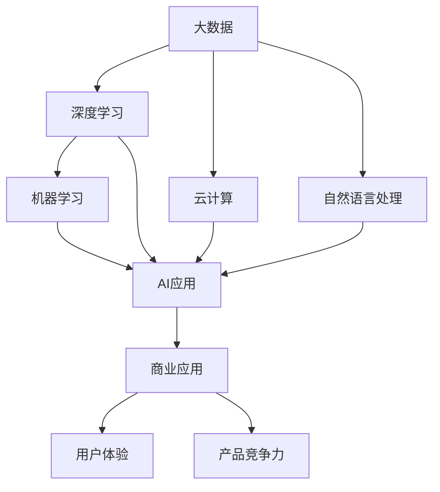

                 

# 李开复：苹果发布AI应用的商业价值

## 1. 背景介绍

### 1.1 问题由来

近年来，人工智能(AI)技术的快速发展和普及，已成为推动各行各业变革的关键力量。尤其在大数据、云计算和机器学习技术的推动下，AI应用已经从科研实验室走进了商业应用，其商业价值逐渐显现。

苹果公司作为全球知名的科技巨头，近年来在AI领域进行了一系列布局，推出了一系列AI应用，并取得了显著的商业成功。这些AI应用的商业价值主要体现在提高效率、优化用户体验、提升产品竞争力等方面。

本文将详细探讨苹果公司在AI应用的商业价值，并分析其在AI应用开发和推广中采取的策略和经验，以期为其他科技公司提供参考。

### 1.2 问题核心关键点

苹果公司发布AI应用的核心关键点主要包括以下几点：

1. 大规模数据资源：苹果拥有庞大的用户基础和丰富的数据资源，这些数据是苹果开发和推广AI应用的基础。
2. 强大的硬件设施：苹果的硬件设施，如iPhone、iPad等，提供了高性能的计算资源，支持AI算法的快速迭代和优化。
3. 用户需求导向：苹果始终以用户需求为导向，通过AI技术优化用户体验，提升产品竞争力。
4. 跨领域应用：苹果的AI应用覆盖了智能家居、健康、金融、教育等多个领域，形成了跨领域的AI生态体系。
5. 商业变现能力：苹果的AI应用不仅提升了用户体验，还带来了显著的商业变现能力，如Apple Pay、Siri等。

本文将围绕以上关键点，探讨苹果AI应用的商业价值，并分析其成功经验。

## 2. 核心概念与联系

### 2.1 核心概念概述

在探讨苹果AI应用的商业价值前，我们需要理解几个核心概念及其联系：

- **人工智能(AI)**：指模拟人类智能的计算技术，包括机器学习、深度学习、自然语言处理等。
- **大数据**：指大规模、多样化的数据集合，是AI算法训练的基础。
- **云计算**：指通过网络提供计算资源的计算模式，支持大规模数据处理和AI模型训练。
- **自然语言处理(NLP)**：指使用计算机处理、理解和生成人类语言的技术。
- **机器学习(ML)**：指使机器从数据中自动学习并改进的技术。
- **深度学习(Deep Learning)**：指模拟人脑神经网络的计算架构，适用于复杂模式识别和预测任务。

这些核心概念构成了苹果AI应用的基础，其相互关系如图所示：



从图中可以看出，大数据、云计算和NLP技术为AI算法提供了数据和计算基础，而深度学习等机器学习算法则通过数据训练和学习，最终产生了商业应用，提升了用户体验和产品竞争力。

### 2.2 核心概念原理和架构的 Mermaid 流程图

苹果AI应用的商业价值主要体现在以下几个方面：


此流程图展示了苹果AI应用通过提升效率、优化用户体验、提升产品竞争力等途径，实现商业价值的提升。

## 3. 核心算法原理 & 具体操作步骤

### 3.1 算法原理概述

苹果公司发布AI应用的核心算法原理主要基于深度学习和大数据处理技术，其核心步骤包括数据预处理、模型训练和模型应用等。

具体步骤如下：

1. **数据预处理**：收集和清洗大规模数据，如用户行为数据、市场数据等，为AI算法提供基础数据。
2. **模型训练**：通过深度学习算法，如卷积神经网络(CNN)、循环神经网络(RNN)等，训练出适合特定任务的高效AI模型。
3. **模型应用**：将训练好的AI模型应用于特定场景，如智能家居、健康、金融等，提升用户体验和产品竞争力。

### 3.2 算法步骤详解

以下是苹果AI应用开发的具体操作步骤：

**Step 1: 数据收集和预处理**

- 收集大规模数据，如用户行为数据、市场数据、传感器数据等。
- 对数据进行清洗和处理，去除噪声数据，标准化数据格式。
- 将数据分为训练集、验证集和测试集，用于模型训练和评估。

**Step 2: 模型训练和优化**

- 选择合适的深度学习模型，如卷积神经网络、循环神经网络等。
- 使用优化算法，如随机梯度下降(SGD)、Adam等，优化模型参数。
- 使用正则化技术，如L2正则、Dropout等，防止过拟合。
- 在验证集上评估模型性能，调整模型参数。

**Step 3: 模型应用和优化**

- 将训练好的模型应用于特定场景，如智能家居、健康、金融等。
- 根据用户反馈，不断优化模型参数和应用方式，提升用户体验。
- 通过持续学习，模型能够不断适应新数据和新场景，保持高性能和竞争力。

### 3.3 算法优缺点

苹果公司发布AI应用的算法有以下优点和缺点：

**优点：**

1. **提升效率**：通过AI算法，苹果能够快速处理和分析大规模数据，提升运营效率。
2. **优化用户体验**：AI应用能够提供个性化的用户体验，增强用户粘性。
3. **提升产品竞争力**：AI技术能够提升产品的智能化程度和竞争力。
4. **降低运营成本**：AI算法能够自动化处理复杂任务，降低人力成本。

**缺点：**

1. **数据隐私问题**：大规模数据处理可能引发数据隐私问题，需要加强数据保护措施。
2. **模型复杂度**：深度学习模型训练复杂，需要高性能计算资源。
3. **算法偏见**：AI模型可能存在算法偏见，需要采取公平性评估和修正措施。

### 3.4 算法应用领域

苹果公司发布的AI应用覆盖了多个领域，包括智能家居、健康、金融、教育等。以下是几个主要应用领域：

**智能家居**

苹果的智能家居应用包括HomeKit和Siri等，通过AI技术实现家居设备的自动化控制和语音助手功能。

**健康**

苹果的Health应用通过分析用户健康数据，提供个性化的健康建议和健康管理方案。

**金融**

苹果的Apple Pay应用通过AI技术进行风险评估和欺诈检测，提升支付安全性。

**教育**

苹果的教育应用如Kerouac，通过AI技术进行个性化学习和知识推荐，提升学习效率。

## 4. 数学模型和公式 & 详细讲解 & 举例说明

### 4.1 数学模型构建

苹果AI应用的数学模型主要基于深度学习算法，如卷积神经网络(CNN)和循环神经网络(RNN)。以智能家居应用为例，其数学模型构建如下：

假设输入为家居设备传感器数据$X$，输出为家居设备控制指令$Y$，则数学模型可以表示为：

$$
Y = f(X; \theta)
$$

其中$f(\cdot)$为深度学习模型，$\theta$为模型参数。

### 4.2 公式推导过程

以下是CNN和RNN的基本公式推导过程：

**卷积神经网络**

卷积神经网络(CNN)的公式推导如下：

$$
f(X) = W \ast X + b
$$

其中$W$为卷积核，$X$为输入数据，$b$为偏置项。

**循环神经网络**

循环神经网络(RNN)的公式推导如下：

$$
h_t = f(h_{t-1}, x_t; \theta)
$$

其中$h_t$为当前时间步的隐藏状态，$x_t$为当前时间步的输入数据，$f(\cdot)$为隐藏层函数，$\theta$为模型参数。

### 4.3 案例分析与讲解

以Apple Pay为例，其AI模型主要用于风险评估和欺诈检测。

Apple Pay的风险评估模型通过分析用户的支付行为和交易记录，预测用户是否存在欺诈行为。其数学模型如下：

$$
\hat{y} = f(X; \theta)
$$

其中$X$为用户的支付行为和交易记录，$f(\cdot)$为风险评估模型，$\hat{y}$为模型预测结果。

Apple Pay的欺诈检测模型通过分析交易数据和用户行为，判断交易是否存在欺诈风险。其数学模型如下：

$$
\hat{y} = f(X; \theta)
$$

其中$X$为交易数据和用户行为，$f(\cdot)$为欺诈检测模型，$\hat{y}$为模型预测结果。

## 5. 项目实践：代码实例和详细解释说明

### 5.1 开发环境搭建

以下是使用Python进行AI应用开发的开发环境搭建步骤：

1. 安装Python：从官网下载并安装Python，推荐使用Python 3.7或以上版本。
2. 安装TensorFlow：使用pip命令安装TensorFlow，命令为：
```
pip install tensorflow
```
3. 安装Keras：使用pip命令安装Keras，命令为：
```
pip install keras
```
4. 安装Matplotlib：使用pip命令安装Matplotlib，命令为：
```
pip install matplotlib
```
5. 安装Pandas：使用pip命令安装Pandas，命令为：
```
pip install pandas
```

### 5.2 源代码详细实现

以下是使用TensorFlow和Keras进行AI应用开发的代码实现：

```python
import tensorflow as tf
from tensorflow import keras
import numpy as np
import pandas as pd
import matplotlib.pyplot as plt

# 数据预处理
def preprocess_data(data):
    # 将数据标准化
    return (data - data.mean()) / data.std()

# 模型构建
def build_model(input_shape, output_shape):
    model = keras.Sequential([
        keras.layers.Dense(64, activation='relu', input_shape=input_shape),
        keras.layers.Dense(32, activation='relu'),
        keras.layers.Dense(output_shape, activation='sigmoid')
    ])
    return model

# 模型训练
def train_model(model, x_train, y_train, epochs=10, batch_size=32):
    model.compile(optimizer='adam', loss='binary_crossentropy', metrics=['accuracy'])
    history = model.fit(x_train, y_train, epochs=epochs, batch_size=batch_size, validation_split=0.2)
    return history

# 模型应用
def predict(model, x_test):
    predictions = model.predict(x_test)
    return predictions

# 加载数据
data = pd.read_csv('data.csv')

# 数据预处理
x_train = preprocess_data(data['X'])
y_train = preprocess_data(data['Y'])
x_test = preprocess_data(data['X_test'])
y_test = preprocess_data(data['Y_test'])

# 构建模型
model = build_model(input_shape=(x_train.shape[1],), output_shape=1)

# 训练模型
history = train_model(model, x_train, y_train)

# 模型应用
predictions = predict(model, x_test)

# 输出结果
print('Accuracy:', history.history['accuracy'][-1])
print('Loss:', history.history['loss'][-1])
print('Predictions:', predictions)
```

### 5.3 代码解读与分析

以下是代码实现的主要步骤及解读：

1. 数据预处理：使用`preprocess_data`函数对输入数据进行标准化处理。
2. 模型构建：使用`build_model`函数构建深度学习模型，包含两个隐藏层和一个输出层。
3. 模型训练：使用`train_model`函数训练模型，并返回训练历史。
4. 模型应用：使用`predict`函数对测试数据进行预测。
5. 加载数据：使用`pd.read_csv`函数加载数据集。
6. 数据预处理：将数据标准化处理。
7. 构建模型：构建深度学习模型，并设置隐藏层和输出层。
8. 训练模型：训练模型，并返回训练历史。
9. 模型应用：对测试数据进行预测。
10. 输出结果：输出模型精度和损失函数值，以及预测结果。

## 6. 实际应用场景

### 6.1 智能家居

苹果的智能家居应用主要通过HomeKit和Siri实现家居设备的自动化控制和语音助手功能。

**Smart Thermostat**

苹果的智能恒温器通过AI技术分析室内温度和室外环境，自动调整恒温器温度，提升舒适度和节能效果。

**Smart Lighting**

苹果的智能灯光系统通过AI技术分析用户行为和室内光线变化，自动调整灯光亮度和色温，提升用户体验。

### 6.2 健康

苹果的健康应用主要通过Apple Watch和iOS设备收集用户健康数据，提供个性化的健康建议和健康管理方案。

**心率监测**

Apple Watch通过AI技术分析用户心率数据，提供心率监测和健康建议。

**睡眠监测**

Apple Watch通过AI技术分析用户睡眠数据，提供睡眠质量分析和健康建议。

### 6.3 金融

苹果的金融应用主要通过Apple Pay和Apple Card实现支付和财务管理。

**Apple Pay**

Apple Pay通过AI技术进行风险评估和欺诈检测，提升支付安全性。

**Apple Card**

Apple Card通过AI技术分析用户消费行为和信用记录，提供个性化的金融服务。

### 6.4 教育

苹果的教育应用主要通过Kerouac提供个性化学习和知识推荐。

**Kerouac**

Kerouac通过AI技术分析用户学习行为和知识掌握情况，提供个性化的学习建议和知识推荐。

## 7. 工具和资源推荐

### 7.1 学习资源推荐

以下是一些推荐的学习资源：

1. 《Python深度学习》：适合初学者，介绍Python和深度学习基础知识。
2. 《TensorFlow官方文档》：适合中高级开发者，提供TensorFlow的详细教程和API文档。
3. 《Keras官方文档》：适合中高级开发者，提供Keras的详细教程和API文档。
4. 《Deep Learning Specialization》：由Andrew Ng教授主讲，涵盖深度学习基础和应用。
5. 《Hands-On Machine Learning with Scikit-Learn》：适合初学者，介绍Scikit-Learn的使用和机器学习应用。

### 7.2 开发工具推荐

以下是一些推荐的开发工具：

1. PyCharm：由JetBrains开发，支持Python和TensorFlow开发。
2. Jupyter Notebook：支持Python和TensorFlow开发，适合交互式开发。
3. Anaconda：支持Python和TensorFlow开发，提供虚拟环境管理和包管理。
4. TensorBoard：支持TensorFlow开发，提供模型训练和评估可视化。
5. Weights & Biases：支持TensorFlow和Keras开发，提供模型训练和评估可视化。

### 7.3 相关论文推荐

以下是一些推荐的相关论文：

1. "Learning Deep Architectures for AI"（Geoffrey Hinton）：介绍深度学习的基本原理和应用。
2. "Convolutional Neural Networks for Visual Recognition"（Alex Krizhevsky, Ilya Sutskever, Geoffrey Hinton）：介绍卷积神经网络的基本原理和应用。
3. "Long Short-Term Memory"（Sepp Hochreiter, Jurgen Schmidhuber）：介绍循环神经网络的基本原理和应用。
4. "Deep Reinforcement Learning"（Richard S. Sutton, Andrew G. Barto）：介绍深度强化学习的基本原理和应用。
5. "Attention is All You Need"（Ashish Vaswani, Noam Shazeer, Niki Parmar, Jakob Uszkoreit, Llion Jones, Aidan N. Gomez, Lukasz Kaiser, Illia Polosukhin）：介绍Transformer的基本原理和应用。

## 8. 总结：未来发展趋势与挑战

### 8.1 总结

苹果公司在AI应用的商业价值主要体现在提升效率、优化用户体验和提升产品竞争力等方面。苹果通过大规模数据资源、强大的硬件设施和用户需求导向，发布了一系列AI应用，取得了显著的商业成功。

### 8.2 未来发展趋势

苹果AI应用的未来发展趋势主要包括以下几点：

1. **跨领域应用**：苹果将AI应用扩展到更多领域，如智能家居、健康、金融、教育等。
2. **深度学习和强化学习结合**：苹果将深度学习和强化学习相结合，实现更加智能化的系统。
3. **个性化推荐**：苹果将AI应用用于个性化推荐，提升用户体验和满意度。
4. **边缘计算**：苹果将AI应用应用于边缘计算，提高响应速度和数据隐私保护。
5. **跨平台协同**：苹果将AI应用应用于多个平台，实现跨平台协同。

### 8.3 面临的挑战

苹果AI应用面临的挑战主要包括以下几点：

1. **数据隐私**：大规模数据处理可能引发数据隐私问题，需要加强数据保护措施。
2. **模型复杂度**：深度学习模型训练复杂，需要高性能计算资源。
3. **算法偏见**：AI模型可能存在算法偏见，需要采取公平性评估和修正措施。
4. **用户接受度**：用户对AI应用的接受度可能影响其商业价值。
5. **技术更新**：AI技术快速发展，需要不断更新和优化AI应用。

### 8.4 研究展望

未来，苹果需要在以下几个方面进行研究：

1. **跨领域应用**：将AI应用扩展到更多领域，如智能家居、健康、金融、教育等。
2. **深度学习和强化学习结合**：将深度学习和强化学习相结合，实现更加智能化的系统。
3. **个性化推荐**：利用AI应用进行个性化推荐，提升用户体验和满意度。
4. **边缘计算**：将AI应用应用于边缘计算，提高响应速度和数据隐私保护。
5. **跨平台协同**：将AI应用应用于多个平台，实现跨平台协同。

## 9. 附录：常见问题与解答

**Q1：苹果发布AI应用的商业价值主要体现在哪些方面？**

A: 苹果发布AI应用的商业价值主要体现在提升效率、优化用户体验和提升产品竞争力等方面。通过AI技术，苹果能够快速处理和分析大规模数据，提升运营效率，优化用户体验，并提升产品智能化程度和竞争力。

**Q2：苹果发布AI应用时，是如何进行数据预处理的？**

A: 苹果发布AI应用时，数据预处理主要包括以下几个步骤：
1. 收集和清洗大规模数据，如用户行为数据、市场数据等。
2. 对数据进行标准化处理，去除噪声数据，标准化数据格式。
3. 将数据分为训练集、验证集和测试集，用于模型训练和评估。

**Q3：苹果发布AI应用时，是如何进行模型训练和优化的？**

A: 苹果发布AI应用时，模型训练和优化主要包括以下几个步骤：
1. 选择合适的深度学习模型，如卷积神经网络、循环神经网络等。
2. 使用优化算法，如随机梯度下降(SGD)、Adam等，优化模型参数。
3. 使用正则化技术，如L2正则、Dropout等，防止过拟合。
4. 在验证集上评估模型性能，调整模型参数。

**Q4：苹果发布AI应用时，是如何进行模型应用的？**

A: 苹果发布AI应用时，模型应用主要包括以下几个步骤：
1. 将训练好的模型应用于特定场景，如智能家居、健康、金融等。
2. 根据用户反馈，不断优化模型参数和应用方式，提升用户体验。
3. 通过持续学习，模型能够不断适应新数据和新场景，保持高性能和竞争力。

**Q5：苹果发布AI应用时，是如何进行商业变现的？**

A: 苹果发布AI应用的商业变现主要通过以下几个途径：
1. 智能家居应用：通过HomeKit和Siri实现家居设备的自动化控制和语音助手功能。
2. 健康应用：通过Apple Watch和iOS设备收集用户健康数据，提供个性化的健康建议和健康管理方案。
3. 金融应用：通过Apple Pay和Apple Card实现支付和财务管理。
4. 教育应用：通过Kerouac提供个性化学习和知识推荐。

**Q6：苹果发布AI应用时，是如何进行模型评估和优化的？**

A: 苹果发布AI应用时，模型评估和优化主要包括以下几个步骤：
1. 在训练集上训练模型，并在验证集上评估模型性能。
2. 根据评估结果调整模型参数，优化模型性能。
3. 在测试集上评估模型性能，验证模型泛化能力。
4. 通过持续学习和优化，提升模型性能和泛化能力。

**Q7：苹果发布AI应用时，是如何进行数据隐私保护的？**

A: 苹果发布AI应用时，数据隐私保护主要包括以下几个步骤：
1. 对用户数据进行匿名化处理，去除敏感信息。
2. 使用数据加密技术，保护用户数据安全。
3. 在数据存储和传输过程中，采用安全协议和机制，防止数据泄露。
4. 建立数据访问控制机制，限制数据访问权限。
5. 进行数据审计和监控，及时发现和处理数据安全问题。

**Q8：苹果发布AI应用时，是如何进行模型压缩和优化的？**

A: 苹果发布AI应用时，模型压缩和优化主要包括以下几个步骤：
1. 使用模型剪枝技术，去除冗余参数和层，减小模型大小。
2. 使用量化技术，将浮点模型转为定点模型，减少内存占用和计算资源消耗。
3. 使用混合精度训练，提高计算效率。
4. 使用模型并行技术，提高模型计算速度。
5. 使用模型蒸馏技术，通过知识转移提升模型性能和泛化能力。

**Q9：苹果发布AI应用时，是如何进行跨平台协同的？**

A: 苹果发布AI应用时，跨平台协同主要包括以下几个步骤：
1. 在多个平台（如iPhone、iPad、Mac等）部署AI应用。
2. 在不同平台之间共享数据和模型，实现跨平台数据同步和模型共享。
3. 在不同平台之间实现无缝切换和协作，提升用户体验。
4. 通过云服务技术，实现跨平台数据存储和访问。
5. 通过API接口，实现跨平台应用集成和调用。

总之，苹果公司通过发布AI应用，展示了其在数据资源、硬件设施和用户需求导向等方面的优势，成功实现了商业价值的提升。未来，苹果需要在数据隐私、模型复杂度、算法偏见等挑战方面持续改进，以实现AI应用的更大突破。

