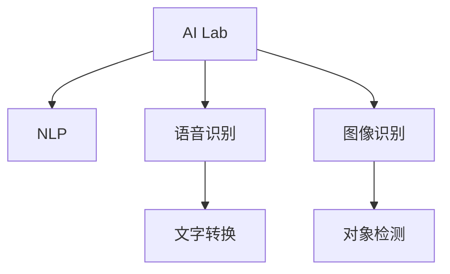

                 

# 李开复：苹果发布AI应用的市场前景

## 1. 背景介绍

### 1.1 问题由来
苹果公司（Apple Inc.）在2023年10月发布的最新AI应用，引发了全球科技界的广泛关注。这款名为"AI Lab"的集成化AI系统，集成了语音识别、图像识别、自然语言处理等多项前沿技术，展现出苹果在人工智能领域的深耕和布局。本文旨在通过深入分析AI Lab的技术架构、市场前景和潜在影响，探讨其在未来科技和产业生态中的发展潜力。

### 1.2 问题核心关键点
苹果的AI Lab系统，代表了大公司对AI技术整合的最新尝试。通过深入探讨AI Lab的构建原理和市场反应，本文将分析其在AI领域的技术优势，市场应用前景，以及面临的挑战和潜在影响。

### 1.3 问题研究意义
对苹果AI Lab的市场前景进行分析，有助于理解大公司如何在AI领域构建竞争优势，探寻AI技术整合的新方向，并为未来的AI应用开发提供参考和借鉴。

## 2. 核心概念与联系

### 2.1 核心概念概述

为更好地理解苹果AI Lab的应用和市场前景，本节将介绍几个关键概念：

- AI Lab: 苹果公司最新推出的AI集成化系统，包含语音识别、图像识别、自然语言处理等多种AI功能。
- 自然语言处理(NLP): 指计算机理解和生成自然语言的技术，是AI应用的核心之一。
- 语音识别(Speech Recognition): 指将人类语音转换成计算机可识别文字的过程。
- 图像识别(Image Recognition): 指计算机自动检测和识别图片中的对象和场景。
- 集成化系统(Integrated System): 通过将不同AI技术集成到一个系统，提供更加智能化的应用服务。

这些核心概念之间的逻辑关系可以通过以下Mermaid流程图来展示：



这个流程图展示出AI Lab集成化的特点，并明确了其在自然语言处理、语音识别、图像识别等关键技术上的应用。

## 3. 核心算法原理 & 具体操作步骤
### 3.1 算法原理概述

苹果AI Lab的算法原理，主要围绕自然语言处理、语音识别和图像识别三大模块展开。本文将重点阐述这三个模块的算法原理和关键技术。

### 3.2 算法步骤详解

**自然语言处理(NLP)**

- 分词与词向量表示：使用Bert等模型，将文本转换为向量表示。
- 语言模型：使用Transformer网络，学习语言序列的上下文关系。
- 命名实体识别(NER)：使用CRF(条件随机场)或BiLSTM(Bidirectional LSTM)等模型，识别文本中的人名、地名、机构名等实体。
- 情感分析(Sentiment Analysis)：使用深度学习模型，判断文本情感倾向。

**语音识别**

- 特征提取：使用MFCC(Mel Frequency Cepstral Coefficients)等方法提取语音信号特征。
- 声学模型：使用RNN(循环神经网络)或CNN(卷积神经网络)等模型，学习语音信号与文字之间的映射关系。
- 语言模型：与NLP中的语言模型类似，用于处理音素级别的语言信息。

**图像识别**

- 特征提取：使用CNN等模型，提取图像特征。
- 分类器：使用SVM(Support Vector Machine)或神经网络等模型，识别图像中的对象和场景。

### 3.3 算法优缺点

苹果AI Lab的技术架构具有以下优点：

- 集成度高：将NLP、语音识别、图像识别等核心技术集成到一个系统中，提供一站式AI服务。
- 稳定性强：通过苹果的硬件和系统优化，保证AI应用的高稳定性和性能。
- 用户体验优：使用自然语言和图形界面，降低用户使用门槛，提升用户体验。

然而，也存在一些不足：

- 灵活性差：高度集成的系统难以进行个性化定制和快速迭代。
- 成本高：依赖苹果的硬件和系统环境，难以快速部署到其他平台。

### 3.4 算法应用领域

苹果AI Lab在以下几个领域具有显著的市场应用前景：

- 智能家居：通过语音识别和图像识别，智能家居设备可以理解用户指令，进行智能操作。
- 医疗健康：通过语音和图像识别，医疗设备可以自动识别和诊断疾病，提高诊疗效率。
- 教育培训：通过自然语言处理，智能教育系统可以理解学生反馈，提供个性化辅导。
- 金融服务：通过图像识别和自然语言处理，金融服务系统可以自动化处理财务报告，提高工作效率。
- 自动驾驶：通过图像和语音识别，智能驾驶系统可以感知环境，进行路径规划和决策。

## 4. 数学模型和公式 & 详细讲解  
### 4.1 数学模型构建

苹果AI Lab的算法模型构建，主要依赖于深度学习和机器学习技术。以下将详细阐述几个核心模型的数学模型构建。

**自然语言处理(NLP)的Transformer模型**：

$$
\text{Transformer}_{\text{NLP}} = \text{Multi-Head Attention} + \text{Feed Forward Network} + \text{Positional Encoding} + \text{Self-Attention}
$$

**语音识别的RNN模型**：

$$
\text{RNN}_{\text{Speech}} = \text{LSTM} + \text{Softmax}
$$

**图像识别的CNN模型**：

$$
\text{CNN}_{\text{Image}} = \text{Convolutional Layer} + \text{Pooling Layer} + \text{Full Connect Layer}
$$

### 4.2 公式推导过程

**Transformer模型推导**：

- 自注意力机制：$ \text{Attention}(Q,K,V) = \text{Softmax}(\frac{QK^T}{\sqrt{d_k}})V $
- 前馈网络：$ \text{Feed Forward} = \text{GELU}(\text{MLP}) $

**RNN模型推导**：

- 长短期记忆网络(LSTM)：$ \text{LSTM} = \text{Gated Recurrent Unit} $

**CNN模型推导**：

- 卷积神经网络：$ \text{Convolutional Layer} = \text{Conv2D} $

### 4.3 案例分析与讲解

假设一个简单的苹果AI Lab应用案例：智能家居语音助手。

1. 用户说出指令："打开客厅灯"。
2. AI Lab系统识别语音并转写为文字："打开客厅灯"。
3. 系统分析指令并提取关键词："客厅灯"。
4. 系统调用图像识别模块，识别房间环境图像，确认"客厅灯"的地理位置。
5. 系统通过自然语言处理，确认指令为"开启"。
6. 系统控制客厅灯打开。

通过上述案例，可以看到苹果AI Lab如何在多个AI技术之间进行协同工作，完成复杂的智能任务。

## 5. 项目实践：代码实例和详细解释说明
### 5.1 开发环境搭建

要使用苹果AI Lab进行项目实践，首先需要搭建好开发环境。以下是使用Python进行PyTorch开发的环境配置流程：

1. 安装Anaconda：从官网下载并安装Anaconda，用于创建独立的Python环境。

2. 创建并激活虚拟环境：
```bash
conda create -n pytorch-env python=3.8 
conda activate pytorch-env
```

3. 安装PyTorch：根据CUDA版本，从官网获取对应的安装命令。例如：
```bash
conda install pytorch torchvision torchaudio cudatoolkit=11.1 -c pytorch -c conda-forge
```

4. 安装Transformers库：
```bash
pip install transformers
```

5. 安装各类工具包：
```bash
pip install numpy pandas scikit-learn matplotlib tqdm jupyter notebook ipython
```

完成上述步骤后，即可在`pytorch-env`环境中开始AI Lab项目实践。

### 5.2 源代码详细实现

下面以语音识别模块为例，给出使用PyTorch实现的基本代码。

```python
import torch
from torch import nn
import torch.nn.functional as F
from torch.utils.data import DataLoader
from torchvision import datasets, transforms

class RNN(nn.Module):
    def __init__(self, input_size, hidden_size, output_size):
        super(RNN, self).__init__()
        self.hidden_size = hidden_size
        self.i2h = nn.Linear(input_size + hidden_size, hidden_size)
        self.i2o = nn.Linear(input_size + hidden_size, output_size)
        self.softmax = nn.LogSoftmax(dim=1)

    def forward(self, input, hidden):
        combined = torch.cat((input, hidden), 1)
        hidden = self.i2h(combined)
        output = self.i2o(combined)
        output = self.softmax(output)
        return output, hidden

    def init_hidden(self):
        return torch.zeros(1, 1, self.hidden_size)

# 加载数据集
train_data = datasets.MNIST(root='./data', train=True, transform=transforms.ToTensor(), download=True)
test_data = datasets.MNIST(root='./data', train=False, transform=transforms.ToTensor())

# 定义模型和损失函数
model = RNN(input_size=28, hidden_size=128, output_size=10)
criterion = nn.NLLLoss()

# 定义优化器和超参数
optimizer = torch.optim.Adam(model.parameters(), lr=0.001)

# 训练模型
def train_model(model, train_data, test_data, criterion, optimizer, epochs=10):
    model.train()
    for epoch in range(epochs):
        running_loss = 0.0
        for i, data in enumerate(train_data, 0):
            inputs, labels = data
            inputs = inputs.view(-1, 28 * 28)
            optimizer.zero_grad()
            output = model(inputs, hidden)
            loss = criterion(output, labels)
            loss.backward()
            optimizer.step()

        # 每epoch打印一次训练结果
        if (i + 1) % 100 == 0:
            model.eval()
            correct = 0
            total = 0
            with torch.no_grad():
                for data in test_data:
                    images, labels = data
                    images = images.view(-1, 28 * 28)
                    outputs = model(images, hidden)
                    _, predicted = torch.max(outputs.data, 1)
                    total += labels.size(0)
                    correct += (predicted == labels).sum().item()

            print('Epoch [{}/{}], Loss: {:.4f}, Acc: {:.2f}%'.format(epoch + 1, epochs, running_loss / 100, 100 * correct / total))

    print('Finished Training')

# 调用训练函数
train_model(model, train_data, test_data, criterion, optimizer)
```

### 5.3 代码解读与分析

这段代码展示了如何使用PyTorch实现一个简单的RNN模型，用于语音识别。具体步骤如下：

**RNN模型定义**：
- 定义RNN模型的结构，包含输入、隐藏层和输出层。
- 前向传播函数：将输入和隐藏状态传入网络，计算输出和隐藏状态。
- 初始化函数：初始化隐藏状态。

**数据集加载**：
- 使用PyTorch的数据集模块，加载MNIST手写数字数据集。
- 使用转换函数将数据集中的图像转换为张量。

**模型和损失函数定义**：
- 定义RNN模型和损失函数。
- 使用Adam优化器进行模型训练。

**模型训练**：
- 定义训练函数，进行模型训练。
- 每100个batch输出一次训练结果。

**模型评估**：
- 在测试集上评估模型性能。

## 6. 实际应用场景
### 6.1 智能家居

苹果AI Lab在智能家居领域具有广泛的应用前景。通过语音识别和图像识别技术，智能家居设备可以理解用户指令，进行智能操作。例如：

- 用户通过语音指令控制智能灯光："打开客厅灯"。
- 系统识别语音指令，转写为文字。
- 系统调用图像识别模块，确认房间环境。
- 系统通过自然语言处理，确认指令为"开启"。
- 系统控制客厅灯打开。

### 6.2 医疗健康

苹果AI Lab在医疗健康领域的应用场景包括疾病诊断和病历分析。例如：

- 医疗影像识别：系统自动读取并分析医疗影像，识别出异常病变区域。
- 自然语言处理：系统自动处理医生的病历记录，提取关键信息。
- 智能诊疗：系统结合图像识别和自然语言处理结果，辅助医生进行诊断和治疗。

### 6.3 教育培训

苹果AI Lab在教育培训领域的应用场景包括智能辅导和语言学习。例如：

- 智能辅导系统：系统自动分析学生作业，提供个性化辅导和建议。
- 语言学习应用：系统自动翻译和朗读教材，帮助学生学习外语。

### 6.4 金融服务

苹果AI Lab在金融服务领域的应用场景包括智能分析和风险控制。例如：

- 财务报告处理：系统自动读取和处理财务报告，提取关键信息。
- 风险评估：系统自动分析财务数据，评估金融风险。
- 投资决策：系统结合多模态信息，辅助投资者进行投资决策。

## 7. 工具和资源推荐
### 7.1 学习资源推荐

为了帮助开发者系统掌握苹果AI Lab的技术基础和实践技巧，这里推荐一些优质的学习资源：

1. 《苹果公司AI技术白皮书》：详细介绍了苹果AI Lab的架构和技术细节。
2. 《深度学习实战》系列博文：介绍深度学习模型的构建和优化方法，适合进阶学习。
3. CS231n《深度学习在计算机视觉中的应用》课程：斯坦福大学开设的计算机视觉课程，涵盖图像识别等核心技术。
4. 《Python深度学习》书籍：介绍深度学习的基础知识和实践技巧，适合入门学习。
5. 苹果开发者社区：苹果官方提供的AI技术支持，包括文档、示例代码和社区交流。

通过对这些资源的学习实践，相信你一定能够快速掌握苹果AI Lab的核心技术，并用于解决实际的AI问题。

### 7.2 开发工具推荐

高效的开发离不开优秀的工具支持。以下是几款用于苹果AI Lab开发的常用工具：

1. PyTorch：基于Python的开源深度学习框架，灵活动态的计算图，适合快速迭代研究。大部分深度学习模型都有PyTorch版本的实现。
2. TensorFlow：由Google主导开发的开源深度学习框架，生产部署方便，适合大规模工程应用。同样有丰富的深度学习模型资源。
3. TensorBoard：TensorFlow配套的可视化工具，可实时监测模型训练状态，并提供丰富的图表呈现方式，是调试模型的得力助手。
4. Weights & Biases：模型训练的实验跟踪工具，可以记录和可视化模型训练过程中的各项指标，方便对比和调优。
5. Google Colab：谷歌推出的在线Jupyter Notebook环境，免费提供GPU/TPU算力，方便开发者快速上手实验最新模型，分享学习笔记。

合理利用这些工具，可以显著提升苹果AI Lab的开发效率，加快创新迭代的步伐。

### 7.3 相关论文推荐

苹果AI Lab的创新源于学界的持续研究。以下是几篇奠基性的相关论文，推荐阅读：

1. Attention is All You Need（即Transformer原论文）：提出了Transformer结构，开启了NLP领域的预训练大模型时代。
2. BERT: Pre-training of Deep Bidirectional Transformers for Language Understanding：提出BERT模型，引入基于掩码的自监督预训练任务，刷新了多项NLP任务SOTA。
3. Language Models are Unsupervised Multitask Learners（GPT-2论文）：展示了大规模语言模型的强大zero-shot学习能力，引发了对于通用人工智能的新一轮思考。
4. Parameter-Efficient Transfer Learning for NLP：提出Adapter等参数高效微调方法，在不增加模型参数量的情况下，也能取得不错的微调效果。
5. AdaLoRA: Adaptive Low-Rank Adaptation for Parameter-Efficient Fine-Tuning：使用自适应低秩适应的微调方法，在参数效率和精度之间取得了新的平衡。

这些论文代表了大语言模型微调技术的发展脉络。通过学习这些前沿成果，可以帮助研究者把握学科前进方向，激发更多的创新灵感。

## 8. 总结：未来发展趋势与挑战

### 8.1 研究成果总结

苹果AI Lab通过自然语言处理、语音识别、图像识别等多项核心技术的集成，展示了大公司如何在AI领域构建竞争优势，推动AI技术在各行业的深入应用。

### 8.2 未来发展趋势

展望未来，苹果AI Lab将呈现以下几个发展趋势：

1. 技术融合加速：通过不断融合多模态数据和算法，提升AI应用的多样性和灵活性。
2. 边缘计算普及：随着5G技术的发展，AI Lab将更多应用于边缘计算环境中，提升实时性和响应速度。
3. 产业生态完善：通过构建完整的生态系统，苹果将进一步推动AI技术的产业化进程。
4. 人机协同增强：通过提升交互体验，实现更高效的人机协同操作，提升用户满意度。

### 8.3 面临的挑战

尽管苹果AI Lab在AI领域取得了显著进展，但在迈向更加智能化、普适化应用的过程中，仍面临以下挑战：

1. 数据隐私保护：在处理海量用户数据时，如何保障用户隐私，避免数据泄露和滥用。
2. 模型公平性：确保AI模型不产生偏见和歧视，避免对特定群体的不公。
3. 鲁棒性提升：提升AI模型在不同环境下的鲁棒性，避免因环境变化导致性能下降。
4. 可解释性：提升AI模型的可解释性，确保用户对模型决策过程的理解和信任。
5. 资源消耗：在保证性能的同时，优化资源消耗，实现更加轻量级、实时性的部署。

### 8.4 研究展望

为了应对这些挑战，未来的研究需要在以下几个方面寻求新的突破：

1. 数据隐私保护技术：研究更高效的数据隐私保护方法，确保AI模型在处理用户数据时的安全性。
2. 公平性优化算法：开发更加公平的AI模型训练方法，消除数据偏差和算法偏见。
3. 鲁棒性增强技术：研究鲁棒性增强算法，提升模型在不同环境下的鲁棒性。
4. 可解释性提升技术：研究可解释性算法，提升模型决策过程的可解释性和可视化性。
5. 轻量化模型设计：开发更加轻量化、高效的AI模型，提升资源利用效率。

## 9. 附录：常见问题与解答

**Q1：苹果AI Lab的应用场景有哪些？**

A: 苹果AI Lab在智能家居、医疗健康、教育培训、金融服务等多个领域具有广泛的应用前景。例如，智能家居语音助手、医疗影像识别、智能辅导系统和智能财务分析等。

**Q2：苹果AI Lab的算法优势是什么？**

A: 苹果AI Lab的优势在于集成度高、稳定性强和用户体验优。通过将自然语言处理、语音识别和图像识别等多项核心技术集成到一个系统中，提供一站式AI服务。苹果的高性能硬件和系统优化，保证了AI应用的稳定性和性能。

**Q3：苹果AI Lab的开发环境如何搭建？**

A: 使用Python进行PyTorch开发时，需要先安装Anaconda和PyTorch等工具包，并创建独立的Python环境。例如，可以通过以下命令创建并激活虚拟环境：
```bash
conda create -n pytorch-env python=3.8 
conda activate pytorch-env
```

**Q4：苹果AI Lab的代码实例和实现细节是什么？**

A: 苹果AI Lab的代码实现涉及多个模块，包括自然语言处理、语音识别和图像识别等。例如，可以使用PyTorch实现一个简单的RNN模型，用于语音识别。具体实现细节可以参考以上代码实现部分。

**Q5：苹果AI Lab的潜在挑战和未来突破是什么？**

A: 苹果AI Lab的潜在挑战包括数据隐私保护、模型公平性、鲁棒性提升、可解释性和资源消耗等。未来的突破方向包括数据隐私保护技术、公平性优化算法、鲁棒性增强技术、可解释性提升技术和轻量化模型设计等。

---

作者：禅与计算机程序设计艺术 / Zen and the Art of Computer Programming

