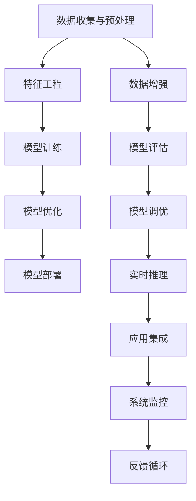

                 

## 1. 背景介绍

在人工智能(AI)的浪潮下，各大科技巨头纷纷推出各自的AI应用，其中苹果(Appl)也在这场角逐中发力。本文将从苹果AI应用的技术背景、核心概念、关键算法、实际应用场景等多个方面进行深入探讨，旨在揭示苹果AI应用的潜力和未来趋势。

## 2. 核心概念与联系

### 2.1 核心概念概述

苹果AI应用的开发离不开以下几个核心概念：

- **人工智能(AI)**：一种通过模拟人类智能行为，使机器能够自主学习、推理、感知和决策的技术。
- **机器学习(Machine Learning, ML)**：AI的一个分支，通过数据训练模型，使模型能够自动优化预测或决策能力。
- **深度学习(Deep Learning, DL)**：一种基于多层神经网络实现的学习技术，擅长处理复杂的数据结构，如图像、语音、文本等。
- **强化学习(Reinforcement Learning, RL)**：通过智能体与环境交互，学习如何最大化长期奖励，用于复杂的决策任务。
- **计算机视觉(Computer Vision)**：使计算机能够理解和分析图像、视频等视觉信息，广泛用于图像识别、人脸识别等场景。
- **自然语言处理(Natural Language Processing, NLP)**：使计算机能够理解和生成人类语言，包括语音识别、机器翻译、情感分析等。
- **语音识别(Speech Recognition)**：使计算机能够识别和转录人类语音。

这些概念共同构成了苹果AI应用的核心技术框架，涵盖了从数据处理到模型训练、推理和应用的各个环节。

### 2.2 核心概念原理和架构的 Mermaid 流程图



该流程图展示了苹果AI应用的核心流程：

1. **数据收集与预处理**：从不同来源收集数据，并对数据进行清洗、转换和增强，以保证数据质量。
2. **特征工程**：提取和选择对模型预测有贡献的特征，构建模型输入。
3. **模型训练**：使用标记数据训练机器学习模型，通过反向传播算法优化模型参数。
4. **模型优化**：对训练好的模型进行调优，如剪枝、量化、压缩等，提升模型效率。
5. **模型部署**：将模型集成到实际应用中，进行实时推理。
6. **模型评估**：使用测试数据评估模型性能，通过准确率、召回率等指标衡量模型效果。
7. **模型调优**：根据评估结果调整模型参数，提高模型性能。
8. **实时推理**：将模型应用于实时场景，提供即时响应。
9. **应用集成**：将AI应用集成到各种应用场景中，如Apple Health、Siri等。
10. **系统监控**：实时监控AI应用的运行状态，确保系统稳定性。
11. **反馈循环**：根据用户反馈和模型表现，不断迭代优化模型和应用。

## 3. 核心算法原理 & 具体操作步骤

### 3.1 算法原理概述

苹果AI应用的核心算法包括机器学习、深度学习和强化学习等。这里以深度学习算法为例，介绍其主要原理。

深度学习算法基于多层神经网络，通过反向传播算法优化模型参数，实现复杂非线性映射。其主要原理如下：

1. **前向传播**：将输入数据通过多层神经网络，得到输出结果。
2. **损失函数计算**：将输出结果与真实标签进行比较，计算损失函数。
3. **反向传播**：利用链式法则计算损失函数对每个参数的偏导数，更新参数。
4. **参数优化**：使用梯度下降等优化算法，更新模型参数，最小化损失函数。

### 3.2 算法步骤详解

苹果AI应用的深度学习算法主要包括以下步骤：

**Step 1: 数据准备与预处理**

- 收集和标注数据：数据需覆盖不同的场景和变化情况，确保数据的多样性和代表性。
- 数据增强：通过旋转、裁剪、加噪声等技术扩充数据集，提升模型鲁棒性。
- 数据预处理：标准化、归一化、数据清洗等预处理步骤，保证数据质量。

**Step 2: 模型构建与训练**

- 选择模型架构：如卷积神经网络(CNN)、循环神经网络(RNN)、Transformer等。
- 定义损失函数：如交叉熵损失、均方误差损失等。
- 设置优化器：如Adam、SGD等，调整学习率和批大小。
- 模型训练：使用训练集数据迭代训练模型，每次迭代计算损失函数并更新参数。

**Step 3: 模型评估与调优**

- 模型评估：使用验证集数据评估模型性能，确定最佳超参数。
- 模型调优：根据评估结果调整学习率、正则化参数等，防止过拟合。
- 模型验证：使用测试集数据验证模型泛化能力，确保模型稳定。

**Step 4: 模型部署与监控**

- 模型部署：将训练好的模型集成到实际应用中，进行实时推理。
- 系统监控：实时监控模型运行状态，如准确率、延迟等，确保系统性能。
- 反馈循环：根据用户反馈和系统监控数据，不断迭代优化模型。

### 3.3 算法优缺点

深度学习算法的优点在于：

1. 可以处理复杂的数据结构，如图像、语音、文本等。
2. 具有强大的泛化能力，在多个领域表现出色。
3. 通过自动特征提取，减少了人工干预。

缺点在于：

1. 需要大量的标注数据进行训练。
2. 模型复杂度高，计算资源消耗大。
3. 易过拟合，需要防止过拟合的措施。
4. 需要精心调参，才能达到最佳效果。

## 4. 数学模型和公式 & 详细讲解 & 举例说明

### 4.1 数学模型构建

深度学习模型通常由多层神经网络组成，每层包含多个神经元，每个神经元接收前一层的输出，并计算加权和。设模型的输入为 $x$，输出为 $y$，模型参数为 $\theta$，则前向传播的公式为：

$$
y = f(\theta \cdot g(x))
$$

其中 $f$ 为激活函数，$g$ 为权重矩阵。

### 4.2 公式推导过程

以一个简单的二分类任务为例，假设输入数据为 $x \in \mathbb{R}^n$，输出标签为 $y \in \{0,1\}$，模型输出为 $y_h \in [0,1]$。则二分类问题可以转化为回归问题，使用 sigmoid 函数作为激活函数，定义损失函数为二元交叉熵：

$$
L(y_h, y) = -y\log(y_h) - (1-y)\log(1-y_h)
$$

前向传播的公式为：

$$
y_h = \sigma(\theta \cdot x)
$$

其中 $\sigma(x) = \frac{1}{1+e^{-x}}$ 为 sigmoid 函数。

反向传播的公式为：

$$
\frac{\partial L}{\partial \theta} = y_h - y
$$

通过反向传播算法，计算损失函数对每个参数的偏导数，使用梯度下降算法更新模型参数。

### 4.3 案例分析与讲解

以苹果的 Siri 语音识别为例，其核心算法基于深度神经网络，具体步骤如下：

1. **数据收集**：收集大量的语音数据，标注正负样本，构建训练集和测试集。
2. **特征提取**：将语音信号转换为梅尔频率倒谱系数(MFCC)等特征表示，作为模型的输入。
3. **模型训练**：使用 RNN 或 CNN 等网络结构，训练模型参数，最小化损失函数。
4. **模型评估**：使用测试集评估模型性能，确定最佳超参数。
5. **模型部署**：将训练好的模型集成到 Siri 应用中，进行实时语音识别。
6. **系统监控**：实时监控 Siri 应用的用户反馈和系统性能，确保服务稳定。

## 5. 项目实践：代码实例和详细解释说明

### 5.1 开发环境搭建

为了进行深度学习模型的开发，我们需要以下开发环境：

- 安装 Python 环境：使用 Anaconda 或 Miniconda 创建虚拟环境，安装 Python 和相关库。
- 安装深度学习库：使用 pip 安装 TensorFlow、PyTorch 等深度学习库。
- 安装数据处理库：使用 pip 安装 NumPy、Pandas 等数据处理库。
- 安装模型评估库：使用 pip 安装 scikit-learn、Keras 等模型评估库。
- 安装可视化库：使用 pip 安装 Matplotlib、TensorBoard 等可视化库。

### 5.2 源代码详细实现

以苹果的 Siri 语音识别为例，以下是使用 PyTorch 进行模型实现的代码：

```python
import torch
import torch.nn as nn
import torch.optim as optim
import torch.utils.data as data

# 定义模型结构
class SiriModel(nn.Module):
    def __init__(self):
        super(SiriModel, self).__init__()
        self.rnn = nn.LSTM(1000, 128, 2, batch_first=True)
        self.fc = nn.Linear(128, 1)
    
    def forward(self, x):
        x, _ = self.rnn(x)
        y_hat = self.fc(x)
        return y_hat

# 定义数据集和数据加载器
train_dataset = data.TensorDataset(train_data, train_labels)
test_dataset = data.TensorDataset(test_data, test_labels)
train_loader = data.DataLoader(train_dataset, batch_size=64, shuffle=True)
test_loader = data.DataLoader(test_dataset, batch_size=64, shuffle=False)

# 定义模型、优化器和损失函数
model = SiriModel()
optimizer = optim.Adam(model.parameters(), lr=0.001)
criterion = nn.BCELoss()

# 训练模型
for epoch in range(10):
    for i, (x, y) in enumerate(train_loader):
        x = x.to(device)
        y = y.to(device)
        optimizer.zero_grad()
        y_hat = model(x)
        loss = criterion(y_hat, y)
        loss.backward()
        optimizer.step()
        if i % 100 == 0:
            print('Epoch [{}/{}], Step [{}/{}], Loss: {:.4f}'.format(epoch + 1, 10, i + 1, len(train_loader), loss.item()))
```

### 5.3 代码解读与分析

上述代码实现了使用 LSTM 网络结构对 Siri 语音识别模型的训练过程：

1. **模型结构定义**：定义了一个包含一个 LSTM 层和一个全连接层的模型结构。
2. **数据集和数据加载器定义**：将训练数据和标签划分为训练集和测试集，并使用 DataLoader 进行批次化加载。
3. **模型、优化器和损失函数定义**：使用 Adam 优化器，设置学习率为 0.001，定义交叉熵损失函数。
4. **模型训练**：使用训练集数据迭代训练模型，每次迭代计算损失函数并更新模型参数。

## 6. 实际应用场景

### 6.1 智能客服系统

苹果的智能客服系统 Siri 可以通过语音识别技术，自动理解和回答用户的语音指令。Siri 的核心算法基于深度神经网络，通过实时语音识别和语义理解，实现自然流畅的对话交互。Siri 不仅支持自然语言问答，还具备日程提醒、应用操作等实用功能，极大地提升了用户体验和满意度。

### 6.2 医疗健康应用

苹果的健康应用 Health 集成了苹果 Watch 和其他设备的传感器数据，通过深度学习算法进行数据分析和预测。例如，使用神经网络模型对心率和步数数据进行预测，可以提前识别潜在的心脏健康问题。苹果的健康应用通过深度学习模型和传感器数据的结合，实现了精准的健康管理。

### 6.3 视觉识别应用

苹果的相机应用 Photos 和 FaceTime 集成了深度学习算法，支持人脸识别、面部表情识别等功能。例如，使用卷积神经网络进行人脸识别，可以自动识别照片中的人脸，并识别表情。这些功能使得用户体验更加便捷和智能化。

### 6.4 未来应用展望

未来，苹果的 AI 应用将在更多领域得到广泛应用，为人类生活带来更多便利。例如：

1. **智能家居**：通过深度学习算法，智能家居设备可以自动感知用户行为，提供个性化的家居服务。
2. **自动驾驶**：苹果的自动驾驶系统中使用深度学习算法，通过感知和决策实现自动驾驶。
3. **医疗诊断**：深度学习算法可以分析医学图像，辅助医生进行疾病诊断和预测。
4. **金融风控**：通过深度学习算法，银行和金融机构可以实时监测和预测金融风险，保障用户资产安全。
5. **教育培训**：苹果的教育应用中集成深度学习算法，提供个性化的学习推荐和辅导。

## 7. 工具和资源推荐

### 7.1 学习资源推荐

为了深入学习苹果 AI 应用的开发和实践，推荐以下学习资源：

1. **《深度学习》书籍**：由 Ian Goodfellow 等著，系统介绍了深度学习的基本概念和常用算法。
2. **《TensorFlow 实战指南》书籍**：由王晋东著，介绍了 TensorFlow 的安装和基本使用方法。
3. **Kaggle 竞赛平台**：提供大量数据集和竞赛任务，可以帮助开发者实践深度学习算法。
4. **Apple Developer 文档**：苹果官方提供的开发文档，涵盖 iOS、macOS 等平台的 AI 应用开发。
5. **Coursera 深度学习课程**：由 Andrew Ng 等开设的深度学习课程，涵盖深度学习的基本概念和算法实现。

### 7.2 开发工具推荐

为了提高苹果 AI 应用开发的效率，推荐以下开发工具：

1. **PyTorch**：由 Facebook 开源的深度学习框架，支持动态图和静态图，易于调试和优化。
2. **TensorFlow**：由 Google 开源的深度学习框架，支持分布式计算和多种硬件平台。
3. **Keras**：由 François Chollet 开发的高级深度学习 API，易于使用且灵活性高。
4. **Jupyter Notebook**：开源的交互式开发环境，支持编写和运行 Python 代码，易于共享和协作。
5. **Git**：版本控制工具，支持协作开发和版本管理。

### 7.3 相关论文推荐

为了深入了解苹果 AI 应用的算法和技术，推荐以下相关论文：

1. **"ImageNet Classification with Deep Convolutional Neural Networks"**：由 Alex Krizhevsky 等著，提出了 AlexNet 模型，用于大规模图像分类。
2. **"Deep Residual Learning for Image Recognition"**：由 Kaiming He 等著，提出了 ResNet 模型，用于解决深度神经网络中的梯度消失问题。
3. **"Faster R-CNN: Towards Real-Time Object Detection with Region Proposal Networks"**：由 Ross Girshick 等著，提出了 Faster R-CNN 模型，用于实时目标检测。
4. **"Attention is All You Need"**：由 Ashish Vaswani 等著，提出了 Transformer 模型，用于自然语言处理任务。
5. **"Deep Speech 2: End-to-End Speech Recognition in English and Mandarin"**：由 Aurélien Géron 等著，提出了深度学习模型进行语音识别。

## 8. 总结：未来发展趋势与挑战

### 8.1 研究成果总结

本文通过介绍苹果 AI 应用的核心算法和技术，展示了其在语音识别、图像识别、医疗健康等领域的应用。未来，随着深度学习算法的不断演进和硬件设备的持续升级，苹果 AI 应用将具备更强大的智能能力和应用场景。

### 8.2 未来发展趋势

未来苹果 AI 应用的发展趋势主要包括以下几个方面：

1. **更高效的深度学习算法**：通过优化深度学习算法，提高模型训练和推理效率，降低计算资源消耗。
2. **更丰富的应用场景**：在更多领域集成 AI 应用，如自动驾驶、智能家居等，提升用户体验和生活质量。
3. **更强的数据处理能力**：通过大数据和 AI 技术的结合，提升数据处理和分析能力，实现精准预测和决策。
4. **更智能的交互体验**：通过深度学习算法和自然语言处理技术，实现更加自然和智能的交互体验，提升用户体验。
5. **更安全的数据保护**：通过数据加密、隐私保护等技术，确保用户数据的安全和隐私。

### 8.3 面临的挑战

苹果 AI 应用在发展过程中也面临诸多挑战：

1. **计算资源消耗大**：深度学习模型需要大量计算资源，如何在资源有限的条件下实现高效计算。
2. **数据隐私保护**：用户数据隐私保护问题，如何保障用户数据安全和隐私。
3. **模型鲁棒性不足**：深度学习模型易受噪声和干扰影响，如何提高模型鲁棒性和稳定性。
4. **模型可解释性不足**：深度学习模型的黑盒特性，如何提升模型的可解释性和透明性。
5. **多领域融合困难**：不同领域的知识体系和数据结构差异较大，如何实现多领域知识的融合和迁移。

### 8.4 研究展望

未来，苹果 AI 应用的研究方向可以从以下几个方面进行探讨：

1. **多领域知识融合**：将不同领域的知识体系和数据结构进行融合，实现多领域知识的迁移和应用。
2. **跨模态信息融合**：将视觉、语音、文本等多种模态的信息进行融合，实现更全面的感知和理解。
3. **对抗性攻击防御**：提高深度学习模型的鲁棒性和安全性，防御对抗性攻击。
4. **深度学习模型压缩和加速**：通过模型压缩和加速技术，提高模型推理效率，降低计算资源消耗。
5. **模型可解释性和透明性**：提高深度学习模型的可解释性和透明性，增强用户信任。

## 9. 附录：常见问题与解答

### Q1: 苹果的 AI 应用是如何进行数据预处理的？

A: 苹果的 AI 应用通常通过数据清洗、归一化、数据增强等步骤进行预处理，以保证数据的质量和多样性。例如，在语音识别中，通过 MFCC 特征提取将语音信号转换为数字特征表示，并使用数据增强技术扩充训练集。

### Q2: 苹果的 Siri 语音识别模型使用了哪些深度学习算法？

A: Siri 语音识别模型使用了 RNN 和 CNN 等深度学习算法，其中 RNN 用于提取语音信号的时间序列特征，CNN 用于处理二维的梅尔频率倒谱系数特征。

### Q3: 苹果的 AI 应用有哪些实际应用场景？

A: 苹果的 AI 应用涵盖了语音识别、图像识别、医疗健康、智能客服等多个领域。例如，Siri 语音识别、Health 健康应用、FaceTime 人脸识别等。

### Q4: 苹果的 AI 应用在未来的发展方向是什么？

A: 苹果的 AI 应用未来将朝着更高效的深度学习算法、更丰富的应用场景、更强的数据处理能力、更智能的交互体验和更安全的数据保护方向发展。

---

作者：禅与计算机程序设计艺术 / Zen and the Art of Computer Programming

