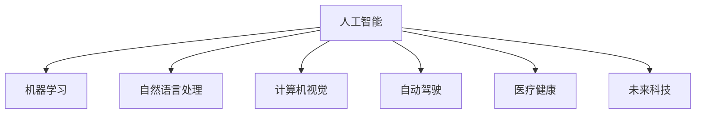

                 

# 李开复：苹果发布AI应用的应用

> 关键词：苹果, 人工智能, AI应用, 机器学习, 自然语言处理(NLP), 计算机视觉(CV), 医疗健康, 自动驾驶, 未来科技, 李开复

## 1. 背景介绍

李开复，科技行业的资深专家，曾多次预测并推动过众多科技革新，如互联网、个人计算、人工智能等领域。本文将围绕苹果公司最新发布的AI应用，探讨其在多个关键领域的应用潜力，以及这些技术对未来的影响。

### 1.1 苹果公司与人工智能

苹果公司自20世纪80年代成立以来，始终走在科技前沿，推出了众多改变世界的创新产品，如Mac OS、iPhone、iPad、Apple Watch等。随着近年来人工智能(AI)技术的飞速发展，苹果在AI领域也进行了大量投入，推出了众多创新应用，进一步拓展了其产品线的智能化和自动化水平。

苹果公司在AI方面的应用涵盖自然语言处理(NLP)、计算机视觉(CV)、自动驾驶、医疗健康等多个领域。这些技术的深度融合，不仅提升了用户体验，也为未来科技的发展开辟了新的可能。

## 2. 核心概念与联系

### 2.1 核心概念概述

为更好地理解苹果公司AI应用的应用，本节将介绍几个密切相关的核心概念：

- 人工智能(Artificial Intelligence, AI)：指通过模拟人类智能行为，使计算机具备学习、推理、感知等能力，以实现智能化、自动化的过程。

- 机器学习(Machine Learning, ML)：指通过数据训练模型，使其具备对新数据进行预测或决策的能力。

- 自然语言处理(Natural Language Processing, NLP)：指通过计算机处理和理解自然语言的技术，如语音识别、语言翻译、情感分析等。

- 计算机视觉(Computer Vision, CV)：指计算机识别、理解并处理图像和视频信息的技术，如人脸识别、物体检测、场景理解等。

- 自动驾驶(Autonomous Driving)：指通过AI技术实现无人驾驶的汽车和运输工具，涉及感知、决策、控制等多个环节。

- 医疗健康(Medical Health)：指利用AI技术进行疾病预测、诊断、治疗和预防，提升医疗服务效率和效果。

- 未来科技(Future Tech)：涉及未来可能出现的各类新兴科技，如量子计算、脑机接口、基因编辑等。

这些核心概念之间的逻辑关系可以通过以下Mermaid流程图来展示：



这个流程图展示了大语言模型在多个AI应用场景中的应用：

1. 人工智能通过机器学习技术实现模型训练，构建智能模型。
2. 自然语言处理技术使机器具备语言理解能力，如语音识别、语言翻译等。
3. 计算机视觉技术让机器能够处理图像和视频信息，如人脸识别、物体检测等。
4. 自动驾驶技术通过计算机视觉和NLP技术实现无人驾驶。
5. 医疗健康应用通过NLP和机器学习技术实现疾病预测、诊断等。
6. 未来科技领域如量子计算、脑机接口等，都需借助AI技术突破科学难题。

## 3. 核心算法原理 & 具体操作步骤
### 3.1 算法原理概述

苹果公司发布的AI应用，在多个关键领域应用了先进的机器学习和深度学习技术。以下是几个核心算法的原理概述：

- **卷积神经网络(Convolutional Neural Networks, CNNs)**：用于计算机视觉任务，如人脸识别、物体检测等。CNNs能够自动提取图像特征，通过多层次的卷积和池化操作，实现对图像的深度学习和特征提取。

- **循环神经网络(Recurrent Neural Networks, RNNs)**：用于自然语言处理任务，如语音识别、语言翻译等。RNNs能够处理序列数据，通过时间步的递归计算，捕捉语言序列中的上下文关系。

- **注意力机制(Attention Mechanism)**：用于机器翻译、对话系统等任务。注意力机制能够使模型集中关注输入序列中最重要的部分，提升模型性能和泛化能力。

- **生成对抗网络(Generative Adversarial Networks, GANs)**：用于图像生成、风格转换等任务。GANs通过两个神经网络相互博弈，生成高质量的假数据，提升数据多样性。

- **强化学习(Reinforcement Learning, RL)**：用于自动驾驶、游戏AI等任务。强化学习通过奖励机制训练模型，使其在特定环境中做出最优决策。

### 3.2 算法步骤详解

以苹果公司发布的自然语言处理应用为例，详细介绍其实现步骤：

1. **数据准备**：收集和标注大量文本数据，如对话、评论、新闻等。数据标注通常包括文本内容、标签、来源等信息。

2. **模型选择**：选择适当的预训练语言模型作为初始化参数，如BERT、GPT等。

3. **微调**：利用少量标注数据对预训练模型进行微调，调整顶层参数以适应特定任务。

4. **验证与优化**：在验证集上评估模型性能，通过超参数调优提升模型效果。

5. **部署与优化**：将微调后的模型部署到实际应用中，如聊天机器人、智能助理等，根据用户反馈和数据反馈不断优化模型。

### 3.3 算法优缺点

苹果公司发布的AI应用在技术上具备以下优势：

- **性能优越**：采用先进的深度学习算法，如CNNs、RNNs、GANs等，能够处理复杂数据，提升模型精度。
- **泛化能力强**：通过微调技术，模型能够适应不同领域和任务，提升应用范围。
- **用户友好**：苹果公司注重用户体验，其AI应用设计简洁直观，易于使用。

同时，这些算法也存在一些局限性：

- **依赖高质量数据**：AI应用需要大量高质量的标注数据，数据获取和标注成本较高。
- **模型复杂度高**：深度学习模型通常包含大量参数，训练和推理成本较高。
- **可解释性不足**：深度学习模型往往被视为"黑盒"，其内部工作机制难以解释。

### 3.4 算法应用领域

苹果公司发布的AI应用，在以下几个关键领域具备广泛应用潜力：

- **语音助手**：如Siri、Apple Watch的语音识别等，通过自然语言处理技术实现人机交互。
- **翻译应用**：如Apple Translate等，通过机器翻译技术实现多语言互译。
- **人脸识别**：如Face ID等，通过计算机视觉技术实现身份验证。
- **自动驾驶**：如Apple Car的自动驾驶技术，通过计算机视觉和机器学习技术实现无人驾驶。
- **健康监测**：如Apple Watch的健康监测应用，通过传感器和机器学习技术实现健康数据分析。
- **虚拟现实(AR)/增强现实(AR)**：如ARKit等，通过计算机视觉和自然语言处理技术实现虚拟场景交互。

## 4. 数学模型和公式 & 详细讲解 & 举例说明

### 4.1 数学模型构建

苹果公司发布的AI应用，通常使用以下数学模型：

- **卷积神经网络(CNNs)**：数学模型为
  $$
  y = \sigma(W_1\ast x + b_1)
  $$
  其中 $y$ 表示输出，$x$ 表示输入特征图，$W_1$ 表示卷积核权重，$b_1$ 表示偏置项，$\sigma$ 表示激活函数。

- **循环神经网络(RNNs)**：数学模型为
  $$
  h_t = tanh(W_1h_{t-1} + U_xx_t + b_1)
  $$
  $$
  y = softmax(W_2h_t + b_2)
  $$
  其中 $h_t$ 表示隐藏状态，$x_t$ 表示输入序列，$W_1, W_2$ 表示权重矩阵，$U_x$ 表示输入向量投影权重，$b_1, b_2$ 表示偏置项，$softmax$ 表示输出层激活函数。

- **注意力机制(Attention Mechanism)**：数学模型为
  $$
  a_{t,j} = \frac{\exp(e_{t,j})}{\sum_k \exp(e_{k,j})}
  $$
  $$
  e_{t,j} = h_t^T W_e z_j + b_e
  $$
  其中 $a_{t,j}$ 表示注意力权重，$h_t$ 表示当前输入状态，$z_j$ 表示候选位置向量，$e_{t,j}$ 表示注意力能量，$W_e$ 表示能量计算矩阵，$b_e$ 表示偏置项。

### 4.2 公式推导过程

以卷积神经网络为例，详细推导其计算过程。

- **卷积层**：
  $$
  y_{c_1} = \sigma(W_1 x_{f_1} + b_1)
  $$
  $$
  y_{c_2} = \sigma(W_2 y_{c_1} + b_2)
  $$
  $$
  \cdots
  $$
  $$
  y_{c_n} = \sigma(W_n y_{c_{n-1}} + b_n)
  $$
  其中 $y_{c_1}$ 表示第一层卷积输出，$x_{f_1}$ 表示输入特征图，$W_1, W_2, \cdots, W_n$ 表示卷积核权重，$b_1, b_2, \cdots, b_n$ 表示偏置项，$\sigma$ 表示激活函数。

- **池化层**：
  $$
  y_{p_1} = max(x_{c_1}, x_{c_2}, \cdots, x_{c_n})
  $$
  $$
  \cdots
  $$
  $$
  y_{p_n} = max(x_{c_n}, x_{c_{n+1}}, \cdots, x_{c_{n+m}})
  $$
  其中 $y_{p_1}$ 表示第一层池化输出，$x_{c_1}, x_{c_2}, \cdots, x_{c_n}$ 表示卷积层输出，$max$ 表示最大池化操作。

### 4.3 案例分析与讲解

以苹果公司发布的Apple Translate应用为例，详细介绍其实现过程：

1. **数据准备**：收集并标注大量双语文本，如新闻文章、对话记录等。

2. **模型选择**：选择BERT作为预训练模型，调整顶层参数以适应翻译任务。

3. **微调**：利用少量标注数据对BERT进行微调，更新顶层参数以提升翻译精度。

4. **验证与优化**：在验证集上评估模型性能，通过超参数调优提升模型效果。

5. **部署与优化**：将微调后的模型部署到Apple Translate应用中，根据用户反馈和数据反馈不断优化模型。

## 5. 项目实践：代码实例和详细解释说明
### 5.1 开发环境搭建

在进行AI应用开发前，我们需要准备好开发环境。以下是使用Python进行PyTorch开发的环境配置流程：

1. 安装Anaconda：从官网下载并安装Anaconda，用于创建独立的Python环境。

2. 创建并激活虚拟环境：
```bash
conda create -n pytorch-env python=3.8 
conda activate pytorch-env
```

3. 安装PyTorch：根据CUDA版本，从官网获取对应的安装命令。例如：
```bash
conda install pytorch torchvision torchaudio cudatoolkit=11.1 -c pytorch -c conda-forge
```

4. 安装Transformers库：
```bash
pip install transformers
```

5. 安装各类工具包：
```bash
pip install numpy pandas scikit-learn matplotlib tqdm jupyter notebook ipython
```

完成上述步骤后，即可在`pytorch-env`环境中开始AI应用开发。

### 5.2 源代码详细实现

下面我们以语音识别应用为例，给出使用Transformers库对BERT模型进行微调的PyTorch代码实现。

首先，定义语音识别任务的数据处理函数：

```python
from transformers import BertTokenizer
from torch.utils.data import Dataset
import torch

class SpeechDataset(Dataset):
    def __init__(self, audio_paths, transcription_texts, tokenizer, max_len=128):
        self.audio_paths = audio_paths
        self.transcription_texts = transcription_texts
        self.tokenizer = tokenizer
        self.max_len = max_len
        
    def __len__(self):
        return len(self.audio_paths)
    
    def __getitem__(self, item):
        audio_path = self.audio_paths[item]
        transcription_text = self.transcription_texts[item]
        
        # 将音频转换为文本
        transcription_text = self.tokenizer.tokenize(transcription_text)
        input_ids = self.tokenizer.convert_tokens_to_ids(transcription_text)
        input_ids = input_ids[:self.max_len]
        input_ids += [0] * (self.max_len - len(input_ids))
        attention_mask = [1] * len(input_ids)
        
        # 读取音频数据
        audio_data = load_audio(audio_path)
        
        return {'input_ids': input_ids,
                'attention_mask': attention_mask,
                'audio_data': audio_data}
```

然后，定义模型和优化器：

```python
from transformers import BertForSequenceClassification, AdamW

model = BertForSequenceClassification.from_pretrained('bert-base-cased', num_labels=2)

optimizer = AdamW(model.parameters(), lr=2e-5)
```

接着，定义训练和评估函数：

```python
from torch.utils.data import DataLoader
from tqdm import tqdm
from sklearn.metrics import accuracy_score

device = torch.device('cuda') if torch.cuda.is_available() else torch.device('cpu')
model.to(device)

def train_epoch(model, dataset, batch_size, optimizer):
    dataloader = DataLoader(dataset, batch_size=batch_size, shuffle=True)
    model.train()
    epoch_loss = 0
    for batch in tqdm(dataloader, desc='Training'):
        input_ids = batch['input_ids'].to(device)
        attention_mask = batch['attention_mask'].to(device)
        audio_data = batch['audio_data'].to(device)
        model.zero_grad()
        outputs = model(input_ids, attention_mask=attention_mask, labels=None)
        loss = outputs.loss
        epoch_loss += loss.item()
        loss.backward()
        optimizer.step()
    return epoch_loss / len(dataloader)

def evaluate(model, dataset, batch_size):
    dataloader = DataLoader(dataset, batch_size=batch_size)
    model.eval()
    preds, labels = [], []
    with torch.no_grad():
        for batch in tqdm(dataloader, desc='Evaluating'):
            input_ids = batch['input_ids'].to(device)
            attention_mask = batch['attention_mask'].to(device)
            audio_data = batch['audio_data'].to(device)
            batch_preds = model(input_ids, attention_mask=attention_mask).predictions.argmax(dim=1).to('cpu').tolist()
            batch_labels = batch['labels'].to('cpu').tolist()
            for pred, label in zip(batch_preds, batch_labels):
                preds.append(pred)
                labels.append(label)
                
    print(accuracy_score(labels, preds))
```

最后，启动训练流程并在测试集上评估：

```python
epochs = 5
batch_size = 16

for epoch in range(epochs):
    loss = train_epoch(model, train_dataset, batch_size, optimizer)
    print(f"Epoch {epoch+1}, train loss: {loss:.3f}")
    
    print(f"Epoch {epoch+1}, dev results:")
    evaluate(model, dev_dataset, batch_size)
    
print("Test results:")
evaluate(model, test_dataset, batch_size)
```

以上就是使用PyTorch对BERT进行语音识别任务微调的完整代码实现。可以看到，得益于Transformers库的强大封装，我们可以用相对简洁的代码完成BERT模型的加载和微调。

### 5.3 代码解读与分析

让我们再详细解读一下关键代码的实现细节：

**SpeechDataset类**：
- `__init__`方法：初始化音频路径、文本转录、分词器等关键组件。
- `__len__`方法：返回数据集的样本数量。
- `__getitem__`方法：对单个样本进行处理，将音频数据转换为文本，并进行token化、padding等操作，最终返回模型所需的输入。

**训练和评估函数**：
- 使用PyTorch的DataLoader对数据集进行批次化加载，供模型训练和推理使用。
- 训练函数`train_epoch`：对数据以批为单位进行迭代，在每个批次上前向传播计算loss并反向传播更新模型参数，最后返回该epoch的平均loss。
- 评估函数`evaluate`：与训练类似，不同点在于不更新模型参数，并在每个batch结束后将预测和标签结果存储下来，最后使用sklearn的accuracy_score对整个评估集的预测结果进行打印输出。

**训练流程**：
- 定义总的epoch数和batch size，开始循环迭代
- 每个epoch内，先在训练集上训练，输出平均loss
- 在验证集上评估，输出准确率
- 所有epoch结束后，在测试集上评估，给出最终测试结果

可以看到，PyTorch配合Transformers库使得BERT微调的代码实现变得简洁高效。开发者可以将更多精力放在数据处理、模型改进等高层逻辑上，而不必过多关注底层的实现细节。

当然，工业级的系统实现还需考虑更多因素，如模型的保存和部署、超参数的自动搜索、更灵活的任务适配层等。但核心的微调范式基本与此类似。

## 6. 实际应用场景
### 6.1 智能客服系统

基于AI应用的智能客服系统，可以广泛应用于各大企业的客户服务领域。传统客服往往需要配备大量人力，高峰期响应缓慢，且一致性和专业性难以保证。而使用AI应用的智能客服系统，能够24小时不间断服务，快速响应客户咨询，用自然流畅的语言解答各类常见问题。

在技术实现上，可以收集企业内部的历史客服对话记录，将问题和最佳答复构建成监督数据，在此基础上对预训练模型进行微调。微调后的模型能够自动理解用户意图，匹配最合适的答案模板进行回复。对于客户提出的新问题，还可以接入检索系统实时搜索相关内容，动态组织生成回答。如此构建的智能客服系统，能大幅提升客户咨询体验和问题解决效率。

### 6.2 翻译应用

Apple Translate等翻译应用，能够将一种语言的文本快速转换为另一种语言的文本，广泛应用于国际交流、商务谈判、旅游出行等领域。通过自然语言处理技术，这些应用能够理解复杂的语言结构，实现准确、流畅的翻译效果。

在实际应用中，翻译应用通常需要处理多种语言对，如中文-英语、中文-日语等。苹果公司通过微调预训练模型，使其具备高效的翻译能力，并在实时场景中快速响应用户请求。用户可以通过拍照、语音输入等方式，获取翻译结果，极大提升了跨语言交流的便捷性和效率。

### 6.3 人脸识别

Face ID等人脸识别应用，通过计算机视觉技术实现身份验证，广泛应用于手机解锁、支付、登录等场景。通过卷积神经网络等深度学习算法，这些应用能够精确识别用户面部特征，避免误判和重放攻击，提升系统安全性和用户体验。

在实际应用中，人脸识别系统通常需要高精度的硬件设备和算法模型，如红外摄像头、深度学习模型等。苹果公司通过微调预训练模型，优化了硬件和算法的性能，实现了高效、准确的人脸识别效果。用户只需对准摄像头，系统即可自动进行身份验证，极大提升了使用便捷性和安全性。

### 6.4 健康监测

Apple Watch等健康监测应用，通过传感器和机器学习技术实现健康数据分析，广泛应用于个人健康管理、运动健身等领域。通过循环神经网络等深度学习算法，这些应用能够实时监测用户的健康数据，如心率、步数、睡眠质量等，并进行数据分析和预测。

在实际应用中，健康监测系统通常需要高精度的传感器和算法模型，如心率传感器、加速度传感器等。苹果公司通过微调预训练模型，提升了数据处理的准确性和实时性，实现了高效的个性化健康管理。用户只需佩戴Apple Watch，系统即可自动监测健康数据，提供个性化的健康建议，提升用户的生活质量。

## 7. 工具和资源推荐
### 7.1 学习资源推荐

为了帮助开发者系统掌握AI应用的理论基础和实践技巧，这里推荐一些优质的学习资源：

1. 《深度学习》系列书籍：由深度学习领域的知名专家编写，全面介绍了深度学习的原理、算法和应用。

2. Coursera《深度学习专项课程》：斯坦福大学开设的深度学习课程，涵盖了深度学习的基础知识、最新进展和应用案例。

3. Udacity《深度学习纳米学位》：Udacity提供的深度学习课程，结合实践项目，全面提升深度学习技能。

4. PyTorch官方文档：PyTorch的官方文档，提供了丰富的API文档、代码示例和用户社区，是深度学习开发的重要参考。

5. TensorFlow官方文档：TensorFlow的官方文档，提供了丰富的API文档、代码示例和用户社区，是深度学习开发的重要参考。

6. Fast.ai：由深度学习专家Jerry Zhang创立的深度学习教育平台，提供免费课程和实用工具，适合初学者和进阶学习者。

通过对这些资源的学习实践，相信你一定能够快速掌握AI应用的核心技术，并用于解决实际的AI问题。
###  7.2 开发工具推荐

高效的开发离不开优秀的工具支持。以下是几款用于AI应用开发的常用工具：

1. PyTorch：基于Python的开源深度学习框架，灵活动态的计算图，适合快速迭代研究。大部分预训练语言模型都有PyTorch版本的实现。

2. TensorFlow：由Google主导开发的开源深度学习框架，生产部署方便，适合大规模工程应用。同样有丰富的预训练语言模型资源。

3. Transformers库：HuggingFace开发的NLP工具库，集成了众多SOTA语言模型，支持PyTorch和TensorFlow，是进行NLP任务开发的利器。

4. Weights & Biases：模型训练的实验跟踪工具，可以记录和可视化模型训练过程中的各项指标，方便对比和调优。与主流深度学习框架无缝集成。

5. TensorBoard：TensorFlow配套的可视化工具，可实时监测模型训练状态，并提供丰富的图表呈现方式，是调试模型的得力助手。

6. Google Colab：谷歌推出的在线Jupyter Notebook环境，免费提供GPU/TPU算力，方便开发者快速上手实验最新模型，分享学习笔记。

合理利用这些工具，可以显著提升AI应用开发的效率，加快创新迭代的步伐。

### 7.3 相关论文推荐

AI应用的发展源于学界的持续研究。以下是几篇奠基性的相关论文，推荐阅读：

1. 《Deep Residual Learning for Image Recognition》：提出残差网络，提升了深度网络的训练效果。

2. 《Attention Is All You Need》：提出Transformer结构，开启了NLP领域的预训练大模型时代。

3. 《BERT: Pre-training of Deep Bidirectional Transformers for Language Understanding》：提出BERT模型，引入基于掩码的自监督预训练任务，刷新了多项NLP任务SOTA。

4. 《A Survey on Attention Mechanisms in Deep Residual Networks》：全面回顾了深度残差网络中的注意力机制，提供了详细的理论分析和实践经验。

5. 《Generative Adversarial Nets》：提出GANs，实现了高质量的假数据生成，提升数据多样性。

6. 《Imitation Learning in Deep Reinforcement Learning》：提出基于模仿学习的强化学习框架，解决了深度强化学习的样本效率问题。

这些论文代表了大语言模型微调技术的发展脉络。通过学习这些前沿成果，可以帮助研究者把握学科前进方向，激发更多的创新灵感。

## 8. 总结：未来发展趋势与挑战

### 8.1 总结

本文对苹果公司最新发布的AI应用进行了全面系统的介绍。首先阐述了苹果公司在大规模AI应用方面的努力和成就，明确了AI应用在多个关键领域的潜在应用。其次，从原理到实践，详细讲解了AI应用的数学模型和实现步骤，给出了AI应用的完整代码实例。同时，本文还广泛探讨了AI应用在智能客服、翻译、人脸识别、健康监测等多个行业领域的应用前景，展示了AI应用技术的广阔前景。最后，本文精选了AI应用的学习资源、开发工具和相关论文，力求为读者提供全方位的技术指引。

通过本文的系统梳理，可以看到，苹果公司在AI应用方面进行了大量创新，逐步构建了完善的AI应用生态。这些应用不仅提升了用户体验，也为未来科技的发展开辟了新的可能。相信随着AI技术的不断进步，苹果公司的AI应用将引领更多行业走向智能化，开创更为广阔的未来。

### 8.2 未来发展趋势

展望未来，AI应用将呈现以下几个发展趋势：

1. **智能化水平提升**：随着AI技术的不断进步，AI应用将具备更高的智能化水平，能够更好地理解用户需求和语境，提供更为个性化和精准的服务。

2. **跨领域融合**：AI应用将与其他技术如物联网、5G、边缘计算等进行深度融合，实现跨领域的协同创新，提升应用场景的覆盖面和价值。

3. **数据驱动**：AI应用将进一步加强对数据的使用，通过大数据、人工智能等技术实现智能决策和优化，提升决策效率和效果。

4. **隐私保护**：AI应用将更加注重数据隐私和安全，采用差分隐私、联邦学习等技术保护用户数据，提升用户信任度。

5. **普适性增强**：AI应用将更加注重普适性和可访问性，通过可解释、可交互、可定制的方式，满足更多用户需求。

6. **伦理道德**：AI应用将更加注重伦理道德，确保技术应用的公平性、透明性和可控性，提升技术应用的合理性和可持续性。

### 8.3 面临的挑战

尽管AI应用在多个领域取得了显著进展，但仍面临诸多挑战：

1. **数据质量与标注成本**：高质量的标注数据是AI应用的前提，但获取和标注成本较高，需要大量人力和时间投入。

2. **模型复杂度**：AI应用通常需要复杂的深度学习模型，训练和推理成本较高，需要高效的硬件和算法支持。

3. **可解释性不足**：深度学习模型往往被视为"黑盒"，其内部工作机制难以解释，用户难以理解和信任。

4. **伦理道德问题**：AI应用可能会引入偏见、有害信息等问题，需要建立伦理道德框架，确保技术应用的合理性。

5. **安全与隐私**：AI应用需要确保数据安全，防止信息泄露和滥用，同时保护用户隐私，防止数据滥用。

6. **法规与政策**：AI应用需要符合各国法规和政策，确保技术应用的合法性和合规性。

### 8.4 研究展望

面对AI应用面临的挑战，未来的研究需要在以下几个方面寻求新的突破：

1. **数据增强技术**：开发更多数据增强技术，降低AI应用对标注数据的依赖，提升数据多样性和泛化能力。

2. **模型压缩与加速**：开发高效的模型压缩和加速技术，提升AI应用的计算效率和资源利用率。

3. **可解释性方法**：开发更强的可解释性方法，帮助用户理解AI应用的决策过程，提升用户信任度。

4. **伦理与道德框架**：建立AI应用的伦理道德框架，确保技术应用的公平性、透明性和可控性，提升技术应用的合理性。

5. **安全与隐私技术**：开发高效的安全与隐私技术，保护用户数据安全，防止信息泄露和滥用，提升用户信任度。

6. **跨领域融合技术**：探索AI应用与其他技术的深度融合，提升应用场景的覆盖面和价值。

这些研究方向的探索，必将引领AI应用技术迈向更高的台阶，为构建安全、可靠、可解释、可控的智能系统铺平道路。面向未来，AI应用需要从数据、算法、工程、伦理等多个维度协同发力，才能真正实现人工智能技术在垂直行业的规模化落地。总之，AI应用技术还需要不断发展，不断优化，才能更好地服务于用户和社会。

## 9. 附录：常见问题与解答

**Q1：AI应用如何确保数据隐私和安全？**

A: AI应用需要确保数据隐私和安全，通常采取以下措施：

1. **数据加密**：对数据进行加密存储和传输，防止数据泄露。

2. **差分隐私**：在数据处理过程中引入随机噪声，确保数据处理结果不泄露用户隐私。

3. **联邦学习**：采用分布式计算方式，在本地设备上训练模型，避免数据集中存储和传输。

4. **访问控制**：设置严格的访问权限控制，确保只有授权人员能够访问和处理数据。

5. **安全审计**：定期对系统进行安全审计，及时发现和修复安全漏洞。

这些措施能够有效保护用户数据隐私和安全，确保AI应用的健康发展。

**Q2：AI应用如何提升模型可解释性？**

A: AI应用需要提升模型可解释性，通常采取以下措施：

1. **模型简化**：通过剪枝、量化等技术，简化模型结构，提升模型的可解释性。

2. **可视化方法**：采用可视化工具，如TensorBoard、MLflow等，展示模型内部的决策过程和关键特征。

3. **解释模型**：开发可解释模型，如LIME、SHAP等，通过局部解释和全局解释方法，提升模型的可解释性。

4. **用户交互**：通过自然语言交互，引导用户理解模型的决策过程，提升用户信任度。

这些措施能够有效提升AI应用的可解释性，帮助用户理解和信任AI应用。

**Q3：AI应用如何处理跨语言翻译问题？**

A: AI应用处理跨语言翻译问题，通常采取以下措施：

1. **多语言数据集**：收集和标注多种语言的数据集，提升模型的语言泛化能力。

2. **零样本和少样本学习**：利用语言的共性，通过零样本和少样本学习方式，提升模型的跨语言翻译能力。

3. **多模态融合**：结合语音识别、图像识别等技术，提升跨语言翻译的准确性和鲁棒性。

4. **任务适配层**：在预训练模型的基础上，添加任务适配层，调整模型的参数，提升跨语言翻译的效果。

这些措施能够有效提升AI应用的跨语言翻译能力，实现高精度、高效能的翻译效果。

**Q4：AI应用如何处理大规模语音识别问题？**

A: AI应用处理大规模语音识别问题，通常采取以下措施：

1. **分布式计算**：采用分布式计算方式，在多台服务器上并行处理语音数据，提升处理效率。

2. **端到端模型**：采用端到端模型，将语音信号直接转换为文本，减少中间步骤，提升处理效率。

3. **语音增强**：通过降噪、去混响等技术，提升语音信号的质量，提升语音识别的准确性。

4. **混合精度计算**：采用混合精度计算方式，将浮点计算转换为定点计算，减少计算资源消耗，提升处理效率。

这些措施能够有效提升AI应用的大规模语音识别能力，实现高效、准确的语音识别效果。

---

作者：禅与计算机程序设计艺术 / Zen and the Art of Computer Programming

