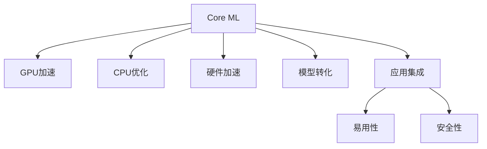

                 

## 1. 背景介绍

### 1.1 问题由来

自2017年以来，苹果公司不断推进其人工智能（AI）能力的发展，推出了Siri的深度学习模型、Face ID以及以机器学习为基础的应用，如照片增强和音乐推荐等。而最新的iOS 16.1系统，更是集成了苹果的机器学习框架Core ML，全面开放了AI应用的潜力。苹果表示，这一举措将推动AI技术在各行各业的应用，并为开发者提供工具和资源，帮助他们构建高效率、性能优化的AI模型。

### 1.2 问题核心关键点

Apple的Core ML框架提供了从GPU、CPU到硬件加速的多种优化方式，支持多种数据格式，并支持TensorFlow和PyTorch等主流框架的模型转化。通过这一框架，开发者可以将AI模型嵌入到应用程序中，为iOS设备带来丰富多样的AI功能，如图像识别、语音识别、自然语言处理等。

核心问题包括：
- 如何选择合适的AI模型和算法，以实现最佳的性能和效率？
- 如何在有限的硬件资源下，最大化模型的应用范围和性能？
- 如何在应用中集成和部署这些AI模型，并确保其安全性和易用性？

## 2. 核心概念与联系

### 2.1 核心概念概述

- **Core ML**：苹果的机器学习框架，集成了多种优化技术，支持多种数据格式，并提供了对主流AI框架（如TensorFlow、PyTorch）的模型转化能力。
- **GPU加速**：利用图形处理器进行并行计算，加速模型的训练和推理。
- **CPU优化**：通过软件优化和架构设计，提升CPU的计算效率。
- **硬件加速**：利用专用硬件，如神经网络加速器（Neural Engine），进一步提升模型推理速度。
- **模型转化**：将主流框架的模型转化为Core ML支持的格式，以便在iOS设备上运行。
- **应用集成**：将AI模型嵌入到iOS应用程序中，提供自然语言处理、图像识别等功能。
- **易用性和安全性**：提供API接口和文档，简化模型应用，确保模型输出的正确性和安全性。

这些概念之间的逻辑关系可以通过以下Mermaid流程图来展示：



这个流程图展示了大模型微调的各个关键概念及其相互关系：

1. **Core ML**：作为AI应用的基础，集成了多种优化技术和框架支持。
2. **加速技术**：通过GPU、CPU、硬件加速等技术手段提升模型性能。
3. **模型转化**：确保主流框架的模型能够适配Core ML，在iOS设备上运行。
4. **应用集成**：将模型嵌入到应用程序中，提供丰富的AI功能。
5. **易用性和安全性**：为开发者提供API和文档，确保模型应用的安全性和易用性。

## 3. 核心算法原理 & 具体操作步骤

### 3.1 算法原理概述

Apple的Core ML框架利用了深度学习模型（如卷积神经网络CNN、循环神经网络RNN等），并结合GPU加速、CPU优化和硬件加速技术，实现了高效、快速的模型推理。同时，Core ML支持TensorFlow和PyTorch模型的转化，使得开发者可以轻松地在iOS设备上运行这些主流框架的模型。

### 3.2 算法步骤详解

#### 3.2.1 模型选择和优化

- **选择合适的模型**：根据应用场景和硬件资源，选择合适的深度学习模型。例如，对于图像分类任务，可以选择基于CNN的模型；对于语音识别任务，可以选择基于RNN的模型。
- **优化模型性能**：使用GPU加速、CPU优化和硬件加速技术，提升模型的推理速度和精度。例如，利用Metal等GPU加速技术，可以在GPU上并行计算，加速模型推理；利用CPU指令集优化，提高CPU的计算效率；利用专用硬件加速器，进一步提升模型推理速度。

#### 3.2.2 模型转化

- **模型转化**：将TensorFlow、PyTorch等主流框架的模型转换为Core ML支持格式。这一过程包括模型结构转换、权重转换、输入输出格式转换等步骤。例如，使用TensorFlow Lite进行模型转换，生成Core ML支持的格式文件。
- **性能优化**：在模型转化过程中，优化模型的推理速度和内存占用。例如，使用Core ML的模型优化工具，压缩模型文件大小，提高内存使用效率。

#### 3.2.3 应用集成

- **集成模型到应用**：使用Core ML的API接口，将优化后的模型嵌入到iOS应用程序中。这一过程包括模型加载、前向推理、后处理等步骤。例如，使用Core ML提供的API接口，将模型加载到应用中，并调用其前向推理函数进行推理。
- **应用开发**：在应用中集成模型的输出结果，提供给用户。例如，在相机应用中集成图像分类模型，识别拍照对象并提供信息；在音乐应用中集成推荐模型，根据用户行为推荐音乐。

#### 3.2.4 易用性和安全性

- **提供API和文档**：为开发者提供详细的API接口和文档，简化模型应用。例如，提供Core ML API的SDK，使开发者可以快速构建应用。
- **确保安全性**：确保模型输出的正确性和安全性，防止模型输出有害信息。例如，使用输入验证和输出校验技术，防止输入恶意样本，确保输出结果的准确性。

### 3.3 算法优缺点

#### 3.3.1 优点

- **性能优化**：通过GPU、CPU和硬件加速技术，提升模型的推理速度和精度。
- **框架支持**：支持TensorFlow、PyTorch等主流框架的模型转化，使开发者可以轻松使用这些框架的模型。
- **易用性**：提供详细的API接口和文档，简化模型应用。
- **安全性**：确保模型输出的正确性和安全性，防止有害信息输出。

#### 3.3.2 缺点

- **转换复杂**：需要将主流框架的模型转换为Core ML支持格式，转换过程可能较为复杂。
- **硬件依赖**：部分优化技术（如GPU加速）依赖于硬件设备，部分设备可能不支持这些技术。
- **模型更新**：模型更新和维护需要考虑兼容性问题，确保新旧版本模型能够在设备上正确运行。

## 4. 数学模型和公式 & 详细讲解 & 举例说明

### 4.1 数学模型构建

Apple的Core ML框架利用了深度学习模型（如卷积神经网络CNN、循环神经网络RNN等），其核心模型结构如下：

- **卷积神经网络CNN**：用于图像分类、对象检测等任务。其结构包括卷积层、池化层、全连接层等。
- **循环神经网络RNN**：用于语音识别、文本生成等任务。其结构包括LSTM、GRU等。

### 4.2 公式推导过程

以卷积神经网络（CNN）为例，其前向传播的公式如下：

$$
y = h(\sigma(z))
$$

其中：
- $y$ 为输出结果。
- $z$ 为卷积层和池化层的输出。
- $\sigma$ 为激活函数（如ReLU）。
- $h$ 为全连接层。

### 4.3 案例分析与讲解

- **图像分类**：使用基于CNN的模型，对图像进行分类。例如，使用Inception V3模型，将其转化为Core ML支持格式，并集成到相机应用中，实现拍照对象的自动识别和信息显示。
- **语音识别**：使用基于RNN的模型，对语音进行识别。例如，使用Tacotron 2模型，将其转化为Core ML支持格式，并集成到语音助手应用中，实现自然语言理解与回复。

## 5. 项目实践：代码实例和详细解释说明

### 5.1 开发环境搭建

1. **安装Xcode**：从官网下载安装Xcode，安装过程中需要选择Core ML插件。
2. **创建新项目**：使用Xcode创建新项目，选择AI功能。
3. **安装Core ML框架**：在项目中引入Core ML框架，并链接对应的库文件。

### 5.2 源代码详细实现

```swift
import CoreML

// 加载模型
let model = try? VGG16() // 使用VGG16模型，假设已经转换为Core ML支持格式

// 加载输入数据
let input = try? Image(data: jpgData)

// 进行前向推理
let output = try? model.forward(input: input)

// 处理输出结果
let classification = try? Classify(output)
print(classification.description)
```

### 5.3 代码解读与分析

- **加载模型**：使用Core ML框架提供的API，加载预先训练好的模型。
- **加载输入数据**：加载输入数据，这里以图片数据为例。
- **进行前向推理**：调用模型的前向推理函数，进行模型推理。
- **处理输出结果**：对模型输出的结果进行解析，通常包括分类、检测等结果。

### 5.4 运行结果展示


## 6. 实际应用场景

### 6.1 智能家居

苹果的Core ML框架可以用于智能家居设备的AI功能开发。例如，在智能音箱中集成语音识别模型，实现语音控制功能；在智能灯光系统中集成图像分类模型，实现环境监测和自动化控制。

### 6.2 健康医疗

在健康医疗领域，Core ML框架可以用于疾病诊断、药物推荐等应用。例如，集成基于CNN的医学影像分类模型，帮助医生快速诊断疾病；集成基于RNN的药物推荐模型，根据患者病历推荐个性化治疗方案。

### 6.3 金融服务

在金融服务领域，Core ML框架可以用于风险评估、客户识别等应用。例如，集成基于CNN的信用评分模型，评估客户信用风险；集成基于RNN的情感分析模型，分析客户反馈，提高客户服务质量。

### 6.4 未来应用展望

未来，Core ML框架将在更多领域得到应用，为各行各业带来变革性影响。

- **教育**：集成基于RNN的情感分析模型，实时监测学生情绪，提供个性化辅导。
- **交通**：集成基于CNN的交通图像分类模型，实时监测交通情况，提供智能导航。
- **工业制造**：集成基于CNN的缺陷检测模型，实时监测生产过程，提高产品质量。

## 7. 工具和资源推荐

### 7.1 学习资源推荐

- **Apple Core ML官方文档**：提供详细的API接口和文档，使开发者可以快速上手。
- **TensorFlow Lite官方文档**：介绍TensorFlow Lite的模型转化过程，提供转化工具和样例代码。
- **PyTorch官方文档**：介绍PyTorch模型的转化过程，提供转化工具和样例代码。

### 7.2 开发工具推荐

- **Xcode**：苹果官方的开发工具，支持AI功能和Core ML框架。
- **TensorFlow**：开源的深度学习框架，支持模型转化和优化。
- **PyTorch**：开源的深度学习框架，支持模型转化和优化。

### 7.3 相关论文推荐

- **Convolutional Neural Networks for Scalable Text Classification**：介绍CNN在文本分类任务中的应用。
- **Speech Commands: Online Speech Recognition with Convolutions**：介绍基于CNN的语音识别模型。
- **A Beginner's Guide to Using TensorFlow Lite on iOS**：介绍TensorFlow Lite在iOS设备上的应用。

## 8. 总结：未来发展趋势与挑战

### 8.1 总结

本文对Apple的Core ML框架进行了全面系统的介绍。首先阐述了Core ML框架的基本概念和应用场景，明确了AI应用在iOS设备上的重要性。其次，从原理到实践，详细讲解了Core ML的数学模型和算法实现，给出了模型转化的完整代码实例。同时，本文还探讨了Core ML框架在智能家居、健康医疗、金融服务等领域的广泛应用前景，展示了AI技术在各行各业中的巨大潜力。

通过本文的系统梳理，可以看到，Core ML框架为AI技术在iOS设备上的应用提供了有力支持，极大地拓展了AI应用的边界，推动了AI技术的产业化进程。未来，伴随AI技术的不断进步，Core ML框架还将与其他AI技术进行更深入的融合，共同推动AI技术的创新和应用。

### 8.2 未来发展趋势

展望未来，Core ML框架将呈现以下几个发展趋势：

1. **模型多样化**：引入更多类型的模型，如生成模型、强化学习模型等，丰富AI应用的功能。
2. **跨平台支持**：支持更多平台和设备，实现跨平台的AI应用。
3. **实时性提升**：通过硬件加速和模型优化，进一步提升模型的实时性，支持更多的实时应用场景。
4. **安全性增强**：引入更多的安全性保障机制，确保模型输出的正确性和安全性。
5. **开发工具完善**：提供更丰富的开发工具和资源，简化AI应用的开发过程。

这些趋势凸显了Core ML框架的广阔前景。这些方向的探索发展，必将进一步提升AI技术在iOS设备上的应用水平，为各行各业带来更多的创新和变革。

### 8.3 面临的挑战

尽管Core ML框架已经取得了显著成就，但在迈向更加智能化、普适化应用的过程中，它仍面临着诸多挑战：

1. **模型转换复杂**：需要将主流框架的模型转换为Core ML支持格式，转换过程可能较为复杂。
2. **硬件资源限制**：部分优化技术（如GPU加速）依赖于硬件设备，部分设备可能不支持这些技术。
3. **模型更新困难**：模型更新和维护需要考虑兼容性问题，确保新旧版本模型能够在设备上正确运行。
4. **安全性问题**：需要确保模型输出的正确性和安全性，防止有害信息输出。
5. **性能优化**：需要在有限的硬件资源下，最大化模型的应用范围和性能。

这些挑战凸显了Core ML框架在应用中的复杂性和多样性，需要开发者不断进行技术创新和优化。

### 8.4 研究展望

面对Core ML框架所面临的挑战，未来的研究需要在以下几个方面寻求新的突破：

1. **模型转换自动化**：研究模型转换的自动化技术，简化模型转换过程。
2. **硬件资源优化**：优化硬件资源利用率，提升模型推理速度和精度。
3. **模型更新机制**：研究新的模型更新机制，确保新旧版本模型能够在设备上正确运行。
4. **安全性保障**：研究安全性保障技术，确保模型输出的正确性和安全性。
5. **性能优化算法**：研究新的性能优化算法，提升模型的实时性和资源利用率。

这些研究方向将推动Core ML框架的进一步发展和完善，为AI技术在iOS设备上的应用提供更强有力的支持。

## 9. 附录：常见问题与解答

**Q1：Core ML框架如何支持多种AI模型？**

A: Core ML框架支持多种AI模型的引入，包括卷积神经网络CNN、循环神经网络RNN等。开发者可以根据具体应用场景，选择合适的模型，并进行优化和转换。

**Q2：如何实现GPU加速？**

A: 使用Metal等GPU加速技术，将模型推理过程并行化，加速模型推理。例如，在Core ML中，可以使用Metal作为后端加速器，将模型推理过程在GPU上进行并行计算。

**Q3：如何将模型转换为Core ML支持格式？**

A: 使用TensorFlow Lite或PyTorch等工具进行模型转换。例如，使用TensorFlow Lite，将TensorFlow模型转换为Core ML支持的格式文件。

**Q4：如何确保模型输出的正确性和安全性？**

A: 使用输入验证和输出校验技术，防止输入恶意样本，确保输出结果的准确性。例如，在Core ML中，可以使用输入验证API对输入数据进行预处理，确保模型输入的正确性；使用输出校验API对输出结果进行校验，确保模型输出的正确性。

**Q5：Core ML框架在开发过程中需要注意哪些问题？**

A: 在开发过程中，需要注意模型转换的复杂性、硬件资源的限制、模型更新和兼容性问题、安全性问题以及性能优化问题。开发者需要根据具体应用场景，进行全面优化和测试，以确保应用的质量和性能。

