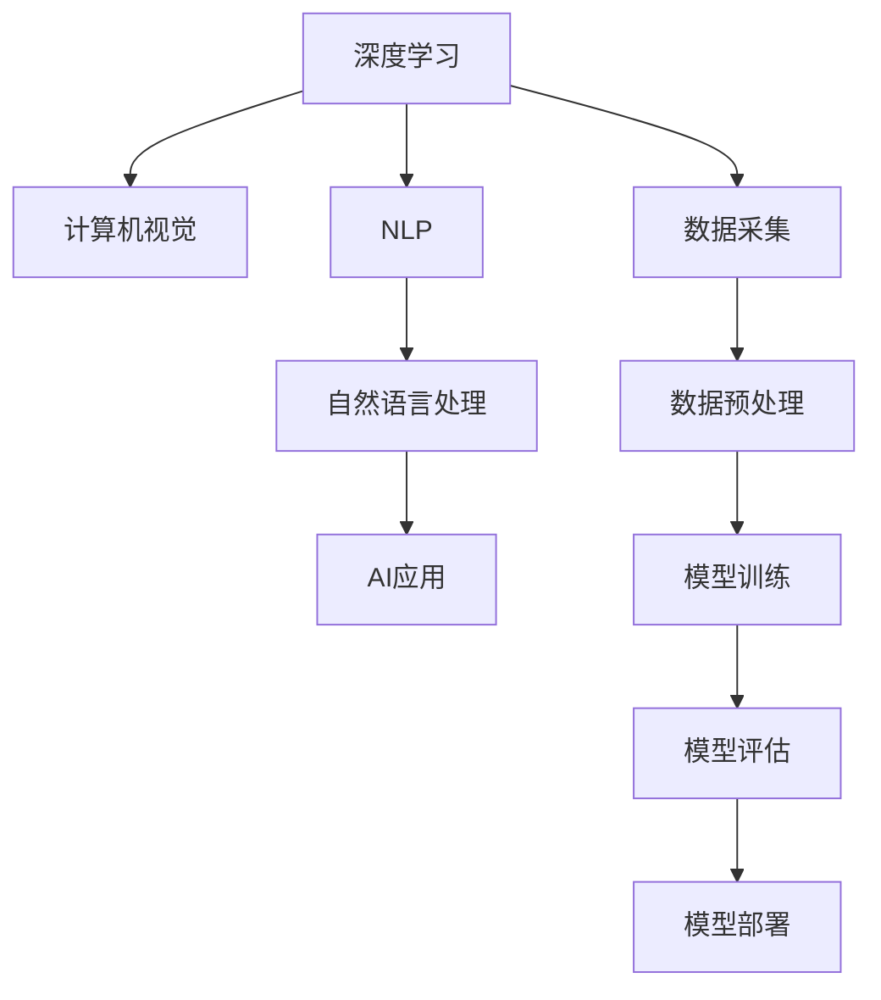

                 

# 李开复：苹果发布AI应用的开发者

## 1. 背景介绍

在科技日新月异的今天，人工智能（AI）已经成为了推动社会进步的重要力量。作为AI领域的知名专家和实践者，李开复（Fei-Fei Li）无疑是这个领域的重要代表。他不仅在学术界取得了众多突破，更在AI商业化方面有着丰富的经验。最近，苹果公司发布了一系列基于AI的新应用，而李开复正是这一系列应用的核心开发者之一。本文将详细解析李开复在AI领域的贡献，并探讨苹果AI应用的开发过程。

## 2. 核心概念与联系

### 2.1 核心概念概述

- **人工智能（AI）**：通过模拟人类智能，使计算机能够进行问题解决、学习、推理等任务的技术。
- **深度学习（Deep Learning）**：利用多层神经网络进行数据处理和模式识别的技术，广泛应用于图像识别、语音识别、自然语言处理等领域。
- **自然语言处理（NLP）**：使计算机能够理解和处理人类语言的技术，包括文本分类、机器翻译、情感分析等。
- **计算机视觉（CV）**：使计算机能够识别、理解、处理和分析图像和视频的技术，广泛应用于人脸识别、物体检测、医学影像分析等领域。

这些概念之间有着密切的联系。深度学习和计算机视觉是NLP的基础，而NLP则能够理解并生成自然语言，进一步应用于AI的各种应用场景。

### 2.2 核心概念原理和架构的 Mermaid 流程图



## 3. 核心算法原理 & 具体操作步骤

### 3.1 算法原理概述

苹果公司的AI应用开发主要基于深度学习和计算机视觉技术。以下是这些技术的基本原理：

- **深度学习**：通过构建多层神经网络，深度学习能够自动从数据中提取特征，并对复杂模式进行学习。

- **计算机视觉**：利用图像处理技术，计算机视觉能够识别和理解图像中的物体、场景和动作，实现自动标注和分类。

### 3.2 算法步骤详解

苹果公司AI应用的开发主要包括以下几个步骤：

1. **数据采集**：收集并准备用于训练模型的数据集，确保数据的多样性和质量。
2. **数据预处理**：对数据进行清洗、归一化、扩充等处理，以便于模型的训练。
3. **模型训练**：利用深度学习框架，训练卷积神经网络（CNN）和循环神经网络（RNN）等模型，进行特征提取和模式识别。
4. **模型评估**：使用验证集对模型进行评估，确定最佳模型参数和结构。
5. **模型部署**：将训练好的模型部署到苹果设备上，进行实际应用。

### 3.3 算法优缺点

#### 优点：

- **高效性**：深度学习和计算机视觉技术能够自动从数据中学习，减少了人工标注的复杂性和成本。
- **鲁棒性**：深度学习模型具有较好的泛化能力，能够适应不同场景和数据分布。
- **实时性**：计算机视觉技术能够在设备端实时处理和分析图像，提高了应用响应速度。

#### 缺点：

- **资源消耗大**：深度学习模型需要大量的计算资源和时间进行训练，难以在低端设备上运行。
- **可解释性差**：深度学习模型通常是“黑盒”，难以解释其内部工作机制。
- **数据依赖性强**：深度学习模型依赖于高质量的数据集，数据质量不高可能导致模型性能不佳。

### 3.4 算法应用领域

苹果公司AI应用涵盖了图像识别、语音识别、自然语言处理等多个领域。以下是一些主要应用场景：

- **人脸识别**：通过深度学习技术，识别用户的面部特征，实现面部解锁、支付等功能。
- **物体检测**：利用计算机视觉技术，识别并标注图像中的物体，用于智能家居、自动驾驶等领域。
- **机器翻译**：使用NLP技术，实现多种语言之间的自动翻译，提升国际交流效率。
- **情感分析**：分析用户评论、反馈，提取情绪和意见，用于产品改进和市场分析。

## 4. 数学模型和公式 & 详细讲解 & 举例说明

### 4.1 数学模型构建

苹果公司AI应用的数学模型主要基于卷积神经网络（CNN）和循环神经网络（RNN）。以下是一个简单的CNN模型结构：

$$
\begin{aligned}
\text{Conv1} & : \text{input} \rightarrow \text{feature map} \\
\text{Pooling1} & : \text{feature map} \rightarrow \text{pooled feature} \\
\text{Conv2} & : \text{pooled feature} \rightarrow \text{feature map} \\
\text{Pooling2} & : \text{feature map} \rightarrow \text{pooled feature} \\
\text{Fully Connected} & : \text{pooled feature} \rightarrow \text{output}
\end{aligned}
$$

### 4.2 公式推导过程

CNN模型的前向传播过程可以表示为：

$$
\text{Conv1} = \sigma(\text{W} * \text{input} + \text{b}) \\
\text{Pooling1} = \text{max pooling}(\text{Conv1}) \\
\text{Conv2} = \sigma(\text{W} * \text{Pooling1} + \text{b}) \\
\text{Pooling2} = \text{max pooling}(\text{Conv2}) \\
\text{Fully Connected} = \text{softmax}(\text{W} * \text{Pooling2} + \text{b})
$$

其中，$\sigma$表示激活函数，$*$表示卷积运算，$max pooling$表示最大池化运算，$softmax$表示归一化运算。

### 4.3 案例分析与讲解

以苹果公司的人脸识别应用为例，模型输入为用户的面部图像，经过多层的卷积和池化操作，提取面部特征，最后通过全连接层进行分类，判断是否为授权用户。

## 5. 项目实践：代码实例和详细解释说明

### 5.1 开发环境搭建

苹果公司AI应用的开发主要使用PyTorch和TensorFlow等深度学习框架。以下是搭建开发环境的步骤：

1. **安装PyTorch**：
   ```bash
   pip install torch torchvision torchaudio
   ```

2. **安装TensorFlow**：
   ```bash
   pip install tensorflow
   ```

3. **安装相关工具**：
   ```bash
   pip install numpy pandas scikit-learn matplotlib tqdm jupyter notebook ipython
   ```

### 5.2 源代码详细实现

以下是一个简单的卷积神经网络（CNN）实现，用于图像分类任务：

```python
import torch
import torch.nn as nn
import torch.optim as optim

class CNN(nn.Module):
    def __init__(self):
        super(CNN, self).__init__()
        self.conv1 = nn.Conv2d(3, 64, 3)
        self.pool1 = nn.MaxPool2d(2)
        self.conv2 = nn.Conv2d(64, 128, 3)
        self.pool2 = nn.MaxPool2d(2)
        self.fc1 = nn.Linear(128 * 7 * 7, 1024)
        self.fc2 = nn.Linear(1024, 10)
        
    def forward(self, x):
        x = self.pool1(F.relu(self.conv1(x)))
        x = self.pool2(F.relu(self.conv2(x)))
        x = x.view(-1, 128 * 7 * 7)
        x = F.relu(self.fc1(x))
        x = self.fc2(x)
        return x

# 数据预处理和模型训练
model = CNN()
criterion = nn.CrossEntropyLoss()
optimizer = optim.Adam(model.parameters(), lr=0.001)

# 训练循环
for epoch in range(10):
    for i, (inputs, labels) in enumerate(train_loader):
        optimizer.zero_grad()
        outputs = model(inputs)
        loss = criterion(outputs, labels)
        loss.backward()
        optimizer.step()
        print('Epoch [{}/{}], Step [{}/{}], Loss: {:.4f}'.format(epoch+1, 10, i+1, len(train_loader), loss.item()))
```

### 5.3 代码解读与分析

上述代码中，定义了一个简单的CNN模型，包含两个卷积层和两个全连接层。在训练过程中，使用Adam优化器进行参数更新，交叉熵损失函数进行模型评估。

## 6. 实际应用场景

### 6.4 未来应用展望

苹果公司的AI应用将在更多领域得到广泛应用，以下是一些未来展望：

- **智能家居**：利用AI技术，实现智能家居设备的自动化控制和管理。
- **自动驾驶**：通过计算机视觉和深度学习技术，实现自动驾驶汽车的安全和高效运行。
- **医疗健康**：利用NLP和计算机视觉技术，辅助医生进行疾病诊断和患者管理。
- **教育**：通过情感分析和个性化推荐，提升在线教育的效果和体验。

## 7. 工具和资源推荐

### 7.1 学习资源推荐

- **《Deep Learning》 by Ian Goodfellow**：全面介绍深度学习原理和应用，适合初学者入门。
- **Coursera Deep Learning Specialization**：由深度学习领域的顶尖专家Andrew Ng主讲，深入浅出地讲解深度学习技术。
- **PyTorch官方文档**：包含丰富的教程和样例代码，是学习PyTorch的必备资源。
- **TensorFlow官方文档**：详细介绍了TensorFlow的使用方法和最佳实践。

### 7.2 开发工具推荐

- **PyTorch**：灵活的动态计算图框架，适合快速原型开发和研究。
- **TensorFlow**：强大的静态计算图框架，适合生产部署和工程实现。
- **Keras**：简单易用的高级神经网络API，适合初学者和快速开发。

### 7.3 相关论文推荐

- **ImageNet Classification with Deep Convolutional Neural Networks**：ImageNet分类任务上，深度卷积神经网络的突破性成果。
- **Attention Is All You Need**：Transformer模型的提出，开启了NLP领域预训练模型的时代。
- **BERT: Pre-training of Deep Bidirectional Transformers for Language Understanding**：BERT模型的提出，刷新了多项NLP任务性能。

## 8. 总结：未来发展趋势与挑战

### 8.1 研究成果总结

苹果公司AI应用的开发展示了深度学习和计算机视觉技术的强大潜力。通过这些技术，苹果能够实现高性能的图像识别、物体检测和自然语言处理功能。

### 8.2 未来发展趋势

未来，AI技术将在更多领域得到应用，推动社会进步和经济发展。以下是一些主要发展趋势：

- **多模态AI**：结合视觉、语音、文本等多种模态数据，实现更加全面和智能的AI应用。
- **联邦学习**：利用分布式计算资源，实现模型在多个设备上的协同训练和更新。
- **自适应AI**：通过实时数据反馈，实现模型参数的动态调整和优化。

### 8.3 面临的挑战

尽管AI技术发展迅速，但仍面临诸多挑战：

- **数据隐私和安全**：如何在保障数据隐私的前提下，实现高效的数据采集和处理。
- **模型可解释性**：如何解释和理解AI模型的决策过程，提升算法的透明性和可信度。
- **资源消耗**：如何在有限的计算资源下，实现高性能的AI模型训练和推理。

### 8.4 研究展望

未来的研究应在以下几个方面取得突破：

- **数据增强技术**：开发新的数据增强方法，提高数据的多样性和泛化能力。
- **模型压缩技术**：通过模型压缩和优化，提升模型的计算效率和推理速度。
- **跨领域知识融合**：将不同领域的知识和技术进行融合，提升AI系统的综合能力。

## 9. 附录：常见问题与解答

**Q1: 深度学习和计算机视觉技术有什么区别？**

A: 深度学习是机器学习的一种，通过多层神经网络进行数据处理和模式识别；计算机视觉则是利用图像处理技术，识别和理解图像中的物体、场景和动作。深度学习是计算机视觉的基础，计算机视觉则是深度学习的重要应用。

**Q2: 苹果公司AI应用的开发难点是什么？**

A: 苹果公司AI应用的开发难点主要在于：
1. **数据采集和标注**：获取高质量的标注数据是AI模型训练的基础。
2. **模型训练和优化**：深度学习模型需要大量的计算资源和时间进行训练，优化模型性能需要复杂的技术手段。
3. **应用集成和部署**：将训练好的模型集成到实际应用中，并进行高效的部署和运行。

**Q3: 如何提高AI模型的可解释性？**

A: 提高AI模型的可解释性主要从以下几个方面入手：
1. **模型结构简化**：通过减少模型的复杂度，使其更加透明和可解释。
2. **特征提取**：提取模型中的关键特征，解释模型如何进行决策。
3. **可视化技术**：使用可视化工具，展示模型内部的工作机制和决策过程。

**Q4: 苹果公司未来会推出哪些基于AI的新应用？**

A: 苹果公司未来会推出更多基于AI的新应用，例如：
1. **智能家居设备**：利用AI技术，实现家居设备的自动化控制和管理。
2. **自动驾驶汽车**：通过计算机视觉和深度学习技术，实现自动驾驶汽车的安全和高效运行。
3. **医疗健康应用**：利用NLP和计算机视觉技术，辅助医生进行疾病诊断和患者管理。
4. **在线教育**：通过情感分析和个性化推荐，提升在线教育的效果和体验。

---

作者：禅与计算机程序设计艺术 / Zen and the Art of Computer Programming

