                 

# 李开复：苹果发布AI应用的意义

> 关键词：苹果, 人工智能, AI应用, 深度学习, 自然语言处理, 计算机视觉

## 1. 背景介绍

### 1.1 问题由来
近年来，人工智能（AI）技术在各行各业的应用场景中不断扩展。从自动驾驶到语音识别，再到医疗诊断，AI正逐渐改变着人类的生产和生活方式。苹果作为科技巨头，其在AI领域的布局，一直是业界关注的焦点。

### 1.2 问题核心关键点
苹果公司近日发布了全新的AI应用，标志着其在AI技术上的进一步深入。这一消息引发了科技圈的热烈讨论。李开复，作为人工智能领域的专家，对苹果AI应用的意义有着深入的见解。

## 2. 核心概念与联系

### 2.1 核心概念概述

李开复认为，苹果发布的AI应用标志着公司在AI技术上的重要进展。这些AI应用涵盖了自然语言处理（NLP）、计算机视觉（CV）和深度学习等领域，代表了当今AI技术的前沿水平。

### 2.2 核心概念原理和架构的 Mermaid 流程图

```mermaid
graph LR
A[自然语言处理] --> B[语言模型]
A --> C[情感分析]
A --> D[自动摘要]
A --> E[问答系统]
A --> F[文本分类]

B --> G[语音识别]
B --> H[语音合成]

C --> I[情感判断]
C --> J[用户情绪分析]

D --> K[文本压缩]
D --> L[内容精炼]

E --> M[问题回答]
E --> N[对话管理]

F --> O[文本分类]
F --> P[主题分类]

G --> Q[语音识别]
G --> R[口音识别]

H --> S[语音合成]
H --> T[情感生成]

I --> U[用户情绪]
I --> V[用户体验]

J --> W[用户反馈]
J --> X[意见分析]

K --> Y[文本摘要]
K --> Z[内容归纳]

L --> AA[内容优化]
L --> AB[信息精简]

M --> AC[问题回答]
M --> AD[知识库匹配]

N --> AE[对话控制]
N --> AF[上下文理解]

O --> AG[文本分类]
O --> AH[情感分析]

P --> AI[主题分类]
P --> AJ[用户兴趣]

Q --> AK[语音识别]
Q --> AL[环境识别]

R --> AM[情感生成]
R --> AN[语音转换]

S --> AO[语音合成]
S --> AP[情感调节]

T --> AQ[情感生成]
T --> AR[情感表达]

U --> AS[用户情绪]
U --> AT[行为分析]

V --> AU[用户反馈]
V --> AV[情感调节]

W --> AW[用户反馈]
W --> AX[意见分析]

X --> AY[用户情绪]
X --> AZ[情感分析]

Y --> BA[文本摘要]
Y --> BB[内容总结]

Z --> CA[内容优化]
Z --> CB[信息精简]

AA --> CC[文本优化]
AA --> CD[信息精简]

AB --> CE[内容优化]
AB --> CF[信息精简]

AC --> CG[问题回答]
AC --> CH[知识库匹配]

AD --> CI[对话控制]
AD --> CJ[上下文理解]

AE --> CK[对话控制]
AE --> CL[上下文理解]

AF --> CM[对话控制]
AF --> CN[上下文理解]

AG --> CO[文本分类]
AG --> CP[情感分析]

AH --> CQ[主题分类]
AH --> CR[用户兴趣]

AI --> CS[主题分类]
AI --> CQ[用户兴趣]

AJ --> CA[主题分类]
AJ --> CB[用户兴趣]

AK --> CA[语音识别]
AK --> CB[环境识别]

AL --> CA[语音转换]
AL --> CB[情感生成]

AM --> CA[语音合成]
AM --> CB[情感调节]

AN --> CA[情感生成]
AN --> CB[情感表达]

AQ --> CA[情感生成]
AQ --> CB[情感表达]

AR --> CA[情感生成]
AR --> CB[情感调节]

AS --> CA[用户情绪]
AS --> CB[行为分析]

AT --> CA[用户反馈]
AT --> CB[情感调节]

AW --> CA[用户反馈]
AW --> CB[意见分析]

AX --> CA[用户情绪]
AX --> CB[情感分析]

AY --> CA[文本摘要]
AY --> CB[内容总结]

AZ --> CA[内容优化]
AZ --> CB[信息精简]

BA --> CA[文本摘要]
BA --> CB[内容总结]

BB --> CA[文本摘要]
BB --> CB[内容总结]

CA --> DA[文本优化]
CA --> DB[信息精简]

CB --> EA[文本优化]
CB --> EB[信息精简]

CC --> FA[文本优化]
CC --> FB[信息精简]

CD --> GA[文本优化]
CD --> GB[信息精简]

CE --> HA[文本优化]
CE --> HB[信息精简]

CF --> IA[文本优化]
CF --> IB[信息精简]

CG --> JA[文本优化]
CG --> JB[信息精简]

CH --> KA[文本优化]
CH --> KB[信息精简]

CI --> LA[对话控制]
CI --> LB[上下文理解]

CJ --> MA[对话控制]
CJ --> MB[上下文理解]

CL --> NA[对话控制]
CL --> NB[上下文理解]

CM --> OA[对话控制]
CM --> OB[上下文理解]

CN --> PA[对话控制]
CN --> PB[上下文理解]

CO --> QA[文本分类]
CO --> QB[情感分析]

CP --> RA[文本分类]
CP --> RB[情感分析]

CQ --> SA[文本分类]
CQ --> SB[情感分析]

CR --> TA[主题分类]
CR --> TB[用户兴趣]

CS --> UA[主题分类]
CS --> UB[用户兴趣]

CT --> VA[情感生成]
CT --> VB[情感调节]

CU --> WA[情感生成]
CU --> WB[情感调节]

CV --> XA[情感生成]
CV --> XB[情感调节]

CW --> YA[情感生成]
CW --> YB[情感调节]

CA --> ZA[用户情绪]
CA --> ZB[行为分析]

CB --> WA[用户反馈]
CB --> WB[情感调节]

CC --> XA[用户反馈]
CC --> XB[意见分析]

CD --> YA[用户反馈]
CD --> YB[情感分析]

CE --> ZA[用户反馈]
CE --> ZB[意见分析]

CF --> WA[用户反馈]
CF --> WB[意见分析]

CG --> XA[用户反馈]
CG --> XB[意见分析]

CH --> YA[用户反馈]
CH --> YB[意见分析]

CI --> ZA[用户反馈]
CI --> ZB[意见分析]

CJ --> UA[用户反馈]
CJ --> UB[意见分析]

CL --> VA[用户反馈]
CL --> VB[意见分析]

CM --> WA[用户反馈]
CM --> WB[意见分析]

CN --> XA[用户反馈]
CN --> XB[意见分析]

CO --> YA[用户反馈]
CO --> YB[意见分析]

CP --> ZA[用户反馈]
CP --> ZB[意见分析]

CQ --> UA[用户反馈]
CQ --> UB[意见分析]

CR --> VA[用户反馈]
CR --> VB[意见分析]

CS --> WA[用户反馈]
CS --> WB[意见分析]

CT --> XA[用户反馈]
CT --> XB[意见分析]

CU --> YA[用户反馈]
CU --> YB[意见分析]

CV --> ZA[用户反馈]
CV --> ZB[意见分析]

CW --> UA[用户反馈]
CW --> UB[意见分析]

CA --> DA[用户反馈]
CA --> DB[意见分析]

CB --> EA[用户反馈]
CB --> EB[意见分析]

CC --> FA[用户反馈]
CC --> FB[意见分析]

CD --> GA[用户反馈]
CD --> GB[意见分析]

CE --> HA[用户反馈]
CE --> HB[意见分析]

CF --> IA[用户反馈]
CF --> IB[意见分析]

CG --> JA[用户反馈]
CG --> JB[意见分析]

CH --> KA[用户反馈]
CH --> KB[意见分析]

CI --> LA[用户反馈]
CI --> LB[意见分析]

CJ --> MA[用户反馈]
CJ --> MB[意见分析]

CL --> NA[用户反馈]
CL --> NB[意见分析]

CM --> OA[用户反馈]
CM --> OB[意见分析]

CN --> PA[用户反馈]
CN --> PB[意见分析]

DA --> EA[用户反馈]
DA --> EB[意见分析]

DB --> FA[用户反馈]
DB --> FB[意见分析]

DC --> GA[用户反馈]
DC --> GB[意见分析]

DD --> HA[用户反馈]
DD --> HB[意见分析]

DE --> IA[用户反馈]
DE --> IB[意见分析]

DF -->JA[用户反馈]
DF -->JB[意见分析]

DG -->KA[用户反馈]
DG --> KB[意见分析]

DH --> LA[用户反馈]
DH --> LB[意见分析]

DI --> MA[用户反馈]
DI --> MB[意见分析]

DJ --> NA[用户反馈]
DJ --> NB[意见分析]

DK --> OA[用户反馈]
DK --> OB[意见分析]

DL --> PA[用户反馈]
DL --> PB[意见分析]

DM --> QA[用户反馈]
DM --> QB[意见分析]

DN --> RA[用户反馈]
DN --> RB[意见分析]

DO --> SA[用户反馈]
DO --> SB[意见分析]

DP --> TA[用户反馈]
DP --> TB[意见分析]

DQ --> UA[用户反馈]
DQ --> UB[意见分析]

DR --> VA[用户反馈]
DR --> VB[意见分析]

DS --> WA[用户反馈]
DS --> WB[意见分析]

DT --> XA[用户反馈]
DT --> XB[意见分析]

DU --> YA[用户反馈]
DU --> YB[意见分析]

DV --> ZA[用户反馈]
DV --> ZB[意见分析]

DW --> UA[用户反馈]
DW --> UB[意见分析]

DA --> EA[用户反馈]
DA --> EB[意见分析]

DB --> FA[用户反馈]
DB --> FB[意见分析]

DC --> GA[用户反馈]
DC --> GB[意见分析]

DD --> HA[用户反馈]
DD --> HB[意见分析]

DE --> IA[用户反馈]
DE --> IB[意见分析]

DF -->JA[用户反馈]
DF -->JB[意见分析]

DG -->KA[用户反馈]
DG --> KB[意见分析]

DH --> LA[用户反馈]
DH --> LB[意见分析]

DI --> MA[用户反馈]
DI --> MB[意见分析]

DJ --> NA[用户反馈]
DJ --> NB[意见分析]

DK --> OA[用户反馈]
DK --> OB[意见分析]

DL --> PA[用户反馈]
DL --> PB[意见分析]

DM --> QA[用户反馈]
DM --> QB[意见分析]

DN --> RA[用户反馈]
DN --> RB[意见分析]

DO --> SA[用户反馈]
DO --> SB[意见分析]

DP --> TA[用户反馈]
DP --> TB[意见分析]

DQ --> UA[用户反馈]
DQ --> UB[意见分析]

DR --> VA[用户反馈]
DR --> VB[意见分析]

DS --> WA[用户反馈]
DS --> WB[意见分析]

DT --> XA[用户反馈]
DT --> XB[意见分析]

DU --> YA[用户反馈]
DU --> YB[意见分析]

DV --> ZA[用户反馈]
DV --> ZB[意见分析]

DW --> UA[用户反馈]
DW --> UB[意见分析]
```



## 3. 核心算法原理 & 具体操作步骤
### 3.1 算法原理概述

李开复认为，苹果发布的AI应用代表了深度学习和大规模数据在实际应用中的最佳实践。这些应用充分利用了深度学习模型在处理大规模复杂数据集方面的优势，同时通过大规模训练数据的积累，提升了模型的泛化能力和鲁棒性。

### 3.2 算法步骤详解

苹果的AI应用主要包括以下几个关键步骤：

1. **数据准备**：收集和清洗大量的标注数据，构建训练集、验证集和测试集。
2. **模型选择**：根据任务类型选择合适的深度学习模型，如BERT、GPT等。
3. **模型训练**：使用深度学习框架（如TensorFlow、PyTorch等）进行模型训练，调整超参数以优化模型性能。
4. **模型评估**：在验证集上评估模型性能，根据评估结果调整模型和超参数。
5. **模型微调**：在测试集上微调模型，进一步提升模型性能。
6. **部署应用**：将训练好的模型部署到实际应用中，进行实时推理和预测。

### 3.3 算法优缺点

苹果的AI应用具有以下优点：

1. **高性能**：利用深度学习模型的高性能和大规模数据训练，提升模型预测的准确率和鲁棒性。
2. **易于部署**：模型被优化为低延迟、高效率的形式，便于集成到移动设备、服务器等平台。
3. **广泛适用性**：支持多种NLP和CV任务，包括语音识别、文本分类、情感分析等。

同时，也存在一些缺点：

1. **资源需求高**：需要高性能的GPU/TPU等硬件设备，以及大量的标注数据。
2. **模型复杂**：模型结构复杂，需要较高的维护成本和技术门槛。
3. **数据隐私**：大量数据采集和使用可能涉及隐私问题，需加强数据保护措施。

### 3.4 算法应用领域

苹果的AI应用涵盖了以下几个主要应用领域：

1. **医疗健康**：利用NLP技术处理病历记录，辅助医生诊断和治疗。
2. **金融服务**：使用CV技术分析图像和文本数据，进行风险评估和欺诈检测。
3. **智能家居**：通过语音识别和情感分析，提升智能家居的用户体验。
4. **智能客服**：利用NLP技术构建智能客服系统，提高服务质量和效率。

## 4. 数学模型和公式 & 详细讲解 & 举例说明

### 4.1 数学模型构建

以自然语言处理（NLP）为例，李开复指出，苹果的AI应用中使用了基于Transformer的BERT模型，其核心架构为：

- **输入层**：将输入文本转换为模型所需的格式。
- **Transformer层**：通过注意力机制（Attention Mechanism）捕捉输入文本的语义关系。
- **输出层**：将Transformer层的输出映射为所需的标签或向量表示。

### 4.2 公式推导过程

BERT模型的基本结构可以表示为：

$$
f(x) = f_{input}(x) \times f_{transformer}(x) \times f_{output}(x)
$$

其中，$f_{input}$、$f_{transformer}$和$f_{output}$分别表示输入层、Transformer层和输出层。

在Transformer层中，注意力机制可以通过以下公式计算：

$$
Attention(Q,K,V) = \frac{e^{QK^T}}{\sum_{i=1}^{n} e^{QK^T}} KV
$$

其中，$Q$、$K$和$V$分别表示查询、键和值向量，$e^{QK^T}$表示查询和键的矩阵乘积的指数形式，$\sum_{i=1}^{n} e^{QK^T}$表示所有查询向量和键向量的指数形式之和。

### 4.3 案例分析与讲解

以文本分类为例，假设模型输入为文本，输出为分类标签。其训练过程可以表示为：

1. 将输入文本转换为模型所需的向量表示：
   $$
   x = f_{input}(x)
   $$
2. 输入到Transformer层进行处理：
   $$
   h = f_{transformer}(x)
   $$
3. 将处理后的向量表示映射为分类标签：
   $$
   y = f_{output}(h)
   $$

其中，$f_{output}$通常是一个线性分类器，如Softmax层。

## 5. 项目实践：代码实例和详细解释说明

### 5.1 开发环境搭建

在进行AI应用开发前，首先需要搭建好开发环境。以下是在PyTorch框架下搭建开发环境的步骤：

1. 安装Python：从官网下载安装Python3.7及以上版本。
2. 安装PyTorch：使用pip安装PyTorch，建议安装最新版本。
3. 安装其他依赖包：安装TensorBoard、tqdm、scikit-learn等依赖包。

### 5.2 源代码详细实现

以下是一个简单的NLP文本分类的PyTorch代码实现：

```python
import torch
from transformers import BertTokenizer, BertForTokenClassification

# 初始化模型和分词器
tokenizer = BertTokenizer.from_pretrained('bert-base-cased')
model = BertForTokenClassification.from_pretrained('bert-base-cased', num_labels=3)

# 定义数据处理函数
def process_data(text):
    encoding = tokenizer(text, return_tensors='pt', padding='max_length', truncation=True)
    input_ids = encoding['input_ids']
    attention_mask = encoding['attention_mask']
    return input_ids, attention_mask

# 定义训练函数
def train_epoch(model, dataloader, optimizer):
    model.train()
    for batch in dataloader:
        input_ids, attention_mask = batch
        outputs = model(input_ids, attention_mask=attention_mask)
        loss = outputs.loss
        loss.backward()
        optimizer.step()

# 定义评估函数
def evaluate(model, dataloader):
    model.eval()
    total_loss = 0
    correct = 0
    with torch.no_grad():
        for batch in dataloader:
            input_ids, attention_mask = batch
            outputs = model(input_ids, attention_mask=attention_mask)
            loss = outputs.loss
            total_loss += loss.item()
            predictions = outputs.logits.argmax(dim=2)
            correct += torch.sum(predictions == batch[1]).item()
    return total_loss / len(dataloader), correct / len(dataloader.dataset)

# 训练模型
device = torch.device('cuda' if torch.cuda.is_available() else 'cpu')
model.to(device)

# 数据集
train_dataset = ...
dev_dataset = ...
test_dataset = ...

# 训练参数
epochs = 5
batch_size = 16
learning_rate = 2e-5

# 优化器
optimizer = torch.optim.AdamW(model.parameters(), lr=learning_rate)

# 训练
for epoch in range(epochs):
    train_epoch(model, train_dataloader, optimizer)
    train_loss, train_acc = evaluate(model, train_dataloader)
    dev_loss, dev_acc = evaluate(model, dev_dataloader)
    print(f"Epoch {epoch+1}, train loss: {train_loss:.3f}, train acc: {train_acc:.3f}, dev loss: {dev_loss:.3f}, dev acc: {dev_acc:.3f}")

# 测试
test_loss, test_acc = evaluate(model, test_dataloader)
print(f"Test loss: {test_loss:.3f}, test acc: {test_acc:.3f}")
```

### 5.3 代码解读与分析

上述代码实现了基于BERT模型的文本分类任务。首先，初始化模型和分词器，然后定义数据处理函数和训练、评估函数。最后，在指定设备上训练模型，并在测试集上评估性能。

代码中使用了PyTorch的BertForTokenClassification模型，并定义了数据处理函数和训练、评估函数。训练函数中，模型在每个batch上进行前向传播、反向传播和优化器更新，评估函数中，模型在测试集上计算损失和准确率。

## 6. 实际应用场景

### 6.1 智能客服系统

苹果的AI应用在智能客服系统中的应用尤为显著。通过自然语言处理技术，智能客服系统可以自动理解用户问题，并提供最合适的回答。

### 6.2 金融服务

在金融领域，苹果的AI应用可以通过图像和文本分析，进行风险评估和欺诈检测，大大提高了金融机构的运营效率和风险管理能力。

### 6.3 智能家居

智能家居中，苹果的AI应用通过语音识别和情感分析，提升了用户体验，使家居设备更加智能化和个性化。

### 6.4 未来应用展望

未来，苹果的AI应用将继续拓展到更多领域，如医疗健康、智能制造等。随着AI技术的发展，更多复杂的任务将得到解决，AI将在人类社会的各个方面发挥更大的作用。

## 7. 工具和资源推荐

### 7.1 学习资源推荐

1. 《深度学习》：Ian Goodfellow等人所著，全面介绍了深度学习的基本概念和技术。
2. 《NLP理论与实践》：国内知名NLP专家李平所著，系统讲解了NLP的基本理论和实践方法。
3. 《TensorFlow实战》：Google官方出版物，介绍了TensorFlow的基本使用方法和实践案例。
4. 《PyTorch实战》：Facebook开源项目，介绍了PyTorch的基本使用方法和实践案例。

### 7.2 开发工具推荐

1. PyTorch：灵活的深度学习框架，支持动态计算图和丰富的模型库。
2. TensorFlow：支持大规模分布式训练和模型部署。
3. Jupyter Notebook：开源的Jupyter环境，支持实时交互和代码共享。
4. TensorBoard：可视化工具，帮助开发者监控模型训练过程和性能。

### 7.3 相关论文推荐

1. Transformer模型：Vaswani等人所著，介绍了Transformer模型及其在NLP中的应用。
2. BERT模型：Devlin等人所著，介绍了BERT模型及其在NLP中的应用。
3. GPT模型：OpenAI团队所著，介绍了GPT模型及其在NLP中的应用。

## 8. 总结：未来发展趋势与挑战

### 8.1 研究成果总结

苹果发布的AI应用标志着其在深度学习和自然语言处理领域的进一步深入。这些应用利用大规模数据和先进算法，提升了模型的泛化能力和鲁棒性，展示了深度学习在实际应用中的巨大潜力。

### 8.2 未来发展趋势

未来，AI应用将继续在更多领域得到应用，如医疗健康、智能制造等。随着AI技术的发展，更多复杂的任务将得到解决，AI将在人类社会的各个方面发挥更大的作用。

### 8.3 面临的挑战

尽管AI应用取得了显著进展，但仍面临一些挑战，如数据隐私、模型鲁棒性、资源消耗等。如何克服这些挑战，是未来AI应用发展的关键。

### 8.4 研究展望

未来的研究需要在数据隐私、模型鲁棒性、资源消耗等方面寻求新的突破，同时加强跨领域、跨学科的合作，推动AI技术的持续发展。

## 9. 附录：常见问题与解答

**Q1：AI应用是否适用于所有行业？**

A: AI应用具有广泛适用性，但不同行业对AI的需求和应用场景各异，需根据具体需求选择合适的AI解决方案。

**Q2：AI应用的开发难度如何？**

A: AI应用的开发难度较高，需要深厚的理论基础和丰富的实践经验。初学者可以从基础知识入手，逐步掌握相关技术。

**Q3：AI应用对资源消耗有多少？**

A: AI应用对计算资源和存储空间有较高要求，需要高性能的GPU/TPU等硬件设备，以及大量的标注数据。

**Q4：AI应用在实际部署中面临哪些问题？**

A: AI应用在实际部署中面临资源消耗、模型鲁棒性、数据隐私等挑战。开发者需要结合具体应用场景，选择合适的解决方案。

---

作者：禅与计算机程序设计艺术 / Zen and the Art of Computer Programming

