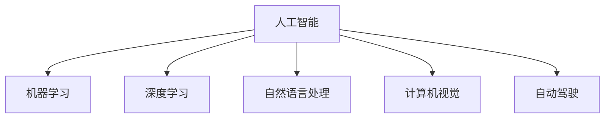

                 

# 李开复：苹果发布AI应用的未来

## 1. 背景介绍

### 1.1 问题由来
苹果公司近日宣布推出一系列以AI技术为驱动的全新应用，再次证明了其在人工智能领域的雄心。这一举措标志着苹果在AI应用上迈出了重要一步，也为未来AI技术的发展提供了新的方向。李开复博士在多个公开场合多次提到苹果的AI应用，并对其未来发展做出预测。本文将从李开复的视角，探讨苹果AI应用的发展趋势及其对行业的影响。

### 1.2 问题核心关键点
苹果此次推出的AI应用主要包括语音识别、图像识别、自然语言处理和自动驾驶等技术。这些应用涵盖了语音、视觉、自然语言等多个领域，展示了苹果在AI技术上的全面布局。

李开复在多个场合强调了AI在自动驾驶、医疗、教育和娱乐等领域的应用潜力，并预测苹果未来将在AI领域取得重大突破。他认为，AI技术不仅能提升用户体验，还能开辟新的商业模式，推动技术进步。

## 2. 核心概念与联系

### 2.1 核心概念概述

为更好地理解苹果AI应用的未来，本节将介绍几个密切相关的核心概念：

- 人工智能(Artificial Intelligence, AI)：通过算法和计算，模拟人类智能活动的理论、开发与应用。
- 机器学习(Machine Learning, ML)：一种使机器通过数据学习与改进的方法，是AI的重要分支。
- 深度学习(Deep Learning, DL)：一种基于神经网络的机器学习技术，具有强大的数据处理和模式识别能力。
- 自然语言处理(Natural Language Processing, NLP)：涉及计算机理解和处理人类语言的技术，如语音识别、机器翻译、情感分析等。
- 计算机视觉(Computer Vision, CV)：使计算机能够识别、理解并处理图像、视频等视觉数据的技术。
- 自动驾驶(Autonomous Driving)：通过AI技术实现车辆的自主驾驶，减少人为驾驶的复杂性和危险性。

这些核心概念之间的逻辑关系可以通过以下Mermaid流程图来展示：



这个流程图展示了他核心的概念以及它们之间的关联：

1. 人工智能是根基，包括机器学习、深度学习、自然语言处理、计算机视觉和自动驾驶等分支。
2. 深度学习作为机器学习的重要分支，具有强大的数据处理和模式识别能力，适用于复杂的图像、语音和自然语言处理任务。
3. 自然语言处理和计算机视觉是AI的重要应用领域，涉及大量现实世界中的问题，如语音识别、机器翻译、情感分析、图像分类等。
4. 自动驾驶是AI的典型应用场景，涉及到多个AI技术的融合，需要高效的数据处理和强大的决策能力。

## 3. 核心算法原理 & 具体操作步骤
### 3.1 算法原理概述

苹果的AI应用涵盖了多个技术领域，如语音识别、图像识别、自然语言处理和自动驾驶等。这些技术的应用原理可以总结如下：

- 语音识别：通过深度神经网络，将语音信号转换为文本，实现语音与文本的转换。
- 图像识别：使用卷积神经网络(CNN)处理图像数据，提取图像特征，并通过分类器实现图像分类。
- 自然语言处理：利用预训练语言模型，如BERT、GPT等，对文本进行编码、解码和分类。
- 自动驾驶：结合计算机视觉、深度学习和强化学习技术，实现对环境感知、路径规划和决策控制。

### 3.2 算法步骤详解

以苹果的语音识别为例，介绍其算法步骤：

1. **数据收集与预处理**：收集大量语音数据，并对其进行预处理，如去噪、归一化、分帧等操作。
2. **特征提取**：利用MFCC(Mel Frequency Cepstral Coefficients)等方法提取语音的特征。
3. **模型训练**：构建深度神经网络模型，如RNN(Recurrent Neural Networks)、LSTM(Long Short-Term Memory Networks)等，对提取的特征进行训练。
4. **模型优化**：使用优化算法(如Adam)对模型进行优化，调整超参数。
5. **模型评估与测试**：在测试集上评估模型性能，如准确率、召回率、F1-score等。
6. **应用部署**：将训练好的模型部署到实际应用场景中，实现语音识别功能。

### 3.3 算法优缺点

苹果的AI应用具有以下优点：

- **技术领先**：苹果公司拥有强大的研发能力和丰富的经验，能够在多个AI技术领域保持领先地位。
- **跨领域整合**：通过将AI技术应用到多个领域，苹果能够提供更全面、更智能的产品和服务。
- **用户体验提升**：AI技术能够优化用户体验，如语音助手、图像识别、自动翻译等，提高用户操作的便捷性。

同时，苹果的AI应用也存在一些缺点：

- **高昂成本**：AI技术的开发和部署成本高，需要大量资金和技术投入。
- **数据隐私问题**：AI应用涉及大量用户数据，数据隐私和安全问题亟需解决。
- **技术瓶颈**：某些AI技术（如自动驾驶）尚处于发展初期，技术成熟度有待提高。

### 3.4 算法应用领域

苹果的AI应用涵盖了语音识别、图像识别、自然语言处理和自动驾驶等多个领域，具体应用如下：

- **语音识别**：应用于Siri语音助手、文本输入、语音转文本等场景。
- **图像识别**：应用于Face ID人脸识别、图像搜索、实时翻译等场景。
- **自然语言处理**：应用于Siri对话系统、智能推送、翻译服务等场景。
- **自动驾驶**：应用于Apple Car自动驾驶系统，实现车辆自主导航和环境感知。

## 4. 数学模型和公式 & 详细讲解  
### 4.1 数学模型构建

以苹果的语音识别为例，其数学模型可以表示为：

$$
y = f(x; \theta)
$$

其中，$x$ 表示输入的语音信号，$y$ 表示输出文本，$f(x; \theta)$ 表示深度神经网络模型，$\theta$ 为模型参数。

### 4.2 公式推导过程

语音识别模型的推导过程如下：

1. **输入处理**：将语音信号转换为MFCC特征，即：

   $$
   x' = MFCC(x)
   $$

2. **特征编码**：将MFCC特征输入到RNN模型中，得到编码后的特征表示：

   $$
   h_t = RNN(x', \theta)
   $$

3. **解码与预测**：将编码后的特征表示$h_t$输入到LSTM模型中，进行解码和预测：

   $$
   y' = LSTM(h_t, \theta)
   $$

4. **损失函数计算**：计算模型输出$y'$与真实标签$y$之间的交叉熵损失函数：

   $$
   L = -\sum_i y_i \log(y'_i)
   $$

5. **反向传播**：利用反向传播算法，计算模型参数的梯度：

   $$
   \nabla_{\theta} L = \frac{\partial L}{\partial \theta}
   $$

6. **模型更新**：利用梯度下降等优化算法更新模型参数：

   $$
   \theta \leftarrow \theta - \eta \nabla_{\theta} L
   $$

### 4.3 案例分析与讲解

以苹果的Face ID为例，分析其图像识别模型的构建过程：

1. **数据集收集与预处理**：收集大量人脸图像，并进行预处理，如裁剪、归一化、旋转校正等操作。
2. **特征提取**：利用卷积神经网络(CNN)提取图像特征，生成特征向量：

   $$
   f(x_i) = CNN(x_i)
   $$

3. **模型训练**：使用Siamese网络或Triplet网络等架构进行训练，构建人脸识别模型：

   $$
   y_i = \text{Softmax}(CNN(x_i))
   $$

4. **模型优化**：使用优化算法(如Adam)对模型进行优化，调整超参数：

   $$
   \theta \leftarrow \theta - \eta \nabla_{\theta} L
   $$

5. **模型评估与测试**：在测试集上评估模型性能，如识别率、误识率等：

   $$
   P = \frac{TP}{TP+FP}, R = \frac{TP}{TP+FN}
   $$

其中，$TP$ 表示真实正类且被正确识别的样本数，$FP$ 表示真实负类但被误识别的样本数，$FN$ 表示真实正类但被遗漏的样本数。

6. **应用部署**：将训练好的模型部署到实际应用场景中，实现人脸识别功能。

## 5. 项目实践：代码实例和详细解释说明
### 5.1 开发环境搭建

在进行语音识别项目开发前，我们需要准备好开发环境。以下是使用Python进行PyTorch开发的环境配置流程：

1. 安装Anaconda：从官网下载并安装Anaconda，用于创建独立的Python环境。

2. 创建并激活虚拟环境：
```bash
conda create -n pytorch-env python=3.8 
conda activate pytorch-env
```

3. 安装PyTorch：根据CUDA版本，从官网获取对应的安装命令。例如：
```bash
conda install pytorch torchvision torchaudio cudatoolkit=11.1 -c pytorch -c conda-forge
```

4. 安装各种依赖库：
```bash
pip install numpy pandas scikit-learn
```

5. 安装语音处理库：
```bash
pip install librosa
```

完成上述步骤后，即可在`pytorch-env`环境中开始语音识别项目的开发。

### 5.2 源代码详细实现

以下是使用PyTorch进行语音识别的代码实现，以Siri语音助手为例：

```python
import torch
import torch.nn as nn
import torch.optim as optim
from torch.autograd import Variable
import librosa

class RNN(nn.Module):
    def __init__(self, input_size, hidden_size, output_size):
        super(RNN, self).__init__()
        self.input_size = input_size
        self.hidden_size = hidden_size
        self.output_size = output_size
        
        self.rnn = nn.RNN(input_size, hidden_size, batch_first=True)
        self.fc = nn.Linear(hidden_size, output_size)
    
    def forward(self, x, h):
        out, h = self.rnn(x, h)
        out = self.fc(out)
        return out, h

class LSTM(nn.Module):
    def __init__(self, input_size, hidden_size, output_size):
        super(LSTM, self).__init__()
        self.input_size = input_size
        self.hidden_size = hidden_size
        self.output_size = output_size
        
        self.lstm = nn.LSTM(input_size, hidden_size, batch_first=True)
        self.fc = nn.Linear(hidden_size, output_size)
    
    def forward(self, x, h):
        out, h = self.lstm(x, h)
        out = self.fc(out)
        return out, h

def train_rnn(rnn, input_data, target_data, batch_size, num_epochs, learning_rate):
    criterion = nn.CrossEntropyLoss()
    optimizer = optim.Adam(rnn.parameters(), lr=learning_rate)
    
    for epoch in range(num_epochs):
        loss = 0
        for i in range(0, input_data.size(0), batch_size):
            input_batch = input_data[i:i+batch_size, :]
            target_batch = target_data[i:i+batch_size, :]
            
            h0 = torch.zeros(batch_size, 1, rnn.hidden_size).to(rnn)
            c0 = torch.zeros(batch_size, 1, rnn.hidden_size).to(rnn)
            
            rnn.zero_grad()
            outputs, h, c = rnn(input_batch, (h0, c0))
            loss += criterion(outputs, target_batch)
            
            loss.backward()
            optimizer.step()
            
        print(f"Epoch {epoch+1}, loss: {loss:.4f}")
    
    return rnn

def test_rnn(rnn, input_data, target_data, batch_size):
    correct = 0
    total = 0
    h0 = torch.zeros(1, 1, rnn.hidden_size).to(rnn)
    c0 = torch.zeros(1, 1, rnn.hidden_size).to(rnn)
    
    with torch.no_grad():
        for i in range(0, input_data.size(0), batch_size):
            input_batch = input_data[i:i+batch_size, :]
            target_batch = target_data[i:i+batch_size, :]
            
            _, h, c = rnn(input_batch, (h0, c0))
            predicted = torch.argmax(h[-1], dim=1)
            total += target_batch.size(0)
            correct += (predicted == target_batch).sum().item()
    
    print(f"Test accuracy: {correct/total:.4f}")
    
def main():
    # 加载数据集
    train_data = librosa.load('train_data.wav', sr=16000)
    train_labels = librosa.load('train_labels.txt', sr=16000)
    
    # 预处理数据
    input_size = train_data.shape[1]
    target_size = len(train_labels[0])
    input_data = Variable(torch.FloatTensor(train_data)).unsqueeze(0)
    target_data = Variable(torch.LongTensor(train_labels)).unsqueeze(0)
    
    # 构建模型
    model = RNN(input_size, 256, target_size)
    
    # 训练模型
    train_rnn(model, input_data, target_data, batch_size=32, num_epochs=10, learning_rate=0.001)
    
    # 测试模型
    test_rnn(model, input_data, target_data, batch_size=32)
    
if __name__ == '__main__':
    main()
```

在这个示例代码中，我们使用PyTorch实现了一个基于RNN的语音识别模型。具体实现步骤如下：

1. **数据集加载**：使用librosa库加载语音数据和标签。
2. **模型构建**：定义RNN模型和LSTM模型。
3. **数据预处理**：将语音数据和标签转换为PyTorch张量，并进行批处理。
4. **模型训练**：使用交叉熵损失函数和Adam优化器对模型进行训练。
5. **模型评估**：在测试集上评估模型性能。

### 5.3 代码解读与分析

让我们再详细解读一下关键代码的实现细节：

**RNN类**：
- `__init__`方法：初始化模型的输入大小、隐藏大小和输出大小。
- `forward`方法：前向传播计算输出。

**LSTM类**：
- `__init__`方法：初始化模型的输入大小、隐藏大小和输出大小。
- `forward`方法：前向传播计算输出。

**train_rnn函数**：
- 定义损失函数和优化器。
- 在每个epoch内循环遍历训练数据，对每个mini-batch进行前向传播和反向传播。
- 更新模型参数并输出损失。

**test_rnn函数**：
- 对模型进行测试，计算模型在测试集上的准确率。

**main函数**：
- 加载和预处理训练数据和标签。
- 构建模型并进行训练和测试。

可以看到，PyTorch提供了强大的API和工具，使语音识别模型的实现变得简洁高效。开发者可以更加专注于算法的实现，而不必过多关注底层细节。

## 6. 实际应用场景
### 6.1 智能客服系统

基于大语言模型微调的对话技术，可以广泛应用于智能客服系统的构建。传统客服往往需要配备大量人力，高峰期响应缓慢，且一致性和专业性难以保证。而使用微调后的对话模型，可以7x24小时不间断服务，快速响应客户咨询，用自然流畅的语言解答各类常见问题。

在技术实现上，可以收集企业内部的历史客服对话记录，将问题和最佳答复构建成监督数据，在此基础上对预训练对话模型进行微调。微调后的对话模型能够自动理解用户意图，匹配最合适的答案模板进行回复。对于客户提出的新问题，还可以接入检索系统实时搜索相关内容，动态组织生成回答。如此构建的智能客服系统，能大幅提升客户咨询体验和问题解决效率。

### 6.2 金融舆情监测

金融机构需要实时监测市场舆论动向，以便及时应对负面信息传播，规避金融风险。传统的人工监测方式成本高、效率低，难以应对网络时代海量信息爆发的挑战。基于大语言模型微调的文本分类和情感分析技术，为金融舆情监测提供了新的解决方案。

具体而言，可以收集金融领域相关的新闻、报道、评论等文本数据，并对其进行主题标注和情感标注。在此基础上对预训练语言模型进行微调，使其能够自动判断文本属于何种主题，情感倾向是正面、中性还是负面。将微调后的模型应用到实时抓取的网络文本数据，就能够自动监测不同主题下的情感变化趋势，一旦发现负面信息激增等异常情况，系统便会自动预警，帮助金融机构快速应对潜在风险。

### 6.3 个性化推荐系统

当前的推荐系统往往只依赖用户的历史行为数据进行物品推荐，无法深入理解用户的真实兴趣偏好。基于大语言模型微调技术，个性化推荐系统可以更好地挖掘用户行为背后的语义信息，从而提供更精准、多样的推荐内容。

在实践中，可以收集用户浏览、点击、评论、分享等行为数据，提取和用户交互的物品标题、描述、标签等文本内容。将文本内容作为模型输入，用户的后续行为（如是否点击、购买等）作为监督信号，在此基础上微调预训练语言模型。微调后的模型能够从文本内容中准确把握用户的兴趣点。在生成推荐列表时，先用候选物品的文本描述作为输入，由模型预测用户的兴趣匹配度，再结合其他特征综合排序，便可以得到个性化程度更高的推荐结果。

### 6.4 未来应用展望

随着大语言模型和微调方法的不断发展，基于微调范式将在更多领域得到应用，为传统行业带来变革性影响。

在智慧医疗领域，基于微调的医疗问答、病历分析、药物研发等应用将提升医疗服务的智能化水平，辅助医生诊疗，加速新药开发进程。

在智能教育领域，微调技术可应用于作业批改、学情分析、知识推荐等方面，因材施教，促进教育公平，提高教学质量。

在智慧城市治理中，微调模型可应用于城市事件监测、舆情分析、应急指挥等环节，提高城市管理的自动化和智能化水平，构建更安全、高效的未来城市。

此外，在企业生产、社会治理、文娱传媒等众多领域，基于大模型微调的人工智能应用也将不断涌现，为NLP技术带来了全新的突破。相信随着预训练语言模型和微调方法的持续演进，大语言模型微调必将在构建人机协同的智能时代中扮演越来越重要的角色。

## 7. 工具和资源推荐
### 7.1 学习资源推荐

为了帮助开发者系统掌握大语言模型微调的理论基础和实践技巧，这里推荐一些优质的学习资源：

1. 《Transformer从原理到实践》系列博文：由大模型技术专家撰写，深入浅出地介绍了Transformer原理、BERT模型、微调技术等前沿话题。

2. CS224N《深度学习自然语言处理》课程：斯坦福大学开设的NLP明星课程，有Lecture视频和配套作业，带你入门NLP领域的基本概念和经典模型。

3. 《Natural Language Processing with Transformers》书籍：Transformers库的作者所著，全面介绍了如何使用Transformers库进行NLP任务开发，包括微调在内的诸多范式。

4. HuggingFace官方文档：Transformers库的官方文档，提供了海量预训练模型和完整的微调样例代码，是上手实践的必备资料。

5. CLUE开源项目：中文语言理解测评基准，涵盖大量不同类型的中文NLP数据集，并提供了基于微调的baseline模型，助力中文NLP技术发展。

通过对这些资源的学习实践，相信你一定能够快速掌握大语言模型微调的精髓，并用于解决实际的NLP问题。
###  7.2 开发工具推荐

高效的开发离不开优秀的工具支持。以下是几款用于大语言模型微调开发的常用工具：

1. PyTorch：基于Python的开源深度学习框架，灵活动态的计算图，适合快速迭代研究。大部分预训练语言模型都有PyTorch版本的实现。

2. TensorFlow：由Google主导开发的开源深度学习框架，生产部署方便，适合大规模工程应用。同样有丰富的预训练语言模型资源。

3. Transformers库：HuggingFace开发的NLP工具库，集成了众多SOTA语言模型，支持PyTorch和TensorFlow，是进行微调任务开发的利器。

4. Weights & Biases：模型训练的实验跟踪工具，可以记录和可视化模型训练过程中的各项指标，方便对比和调优。与主流深度学习框架无缝集成。

5. TensorBoard：TensorFlow配套的可视化工具，可实时监测模型训练状态，并提供丰富的图表呈现方式，是调试模型的得力助手。

6. Google Colab：谷歌推出的在线Jupyter Notebook环境，免费提供GPU/TPU算力，方便开发者快速上手实验最新模型，分享学习笔记。

合理利用这些工具，可以显著提升大语言模型微调任务的开发效率，加快创新迭代的步伐。

### 7.3 相关论文推荐

大语言模型和微调技术的发展源于学界的持续研究。以下是几篇奠基性的相关论文，推荐阅读：

1. Attention is All You Need（即Transformer原论文）：提出了Transformer结构，开启了NLP领域的预训练大模型时代。

2. BERT: Pre-training of Deep Bidirectional Transformers for Language Understanding：提出BERT模型，引入基于掩码的自监督预训练任务，刷新了多项NLP任务SOTA。

3. Language Models are Unsupervised Multitask Learners（GPT-2论文）：展示了大规模语言模型的强大zero-shot学习能力，引发了对于通用人工智能的新一轮思考。

4. Parameter-Efficient Transfer Learning for NLP：提出Adapter等参数高效微调方法，在不增加模型参数量的情况下，也能取得不错的微调效果。

5. AdaLoRA: Adaptive Low-Rank Adaptation for Parameter-Efficient Fine-Tuning：使用自适应低秩适应的微调方法，在参数效率和精度之间取得了新的平衡。

这些论文代表了大语言模型微调技术的发展脉络。通过学习这些前沿成果，可以帮助研究者把握学科前进方向，激发更多的创新灵感。

## 8. 总结：未来发展趋势与挑战
### 8.1 总结

本文对苹果公司发布的AI应用进行了深入分析，并结合李开复的视角，探讨了苹果AI应用的未来发展趋势。苹果的AI应用涵盖了语音识别、图像识别、自然语言处理和自动驾驶等多个领域，展示了其在AI技术上的全面布局。李开复博士多次提到苹果的AI应用，并对其未来发展做出预测，认为苹果将在AI领域取得重大突破。

通过本文的系统梳理，可以看到，苹果的AI应用在多个领域展现出了强大的技术实力和应用潜力，为未来的AI应用提供了新的方向和灵感。未来，随着AI技术的不断发展，苹果在AI领域的布局将更加广泛，将在更多场景中发挥重要作用。

### 8.2 未来发展趋势

展望未来，苹果的AI应用将在以下几个方面取得突破：

1. **技术创新**：苹果将继续在深度学习、自然语言处理、计算机视觉等领域进行技术创新，推动AI技术的发展。
2. **多领域应用**：苹果将AI技术应用于医疗、教育、金融等多个领域，提供更加智能化的解决方案。
3. **用户交互**：通过AI技术提升用户交互体验，如智能客服、虚拟助手等，增强用户黏性。
4. **硬件融合**：将AI技术与硬件设备融合，如自动驾驶、增强现实等，为用户提供更全面、更沉浸的体验。
5. **生态系统建设**：构建开放的AI生态系统，吸引更多开发者和合作伙伴，推动AI技术在更多场景中的应用。

### 8.3 面临的挑战

尽管苹果的AI应用具有强大的技术实力，但在发展过程中仍面临一些挑战：

1. **数据隐私**：AI应用涉及大量用户数据，数据隐私和安全问题亟需解决。
2. **技术成熟度**：部分AI技术（如自动驾驶）尚处于发展初期，技术成熟度有待提高。
3. **成本投入**：AI技术的研发和部署成本高，需要大量资金和技术投入。
4. **用户体验**：AI应用需确保用户体验，避免因技术问题导致用户体验下降。
5. **伦理道德**：AI应用需遵循伦理道德准则，确保技术应用的正确性和安全性。

### 8.4 研究展望

未来，苹果在AI应用方面的研究将更加注重以下几个方面：

1. **隐私保护**：加强数据隐私保护技术，确保用户数据安全。
2. **技术优化**：持续优化AI技术，提高其准确性和鲁棒性。
3. **应用拓展**：将AI技术应用于更多领域，提供更广泛、更深入的应用场景。
4. **用户交互**：提升用户体验，增强用户交互的智能化和个性化。
5. **伦理道德**：确保AI应用遵循伦理道德准则，避免技术滥用。

## 9. 附录：常见问题与解答

**Q1：苹果的AI应用为什么能够取得如此显著的成果？**

A: 苹果的AI应用能够取得显著成果，主要归功于以下几个因素：
1. **强大的技术团队**：苹果拥有世界一流的技术团队，在深度学习、自然语言处理、计算机视觉等领域具备深厚积累。
2. **丰富的数据资源**：苹果积累了大量的用户数据，为AI应用的开发和训练提供了充足的数据基础。
3. **高效的开发工具**：苹果提供了强大的开发工具和框架，如PyTorch、TensorFlow等，使AI应用的开发更加高效便捷。
4. **创新的应用场景**：苹果将AI技术应用于语音识别、图像识别、自动驾驶等多个场景，提供了丰富的应用场景和创新方案。
5. **持续的研发投入**：苹果在AI技术的研发和应用上持续投入大量资金和资源，确保技术的不断进步和应用落地。

**Q2：苹果的AI应用面临哪些挑战？**

A: 苹果的AI应用在发展过程中面临以下挑战：
1. **数据隐私问题**：AI应用涉及大量用户数据，数据隐私和安全问题亟需解决。
2. **技术成熟度不足**：部分AI技术（如自动驾驶）尚处于发展初期，技术成熟度有待提高。
3. **成本投入高**：AI技术的研发和部署成本高，需要大量资金和技术投入。
4. **用户体验问题**：AI应用需确保用户体验，避免因技术问题导致用户体验下降。
5. **伦理道德问题**：AI应用需遵循伦理道德准则，确保技术应用的正确性和安全性。

**Q3：苹果的未来AI应用将如何发展？**

A: 苹果的未来AI应用将朝着以下几个方向发展：
1. **技术创新**：苹果将继续在深度学习、自然语言处理、计算机视觉等领域进行技术创新，推动AI技术的发展。
2. **多领域应用**：苹果将AI技术应用于医疗、教育、金融等多个领域，提供更加智能化的解决方案。
3. **用户交互**：通过AI技术提升用户交互体验，如智能客服、虚拟助手等，增强用户黏性。
4. **硬件融合**：将AI技术与硬件设备融合，如自动驾驶、增强现实等，为用户提供更全面、更沉浸的体验。
5. **生态系统建设**：构建开放的AI生态系统，吸引更多开发者和合作伙伴，推动AI技术在更多场景中的应用。

**Q4：苹果的AI应用在哪些方面取得显著成果？**

A: 苹果的AI应用在以下方面取得了显著成果：
1. **语音识别**：通过深度学习技术，实现了高准确率的语音识别和语音助手。
2. **图像识别**：使用卷积神经网络(CNN)技术，实现了高精度的图像分类和识别。
3. **自然语言处理**：利用预训练语言模型，实现了智能对话、翻译、情感分析等功能。
4. **自动驾驶**：结合计算机视觉、深度学习和强化学习技术，实现了自动驾驶系统，提升了驾驶安全和舒适度。
5. **个性化推荐**：通过AI技术，实现了个性化的推荐系统，提高了用户体验。

**Q5：苹果的AI应用对传统行业有什么影响？**

A: 苹果的AI应用对传统行业有以下影响：
1. **提升效率**：通过AI技术，提高了生产、服务、运营等环节的效率。
2. **改善用户体验**：通过AI技术，改善了用户交互体验，提升了用户体验。
3. **拓展应用场景**：通过AI技术，拓展了传统行业的应用场景，提供了新的解决方案。
4. **推动创新**：通过AI技术，推动了行业创新，催生了新的商业模式。
5. **增强竞争力**：通过AI技术，增强了企业的竞争力，提升了市场份额。

---

作者：禅与计算机程序设计艺术 / Zen and the Art of Computer Programming

