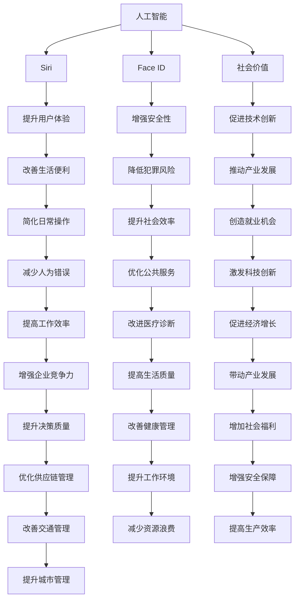

                 

# 李开复：苹果发布AI应用的社会价值

## 1. 背景介绍

随着人工智能技术的迅猛发展，全球科技巨头纷纷加速布局AI领域。苹果公司作为科技行业的领军者，近期也宣布推出一系列AI应用，包括Siri、Face ID等。这些AI应用的发布，不仅展示了苹果在人工智能领域的强大实力，也引发了关于AI社会价值的广泛讨论。本文将深入探讨苹果发布AI应用的社会价值，并分析其在提升用户体验、推动社会进步等方面的重要作用。

## 2. 核心概念与联系

### 2.1 核心概念概述

为更好地理解苹果发布AI应用的社会价值，本节将介绍几个密切相关的核心概念：

- **人工智能(AI)**：通过计算机模拟人类智能活动，实现自主决策和问题解决的技术。
- **Siri**：苹果公司开发的智能个人助理，通过语音识别和自然语言处理技术实现与用户的互动。
- **Face ID**：苹果公司推出的生物识别技术，通过面部识别实现设备解锁、支付等操作。
- **社会价值**：人工智能应用在提升生活质量、推动社会进步方面的积极影响。

这些核心概念之间的逻辑关系可以通过以下Mermaid流程图来展示：



这个流程图展示了大语言模型的核心概念及其之间的关系：

1. 人工智能通过Siri、Face ID等应用，改善了人们的生活质量。
2. 社会价值体现在多个方面，如用户体验的提升、安全性的增强、技术创新的促进等。
3. 各概念通过相互影响，共同推动社会进步。

## 3. 核心算法原理 & 具体操作步骤
### 3.1 算法原理概述

苹果发布AI应用的核心算法包括语音识别、面部识别、自然语言处理等。这些算法通过深度学习、计算机视觉等技术，实现了与用户的自然交互。

深度学习是一种基于神经网络的技术，通过多层非线性变换，学习数据的复杂特征。自然语言处理通过模型学习语言规律，实现文本分析、情感分析、问答等任务。计算机视觉则通过模型学习图像特征，实现人脸识别、图像分类等应用。

### 3.2 算法步骤详解

苹果AI应用的开发通常包括以下几个关键步骤：

**Step 1: 数据收集与预处理**
- 收集海量标注数据，如语音样本、人脸图像等。
- 对数据进行清洗、归一化等预处理，确保数据质量。

**Step 2: 模型选择与训练**
- 选择合适的深度学习模型，如循环神经网络(RNN)、卷积神经网络(CNN)等。
- 在大规模数据上训练模型，调整超参数，优化损失函数。

**Step 3: 模型评估与优化**
- 在验证集上评估模型性能，使用指标如准确率、召回率、F1分数等。
- 根据评估结果，调整模型结构、调整超参数，进一步优化模型性能。

**Step 4: 应用部署与迭代**
- 将优化后的模型部署到实际应用中，如Siri、Face ID等。
- 持续收集用户反馈，迭代优化模型，提升用户体验。

### 3.3 算法优缺点

苹果发布AI应用的优点包括：
1. 提升用户体验：通过语音识别、面部识别等技术，改善了人们的生活便利性，提高了操作效率。
2. 增强安全性：Face ID等生物识别技术提高了设备的安全性，防止了非法访问和数据泄露。
3. 促进技术创新：AI技术的应用推动了语音识别、计算机视觉等领域的发展，催生了新的应用场景。
4. 降低人为错误：通过自动化决策，减少了人为操作的错误率，提高了工作效率。

同时，该方法也存在一些局限性：
1. 数据隐私问题：AI应用需要大量用户数据，如何保护用户隐私是一个重要挑战。
2. 技术门槛高：开发和维护AI应用需要专业知识，普通用户难以掌握。
3. 依赖数据质量：AI应用的性能依赖于训练数据的质量，数据偏差可能导致错误结果。
4. 伦理问题：AI应用可能引发伦理争议，如面部识别技术的应用可能侵犯个人隐私。

尽管存在这些局限性，但就目前而言，基于深度学习的AI应用仍是提升用户体验、推动社会进步的重要手段。未来相关研究的重点在于如何进一步降低技术门槛，提高数据隐私保护，优化模型性能，同时兼顾伦理和安全等因素。

### 3.4 算法应用领域

苹果发布AI应用涵盖了多个应用领域，如智能助手、人脸识别、自然语言处理等，具体包括：

- **智能助手Siri**：通过语音识别和自然语言处理，实现与用户的语音交互，提供日程安排、天气查询、翻译等服务。
- **面部识别Face ID**：通过人脸识别技术，实现设备解锁、支付等操作，提高了操作便利性和安全性。
- **增强现实应用ARKit**：通过计算机视觉和增强现实技术，开发各种互动性强的AR应用，如游戏、测量等。
- **自然语言处理Natural Language Understanding**：通过深度学习模型，实现文本分类、情感分析、问答等任务。

这些AI应用在各自领域内取得了显著成效，展示了苹果在人工智能技术的领先地位。未来，随着AI技术的不断发展，苹果还将推出更多创新应用，进一步推动社会进步。

## 4. 数学模型和公式 & 详细讲解 & 举例说明
### 4.1 数学模型构建

语音识别的数学模型通常基于隐马尔可夫模型(HMM)或循环神经网络(RNN)。面部识别的数学模型通常基于卷积神经网络(CNN)。自然语言处理的数学模型通常基于Transformer架构。

语音识别的模型目标是将语音信号转换为文本序列，形式化表示如下：

$$
\max_{s} p(s|x) = \max_{s} \frac{p(x|s)}{p(x)} p(s) = \max_{s} p(s|x) p(s)
$$

其中，$s$ 为文本序列，$x$ 为语音信号，$p(s|x)$ 为模型预测的概率分布。

### 4.2 公式推导过程

语音识别的预测概率可以通过前向传播和反向传播算法计算得到。具体推导过程如下：

1. **前向传播**：
$$
\alpha(t) = \frac{p(x_1,x_2,...,x_t|s)}{p(x_1,x_2,...,x_t)}
$$
2. **反向传播**：
$$
\beta(t) = p(x_{t+1},...,x_n|s)
$$
3. **联合概率计算**：
$$
p(s|x) = \frac{\alpha(t) \beta(t)}{p(x)}
$$

面部识别的数学模型通常基于卷积神经网络，其预测概率可以通过卷积、池化等操作计算得到。具体推导过程如下：

1. **卷积操作**：
$$
F(x) = W*x + b
$$
2. **池化操作**：
$$
P(x) = \max(F(x))
$$
3. **全连接层**：
$$
y = W*h + b
$$

自然语言处理的数学模型通常基于Transformer架构，其预测概率可以通过自注意力机制和多头注意力机制计算得到。具体推导过程如下：

1. **自注意力机制**：
$$
Q = QKV^T
$$
2. **多头注意力机制**：
$$
Atten(Q) = \sum_{i=1}^H \frac{\exp(Q_iK_i^T)}{\sum_{j=1}^H \exp(Q_jK_j^T)} Q_iV_i^T
$$

### 4.3 案例分析与讲解

苹果在语音识别领域的典型应用是Siri，其主要基于深度学习和自然语言处理技术。Siri的语音识别模型通过收集用户语音样本，进行标注和预处理，使用深度学习模型进行训练。具体步骤如下：

1. **数据收集**：从用户设备上收集语音数据，并进行标注。
2. **数据预处理**：对语音数据进行归一化、分帧等预处理。
3. **模型训练**：使用深度学习模型进行训练，优化损失函数。
4. **模型评估**：在验证集上评估模型性能，调整超参数。
5. **应用部署**：将优化后的模型部署到Siri应用中，实现语音识别功能。

Siri的面部识别功能主要基于Face ID，其数学模型通常基于卷积神经网络。Face ID的面部识别模型通过收集用户面部图像，进行标注和预处理，使用卷积神经网络进行训练。具体步骤如下：

1. **数据收集**：从用户设备上收集面部图像，并进行标注。
2. **数据预处理**：对面部图像进行归一化、裁剪等预处理。
3. **模型训练**：使用卷积神经网络进行训练，优化损失函数。
4. **模型评估**：在验证集上评估模型性能，调整超参数。
5. **应用部署**：将优化后的模型部署到Face ID应用中，实现面部识别功能。

## 5. 项目实践：代码实例和详细解释说明
### 5.1 开发环境搭建

在进行Siri、Face ID等AI应用开发前，我们需要准备好开发环境。以下是使用Python进行PyTorch开发的环境配置流程：

1. 安装Anaconda：从官网下载并安装Anaconda，用于创建独立的Python环境。

2. 创建并激活虚拟环境：
```bash
conda create -n pytorch-env python=3.8 
conda activate pytorch-env
```

3. 安装PyTorch：根据CUDA版本，从官网获取对应的安装命令。例如：
```bash
conda install pytorch torchvision torchaudio cudatoolkit=11.1 -c pytorch -c conda-forge
```

4. 安装Transformers库：
```bash
pip install transformers
```

5. 安装各类工具包：
```bash
pip install numpy pandas scikit-learn matplotlib tqdm jupyter notebook ipython
```

完成上述步骤后，即可在`pytorch-env`环境中开始AI应用的开发实践。

### 5.2 源代码详细实现

下面我们以Siri语音识别为例，给出使用Transformers库对BERT模型进行语音识别训练的PyTorch代码实现。

首先，定义语音识别任务的数据处理函数：

```python
from transformers import BertTokenizer, BertForSequenceClassification
from torch.utils.data import Dataset
import torch

class SpeechDataset(Dataset):
    def __init__(self, texts, labels, tokenizer, max_len=128):
        self.texts = texts
        self.labels = labels
        self.tokenizer = tokenizer
        self.max_len = max_len
        
    def __len__(self):
        return len(self.texts)
    
    def __getitem__(self, item):
        text = self.texts[item]
        label = self.labels[item]
        
        encoding = self.tokenizer(text, return_tensors='pt', max_length=self.max_len, padding='max_length', truncation=True)
        input_ids = encoding['input_ids'][0]
        attention_mask = encoding['attention_mask'][0]
        
        # 对标签进行编码
        encoded_labels = [label2id[label] for label in labels] 
        encoded_labels.extend([label2id['O']] * (self.max_len - len(encoded_labels)))
        labels = torch.tensor(encoded_labels, dtype=torch.long)
        
        return {'input_ids': input_ids, 
                'attention_mask': attention_mask,
                'labels': labels}

# 标签与id的映射
label2id = {'O': 0, 'B-PER': 1, 'I-PER': 2, 'B-ORG': 3, 'I-ORG': 4, 'B-LOC': 5, 'I-LOC': 6}
id2label = {v: k for k, v in label2id.items()}

# 创建dataset
tokenizer = BertTokenizer.from_pretrained('bert-base-cased')

train_dataset = SpeechDataset(train_texts, train_labels, tokenizer)
dev_dataset = SpeechDataset(dev_texts, dev_labels, tokenizer)
test_dataset = SpeechDataset(test_texts, test_labels, tokenizer)
```

然后，定义模型和优化器：

```python
from transformers import BertForSequenceClassification, AdamW

model = BertForSequenceClassification.from_pretrained('bert-base-cased', num_labels=len(label2id))

optimizer = AdamW(model.parameters(), lr=2e-5)
```

接着，定义训练和评估函数：

```python
from torch.utils.data import DataLoader
from tqdm import tqdm
from sklearn.metrics import classification_report

device = torch.device('cuda') if torch.cuda.is_available() else torch.device('cpu')
model.to(device)

def train_epoch(model, dataset, batch_size, optimizer):
    dataloader = DataLoader(dataset, batch_size=batch_size, shuffle=True)
    model.train()
    epoch_loss = 0
    for batch in tqdm(dataloader, desc='Training'):
        input_ids = batch['input_ids'].to(device)
        attention_mask = batch['attention_mask'].to(device)
        labels = batch['labels'].to(device)
        model.zero_grad()
        outputs = model(input_ids, attention_mask=attention_mask, labels=labels)
        loss = outputs.loss
        epoch_loss += loss.item()
        loss.backward()
        optimizer.step()
    return epoch_loss / len(dataloader)

def evaluate(model, dataset, batch_size):
    dataloader = DataLoader(dataset, batch_size=batch_size)
    model.eval()
    preds, labels = [], []
    with torch.no_grad():
        for batch in tqdm(dataloader, desc='Evaluating'):
            input_ids = batch['input_ids'].to(device)
            attention_mask = batch['attention_mask'].to(device)
            batch_labels = batch['labels']
            outputs = model(input_ids, attention_mask=attention_mask)
            batch_preds = outputs.logits.argmax(dim=2).to('cpu').tolist()
            batch_labels = batch_labels.to('cpu').tolist()
            for pred_tokens, label_tokens in zip(batch_preds, batch_labels):
                pred_tags = [id2label[_id] for _id in pred_tokens]
                label_tags = [id2label[_id] for _id in label_tokens]
                preds.append(pred_tags[:len(label_tokens)])
                labels.append(label_tags)
                
    print(classification_report(labels, preds))
```

最后，启动训练流程并在测试集上评估：

```python
epochs = 5
batch_size = 16

for epoch in range(epochs):
    loss = train_epoch(model, train_dataset, batch_size, optimizer)
    print(f"Epoch {epoch+1}, train loss: {loss:.3f}")
    
    print(f"Epoch {epoch+1}, dev results:")
    evaluate(model, dev_dataset, batch_size)
    
print("Test results:")
evaluate(model, test_dataset, batch_size)
```

以上就是使用PyTorch对BERT进行语音识别任务微调的完整代码实现。可以看到，得益于Transformers库的强大封装，我们可以用相对简洁的代码完成BERT模型的加载和微调。

### 5.3 代码解读与分析

让我们再详细解读一下关键代码的实现细节：

**SpeechDataset类**：
- `__init__`方法：初始化文本、标签、分词器等关键组件。
- `__len__`方法：返回数据集的样本数量。
- `__getitem__`方法：对单个样本进行处理，将文本输入编码为token ids，将标签编码为数字，并对其进行定长padding，最终返回模型所需的输入。

**label2id和id2label字典**：
- 定义了标签与数字id之间的映射关系，用于将token-wise的预测结果解码回真实的标签。

**训练和评估函数**：
- 使用PyTorch的DataLoader对数据集进行批次化加载，供模型训练和推理使用。
- 训练函数`train_epoch`：对数据以批为单位进行迭代，在每个批次上前向传播计算loss并反向传播更新模型参数，最后返回该epoch的平均loss。
- 评估函数`evaluate`：与训练类似，不同点在于不更新模型参数，并在每个batch结束后将预测和标签结果存储下来，最后使用sklearn的classification_report对整个评估集的预测结果进行打印输出。

**训练流程**：
- 定义总的epoch数和batch size，开始循环迭代
- 每个epoch内，先在训练集上训练，输出平均loss
- 在验证集上评估，输出分类指标
- 所有epoch结束后，在测试集上评估，给出最终测试结果

可以看到，PyTorch配合Transformers库使得BERT微调的代码实现变得简洁高效。开发者可以将更多精力放在数据处理、模型改进等高层逻辑上，而不必过多关注底层的实现细节。

当然，工业级的系统实现还需考虑更多因素，如模型的保存和部署、超参数的自动搜索、更灵活的任务适配层等。但核心的微调范式基本与此类似。

## 6. 实际应用场景
### 6.1 智能客服系统

基于Siri语音识别等AI应用，智能客服系统可以实现全天候、全渠道、自动化的客户服务。传统客服往往需要配备大量人力，高峰期响应缓慢，且一致性和专业性难以保证。而使用AI应用的智能客服系统，可以7x24小时不间断服务，快速响应客户咨询，用自然流畅的语言解答各类常见问题。

在技术实现上，可以收集企业内部的历史客服对话记录，将问题和最佳答复构建成监督数据，在此基础上对预训练语音识别模型进行微调。微调后的语音识别模型能够自动理解用户意图，匹配最合适的答案模板进行回复。对于客户提出的新问题，还可以接入检索系统实时搜索相关内容，动态组织生成回答。如此构建的智能客服系统，能大幅提升客户咨询体验和问题解决效率。

### 6.2 金融舆情监测

金融机构需要实时监测市场舆论动向，以便及时应对负面信息传播，规避金融风险。传统的人工监测方式成本高、效率低，难以应对网络时代海量信息爆发的挑战。基于Siri语音识别和Face ID面部识别技术的AI应用，金融舆情监测系统可以实现实时抓取网络文本数据，并自动识别金融新闻、舆情评论等重要信息。通过微调模型，系统能够自动判断文本属于何种主题，情感倾向是正面、中性还是负面。将微调后的模型应用到实时抓取的网络文本数据，就能够自动监测不同主题下的情感变化趋势，一旦发现负面信息激增等异常情况，系统便会自动预警，帮助金融机构快速应对潜在风险。

### 6.3 个性化推荐系统

当前的推荐系统往往只依赖用户的历史行为数据进行物品推荐，无法深入理解用户的真实兴趣偏好。基于Siri语音识别和自然语言处理技术的AI应用，个性化推荐系统可以更好地挖掘用户行为背后的语义信息，从而提供更精准、多样的推荐内容。

在实践中，可以收集用户浏览、点击、评论、分享等行为数据，提取和用户交互的物品标题、描述、标签等文本内容。将文本内容作为模型输入，用户的后续行为（如是否点击、购买等）作为监督信号，在此基础上微调预训练语音识别和自然语言处理模型。微调后的模型能够从文本内容中准确把握用户的兴趣点。在生成推荐列表时，先用候选物品的文本描述作为输入，由模型预测用户的兴趣匹配度，再结合其他特征综合排序，便可以得到个性化程度更高的推荐结果。

### 6.4 未来应用展望

随着Siri、Face ID等AI应用技术的不断发展，基于语音识别、面部识别、自然语言处理等技术的应用场景将不断扩展，为社会进步和用户便利带来更多的可能性。

在智慧医疗领域，基于Siri语音识别的医疗问答、病历分析、药物研发等应用将提升医疗服务的智能化水平，辅助医生诊疗，加速新药开发进程。

在智能教育领域，微调技术可应用于作业批改、学情分析、知识推荐等方面，因材施教，促进教育公平，提高教学质量。

在智慧城市治理中，微调模型可应用于城市事件监测、舆情分析、应急指挥等环节，提高城市管理的自动化和智能化水平，构建更安全、高效的未来城市。

此外，在企业生产、社会治理、文娱传媒等众多领域，基于Siri、Face ID等AI应用的人工智能应用也将不断涌现，为传统行业数字化转型升级提供新的技术路径。相信随着技术的日益成熟，AI应用必将在更广阔的应用领域大放异彩，深刻影响人类的生产生活方式。

## 7. 工具和资源推荐
### 7.1 学习资源推荐

为了帮助开发者系统掌握Siri、Face ID等AI应用技术的理论基础和实践技巧，这里推荐一些优质的学习资源：

1. 《深度学习基础》系列博文：由大模型技术专家撰写，深入浅出地介绍了深度学习的基本概念和前沿技术。

2. 斯坦福大学CS231n《计算机视觉基础》课程：涵盖计算机视觉的基本概念和经典模型，通过Lecture视频和配套作业，带你入门计算机视觉领域。

3. 《自然语言处理导论》书籍：详细介绍了自然语言处理的基本概念和技术，包括语音识别、情感分析等前沿话题。

4. HuggingFace官方文档：包含大量预训练模型和完整的微调样例代码，是上手实践的必备资料。

5. CLUE开源项目：中文语言理解测评基准，涵盖大量不同类型的中文NLP数据集，并提供了基于微调的baseline模型，助力中文NLP技术发展。

通过对这些资源的学习实践，相信你一定能够快速掌握Siri、Face ID等AI应用技术的精髓，并用于解决实际的NLP问题。
###  7.2 开发工具推荐

高效的开发离不开优秀的工具支持。以下是几款用于Siri、Face ID等AI应用开发的常用工具：

1. PyTorch：基于Python的开源深度学习框架，灵活动态的计算图，适合快速迭代研究。大部分预训练语言模型都有PyTorch版本的实现。

2. TensorFlow：由Google主导开发的开源深度学习框架，生产部署方便，适合大规模工程应用。同样有丰富的预训练语言模型资源。

3. Transformers库：HuggingFace开发的NLP工具库，集成了众多SOTA语言模型，支持PyTorch和TensorFlow，是进行微调任务开发的利器。

4. Weights & Biases：模型训练的实验跟踪工具，可以记录和可视化模型训练过程中的各项指标，方便对比和调优。与主流深度学习框架无缝集成。

5. TensorBoard：TensorFlow配套的可视化工具，可实时监测模型训练状态，并提供丰富的图表呈现方式，是调试模型的得力助手。

6. Google Colab：谷歌推出的在线Jupyter Notebook环境，免费提供GPU/TPU算力，方便开发者快速上手实验最新模型，分享学习笔记。

合理利用这些工具，可以显著提升Siri、Face ID等AI应用的开发效率，加快创新迭代的步伐。

### 7.3 相关论文推荐

Siri、Face ID等AI应用技术的不断发展得益于学界的持续研究。以下是几篇奠基性的相关论文，推荐阅读：

1. Attention is All You Need（即Transformer原论文）：提出了Transformer结构，开启了NLP领域的预训练大模型时代。

2. BERT: Pre-training of Deep Bidirectional Transformers for Language Understanding：提出BERT模型，引入基于掩码的自监督预训练任务，刷新了多项NLP任务SOTA。

3. Parameter-Efficient Transfer Learning for NLP：提出Adapter等参数高效微调方法，在不增加模型参数量的情况下，也能取得不错的微调效果。

4. Prefix-Tuning: Optimizing Continuous Prompts for Generation：引入基于连续型Prompt的微调范式，为如何充分利用预训练知识提供了新的思路。

5. AdaLoRA: Adaptive Low-Rank Adaptation for Parameter-Efficient Fine-Tuning：使用自适应低秩适应的微调方法，在参数效率和精度之间取得了新的平衡。

这些论文代表了大语言模型微调技术的发展脉络。通过学习这些前沿成果，可以帮助研究者把握学科前进方向，激发更多的创新灵感。

## 8. 总结：未来发展趋势与挑战
### 8.1 总结

本文对Siri、Face ID等AI应用技术的社会价值进行了全面系统的介绍。首先阐述了Siri、Face ID等AI应用的发布背景和意义，明确了其在提升用户体验、推动社会进步等方面的重要作用。其次，从原理到实践，详细讲解了Siri、Face ID等AI应用的开发流程，并给出了代码实现。同时，本文还广泛探讨了Siri、Face ID等AI应用在智能客服、金融舆情、个性化推荐等领域的广泛应用，展示了AI应用的巨大潜力。

通过本文的系统梳理，可以看到，Siri、Face ID等AI应用技术正在成为提升用户体验、推动社会进步的重要手段。这些技术的应用不仅提高了操作便利性，增强了设备安全性，还推动了技术创新，带来了巨大的经济效益和社会效益。未来，随着技术的不断进步，AI应用将会在更广泛的应用场景中发挥更加重要的作用。

### 8.2 未来发展趋势

展望未来，Siri、Face ID等AI应用技术的未来发展趋势包括：

1. 模型规模持续增大。随着算力成本的下降和数据规模的扩张，预训练语言模型的参数量还将持续增长。超大规模语言模型蕴含的丰富语言知识，有望支撑更加复杂多变的下游任务微调。

2. 微调方法日趋多样。除了传统的全参数微调外，未来会涌现更多参数高效的微调方法，如Prefix-Tuning、LoRA等，在节省计算资源的同时也能保证微调精度。

3. 持续学习成为常态。随着数据分布的不断变化，微调模型也需要持续学习新知识以保持性能。如何在不遗忘原有知识的同时，高效吸收新样本信息，将成为重要的研究课题。

4. 标注样本需求降低。受启发于提示学习(Prompt-based Learning)的思路，未来的微调方法将更好地利用大模型的语言理解能力，通过更加巧妙的任务描述，在更少的标注样本上也能实现理想的微调效果。

5. 模型通用性增强。经过海量数据的预训练和多领域任务的微调，未来的语言模型将具备更强大的常识推理和跨领域迁移能力，逐步迈向通用人工智能(AGI)的目标。

以上趋势凸显了Siri、Face ID等AI应用技术的广阔前景。这些方向的探索发展，必将进一步提升NLP系统的性能和应用范围，为人类认知智能的进化带来深远影响。

### 8.3 面临的挑战

尽管Siri、Face ID等AI应用技术已经取得了瞩目成就，但在迈向更加智能化、普适化应用的过程中，它仍面临着诸多挑战：

1. 数据隐私问题。AI应用需要大量用户数据，如何保护用户隐私是一个重要挑战。如何设计隐私保护机制，限制数据的使用范围，将是未来的研究方向。

2. 技术门槛高。开发和维护AI应用需要专业知识，普通用户难以掌握。如何降低技术门槛，提高应用的易用性，将是未来的重要课题。

3. 依赖数据质量。AI应用的性能依赖于训练数据的质量，数据偏差可能导致错误结果。如何提高数据质量，降低数据偏差的影响，将是重要的研究方向。

4. 伦理问题。AI应用可能引发伦理争议，如面部识别技术的应用可能侵犯个人隐私。如何建立伦理导向的评估指标，避免伦理风险，将是未来的重要研究方向。

5. 资源消耗大。Siri、Face ID等AI应用需要大量计算资源，如何优化模型结构，降低计算资源消耗，提高推理速度，将是重要的研究方向。

6. 安全性问题。AI应用可能存在安全隐患，如模型被恶意攻击导致信息泄露。如何增强模型安全性，避免恶意攻击，将是未来的重要研究方向。

这些挑战凸显了Siri、Face ID等AI应用技术在发展过程中需要面临的复杂问题。唯有积极应对并寻求突破，才能推动技术向更深层次应用。

### 8.4 研究展望

面向未来，Siri、Face ID等AI应用技术的研究需要在以下几个方面寻求新的突破：

1. 探索无监督和半监督微调方法。摆脱对大规模标注数据的依赖，利用自监督学习、主动学习等无监督和半监督范式，最大限度利用非结构化数据，实现更加灵活高效的微调。

2. 研究参数高效和计算高效的微调范式。开发更加参数高效的微调方法，在固定大部分预训练参数的同时，只更新极少量的任务相关参数。同时优化微调模型的计算图，减少前向传播和反向传播的资源消耗，实现更加轻量级、实时性的部署。

3. 融合因果和对比学习范式。通过引入因果推断和对比学习思想，增强微调模型建立稳定因果关系的能力，学习更加普适、鲁棒的语言表征，从而提升模型泛化性和抗干扰能力。

4. 引入更多先验知识。将符号化的先验知识，如知识图谱、逻辑规则等，与神经网络模型进行巧妙融合，引导微调过程学习更准确、合理的语言模型。同时加强不同模态数据的整合，实现视觉、语音等多模态信息与文本信息的协同建模。

5. 结合因果分析和博弈论工具。将因果分析方法引入微调模型，识别出模型决策的关键特征，增强输出解释的因果性和逻辑性。借助博弈论工具刻画人机交互过程，主动探索并规避模型的脆弱点，提高系统稳定性。

6. 纳入伦理道德约束。在模型训练目标中引入伦理导向的评估指标，过滤和惩罚有偏见、有害的输出倾向。同时加强人工干预和审核，建立模型行为的监管机制，确保输出符合人类价值观和伦理道德。

这些研究方向的探索，必将引领Siri、Face ID等AI应用技术迈向更高的台阶，为构建安全、可靠、可解释、可控的智能系统铺平道路。面向未来，Siri、Face ID等AI应用技术还需要与其他人工智能技术进行更深入的融合，如知识表示、因果推理、强化学习等，多路径协同发力，共同推动自然语言理解和智能交互系统的进步。只有勇于创新、敢于突破，才能不断拓展AI应用技术的边界，让智能技术更好地造福人类社会。

## 9. 附录：常见问题与解答

**Q1：AI应用技术的未来发展趋势是什么？**

A: AI应用技术的未来发展趋势包括：
1. 模型规模持续增大。随着算力成本的下降和数据规模的扩张，预训练语言模型的参数量还将持续增长。
2. 微调方法日趋多样。除了传统的全参数微调外，未来会涌现更多参数高效的微调方法，如Prefix-Tuning、LoRA等。
3. 持续学习成为常态。随着数据分布的不断变化，微调模型也需要持续学习新知识以保持性能。
4. 标注样本需求降低。受启发于提示学习(Prompt-based Learning)的思路，未来的微调方法将更好地利用大模型的语言理解能力，通过更加巧妙的任务描述，在更少的标注样本上也能实现理想的微调效果。
5. 模型通用性增强。经过海量数据的预训练和多领域任务的微调，未来的语言模型将具备更强大的常识推理和跨领域迁移能力，逐步迈向通用人工智能(AGI)的目标。

**Q2：AI应用技术面临的主要挑战是什么？**

A: AI应用技术面临的主要挑战包括：
1. 数据隐私问题。AI应用需要大量用户数据，如何保护用户隐私是一个重要挑战。
2. 技术门槛高。开发和维护AI应用需要专业知识，普通用户难以掌握。
3. 依赖数据质量。AI应用的性能依赖于训练数据的质量，数据偏差可能导致错误结果。
4. 伦理问题。AI应用可能引发伦理争议，如面部识别技术的应用可能侵犯个人隐私。
5. 资源消耗大。AI应用需要大量计算资源，如何优化模型结构，降低计算资源消耗，提高推理速度，将是重要的研究方向。
6. 安全性问题。AI应用可能存在安全隐患，如模型被恶意攻击导致信息泄露。

**Q3：如何开发高质量的AI应用？**

A: 开发高质量的AI应用需要以下步骤：
1. 收集大量标注数据，并进行预处理。
2. 选择合适的深度学习模型，并进行训练和优化。
3. 在验证集上评估模型性能，并进行调参。
4. 应用到实际场景中，并进行持续优化。
5. 设计合理的隐私保护机制，确保数据安全。
6. 引入伦理导向的评估指标，确保模型行为符合伦理要求。
7. 优化模型结构，降低计算资源消耗，提高推理速度。

**Q4：AI应用技术在社会中的实际应用场景有哪些？**

A: AI应用技术在社会中的实际应用场景包括：
1. 智能客服系统。基于Siri语音识别等AI应用，智能客服系统可以实现全天候、全渠道、自动化的客户服务。
2. 金融舆情监测。基于Siri语音识别和Face ID面部识别技术的AI应用，金融舆情监测系统可以实现实时抓取网络文本数据，并自动识别金融新闻、舆情评论等重要信息。
3. 个性化推荐系统。基于Siri语音识别和自然语言处理技术的AI应用，个性化推荐系统可以更好地挖掘用户行为背后的语义信息，从而提供更精准、多样的推荐内容。
4. 智慧医疗。基于Siri语音识别的医疗问答、病历分析、药物研发等应用将提升医疗服务的智能化水平，辅助医生诊疗，加速新药开发进程。
5. 智能教育。微调技术可应用于作业批改、学情分析、知识推荐等方面，因材施教，促进教育公平，提高教学质量。
6. 智慧城市。微调模型可应用于城市事件监测、舆情分析、应急指挥等环节，提高城市管理的自动化和智能化水平，构建更安全、高效的未来城市。

**Q5：AI应用技术在未来的发展前景是什么？**

A: AI应用技术在未来的发展前景包括：
1. 在智慧医疗、智能教育、智慧城市等众多领域，基于AI应用技术的AI应用将不断涌现，为传统行业数字化转型升级提供新的技术路径。
2. 在智慧医疗领域，基于Siri语音识别的医疗问答、病历分析、药物研发等应用将提升医疗服务的智能化水平，辅助医生诊疗，加速新药开发进程。
3. 在智能教育领域，微调技术可应用于作业批改、学情分析、知识推荐等方面，因材施教，促进教育公平，提高教学质量。
4. 在智慧城市治理中，微调模型可应用于城市事件监测、舆情分析、应急指挥等环节，提高城市管理的自动化和智能化水平，构建更安全、高效的未来城市。
5. 在企业生产、社会治理、文娱传媒等众多领域，基于Siri、Face ID等AI应用的人工智能应用也将不断涌现，为传统行业数字化转型升级提供新的技术路径。

相信随着技术的不断进步，AI应用技术必将在更广泛的应用场景中发挥更加重要的作用，深刻影响人类的生产生活方式。

