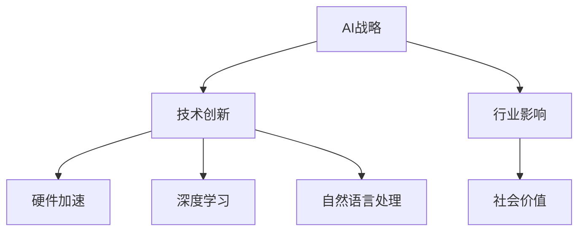

                 

# 李开复：苹果发布AI应用的社会价值

> 关键词：人工智能, Apple, AI应用, 社会价值

## 1. 背景介绍

### 1.1 问题由来
近年来，人工智能(AI)技术的快速发展，已经深刻改变了各行各业的面貌。从自动驾驶到医疗影像诊断，从智能客服到个性化推荐，AI应用已经遍及社会的方方面面。其中，苹果公司的AI应用尤为引人注目。

苹果自2017年发布首个AI产品Siri以来，便开始逐步构建其AI生态体系。2019年，苹果在年度开发者大会WWDC上正式宣布AI战略，推出了多个AI应用，包括智能语音助手Siri、增强现实(AR)应用、视频分析等。这些AI应用在提升用户体验、优化产品功能、推动产业创新方面发挥了重要作用。

本文将深入探讨苹果AI应用的战略布局、技术创新及其对社会价值的贡献，以期为AI技术在各行各业的应用提供参考和启示。

### 1.2 问题核心关键点
本文将聚焦于苹果公司发布的多款AI应用，具体包括以下几个关键点：
- 苹果AI战略及其目标
- 苹果AI技术创新与突破
- 苹果AI应用的行业影响
- 苹果AI应用的社会价值

## 2. 核心概念与联系

### 2.1 核心概念概述

为更好地理解苹果AI应用的社会价值，本节将介绍几个关键概念：

- **AI战略**：指苹果公司对于AI技术的整体发展方向和应用布局，旨在通过AI技术推动产品创新、提升用户体验，同时构建AI生态体系。
- **技术创新**：苹果在AI技术领域所进行的前沿探索和突破，包括硬件加速、深度学习、自然语言处理等。
- **行业影响**：苹果AI应用在各行业中的实际应用和效果，如智能设备、医疗健康、视频分析等。
- **社会价值**：苹果AI应用对社会整体的正面影响，包括提升生产效率、优化资源配置、改善生活体验等方面。

这些概念之间的逻辑关系可以通过以下Mermaid流程图来展示：



这个流程图展示了他苹果AI应用的战略框架，及其与技术创新、行业影响和社会价值之间的关系。

## 3. 核心算法原理 & 具体操作步骤
### 3.1 算法原理概述

苹果AI应用的开发，离不开强大的技术支撑。其中，深度学习技术是其核心驱动力之一。以下是苹果AI应用开发中常用的深度学习算法原理：

- **卷积神经网络(CNN)**：广泛应用于图像处理、语音识别等任务。苹果在智能设备如iPhone中，广泛应用了CNN进行图像分类、物体识别等。
- **循环神经网络(RNN)**：适用于序列数据处理，如自然语言理解、语音识别等。苹果在Siri中采用了RNN技术，提升语音识别的准确性。
- **长短时记忆网络(LSTM)**：特别适用于处理时间序列数据，如文本生成、机器翻译等。苹果在AI语音助手和智能推荐系统中，应用了LSTM模型优化用户交互体验。
- **Transformer模型**：近年来在自然语言处理领域取得突破，苹果在视频分析和自然语言理解中也采用了Transformer技术，提升处理效率和准确性。

这些算法通过苹果自研的神经网络库Core ML和机器学习框架Metal等技术框架支持，在硬件加速下实现了高性能的模型训练和推理。

### 3.2 算法步骤详解

苹果AI应用的开发通常包括以下几个关键步骤：

**Step 1: 数据收集与预处理**
- 收集各应用领域的数据，如医疗影像数据、语音信号、视频帧等。
- 对数据进行清洗、标注，确保数据质量。

**Step 2: 模型设计与训练**
- 根据应用场景选择合适的深度学习模型，如CNN、RNN、LSTM等。
- 在Apple GPU和Metal等硬件加速的支持下，进行大规模模型训练。
- 使用Adam优化器等算法，进行模型参数更新。

**Step 3: 模型部署与优化**
- 将训练好的模型进行优化，减小模型参数，加速推理速度。
- 使用Apple硬件加速技术，提高模型推理性能。
- 将模型集成到应用中，进行实时推理。

**Step 4: 用户反馈与迭代**
- 收集用户反馈，评估模型性能。
- 根据反馈进行模型迭代优化，提升模型效果。
- 定期更新模型，保持技术领先。

通过以上步骤，苹果能够高效地开发出具备强大功能和良好用户体验的AI应用。

### 3.3 算法优缺点

苹果AI应用具有以下优点：
1. **硬件加速**：苹果在硬件层面的深度优化，使得AI应用在推理速度和计算效率上具有显著优势。
2. **深度学习技术**：采用先进深度学习算法，如CNN、RNN、Transformer等，确保模型性能和效果。
3. **用户数据隐私保护**：苹果在数据收集和处理过程中，高度重视用户隐私保护，严格控制数据使用范围。
4. **高质量用户体验**：通过优化算法和硬件加速，确保AI应用在实时性和响应速度上的用户体验。

但同时也存在一些局限性：
1. **数据依赖**：AI应用的性能很大程度上依赖于数据质量和数量，数据不足时难以取得理想效果。
2. **模型复杂性**：深度学习模型虽然精度高，但模型复杂性高，导致模型训练和推理需要大量计算资源。
3. **隐私风险**：在数据收集和处理过程中，如何保护用户隐私是一个重要的挑战。
4. **算法透明度**：深度学习模型的"黑盒"特性，使其难以解释和调试，影响用户信任和接受度。

尽管存在这些局限性，但苹果通过综合应用多层次技术手段，不断优化AI应用的性能和用户体验。

### 3.4 算法应用领域

苹果AI应用覆盖了多个领域，具体包括：

- **智能设备**：如iPhone、iPad等智能设备中，广泛应用了AI技术进行图像分类、物体识别、语音识别等。
- **医疗健康**：应用深度学习技术分析医疗影像，辅助医生进行疾病诊断和治疗决策。
- **视频分析**：在Apple Music等应用中，使用AI技术分析用户听歌行为，推荐个性化内容。
- **自然语言处理**：通过Siri等应用，提升自然语言理解和语音交互的准确性和流畅性。
- **增强现实**：如ARKit平台，利用AI技术进行场景识别、对象跟踪、环境理解等。

这些应用不仅提升了苹果产品的功能和技术水平，还推动了整个行业的创新和进步。

## 4. 数学模型和公式 & 详细讲解 & 举例说明

### 4.1 数学模型构建

苹果AI应用的开发中，广泛应用了深度学习模型。以图像分类为例，我们可以构建一个基本的卷积神经网络模型：

$$
M_{\theta}(x) = \text{conv}(\text{conv}(\text{conv}(x)))
$$

其中 $\theta$ 为模型参数，$x$ 为输入图像，$\text{conv}$ 表示卷积操作。

### 4.2 公式推导过程

卷积神经网络的基本结构包括卷积层、池化层、全连接层等。以卷积层为例，其计算过程如下：

$$
\mathbf{y} = \text{conv}(\mathbf{x}) = \text{ReLU}(\mathbf{W} * \mathbf{x} + \mathbf{b})
$$

其中 $\mathbf{x}$ 为输入图像，$\mathbf{y}$ 为卷积结果，$\mathbf{W}$ 为卷积核，$\mathbf{b}$ 为偏置项，$\text{ReLU}$ 为激活函数。

### 4.3 案例分析与讲解

以苹果在iPhone中应用的图像分类模型为例，该模型通过多个卷积层和池化层对输入图像进行特征提取，最终通过全连接层输出分类结果。模型训练过程中，通过反向传播算法优化模型参数，使得模型在验证集上取得最佳性能。

在实际应用中，该模型能够高效地对拍摄照片进行分类，如动物、建筑、场景等。这不仅提升了用户拍照体验，还为后续的自动筛选、编辑等应用提供了基础。

## 5. 项目实践：代码实例和详细解释说明
### 5.1 开发环境搭建

在进行AI应用开发前，我们需要准备好开发环境。以下是使用Python进行TensorFlow开发的环境配置流程：

1. 安装Anaconda：从官网下载并安装Anaconda，用于创建独立的Python环境。

2. 创建并激活虚拟环境：
```bash
conda create -n tensorflow-env python=3.7
conda activate tensorflow-env
```

3. 安装TensorFlow：根据CUDA版本，从官网获取对应的安装命令。例如：
```bash
conda install tensorflow==2.6
```

4. 安装TensorBoard：TensorFlow配套的可视化工具，用于监控模型训练进度。
```bash
pip install tensorboard
```

5. 安装TensorFlow Addons：提供更多高级API和模型。
```bash
pip install tensorflow-addons
```

完成上述步骤后，即可在`tensorflow-env`环境中开始AI应用开发。

### 5.2 源代码详细实现

这里我们以iPhone中应用的图像分类模型为例，给出使用TensorFlow实现卷积神经网络的基本代码：

```python
import tensorflow as tf
from tensorflow.keras import layers, models

def build_model(input_shape):
    inputs = tf.keras.Input(shape=input_shape)
    conv1 = layers.Conv2D(32, (3, 3), activation='relu', padding='same')(inputs)
    conv2 = layers.Conv2D(32, (3, 3), activation='relu', padding='same')(conv1)
    pool1 = layers.MaxPooling2D(pool_size=(2, 2))(conv2)
    conv3 = layers.Conv2D(64, (3, 3), activation='relu', padding='same')(pool1)
    conv4 = layers.Conv2D(64, (3, 3), activation='relu', padding='same')(conv3)
    pool2 = layers.MaxPooling2D(pool_size=(2, 2))(conv4)
    flatten = layers.Flatten()(pool2)
    dense1 = layers.Dense(64, activation='relu')(flatten)
    outputs = layers.Dense(10, activation='softmax')(dense1)
    model = models.Model(inputs, outputs)
    return model

model = build_model((32, 32, 3))
model.summary()
```

在实际应用中，需要将该模型进行训练和评估，以获取最佳性能。以下是一个简单的训练流程：

```python
from tensorflow.keras.datasets import cifar10
from tensorflow.keras.preprocessing.image import ImageDataGenerator

(x_train, y_train), (x_test, y_test) = cifar10.load_data()

train_datagen = ImageDataGenerator(rescale=1./255)
test_datagen = ImageDataGenerator(rescale=1./255)

train_generator = train_datagen.flow(x_train, y_train, batch_size=32)
test_generator = test_datagen.flow(x_test, y_test, batch_size=32)

model.compile(optimizer='adam', loss='sparse_categorical_crossentropy', metrics=['accuracy'])
model.fit(train_generator, epochs=10, validation_data=test_generator)
```

### 5.3 代码解读与分析

让我们再详细解读一下关键代码的实现细节：

**build_model函数**：
- 定义模型输入层，设置输入形状为 $(32, 32, 3)$，即输入图像大小为32x32，通道数为3。
- 定义多个卷积层、激活函数、池化层等，构建深度网络结构。
- 通过全连接层输出分类结果，设置10个类别。

**训练流程**：
- 使用CIFAR-10数据集，定义数据增强处理，对输入图像进行归一化。
- 将数据集划分为训练集和测试集，使用ImageDataGenerator进行数据生成。
- 编译模型，设置Adam优化器，定义损失函数和评估指标。
- 在训练集上进行模型训练，设定迭代轮数为10轮，并在验证集上评估模型性能。

可以看到，TensorFlow提供了丰富的API，方便进行深度学习模型的设计和训练。开发者可以快速上手，进行模型实现和性能优化。

## 6. 实际应用场景

### 6.1 智能设备

苹果的智能设备如iPhone、iPad等，通过AI技术实现了图像分类、语音识别、自然语言处理等功能。AI技术的深度集成，使得设备能够更加智能地理解用户需求，提供个性化的服务。

以iPhone相机为例，通过AI分类模型对拍摄图像进行自动分类，用户可以选择不同的滤镜效果。此外，智能语音助手Siri在识别用户语音指令后，能够提供精准的回复，提升用户体验。

### 6.2 医疗健康

苹果在医疗健康领域的应用主要集中在影像分析和疾病诊断上。其内置的医疗应用如HealthKit等，能够收集和分析用户的健康数据，为用户提供个性化的健康建议。

例如，苹果使用深度学习模型分析医疗影像，识别病灶位置和大小，辅助医生进行疾病诊断和治疗决策。这不仅提高了诊断的准确性和效率，还减轻了医生的工作负担，推动了医疗行业的发展。

### 6.3 视频分析

Apple Music等应用通过AI技术进行视频分析，分析用户听歌行为，推荐个性化内容。通过深度学习模型对用户行为数据进行分析，AI系统能够识别出用户的兴趣点，动态调整推荐策略。

这种个性化的内容推荐，极大地提升了用户体验，使得用户能够迅速找到自己喜欢的音乐和视频。

### 6.4 自然语言处理

Siri作为苹果的自然语言处理应用，通过深度学习技术实现了语音识别和自然语言理解。用户可以通过语音指令进行拨打电话、发送信息等操作，极大地提升了交互的便捷性和自然性。

## 7. 工具和资源推荐
### 7.1 学习资源推荐

为了帮助开发者系统掌握深度学习和AI应用开发的技术基础，这里推荐一些优质的学习资源：

1. TensorFlow官方文档：TensorFlow的官方文档，包含丰富的API文档、案例和教程，是学习TensorFlow的最佳入门资源。

2. Deep Learning Specialization（深度学习专项课程）：由斯坦福大学Andrew Ng教授开设的深度学习课程，详细讲解了深度学习的基本原理和前沿技术。

3. PyTorch官方文档：PyTorch的官方文档，提供详细的API文档、案例和教程，适合学习深度学习框架。

4. Coursera深度学习课程：包含多个深度学习课程，涵盖从基础到高级的内容，适合不同层次的开发者学习。

5. Kaggle竞赛平台：提供大量数据集和竞赛任务，可以实践深度学习模型的设计和训练。

通过对这些资源的学习实践，相信你一定能够快速掌握深度学习的基础知识和技能，并用于解决实际的AI问题。

### 7.2 开发工具推荐

高效的开发离不开优秀的工具支持。以下是几款用于深度学习和AI应用开发的常用工具：

1. TensorFlow：由Google主导开发的深度学习框架，生产部署方便，适合大规模工程应用。

2. PyTorch：基于Python的开源深度学习框架，灵活度较高，适合研究实验。

3. Keras：高层次的深度学习API，使用简单易懂，适合快速原型开发。

4. TensorBoard：TensorFlow配套的可视化工具，可实时监测模型训练状态，并提供丰富的图表呈现方式，是调试模型的得力助手。

5. Weights & Biases：模型训练的实验跟踪工具，可以记录和可视化模型训练过程中的各项指标，方便对比和调优。

6. Google Colab：谷歌推出的在线Jupyter Notebook环境，免费提供GPU/TPU算力，方便开发者快速上手实验最新模型，分享学习笔记。

合理利用这些工具，可以显著提升深度学习和AI应用开发的效率，加快创新迭代的步伐。

### 7.3 相关论文推荐

深度学习和AI技术的发展离不开学界的持续研究。以下是几篇奠基性的相关论文，推荐阅读：

1. ImageNet Classification with Deep Convolutional Neural Networks：提出深度卷积神经网络模型，用于图像分类任务，开启了深度学习在计算机视觉领域的应用。

2. Deep Speech 2：使用深度学习技术实现语音识别，取得了显著的性能提升。

3. Attention is All You Need：提出Transformer模型，提升了自然语言处理任务的效果。

4. AlphaGo Zero：利用深度强化学习技术，实现了围棋AI系统的突破，展示了AI在决策问题中的强大能力。

5. Reinforcement Learning: Human-level Control Through Deep Reinforcement Learning：提出深度强化学习模型，实现了人工智能在控制问题上的突破。

这些论文代表了大规模深度学习模型的发展脉络。通过学习这些前沿成果，可以帮助研究者把握学科前进方向，激发更多的创新灵感。

## 8. 总结：未来发展趋势与挑战
### 8.1 总结

本文对苹果AI应用的战略布局、技术创新及其社会价值进行了全面系统的介绍。首先，探讨了苹果在AI领域的战略目标和应用场景，明确了AI技术在提升用户体验、优化产品功能方面的独特价值。其次，从原理到实践，详细讲解了深度学习算法的基本原理和应用步骤，提供了实用的代码实现和性能优化建议。最后，本文广泛探讨了AI应用在各行业中的实际效果，展示了AI技术的广泛应用和社会价值。

通过本文的系统梳理，可以看到，苹果AI应用在提升用户体验、推动行业创新、实现社会价值方面发挥了重要作用。未来，伴随AI技术的持续进步和应用场景的不断扩展，苹果将在更多领域展现其AI技术的力量。

### 8.2 未来发展趋势

展望未来，AI技术将在更多领域得到应用，引领行业的创新和变革。苹果作为全球领先的技术公司，将进一步探索AI应用的广泛应用，推动技术的进步和社会的进步。以下是几个可能的发展趋势：

1. **AI技术全面集成**：未来，苹果将进一步推动AI技术与各业务的全面集成，使AI技术在产品设计和用户体验优化中发挥更大的作用。
2. **跨领域应用拓展**：苹果将探索AI技术在医疗健康、金融科技、智能制造等领域的广泛应用，提升各行业的智能化水平。
3. **模型和工具的开放**：苹果将进一步开放AI模型和工具，推动整个生态系统的共同发展，形成更丰富的应用场景和技术支持。
4. **数据驱动的决策**：苹果将利用AI技术进行数据驱动决策，提升各业务决策的智能化和精准度，优化资源配置。

这些趋势将推动苹果AI技术的不断进步，推动行业和社会的智能化进程。

### 8.3 面临的挑战

尽管AI技术在各个领域的应用取得了显著进展，但在推广和落地过程中仍面临诸多挑战：

1. **数据隐私和安全**：AI应用对数据的依赖性较强，如何在保护用户隐私的同时进行有效分析，是亟待解决的问题。
2. **模型复杂性**：深度学习模型虽然性能优异，但其复杂性和计算资源消耗较高，如何降低模型复杂性，优化计算效率，仍需深入研究。
3. **模型透明度**：AI模型的"黑盒"特性，使其难以解释和调试，影响用户信任和接受度。
4. **伦理和社会责任**：AI技术的应用应考虑其伦理和社会责任，避免出现偏见和歧视等问题，确保技术的应用符合社会价值观。

解决这些挑战需要全社会的共同努力，苹果作为技术领先者，也将在数据隐私保护、模型透明度、社会责任等方面做出更多努力，推动AI技术的健康发展。

### 8.4 研究展望

未来，苹果在AI领域的研究方向将涵盖以下几个方面：

1. **AI伦理和社会责任**：深入研究AI伦理问题，制定AI技术的道德标准和规范，推动AI技术的健康发展。
2. **跨领域AI应用**：探索AI技术在各行业的广泛应用，推动各行业向智能化转型，提升效率和创新能力。
3. **模型解释和透明度**：研究如何提高AI模型的透明度和可解释性，提升用户对AI技术的信任和接受度。
4. **隐私保护技术**：开发高效的数据隐私保护技术，确保用户数据的安全和隐私。

这些研究方向将引领苹果AI技术的不断进步，推动技术在更多领域的落地应用，造福社会和人类。

## 9. 附录：常见问题与解答

**Q1：苹果AI应用的优势是什么？**

A: 苹果AI应用的优势主要体现在以下几个方面：
1. **深度学习技术**：苹果在AI应用中广泛应用了深度学习技术，如CNN、RNN、Transformer等，确保了模型的性能和效果。
2. **硬件加速**：苹果自研的神经网络库Core ML和机器学习框架Metal等，提供了高效的硬件加速，提升了模型的训练和推理速度。
3. **数据隐私保护**：苹果高度重视用户数据隐私，严格控制数据使用范围，确保用户数据安全。
4. **高质量用户体验**：通过优化算法和硬件加速，确保AI应用在实时性和响应速度上的用户体验。

**Q2：苹果AI应用在医疗健康领域有哪些应用？**

A: 苹果在医疗健康领域的应用主要集中在影像分析和疾病诊断上。例如，苹果使用深度学习模型分析医疗影像，识别病灶位置和大小，辅助医生进行疾病诊断和治疗决策。此外，Apple HealthKit等应用能够收集和分析用户的健康数据，为用户提供个性化的健康建议。

**Q3：苹果AI应用在视频分析领域有哪些创新？**

A: 在Apple Music等应用中，苹果使用AI技术进行视频分析，分析用户听歌行为，推荐个性化内容。通过深度学习模型对用户行为数据进行分析，AI系统能够识别出用户的兴趣点，动态调整推荐策略。这种个性化的内容推荐，极大地提升了用户体验。

**Q4：苹果AI应用的未来发展方向是什么？**

A: 未来，苹果AI应用的发展方向包括：
1. **AI技术全面集成**：未来，苹果将进一步推动AI技术与各业务的全面集成，使AI技术在产品设计和用户体验优化中发挥更大的作用。
2. **跨领域应用拓展**：苹果将探索AI技术在医疗健康、金融科技、智能制造等领域的广泛应用，提升各行业的智能化水平。
3. **模型和工具的开放**：苹果将进一步开放AI模型和工具，推动整个生态系统的共同发展，形成更丰富的应用场景和技术支持。
4. **数据驱动的决策**：苹果将利用AI技术进行数据驱动决策，提升各业务决策的智能化和精准度，优化资源配置。

**Q5：苹果AI应用在智能设备领域有哪些应用？**

A: 苹果的智能设备如iPhone、iPad等，通过AI技术实现了图像分类、语音识别、自然语言处理等功能。AI技术的深度集成，使得设备能够更加智能地理解用户需求，提供个性化的服务。例如，iPhone相机通过AI分类模型对拍摄图像进行自动分类，用户可以选择不同的滤镜效果。此外，智能语音助手Siri在识别用户语音指令后，能够提供精准的回复，提升用户体验。

---

作者：禅与计算机程序设计艺术 / Zen and the Art of Computer Programming

