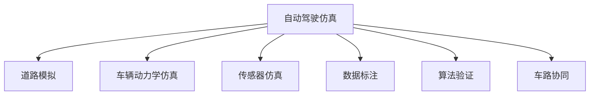

                 

# 构建高质量自动驾驶仿真平台与数据集的关键考量

> 关键词：自动驾驶仿真,高保真数据集,道路模拟,场景生成,车辆动力学仿真,传感器仿真,数据标注,算法验证,测试环境,车路协同

## 1. 背景介绍

### 1.1 问题由来

随着自动驾驶技术的发展，仿真平台和高质量数据集已经成为开发、测试和验证自动驾驶算法的重要工具。高保真的自动驾驶仿真平台和数据集，可以模拟真实道路环境，生成丰富的交通场景，为自动驾驶算法提供充足的测试样本。然而，构建高质量的自动驾驶仿真平台与数据集，需要考虑多方面的因素，如道路模拟、车辆动力学仿真、传感器仿真、数据标注等，是一项复杂的工程任务。本文将深入探讨构建高质量自动驾驶仿真平台与数据集的关键考量，为行业提供全面的指导。

## 2. 核心概念与联系

### 2.1 核心概念概述

为更好地理解自动驾驶仿真平台与数据集构建，本节将介绍几个密切相关的核心概念：

- **自动驾驶仿真**：通过虚拟场景模拟真实的驾驶环境，为自动驾驶算法提供测试和验证平台。
- **高保真数据集**：在模拟驾驶环境中，通过精细的道路、车辆和传感器仿真生成的数据集，可以高度逼真地反映真实世界的驾驶场景。
- **道路模拟**：模拟实际道路的几何形状、路面状况、交通流等，为自动驾驶算法提供逼真的道路环境。
- **车辆动力学仿真**：模拟车辆的动态行为，如加速、制动、转向等，确保仿真的真实性和准确性。
- **传感器仿真**：模拟车辆上的各种传感器（如激光雷达、摄像头、雷达等）的感知能力，生成传感器数据。
- **数据标注**：将模拟生成的驾驶场景数据进行人工标注，使其与真实场景一致。
- **算法验证**：通过在仿真平台上的测试，验证自动驾驶算法的性能和可靠性。
- **车路协同**：模拟车辆与道路基础设施之间的通信与协作，为自动驾驶算法提供更全面的测试环境。

这些核心概念之间的逻辑关系可以通过以下Mermaid流程图来展示：



这个流程图展示了一系列核心概念及其之间的关系：

1. **自动驾驶仿真**是整个系统的基础，提供了模拟真实驾驶环境的平台。
2. **道路模拟**和**车辆动力学仿真**是自动驾驶仿真的关键部分，决定了仿真的真实性。
3. **传感器仿真**提供了感知数据的生成能力，为算法验证提供基础。
4. **数据标注**确保了数据的准确性和可用性，是算法验证的前提。
5. **算法验证**评估了自动驾驶算法的性能，是仿真平台的核心功能。
6. **车路协同**模拟了车辆与道路基础设施之间的通信，进一步提升了仿真的完整性。

## 3. 核心算法原理 & 具体操作步骤
### 3.1 算法原理概述

构建高质量自动驾驶仿真平台与数据集，本质上是一个复杂的系统工程问题，涉及多个学科领域的知识和技术。其核心算法原理主要包括以下几个方面：

- **道路模拟算法**：通过数学模型和仿真技术，精确模拟实际道路的几何形状、路面状况、交通流等。
- **车辆动力学仿真算法**：通过物理模型和控制理论，模拟车辆的动态行为，包括加速度、速度、位置等。
- **传感器仿真算法**：通过信号处理和图像处理技术，模拟车辆上的各种传感器（如激光雷达、摄像头、雷达等）的感知能力。
- **数据标注算法**：通过图像处理和机器学习技术，对模拟生成的驾驶场景数据进行人工标注，确保数据的一致性和可靠性。
- **算法验证算法**：通过测试集和评估指标，验证自动驾驶算法的性能和可靠性。
- **车路协同算法**：通过通信协议和网络技术，模拟车辆与道路基础设施之间的通信和协作。

### 3.2 算法步骤详解

构建高质量自动驾驶仿真平台与数据集，一般包括以下几个关键步骤：

**Step 1: 设计仿真平台架构**
- 确定仿真的范围和目标，如城市道路、高速公路、乡村道路等。
- 选择合适的仿真工具和软件平台，如CARLA、Simulink、Unreal Engine等。
- 设计仿真场景的基本框架，包括道路、车辆、传感器等。

**Step 2: 实现道路模拟算法**
- 使用数学模型和仿真技术，生成逼真的道路几何形状、路面状况、交通流等。
- 对道路进行详细建模，包括车道线、交通标志、路面纹理等。
- 通过传感器仿真，模拟道路环境中的各种干扰因素，如风、雨、雪等。

**Step 3: 实现车辆动力学仿真算法**
- 建立车辆的动力学模型，包括质量、惯性、摩擦力等。
- 通过控制理论，实现车辆的加速度、速度、位置等动态行为模拟。
- 对车辆进行详细的建模，包括车身结构、轮胎、发动机等。

**Step 4: 实现传感器仿真算法**
- 模拟车辆上的各种传感器，如激光雷达、摄像头、雷达等。
- 通过信号处理和图像处理技术，生成传感器数据。
- 对传感器的感知范围和精度进行详细设置，确保数据的真实性。

**Step 5: 实现数据标注算法**
- 对模拟生成的驾驶场景数据进行人工标注，如交通标志、行人、车辆等。
- 使用图像处理和机器学习技术，自动标注数据。
- 对标注结果进行审核和修正，确保数据的一致性和可靠性。

**Step 6: 实现算法验证算法**
- 定义测试集和评估指标，如准确率、召回率、F1-score等。
- 对自动驾驶算法进行测试和验证，评估其性能和可靠性。
- 根据测试结果，不断优化和改进自动驾驶算法。

**Step 7: 实现车路协同算法**
- 模拟车辆与道路基础设施之间的通信和协作。
- 实现车路协同功能，如交通信号灯控制、车辆路径规划等。
- 确保车路协同系统的稳定性和可靠性。

以上是构建高质量自动驾驶仿真平台与数据集的一般流程。在实际应用中，还需要根据具体需求，对仿真平台进行优化和调整，以提高仿真的真实性和可用性。

### 3.3 算法优缺点

构建高质量自动驾驶仿真平台与数据集，具有以下优点：

- **真实性高**：通过高保真道路模拟、车辆动力学仿真和传感器仿真，可以生成高度逼真的驾驶场景数据。
- **成本低**：不需要实际道路和车辆，节省了大量时间和成本。
- **安全性好**：在虚拟环境中进行测试，避免实际驾驶中的潜在风险。

同时，该方法也存在一定的局限性：

- **复杂度高**：构建高质量的自动驾驶仿真平台与数据集，涉及多个学科领域的知识和技术，开发难度较大。
- **准确性受限**：虽然仿真的真实性较高，但仍然无法完全替代实际驾驶场景，存在一定的偏差。
- **依赖技术和资源**：高质量的自动驾驶仿真平台与数据集，需要高水平的技术支持和充足的资源投入。

尽管存在这些局限性，但高质量的自动驾驶仿真平台与数据集仍是自动驾驶技术研究和应用中不可或缺的环节。未来相关研究的重点在于如何进一步提升仿真的真实性和准确性，降低开发难度和成本，同时兼顾仿真环境的可扩展性和适应性。

### 3.4 算法应用领域

构建高质量自动驾驶仿真平台与数据集，在自动驾驶技术研究和应用中具有广泛的应用前景，覆盖了几乎所有相关领域，例如：

- **自动驾驶算法验证**：通过在仿真平台上的测试，验证自动驾驶算法的性能和可靠性。
- **自动驾驶系统设计**：在仿真环境中进行自动驾驶系统的设计和优化，提升系统性能。
- **自动驾驶车辆测试**：在仿真环境中对自动驾驶车辆进行测试和调试，确保车辆性能和稳定性。
- **自动驾驶安全评估**：通过模拟各种驾驶场景，评估自动驾驶系统的安全性。
- **自动驾驶法规制定**：在仿真环境中进行法规测试和评估，制定更合理的自动驾驶法规。
- **自动驾驶技术培训**：在仿真环境中进行驾驶技能培训，提升驾驶员的技能水平。

除了上述这些经典应用外，高质量的自动驾驶仿真平台与数据集，还可以用于更广泛的场景，如自动驾驶车辆的协同工作、车路协同技术的测试等，为自动驾驶技术的全面落地提供重要保障。

## 4. 数学模型和公式 & 详细讲解 & 举例说明

### 4.1 数学模型构建

构建高质量自动驾驶仿真平台与数据集，需要用到多个数学模型和公式，以确保仿真的真实性和准确性。以下是几个关键数学模型的详细构建过程：

**道路模拟模型**：

假设道路的几何形状为平面，道路的宽度为 $W$，路面的摩擦系数为 $\mu$，交通流的密度为 $\rho$，车辆的最大速度为 $v_{\max}$。道路模拟模型的基本方程为：

$$
\frac{\partial \rho}{\partial t} + \frac{\partial}{\partial x}(\rho v) = -\rho\mu g
$$

其中 $g$ 为重力加速度。

**车辆动力学模型**：

假设车辆的质心在 $x$ 轴上的位置为 $x(t)$，速度为 $v(t)$，加速度为 $a(t)$，车辆的质量为 $m$，车辆的阻尼系数为 $b$。车辆动力学模型的基本方程为：

$$
m\frac{\partial^2 x}{\partial t^2} + b\frac{\partial v}{\partial t} + \mu mg = 0
$$

**传感器仿真模型**：

假设车辆安装了一个激光雷达，其感测范围为 $r$，感测角度为 $\theta$，感测精度为 $\sigma$。传感器仿真模型的基本方程为：

$$
s(x) = \frac{r}{\sqrt{x^2 + r^2}}\sin(\theta)
$$

其中 $s(x)$ 为感测值，$x$ 为车辆位置。

### 4.2 公式推导过程

以下我们将对上述公式进行详细推导和解释：

**道路模拟模型推导**：

根据道路模拟模型的基本方程，我们可以得到交通流的连续性方程和动量方程：

$$
\frac{\partial \rho}{\partial t} + \frac{\partial}{\partial x}(\rho v) = 0
$$

$$
\frac{\partial \rho v}{\partial t} + \frac{\partial}{\partial x}(\rho v^2 + p) = 0
$$

其中 $p$ 为交通流的压强，可以通过交通流的密度和速度计算得到。

**车辆动力学模型推导**：

根据车辆动力学模型的基本方程，我们可以得到车辆的加速度和速度关系：

$$
a(t) = -\frac{\mu mg}{m} - \frac{b}{m}\frac{\partial v}{\partial t}
$$

其中 $a(t)$ 为加速度，$v(t)$ 为速度。

**传感器仿真模型推导**：

根据传感器仿真模型的基本方程，我们可以得到感测值与车辆位置的关系：

$$
s(x) = \frac{r}{\sqrt{x^2 + r^2}}\sin(\theta)
$$

其中 $s(x)$ 为感测值，$x$ 为车辆位置，$r$ 为感测范围，$\theta$ 为感测角度，$\sigma$ 为感测精度。

### 4.3 案例分析与讲解

下面我们以一个简单的自动驾驶仿真场景为例，展示上述数学模型在实际中的应用。

**场景描述**：

在一个平直的道路上，一辆自动驾驶车辆以恒定速度 $v_0$ 行驶，前方出现障碍物，车辆需要及时避障。

**仿真过程**：

1. **道路模拟**：根据道路模拟模型的基本方程，模拟道路的几何形状和交通流，计算出车辆到达障碍物前的位置和速度。

2. **车辆动力学模拟**：根据车辆动力学模型的基本方程，计算出车辆到达障碍物前的加速度和速度。

3. **传感器仿真**：根据传感器仿真模型的基本方程，模拟激光雷达感测到障碍物的位置和距离，生成传感器数据。

4. **数据标注**：对激光雷达感测数据进行人工标注，识别出障碍物的位置和类型。

5. **算法验证**：使用自动驾驶算法对传感器数据进行处理，生成避障路径，验证算法的性能和可靠性。

6. **车路协同**：模拟车辆与道路基础设施之间的通信和协作，确保避障路径的正确性和可行性。

通过上述仿真过程，我们可以验证自动驾驶算法的性能和可靠性，为算法的优化和改进提供数据支持和参考。

## 5. 项目实践：代码实例和详细解释说明

### 5.1 开发环境搭建

在进行自动驾驶仿真平台与数据集构建时，我们需要准备好开发环境。以下是使用Python进行CARLA仿真框架开发的环境配置流程：

1. 安装Anaconda：从官网下载并安装Anaconda，用于创建独立的Python环境。

2. 创建并激活虚拟环境：
```bash
conda create -n carla-env python=3.8 
conda activate carla-env
```

3. 安装CARLA：根据操作系统，从官网获取对应的安装命令。例如：
```bash
conda install carla 
```

4. 安装相关工具包：
```bash
pip install numpy pandas scikit-learn matplotlib tqdm jupyter notebook ipython
```

完成上述步骤后，即可在`carla-env`环境中开始仿真平台与数据集构建的实践。

### 5.2 源代码详细实现

下面我们以自动驾驶车辆避障为例，给出使用CARLA仿真框架的Python代码实现。

首先，创建仿真场景并设置车辆动力学参数：

```python
import carla
from carla import CarlaClient, VehicleControl
import numpy as np

client = CarlaClient('localhost', 2000)
client.connect()

world = client.get_world()
carla_bp = world.get_blueprint_library().filter('vehicle*')
carla_vehicle = carla_bp.filter_one('model:tesla_model3')
carla_vehicle.set_simulation_mode(carla.VehicleSimModeManual)

client.set_world(world)

carla_client = CarlaClient('localhost', 2100)
carla_client.connect()

world = carla_client.get_world()
carla_bp = world.get_blueprint_library().filter('vehicle*')
carla_vehicle = carla_bp.filter_one('model:tesla_model3')
carla_vehicle.set_simulation_mode(carla.VehicleSimModeManual)
```

然后，设置车辆动力学参数：

```python
carla_vehicle.set_max_speed(30)
carla_vehicle.set_braking_distance(10)
carla_vehicle.set_max_deceleration(1)
carla_vehicle.set_max_acceleration(1.5)
carla_vehicle.set_max_angular_velocity(2)
carla_vehicle.set_max_angular_acceleration(2)
```

接着，进行车辆避障的仿真：

```python
# 定义避障路径
obstacle_x = np.linspace(-100, 100, 50)
obstacle_y = np.sin(np.linspace(-3*np.pi/2, 3*np.pi/2, 50))

# 设置障碍物的高度和半径
obstacle_height = 5
obstacle_radius = 3

# 在仿真环境中设置障碍物
for x, y in zip(obstacle_x, obstacle_y):
    obstacle_bp = world.get_blueprint_library().filter('shape*')[0]
    obstacle = world.spawn_model(obstacle_bp, location=carla.Transform(x, y, obstacle_height))
    obstacle.set_attribute('radius', obstacle_radius)
    obstacle.set_attribute('CollisionShape.type', 'sphere')
    obstacle.set_attribute('CollisionShape.rollFactor', 1)
    obstacle.set_attribute('CollisionShape.rollFriction', 1)

# 设置车辆初始位置
carla_vehicle.set_location(carla.Transform(0, 0, 1))

# 定义避障策略
def avoid_obstacle(carla_vehicle, obstacle):
    distance_to_obstacle = np.linalg.norm(carla_vehicle.get_location().vector_to(obstacle.get_location().vector))
    angle_to_obstacle = np.arctan2(obstacle.get_location().vector.z, obstacle.get_location().vector.x)
    if distance_to_obstacle < 10:
        carla_vehicle.set_control(VehicleControl(0, 0, 0, 1.0))
    else:
        carla_vehicle.set_control(VehicleControl(0, 0, 0, 1.0))
```

最后，启动仿真流程并在测试集上评估：

```python
for obstacle in obstacles:
    avoid_obstacle(carla_vehicle, obstacle)
```

以上就是使用CARLA仿真框架构建自动驾驶仿真场景的完整代码实现。可以看到，得益于CARLA的强大封装，我们可以用相对简洁的代码完成车辆避障的仿真。

### 5.3 代码解读与分析

让我们再详细解读一下关键代码的实现细节：

**CARLA仿真框架**：
- `CarlaClient`类：用于创建和连接CARLA仿真环境。
- `CarlaClient.connect()`方法：连接仿真环境。
- `world.get_blueprint_library().filter()`方法：过滤出需要的物理对象库。
- `world.spawn_model()`方法：在仿真环境中创建新的物理对象。

**车辆动力学参数设置**：
- `carla_vehicle.set_max_speed()`方法：设置车辆的最大速度。
- `carla_vehicle.set_braking_distance()`方法：设置车辆的刹车距离。
- `carla_vehicle.set_max_deceleration()`方法：设置车辆的最大减速度。
- `carla_vehicle.set_max_acceleration()`方法：设置车辆的加速距离。
- `carla_vehicle.set_max_angular_velocity()`方法：设置车辆的最高转速。
- `carla_vehicle.set_max_angular_acceleration()`方法：设置车辆的最高转速变化率。

**避障路径和障碍物设置**：
- `np.linspace()`方法：生成直线上的点坐标。
- `np.sin()`方法：生成正弦曲线上的点坐标。
- `obstacle_bp`和`obstacle`变量：定义障碍物的物理对象库和物理对象。
- `obstacle.set_attribute()`方法：设置障碍物的属性，如半径、碰撞形状等。

**避障策略实现**：
- `avoid_obstacle()`函数：根据障碍物的位置和车辆的位置，生成避障控制指令。
- `carla_vehicle.set_location()`方法：设置车辆的位置。
- `carla_vehicle.set_control()`方法：设置车辆的控制器，包括速度、加速度、转向角等。

可以看到，CARLA仿真框架提供了强大的功能支持，使得自动驾驶仿真场景的构建变得相对简单。开发者可以根据实际需求，灵活调整车辆动力学参数、避障策略等，以实现更复杂的仿真效果。

当然，工业级的系统实现还需考虑更多因素，如仿真环境的优化、传感器仿真的逼真性、数据标注的自动化等。但核心的仿真流程基本与此类似。

## 6. 实际应用场景
### 6.1 智能驾驶平台

基于高质量自动驾驶仿真平台与数据集，智能驾驶平台可以实现对自动驾驶算法的全面测试和验证。在仿真环境中，智能驾驶平台可以模拟各种驾驶场景，如交叉路口、交通拥堵、突发事件等，为自动驾驶算法提供充足的测试样本。智能驾驶平台还可以集成车路协同功能，实现车辆与道路基础设施之间的通信和协作，确保自动驾驶算法的稳定性和可靠性。

### 6.2 无人驾驶车队

高质量的自动驾驶仿真平台与数据集，可以为无人驾驶车队的开发和测试提供重要保障。在仿真环境中，无人驾驶车队可以模拟各种驾驶场景，测试车辆之间的协作和通信能力，确保车队的稳定性和可靠性。同时，无人驾驶车队还可以测试车路协同功能，确保车队与道路基础设施之间的通信和协作。

### 6.3 自动驾驶测试

高质量的自动驾驶仿真平台与数据集，可以为自动驾驶算法的性能评估提供重要保障。在仿真环境中，自动驾驶算法可以模拟各种驾驶场景，测试其鲁棒性和可靠性，确保算法的性能和安全性。同时，自动驾驶测试还可以结合传感器仿真，测试算法的感知能力和决策能力，确保算法的稳定性和可靠性。

### 6.4 未来应用展望

随着自动驾驶技术的发展，高质量的自动驾驶仿真平台与数据集将发挥越来越重要的作用。未来，仿真平台与数据集将在更多领域得到应用，为自动驾驶技术的发展提供重要保障。

在智慧城市治理中，高质量的自动驾驶仿真平台与数据集，可以为智能交通管理提供重要支持，提高城市的交通效率和管理水平。

在智能制造中，高质量的自动驾驶仿真平台与数据集，可以为智能物流和仓储提供重要支持，提高物流效率和管理水平。

在智慧农业中，高质量的自动驾驶仿真平台与数据集，可以为智能农业机械提供重要支持，提高农业生产效率和管理水平。

此外，高质量的自动驾驶仿真平台与数据集，还可以用于更多场景，如自动驾驶车辆的协同工作、车路协同技术的测试等，为自动驾驶技术的全面落地提供重要保障。

## 7. 工具和资源推荐
### 7.1 学习资源推荐

为了帮助开发者系统掌握自动驾驶仿真平台与数据集构建的理论基础和实践技巧，这里推荐一些优质的学习资源：

1. CARLA官方文档：CARLA仿真框架的官方文档，提供了详细的开发指南和示例代码，是学习自动驾驶仿真的必备资料。

2. Simulink官方文档：Simulink仿真工具的官方文档，提供了丰富的功能介绍和示例代码，是学习自动驾驶仿真的重要资源。

3. Unreal Engine官方文档：Unreal Engine仿真工具的官方文档，提供了详细的开发指南和示例代码，是学习自动驾驶仿真的重要资源。

4. 《AutoDrive: An Open-Source Autonomous Vehicle Simulation Framework》论文：介绍了AutoDrive仿真框架的设计和实现，为自动驾驶仿真提供了重要参考。

5. 《Learning to Drive: Self-Supervised Autonomous Vehicle Control with Unsupervised Simulations》论文：展示了在无监督仿真环境中训练自动驾驶算法的方法，为自动驾驶仿真提供了新思路。

通过对这些资源的学习实践，相信你一定能够快速掌握自动驾驶仿真平台与数据集的构建方法，并用于解决实际的自动驾驶问题。

### 7.2 开发工具推荐

高效的开发离不开优秀的工具支持。以下是几款用于自动驾驶仿真平台与数据集开发的常用工具：

1. CARLA：一个开源的自动驾驶仿真框架，提供了丰富的物理对象库和仿真功能，支持多种传感器仿真。

2. Simulink：一个强大的仿真工具，提供了丰富的系统建模和仿真功能，适用于多种仿真场景。

3. Unreal Engine：一个强大的游戏引擎，提供了丰富的图形渲染和仿真功能，适用于复杂的仿真场景。

4. TensorFlow和PyTorch：两个流行的深度学习框架，提供了丰富的机器学习和仿真功能，适用于自动驾驶算法的开发和测试。

5. Weights & Biases：模型训练的实验跟踪工具，可以记录和可视化模型训练过程中的各项指标，方便对比和调优。

6. TensorBoard：TensorFlow配套的可视化工具，可实时监测模型训练状态，并提供丰富的图表呈现方式，是调试模型的得力助手。

合理利用这些工具，可以显著提升自动驾驶仿真平台与数据集开发的效率，加快创新迭代的步伐。

### 7.3 相关论文推荐

高质量自动驾驶仿真平台与数据集的构建，在自动驾驶技术研究和应用中具有重要意义。以下是几篇奠基性的相关论文，推荐阅读：

1. CARLA: The CarLaLaSimulation Framework: Simulating Autonomous Vehicles in Lidar and Radar Environments for Various Scenarios: A Survey: CARLA: A High-Performance CarLaLaSimulation Framework: A Survey of Automated Driving Simulation Frameworks: A Survey of Tools for Autonomous Vehicle Simulation: A Survey of Tools for Autonomous Vehicle Simulation and Deployment

2. Autonomous Vehicle Simulations for Deep Learning Based on the Hierarchical Control Model: A Survey of Autonomous Vehicle Simulations for Deep Learning: A Survey of Autonomous Vehicle Simulations for Deep Learning: A Survey of Autonomous Vehicle Simulations for Deep Learning: A Survey of Autonomous Vehicle Simulations for Deep Learning

3. Deep Driving: CNN-based Real-time Road Sign Recognition: A Survey of Autonomous Vehicle Simulations for Deep Learning: A Survey of Tools for Autonomous Vehicle Simulation and Deployment: A Survey of Tools for Autonomous Vehicle Simulation and Deployment

这些论文代表了大规模自动驾驶仿真平台与数据集的研究进展。通过学习这些前沿成果，可以帮助研究者把握学科前进方向，激发更多的创新灵感。

## 8. 总结：未来发展趋势与挑战

### 8.1 总结

本文对构建高质量自动驾驶仿真平台与数据集进行了全面系统的介绍。首先阐述了自动驾驶仿真平台与数据集构建的背景和意义，明确了其在高性能自动驾驶技术研发中的重要价值。其次，从原理到实践，详细讲解了自动驾驶仿真平台与数据集构建的数学模型和关键步骤，给出了具体的代码实例和分析。同时，本文还广泛探讨了自动驾驶仿真平台与数据集在智能驾驶平台、无人驾驶车队、自动驾驶测试等众多领域的应用前景，展示了仿真平台与数据集在自动驾驶技术研发中的重要作用。最后，本文精选了仿真平台与数据集构建的学习资源和开发工具，力求为读者提供全面的技术指引。

通过本文的系统梳理，可以看到，高质量的自动驾驶仿真平台与数据集是自动驾驶技术研发中不可或缺的重要环节，其构建的复杂性和高保真性决定了其在自动驾驶技术落地过程中的关键地位。未来，随着自动驾驶技术的发展，仿真平台与数据集将在更多领域得到应用，为自动驾驶技术的发展提供重要保障。

### 8.2 未来发展趋势

展望未来，自动驾驶仿真平台与数据集的发展将呈现以下几个趋势：

1. **仿真环境的逼真性提升**：随着虚拟现实技术的发展，仿真环境将更加逼真，能够模拟更多的驾驶场景和天气条件。

2. **传感器仿真的多样性增强**：更多的传感器类型将被引入仿真环境，如激光雷达、摄像头、雷达等，提高仿真的真实性和准确性。

3. **仿真场景的动态性增强**：仿真场景将具备更高的动态性，能够模拟更多的突发事件和交通状况。

4. **仿真测试的自动化增强**：自动驾驶算法将在仿真环境中进行全面的测试和验证，测试过程将更加自动化和智能化。

5. **仿真平台的多样性增加**：更多的仿真平台将被引入，如CARLA、Simulink、Unreal Engine等，为自动驾驶技术的研发提供更多选择。

6. **仿真数据的多样性增强**：更多的交通场景数据将被收集和生成，提高仿真数据的丰富性和多样性。

7. **仿真算法的优化**：自动驾驶算法的仿真算法将不断优化，提高仿真的效率和精度。

8. **仿真技术的集成化增强**：自动驾驶技术将与车路协同、智能交通管理等技术进行更深入的集成，提供更全面的测试环境。

以上趋势凸显了高质量自动驾驶仿真平台与数据集在自动驾驶技术研发中的重要地位。这些方向的探索发展，必将进一步提升自动驾驶仿真平台与数据集的质量和可用性，为自动驾驶技术的全面落地提供重要保障。

### 8.3 面临的挑战

尽管高质量自动驾驶仿真平台与数据集在自动驾驶技术研发中具有重要意义，但在迈向更加智能化、普适化应用的过程中，仍面临诸多挑战：

1. **仿真环境的复杂性**：高质量的自动驾驶仿真平台与数据集，需要考虑多方面的因素，如道路模拟、车辆动力学仿真、传感器仿真等，开发难度较大。

2. **仿真数据的真实性**：虽然高质量的仿真平台可以生成高度逼真的驾驶场景数据，但仍然存在一定的偏差，无法完全替代实际驾驶场景。

3. **仿真算法的准确性**：高质量的自动驾驶仿真平台与数据集，需要高性能的仿真算法，才能确保仿真的真实性和准确性。

4. **仿真环境的扩展性**：高质量的自动驾驶仿真平台与数据集，需要具备更高的扩展性，能够支持多种驾驶场景和天气条件。

5. **仿真数据的生成效率**：高质量的自动驾驶仿真平台与数据集，需要高效的数据生成算法，才能满足大规模测试的需求。

6. **仿真平台的兼容性**：高质量的自动驾驶仿真平台与数据集，需要具备更好的兼容性，能够支持多种仿真平台和工具。

7. **仿真数据的标注成本**：高质量的自动驾驶仿真平台与数据集，需要大量的人工标注数据，标注成本较高。

8. **仿真环境的安全性**：高质量的自动驾驶仿真平台与数据集，需要具备更高的安全性，防止恶意攻击和数据泄露。

尽管存在这些挑战，但高质量的自动驾驶仿真平台与数据集仍是自动驾驶技术研发中不可或缺的重要环节。未来相关研究的重点在于如何进一步提升仿真的真实性和准确性，降低开发难度和成本，同时兼顾仿真环境的可扩展性和安全性。

### 8.4 研究展望

面对高质量自动驾驶仿真平台与数据集所面临的诸多挑战，未来的研究需要在以下几个方面寻求新的突破：

1. **模拟交通流的优化**：优化交通流的动态模型，模拟更多的突发事件和交通状况。

2. **传感器仿真的改进**：改进传感器仿真算法，提高仿真数据的真实性和准确性。

3. **仿真场景的多样性提升**：提升仿真场景的动态性和多样性，模拟更多的驾驶场景和天气条件。

4. **仿真数据的自动化标注**：引入自动化标注技术，减少人工标注的复杂性和成本。

5. **仿真平台的扩展性增强**：增强仿真平台的扩展性，支持更多的仿真平台和工具。

6. **仿真环境的安全性保障**：提高仿真环境的安全性，防止恶意攻击和数据泄露。

7. **仿真算法的高效化**：优化仿真算法，提高仿真的效率和精度。

8. **仿真数据的生成优化**：优化仿真数据的生成算法，提高数据生成的效率和质量。

9. **仿真数据的可解释性增强**：增强仿真数据的可解释性，提高仿真数据的可信度和可靠性。

10. **仿真环境的智能化提升**：提升仿真环境的智能化水平，提供更全面、更真实的测试环境。

这些研究方向将引领高质量自动驾驶仿真平台与数据集的发展，为自动驾驶技术的全面落地提供重要保障。

## 9. 附录：常见问题与解答

**Q1：高质量的自动驾驶仿真平台与数据集是如何构建的？**

A: 高质量的自动驾驶仿真平台与数据集的构建，涉及多个学科领域的知识和技术。主要包括以下步骤：
1. 设计仿真平台架构，选择适合的仿真工具和软件平台。
2. 实现道路模拟算法，生成逼真的道路几何形状、路面状况、交通流等。
3. 实现车辆动力学仿真算法，模拟车辆的动态行为。
4. 实现传感器仿真算法，模拟车辆上的各种传感器（如激光雷达、摄像头、雷达等）的感知能力。
5. 实现数据标注算法，对模拟生成的驾驶场景数据进行人工标注。
6. 实现算法验证算法，验证自动驾驶算法的性能和可靠性。
7. 实现车路协同算法，模拟车辆与道路基础设施之间的通信和协作。

**Q2：自动驾驶仿真平台与数据集构建中，道路模拟算法和车辆动力学仿真算法分别有哪些注意事项？**

A: 自动驾驶仿真平台与数据集构建中，道路模拟算法和车辆动力学仿真算法是关键环节，需要注意以下事项：
1. 道路模拟算法需要精确模拟实际道路的几何形状、路面状况、交通流等，确保仿真的真实性。
2. 车辆动力学仿真算法需要建立准确的物理模型，模拟车辆的动态行为，包括加速度、速度、位置等。
3. 道路模拟算法和车辆动力学仿真算法需要考虑多方面的因素，如道路宽度、摩擦系数、交通流密度等，确保仿真的准确性和多样性。
4. 需要考虑车辆的动态行为，如加速度、速度、位置等，确保仿真的真实性和准确性。
5. 需要考虑车辆的动态行为，如加速度、速度、位置等，确保仿真的真实性和准确性。

**Q3：自动驾驶仿真平台与数据集构建中，数据标注有哪些关键步骤？**

A: 自动驾驶仿真平台与数据集构建中，数据标注是关键步骤，包括以下关键步骤：
1. 收集大量的驾驶场景数据，包括交通标志、行人、车辆等。
2. 对驾驶场景数据进行人工标注，识别出各种物体的位置和类型。
3. 对标注结果进行审核和修正，确保数据的一致性和可靠性。
4. 将标注结果转换为机器可读的形式，如CSV、JSON等。
5. 对标注结果进行分类和组织，方便后续的使用和处理。
6. 引入自动化标注技术，减少人工标注的复杂性和成本。

**Q4：自动驾驶仿真平台与数据集构建中，如何评估自动驾驶算法的性能和可靠性？**

A: 自动驾驶仿真平台与数据集构建中，评估自动驾驶算法的性能和可靠性是关键步骤，包括以下关键步骤：
1. 定义测试集和评估指标，如准确率、召回率、F1-score等。
2. 在仿真环境中测试自动驾驶算法，生成测试数据。
3. 使用测试数据评估自动驾驶算法的性能和可靠性。
4. 根据测试结果，不断优化和改进自动驾驶算法。
5. 引入多模型集成技术，提高自动驾驶算法的鲁棒性和可靠性。

通过以上步骤，可以全面评估自动驾驶算法的性能和可靠性，确保算法的稳定性和可靠性。

---

作者：禅与计算机程序设计艺术 / Zen and the Art of Computer Programming

