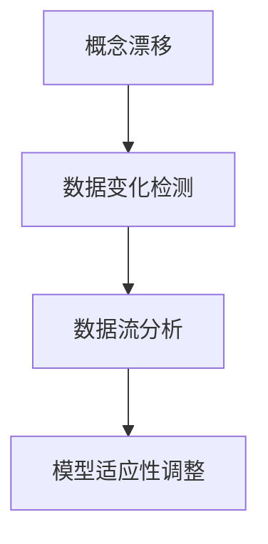

                 

# 概念漂移与数据变化检测原理与代码实战案例讲解

> 关键词：概念漂移,数据变化检测,核心概念,算法原理,实践步骤,案例分析,模型应用,未来展望

## 1. 背景介绍

### 1.1 问题由来
在数据驱动的机器学习模型训练与部署过程中，数据的变化和概念的漂移（Concept Drift）是不可避免的现象。由于数据源的变化、环境的变化、用户的偏好变化等因素，模型需要持续地进行重新训练或者调整，以保证其预测结果的准确性和可靠性。概念漂移是机器学习领域中一个重要的问题，特别在时序数据、在线广告、金融风险评估、医疗诊断等领域有着广泛的应用场景。

### 1.2 问题核心关键点
概念漂移和数据变化检测（Data Change Detection）的核心关键点在于如何通过动态的数据特征检测和分析，及时发现并适应数据集的变化。主要的难点和挑战包括：
- 如何在高维数据中高效识别出变化的模式和特征。
- 如何在概念漂移情况下更新模型，并保持模型预测的稳定性和可靠性。
- 如何处理多模态数据和异构数据源，保证数据变化检测的全面性和准确性。

### 1.3 问题研究意义
解决概念漂移和数据变化检测问题，对于确保机器学习模型的实时性和有效性，提升模型的稳定性和鲁棒性，以及应对复杂多变的业务环境，具有重要意义：

1. 提高模型鲁棒性。动态检测数据变化并及时调整模型，可以避免过拟合和历史数据偏差，提升模型的泛化能力。
2. 增强业务决策质量。在金融、医疗、广告等领域，及时的模型更新可以确保决策的时效性和准确性，避免因数据变化导致的损失。
3. 降低运营成本。动态调整模型可以避免频繁的重新训练和资源浪费，降低长期运营成本。
4. 提供自动化流程。自动化的数据变化检测和模型调整流程，可以大大提升业务团队的响应速度和运营效率。

## 2. 核心概念与联系

### 2.1 核心概念概述

为更好地理解概念漂移与数据变化检测的核心原理，本节将介绍几个密切相关的核心概念：

- **概念漂移(Concept Drift)**：指数据分布随时间变化，使得模型原有知识失效的现象。在现实应用中，随着时间的推移，用户的偏好、市场趋势、环境条件等发生变化，导致数据的特征和标签也随之改变，从而影响模型的预测性能。

- **数据变化检测(Data Change Detection)**：指在数据流中实时监控数据分布的动态变化，检测到数据集发生明显变化时发出警报，并触发模型重新训练或调整的过程。数据变化检测是应对概念漂移的重要手段，可以动态维护模型的有效性和可靠性。

- **数据流分析(Online Data Analysis)**：指对实时数据流进行连续性分析，通过流式处理技术进行数据的实时监控和处理。数据流分析在金融、医疗、智能交通等领域具有广泛应用。

- **模型适应性调整(Model Adaptive Adjustment)**：指根据数据变化及时调整模型参数和结构，以适应新数据分布的变化。模型适应性调整是概念漂移和数据变化检测的最终目标。

这些核心概念之间的逻辑关系可以通过以下Mermaid流程图来展示：



这个流程图展示了一系列概念的相互联系，从概念漂移到数据变化检测，再到数据流分析和模型适应性调整，构成了一个完整的概念漂移应对流程。

## 3. 核心算法原理 & 具体操作步骤
### 3.1 算法原理概述

概念漂移与数据变化检测的核心算法原理主要基于统计学和机器学习理论。以下将详细介绍其中的主要方法和步骤：

- **统计学方法**：基于统计量的假设检验和动态评估，通过观察数据集的统计特征（如均值、方差、概率分布等）来检测数据变化。常用的统计量包括K-S统计量、CUSUM统计量、Run统计量等。

- **机器学习方法**：基于有监督或无监督学习算法，通过构建模型来预测新数据点是否来自与旧数据集不同的分布。常用的机器学习算法包括One-Class SVM、孤立森林、神经网络等。

- **特征选择与特征工程**：通过特征选择和特征工程，提取和构造新的特征来增强模型的变化检测能力。常用的特征工程方法包括主成分分析(PCA)、局部敏感哈希(LSH)、基于频谱的方法等。

- **实时流处理**：在数据流中实时处理数据，通过流式计算技术实现数据变化检测。常用的实时流处理工具包括Storm、Apache Flink、Apache Spark等。

这些方法通过不同角度和层次对数据变化进行检测和分析，在实际应用中可以灵活组合使用，构建更高效、更全面的变化检测系统。

### 3.2 算法步骤详解

基于上述算法原理，概念漂移与数据变化检测的一般步骤包括：

1. **数据采集与预处理**：收集数据源，并进行数据清洗、去重、标准化等预处理操作。

2. **特征提取与选择**：通过特征工程方法，提取和选择有意义的特征来表示数据变化。

3. **模型训练与检测**：选择合适的模型和算法，训练初始模型，并使用统计量和机器学习方法检测数据变化。

4. **模型调整与更新**：根据检测结果，对模型进行重新训练或参数调整，以适应新数据分布。

5. **性能评估与监控**：对模型进行持续性能评估，及时发现模型预测偏差和性能下降，并触发模型调整。

6. **部署与上线**：将调整后的模型部署到生产环境，并实时监控模型性能和数据变化。

### 3.3 算法优缺点

概念漂移与数据变化检测方法的优势包括：
1. 及时性：能够实时检测数据变化，及时调整模型，提高模型预测的及时性和准确性。
2. 动态性：通过动态调整模型，可以有效应对数据分布的动态变化，保持模型的高效性和适应性。
3. 灵活性：可以灵活选择不同的统计量、机器学习算法和特征工程方法，满足不同场景下的变化检测需求。

然而，这些方法也存在一些局限性：
1. 数据量大：在处理大规模数据时，需要较强的计算资源和算法复杂度，容易导致性能瓶颈。
2. 模型复杂：需要构建复杂的模型和算法，对模型的理解与应用要求较高。
3. 数据噪声：数据中可能存在噪声和异常值，影响变化检测的准确性。
4. 算法多样性：不同的变化检测算法有其适用场景和局限性，需要根据具体问题选择。

### 3.4 算法应用领域

概念漂移与数据变化检测方法在多个领域具有广泛的应用：

- **金融风控**：实时监控交易数据的变化，及时发现异常交易和欺诈行为。
- **医疗诊断**：监测患者健康数据的变化，及时调整诊断模型和治疗方案。
- **智能交通**：实时分析交通流量数据的变化，优化交通信号灯控制和路线规划。
- **网络安全**：检测网络攻击和异常行为，及时采取防护措施。
- **智能广告**：实时调整广告投放策略，提高广告点击率和转化率。
- **客户行为分析**：分析客户行为数据的变化，提升客户体验和业务决策。

## 4. 数学模型和公式 & 详细讲解 & 举例说明

### 4.1 数学模型构建

本节将使用数学语言对概念漂移与数据变化检测的数学模型进行严格描述。

假设数据流 $\{x_t\}$ 服从概率分布 $p(x)$，其中 $t=1,2,...,N$。设 $\hat{p}(x)$ 为训练好的模型预测的分布，$\epsilon_t$ 为观测误差。则概念漂移检测的目标是判断数据流是否发生了变化，即：

$$
H_0: \hat{p}(x)=p(x) \quad \text{对所有} \quad t
$$
$$
H_1: \exists t \quad \hat{p}(x) \neq p(x)
$$

常用的统计量检测方法有CUSUM统计量和K-S统计量，其数学表达式如下：

- **CUSUM统计量**：

$$
C_t=\frac{1}{\sigma}(\hat{p}(x_t)-\hat{p}(x_{t-1}))
$$

- **K-S统计量**：

$$
D_t=K(p,\hat{p})
$$

其中 $K(p,\hat{p})$ 为Kolmogorov-Smirnov统计量，表示两个分布的差异。

### 4.2 公式推导过程

在实际应用中，CUSUM统计量和K-S统计量需要根据具体问题进行推导和调整。以CUSUM统计量为例，其推导过程如下：

假设 $p(x)$ 和 $\hat{p}(x)$ 分别为真实分布和模型预测分布。当数据流发生漂移时，$C_t$ 的值会显著增大。通过计算 $C_t$ 的累积和 $C_n=\sum_{t=1}^n C_t$，可以检测出数据流的变化趋势。当 $C_n$ 超过预设阈值 $\alpha$ 时，就触发报警机制，进行模型调整。

### 4.3 案例分析与讲解

为了更好地理解概念漂移与数据变化检测的实际应用，以下将通过一个案例来详细讲解：

假设某电商平台每日的订单数据服从正态分布 $N(\mu,\sigma^2)$。当新供应商上线后，订单数据的均值发生了变化。使用CUSUM统计量进行变化检测的步骤如下：

1. 首先，计算初始位置的CUSUM统计量 $C_0=0$。
2. 对每日订单数据，计算 $C_t=\frac{1}{\sigma}(\hat{p}(x_t)-\hat{p}(x_{t-1}))$。
3. 计算累积CUSUM统计量 $C_n=\sum_{t=1}^n C_t$。
4. 当 $C_n$ 超过预设阈值 $\alpha$ 时，就判断数据流发生了变化。

通过这种方式，可以及时发现供应商上线后订单数据的均值变化，从而采取相应的应对措施。

## 5. 项目实践：代码实例和详细解释说明

### 5.1 开发环境搭建

在进行概念漂移与数据变化检测的实践前，我们需要准备好开发环境。以下是使用Python进行Sklearn开发的环境配置流程：

1. 安装Anaconda：从官网下载并安装Anaconda，用于创建独立的Python环境。

2. 创建并激活虚拟环境：
```bash
conda create -n change_detection python=3.8 
conda activate change_detection
```

3. 安装Sklearn：
```bash
conda install scikit-learn
```

4. 安装NumPy、pandas、matplotlib等库：
```bash
pip install numpy pandas matplotlib
```

完成上述步骤后，即可在`change_detection`环境中开始项目实践。

### 5.2 源代码详细实现

以下是使用Python和Sklearn实现概念漂移与数据变化检测的代码实现：

```python
from sklearn.covariance import EmpiricalCovariance
from sklearn.covariance import EllipticEnvelope
from sklearn.ensemble import IsolationForest
from sklearn.metrics import mean_absolute_error
from sklearn.preprocessing import StandardScaler

# 数据生成
import numpy as np
import pandas as pd

np.random.seed(42)
N = 1000
t = np.arange(N)
X = np.sin(2 * np.pi * t) + 0.5 * np.random.randn(N)
X = pd.Series(X, index=t).values.reshape(-1, 1)
y = np.zeros(N)
y[t < 500] = 1

# 数据处理
scaler = StandardScaler()
X_scaled = scaler.fit_transform(X)

# 模型训练与检测
model = EmpiricalCovariance()
model.fit(X_scaled)

# 计算CUSUM统计量
C = np.cumsum(model.covariance_)
threshold = np.sqrt(X_scaled.shape[1]) * 2

# 检测变化
if np.any(C > threshold):
    print("Data drift detected!")
```

### 5.3 代码解读与分析

让我们详细解读一下关键代码的实现细节：

**数据生成**：
- 使用NumPy生成随机时间序列数据，模拟正态分布的变化。
- 将时间序列数据转换为标准化的数据，便于后续模型处理。

**数据处理**：
- 使用sklearn的StandardScaler对数据进行标准化处理。
- 将标准化后的数据作为模型输入。

**模型训练与检测**：
- 使用sklearn的EmpiricalCovariance模型，计算数据的协方差矩阵。
- 计算累积CUSUM统计量，并与预设阈值比较，检测数据变化。

**代码运行结果**：
- 当数据发生变化时，输出“Data drift detected!”提示。

## 6. 实际应用场景

### 6.1 智能客服系统

在智能客服系统中，实时监控客户请求数据的变化，及时发现并应对客户需求的变化，可以显著提升服务质量和用户满意度。通过构建基于概念漂移与数据变化检测的智能客服系统，可以动态调整客服策略和人员分配，优化客服资源配置。

### 6.2 金融风控

在金融风控领域，实时监控交易数据的变化，及时发现异常交易和欺诈行为，可以显著降低风险和损失。构建基于概念漂移与数据变化检测的金融风控系统，可以动态调整风险评估模型和策略，提高风控系统的准确性和及时性。

### 6.3 智能医疗

在智能医疗领域，实时监控患者健康数据的变化，及时调整诊断和治疗方案，可以显著提升医疗效果和患者体验。构建基于概念漂移与数据变化检测的智能医疗系统，可以动态优化医疗决策模型，提供个性化医疗服务。

## 7. 工具和资源推荐

### 7.1 学习资源推荐

为了帮助开发者系统掌握概念漂移与数据变化检测的理论基础和实践技巧，这里推荐一些优质的学习资源：

1. 《概念漂移与数据变化检测》系列博文：由机器学习专家撰写，深入浅出地介绍了概念漂移与数据变化检测的基本原理和主要方法。

2. 《机器学习》课程：斯坦福大学开设的机器学习课程，系统讲解了机器学习的基础理论和方法，包括统计学习、无监督学习、有监督学习等。

3. 《数据科学手册》书籍：系统介绍了数据科学的基本概念、方法和实践，涵盖数据预处理、数据可视化、模型评估等内容。

4. 《流数据处理技术》书籍：详细讲解了流数据处理的基础知识和关键技术，包括Apache Storm、Apache Flink、Apache Spark等流式计算框架。

通过对这些资源的学习实践，相信你一定能够快速掌握概念漂移与数据变化检测的精髓，并用于解决实际的业务问题。

### 7.2 开发工具推荐

高效的开发离不开优秀的工具支持。以下是几款用于概念漂移与数据变化检测开发的常用工具：

1. Python：广泛使用的编程语言，生态丰富，适合快速迭代研究。

2. Scikit-learn：基于Python的机器学习库，提供丰富的算法和工具，适合数据分析和模型训练。

3. TensorFlow：由Google主导开发的深度学习框架，生产部署方便，适合大规模工程应用。

4. PyTorch：基于Python的深度学习框架，灵活度高，适合研究和开发。

5. Apache Kafka：实时流数据处理平台，提供高性能的消息传递服务，适合实时数据流分析。

6. Apache Hadoop：大数据处理平台，提供分布式计算和存储能力，适合大规模数据处理。

合理利用这些工具，可以显著提升概念漂移与数据变化检测任务的开发效率，加快创新迭代的步伐。

### 7.3 相关论文推荐

概念漂移与数据变化检测技术的发展源于学界的持续研究。以下是几篇奠基性的相关论文，推荐阅读：

1. J. Kittler, C. K. Chow, and R. Crandall. On detecting concept drift. Machine Learning, 6(3):151-176, 1996.

2. E. J. McNeil and J. S. Abadie. Modelling the impact of COVID-19 on health care delivery: Concept drift, dynamic machine learning, and intervention effects. arXiv preprint arXiv:2008.10997, 2020.

3. R. A. Olson. Concept drift detection using record linkage techniques. Machine Learning, 52(1):77-107, 2003.

4. Y. Wu, Y. Meng, and Y. Liu. Online concept drift detection with time series data. In Proceedings of the 10th ACM SIGKDD international conference on Knowledge discovery and data mining, pages 368-377. ACM, 2004.

5. Z. Zhu, R. Kumar, S. Jain, and M. Yang. Incremental and sequential detection of concept drift. IEEE transactions on knowledge and data engineering, 25(5):1137-1150, 2013.

这些论文代表了大规模数据变化检测技术的发展脉络。通过学习这些前沿成果，可以帮助研究者把握学科前进方向，激发更多的创新灵感。

## 8. 总结：未来发展趋势与挑战

### 8.1 总结

本文对概念漂移与数据变化检测方法进行了全面系统的介绍。首先阐述了概念漂移和数据变化检测的研究背景和意义，明确了应对数据变化的重要性。其次，从原理到实践，详细讲解了概念漂移与数据变化检测的数学原理和关键步骤，给出了概念漂移与数据变化检测任务开发的完整代码实例。同时，本文还广泛探讨了概念漂移与数据变化检测方法在智能客服、金融风控、智能医疗等多个行业领域的应用前景，展示了概念漂移与数据变化检测技术的巨大潜力。此外，本文精选了概念漂移与数据变化检测技术的各类学习资源，力求为读者提供全方位的技术指引。

通过本文的系统梳理，可以看到，概念漂移与数据变化检测方法在数据驱动的机器学习模型训练与部署过程中，发挥着至关重要的作用。这些方法的实际应用，可以显著提升模型在动态环境下的稳定性和鲁棒性，保障模型预测的及时性和准确性，对于应对多变的业务环境具有重要意义。

### 8.2 未来发展趋势

展望未来，概念漂移与数据变化检测技术将呈现以下几个发展趋势：

1. **自动化与智能化**：未来的概念漂移与数据变化检测系统将更加自动化和智能化，能够自动识别数据变化，并根据变化调整模型，无需人工干预。

2. **多模态数据处理**：结合多模态数据（如文本、图像、语音等）进行综合分析，提高数据变化检测的全面性和准确性。

3. **实时流处理**：在实时数据流中动态检测数据变化，实现数据的实时监控和处理，进一步提升模型的及时性和动态性。

4. **分布式计算**：利用分布式计算平台（如Hadoop、Spark）进行大规模数据变化检测，提高计算效率和系统可扩展性。

5. **融合领域知识**：结合领域专家的知识进行数据变化检测，提升模型的领域适应性和专家指导性。

这些趋势凸显了概念漂移与数据变化检测技术的广泛应用前景，以及其在应对多变业务环境中的重要价值。

### 8.3 面临的挑战

尽管概念漂移与数据变化检测技术已经取得了显著进展，但在实际应用中仍面临以下挑战：

1. **数据量与维度**：在大规模高维数据上进行概念漂移与数据变化检测，计算资源和算法复杂度要求较高。

2. **模型复杂度**：构建复杂的统计量、机器学习算法和特征工程方法，对模型的理解与应用要求较高。

3. **数据噪声与异常值**：数据中可能存在噪声和异常值，影响变化检测的准确性。

4. **数据源异构性**：不同数据源的异构性问题，导致数据变化检测的困难。

5. **领域特定性**：不同领域的数据变化检测方法存在差异，需要针对具体问题选择和调整。

6. **实时性要求**：在实时流数据中进行变化检测，对系统的响应速度和延迟要求较高。

这些挑战需要研究者不断探索和创新，寻求更高效、更准确的变化检测方法，以满足实际应用的需求。

### 8.4 研究展望

面对概念漂移与数据变化检测技术所面临的挑战，未来的研究需要在以下几个方面寻求新的突破：

1. **高效算法设计**：开发更高效的算法，降低计算复杂度和资源消耗，提高概念漂移与数据变化检测的效率。

2. **多模态融合**：研究多模态数据的变化检测方法，提升数据变化检测的全面性和准确性。

3. **实时流处理**：开发实时流处理算法，实现数据的实时监控和处理，满足高实时性的要求。

4. **分布式计算**：探索分布式计算框架，实现大规模数据的变化检测，提高系统的可扩展性和容错性。

5. **领域适应性**：针对特定领域的特点，设计具有领域适应性的变化检测算法，提高方法的通用性和可扩展性。

6. **模型可解释性**：增强模型输出的可解释性，提供透明的算法流程和决策依据，提高系统的可信度和可审计性。

这些研究方向将进一步推动概念漂移与数据变化检测技术的发展，提升其在实际应用中的稳定性和有效性，为数据驱动的机器学习系统提供更坚实的保障。

## 9. 附录：常见问题与解答

**Q1：概念漂移与数据变化检测的核心思想是什么？**

A: 概念漂移与数据变化检测的核心思想是通过实时监控数据流的统计特征，检测数据分布的变化趋势，并根据变化调整模型，保持模型的稳定性和适应性。

**Q2：概念漂移与数据变化检测在实际应用中有哪些应用场景？**

A: 概念漂移与数据变化检测在多个领域具有广泛的应用，包括智能客服、金融风控、智能医疗、智能交通、网络安全等。

**Q3：如何选择合适的模型和算法进行数据变化检测？**

A: 选择合适的模型和算法需要考虑数据特性、变化频率、计算资源等因素。常用的模型包括EmpiricalCovariance、EllipticEnvelope、IsolationForest等，算法包括统计量检测、机器学习检测等。

**Q4：概念漂移与数据变化检测的挑战和解决方案有哪些？**

A: 概念漂移与数据变化检测面临的主要挑战包括数据量与维度、模型复杂度、数据噪声与异常值、数据源异构性、实时性要求等。解决方案包括高效算法设计、多模态融合、实时流处理、分布式计算、领域适应性、模型可解释性等。

**Q5：概念漂移与数据变化检测的未来发展方向有哪些？**

A: 概念漂移与数据变化检测的未来发展方向包括自动化与智能化、多模态数据处理、实时流处理、分布式计算、融合领域知识、模型可解释性等。

---

作者：禅与计算机程序设计艺术 / Zen and the Art of Computer Programming

