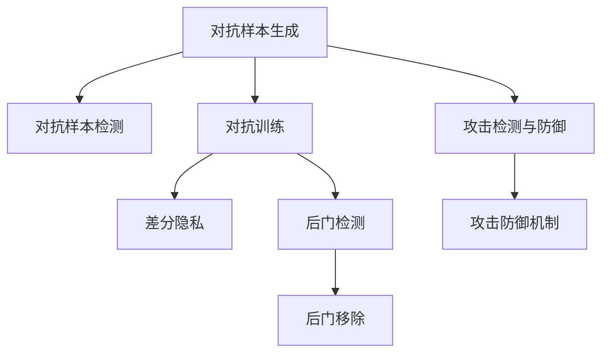

                 

# 模型安全与对抗攻防原理与代码实战案例讲解

> 关键词：模型安全,对抗攻击,对抗训练,防御机制,代码实战

## 1. 背景介绍

在当今高度数字化的世界中，模型安全与对抗攻防问题变得愈加重要。无论是医疗、金融、电力等关键基础设施，还是社交网络、电子商务等普通应用场景，模型所做出的决策直接关系到用户的财产安全、隐私保护以及社会稳定。然而，由于模型的脆弱性，攻击者可以利用各种攻击手段获取利益。为此，如何构建安全可靠的模型成为了当前的迫切需求。

### 1.1 问题由来
随着深度学习模型在各领域应用的深化，模型安全问题逐渐凸显出来。最常见的攻击包括：

- **对抗攻击**：利用微小的扰动（通常是无法察觉的），使得模型输出发生错误。攻击者通常利用小扰动改变输入数据，从而达到操控模型输出的目的。例如，在图像识别中，对图片进行微小的像素扰动，可以使模型错误识别图片中的物体。

- **模型泄漏**：攻击者通过访问模型训练数据、测试数据，甚至模型参数，获取模型的内部信息。这些信息可能包括模型的内部知识结构、训练数据的分布等，可以被用于模型逆向工程和数据泄漏。

- **后门攻击**：攻击者可以在模型训练阶段注入后门，使得模型在特定输入下执行特定操作。例如，对医疗诊断模型进行后门注入，使得模型在输入特定症状时产生误诊。

### 1.2 问题核心关键点
要解决模型安全问题，需要从多个维度入手：

- **对抗攻击检测与防御**：通过检测对抗样本，对模型进行抗扰动训练，提升模型的鲁棒性。
- **隐私保护与数据安全**：对模型进行差分隐私处理，对数据进行加密与去标识化，保护用户隐私。
- **后门检测与移除**：通过模型分析，检测后门存在，并设计移除后门的算法，保证模型的安全性。

## 2. 核心概念与联系

### 2.1 核心概念概述

为更好地理解模型安全与对抗攻防方法，本节将介绍几个关键概念：

- **模型安全**：指模型在面对各种攻击时，仍能保持稳定、正确的输出。安全模型应具备鲁棒性、泛化性、可解释性等特性。
- **对抗攻击**：指攻击者通过添加或修改输入的微小扰动，使模型输出产生错误。常见的对抗攻击包括对抗样本生成、对抗样本检测等。
- **对抗训练**：通过在训练过程中引入对抗样本，使模型学习如何抵抗对抗攻击，提升模型的鲁棒性。
- **差分隐私**：一种保护数据隐私的方法，通过在数据分析和模型训练过程中引入噪声，使得攻击者无法从模型输出中反推原始数据。
- **后门攻击**：指攻击者通过在模型训练过程中注入后门，使得模型在特定输入下执行特定操作。后门检测与移除技术旨在发现并清除后门，确保模型安全性。

这些概念之间的联系可以通过以下Mermaid流程图来展示：



这个流程图展示了几大核心概念及其之间的关系：

1. 对抗样本生成和对抗样本检测是对抗训练的基础。
2. 差分隐私与对抗训练、后门检测与移除都是模型安全的技术手段。
3. 攻击检测与防御机制综合应用各种防御策略，保障模型的安全性。

这些概念共同构成了模型安全的理论基础和实践框架，帮助我们构建和维护安全可靠的深度学习模型。

## 3. 核心算法原理 & 具体操作步骤
### 3.1 算法原理概述

模型安全与对抗攻防的原理是利用对抗攻击来训练模型，使其具备抗攻击的能力。核心思想是通过不断对抗训练，使模型在面对攻击时仍能输出正确的结果。

形式化地，假设模型的原始损失函数为 $\mathcal{L}$，攻击者希望通过对输入数据 $x$ 添加微小扰动 $\delta$，使得模型输出错误，即希望最大化模型在对抗扰动下的损失函数。因此，模型的抗攻击训练过程可以表示为：

$$
\min_{\theta} \mathbb{E}_{(x,y)}[\max_{\delta} \mathcal{L}(f_{\theta}(x+\delta),y)]
$$

其中 $f_{\theta}$ 为模型函数，$\theta$ 为模型参数，$\delta$ 为扰动，$x$ 为输入，$y$ 为标签。

### 3.2 算法步骤详解

基于对抗样本生成和对抗训练的模型安全算法步骤通常包括：

**Step 1: 准备对抗训练数据**
- 收集目标任务的对抗样本数据集 $D_{adv}$，每个样本 $(x_i,y_i)$ 包含一个原始样本 $x_i$ 和一个对抗扰动 $\delta_i$，使得 $x_i+\delta_i$ 在对抗扰动下仍被正确分类。

**Step 2: 定义损失函数**
- 对抗样本生成的损失函数为 $L(x_i,\delta_i,y_i)=\mathcal{L}(f_{\theta}(x_i+\delta_i),y_i)$。
- 综合考虑模型的原始损失函数和对抗样本生成损失函数，得到最终损失函数 $\mathcal{L}_{adv}=\mathbb{E}_{(x,y)\sim D}[\max_{\delta}L(x,\delta,y)]$。

**Step 3: 优化模型参数**
- 使用梯度下降等优化算法，对模型参数 $\theta$ 进行优化，最小化 $\mathcal{L}_{adv}$。
- 在每个迭代步骤中，随机抽取 $(x,y)$ 进行对抗样本生成，然后计算并更新模型的参数。

**Step 4: 评估模型性能**
- 在对抗训练完成后，使用对抗样本数据集评估模型的鲁棒性。
- 若模型在对抗样本上仍能保持高精度，说明模型的鲁棒性得到提升。

### 3.3 算法优缺点

基于对抗训练的模型安全方法具有以下优点：

- **鲁棒性提升**：通过对抗训练，模型在面对对抗样本时仍能保持高精度，大大提升了模型的鲁棒性。
- **泛化能力强**：对抗训练使得模型学习到更加稳定的特征表示，提升了模型的泛化能力。
- **适应性强**：对抗训练方法灵活，可以应用于各种NLP、CV等任务。

同时，该方法也存在一定的局限性：

- **计算资源消耗大**：对抗训练需要大量对抗样本，计算复杂度高，训练成本大。
- **防御能力有限**：对抗训练无法防御所有攻击手段，仍可能存在漏洞。
- **对抗样本生成难度大**：对抗样本的生成技术复杂，需要精细化的设计，难以自动化实现。

### 3.4 算法应用领域

基于对抗训练的模型安全方法在多个领域得到了广泛应用，包括但不限于：

- **图像识别**：如对ImageNet数据集上的模型进行对抗训练，提升模型的鲁棒性和泛化能力。
- **自然语言处理**：如对BERT等模型进行对抗训练，提升其在自然语言推理、文本分类等任务中的鲁棒性。
- **语音识别**：如对ASR模型进行对抗训练，提高其在面对噪声、回声等环境下的鲁棒性。
- **医疗诊断**：如对医疗影像识别模型进行对抗训练，提升其在面对病灶干扰时的诊断准确性。
- **自动驾驶**：如对自动驾驶模型进行对抗训练，增强其对复杂场景的处理能力。

## 4. 数学模型和公式 & 详细讲解 & 举例说明

### 4.1 数学模型构建

本节将使用数学语言对对抗训练过程进行严格描述。

假设模型为 $f_{\theta}$，对抗训练的目标是在训练数据集 $D=\{(x_i,y_i)\}$ 上最小化以下损失函数：

$$
\mathcal{L}(f_{\theta},D)=\frac{1}{N}\sum_{i=1}^N\ell(f_{\theta}(x_i),y_i)
$$

其中 $\ell$ 为模型的原始损失函数。

对抗训练的目标是最大化模型在对抗扰动下的损失函数。定义对抗扰动函数 $g_{\delta}(x)$，其作用是在输入 $x$ 上生成对抗扰动 $\delta$，使得 $f_{\theta}(x+\delta)$ 被错误分类。例如，在图像识别中，$g_{\delta}(x)$ 可能是一个微小的像素扰动，使得图像分类错误。

因此，对抗训练的损失函数为：

$$
\mathcal{L}_{adv}=\mathbb{E}_{(x,y)\sim D}[\max_{\delta}L(x,\delta,y)]
$$

其中 $L(x,\delta,y)=\ell(f_{\theta}(x+\delta),y)$。

### 4.2 公式推导过程

以下我们以图像分类任务为例，推导对抗训练的损失函数及其梯度计算公式。

假设模型 $f_{\theta}$ 在输入 $x$ 上的输出为 $f_{\theta}(x)$，标签为 $y$。定义对抗扰动函数 $g_{\delta}(x)$，使得 $f_{\theta}(x+\delta)$ 被错误分类。对抗训练的目标是最大化模型在对抗扰动下的损失函数，即：

$$
\mathcal{L}_{adv}=\mathbb{E}_{(x,y)\sim D}[\max_{\delta}L(x,\delta,y)]
$$

其中 $L(x,\delta,y)=\ell(f_{\theta}(x+\delta),y)$。

根据链式法则，损失函数对参数 $\theta_k$ 的梯度为：

$$
\frac{\partial \mathcal{L}_{adv}}{\partial \theta_k} = \frac{\partial}{\partial \theta_k} \mathbb{E}_{(x,y)\sim D}[\max_{\delta}L(x,\delta,y)]
$$

对期望内函数求导，并使用对偶技巧，得到：

$$
\frac{\partial \mathcal{L}_{adv}}{\partial \theta_k} = \mathbb{E}_{(x,y)\sim D}[\max_{\delta} \nabla_{\theta_k} L(x,\delta,y)]
$$

其中 $\nabla_{\theta_k} L(x,\delta,y)$ 为损失函数 $L(x,\delta,y)$ 对参数 $\theta_k$ 的梯度。

对每个样本 $(x,y)$，我们首先求解对抗扰动 $\delta$，使得 $L(x,\delta,y)$ 最大化。这个过程可以使用梯度上升等优化算法，找到对抗扰动方向。然后，对所有样本求梯度，并根据梯度下降算法更新参数 $\theta$。

### 4.3 案例分析与讲解

假设我们有一个简单的二分类模型 $f_{\theta}$，在图像分类任务中，该模型的目标函数为交叉熵损失。

假设对抗扰动函数 $g_{\delta}(x)$ 为随机扰动，可以表示为 $\delta = \epsilon \cdot \delta_0$，其中 $\delta_0$ 是一个单位正则化扰动，$\epsilon$ 是一个小的扰动强度。

对抗训练的目标是最大化模型在对抗扰动下的损失函数：

$$
\mathcal{L}_{adv}=\mathbb{E}_{(x,y)\sim D}[\max_{\delta}L(x,\delta,y)]
$$

其中 $L(x,\delta,y)=\ell(f_{\theta}(x+\delta),y)$。

假设我们选取的对抗扰动是随机正则化扰动，即 $\delta = \epsilon \cdot \delta_0$，其中 $\delta_0$ 是一个单位正则化扰动，$\epsilon$ 是一个小的扰动强度。我们可以计算梯度上升算法下的梯度 $\nabla L(x,\delta,y)$ 为：

$$
\nabla L(x,\delta,y)=\nabla_{x+\delta} \ell(f_{\theta}(x+\delta),y)
$$

将 $\nabla L(x,\delta,y)$ 代入梯度下降算法，更新模型参数 $\theta$：

$$
\theta \leftarrow \theta - \eta \nabla_{\theta} \mathcal{L}_{adv}
$$

其中 $\eta$ 是学习率，$\nabla_{\theta} \mathcal{L}_{adv}$ 为对抗训练的梯度。

假设我们有一个简单的二分类模型 $f_{\theta}$，在图像分类任务中，该模型的目标函数为交叉熵损失。对抗训练的目标是最大化模型在对抗扰动下的损失函数：

$$
\mathcal{L}_{adv}=\mathbb{E}_{(x,y)\sim D}[\max_{\delta}L(x,\delta,y)]
$$

其中 $L(x,\delta,y)=\ell(f_{\theta}(x+\delta),y)$。

假设我们选取的对抗扰动是随机正则化扰动，即 $\delta = \epsilon \cdot \delta_0$，其中 $\delta_0$ 是一个单位正则化扰动，$\epsilon$ 是一个小的扰动强度。我们可以计算梯度上升算法下的梯度 $\nabla L(x,\delta,y)$ 为：

$$
\nabla L(x,\delta,y)=\nabla_{x+\delta} \ell(f_{\theta}(x+\delta),y)
$$

将 $\nabla L(x,\delta,y)$ 代入梯度下降算法，更新模型参数 $\theta$：

$$
\theta \leftarrow \theta - \eta \nabla_{\theta} \mathcal{L}_{adv}
$$

其中 $\eta$ 是学习率，$\nabla_{\theta} \mathcal{L}_{adv}$ 为对抗训练的梯度。

这个案例展示了对抗训练的基本流程和数学原理，帮助我们更好地理解对抗训练的机制和目标。

## 5. 项目实践：代码实例和详细解释说明
### 5.1 开发环境搭建

在进行对抗训练实践前，我们需要准备好开发环境。以下是使用Python进行PyTorch开发的环境配置流程：

1. 安装Anaconda：从官网下载并安装Anaconda，用于创建独立的Python环境。

2. 创建并激活虚拟环境：
```bash
conda create -n pytorch-env python=3.8 
conda activate pytorch-env
```

3. 安装PyTorch：根据CUDA版本，从官网获取对应的安装命令。例如：
```bash
conda install pytorch torchvision torchaudio cudatoolkit=11.1 -c pytorch -c conda-forge
```

4. 安装TensorFlow：
```bash
conda install tensorflow -c pytorch -c conda-forge
```

5. 安装各类工具包：
```bash
pip install numpy pandas scikit-learn matplotlib tqdm jupyter notebook ipython
```

完成上述步骤后，即可在`pytorch-env`环境中开始对抗训练实践。

### 5.2 源代码详细实现

下面我们以MNIST手写数字识别任务为例，给出使用PyTorch进行对抗训练的完整代码实现。

首先，定义模型和优化器：

```python
import torch
from torchvision import datasets, transforms
from torch.utils.data import DataLoader
from torch.nn import functional as F
from torch.optim import Adam
from torchvision.models import resnet18

device = torch.device('cuda' if torch.cuda.is_available() else 'cpu')

# 定义模型
model = resnet18(pretrained=True)
model.fc = torch.nn.Linear(512, 10)
model = model.to(device)

# 定义优化器
optimizer = Adam(model.parameters(), lr=0.001)

# 定义损失函数
criterion = torch.nn.CrossEntropyLoss().to(device)
```

然后，定义训练和评估函数：

```python
def train(model, dataloader, optimizer, criterion, device, n_epochs):
    model.train()
    for epoch in range(n_epochs):
        for inputs, labels in dataloader:
            inputs, labels = inputs.to(device), labels.to(device)
            optimizer.zero_grad()
            outputs = model(inputs)
            loss = criterion(outputs, labels)
            loss.backward()
            optimizer.step()
            if (epoch+1) % 100 == 0:
                print('Epoch [{}/{}], Loss: {:.4f}'.format(epoch+1, n_epochs, loss.item()))

def evaluate(model, dataloader, device):
    model.eval()
    total_correct = 0
    total_samples = 0
    with torch.no_grad():
        for inputs, labels in dataloader:
            inputs, labels = inputs.to(device), labels.to(device)
            outputs = model(inputs)
            _, predicted = torch.max(outputs.data, 1)
            total_correct += (predicted == labels).sum().item()
            total_samples += labels.size(0)
    accuracy = 100. * total_correct / total_samples
    print('Accuracy: {:.2f}%'.format(accuracy))

# 定义训练集和测试集
trainset = datasets.MNIST(root='./data', train=True, download=True, transform=transforms.ToTensor())
testset = datasets.MNIST(root='./data', train=False, download=True, transform=transforms.ToTensor())

# 定义数据加载器
trainloader = torch.utils.data.DataLoader(trainset, batch_size=64, shuffle=True, num_workers=4)
testloader = torch.utils.data.DataLoader(testset, batch_size=64, shuffle=False, num_workers=4)

# 训练模型
train(model, trainloader, optimizer, criterion, device, 10)

# 评估模型
evaluate(model, testloader, device)
```

以上代码实现了使用PyTorch进行对抗训练的完整过程。可以看到，使用PyTorch实现对抗训练非常简单，主要需要定义模型、优化器、损失函数，以及训练和评估函数。

### 5.3 代码解读与分析

让我们再详细解读一下关键代码的实现细节：

**train函数**：
- 在每个epoch开始时，设置模型为训练模式。
- 对每个batch的数据进行前向传播和后向传播，更新模型参数。
- 如果当前epoch为100的倍数，则输出训练损失。

**evaluate函数**：
- 在测试集上进行评估，计算模型的准确率。
- 将计算结果打印输出。

**训练和评估流程**：
- 在训练集上训练模型，输出训练损失。
- 在测试集上评估模型，输出准确率。

可以看到，PyTorch提供了丰富的API和工具，使得对抗训练的实现变得简单高效。开发者可以更专注于算法的优化和模型的改进，而不必过多关注底层实现细节。

当然，工业级的系统实现还需考虑更多因素，如模型的保存和部署、超参数的自动搜索、更灵活的任务适配层等。但核心的对抗训练范式基本与此类似。

## 6. 实际应用场景
### 6.1 智能医疗系统

智能医疗系统在现代医疗诊断中扮演着越来越重要的角色，通过AI技术辅助医生进行诊断和治疗，大大提升了医疗效率和准确性。然而，医疗数据的安全性和隐私性要求极高，模型安全问题尤为关键。

在智能医疗系统中，对抗训练可以应用于各种医疗影像识别、基因序列分析、病理检测等任务。通过在模型训练过程中引入对抗样本，使模型学习到更加鲁棒的特征表示，从而提升模型在面对攻击时的稳定性。例如，对医疗影像识别模型进行对抗训练，可以提高其在面对噪声、病灶干扰时的鲁棒性，提升诊断准确性。

### 6.2 金融风控系统

金融风控系统是金融行业的重要组成部分，通过AI技术分析用户的交易行为，进行风险评估和信用评级。然而，金融数据涉及用户的财产安全，模型安全问题不容忽视。

对抗训练在金融风控系统中可以用于提高模型的鲁棒性，防范对抗攻击。例如，对金融交易分析模型进行对抗训练，可以使模型在面对恶意交易样本时仍能保持高精度，避免模型被攻击者操控。

### 6.3 工业安全系统

工业安全系统通过AI技术监控生产设备，预防和应对各种安全事故。然而，工业环境中存在各种干扰和攻击，模型安全问题成为制约其发展的瓶颈。

对抗训练在工业安全系统中可以用于提高模型的鲁棒性，防范对抗攻击。例如，对工业设备故障预测模型进行对抗训练，可以使模型在面对设备干扰和误操作时仍能保持高精度，提升系统安全性和稳定性。

### 6.4 未来应用展望

随着对抗训练技术的不断进步，基于对抗训练的模型安全方法将在更多领域得到应用，为数据驱动的决策系统提供坚实的保障。

在智慧城市治理中，对抗训练可以应用于智能交通、智能安防等场景，保障城市安全稳定。

在智慧供应链管理中，对抗训练可以应用于库存预测、物流调度等任务，提升供应链效率。

在智能交通系统中，对抗训练可以应用于交通预测、事故识别等任务，提升交通管理水平。

此外，在智慧能源、智慧农业、智慧教育等众多领域，对抗训练方法也将不断拓展应用，为各行各业提供安全可靠的人工智能解决方案。

## 7. 工具和资源推荐
### 7.1 学习资源推荐

为了帮助开发者系统掌握模型安全与对抗攻防的理论基础和实践技巧，这里推荐一些优质的学习资源：

1. 《深度学习实战》书籍：详细介绍了深度学习模型的训练、评估、优化等基本概念，涵盖对抗训练的原理和实践方法。

2. Coursera《Deep Learning Specialization》课程：由深度学习大师Andrew Ng开设，全面介绍了深度学习的基本原理和前沿技术，包括对抗训练等。

3. HackerRank《Deep Learning》课程：提供丰富的实际编程练习，帮助开发者快速掌握深度学习模型的实现和应用。

4. Google AI Blog《Adversarial Examples》博客：详细介绍了对抗攻击和对抗训练的基本原理，并提供了大量实验案例。

5. Udacity《Deep Learning Nanodegree》课程：提供深度学习的系统学习路径，涵盖对抗训练等热门技术。

通过对这些资源的学习实践，相信你一定能够快速掌握模型安全与对抗攻防的精髓，并用于解决实际的安全问题。

### 7.2 开发工具推荐

高效的开发离不开优秀的工具支持。以下是几款用于模型安全与对抗攻防开发的常用工具：

1. TensorFlow：提供丰富的API和工具，支持深度学习模型的训练和推理，便于对抗训练的实现。

2. PyTorch：提供了灵活的张量操作和动态计算图，适合对抗训练的实现和优化。

3. Adversarial Robustness Toolbox (ART)：HuggingFace开源的对抗攻击和对抗训练工具库，提供了多种对抗样本生成方法和模型防御策略。

4. CleverHans：深度学习模型的对抗攻击和对抗训练工具库，支持多种对抗样本生成方法和防御机制，并提供了详细的文档和示例。

5. Kaggle竞赛平台：提供丰富的对抗攻击和对抗训练竞赛，帮助开发者实践和验证模型的鲁棒性。

合理利用这些工具，可以显著提升模型安全与对抗攻防任务的开发效率，加快创新迭代的步伐。

### 7.3 相关论文推荐

模型安全与对抗攻防技术的发展源于学界的持续研究。以下是几篇奠基性的相关论文，推荐阅读：

1. Goodfellow et al. 《Explaining and Harnessing Adversarial Examples》：提出对抗样本的基本概念和生成方法，奠定了对抗攻击和对抗训练的基础。

2. Szegedy et al. 《Intriguing Properties of Neural Networks》：详细分析了深度神经网络对抗样本的生成方法，提供了多种对抗样本生成策略。

3. Madry et al. 《Towards Deep Learning Models Resistant to Adversarial Attacks》：提出了一种对抗训练方法，显著提升了模型在面对对抗样本时的鲁棒性。

4. Carlini et al. 《Towards Evasion Adversarial Machine Learning》：提出了一种针对对抗训练的攻击方法，并提供了防御策略。

5. Athalye et al. 《Obfuscated Gradients Give Adversarial Examples》：详细分析了对抗攻击背后的原因，提出了多种对抗样本生成方法和防御机制。

这些论文代表了大模型安全与对抗攻防技术的发展脉络。通过学习这些前沿成果，可以帮助研究者把握学科前进方向，激发更多的创新灵感。

## 8. 总结：未来发展趋势与挑战
### 8.1 总结

本文对模型安全与对抗攻防问题进行了全面系统的介绍。首先阐述了对抗攻击的基本概念和对抗训练的核心思想，明确了对抗训练在提升模型鲁棒性方面的独特价值。其次，从原理到实践，详细讲解了对抗训练的数学原理和关键步骤，给出了对抗训练任务开发的完整代码实例。同时，本文还广泛探讨了对抗训练方法在智能医疗、金融风控、工业安全等多个领域的应用前景，展示了对抗训练范式的巨大潜力。此外，本文精选了对抗训练技术的各类学习资源，力求为读者提供全方位的技术指引。

通过本文的系统梳理，可以看到，对抗训练在提升模型鲁棒性、增强模型泛化能力、保障数据安全等方面发挥了重要作用。未来，随着对抗训练技术的不断进步，基于对抗训练的深度学习模型将在更多领域得到应用，为各行各业提供安全可靠的技术保障。

### 8.2 未来发展趋势

展望未来，对抗训练技术将呈现以下几个发展趋势：

1. **对抗训练方法的改进**：随着对抗攻击技术的进步，对抗训练方法也将不断演进，引入更多对抗样本生成策略和模型防御手段，进一步提升模型的鲁棒性。

2. **跨领域对抗训练**：对抗训练方法将逐渐应用于更多领域，如自然语言处理、计算机视觉、语音识别等，提升模型在跨领域数据上的鲁棒性。

3. **动态对抗训练**：随着模型部署环境的复杂化，动态对抗训练方法将逐渐成为主流，能够实时监测模型性能，动态调整训练策略，提升模型的实时鲁棒性。

4. **模型解释与可解释性**：对抗训练方法将逐渐引入模型解释与可解释性技术，使得模型的决策过程更加透明、可解释，提升模型的可信度和安全性。

5. **对抗训练算法的自动化**：对抗训练方法将逐渐自动化，通过自动化生成对抗样本和对抗训练策略，提升模型的训练效率和效果。

### 8.3 面临的挑战

尽管对抗训练技术已经取得了一定的成果，但在实际应用中仍面临诸多挑战：

1. **对抗样本生成难度大**：对抗样本的生成技术复杂，难以自动化实现，需要手动设计和测试。

2. **对抗训练资源消耗大**：对抗训练需要大量对抗样本，计算复杂度高，训练成本大。

3. **对抗样本检测困难**：对抗样本往往具有微小的扰动，难以用传统的检测方法识别，需要引入更先进的检测算法。

4. **对抗训练泛化能力有限**：对抗训练方法对于特定的攻击方式和攻击强度有效，但对于未知的攻击方式可能效果不佳。

5. **对抗训练与模型性能的权衡**：对抗训练会牺牲部分模型的准确性，需要在鲁棒性和性能之间进行平衡。

### 8.4 研究展望

面对对抗训练面临的种种挑战，未来的研究需要在以下几个方面寻求新的突破：

1. **对抗样本生成自动化**：开发更加自动化的对抗样本生成算法，降低对抗样本生成的难度和成本。

2. **对抗训练算法优化**：设计更加高效的对抗训练算法，减少对抗训练的资源消耗和训练时间。

3. **多领域对抗训练**：研究适用于多个领域的对抗训练方法，提升模型的跨领域鲁棒性。

4. **模型解释与可解释性**：引入模型解释与可解释性技术，使得对抗训练后的模型更加透明、可信。

5. **动态对抗训练**：开发动态对抗训练方法，实时监测模型性能，动态调整训练策略。

6. **对抗训练与模型优化结合**：结合对抗训练与模型优化技术，提升模型的整体性能和鲁棒性。

这些研究方向将推动对抗训练技术的发展，为构建安全可靠的人工智能系统提供新的路径。

## 9. 附录：常见问题与解答

**Q1：什么是对抗样本？**

A: 对抗样本是指在原始数据上添加微小的扰动，使得模型在面对这些扰动时，输出发生错误。例如，在图像分类任务中，对抗样本可能是一个经过微小扰动的图像，使得模型将错误地识别为另一种图像。

**Q2：如何生成对抗样本？**

A: 对抗样本的生成方法通常包括以下步骤：
1. 选择一个随机扰动 $\delta$，如微小的像素扰动、文本中的词汇替换等。
2. 将扰动 $\delta$ 添加到原始样本 $x$ 上，得到扰动样本 $x+\delta$。
3. 使用目标模型对扰动样本 $x+\delta$ 进行预测，得到预测结果 $\hat{y}$。
4. 根据预测结果 $\hat{y}$ 和真实标签 $y$ 的差异，调整扰动 $\delta$，使得模型输出错误。

**Q3：对抗训练的目的是什么？**

A: 对抗训练的目的是通过引入对抗样本，使模型学习到更加鲁棒的特征表示，提升模型在面对对抗攻击时的稳定性。

**Q4：对抗训练与数据增强的区别是什么？**

A: 数据增强是一种通过随机变换原始数据，增加训练集多样性的方法。而对抗训练是通过引入对抗样本，使模型学习到更加鲁棒的特征表示，提升模型在面对对抗攻击时的稳定性。数据增强和对抗训练的目的是不同的，前者是为了增加训练集多样性，后者是为了提升模型的鲁棒性。

**Q5：对抗训练和差分隐私的区别是什么？**

A: 对抗训练和差分隐私都是保护模型安全的技术手段，但目的和方法不同。对抗训练是通过引入对抗样本，使模型学习到更加鲁棒的特征表示，提升模型在面对对抗攻击时的稳定性。而差分隐私是通过在模型训练和分析过程中引入噪声，保护用户隐私，防止模型泄露敏感信息。

这些回答展示了对抗训练的基本概念和实现方法，帮助你更好地理解对抗训练的原理和应用。

---

作者：禅与计算机程序设计艺术 / Zen and the Art of Computer Programming

