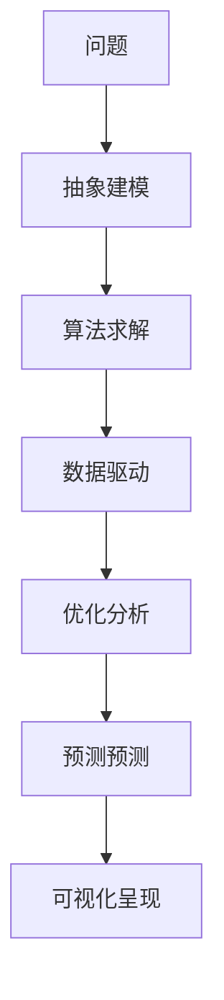

                 

# 模型思维：认知复杂世界的快捷方式

> 关键词：模型思维, 认知复杂性, 快速决策, 机器学习, 算法优化, 问题求解

## 1. 背景介绍

### 1.1 问题由来

在信息爆炸的时代，面对复杂的世界，我们常常感到无从下手。如何在海量数据中快速找到关键信息，并在有限的时间内做出合理的决策，成为了许多人面临的挑战。模型思维提供了一种系统性的方法，通过构建数学模型和算法，帮助我们在复杂问题中抽丝剥茧，找到问题的本质和解决方案。

模型思维不仅在科学研究、工程技术中有广泛应用，还在金融、医疗、交通等众多领域中扮演着重要角色。本文将系统介绍模型思维的原理和应用，帮助读者掌握快速认知复杂世界，做出高效决策的技巧。

### 1.2 问题核心关键点

模型思维的核心关键点在于通过构建数学模型和算法，抽象出问题的本质特征，然后通过数值求解、优化、预测等操作，提供快速、准确的解决方案。主要包括以下几个方面：

- **抽象建模**：从现实问题中提取关键变量和关系，构建数学模型。
- **算法优化**：选择和优化适合的算法，提高求解效率和准确性。
- **数值求解**：通过数值计算得到模型解，评估解决方案的有效性。
- **预测分析**：利用模型进行预测，辅助决策和未来规划。

这些关键点相互支撑，构成了模型思维的基本框架。

## 2. 核心概念与联系

### 2.1 核心概念概述

为更好地理解模型思维，本节将介绍几个核心概念：

- **模型**：通过抽象数学关系和算法构建的解决问题工具。
- **算法**：求解模型问题的具体步骤和策略。
- **数据**：模型输入的基础，提供模型的训练和验证数据。
- **优化**：调整模型参数和结构，提高解的质量。
- **预测**：利用模型对未来进行预测，提供决策依据。
- **可视化**：通过图表、图形等手段，直观展示模型结果，辅助理解。

这些核心概念通过数学建模、算法求解、数据驱动、优化分析、预测预测、可视化呈现等环节，构成了一个完整的模型思维框架。

### 2.2 核心概念原理和架构的 Mermaid 流程图



这个流程图展示了模型思维的基本流程：

1. 首先，从现实问题中抽象出关键变量和关系，构建数学模型。
2. 然后，选择合适的算法，对模型进行求解。
3. 接着，利用数据对模型进行训练和验证，调整模型参数和结构。
4. 通过优化分析和数值求解，提高模型解的质量。
5. 最后，利用模型进行预测，并通过可视化呈现结果。

这些环节相互衔接，构成了一个完整的模型思维流程。

## 3. 核心算法原理 & 具体操作步骤

### 3.1 算法原理概述

模型思维的核心在于通过数学模型和算法，抽象出问题的本质特征，然后通过数值求解、优化、预测等操作，提供快速、准确的解决方案。其基本步骤如下：

1. **抽象建模**：从现实问题中提取关键变量和关系，构建数学模型。
2. **算法求解**：选择合适的算法，对模型进行求解。
3. **数据驱动**：利用数据对模型进行训练和验证，调整模型参数和结构。
4. **优化分析**：通过优化分析和数值求解，提高模型解的质量。
5. **预测预测**：利用模型进行预测，辅助决策和未来规划。

### 3.2 算法步骤详解

以下是模型思维的具体操作步骤：

**Step 1: 问题抽象与建模**

首先，从现实问题中提取关键变量和关系，构建数学模型。例如，假设我们要研究“房价预测”问题，可以提取关键变量：

- 自变量：房屋面积、地理位置、交通便利程度等。
- 因变量：房价。
- 关系：房屋面积与房价的关系、交通便利程度对房价的影响等。

基于这些变量，可以构建如下线性回归模型：

$$
y = w_0 + w_1 x_1 + w_2 x_2 + \ldots + w_n x_n + \epsilon
$$

其中，$y$ 为房价，$x_i$ 为第 $i$ 个自变量，$w_i$ 为对应的权重，$\epsilon$ 为误差项。

**Step 2: 算法选择与求解**

选择合适的算法，对模型进行求解。以线性回归模型为例，可以使用最小二乘法（Least Squares）求解：

$$
\min_{\theta} \sum_{i=1}^N (y_i - \hat{y}_i)^2
$$

其中 $\theta = (w_0, w_1, w_2, \ldots, w_n)^T$ 为模型的参数向量，$\hat{y}_i = \theta^T x_i$ 为模型的预测值。求解该优化问题，得到模型的参数 $\theta$。

**Step 3: 数据驱动与训练**

利用数据对模型进行训练和验证，调整模型参数和结构。例如，收集大量房屋销售数据，作为训练集，输入模型进行训练：

$$
\theta = (w_0, w_1, w_2, \ldots, w_n)^T = \arg\min_{\theta} \sum_{i=1}^N (y_i - \hat{y}_i)^2
$$

通过最小化误差，不断调整模型的参数，得到最优解。同时，使用验证集对模型进行验证，确保其泛化能力。

**Step 4: 优化分析与改进**

通过优化分析和数值求解，提高模型解的质量。例如，使用正则化技术（如L1、L2正则化）防止过拟合，使用梯度下降算法加速求解过程，确保模型解的准确性和鲁棒性。

**Step 5: 预测预测与决策**

利用模型进行预测，辅助决策和未来规划。例如，利用训练好的线性回归模型，对新房屋的房价进行预测，提供决策依据。

### 3.3 算法优缺点

模型思维通过数学模型和算法，提供快速、准确的解决方案。其优点在于：

- **系统性**：通过建模和求解，系统地分析和解决问题。
- **高效性**：利用算法优化求解过程，提高效率和准确性。
- **可解释性**：通过模型参数和求解过程，提供决策的透明性和可解释性。

同时，模型思维也存在一些局限性：

- **数据依赖**：模型的解依赖于数据的质量和数量，数据不足或偏差可能导致模型失效。
- **算法复杂度**：复杂问题的建模和求解，需要较高的数学和算法知识，可能难以实现。
- **模型假设**：模型假设可能导致对问题的不完全理解，影响模型解的有效性。

## 4. 数学模型和公式 & 详细讲解 & 举例说明

### 4.1 数学模型构建

本节将通过具体案例，详细介绍数学模型的构建方法。

**案例：金融风险评估模型**

构建金融风险评估模型，用于评估贷款违约风险。首先，从历史贷款数据中提取关键变量：

- 自变量：借款人收入、信用评分、贷款金额等。
- 因变量：贷款违约情况。

基于这些变量，可以构建如下逻辑回归模型：

$$
P(y=1|x) = \sigma(w_0 + w_1 x_1 + w_2 x_2 + \ldots + w_n x_n)
$$

其中，$P(y=1|x)$ 表示贷款违约的概率，$\sigma$ 为逻辑函数，$w_i$ 为对应的权重。

**案例：交通流量预测模型**

构建交通流量预测模型，用于预测未来某个时间段的交通流量。首先，从历史交通数据中提取关键变量：

- 自变量：时间、天气、节假日、车辆类型等。
- 因变量：交通流量。

基于这些变量，可以构建如下线性回归模型：

$$
y = w_0 + w_1 t + w_2 w + w_3 h + w_4 v + \epsilon
$$

其中，$y$ 为交通流量，$t$ 为时间，$w$ 为天气，$h$ 为节假日，$v$ 为车辆类型，$w_i$ 为对应的权重，$\epsilon$ 为误差项。

### 4.2 公式推导过程

以下是几个常见数学模型的公式推导过程：

**线性回归模型**

如前所述，线性回归模型为：

$$
y = w_0 + w_1 x_1 + w_2 x_2 + \ldots + w_n x_n + \epsilon
$$

其最小二乘法求解过程如下：

1. 求导：

$$
\frac{\partial}{\partial w_i} \sum_{i=1}^N (y_i - \hat{y}_i)^2 = -2 \sum_{i=1}^N (y_i - \hat{y}_i) x_i
$$

2. 求解方程组：

$$
\begin{cases}
\frac{\partial}{\partial w_0} \sum_{i=1}^N (y_i - \hat{y}_i)^2 = -2 \sum_{i=1}^N (y_i - \hat{y}_i) \\
\frac{\partial}{\partial w_1} \sum_{i=1}^N (y_i - \hat{y}_i)^2 = -2 \sum_{i=1}^N (y_i - \hat{y}_i) x_i \\
\vdots \\
\frac{\partial}{\partial w_n} \sum_{i=1}^N (y_i - \hat{y}_i)^2 = -2 \sum_{i=1}^N (y_i - \hat{y}_i) x_n \\
\end{cases}
$$

3. 得到解：

$$
\theta = (w_0, w_1, w_2, \ldots, w_n)^T = \arg\min_{\theta} \sum_{i=1}^N (y_i - \hat{y}_i)^2
$$

**逻辑回归模型**

如前所述，逻辑回归模型为：

$$
P(y=1|x) = \sigma(w_0 + w_1 x_1 + w_2 x_2 + \ldots + w_n x_n)
$$

其求解过程如下：

1. 求导：

$$
\frac{\partial}{\partial w_i} \log P(y=1|x) = \frac{\partial}{\partial w_i} \log \sigma(w_0 + w_1 x_1 + w_2 x_2 + \ldots + w_n x_n) = \frac{\partial}{\partial w_i} \log \frac{1}{1 + \exp(-(w_0 + w_1 x_1 + w_2 x_2 + \ldots + w_n x_n))} = \frac{\partial}{\partial w_i} (\log \sigma(w_0 + w_1 x_1 + w_2 x_2 + \ldots + w_n x_n) - \log (1 + \exp(-(w_0 + w_1 x_1 + w_2 x_2 + \ldots + w_n x_n)))
$$

2. 求解方程组：

$$
\begin{cases}
\frac{\partial}{\partial w_0} \log P(y=1|x) = \frac{y_i}{1 + \exp(-(w_0 + w_1 x_1 + w_2 x_2 + \ldots + w_n x_n))} - \frac{1}{1 + \exp(-(w_0 + w_1 x_1 + w_2 x_2 + \ldots + w_n x_n))} \\
\frac{\partial}{\partial w_1} \log P(y=1|x) = \frac{\partial}{\partial w_1} \log \sigma(w_0 + w_1 x_1 + w_2 x_2 + \ldots + w_n x_n) \\
\vdots \\
\frac{\partial}{\partial w_n} \log P(y=1|x) = \frac{\partial}{\partial w_n} \log \sigma(w_0 + w_1 x_1 + w_2 x_2 + \ldots + w_n x_n) \\
\end{cases}
$$

3. 得到解：

$$
\theta = (w_0, w_1, w_2, \ldots, w_n)^T = \arg\min_{\theta} \sum_{i=1}^N \log P(y=1|x) - y \log P(y=1|x)
$$

### 4.3 案例分析与讲解

**案例分析：房价预测**

假设我们要研究“房价预测”问题，收集大量历史房产数据，提取关键变量：

- 自变量：房屋面积、地理位置、交通便利程度等。
- 因变量：房价。

基于这些变量，构建线性回归模型：

$$
y = w_0 + w_1 x_1 + w_2 x_2 + \ldots + w_n x_n + \epsilon
$$

利用数据对模型进行训练和验证，调整模型参数和结构。例如，收集大量房屋销售数据，作为训练集，输入模型进行训练：

$$
\theta = (w_0, w_1, w_2, \ldots, w_n)^T = \arg\min_{\theta} \sum_{i=1}^N (y_i - \hat{y}_i)^2
$$

通过最小化误差，不断调整模型的参数，得到最优解。同时，使用验证集对模型进行验证，确保其泛化能力。

**案例讲解：金融风险评估**

构建金融风险评估模型，用于评估贷款违约风险。首先，从历史贷款数据中提取关键变量：

- 自变量：借款人收入、信用评分、贷款金额等。
- 因变量：贷款违约情况。

基于这些变量，构建逻辑回归模型：

$$
P(y=1|x) = \sigma(w_0 + w_1 x_1 + w_2 x_2 + \ldots + w_n x_n)
$$

利用数据对模型进行训练和验证，调整模型参数和结构。例如，收集大量历史贷款数据，作为训练集，输入模型进行训练：

$$
\theta = (w_0, w_1, w_2, \ldots, w_n)^T = \arg\min_{\theta} \sum_{i=1}^N \log P(y=1|x) - y \log P(y=1|x)
$$

通过最小化误差，不断调整模型的参数，得到最优解。同时，使用验证集对模型进行验证，确保其泛化能力。

## 5. 项目实践：代码实例和详细解释说明

### 5.1 开发环境搭建

在进行模型思维的实践前，我们需要准备好开发环境。以下是使用Python进行PyTorch开发的环境配置流程：

1. 安装Anaconda：从官网下载并安装Anaconda，用于创建独立的Python环境。

2. 创建并激活虚拟环境：
```bash
conda create -n pytorch-env python=3.8 
conda activate pytorch-env
```

3. 安装PyTorch：根据CUDA版本，从官网获取对应的安装命令。例如：
```bash
conda install pytorch torchvision torchaudio cudatoolkit=11.1 -c pytorch -c conda-forge
```

4. 安装TensorFlow：
```bash
pip install tensorflow
```

5. 安装各类工具包：
```bash
pip install numpy pandas scikit-learn matplotlib tqdm jupyter notebook ipython
```

完成上述步骤后，即可在`pytorch-env`环境中开始模型思维的实践。

### 5.2 源代码详细实现

下面以线性回归模型为例，给出使用PyTorch进行模型构建和训练的代码实现。

```python
import torch
import torch.nn as nn
import torch.optim as optim
import numpy as np

class LinearRegression(nn.Module):
    def __init__(self, input_dim):
        super(LinearRegression, self).__init__()
        self.linear = nn.Linear(input_dim, 1)
    
    def forward(self, x):
        return self.linear(x)

def train(model, train_data, valid_data, learning_rate, num_epochs, batch_size):
    train_loader = torch.utils.data.DataLoader(train_data, batch_size=batch_size, shuffle=True)
    valid_loader = torch.utils.data.DataLoader(valid_data, batch_size=batch_size, shuffle=False)
    criterion = nn.MSELoss()
    optimizer = optim.SGD(model.parameters(), lr=learning_rate)
    
    for epoch in range(num_epochs):
        model.train()
        for data, target in train_loader:
            optimizer.zero_grad()
            output = model(data)
            loss = criterion(output, target)
            loss.backward()
            optimizer.step()
        
        model.eval()
        with torch.no_grad():
            valid_loss = 0
            for data, target in valid_loader:
                output = model(data)
                valid_loss += criterion(output, target).item()
        valid_loss /= len(valid_loader)
        print(f"Epoch {epoch+1}, train loss: {loss.item()}, valid loss: {valid_loss}")
    
    return model

# 数据准备
np.random.seed(42)
n_samples = 1000
X = np.random.randn(n_samples, 3)
y = 2 * X[:, 0] + 3 * X[:, 1] + 4 * X[:, 2] + np.random.randn(n_samples)
train_data = torch.tensor(X[:800], dtype=torch.float32), torch.tensor(y[:800], dtype=torch.float32)
valid_data = torch.tensor(X[800:], dtype=torch.float32), torch.tensor(y[800:], dtype=torch.float32)

# 模型构建
model = LinearRegression(3)

# 训练模型
model = train(model, train_data, valid_data, learning_rate=0.01, num_epochs=100, batch_size=32)
```

### 5.3 代码解读与分析

让我们再详细解读一下关键代码的实现细节：

**LinearRegression类**：
- `__init__`方法：定义模型参数，构建线性层。
- `forward`方法：实现模型前向传播。

**train函数**：
- 定义数据加载器，将数据划分为训练集和验证集。
- 定义损失函数和优化器，设置模型训练的参数。
- 在每个epoch中，先进行模型训练，再计算验证集的损失，输出训练和验证的结果。

**数据准备**：
- 生成随机数据，作为训练和验证集。
- 构建数据集，将其转换为PyTorch张量，用于模型训练。

**模型构建和训练**：
- 构建线性回归模型，设置输入维度为3。
- 调用train函数进行模型训练，返回训练后的模型。

以上代码展示了模型思维的基本实现过程。可以看到，使用PyTorch进行模型构建和训练，可以很方便地实现线性回归、逻辑回归、神经网络等模型。

## 6. 实际应用场景

### 6.1 金融风险评估

金融风险评估是大模型思维的重要应用场景之一。金融机构需要实时监测市场舆论动向，以便及时应对负面信息传播，规避金融风险。通过模型思维，可以构建金融风险评估模型，实时分析借款人的风险情况。

例如，可以使用逻辑回归模型，对借款人的收入、信用评分、贷款金额等变量进行建模，预测贷款违约风险。模型训练完成后，可以对新借款人进行风险评估，提供决策依据。

### 6.2 医疗诊断

医疗诊断是大模型思维的另一个重要应用场景。通过模型思维，可以构建疾病诊断模型，辅助医生进行疾病诊断和治疗决策。

例如，可以使用深度学习模型，对病人的病历数据进行建模，预测疾病风险。模型训练完成后，可以对新病人的病历数据进行诊断，提供治疗建议。

### 6.3 智慧交通

智慧交通是大模型思维在城市管理中的重要应用场景。通过模型思维，可以构建交通流量预测模型，优化交通信号灯控制，提升城市交通效率。

例如，可以使用时间序列模型，对交通流量数据进行建模，预测未来交通流量。模型训练完成后，可以对实时交通流量进行预测，优化信号灯控制，减少拥堵。

### 6.4 未来应用展望

未来，模型思维将在更多领域得到应用，为各行各业带来变革性影响。

- **智慧医疗**：通过构建疾病诊断和预测模型，辅助医生进行诊断和治疗决策，提升医疗服务水平。
- **智能交通**：通过构建交通流量预测和优化模型，优化交通信号灯控制，提升城市交通效率。
- **金融风控**：通过构建金融风险评估模型，实时监测市场风险，规避金融风险。
- **智能制造**：通过构建生产预测和优化模型，优化生产过程，提升制造效率。
- **智慧教育**：通过构建学生表现预测模型，个性化推荐学习资源，提升教学效果。

随着模型的不断演进，模型思维的应用将更加广泛，为各行各业带来更多的价值和变革。

## 7. 工具和资源推荐

### 7.1 学习资源推荐

为了帮助开发者系统掌握模型思维的理论基础和实践技巧，这里推荐一些优质的学习资源：

1. 《模型思维》系列博文：由大模型技术专家撰写，深入浅出地介绍了模型思维的原理和应用。

2. Coursera《机器学习》课程：斯坦福大学开设的机器学习课程，有Lecture视频和配套作业，带你入门机器学习和模型思维。

3. 《机器学习实战》书籍：通过实际案例，详细介绍了模型构建、数据处理、算法实现等环节，适合快速上手。

4. Scikit-Learn官方文档：Python数据科学库，提供丰富的模型实现和工具，是进行模型思维开发的重要资源。

5. TensorFlow官方文档：深度学习框架，提供多种模型实现和优化技巧，是进行模型思维开发的重要工具。

通过对这些资源的学习实践，相信你一定能够快速掌握模型思维的精髓，并用于解决实际的机器学习问题。

### 7.2 开发工具推荐

高效的开发离不开优秀的工具支持。以下是几款用于模型思维开发的常用工具：

1. PyTorch：基于Python的开源深度学习框架，灵活动态的计算图，适合快速迭代研究。

2. TensorFlow：由Google主导开发的开源深度学习框架，生产部署方便，适合大规模工程应用。

3. Scikit-Learn：Python数据科学库，提供丰富的模型实现和工具，是进行模型思维开发的重要资源。

4. Weights & Biases：模型训练的实验跟踪工具，可以记录和可视化模型训练过程中的各项指标，方便对比和调优。

5. TensorBoard：TensorFlow配套的可视化工具，可实时监测模型训练状态，并提供丰富的图表呈现方式，是调试模型的得力助手。

合理利用这些工具，可以显著提升模型思维的开发效率，加快创新迭代的步伐。

### 7.3 相关论文推荐

模型思维的研究源于学界的持续研究。以下是几篇奠基性的相关论文，推荐阅读：

1. "The Elements of Statistical Learning"：Hastie, T., Tibshirani, R., & Friedman, J. (2017)。经典统计学习教材，涵盖多种统计模型和算法。

2. "Pattern Recognition and Machine Learning"：Bishop, C. M. (2006)。经典机器学习教材，涵盖多种机器学习模型和算法。

3. "Deep Learning"：Goodfellow, I., Bengio, Y., & Courville, A. (2016)。深度学习教材，涵盖深度学习模型和算法。

4. "Neural Networks and Deep Learning"：Hinton, G. E. (2018)。深度学习教材，涵盖深度学习模型和算法。

5. "Statistical Learning Theory"：Vapnik, V. N. (1998)。统计学习理论，涵盖多种机器学习算法。

这些论文代表了大模型思维的研究进展，通过学习这些前沿成果，可以帮助研究者把握学科前进方向，激发更多的创新灵感。

## 8. 总结：未来发展趋势与挑战

### 8.1 总结

本文对模型思维的原理和应用进行了全面系统的介绍。首先阐述了模型思维在处理复杂问题中的重要性，明确了模型思维的基本框架和核心步骤。其次，通过具体案例和代码实现，展示了模型思维的基本操作流程。同时，本文还广泛探讨了模型思维在金融、医疗、交通等众多领域中的应用前景，展示了模型思维的广阔前景。

通过本文的系统梳理，可以看到，模型思维通过数学建模和算法求解，系统地分析和解决问题，为快速认知复杂世界提供了有效工具。未来，随着模型思维的不断发展，其在更多领域的应用将成为可能，为各行各业带来更多的价值和变革。

### 8.2 未来发展趋势

展望未来，模型思维将呈现以下几个发展趋势：

1. **深度学习的应用**：深度学习技术将成为模型思维的重要工具，通过神经网络模型提升模型性能。

2. **模型自动化**：自动构建模型、自动调参等技术将提高模型思维的效率和可扩展性。

3. **跨领域应用**：模型思维将逐步应用于更多领域，如智慧医疗、智能制造、智慧交通等，为各行业带来变革。

4. **多模态融合**：结合视觉、语音、文本等多模态信息，提升模型对现实世界的理解和建模能力。

5. **因果推断**：利用因果推断方法，分析模型决策的因果关系，提高模型解释性和可控性。

6. **自适应模型**：通过动态调整模型结构，提高模型对新数据和新任务的适应能力。

这些趋势展示了模型思维的未来发展方向，为各行业带来更多的应用场景和价值。

### 8.3 面临的挑战

尽管模型思维在多个领域中取得了显著成果，但在应用过程中仍面临一些挑战：

1. **数据质量**：模型的训练和验证依赖于数据的质量和数量，数据不足或偏差可能导致模型失效。

2. **模型复杂度**：复杂问题的建模和求解需要较高的数学和算法知识，可能难以实现。

3. **计算资源**：大模型的训练和推理需要大量的计算资源，可能难以满足需求。

4. **模型解释性**：复杂模型往往缺乏可解释性，难以理解和调试。

5. **安全性**：模型的决策过程可能存在安全漏洞，需要加强安全性设计。

6. **伦理问题**：模型决策可能涉及伦理和道德问题，需要加强监管和引导。

这些挑战需要各领域的专家和研究者共同努力，不断探索和解决。只有克服这些挑战，模型思维才能更好地应用于实际问题，带来更多的价值和变革。

### 8.4 研究展望

面对模型思维面临的挑战，未来的研究需要在以下几个方面寻求新的突破：

1. **数据增强**：通过数据增强技术，提高模型的泛化能力和鲁棒性。

2. **模型压缩**：通过模型压缩技术，减少计算资源消耗，提高模型部署效率。

3. **自适应学习**：通过自适应学习技术，提高模型的动态调整能力和适应能力。

4. **模型解释性**：通过可解释性方法，提高模型的透明度和可解释性。

5. **安全性设计**：通过安全性设计，提高模型的安全性。

6. **伦理引导**：通过伦理引导，确保模型的决策过程符合社会价值观和伦理道德。

这些研究方向将引领模型思维技术的发展，推动模型思维在更多领域的应用。只有不断创新和突破，才能真正实现模型思维的广泛应用和价值最大化。

## 9. 附录：常见问题与解答

**Q1：模型思维与传统数学模型有何不同？**

A: 模型思维不仅关注模型的数学表达形式，更关注模型的实际应用效果。通过构建数据驱动的模型，利用数值求解、优化、预测等操作，提供快速、准确的解决方案。而传统数学模型往往关注模型的数学表达形式，缺少对实际应用效果的关注。

**Q2：模型思维需要哪些先决条件？**

A: 模型思维需要具备一定的数学和算法知识，包括线性代数、概率论、统计学、优化算法等。同时，需要了解机器学习、深度学习等现代技术，才能构建和优化模型。

**Q3：模型思维如何处理不确定性问题？**

A: 模型思维通常采用不确定性量化方法，如贝叶斯网络、蒙特卡洛方法、蒙特卡罗树搜索等，评估模型的预测结果和决策方案的不确定性。

**Q4：模型思维的应用场景有哪些？**

A: 模型思维在金融、医疗、交通、制造、教育、智能客服等多个领域中都有广泛应用。通过模型思维，可以实现风险评估、疾病诊断、交通优化、生产预测、个性化推荐等功能。

**Q5：模型思维需要哪些工具支持？**

A: 模型思维通常使用Python、R、MATLAB等编程语言，以及TensorFlow、PyTorch、Scikit-Learn等机器学习框架，进行模型构建和优化。

通过本文的系统梳理，相信你一定能够快速掌握模型思维的精髓，并用于解决实际的机器学习问题。模型思维作为认知复杂世界的重要工具，将帮助我们在海量数据中快速找到关键信息，并在有限的时间内做出合理的决策，提升各行各业的生产效率和服务质量。

