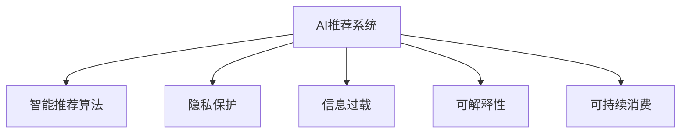

                 

# 欲望可持续性评估员：AI时代的消费伦理指南编撰者

## 1. 背景介绍

### 1.1 问题由来

随着人工智能(AI)技术的发展，越来越多的消费场景开始采用智能推荐系统，通过算法预测用户的购物需求，并推送个性化商品。这些系统在提升用户购物体验、优化商家库存管理、促进消费增长等方面发挥了重要作用。然而，这些智能推荐系统也引发了一系列伦理问题，如信息过载、消费冲动、隐私侵犯等，对消费者和社会产生潜在的负面影响。

### 1.2 问题核心关键点

如何设计既符合商业利益，又符合社会伦理的AI消费推荐系统，成为当下亟需解决的问题。消费者在享受智能推荐带来的便利的同时，也需要保护自己的隐私和权益，避免因过度消费而产生不良后果。

### 1.3 问题研究意义

研究智能消费推荐系统的伦理问题，有助于构建更加公平、透明、负责任的AI消费生态，促进人工智能技术的健康发展。同时，也为消费者提供了一个自我保护的工具，帮助他们在享受技术便利的同时，保护自己的合法权益，实现可持续的消费。

## 2. 核心概念与联系

### 2.1 核心概念概述

为更好地理解基于AI的智能推荐系统与消费伦理之间的关系，本节将介绍几个密切相关的核心概念：

- **人工智能(AI)推荐系统**：基于机器学习或深度学习模型，通过分析用户行为数据和商品特征，预测用户偏好并推荐商品的系统。
- **智能推荐算法**：包括协同过滤、内容推荐、基于深度学习的推荐等，是构建AI推荐系统的核心技术。
- **隐私保护**：在数据收集和处理过程中，保护用户隐私不被侵犯，确保数据的合法性和安全性。
- **信息过载**：用户在面对大量推荐信息时，可能因信息过载而无法作出理智判断，产生冲动消费。
- **可解释性**：AI系统的决策过程应具有可解释性，让用户明白推荐逻辑和依据，增强用户信任。
- **可持续消费**：消费者在满足自身需求的同时，保护环境和社会资源，实现长期可持续的消费行为。

这些概念之间的逻辑关系可以通过以下Mermaid流程图来展示：



这个流程图展示了大语言模型的核心概念及其之间的关系：

1. AI推荐系统通过智能推荐算法分析用户数据，生成个性化推荐。
2. 隐私保护和信息过载是对推荐系统的制约和约束，确保用户权益不受侵害，避免过度消费。
3. 可解释性要求推荐系统具有透明性，帮助用户理解推荐逻辑。
4. 可持续消费是推荐系统追求的目标，通过合理引导用户需求，推动绿色消费。

这些概念共同构成了AI消费推荐系统的伦理框架，帮助开发者在设计和优化系统时，综合考虑技术、经济、社会、环境等多方面的因素。

## 3. 核心算法原理 & 具体操作步骤
### 3.1 算法原理概述

基于AI的智能推荐系统主要利用用户的购买历史、浏览行为、评分反馈等数据，通过机器学习或深度学习模型预测用户可能感兴趣的商品，并进行推荐。推荐算法的核心目标是最大化用户的满意度（如点击率、购买率等），同时提升商家利益（如销售额、用户留存率等）。

推荐的流程通常包括以下几个步骤：

1. **数据收集**：从用户行为日志、电商交易平台、社交网络等渠道收集用户数据和商品数据。
2. **数据预处理**：清洗、归一化、特征工程等，将原始数据转化为可用于模型训练的格式。
3. **模型训练**：使用推荐算法模型（如协同过滤、内容推荐、深度学习等），训练推荐模型。
4. **推荐生成**：输入用户画像和商品特征，通过模型预测推荐结果，并推送给用户。

### 3.2 算法步骤详解

以深度学习为基础的推荐系统为例，其基本步骤包括：

1. **用户画像生成**：将用户的历史行为数据（如浏览记录、购买记录等）转化为用户画像特征。
2. **商品嵌入表示**：使用深度学习模型（如Word2Vec、BERT等），将商品描述、标签、类别等信息转化为高维向量表示。
3. **模型训练**：使用用户画像和商品向量，训练推荐模型（如DNN、CNN等）。
4. **推荐生成**：根据用户画像和商品向量，生成推荐结果，并按相关性排序。

### 3.3 算法优缺点

基于AI的智能推荐系统具有以下优点：

1. **个性化推荐**：通过分析用户行为数据，生成个性化推荐，提升用户体验和满意度。
2. **规模化应用**：推荐系统可以处理海量数据，实现大规模个性化推荐，提高效率。
3. **动态调整**：推荐系统可以实时更新，动态调整推荐策略，应对市场变化。

同时，该系统也存在以下缺点：

1. **隐私问题**：数据收集和处理过程中，可能侵犯用户隐私，引发伦理争议。
2. **信息过载**：大量推荐信息可能导致用户决策困难，产生冲动消费。
3. **推荐偏差**：模型可能存在偏见，导致某些类别的商品推荐不足或过度推荐。
4. **可解释性差**：推荐系统的决策过程往往不透明，用户难以理解推荐逻辑。

### 3.4 算法应用领域

基于AI的智能推荐系统已经在电商、社交、视频等多个领域得到了广泛应用，成为用户获取商品信息的重要途径。例如：

- 电商平台通过推荐系统，为每个用户定制个性化商品，提高转化率和销售额。
- 社交媒体平台通过推荐系统，为每个用户推荐可能感兴趣的内容，提升用户粘性。
- 视频平台通过推荐系统，为用户推荐相关视频内容，提高观看量和互动率。

除了这些主流应用外，推荐系统还在金融、旅游、健康等诸多领域得到应用，为消费者提供了更加个性化、精准的推荐服务。

## 4. 数学模型和公式 & 详细讲解 & 举例说明
### 4.1 数学模型构建

基于AI的智能推荐系统一般使用协同过滤、内容推荐、深度学习等方法进行建模。以协同过滤为例，其数学模型为：

$$
\hat{y}_{ui} = \hat{\theta}_i^T \phi(u)
$$

其中，$y_{ui}$表示用户$u$对商品$i$的评分或购买概率，$\hat{\theta}_i$为商品$i$的向量表示，$\phi(u)$为用户$u$的特征向量表示，$\hat{\theta}_i$和$\phi(u)$通过模型训练得到。

### 4.2 公式推导过程

协同过滤模型的训练过程包括：

1. **数据准备**：收集用户行为数据和商品特征数据，生成用户-商品评分矩阵。
2. **特征表示**：将用户行为和商品特征转化为向量表示，使用SVD等降维方法，生成用户和商品的低维表示。
3. **模型训练**：使用矩阵分解方法（如SVD），训练用户和商品向量，得到$\hat{\theta}_i$和$\phi(u)$。
4. **推荐生成**：输入用户画像$\phi(u)$，通过$\hat{\theta}_i^T \phi(u)$计算预测评分$y_{ui}$，排序推荐结果。

### 4.3 案例分析与讲解

以电影推荐为例，协同过滤模型训练过程如下：

1. **数据准备**：收集用户观看电影的历史记录和电影评分数据，生成用户-电影评分矩阵。
2. **特征表示**：使用SVD方法，将用户和电影表示为低维向量。
3. **模型训练**：通过矩阵分解，训练用户和电影向量，得到$\hat{\theta}_i$和$\phi(u)$。
4. **推荐生成**：输入用户画像$\phi(u)$，通过$\hat{\theta}_i^T \phi(u)$计算预测评分$y_{ui}$，按相关性排序推荐电影。

## 5. 项目实践：代码实例和详细解释说明
### 5.1 开发环境搭建

在进行推荐系统开发前，我们需要准备好开发环境。以下是使用Python进行推荐系统开发的常见环境配置流程：

1. 安装Anaconda：从官网下载并安装Anaconda，用于创建独立的Python环境。

2. 创建并激活虚拟环境：
```bash
conda create -n recommend-env python=3.8 
conda activate recommend-env
```

3. 安装推荐系统相关的库：
```bash
pip install numpy pandas scikit-learn scipy seaborn matplotlib pytorch torchvision transformers
```

4. 安装深度学习框架：
```bash
pip install tensorflow
```

5. 安装推荐系统相关的工具包：
```bash
pip install lightfm pythannf
```

完成上述步骤后，即可在`recommend-env`环境中开始推荐系统开发。

### 5.2 源代码详细实现

下面我们以协同过滤推荐系统为例，给出使用Python和TensorFlow进行推荐系统开发的代码实现。

```python
import numpy as np
import pandas as pd
from scipy.sparse import csr_matrix
import tensorflow as tf
import lightfm

# 数据准备
df = pd.read_csv('data/user_item.csv', index_col=['user_id', 'item_id'])
train_df = df.sample(frac=0.8, random_state=42)

# 构建用户-商品评分矩阵
train_matrix = train_df.groupby(['user_id', 'item_id'])['rating'].mean().unstack().reset_index().dropna()

# 特征表示
train_item = pd.DataFrame(train_matrix.sum(axis=0), index='item_id').rename(columns={'main': 'item ratings'})
train_user = pd.DataFrame(train_matrix.sum(axis=1), columns='user ratings').rename(columns={'user ratings': 'user ratings'})
train_item['item ratings'] = train_item['item ratings'] + 1
train_user['user ratings'] = train_user['user ratings'] + 1

# 模型训练
mf = lightfm.LightFM()
mf.fit(train_matrix, epochs=10)

# 推荐生成
test_matrix = pd.read_csv('data/test_user_item.csv', index_col=['user_id', 'item_id'])
test_matrix = test_matrix.groupby(['user_id', 'item_id'])['rating'].mean().unstack().reset_index().dropna()
test_matrix = pd.concat([train_matrix, test_matrix], axis=0)

test_user = pd.DataFrame(test_matrix.sum(axis=1), columns='user ratings').rename(columns={'user ratings': 'user ratings'})
test_item = pd.DataFrame(test_matrix.sum(axis=0), index='item_id').rename(columns={'main': 'item ratings'})
test_item['item ratings'] = test_item['item ratings'] + 1

user = 'user_id_123'
item = 'item_id_456'

# 计算预测评分
user_rating = mf.predict(user, item)
predicted_item = mf.get_top_k(user, k=10)

print(user_rating, predicted_item)
```

### 5.3 代码解读与分析

让我们再详细解读一下关键代码的实现细节：

**数据准备**：
- 使用Pandas读取用户和商品评分数据，生成用户-商品评分矩阵。
- 使用`groupby`和`unstack`方法将评分矩阵转换为用户-商品评分矩阵，并计算均值。
- 将评分矩阵转换为稀疏矩阵，以便进行深度学习处理。

**特征表示**：
- 计算每个用户的评分总和和每个商品的评分总和，生成用户和商品向量。
- 对用户和商品向量进行归一化处理，确保数值范围合理。

**模型训练**：
- 使用LightFM库训练协同过滤模型，设置训练轮数为10轮。
- 使用训练集进行模型训练。

**推荐生成**：
- 对测试集数据进行特征表示。
- 使用`predict`方法计算用户对特定商品的预测评分。
- 使用`get_top_k`方法获取推荐前10个商品。

通过以上代码实现，我们可以看到使用TensorFlow和LightFM构建协同过滤推荐系统的基本流程。在实际应用中，还需进一步优化模型参数、调整特征工程策略等，以提升推荐效果。

## 6. 实际应用场景
### 6.1 电商推荐

基于AI的智能推荐系统在电商领域得到了广泛应用，电商企业通过推荐系统为每个用户定制个性化商品，提高用户满意度和销售额。例如：

- 淘宝、京东等电商平台通过推荐系统，为用户推荐可能感兴趣的商品，提高用户点击率和购买率。
- 亚马逊通过推荐系统，为用户推荐相关商品，提升用户粘性和复购率。

### 6.2 视频推荐

视频平台通过推荐系统，为用户推荐可能感兴趣的视频内容，提高观看量和互动率。例如：

- 腾讯视频、爱奇艺等平台通过推荐系统，为用户推荐相关视频，提升用户观看时间和互动率。
- YouTube通过推荐系统，为用户推荐相关视频，提高平台用户粘性和观看时长。

### 6.3 社交推荐

社交媒体平台通过推荐系统，为用户推荐可能感兴趣的内容，提升用户粘性。例如：

- 微博、抖音等社交平台通过推荐系统，为用户推荐相关内容，提高用户粘性和互动率。
- Facebook通过推荐系统，为用户推荐相关新闻和内容，提升用户停留时间和互动率。

### 6.4 未来应用展望

随着AI技术的不断进步，基于AI的推荐系统将在更多领域得到应用，为消费者提供更加个性化、精准的推荐服务。未来，推荐系统将在以下几个方向得到发展：

1. **多模态推荐**：将文本、图像、音频等多模态信息进行融合，提升推荐效果。
2. **个性化推荐算法**：引入更多个性化推荐算法，如基于模型的推荐、强化学习推荐等，提升推荐精度。
3. **实时推荐系统**：实现实时推荐，及时响应用户需求，提升用户体验。
4. **跨平台推荐**：实现跨平台、跨设备推荐，提升用户粘性。
5. **推荐透明度**：提升推荐系统的透明度和可解释性，增强用户信任。
6. **推荐伦理**：设计推荐系统的伦理模型，保护用户隐私和权益，避免信息过载和消费冲动。

## 7. 工具和资源推荐
### 7.1 学习资源推荐

为了帮助开发者系统掌握AI推荐系统的伦理问题，这里推荐一些优质的学习资源：

1. 《推荐系统实战》系列博文：由推荐系统专家撰写，深入浅出地介绍了推荐系统原理、算法和实践。

2. 《深度学习与推荐系统》课程：斯坦福大学开设的推荐系统明星课程，有Lecture视频和配套作业，带你入门推荐系统领域的基本概念和经典算法。

3. 《推荐系统理论与实践》书籍：全面介绍了推荐系统的理论基础和应用实践，包括推荐系统中的伦理问题。

4. 《Python推荐系统开发》书籍：介绍使用Python进行推荐系统开发的实战案例，涵盖协同过滤、基于深度学习的推荐等多种方法。

5. Kaggle推荐系统竞赛：参与Kaggle推荐系统竞赛，练习并实践推荐系统的开发和优化。

通过对这些资源的学习实践，相信你一定能够快速掌握AI推荐系统的核心技术和伦理问题，并用于解决实际的推荐系统问题。

### 7.2 开发工具推荐

高效的开发离不开优秀的工具支持。以下是几款用于推荐系统开发的常用工具：

1. Python：广泛使用的编程语言，适合快速迭代研究。

2. TensorFlow：由Google主导开发的深度学习框架，生产部署方便，适合大规模工程应用。

3. PyTorch：基于Python的深度学习框架，灵活度高，适合快速迭代研究。

4. LightFM：高效的多目标优化推荐系统库，支持多种推荐算法。

5. Scikit-learn：Python的机器学习库，提供丰富的数据处理和模型训练工具。

6. Jupyter Notebook：交互式编程环境，方便开发者进行代码测试和调试。

合理利用这些工具，可以显著提升推荐系统的开发效率，加快创新迭代的步伐。

### 7.3 相关论文推荐

推荐系统的发展源于学界的持续研究。以下是几篇奠基性的相关论文，推荐阅读：

1. "Collaborative Filtering for Implicit Feedback Datasets"：推荐系统的经典协同过滤算法，介绍协同过滤模型的基本原理和实现方法。

2. "Item-based Collaborative Filtering Recommendation Algorithms"：介绍基于物品的协同过滤算法，是协同过滤算法的代表。

3. "A Survey on Deep Learning for Recommendation Systems"：综述深度学习在推荐系统中的应用，介绍多种深度学习推荐算法。

4. "Personalized Ranking with Implicit Feedback"：介绍基于隐式反馈的个性化推荐方法，将推荐系统应用于社交媒体等场景。

5. "Fast Matrix Factorization Techniques for Recommender Systems"：介绍矩阵分解方法在推荐系统中的应用，提升推荐效率。

这些论文代表了这个领域的经典研究成果，通过学习这些前沿成果，可以帮助研究者把握推荐系统的前进方向，激发更多的创新灵感。

## 8. 总结：未来发展趋势与挑战

### 8.1 总结

本文对基于AI的智能推荐系统的伦理问题进行了全面系统的介绍。首先阐述了推荐系统在提升用户体验和商家利益方面的重要作用，明确了推荐系统在数据收集、特征处理、模型训练、推荐生成等各个环节中可能面临的伦理问题。其次，从原理到实践，详细讲解了推荐系统的核心算法和技术，给出了推荐系统开发的完整代码实例。同时，本文还广泛探讨了推荐系统在电商、社交、视频等多个领域的应用前景，展示了推荐系统的巨大潜力。此外，本文精选了推荐系统的各类学习资源，力求为读者提供全方位的技术指引。

通过本文的系统梳理，可以看到，基于AI的推荐系统在提高用户满意度、提升商家收益等方面发挥了重要作用，但也引发了诸多伦理问题。如何在技术创新和伦理约束之间找到平衡，是未来推荐系统发展的关键问题。

### 8.2 未来发展趋势

展望未来，推荐系统的伦理问题将呈现以下几个发展趋势：

1. **多模态推荐**：将文本、图像、音频等多模态信息进行融合，提升推荐效果，同时保护用户隐私。
2. **个性化推荐算法**：引入更多个性化推荐算法，如基于模型的推荐、强化学习推荐等，提升推荐精度。
3. **实时推荐系统**：实现实时推荐，及时响应用户需求，提升用户体验。
4. **跨平台推荐**：实现跨平台、跨设备推荐，提升用户粘性。
5. **推荐透明度**：提升推荐系统的透明度和可解释性，增强用户信任。
6. **推荐伦理**：设计推荐系统的伦理模型，保护用户隐私和权益，避免信息过载和消费冲动。

以上趋势凸显了推荐系统在提升用户体验和商家收益的同时，也需要考虑伦理问题，为消费者提供更加公平、透明、负责任的推荐服务。这些方向的探索发展，必将进一步提升推荐系统的性能和应用范围，为消费者和社会带来更多的福利。

### 8.3 面临的挑战

尽管推荐系统在提升用户体验和商家收益方面发挥了重要作用，但在迈向更加智能化、普适化应用的过程中，它仍面临着诸多挑战：

1. **隐私问题**：推荐系统在数据收集和处理过程中，可能侵犯用户隐私，引发伦理争议。
2. **信息过载**：大量推荐信息可能导致用户决策困难，产生冲动消费。
3. **推荐偏差**：模型可能存在偏见，导致某些类别的商品推荐不足或过度推荐。
4. **可解释性差**：推荐系统的决策过程往往不透明，用户难以理解推荐逻辑。
5. **实时性不足**：推荐系统需要快速响应用户需求，实现实时推荐，对计算资源和算法设计提出较高要求。
6. **跨平台兼容性**：推荐系统需要在不同平台和设备之间实现跨平台推荐，对数据格式和算法实现提出更高要求。

正视推荐系统面临的这些挑战，积极应对并寻求突破，将是对推荐系统健康发展的重要保障。相信随着学界和产业界的共同努力，这些挑战终将一一被克服，推荐系统必将在构建公平、透明、负责任的消费生态中发挥更大的作用。

### 8.4 研究展望

面对推荐系统面临的种种挑战，未来的研究需要在以下几个方面寻求新的突破：

1. **隐私保护技术**：开发新的隐私保护技术，如差分隐私、联邦学习等，确保用户隐私在推荐系统中得到保护。
2. **模型透明性**：提升推荐系统的透明度和可解释性，使用户能够理解推荐逻辑和依据。
3. **实时推荐算法**：开发新的实时推荐算法，实现快速响应用户需求。
4. **多模态推荐方法**：探索将文本、图像、音频等多模态信息进行融合的方法，提升推荐效果。
5. **跨平台推荐技术**：研究跨平台推荐技术，实现不同平台和设备之间的无缝推荐。
6. **伦理模型设计**：设计推荐系统的伦理模型，保护用户隐私和权益，避免信息过载和消费冲动。

这些研究方向的探索，必将引领推荐系统迈向更高的台阶，为构建公平、透明、负责任的消费生态提供新的技术支持。只有勇于创新、敢于突破，才能不断拓展推荐系统的边界，让智能技术更好地服务于消费者和社会。

## 9. 附录：常见问题与解答

**Q1：AI推荐系统是否适用于所有电商场景？**

A: AI推荐系统在大多数电商场景中都能取得不错的效果，特别是对于大规模商品和个性化需求强的场景。但对于一些特殊电商场景，如二手市场、垂直领域等，AI推荐系统的推荐效果可能有限。此时需要根据具体场景进行优化调整，如引入专家知识库、调整推荐算法等。

**Q2：AI推荐系统是否会侵犯用户隐私？**

A: AI推荐系统在数据收集和处理过程中，可能会收集用户的个人信息，如浏览记录、购买记录等。为保护用户隐私，推荐系统需要采取多种措施，如匿名化处理、差分隐私、联邦学习等，确保用户数据的安全和隐私。

**Q3：AI推荐系统是否会导致信息过载？**

A: AI推荐系统在处理大量数据时，可能导致用户面临信息过载的挑战。为缓解信息过载，推荐系统需要设计合理的推荐策略，如限制推荐数量、引入阈值过滤等。

**Q4：AI推荐系统是否会存在推荐偏差？**

A: AI推荐系统在训练过程中，可能会存在推荐偏差，导致某些类别的商品推荐不足或过度推荐。为解决推荐偏差问题，推荐系统需要引入更多的特征工程策略，如调整特征权重、引入先验知识等。

**Q5：AI推荐系统是否可解释性强？**

A: 当前AI推荐系统的决策过程往往不透明，难以解释推荐逻辑。为提高可解释性，推荐系统需要设计更加可解释的模型和算法，如基于规则的推荐、可解释的深度学习等。

这些问题的解答，为开发者在设计和优化AI推荐系统时，提供了更加全面的考虑和优化方向。相信随着技术的不断进步，AI推荐系统将在未来更好地服务于消费者，实现公平、透明、负责任的推荐。

---

作者：禅与计算机程序设计艺术 / Zen and the Art of Computer Programming

