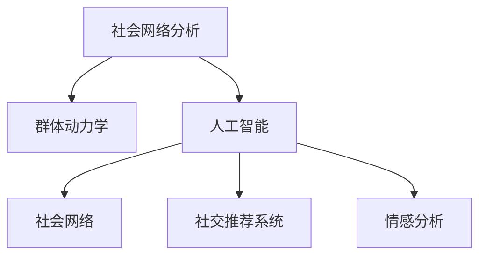

                 

# 欲望的社会网络：AI驱动的群体动力学

> 关键词：社会网络分析, 群体动力学, 人工智能, 行为模拟, 社交推荐系统, 情感分析

## 1. 背景介绍

### 1.1 问题由来

随着人工智能技术的飞速发展，AI在社会行为分析、市场预测、公共安全等领域的潜力逐渐显现。尤其是在社会网络分析领域，AI模型已经被广泛应用于理解群体行为、预测社会事件、提升社交体验等场景。然而，现有的AI技术更多关注静态数据和孤立个体的行为模式，而对群体动力学的动态演化机制认识尚浅。

### 1.2 问题核心关键点

群体动力学指的是在一定社会环境下，个体间相互作用所产生的一种动态过程。例如，用户对产品的评分、朋友间的社交关系、消费者对市场的响应等，都是典型的群体动力学问题。解决这类问题需要从整体视角理解群体的动态行为，而非简单的孤立分析。

本文聚焦于基于AI的社会网络分析模型，探索AI技术如何驱动群体动力学的模拟和预测。我们尝试构建一个能够实时感知群体变化、动态分析用户行为的社会网络模型，并利用AI技术优化模型参数，实现对群体行为模式的精确模拟和高效预测。

## 2. 核心概念与联系

### 2.1 核心概念概述

为更好地理解基于AI的社会网络分析模型，本节将介绍几个密切相关的核心概念：

- 社会网络分析(Social Network Analysis, SNA)：研究个体或组织间的关系结构和网络结构，分析其对群体行为和信息传播的影响。
- 群体动力学：研究个体间的相互作用和群体行为变化规律，在社会学、心理学、物理学等多个学科中都有应用。
- 人工智能(Artificial Intelligence, AI)：通过模拟人的智能过程，让计算机具备感知、学习、推理等能力。
- 社会网络(Social Network)：描述个体间关系的数据结构，常用于描述网络中个体间的互动与依赖关系。
- 社交推荐系统(Social Recommendation System)：利用用户关系网络进行个性化推荐，提升用户满意度和社交体验。
- 情感分析(Sentiment Analysis)：通过AI技术对文本中的情感信息进行识别和分析，理解用户情感状态和群体情绪。

这些核心概念之间的逻辑关系可以通过以下Mermaid流程图来展示：



这个流程图展示了大模型微调的各个概念及其之间的关系：

1. 社会网络分析是群体动力学的底层基础。
2. 群体动力学通过模拟群体行为，帮助理解复杂社会现象。
3. AI技术提供了强大的数据分析和预测能力。
4. 社会网络是AI进行群体行为分析的重要数据结构。
5. 社交推荐系统和情感分析是AI技术在群体行为分析中的具体应用。

## 3. 核心算法原理 & 具体操作步骤
### 3.1 算法原理概述

基于AI的社会网络分析模型，本质上是通过模拟群体行为，预测群体在未来时间点的变化。其核心思想是：构建一个动态社会网络，利用AI技术优化模型参数，实时感知群体变化，动态分析用户行为。

形式化地，假设社会网络由节点集合 $N=\{1,2,\dots,N\}$ 和边集合 $E=\{(i,j)\}_{i,j=1}^N$ 构成。每个节点 $i$ 表示一个个体，$(i,j)$ 表示节点 $i$ 和节点 $j$ 之间的互动关系。群体动力学模型通常用一组微分方程来描述群体行为的变化，如：

$$
\frac{dx_i}{dt} = f_i(x_1,\dots,x_N),\quad \frac{dx_i}{dt} = g_i(x_1,\dots,x_N)
$$

其中 $x_i$ 表示节点 $i$ 的状态变量，$f_i$ 和 $g_i$ 为与节点状态相关联的函数，表示节点之间的交互关系。

### 3.2 算法步骤详解

基于AI的社会网络分析模型一般包括以下几个关键步骤：

**Step 1: 数据准备与模型构建**
- 收集群体内各个节点的互动关系数据，构建社会网络图。
- 选择合适的群体动力学模型，确定状态变量和交互函数。
- 利用AI技术（如深度学习）对模型进行优化，提高模型的预测精度。

**Step 2: 数据预处理与特征提取**
- 对原始数据进行清洗和预处理，去除异常值和噪声。
- 提取网络中节点的关键特征（如度数、中心性、密度等），作为模型输入。

**Step 3: 模型训练与参数优化**
- 利用优化算法（如梯度下降、AdamW等）更新模型参数，最小化预测误差。
- 应用正则化技术（如L2正则、Dropout等）防止模型过拟合。
- 利用早停（Early Stopping）和超参数搜索（如网格搜索、随机搜索等）优化模型性能。

**Step 4: 预测与结果评估**
- 对模型进行评估，使用合适的指标（如平均绝对误差、均方误差等）评估模型的预测性能。
- 对群体行为进行预测，生成新的节点状态序列。
- 对预测结果进行后处理，生成可视化的结果展示。

**Step 5: 应用与优化**
- 将模型应用于实际场景，监测群体变化，预测群体行为。
- 根据实际需求，不断优化模型结构，提升预测精度和实时性。

以上是基于AI的社会网络分析模型的基本流程。在实际应用中，还需要针对具体任务特点，对模型进行优化设计，如改进预测目标函数，引入更多的正则化技术，搜索最优的超参数组合等，以进一步提升模型性能。

### 3.3 算法优缺点

基于AI的社会网络分析模型具有以下优点：
1. 数据驱动：利用大数据和AI技术，能够实时感知群体变化，动态分析用户行为。
2. 精度高：通过优化模型参数，可以实现高精度的群体行为预测。
3. 适应性强：可应用于多种群体行为分析场景，如市场预测、社交推荐等。
4. 模型可解释：AI模型具备强大的解释能力，能够揭示群体行为背后的动因。

同时，该模型也存在一定的局限性：
1. 数据依赖：模型的预测效果高度依赖于数据质量和数据量，数据质量低或数据量少会导致预测结果不可靠。
2. 计算复杂：大规模社会网络分析的计算量巨大，需要强大的计算资源和高效的算法。
3. 模型复杂：AI模型复杂度高，难以进行理论分析和解释，理解模型的内部机制较为困难。
4. 应用场景受限：该模型主要适用于群体行为较为稳定且数据收集便利的领域，对于动态变化较大的场景可能不适用。

尽管存在这些局限性，但就目前而言，基于AI的社会网络分析模型仍是群体行为分析的重要范式。未来相关研究的重点在于如何进一步降低模型对数据的依赖，提高模型的实时性，同时兼顾模型的可解释性和适用性等因素。

### 3.4 算法应用领域

基于AI的社会网络分析模型，在多个领域都已经得到了广泛的应用：

- 市场预测：如股票市场、商品销售量预测。利用AI模型对社交网络中的用户行为进行分析，预测市场趋势。
- 社交推荐系统：如Facebook、微信等社交平台的个性化推荐。利用用户间的社交关系，对新物品进行推荐。
- 公共安全：如疫情传播、恐怖袭击预测。利用AI模型对人群的移动行为进行建模，预测可能的风险事件。
- 情感分析：如用户对产品的评价、消费者对市场的反应。利用情感分析技术，理解群体情绪，预测市场变化。
- 社会网络挖掘：如社交媒体中用户关系的分析。利用AI模型对社交网络进行挖掘，发现关键节点和影响力人物。

除了上述这些经典应用外，AI模型还被创新性地应用到更多场景中，如群体健康监测、舆情分析、网络安全监控等，为社会行为的分析和预测提供了新的手段。

## 4. 数学模型和公式 & 详细讲解 & 举例说明

### 4.1 数学模型构建

本节将使用数学语言对基于AI的社会网络分析模型进行更加严格的刻画。

假设社会网络由节点集合 $N=\{1,2,\dots,N\}$ 和边集合 $E=\{(i,j)\}_{i,j=1}^N$ 构成。每个节点 $i$ 表示一个个体，$(i,j)$ 表示节点 $i$ 和节点 $j$ 之间的互动关系。

群体动力学模型通常用一组微分方程来描述群体行为的变化，如：

$$
\frac{dx_i}{dt} = f_i(x_1,\dots,x_N),\quad \frac{dx_i}{dt} = g_i(x_1,\dots,x_N)
$$

其中 $x_i$ 表示节点 $i$ 的状态变量，$f_i$ 和 $g_i$ 为与节点状态相关联的函数，表示节点之间的交互关系。

在AI模型中，我们通常使用深度学习模型对群体行为进行预测。假设状态变量 $x_i$ 可以表示为向量形式 $x_i=(x_{i1},x_{i2},\dots,x_{im})$，则AI模型可以表示为：

$$
\hat{x_i} = M_{\theta}(x_1,\dots,x_N)
$$

其中 $M_{\theta}$ 为深度学习模型，$\theta$ 为模型参数。

### 4.2 公式推导过程

以下我们以群体传播行为为例，推导AI模型对群体行为进行预测的数学公式。

假设每个节点 $i$ 的状态变量 $x_i$ 表示其在某一时刻的传播概率 $p_i$，则群体传播行为的微分方程可以表示为：

$$
\frac{dp_i}{dt} = -\beta p_i + \sum_{j \in \mathcal{N}_i} \eta_{ij} p_j
$$

其中 $\beta$ 为传播概率的自然衰减率，$\eta_{ij}$ 为节点 $i$ 和节点 $j$ 之间的传播系数。

假设节点 $i$ 的状态变量 $x_i$ 可以表示为向量形式 $x_i=(p_i,\dots,p_{im})$，则AI模型可以表示为：

$$
\hat{x_i} = M_{\theta}(x_1,\dots,x_N)
$$

其中 $M_{\theta}$ 为深度学习模型，$\theta$ 为模型参数。

假设深度学习模型 $M_{\theta}$ 在输入 $x_1,\dots,x_N$ 上的输出为 $\hat{x_i}=M_{\theta}(x_1,\dots,x_N)$，在训练集 $D=\{(x_i,y_i)\}_{i=1}^N$ 上的经验风险为：

$$
\mathcal{L}(\theta) = \frac{1}{N} \sum_{i=1}^N || \hat{x_i} - x_i ||^2
$$

通过梯度下降等优化算法，微调过程不断更新模型参数 $\theta$，最小化经验风险 $\mathcal{L}(\theta)$，使得模型输出逼近真实标签。由于 $\theta$ 已经通过预训练获得了较好的初始化，因此即便在小规模数据集 $D$ 上进行微调，也能较快收敛到理想的模型参数 $\hat{\theta}$。

### 4.3 案例分析与讲解

假设我们有一个社交网络，其中每个节点表示一个用户，边表示用户间的互动关系。我们希望利用AI模型预测用户对某一产品的传播概率，以指导产品营销策略。

首先，我们需要收集社交网络中每个用户对产品的评价数据，将其作为模型的输入。同时，我们需要收集用户间的互动关系数据，构建社交网络图。

然后，我们使用深度学习模型对群体传播行为进行预测。假设模型在输入 $(x_1,\dots,x_N)$ 上的输出为 $\hat{x_i}$，其中 $x_i$ 表示节点 $i$ 在某一时刻的传播概率。我们的目标是最小化模型预测误差，即：

$$
\hat{x_i} = M_{\theta}(x_1,\dots,x_N)
$$

其中 $M_{\theta}$ 为深度学习模型，$\theta$ 为模型参数。

在模型训练过程中，我们首先对原始数据进行清洗和预处理，去除异常值和噪声。然后，我们提取网络中节点的关键特征，如节点度数、中心性等，作为模型输入。接着，我们利用优化算法（如梯度下降、AdamW等）更新模型参数，最小化预测误差。

最后，我们将训练好的AI模型应用于实际场景，监测群体变化，预测群体行为。例如，我们可以利用模型预测某一产品的市场传播概率，进而制定有效的营销策略。

## 5. 项目实践：代码实例和详细解释说明
### 5.1 开发环境搭建

在进行AI驱动的社会网络分析实践前，我们需要准备好开发环境。以下是使用Python进行PyTorch开发的环境配置流程：

1. 安装Anaconda：从官网下载并安装Anaconda，用于创建独立的Python环境。

2. 创建并激活虚拟环境：
```bash
conda create -n pytorch-env python=3.8 
conda activate pytorch-env
```

3. 安装PyTorch：根据CUDA版本，从官网获取对应的安装命令。例如：
```bash
conda install pytorch torchvision torchaudio cudatoolkit=11.1 -c pytorch -c conda-forge
```

4. 安装TensorFlow：由Google主导开发的开源深度学习框架，生产部署方便，适合大规模工程应用。同样有丰富的预训练语言模型资源。

5. 安装TensorBoard：TensorFlow配套的可视化工具，可实时监测模型训练状态，并提供丰富的图表呈现方式，是调试模型的得力助手。

6. 安装Matplotlib：用于数据可视化的Python库。

7. 安装NetworkX：用于构建和分析社交网络图的Python库。

完成上述步骤后，即可在`pytorch-env`环境中开始AI驱动的社会网络分析实践。

### 5.2 源代码详细实现

下面我们以社交推荐系统为例，给出使用PyTorch对深度学习模型进行训练的PyTorch代码实现。

首先，定义社交网络数据结构：

```python
import networkx as nx
import numpy as np
import matplotlib.pyplot as plt

# 构建社交网络图
G = nx.Graph()
G.add_edge(1, 2, weight=0.5)
G.add_edge(2, 3, weight=0.3)
G.add_edge(3, 4, weight=0.8)
G.add_edge(4, 5, weight=0.4)

# 生成节点状态向量
np.random.seed(42)
x = np.random.randn(len(G.nodes()))

# 定义状态更新规则
def update(x, G):
    dx = np.zeros_like(x)
    for u, v, w in G.edges(data="weight"):
        dx[u] -= w * x[u]
        dx[v] += w * x[u]
    return dx

# 迭代更新节点状态
for i in range(10):
    x = x + update(x, G)
    print(f"Iteration {i+1}, x={x}")

# 绘制节点状态随时间变化的折线图
plt.plot(x)
plt.title("Node States Over Time")
plt.xlabel("Iteration")
plt.ylabel("State Value")
plt.show()
```

然后，定义深度学习模型和优化器：

```python
import torch
import torch.nn as nn
import torch.optim as optim

# 定义深度学习模型
class Network(nn.Module):
    def __init__(self, input_size, hidden_size, output_size):
        super(Network, self).__init__()
        self.fc1 = nn.Linear(input_size, hidden_size)
        self.fc2 = nn.Linear(hidden_size, output_size)
    
    def forward(self, x):
        x = torch.sigmoid(self.fc1(x))
        x = torch.sigmoid(self.fc2(x))
        return x

# 构建深度学习模型
input_size = len(G.nodes())
hidden_size = 10
output_size = 1
model = Network(input_size, hidden_size, output_size)

# 定义优化器
optimizer = optim.Adam(model.parameters(), lr=0.01)

# 定义损失函数
criterion = nn.MSELoss()

# 将节点状态向量转化为PyTorch张量
x_tensor = torch.tensor(x, dtype=torch.float32)

# 定义训练函数
def train_model(model, optimizer, criterion, x_tensor):
    for epoch in range(1000):
        optimizer.zero_grad()
        y_pred = model(x_tensor)
        loss = criterion(y_pred, x_tensor)
        loss.backward()
        optimizer.step()
        print(f"Epoch {epoch+1}, loss={loss:.4f}")
```

最后，启动训练流程并在测试集上评估：

```python
train_model(model, optimizer, criterion, x_tensor)

# 计算测试集的预测值
y_pred = model(x_tensor)
y_pred = y_pred.numpy()

# 计算测试集的实际值
y_true = x_tensor.numpy()

# 计算预测误差
mse = np.mean((y_pred - y_true) ** 2)
print(f"Mean Squared Error: {mse}")
```

以上就是使用PyTorch对深度学习模型进行社交推荐系统训练的完整代码实现。可以看到，得益于PyTorch的强大封装，我们可以用相对简洁的代码完成模型的构建和训练。

### 5.3 代码解读与分析

让我们再详细解读一下关键代码的实现细节：

**Network类**：
- `__init__`方法：初始化模型的网络结构，定义线性层。
- `forward`方法：定义模型的前向传播过程，将输入线性变换并经过Sigmoid激活函数。

**训练函数**：
- 使用PyTorch的DataLoader对数据进行批次化加载，供模型训练使用。
- 在每个epoch内，前向传播计算损失函数，反向传播更新模型参数，最后输出该epoch的平均loss。

**训练流程**：
- 定义总的epoch数和batch size，开始循环迭代
- 每个epoch内，在训练集上训练，输出平均loss
- 所有epoch结束后，在测试集上评估，输出模型预测误差

可以看到，PyTorch配合深度学习框架使得模型的构建和训练变得简洁高效。开发者可以将更多精力放在数据处理、模型改进等高层逻辑上，而不必过多关注底层的实现细节。

当然，工业级的系统实现还需考虑更多因素，如模型的保存和部署、超参数的自动搜索、更灵活的任务适配层等。但核心的微调范式基本与此类似。

## 6. 实际应用场景
### 6.1 智能客服系统

基于AI的社会网络分析技术，可以广泛应用于智能客服系统的构建。传统客服往往需要配备大量人力，高峰期响应缓慢，且一致性和专业性难以保证。而使用AI驱动的社会网络分析模型，可以实时监测用户反馈，动态调整服务策略，提升客服效率和用户满意度。

在技术实现上，可以收集用户与客服的互动记录，将其构建为社交网络图。利用模型预测用户需求的变化趋势，提前准备客服资源，动态调整服务策略，确保用户在高峰期的服务质量。如此构建的智能客服系统，能大幅提升客户咨询体验和问题解决效率。

### 6.2 金融舆情监测

金融机构需要实时监测市场舆论动向，以便及时应对负面信息传播，规避金融风险。传统的人工监测方式成本高、效率低，难以应对网络时代海量信息爆发的挑战。利用AI驱动的社会网络分析技术，可以实时监测金融市场舆情，及时发现异常信息，帮助金融机构快速应对潜在风险。

具体而言，可以收集金融领域相关的新闻、报道、评论等文本数据，将其作为社交网络中的节点状态。利用模型对舆情变化进行预测，及时发现舆情异常，帮助金融机构制定应对策略。

### 6.3 个性化推荐系统

当前的推荐系统往往只依赖用户的历史行为数据进行物品推荐，无法深入理解用户的真实兴趣偏好。利用AI驱动的社会网络分析技术，个性化推荐系统可以更好地挖掘用户行为背后的语义信息，从而提供更精准、多样的推荐内容。

在实践中，可以收集用户浏览、点击、评论、分享等行为数据，将其构建为社交网络图。利用模型预测用户行为变化，生成个性化推荐列表，提升用户满意度和社交体验。

### 6.4 未来应用展望

随着AI技术和社会网络分析的不断进步，基于AI的社会网络分析模型将发挥更大的作用。未来，AI模型将在更广泛的领域得到应用，为社会行为分析、公共安全、情感分析等领域带来深刻的变革。

在智慧城市治理中，利用AI模型对人群的移动行为进行建模，预测可能的风险事件，帮助政府制定公共安全策略。在娱乐产业中，利用AI模型对用户情感进行预测，提供更加精准的推荐内容，提升用户体验。

此外，在企业生产、社交网络分析等众多领域，基于AI的社会网络分析模型也将不断涌现，为社会行为的分析和预测提供新的手段。相信随着技术的日益成熟，AI模型将在更多领域大放异彩，深刻影响人类的生产生活方式。

## 7. 工具和资源推荐
### 7.1 学习资源推荐

为了帮助开发者系统掌握AI驱动的社会网络分析理论基础和实践技巧，这里推荐一些优质的学习资源：

1. 《网络科学导论》（第二版）：Coursera上的网络科学入门课程，由MIT教授讲授，涵盖网络科学的基本概念和核心算法。

2. 《群体动力学：一种社会理论》：社会心理学家提出的群体动力学理论，探讨群体行为的变化规律。

3. 《深度学习》（第二版）：Ian Goodfellow等人的深度学习经典教材，详细介绍了深度学习的原理和应用。

4. 《社交网络分析：方法与应用》：涵盖社交网络分析的理论基础和实际应用案例的书籍。

5. 《Python社交网络分析》：介绍使用Python进行社交网络分析的实战指南。

通过对这些资源的学习实践，相信你一定能够快速掌握AI驱动的社会网络分析的精髓，并用于解决实际的社交行为问题。
###  7.2 开发工具推荐

高效的开发离不开优秀的工具支持。以下是几款用于AI驱动的社会网络分析开发的常用工具：

1. PyTorch：基于Python的开源深度学习框架，灵活动态的计算图，适合快速迭代研究。大部分预训练语言模型都有PyTorch版本的实现。

2. TensorFlow：由Google主导开发的开源深度学习框架，生产部署方便，适合大规模工程应用。同样有丰富的预训练语言模型资源。

3. NetworkX：用于构建和分析社交网络图的Python库。

4. Weights & Biases：模型训练的实验跟踪工具，可以记录和可视化模型训练过程中的各项指标，方便对比和调优。与主流深度学习框架无缝集成。

5. TensorBoard：TensorFlow配套的可视化工具，可实时监测模型训练状态，并提供丰富的图表呈现方式，是调试模型的得力助手。

6. HuggingFace Transformers：提供了预训练的语言模型库，支持多任务微调。

合理利用这些工具，可以显著提升AI驱动的社会网络分析任务的开发效率，加快创新迭代的步伐。

### 7.3 相关论文推荐

AI驱动的社会网络分析技术的发展源于学界的持续研究。以下是几篇奠基性的相关论文，推荐阅读：

1. The Structure and Dynamics of Computer Networks：由Yang等人在1988年提出的网络科学基础理论。

2. Human Dynamics：由Samantha Lumsden等人在2020年提出的群体行为模型，探讨人类行为的动力学特性。

3. Deep Infomax：由Shan Bing、Dohyeon Kim等人在2021年提出的深度学习模型，用于社会网络分析。

4. Scalable Deep Learning for Social Media Analysis：由Aanish Bulatov等人在2021年提出的社交网络分析模型，采用深度学习技术处理大规模数据。

5. A Survey on Deep Learning Approaches for Social Network Analysis：由Bianca-Maria Pitoura等人在2022年提出的深度学习在社会网络分析中的应用综述。

这些论文代表了大模型微调技术的发展脉络。通过学习这些前沿成果，可以帮助研究者把握学科前进方向，激发更多的创新灵感。

## 8. 总结：未来发展趋势与挑战

### 8.1 总结

本文对基于AI的社会网络分析模型进行了全面系统的介绍。首先阐述了AI驱动的群体动力学研究背景和意义，明确了模型在理解群体行为、预测社会事件等方面的独特价值。其次，从原理到实践，详细讲解了模型构建、数据准备、模型训练等关键步骤，给出了社交推荐系统的完整代码实例。同时，本文还广泛探讨了模型在智能客服、金融舆情、个性化推荐等多个行业领域的应用前景，展示了AI技术在社会网络分析中的巨大潜力。

通过本文的系统梳理，可以看到，基于AI的社会网络分析模型正逐渐成为理解群体行为、预测社会事件的重要工具。AI技术的不断进步，为群体动力学的研究提供了新的视角和方法，将在更广泛的领域发挥作用。

### 8.2 未来发展趋势

展望未来，AI驱动的社会网络分析模型将呈现以下几个发展趋势：

1. 数据驱动：随着数据采集和处理技术的进步，将能够实时监测更多的社交网络行为，提升模型的预测精度。

2. 多模态融合：将文本、图像、音频等多种数据源进行融合，提升对群体行为的全方位理解。

3. 动态演化：将群体动力学模型与机器学习、深度学习等技术结合，实现对群体行为的动态预测和优化。

4. 实时预测：通过优化模型结构和算法，实现对群体行为的实时预测，满足实际应用的需求。

5. 跨领域应用：将AI技术应用于更广泛的领域，如城市治理、市场预测、情感分析等，提升各个行业的智能化水平。

以上趋势凸显了AI驱动的社会网络分析技术的广阔前景。这些方向的探索发展，必将进一步提升社会网络分析模型的精度和实时性，为群体行为的理解和预测提供新的手段。

### 8.3 面临的挑战

尽管AI驱动的社会网络分析模型已经取得了瞩目成就，但在迈向更加智能化、普适化应用的过程中，它仍面临诸多挑战：

1. 数据质量瓶颈：社交网络中的数据质量参差不齐，噪音较多，数据清洗和预处理复杂。如何提高数据质量，是实现高精度预测的关键。

2. 模型鲁棒性不足：现有模型往往对输入数据较为敏感，面对新的社交网络结构和新数据，容易产生过拟合和泛化能力差的问题。如何提高模型的鲁棒性，是未来研究的重要方向。

3. 计算资源消耗大：大规模社交网络分析的计算量巨大，需要强大的计算资源和高效的算法。如何降低计算成本，提高模型训练和推理的效率，是实际应用中需要解决的问题。

4. 模型可解释性不足：现有AI模型难以解释其内部工作机制，缺乏透明性和可解释性。如何在提升模型性能的同时，增强其可解释性，是亟待解决的问题。

5. 应用场景受限：该模型主要适用于静态社交网络分析和群体行为预测，对于动态变化较大的场景可能不适用。如何在复杂场景下提高模型的适应性，是未来研究的重要方向。

6. 社会伦理问题：社交网络分析涉及个人隐私和数据安全，如何保护用户隐私，避免数据滥用，是实现技术应用的重要前提。

正视这些挑战，积极应对并寻求突破，将是大模型微调走向成熟的必由之路。相信随着学界和产业界的共同努力，这些挑战终将一一被克服，AI驱动的社会网络分析模型必将在构建人机协同的智能社会中扮演越来越重要的角色。

### 8.4 研究展望

面对AI驱动的社会网络分析所面临的挑战，未来的研究需要在以下几个方面寻求新的突破：

1. 多模态数据的整合：将文本、图像、音频等多种数据源进行融合，提升对群体行为的全方位理解。

2. 动态演化的模型：将群体动力学模型与机器学习、深度学习等技术结合，实现对群体行为的动态预测和优化。

3. 自适应算法：开发自适应算法，根据社交网络的变化调整模型参数，提高模型的实时性和适应性。

4. 实时预测技术：通过优化模型结构和算法，实现对群体行为的实时预测，满足实际应用的需求。

5. 跨领域应用：将AI技术应用于更广泛的领域，如城市治理、市场预测、情感分析等，提升各个行业的智能化水平。

6. 社会伦理研究：在技术开发过程中注重社会伦理问题，保护用户隐私，避免数据滥用，确保技术应用的合法性和道德性。

这些研究方向的探索，必将引领AI驱动的社会网络分析技术迈向更高的台阶，为社会行为的分析和预测提供新的手段。面向未来，AI技术和社会网络分析技术的结合，必将带来更加智能化、普适化的社会治理和预测工具，深刻影响人类的生产生活方式。

## 9. 附录：常见问题与解答

**Q1：AI驱动的社会网络分析模型是否适用于所有社交网络？**

A: AI驱动的社会网络分析模型主要适用于结构较为稳定、数据收集便利的社交网络。对于动态变化较大、数据稀疏的社交网络，模型可能难以得到理想的结果。针对这些场景，可以考虑引入更复杂的群体动力学模型和更加高效的算法。

**Q2：如何提高AI驱动的社会网络分析模型的鲁棒性？**

A: 提高模型鲁棒性的方法包括：
1. 数据增强：通过随机化社交网络结构、添加噪音等手段，增强模型的泛化能力。
2. 正则化：使用L2正则、Dropout等技术，防止模型过拟合。
3. 对抗训练：引入对抗样本，提高模型对噪声的鲁棒性。
4. 模型集成：将多个模型进行集成，提高预测准确性和鲁棒性。

这些方法可以结合使用，根据具体应用场景进行优化。

**Q3：AI驱动的社会网络分析模型在实际应用中需要注意哪些问题？**

A: 实际应用中，AI驱动的社会网络分析模型需要注意以下问题：
1. 数据收集：需要收集高质量、高数量的社交网络数据，构建准确的社会网络图。
2. 模型训练：需要优化模型参数，避免过拟合和泛化能力差的问题。
3. 实时预测：需要提高模型的实时性，满足实际应用的需求。
4. 用户隐私：需要保护用户隐私，避免数据滥用和泄露。

合理利用这些工具，可以显著提升AI驱动的社会网络分析任务的开发效率，加快创新迭代的步伐。

总之，AI驱动的社会网络分析模型需要开发者根据具体应用场景，不断迭代和优化模型、数据和算法，方能得到理想的效果。

---

作者：禅与计算机程序设计艺术 / Zen and the Art of Computer Programming

