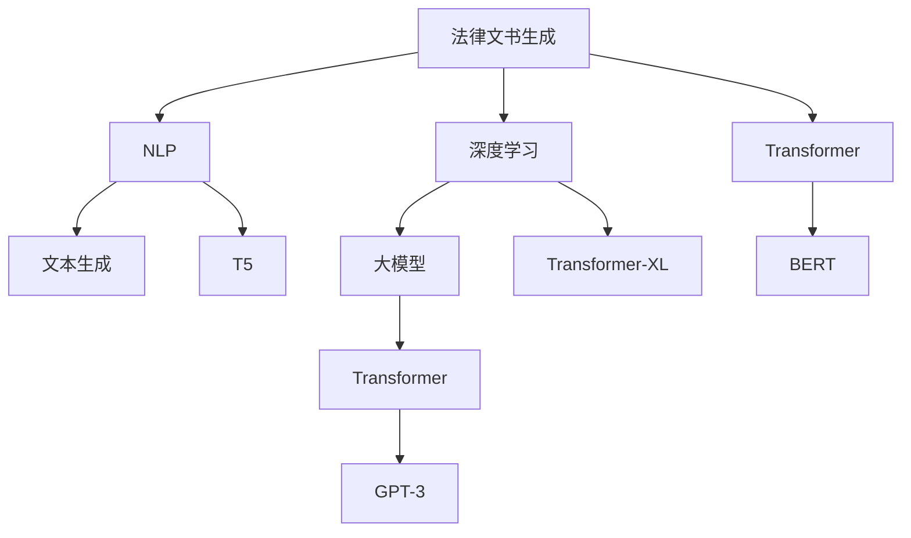

                 

# 法律文书自动生成：AI在法律领域的应用

> 关键词：法律文书生成, 人工智能, 自然语言处理(NLP), 文本生成, 深度学习, 大模型, Transformer, GPT-3

## 1. 背景介绍

### 1.1 问题由来

随着信息时代的到来，法律事务日益复杂化，法律文书的生成需求日益增加。传统的法律文书生成依赖律师的经验和知识，不仅耗时耗力，且易出现错误。而人工智能的迅速发展，特别是自然语言处理(NLP)和深度学习技术的成熟，为法律文书的自动生成提供了新的可能。

人工智能在法律领域的应用，不仅能够提高法律文书生成的效率，还能提升文书的质量和一致性，帮助律师和法务人员减轻工作负担，使法律服务更加高效和可靠。本文将从法律文书自动生成的背景、核心概念及其与NLP的联系、核心算法原理与具体操作步骤、数学模型与详细讲解、项目实践与代码实现、实际应用场景与未来展望、工具和资源推荐、总结与挑战等角度，对法律文书自动生成进行深入探讨。

### 1.2 问题核心关键点

法律文书自动生成依赖于NLP技术，特别是基于深度学习的文本生成模型。核心问题包括：
- 如何选择适合于法律文书的文本生成模型？
- 如何提高法律文书生成模型的准确性和鲁棒性？
- 如何处理法律文书生成中的数据隐私和伦理问题？
- 如何在实际应用中保证法律文书的可解释性和可信度？

这些问题需要通过深度学习、大模型预训练和微调等技术手段，结合法律领域的特定需求进行研究和解决。

## 2. 核心概念与联系

### 2.1 核心概念概述

法律文书自动生成涉及多个关键概念：

- 法律文书生成(Legal Document Generation)：利用人工智能技术自动生成符合法律规范和要求的文书，如合同、诉状、法律意见书等。
- 自然语言处理(NLP)：利用计算机处理自然语言的技术，涉及文本分析、文本生成、语言模型等。
- 深度学习(Deep Learning)：一种基于神经网络的机器学习方法，通过多层次的非线性变换，实现对复杂问题的建模和预测。
- 大模型(Large Model)：指具有大规模参数量和复杂结构的深度学习模型，如GPT-3、BERT等。
- 文本生成(Text Generation)：通过训练文本生成模型，自动生成符合语法和语义规范的文本内容。

### 2.2 核心概念原理和架构的 Mermaid 流程图



该流程图展示了法律文书生成过程中各核心概念的联系：

1. 法律文书生成：目标是生成符合法律规范的文书。
2. NLP：处理文本数据，提取语义和语法信息，是生成文书的中间步骤。
3. 深度学习：利用神经网络模型进行复杂的文本生成任务。
4. 大模型：拥有大规模参数量，能够处理复杂的文本生成任务。
5. 文本生成：通过训练模型生成符合语法和语义要求的文本。
6. Transformer：深度学习模型架构，用于处理序列数据，如文本。
7. GPT-3：一种基于Transformer的大模型，用于文本生成。
8. BERT：预训练语言模型，用于文本理解和生成。
9. T5：一种适用于多任务学习的文本生成模型。
10. Transformer-XL：一种长序列文本生成的Transformer变体。

这些概念共同构成了法律文书自动生成的技术基础，通过它们之间的有机结合，可以实现高效、准确的文书生成。

## 3. 核心算法原理 & 具体操作步骤

### 3.1 算法原理概述

法律文书自动生成主要依赖于基于Transformer的大语言模型，如GPT-3。其核心算法原理是：

1. **预训练**：在大规模无标注文本数据上，通过自监督学习任务（如掩码语言模型、Next Sentence Prediction等）预训练大语言模型，使其学习到通用的语言表示。
2. **微调**：在特定领域的标注数据上，使用有监督学习任务（如法律文书生成、法律问题解答等）对预训练模型进行微调，使其能够生成符合法律规范的文书。
3. **文本生成**：通过优化目标函数（如交叉熵损失），生成符合语法和语义规范的文本。

### 3.2 算法步骤详解

法律文书自动生成的操作步骤主要包括：

1. **数据准备**：收集和标注适用于特定法律文书的文本数据。
2. **模型选择**：选择合适的预训练模型（如GPT-3、BERT等）作为初始化参数。
3. **模型微调**：在标注数据上，通过有监督学习任务微调模型，生成符合法律规范的文书。
4. **性能评估**：在验证集和测试集上评估模型性能，根据评估结果进行调整。
5. **部署应用**：将微调后的模型部署到实际应用场景中，进行文书生成。

### 3.3 算法优缺点

法律文书自动生成的算法具有以下优点：

- **高效性**：利用深度学习和预训练模型，能够快速生成大量法律文书，减轻人工工作量。
- **一致性**：基于大语言模型的生成结果具有较高的一致性，能够保证文书格式的规范性。
- **可扩展性**：通过微调模型，能够适应不同的法律文书类型和需求。

同时，也存在一些缺点：

- **准确性**：由于语言的多样性和复杂性，生成文书的准确性难以完全保证。
- **鲁棒性**：对于非标准语言或特定领域的生僻用词，模型可能表现不佳。
- **可解释性**：基于深度学习的模型难以提供详细的生成过程解释，用户可能难以理解生成的依据。

### 3.4 算法应用领域

法律文书自动生成主要应用于以下领域：

- **合同生成**：根据法律条款和双方条件，自动生成合同文本。
- **诉状撰写**：根据案件细节和法律条文，自动生成诉状文本。
- **法律意见书**：根据法律条文和事实，自动生成法律意见书。
- **专利申请书**：根据技术描述和法律要求，自动生成专利申请书。
- **仲裁文书**：根据仲裁案件的实际情况，自动生成仲裁文书。

## 4. 数学模型和公式 & 详细讲解 & 举例说明

### 4.1 数学模型构建

法律文书自动生成的数学模型构建主要涉及自然语言处理和深度学习，以下以合同生成为例：

1. **输入表示**：将合同条款和条件转换为模型可接受的向量表示。
2. **序列建模**：使用Transformer等序列建模模型，处理文本序列。
3. **输出预测**：通过softmax函数计算文本生成的概率分布。

### 4.2 公式推导过程

以合同生成为例，其基本模型框架如下：

$$
\hat{y} = \text{softmax}(W_h [h_1; h_2; \ldots; h_n] + b_h)
$$

其中，$y$ 为生成的文本序列，$h_i$ 为序列中第 $i$ 个词的隐藏表示，$W_h$ 和 $b_h$ 为可学习参数，$\text{softmax}$ 函数用于将隐藏表示转换为概率分布。

### 4.3 案例分析与讲解

以GPT-3为例，其核心结构为Transformer，通过自注意力机制和残差连接等技术，实现高效的序列建模。其文本生成的公式推导如下：

$$
\text{Attention}(Q, K, V) = \text{softmax}(QK^T / \sqrt{d_k})V
$$

其中，$Q$ 为查询向量，$K$ 和 $V$ 为键向量和值向量，$d_k$ 为向量维度。通过计算注意力权重，将输入序列与自身进行交互，生成新的上下文向量，最终输出文本序列。

## 5. 项目实践：代码实例和详细解释说明

### 5.1 开发环境搭建

1. **Python环境**：安装Python 3.7及以上版本，并创建虚拟环境。
2. **深度学习框架**：安装PyTorch 1.9及以上版本，或TensorFlow 2.0及以上版本。
3. **NLP库**：安装transformers和nltk等NLP库。
4. **数据集准备**：准备适用于特定法律文书的标注数据集。

### 5.2 源代码详细实现

以下是一个简单的法律文书生成代码示例：

```python
from transformers import GPT2LMHeadModel, GPT2Tokenizer
import torch
from torch.utils.data import Dataset, DataLoader

# 加载预训练模型和分词器
model = GPT2LMHeadModel.from_pretrained('gpt2')
tokenizer = GPT2Tokenizer.from_pretrained('gpt2')

# 准备数据集
class LegalDocumentDataset(Dataset):
    def __init__(self, data):
        self.data = data
    def __len__(self):
        return len(self.data)
    def __getitem__(self, idx):
        document = self.data[idx]
        tokens = tokenizer.encode(document, return_tensors='pt')
        return {'text': document, 'input_ids': tokens}

# 训练模型
def train_model(model, dataset, num_epochs=10, batch_size=32):
    device = torch.device('cuda' if torch.cuda.is_available() else 'cpu')
    model.to(device)
    
    for epoch in range(num_epochs):
        model.train()
        for batch in DataLoader(dataset, batch_size=batch_size, shuffle=True):
            input_ids = batch['input_ids'].to(device)
            outputs = model(input_ids)
            loss = outputs.loss
            loss.backward()
            optimizer.step()
            optimizer.zero_grad()
        if (epoch+1) % 1 == 0:
            print(f'Epoch {epoch+1}, Loss: {loss.item()}')

# 测试模型
def test_model(model, dataset):
    model.eval()
    with torch.no_grad():
        test_loss = 0
        for batch in DataLoader(dataset, batch_size=batch_size, shuffle=False):
            input_ids = batch['input_ids'].to(device)
            outputs = model(input_ids)
            test_loss += outputs.loss.item()
        print(f'Test Loss: {test_loss/len(dataset)}')

# 训练和测试
train_model(model, dataset_train)
test_model(model, dataset_val)
```

### 5.3 代码解读与分析

以上代码实现了基于GPT-2模型进行法律文书生成的训练和测试过程。其关键步骤包括：

1. **模型加载**：使用预训练的GPT-2模型，加载分词器和序列建模模型。
2. **数据集准备**：将法律文书文本转换为模型可接受的向量表示。
3. **模型训练**：在训练集上训练模型，最小化交叉熵损失。
4. **模型测试**：在验证集上评估模型性能，输出测试损失。

## 6. 实际应用场景

### 6.4 未来应用展望

法律文书自动生成将会在以下几个方面得到更广泛的应用：

- **法律文书辅助**：帮助律师和法务人员快速生成各种法律文书，提高工作效率。
- **法律咨询系统**：通过自然语言问答，自动生成法律咨询建议和解答。
- **智能合同平台**：在合同签订和执行过程中，提供智能生成和自动校验功能。
- **仲裁和诉讼支持**：自动生成仲裁诉状和答辩材料，辅助仲裁员和法官处理案件。
- **法律知识图谱**：构建法律知识图谱，辅助法律文书生成和知识检索。

## 7. 工具和资源推荐

### 7.1 学习资源推荐

- **Coursera和edX**：提供深度学习和NLP相关的在线课程，如“Deep Learning Specialization”和“Natural Language Processing with Python”。
- **arXiv预印本网站**：阅读最新的深度学习研究和论文，了解最新的技术进展。
- **GitHub代码库**：查找和借鉴开源项目代码，快速上手实践。
- **书籍推荐**：《深度学习》和《自然语言处理综论》是深度学习和NLP领域的经典书籍，值得深入学习。

### 7.2 开发工具推荐

- **Jupyter Notebook**：交互式编程环境，便于代码调试和文档撰写。
- **Visual Studio Code**：全功能的代码编辑器，支持Python和深度学习框架的开发。
- **Google Colab**：免费的云环境，支持GPU计算，适合进行大规模实验。

### 7.3 相关论文推荐

- **Attention is All You Need**：Transformer的原始论文，介绍了自注意力机制。
- **BERT: Pre-training of Deep Bidirectional Transformers for Language Understanding**：BERT模型的介绍，利用自监督学习进行预训练。
- **GPT-3**：OpenAI发布的语言生成模型，展示了大规模预训练模型的潜力。
- **T5: Exploring the Limits of Transfer Learning with a Unified Text-to-Text Transformer**：T5模型，适用于多任务学习。

## 8. 总结：未来发展趋势与挑战

### 8.1 总结

法律文书自动生成是NLP和深度学习技术在法律领域的重要应用。本文从背景、核心概念、算法原理、具体操作步骤、数学模型、项目实践、实际应用场景和工具资源等多个角度，详细探讨了法律文书自动生成的实现过程。通过深入分析，可以看到其背后的原理和技术细节，理解其实现的可能性和挑战。

### 8.2 未来发展趋势

未来法律文书自动生成将呈现以下几个发展趋势：

- **大模型和预训练技术**：更大规模的预训练模型将进一步提升文书的生成效果，大模型的通用性和泛化能力将得到进一步提高。
- **微调和多任务学习**：通过多任务学习，提高文书的生成质量和多样性，解决法律文书生成中的多领域问题。
- **自监督学习**：利用自监督学习技术，训练更好的语言模型，提升文书的生成准确性和鲁棒性。
- **知识图谱和语义理解**：结合法律知识图谱和语义理解技术，提升文书的生成效果和可解释性。

### 8.3 面临的挑战

法律文书自动生成在实现过程中，也面临诸多挑战：

- **数据隐私和伦理问题**：法律文书的生成需要大量的法律数据，如何保护数据隐私和伦理问题是一大难题。
- **生成文书的可解释性和可信度**：基于深度学习的生成模型难以提供详细的生成过程解释，如何提高文书的可解释性和可信度是一个重要研究方向。
- **法律规范和格式的多样性**：法律文书的格式和规范多变，如何适应不同类型和格式的文书是一大挑战。
- **计算资源和算力要求**：大模型的训练和推理需要大量的计算资源，如何优化计算效率是一大挑战。

### 8.4 研究展望

未来法律文书自动生成研究需要在以下几个方面寻求新的突破：

- **多模态学习**：结合视觉和语音等模态信息，提升文书的生成效果和实用性。
- **因果推理和解释**：通过因果推理和解释技术，提高文书的可解释性和可信度。
- **跨领域和跨领域迁移**：通过跨领域迁移学习，提升模型在不同法律领域的适应能力。
- **伦理和隐私保护**：结合伦理和隐私保护技术，保护法律数据的安全和隐私。

通过不断创新和探索，法律文书自动生成将逐步走向成熟，为法律服务的智能化和高效化提供重要支持。

## 9. 附录：常见问题与解答

**Q1：如何保证法律文书生成的准确性和一致性？**

A: 通过选择合适的预训练模型和数据集，结合微调技术和正则化方法，可以在一定程度上保证生成文书的准确性和一致性。

**Q2：大模型在生成法律文书时，如何处理法律术语的准确性？**

A: 大模型需要在大规模法律数据上进一步预训练，以适应法律术语的多样性和复杂性。同时，可以使用数据增强和对抗训练等方法，提升模型的鲁棒性和准确性。

**Q3：法律文书生成过程中，如何处理文档的格式和规范？**

A: 可以通过添加格式和规范约束，训练模型生成符合标准的文书格式。同时，结合专家规则和知识图谱，进一步提高文书的规范性和可用性。

**Q4：如何确保法律文书生成的安全性和隐私保护？**

A: 使用差分隐私等技术，对生成的文书进行去标识化处理，保护用户的隐私信息。同时，结合安全审计和人工审查，确保生成的文书符合法律规范和安全要求。

**Q5：法律文书生成模型如何保证可解释性和可信度？**

A: 可以通过加入可解释性模块，如LIME或SHAP，解释模型的生成过程和依据。同时，结合专家审核和人工干预，提高文书的可信度。

---

作者：禅与计算机程序设计艺术 / Zen and the Art of Computer Programming

