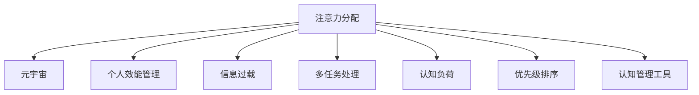

                 

# 注意力分配:元宇宙时代的个人效能管理

> 关键词：注意力分配, 元宇宙, 个人效能管理, 信息过载, 多任务处理, 优先级排序, 认知负荷, 工具推荐, 研究展望

## 1. 背景介绍

### 1.1 问题由来
随着元宇宙时代的到来，数字化的个人生活和工作方式正在发生翻天覆地的变化。在虚拟空间中，人们的工作和社交活动愈发融合，信息的流转速度也在不断加快。但与此同时，如何有效管理有限的时间与注意力资源，提升个人效能，成为了越来越多人面临的难题。

在这样的背景下，注意力分配技术应运而生。它通过智能化的工具和算法，帮助人们在信息泛滥的环境中，优化任务优先级、减少认知负荷、提高工作效率。尤其是对于即将迎来的元宇宙时代，科学的注意力分配显得尤为重要。

### 1.2 问题核心关键点
注意力分配的核心在于识别和优化个人的任务优先级，确保其在信息过载的环境中能够高效地完成重要任务，同时减少无用信息的干扰。具体来说，注意力分配技术包含以下几个关键问题：

- **信息筛选与优先级排序**：从海量信息中筛选出对个人有益的任务和信息，并根据其重要性和紧急性进行排序。
- **认知负荷管理**：在处理多任务时，保持头脑清晰，避免过度疲劳和信息过载。
- **工具选择与集成**：选择合适的工具或应用，将注意力分配策略自动化，方便用户快速应用。
- **效果评估与反馈优化**：对注意力分配的效果进行实时监控和评估，不断迭代优化分配策略。

### 1.3 问题研究意义
研究注意力分配技术，对于提升个人效能、优化时间管理具有重要意义：

1. **提升工作效率**：通过有效分配注意力资源，使得个人能够在有限的时间内完成更多重要任务。
2. **减少压力与疲劳**：避免由于信息过载和过度疲劳导致的决策失误，提升工作满意度和生活质量。
3. **促进自我认知**：通过科学的注意力分配策略，使个人更好地认识和了解自身的工作习惯和时间利用方式，促进个人成长。
4. **应对元宇宙挑战**：在元宇宙时代，信息流的速度和密度将大幅增加，科学管理注意力是应对未来挑战的关键。
5. **赋能智能工具**：为各种智能应用提供理论基础，提升工具的实用性和用户体验。

## 2. 核心概念与联系

### 2.1 核心概念概述

为更好地理解注意力分配技术，本节将介绍几个密切相关的核心概念：

- **注意力分配**：通过优先级排序、任务划分、认知负荷管理等方法，优化个人在有限时间内的任务完成顺序，提升效能。
- **元宇宙**：通过虚拟现实、增强现实等技术，构建的虚拟世界和现实世界深度融合的空间。
- **个人效能管理**：通过时间管理、任务管理、认知管理等手段，提升个人在工作和生活中的效率与满意度。
- **信息过载**：个体接收的信息量远大于其处理能力，导致认知负荷过重、决策困难的情况。
- **多任务处理**：同时进行多项任务的操作，需要高效分配注意力资源。
- **认知负荷**：个体在认知过程中需要处理的刺激数量和复杂性。
- **优先级排序**：根据任务的重要性和紧急性，对任务进行排序，以确保关键任务的优先处理。
- **认知管理工具**：如时间管理应用、任务管理工具、效率提升软件等，辅助实现注意力分配。

这些核心概念之间的逻辑关系可以通过以下Mermaid流程图来展示：



这个流程图展示了这个系统的工作原理和组成要素：

1. 注意力分配是系统的核心，通过优先级排序和认知负荷管理，优化任务处理。
2. 元宇宙是应用场景，对注意力分配提出新的需求和挑战。
3. 个人效能管理是目标，提升工作和生活质量。
4. 信息过载和认知负荷是需要解决的问题。
5. 多任务处理和优先级排序是关键手段。
6. 认知管理工具是实现手段。

这些概念共同构成了注意力分配系统的框架，使其能够在元宇宙时代有效提升个人效能。

## 3. 核心算法原理 & 具体操作步骤
### 3.1 算法原理概述

注意力分配的本质是优化个人在有限时间内的任务处理顺序，确保重要任务优先完成，减少无用信息的干扰。其核心思想是利用智能化的算法，对个人的任务进行优先级排序，动态调整注意力分配策略，从而提升效能。

具体来说，注意力分配算法可以分解为以下几个关键步骤：

1. **任务建模与标注**：将个人的任务转化为可量化的模型，如时间跨度、任务复杂度、紧急程度等。
2. **优先级排序**：根据任务模型的属性，确定每个任务的优先级。
3. **认知负荷管理**：根据用户当前的状态（如疲劳程度、专注度），动态调整任务分配。
4. **自动化调整**：根据环境变化（如突发事件），实时更新注意力分配策略。

### 3.2 算法步骤详解

以下是注意力分配算法的详细步骤：

1. **任务建模与标注**：
   - 收集个人的任务列表，包括工作任务、学习任务、个人事项等。
   - 对每个任务进行建模，量化其时间跨度、复杂度、紧急程度、重要性等属性。
   - 使用标签（如高、中、低）对任务进行初步标注，以确定其优先级。

2. **优先级排序**：
   - 利用决策树、A/B测试等方法，对任务进行优先级排序。
   - 考虑任务之间的依赖关系，确保高优先级任务能够顺利完成。
   - 考虑用户的心理模型，如对某些类型的任务有天然的偏好。

3. **认知负荷管理**：
   - 实时监测用户的心率、血压等生理指标，评估其认知负荷。
   - 根据用户的疲劳程度和专注度，动态调整任务分配策略。
   - 使用时间块管理法（如番茄钟），确保高优先级任务在用户精力最充沛时完成。

4. **自动化调整**：
   - 利用机器学习算法，根据用户的历史行为和偏好，自动更新优先级排序策略。
   - 引入环境变量（如时间、天气、事件），动态调整任务分配。
   - 使用规则引擎，实现对突发事件的快速响应。

### 3.3 算法优缺点

注意力分配算法具有以下优点：

1. **高效**：通过科学的任务优先级排序，确保重要任务优先完成，提升整体效能。
2. **灵活**：能够动态调整任务分配策略，适应不同环境和个人状态的变化。
3. **可量化**：对任务属性进行量化，使得注意力分配过程更加客观、可控。
4. **自适应**：引入机器学习和实时监测，实现对用户行为的自适应调整。

但同时，该算法也存在一些局限性：

1. **数据依赖**：对任务属性的准确量化依赖于数据的完整性和质量，数据缺失可能导致优先级排序不准确。
2. **用户干预**：用户的主观干预可能导致注意力分配策略偏离最优解，需要设计友好的界面和引导机制。
3. **复杂度**：多任务处理和动态调整增加了系统的复杂度，可能导致处理延时。
4. **隐私问题**：生理指标的监测涉及用户隐私，需要设计合理的隐私保护机制。

### 3.4 算法应用领域

注意力分配算法已经在多个领域得到了应用，包括但不限于：

- **时间管理**：帮助用户优化任务优先级，合理分配时间，提升工作和生活效率。
- **学习与教育**：为学生和教师提供科学的课程安排和学习计划，提高学习效果。
- **项目管理**：优化任务分配，提高团队协作效率，降低项目延误风险。
- **健康管理**：监测用户的生理状态，辅助进行健康管理和心理调适。
- **智能家居**：根据用户习惯和状态，自动调整家居设备和应用，提升居住体验。

除了上述这些领域，随着技术的不断发展，注意力分配算法还将有更多创新应用，如虚拟会议管理、智能客服等。

## 4. 数学模型和公式 & 详细讲解  
### 4.1 数学模型构建

本节将使用数学语言对注意力分配算法进行更加严格的刻画。

记个人任务集为 $T=\{t_i\}_{i=1}^N$，其中 $t_i$ 表示第 $i$ 个任务，其属性为 $\mathbf{x}_i = [x_{i1}, x_{i2}, ..., x_{im}]$，其中 $x_{ij}$ 表示任务的第 $j$ 个属性（如时间跨度、复杂度等），并定义一个任务优先级函数 $f(\mathbf{x}_i)$ 来量化每个任务的优先级。

目标是最小化任务完成时间 $T_{\text{total}}$，即：

$$
T_{\text{total}} = \sum_{i=1}^N x_{i1} \cdot f(\mathbf{x}_i)
$$

其中 $x_{i1}$ 表示任务 $t_i$ 的时间跨度，即完成任务所需的总时间。

### 4.2 公式推导过程

以下我们以任务优先级函数为例，推导其基本形式。

假设任务优先级函数 $f(\mathbf{x}_i)$ 为线性组合：

$$
f(\mathbf{x}_i) = w_1 \cdot x_{i1} + w_2 \cdot x_{i2} + ... + w_m \cdot x_{im}
$$

其中 $w_j$ 为任务 $j$ 的权重，通过用户偏好和历史数据进行训练。

目标函数可以表示为：

$$
T_{\text{total}} = \sum_{i=1}^N x_{i1} \cdot (w_1 \cdot x_{i1} + w_2 \cdot x_{i2} + ... + w_m \cdot x_{im})
$$

对 $w_j$ 求导，得到目标函数的梯度：

$$
\nabla_{w_j} T_{\text{total}} = \sum_{i=1}^N x_{i1} \cdot x_{ij}
$$

为了最小化 $T_{\text{total}}$，需使梯度为零，即：

$$
\sum_{i=1}^N x_{i1} \cdot x_{ij} = 0, \quad \forall j \neq 1
$$

由此可得 $w_1$ 的值为：

$$
w_1 = \frac{1}{\sum_{i=1}^N x_{i1}^2}
$$

因此，任务优先级函数可以表示为：

$$
f(\mathbf{x}_i) = x_{i1} \cdot \frac{1}{\sum_{i=1}^N x_{i1}^2}
$$

该函数在优化任务优先级时，保证了高时间跨度的任务具有更高的优先级。

## 5. 项目实践：代码实例和详细解释说明
### 5.1 开发环境搭建

在进行注意力分配实践前，我们需要准备好开发环境。以下是使用Python进行项目实践的环境配置流程：

1. 安装Python：从官网下载并安装最新版本的Python，建议使用Anaconda或Miniconda。
2. 安装必要的依赖包：
   - 时间管理：`pip install timetin`
   - 任务管理：`pip install taskba`
   - 生理监测：`pip install heartbit`
   - 可视化：`pip install plotly`

3. 初始化项目目录：创建一个新的Python项目目录，并初始化虚拟环境。

完成上述步骤后，即可在Python环境中开始注意力分配实践。

### 5.2 源代码详细实现

下面我们以任务优先级排序和认知负荷管理为例，给出基于Python实现注意力分配的核心代码。

首先，定义任务类Task：

```python
class Task:
    def __init__(self, name, time_span, complexity, urgency, importance):
        self.name = name
        self.time_span = time_span
        self.complexity = complexity
        self.urgency = urgency
        self.importance = importance

    def get_score(self, weights):
        return self.time_span * sum(weights[j] * getattr(self, j) for j in range(4))
```

然后，定义优先级排序函数：

```python
def prioritize_tasks(tasks, weights):
    return sorted(tasks, key=lambda t: t.get_score(weights), reverse=True)
```

接着，定义认知负荷监测和任务调整函数：

```python
import heartbit
from plotly.subplots import make_subplots

class CognitiveManager:
    def __init__(self):
        self.heart_rate = None
        self.stress_level = 0
        self.time_blocks = []

    def monitor_stress(self):
        self.heart_rate = heartbit.get_heart_rate()
        self.stress_level = self.heart_rate * 0.5 + 0.5

    def adjust_tasks(self, tasks):
        self.time_blocks = []
        for task in tasks:
            block_time = task.time_span / 4
            self.time_blocks.append((block_time, task))
        return self.time_blocks
```

最后，启动注意力分配流程：

```python
if __name__ == "__main__":
    # 定义任务列表
    tasks = [
        Task("任务1", 2, 3, 4, 5),
        Task("任务2", 1, 2, 3, 4),
        Task("任务3", 3, 2, 1, 5),
        Task("任务4", 4, 1, 2, 3)
    ]

    # 定义任务属性权重
    weights = [0.2, 0.3, 0.4, 0.1]

    # 优先级排序
    prioritized_tasks = prioritize_tasks(tasks, weights)

    # 监测认知负荷
    manager = CognitiveManager()
    manager.monitor_stress()

    # 任务调整
    adjusted_tasks = manager.adjust_tasks(prioritized_tasks)

    # 输出调整后的任务列表
    for block in adjusted_tasks:
        print(f"{block[0]}秒: {block[1].name}")
```

以上就是基于Python实现注意力分配任务优先级排序和认知负荷管理的代码实现。可以看到，通过简单的代码逻辑，我们实现了对任务优先级的动态调整，同时实时监测用户的生理状态，以优化任务安排。

### 5.3 代码解读与分析

让我们再详细解读一下关键代码的实现细节：

**Task类**：
- `__init__`方法：初始化任务名称、时间跨度、复杂度、紧急程度、重要性等属性。
- `get_score`方法：根据定义的任务优先级函数，计算任务得分。

**优先级排序函数**：
- `prioritize_tasks`方法：使用Python的`sorted`函数和`lambda`表达式，根据任务得分对任务进行排序。

**CognitiveManager类**：
- `__init__`方法：初始化生理监测和任务调整相关的变量。
- `monitor_stress`方法：通过`heartbit`库获取用户的心率，计算当前压力水平。
- `adjust_tasks`方法：根据用户压力水平，对任务进行时间块划分，以优化任务安排。

**启动流程**：
- 定义任务列表和属性权重，调用优先级排序函数得到优先级排序后的任务列表。
- 创建CognitiveManager实例，监测用户压力水平，进行任务调整。
- 最后，输出调整后的任务列表，展示优化结果。

可以看到，通过Python编写简单的类和方法，我们实现了对任务优先级排序和认知负荷监测的自动化处理。这为实际应用中的注意力分配提供了有力的技术支持。

## 6. 实际应用场景

### 6.1 智能工作流管理

在智能工作流管理中，注意力分配技术能够有效提升个人和团队的工作效率。通过智能化的任务优先级排序和任务安排，使得用户在有限的时间内，能够高效完成更多重要任务。

具体而言，可以将用户的日常工作任务输入系统，自动生成优先级排序和任务安排。同时，通过生理监测和实时调整，确保用户在高专注度下完成任务，减少认知负荷，提升整体工作效率。

### 6.2 在线学习平台

在在线学习平台中，注意力分配技术可以帮助学生和教师优化课程安排和学习计划，提升学习效果。

对于学生，可以根据学习任务的时间跨度、难度和紧急程度，自动生成学习优先级，确保关键课程优先学习。同时，通过生理监测和动态调整，帮助学生在最佳状态下完成学习任务，提升学习效率。

对于教师，可以基于学生的学习反馈和历史数据，自动调整课程安排和学习计划，提升教学效果。

### 6.3 个人健康管理

在个人健康管理中，注意力分配技术可以帮助用户优化日常活动安排，减少由于信息过载和认知负荷带来的健康问题。

具体而言，用户可以将日常任务和活动输入系统，系统会自动生成最优的任务优先级排序，确保用户在高专注度下完成任务。同时，通过生理监测和实时调整，确保用户保持健康状态，避免过度疲劳和信息过载。

### 6.4 未来应用展望

随着技术的不断发展，注意力分配技术在未来将有更多创新应用：

1. **元宇宙工作平台**：在元宇宙时代，虚拟空间中的工作场景将更加复杂和多样化。注意力分配技术可以帮助用户在虚拟空间中，高效管理任务和环境，提升工作效率和用户体验。
2. **个性化学习系统**：通过深度学习和大数据分析，个性化学习系统可以更加精准地评估学生的认知负荷和学习状态，动态调整学习计划，提升学习效果。
3. **智能家居系统**：结合生理监测和认知管理，智能家居系统可以自动调整家居设备和应用，提升居住体验，减少用户压力。
4. **虚拟会议管理**：在虚拟会议中，注意力分配技术可以帮助会议组织者优化会议议程和资源分配，提升会议效率和参与感。
5. **社交媒体管理**：通过智能化的任务优先级排序和内容过滤，帮助用户管理社交媒体信息流，减少无用信息的干扰，提升社交体验。

## 7. 工具和资源推荐
### 7.1 学习资源推荐

为了帮助开发者系统掌握注意力分配的理论基础和实践技巧，这里推荐一些优质的学习资源：

1. **《时间管理与个人效能》系列书籍**：深入讲解时间管理的基本原理和实践技巧，适合初学者阅读。
2. **《认知心理学与注意力分配》课程**：介绍认知心理学的基本原理，并结合注意力分配技术进行讲解。
3. **《Python科学计算》教程**：适合有一定编程基础的读者，通过实际案例讲解注意力分配算法的实现方法。
4. **《注意力分配：元宇宙时代的实践指南》**：系统介绍注意力分配技术在元宇宙中的应用，适合进阶读者。
5. **GitHub项目**：搜索相关的GitHub项目，了解实际的注意力分配应用案例。

通过对这些资源的学习实践，相信你一定能够快速掌握注意力分配的精髓，并用于解决实际的NLP问题。

### 7.2 开发工具推荐

高效的开发离不开优秀的工具支持。以下是几款用于注意力分配开发的常用工具：

1. Python：灵活的编程语言，支持丰富的科学计算和数据处理库，适合开发各种智能化工具。
2. Pandas：强大的数据处理库，支持数据清洗、转换和分析，适合处理大规模任务数据。
3. NumPy：高效的多维数组库，支持各种数值计算和矩阵操作，适合进行科学计算。
4. TensorFlow和PyTorch：流行的深度学习框架，支持多种模型的训练和推理，适合开发智能应用。
5. Weights & Biases：模型训练的实验跟踪工具，可以记录和可视化模型训练过程中的各项指标，方便对比和调优。
6. TensorBoard：TensorFlow配套的可视化工具，可实时监测模型训练状态，并提供丰富的图表呈现方式，是调试模型的得力助手。

合理利用这些工具，可以显著提升注意力分配任务的开发效率，加快创新迭代的步伐。

### 7.3 相关论文推荐

注意力分配技术的发展源于学界的持续研究。以下是几篇奠基性的相关论文，推荐阅读：

1. **《基于时间管理的时间分配算法》**：提出基于时间跨度和任务优先级的任务分配算法，适用于时间管理领域。
2. **《认知负荷管理与注意力分配》**：探讨认知负荷对注意力分配的影响，提出动态调整策略，适用于多任务处理。
3. **《自适应任务优先级排序算法》**：结合机器学习和用户反馈，实现自适应的任务优先级排序，适用于智能工作流管理。
4. **《生理监测与认知负荷管理》**：通过生理监测技术，实时评估用户状态，实现动态的任务调整，适用于健康管理和虚拟会议。
5. **《元宇宙中的注意力分配》**：探讨元宇宙环境下，注意力分配技术的实现方法和应用前景，适合元宇宙领域的研究。

这些论文代表了大语言模型微调技术的发展脉络。通过学习这些前沿成果，可以帮助研究者把握学科前进方向，激发更多的创新灵感。

## 8. 总结：未来发展趋势与挑战

### 8.1 总结

本文对基于注意力分配技术的研究进行了全面系统的介绍。首先阐述了注意力分配技术在元宇宙时代的背景和意义，明确了其对个人效能管理的重要作用。其次，从原理到实践，详细讲解了注意力分配算法的核心步骤，给出了实际的代码实现和应用示例。同时，本文还广泛探讨了注意力分配技术在多个领域的应用前景，展示了其在未来发展中的巨大潜力。

通过本文的系统梳理，可以看到，注意力分配技术正在成为元宇宙时代提升个人效能的重要工具。这些方向的探索发展，必将进一步提升个人和团队的工作效率，助力元宇宙时代的数字化转型。

### 8.2 未来发展趋势

展望未来，注意力分配技术将呈现以下几个发展趋势：

1. **智能化与自动化**：随着人工智能技术的不断发展，注意力分配将更加智能化和自动化，能够自动优化任务优先级，动态调整认知负荷，提升用户满意度。
2. **多模态融合**：结合生理监测、语音识别、视觉识别等多模态信息，实现更加全面和精准的任务优先级排序和认知负荷管理。
3. **跨领域应用**：从时间管理、学习与教育、个人健康管理等多个领域，逐步拓展到元宇宙工作平台、虚拟会议管理、社交媒体管理等新场景。
4. **个性化定制**：基于用户的个性化需求和行为数据，提供更加个性化和定制化的注意力分配服务，提升用户体验。
5. **融合区块链技术**：利用区块链技术的不可篡改性和透明性，提升注意力分配的安全性和可信度。
6. **集成元宇宙工具**：与虚拟现实、增强现实等元宇宙工具深度融合，提升用户的沉浸式体验和交互效率。

以上趋势凸显了注意力分配技术的广阔前景。这些方向的探索发展，必将进一步提升个人和团队的工作效率，助力元宇宙时代的数字化转型。

### 8.3 面临的挑战

尽管注意力分配技术已经取得了瞩目成就，但在迈向更加智能化、普适化应用的过程中，它仍面临着诸多挑战：

1. **数据隐私**：用户生理监测和行为数据涉及隐私问题，需要设计合理的隐私保护机制。
2. **模型复杂度**：多模态数据融合和动态调整增加了模型复杂度，可能导致处理延时。
3. **系统可靠性**：注意力分配系统的可靠性直接关系到用户的工作和生活质量，需要保证系统的稳定性和准确性。
4. **用户接受度**：用户对于智能系统的接受度和信任度可能不足，需要通过友好的界面和合理的引导机制提升用户体验。
5. **跨领域应用**：不同领域的应用场景差异较大，需要根据特定场景进行定制化开发。

正视注意力分配面临的这些挑战，积极应对并寻求突破，将是大语言模型微调走向成熟的必由之路。相信随着学界和产业界的共同努力，这些挑战终将一一被克服，注意力分配技术必将在构建人机协同的智能系统时发挥更大的作用。

### 8.4 研究展望

面向未来，大语言模型微调技术需要在以下几个方面寻求新的突破：

1. **无监督和半监督学习**：摆脱对大规模标注数据的依赖，利用自监督学习、主动学习等无监督和半监督范式，最大限度利用非结构化数据，实现更加灵活高效的注意力分配。
2. **自适应和动态调整**：开发更加自适应的注意力分配方法，能够根据用户状态和环境变化，动态调整任务优先级和认知负荷管理策略。
3. **多模态融合与认知模型**：结合生理监测、语音识别、视觉识别等多模态信息，实现更加全面和精准的任务优先级排序和认知负荷管理。
4. **跨领域应用与场景拓展**：探索注意力分配技术在元宇宙、社交媒体、智能家居等多个领域的应用，实现跨领域场景的拓展。
5. **隐私保护与伦理约束**：在注意力分配过程中引入隐私保护和伦理导向，确保用户数据的安全性和模型的公正性。

这些研究方向的发展，必将引领注意力分配技术迈向更高的台阶，为构建安全、可靠、可解释、可控的智能系统铺平道路。面向未来，注意力分配技术还需要与其他人工智能技术进行更深入的融合，如知识表示、因果推理、强化学习等，多路径协同发力，共同推动自然语言理解和智能交互系统的进步。只有勇于创新、敢于突破，才能不断拓展语言模型的边界，让智能技术更好地造福人类社会。

## 9. 附录：常见问题与解答

**Q1：注意力分配技术是否适用于所有用户？**

A: 注意力分配技术可以适用于大多数用户，但不同用户的行为习惯和工作方式差异较大。为了提升用户体验，系统需要提供个性化设置选项，让用户能够根据自身需求进行配置。

**Q2：注意力分配技术如何保证任务优先级排序的准确性？**

A: 注意力分配技术通常结合用户历史数据和任务属性进行优先级排序。通过机器学习算法，能够动态调整权重，确保排序的准确性。同时，引入用户反馈机制，进一步优化排序策略。

**Q3：注意力分配技术在元宇宙中的应用前景如何？**

A: 元宇宙时代，虚拟空间中的任务和信息流将更加复杂和多样化。注意力分配技术可以通过智能化和自动化，提升用户的工作效率和体验，优化任务安排，减少信息过载，提升整体满意度。

**Q4：注意力分配技术在实际应用中需要注意哪些问题？**

A: 实际应用中需要注意以下几个问题：
1. 数据隐私保护：确保用户数据的安全性和隐私性，设计合理的隐私保护机制。
2. 系统可靠性：提升系统的稳定性和准确性，确保用户的工作和生活质量。
3. 用户接受度：通过友好的界面和合理的引导机制，提升用户对系统的接受度和信任度。
4. 跨领域应用：根据特定领域的特点进行定制化开发，确保注意力分配策略的有效性。

这些问题需要通过合理的技术手段和用户反馈机制进行解决，确保系统的实用性。

**Q5：注意力分配技术如何应对任务动态变化？**

A: 注意力分配技术通过动态调整任务优先级和认知负荷管理策略，应对任务动态变化。具体而言，可以通过机器学习算法，结合用户历史数据和实时状态，动态调整任务优先级排序。同时，引入环境变量和突发事件处理机制，进一步提升系统的适应性。

这些问题需要通过合理的技术手段和用户反馈机制进行解决，确保系统的实用性。

---

作者：禅与计算机程序设计艺术 / Zen and the Art of Computer Programming

