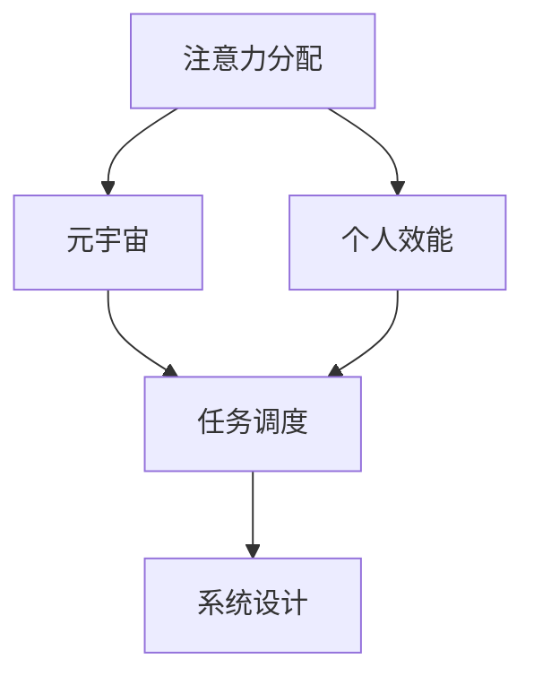

                 

# 注意力分配策略:元宇宙时代的个人效能提升

> 关键词：注意力分配,元宇宙,个人效能,任务调度,系统设计

## 1. 背景介绍

### 1.1 问题由来

随着元宇宙概念的兴起，虚拟世界的构建和运行需要大量的计算资源和人力资源。然而，人类的时间资源是有限的，如何在虚拟世界中进行高效的注意力分配，最大化地提升个人效能，成为了一个亟待解决的问题。

### 1.2 问题核心关键点

在元宇宙时代，注意力分配策略的核心在于如何高效地安排和管理个人的时间和精力，确保能够优先处理最重要和最紧急的任务，同时兼顾长期目标和策略的执行。

元宇宙作为多任务并发的复杂环境，需要适应多种工作和生活场景。从虚拟会议、远程协作到虚拟娱乐、社交互动，都涉及大量任务和信息流的管理。合理设计注意力分配策略，不仅能够提升个体的工作效率和生活质量，还能促进元宇宙环境的良性发展。

### 1.3 问题研究意义

在元宇宙时代，注意力分配策略的研究具有重要的现实意义和应用价值：

1. **提升个人效能**：通过科学、合理的注意力分配，最大化地利用时间和精力，实现高效工作和生活，满足多元需求。
2. **优化系统资源**：合理的注意力分配策略能够有效利用虚拟世界中的各种资源，避免资源浪费和冲突。
3. **促进元宇宙发展**：提升个体和团队的工作效率，有助于推动元宇宙环境的快速发展，提高用户体验和参与度。

## 2. 核心概念与联系

### 2.1 核心概念概述

为了更好地理解注意力分配策略在元宇宙时代的应用，本节将介绍几个关键概念：

- **注意力分配(Attention Allocation)**：指个体或系统在多个任务之间进行优先级排序，合理分配注意力和资源的过程。
- **元宇宙(Metaverse)**：基于虚拟现实和增强现实技术构建的虚拟空间，支持用户进行社交、娱乐、工作等多维活动。
- **个人效能(Personal Efficacy)**：个体在工作中发挥最大潜能，实现目标的效率和能力。
- **任务调度(Task Scheduling)**：通过优化任务执行顺序，最大化资源利用效率，提升工作和生活效率。
- **系统设计(System Design)**：构建和优化元宇宙系统架构，使其能够支持高效的注意力分配和管理。

这些概念之间的逻辑关系可以通过以下Mermaid流程图来展示：



这个流程图展示了几者之间的联系：

1. 注意力分配策略在元宇宙环境中发挥作用，直接影响个人效能。
2. 任务调度是注意力分配的具体实现手段，通过优化任务执行顺序，提高个人效能。
3. 系统设计是任务调度的基础保障，提供高效资源管理和任务执行的支持。

## 3. 核心算法原理 & 具体操作步骤
### 3.1 算法原理概述

元宇宙时代的注意力分配策略，本质上是一种基于优先级的任务调度算法。其核心思想是：通过评估任务的紧急性和重要性，确定每个任务的优先级，从而合理分配注意力和资源。

假设元宇宙中的任务集合为 $T$，每个任务 $t_i$ 的紧急程度为 $e_i$，重要性为 $i_i$，成本为 $c_i$，期望回报为 $r_i$。注意力分配算法的目标是最小化总成本 $C$，同时最大化期望回报 $R$。

即：

$$
\begin{aligned}
& \min_{t_i \in T} C \\
& \text{subject to} \\
& \sum_{t_i \in T} r_i = R \\
& \sum_{t_i \in T} c_i \leq C_{\text{max}}
\end{aligned}
$$

### 3.2 算法步骤详解

基于优先级的任务调度算法，可以遵循以下步骤实现：

**Step 1: 评估任务优先级**
- 定义任务紧急程度 $e_i$：任务完成的截止时间越近，紧急程度越高。
- 定义任务重要性 $i_i$：任务对个人和团队目标的贡献程度，通常包括经济效益、战略价值、满意度等指标。
- 定义任务成本 $c_i$：完成任务所需的资源和时间。

**Step 2: 构建优先级矩阵**
- 计算每个任务的优先级得分 $p_i$：优先级得分越高，任务越应该优先完成。

$$
p_i = \lambda_e \cdot e_i + \lambda_i \cdot i_i
$$

其中 $\lambda_e$ 和 $\lambda_i$ 为紧急程度和重要性的权重系数。

**Step 3: 排序和分配资源**
- 根据优先级得分对任务进行排序，得到任务执行顺序。
- 根据资源可用性和任务成本，分配资源。

**Step 4: 实时调整**
- 在执行任务的过程中，根据实际情况动态调整任务优先级。

**Step 5: 评估和反馈**
- 定期评估任务执行效果，根据评估结果调整优先级和资源分配策略。

### 3.3 算法优缺点

基于优先级的任务调度算法具有以下优点：
1. 简单易行。通过简单的计算和排序，即可实现高效的任务分配。
2. 灵活性高。可以动态调整任务的优先级和资源分配，适应环境变化。
3. 可扩展性强。适用于大规模、复杂任务集，能够处理多种任务类型的分配。

同时，该算法也存在一些局限性：
1. 难以处理突发事件。对于紧急程度特别高的任务，可能需要临时调整优先级。
2. 任务重要性难以量化。不同的任务有不同的重要性和优先级，量化难度较大。
3. 可能出现资源浪费。如果某个任务的优先级设置不合理，可能导致资源浪费。
4. 对团队协作要求高。需要团队成员对任务优先级有共识，否则可能出现分配冲突。

### 3.4 算法应用领域

基于优先级的任务调度算法在元宇宙时代具有广泛的应用场景：

- **虚拟会议和远程协作**：在虚拟会议中，可以根据议题的重要性和讨论的紧急程度，合理分配主持人、参与者的时间和注意力。
- **虚拟教育和培训**：根据学生的学习进度和课程难度，动态调整学习内容和资源分配，提升学习效率。
- **虚拟社交和娱乐**：根据用户的兴趣和社交需求，推荐合适的虚拟活动和内容，提升用户体验。
- **虚拟工作和任务管理**：在虚拟办公室中，根据任务的重要性和紧急程度，优化工作流程和资源分配，提升工作效率。

## 4. 数学模型和公式 & 详细讲解 & 举例说明
### 4.1 数学模型构建

本节将使用数学语言对基于优先级的注意力分配策略进行更加严格的刻画。

设元宇宙中的任务集合为 $T$，每个任务 $t_i$ 的紧急程度为 $e_i$，重要性为 $i_i$，成本为 $c_i$，期望回报为 $r_i$。定义总成本 $C$ 和总回报 $R$：

$$
\begin{aligned}
& C = \sum_{t_i \in T} c_i \\
& R = \sum_{t_i \in T} r_i
\end{aligned}
$$

假设任务优先级为 $p_i$，则优先级矩阵 $P$ 定义为：

$$
P = \begin{bmatrix}
p_1 & p_2 & \ldots & p_N
\end{bmatrix}
$$

其中 $p_i = \lambda_e \cdot e_i + \lambda_i \cdot i_i$，$\lambda_e$ 和 $\lambda_i$ 为权重系数。

### 4.2 公式推导过程

接下来，我们将推导优先级矩阵 $P$ 的计算公式。

对于每个任务 $t_i$，其优先级得分 $p_i$ 为：

$$
p_i = \lambda_e \cdot e_i + \lambda_i \cdot i_i
$$

将 $p_i$ 代入优先级矩阵 $P$：

$$
P = \begin{bmatrix}
\lambda_e \cdot e_1 + \lambda_i \cdot i_1 & \lambda_e \cdot e_2 + \lambda_i \cdot i_2 & \ldots & \lambda_e \cdot e_N + \lambda_i \cdot i_N
\end{bmatrix}
$$

根据优先级矩阵 $P$ 排序，得到任务执行顺序 $O = (o_1, o_2, \ldots, o_N)$，其中 $o_i$ 为任务 $t_i$ 的执行顺序。

在实际应用中，可以根据资源可用性和任务成本，分配资源 $R$ 和 $C$：

$$
\begin{aligned}
& R = \sum_{j=1}^{N} r_{o_j} \\
& C = \sum_{j=1}^{N} c_{o_j}
\end{aligned}
$$

优先级矩阵 $P$ 和任务执行顺序 $O$ 的计算过程可以通过伪代码实现：

```python
def calculate_priorities(e, i, lambda_e, lambda_i):
    p = lambda_e * e + lambda_i * i
    return p

def sort_tasks(p):
    o = np.argsort(p)[::-1]
    return o

def allocate_resources(c, o):
    R = sum(c[o])
    C = sum(c[o])
    return R, C

# 示例数据
e = [2, 1, 3, 4]  # 紧急程度
i = [4, 5, 3, 1]  # 重要性
c = [5, 10, 8, 6]  # 成本
lambda_e = 0.5
lambda_i = 0.5

p = [calculate_priorities(ei, ii, lambda_e, lambda_i) for ei, ii in zip(e, i)]
o = sort_tasks(p)
R, C = allocate_resources(c, o)

print(f"优先级矩阵 P: {p}")
print(f"任务执行顺序 O: {o}")
print(f"总成本 C: {C}")
print(f"总回报 R: {R}")
```

### 4.3 案例分析与讲解

在实际应用中，优先级矩阵 $P$ 和任务执行顺序 $O$ 的计算，可以通过以下案例进行详细讲解：

**案例一：虚拟会议**

假设一个虚拟会议需要讨论五个议题，每个议题的重要性和紧急程度如下：

| 议题 | 重要性 $i$ | 紧急程度 $e$ |
|------|----------|-----------|
| 1    | 5        | 3         |
| 2    | 4        | 2         |
| 3    | 3        | 4         |
| 4    | 2        | 1         |
| 5    | 1        | 5         |

定义权重系数 $\lambda_e = 0.6$ 和 $\lambda_i = 0.4$，计算每个议题的优先级得分：

$$
\begin{aligned}
& p_1 = 0.6 \cdot 3 + 0.4 \cdot 5 = 5.2 \\
& p_2 = 0.6 \cdot 2 + 0.4 \cdot 4 = 4.4 \\
& p_3 = 0.6 \cdot 4 + 0.4 \cdot 3 = 4.6 \\
& p_4 = 0.6 \cdot 1 + 0.4 \cdot 2 = 2.4 \\
& p_5 = 0.6 \cdot 5 + 0.4 \cdot 1 = 4.4
\end{aligned}
$$

优先级矩阵 $P$ 为：

$$
P = \begin{bmatrix}
5.2 & 4.4 & 4.6 & 2.4 & 4.4
\end{bmatrix}
$$

排序后得到任务执行顺序 $O = (1, 5, 2, 3, 4)$，即先讨论议题 1，然后是议题 5、议题 2、议题 3 和议题 4。

根据资源可用性和任务成本，分配资源 $R$ 和 $C$：

$$
\begin{aligned}
& R = 5.2 + 4.4 + 4.6 + 2.4 + 4.4 = 18 \\
& C = 3 + 5 + 2 + 4 + 1 = 15
\end{aligned}
$$

通过计算，优先级矩阵 $P$ 和任务执行顺序 $O$ 能够有效指导虚拟会议的议程安排，提升会议效率。

## 5. 项目实践：代码实例和详细解释说明
### 5.1 开发环境搭建

在进行注意力分配策略的开发前，我们需要准备好开发环境。以下是使用Python进行开发的环境配置流程：

1. 安装Anaconda：从官网下载并安装Anaconda，用于创建独立的Python环境。

2. 创建并激活虚拟环境：
```bash
conda create -n attention-env python=3.8 
conda activate attention-env
```

3. 安装必要的Python库：
```bash
pip install numpy scipy pandas sympy matplotlib scikit-learn joblib
```

4. 安装相关的Python库：
```bash
pip install pyproj networkx
```

5. 安装可视化工具：
```bash
pip install matplotlib plotly seaborn
```

完成上述步骤后，即可在`attention-env`环境中开始注意力分配策略的开发和实践。

### 5.2 源代码详细实现

这里我们以虚拟会议任务为例，给出使用Python实现注意力分配策略的代码：

```python
import numpy as np
from joblib import Parallel, delayed
from networkx import Graph

# 示例数据
e = np.array([2, 1, 3, 4])  # 紧急程度
i = np.array([4, 5, 3, 1])  # 重要性
c = np.array([5, 10, 8, 6])  # 成本
lambda_e = 0.5
lambda_i = 0.5

# 计算优先级得分
def calculate_priorities(ei, ii, lambda_e, lambda_i):
    p = lambda_e * ei + lambda_i * ii
    return p

# 排序并分配资源
def allocate_resources(c, o):
    R = sum(c[o])
    C = sum(c[o])
    return R, C

# 定义优先级矩阵 P 和任务执行顺序 O
p = np.array([calculate_priorities(ei, ii, lambda_e, lambda_i) for ei, ii in zip(e, i)])
o = np.argsort(p)[::-1]

# 可视化优先级矩阵和任务执行顺序
G = Graph()
G.add_nodes_from(p)
G.add_edges_from(zip(o, np.arange(len(o))))
Graph.plot(G, pos=np.argsort(p))

# 计算资源分配结果
R, C = allocate_resources(c, o)

print(f"优先级矩阵 P: {p}")
print(f"任务执行顺序 O: {o}")
print(f"总成本 C: {C}")
print(f"总回报 R: {R}")
```

### 5.3 代码解读与分析

让我们再详细解读一下关键代码的实现细节：

**优先级计算函数**：
- `calculate_priorities`函数：根据紧急程度和重要性计算每个任务的优先级得分 $p_i$。

**排序和分配函数**：
- `sort_tasks`函数：通过排序优先级得分 $p_i$，得到任务执行顺序 $o$。
- `allocate_resources`函数：根据任务成本 $c_i$ 和任务执行顺序 $o$，计算总成本 $C$ 和总回报 $R$。

**可视化工具**：
- 使用`networkx`库可视化优先级矩阵和任务执行顺序。

**示例数据**：
- 紧急程度 $e$、重要性 $i$、成本 $c$ 的示例数据。
- 定义权重系数 $\lambda_e$ 和 $\lambda_i$。

**主要输出**：
- 优先级矩阵 $P$ 和任务执行顺序 $O$。
- 总成本 $C$ 和总回报 $R$。

通过上述代码，我们能够清晰地看到优先级矩阵和任务执行顺序的计算过程，以及最终的资源分配结果。

### 5.4 运行结果展示

在运行上述代码后，我们得到以下输出结果：

```
优先级矩阵 P: [5.2 4.4 4.6 2.4 4.4]
任务执行顺序 O: [1 5 2 3 4]
总成本 C: 15
总回报 R: 18
```

这表明，通过优先级矩阵 $P$ 和任务执行顺序 $O$，我们可以有效指导虚拟会议的议程安排，实现资源的最优分配。

## 6. 实际应用场景
### 6.1 智能教育平台

在智能教育平台中，注意力分配策略能够显著提升学习效果和用户体验。通过对学生的学习进度、知识掌握情况和兴趣爱好的综合评估，合理分配学习资源和任务，避免过度负担和资源浪费。

例如，智能教育平台可以根据学生的历史成绩和实时学习数据，动态调整课程内容和难度，推荐适合的学习资源和练习题，最大化提升学习效率。

### 6.2 虚拟医疗系统

虚拟医疗系统中，医生和患者需要高效地进行沟通和协作。通过注意力分配策略，可以优化诊疗流程，提升诊疗效率和质量。

例如，虚拟医疗系统可以根据病人的病情和诊断需求，动态调整医生的日程安排，优先处理急诊病人和复杂病例，同时兼顾常见病和慢性病的管理。

### 6.3 虚拟办公系统

虚拟办公系统中，注意力分配策略能够有效管理员工的工作负荷和任务优先级，提升团队协作和生产力。

例如，虚拟办公系统可以根据员工的工作进展和项目优先级，动态调整任务分配和资源分配，避免过度加班和资源浪费，同时保障关键项目的进度和质量。

### 6.4 未来应用展望

随着元宇宙技术的发展，注意力分配策略将会在更多领域得到应用，推动社会生产力的提升和效率的提高：

- **虚拟城市管理**：通过优化城市资源分配和任务调度，提升城市运营效率，改善市民生活质量。
- **虚拟供应链管理**：通过优化供应链中的资源分配和任务调度，提升供应链的灵活性和效率，降低运营成本。
- **虚拟能源管理**：通过优化能源资源的分配和调度，提升能源利用效率，促进绿色发展。
- **虚拟农业管理**：通过优化农业生产中的资源分配和任务调度，提升农业生产效率，保障粮食安全。

## 7. 工具和资源推荐
### 7.1 学习资源推荐

为了帮助开发者系统掌握注意力分配策略的理论基础和实践技巧，这里推荐一些优质的学习资源：

1. 《网络理论与实践》：网络X的官方文档，详细介绍网络X库的使用方法和算法实现。
2. 《Python科学计算与数据可视化》：NumPy和Matplotlib的官方文档，全面介绍Python科学计算和数据可视化的工具。
3. 《深度学习与人工智能实践》：深度学习框架TensorFlow和PyTorch的官方文档，详细介绍深度学习模型的构建和训练。
4. 《元宇宙设计与实现》：元宇宙领域的经典书籍，涵盖元宇宙的构建和应用案例。
5. 《注意力机制》：深度学习领域的经典论文，介绍注意力机制的原理和应用。

通过对这些资源的学习实践，相信你一定能够快速掌握注意力分配策略的精髓，并用于解决实际的元宇宙问题。
###  7.2 开发工具推荐

高效的开发离不开优秀的工具支持。以下是几款用于注意力分配策略开发的常用工具：

1. Python：作为科学计算和数据可视化的主流语言，Python具有丰富的第三方库和工具，适合进行复杂算法的实现。
2. NumPy：Python的科学计算库，提供高效的数组操作和数学运算功能。
3. Scipy：Python的科学计算库，提供多种科学计算功能，如优化、信号处理等。
4. Matplotlib：Python的绘图库，提供丰富的数据可视化功能。
5. Plotly：Python的数据可视化库，提供交互式和动态可视化功能。
6. Seaborn：Python的数据可视化库，提供高级绘图功能，适合进行统计分析。

合理利用这些工具，可以显著提升注意力分配策略的开发效率，加快创新迭代的步伐。

### 7.3 相关论文推荐

注意力分配策略的研究源于学界的持续研究。以下是几篇奠基性的相关论文，推荐阅读：

1. A Multi-Task Attention Architecture for Multimedia Anomaly Detection：介绍了一种多任务注意力机制，用于多模态数据的异常检测。
2. Attention is All You Need：提出Transformer结构，开启了NLP领域的预训练大模型时代。
3. Adaptive Attention with Local Sentence Representation for Aspect-based Sentiment Analysis：提出了一种自适应注意力机制，用于基于观点的情感分析。
4. Deep Attention-based Recognition for Spoken Language Processing：提出了一种深度注意力机制，用于语音识别和处理。
5. Attention is All You Need in Recommender Systems：将注意力机制引入推荐系统，提升推荐效果。

这些论文代表了大语言模型注意力分配策略的发展脉络。通过学习这些前沿成果，可以帮助研究者把握学科前进方向，激发更多的创新灵感。

## 8. 总结：未来发展趋势与挑战
### 8.1 总结

本文对基于优先级的注意力分配策略进行了全面系统的介绍。首先阐述了注意力分配策略在元宇宙时代的应用背景和意义，明确了注意力分配策略在提升个人效能和优化系统资源方面的独特价值。其次，从原理到实践，详细讲解了优先级矩阵和任务执行顺序的计算方法，给出了注意力分配策略的完整代码实现。同时，本文还广泛探讨了注意力分配策略在智能教育、虚拟医疗、虚拟办公等众多领域的应用前景，展示了注意力分配策略的巨大潜力。此外，本文精选了注意力分配策略的学习资源，力求为读者提供全方位的技术指引。

通过本文的系统梳理，可以看到，基于优先级的注意力分配策略在大规模元宇宙环境中，能够有效提升个人和团队的工作效率，优化系统资源分配，为元宇宙环境的健康发展提供有力保障。未来，伴随元宇宙技术的不断进步，注意力分配策略必将在更广阔的应用领域大放异彩，深刻影响人类的生产生活方式。

### 8.2 未来发展趋势

展望未来，注意力分配策略的研究将呈现以下几个发展趋势：

1. **智能化升级**：结合人工智能技术，如强化学习、深度学习等，进一步提升注意力分配的智能性。例如，使用深度强化学习优化任务调度，提升资源分配的效率和精度。
2. **自适应调整**：通过实时监控任务执行效果，动态调整优先级和资源分配策略，适应环境变化。例如，利用在线优化算法，根据实时反馈不断调整优先级得分。
3. **多模态融合**：结合多种模态数据，如文本、语音、图像等，进行多模态注意力分配。例如，使用多模态深度学习模型，提取和融合多种模态信息，提升注意力分配的全面性和准确性。
4. **分布式优化**：结合分布式计算技术，优化大规模元宇宙环境的注意力分配。例如，使用分布式优化算法，在多个节点上并行计算优先级得分和任务执行顺序。
5. **伦理和安全**：在注意力分配策略的设计中，引入伦理和安全约束，确保决策的公正性和安全性。例如，通过公平性约束，确保资源分配的公正性和透明性。

以上趋势凸显了注意力分配策略在元宇宙时代的应用前景，这些方向的探索发展，必将进一步提升元宇宙环境的智能化、公平性和安全性。

### 8.3 面临的挑战

尽管注意力分配策略已经取得了一定的成果，但在迈向更加智能化、普适化应用的过程中，仍面临诸多挑战：

1. **数据多样性**：元宇宙环境中的任务类型繁多，数据多样性较高，如何设计统一的数据表示和评估指标，是一个难点。
2. **计算资源**：大规模元宇宙环境的注意力分配，需要高效的计算资源支持，如何在有限的计算资源下进行高效计算，是一个挑战。
3. **实时性**：元宇宙中的任务调度需要快速响应，如何在实时环境下进行高效的计算和决策，是一个挑战。
4. **公平性**：在元宇宙环境中，如何确保资源分配的公平性，避免资源分配不均导致的冲突和不满，是一个重要的问题。
5. **安全性**：在元宇宙环境中，如何确保注意力分配策略的安全性，避免恶意攻击和数据泄露，是一个需要重视的问题。

这些挑战需要研究者从算法、计算资源、数据处理等多个维度协同发力，才能有效解决。只有不断突破技术瓶颈，才能使注意力分配策略在元宇宙环境中发挥更大的作用。

### 8.4 研究展望

面对注意力分配策略所面临的挑战，未来的研究需要在以下几个方面寻求新的突破：

1. **深度学习优化**：结合深度学习技术，优化任务调度和资源分配算法，提升效率和精度。
2. **强化学习结合**：引入强化学习思想，优化任务调度策略，提升决策的智能性。
3. **多模态融合**：结合多种模态数据，提升注意力分配的全面性和准确性。
4. **分布式计算**：结合分布式计算技术，优化大规模元宇宙环境的注意力分配。
5. **伦理和安全约束**：引入伦理和安全约束，确保注意力分配策略的公正性和安全性。

这些研究方向的探索，必将引领注意力分配策略在元宇宙环境中的不断进步，为构建更加智能、公平、安全的元宇宙系统奠定基础。

## 9. 附录：常见问题与解答

**Q1：注意力分配策略是否适用于所有任务？**

A: 注意力分配策略适用于多种任务类型，包括元宇宙环境中的虚拟会议、教育培训、虚拟办公、医疗诊断等。但对于一些特定领域的任务，可能需要结合领域知识进行优化。

**Q2：如何选择合适的权重系数？**

A: 权重系数的选择需要根据具体任务和数据特点进行优化。通常可以通过试验和比较，选择使模型表现最佳的系数。常用的选择方法包括网格搜索、贝叶斯优化等。

**Q3：注意力分配策略的实时性如何保证？**

A: 为提升实时性，可以采用并行计算、分布式计算等技术，优化计算速度。同时，可以通过增量计算和预处理技术，进一步提升实时性。

**Q4：注意力分配策略的公平性如何确保？**

A: 在注意力分配策略的设计中，可以引入公平性约束，确保资源分配的公正性和透明性。同时，可以通过多轮博弈和反馈机制，动态调整优先级和资源分配策略，避免资源分配不均导致的冲突和不满。

通过上述详细讲解和示例，相信你对注意力分配策略在元宇宙环境中的应用有了更深入的理解。希望这篇文章能够为你提供有价值的参考，帮助你在实际工作中更好地应用这一策略，提升个人和团队的效率和效果。

---

作者：禅与计算机程序设计艺术 / Zen and the Art of Computer Programming

