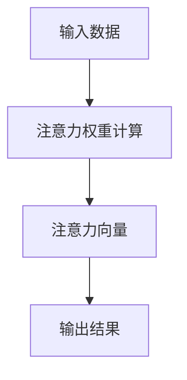

                 

# 注意力机制 (Attention Mechanism) 原理与代码实例讲解

## 1. 背景介绍

### 1.1 问题由来
注意力机制（Attention Mechanism）是深度学习中一种至关重要的技术，尤其在游戏AI、机器翻译、文本生成等领域有着广泛应用。它的核心思想是根据输入数据的特定位置和特征的重要性，动态地为模型分配不同的“注意力”资源，从而实现对输入数据的聚焦和信息提取。

### 1.2 问题核心关键点
注意力机制的关键在于“注意力”的计算，包括两个部分：计算注意力权重、应用注意力权重。其中，注意力权重计算是通过对输入数据的表示进行加权求和，进而获取该位置的特征表示。应用注意力权重则是将输入数据的特征表示进行加权组合，得到模型的输出结果。

### 1.3 问题研究意义
注意力机制的引入，极大地提升了深度学习模型的性能和泛化能力。相比于传统的循环神经网络（RNN）和卷积神经网络（CNN），注意力机制能够更灵活地处理长序列和复杂结构，成为处理自然语言处理（NLP）和计算机视觉（CV）等任务的有力工具。

## 2. 核心概念与联系

### 2.1 核心概念概述
为更好地理解注意力机制的原理和应用，本节将介绍几个关键概念：

- **注意力机制 (Attention Mechanism)**：一种用于动态选择模型输入中关键部分的机制，在处理序列数据时尤为有效。通过计算注意力权重，对输入数据的特定位置进行加权处理。
- **注意力权重 (Attention Weight)**：用于衡量输入数据中各个位置的“注意力”强度，通过模型计算得出。注意力权重越大，表示该位置对输出结果的影响越大。
- **注意力向量 (Attention Vector)**：经过加权处理后的特征向量，由注意力权重乘以输入数据的特征表示得到。
- **多头注意力 (Multi-Head Attention)**：一种将注意力机制应用于多个注意力头的技术，通过并行计算，提高模型的表达能力。

这些核心概念构成了注意力机制的完整框架，使其能够广泛应用于各种深度学习模型中。

### 2.2 核心概念原理和架构的 Mermaid 流程图



这个流程图展示了注意力机制的基本流程：输入数据经过注意力权重计算后，得到注意力向量，再由注意力向量生成输出结果。

## 3. 核心算法原理 & 具体操作步骤

### 3.1 算法原理概述
注意力机制的核心思想是，通过计算输入数据的注意力权重，对输入数据进行加权组合，从而得到更聚焦的特征表示。这一过程通常包括以下几个步骤：

1. 计算注意力权重：通过计算输入数据中各位置与查询向量（通常为模型中的前一时刻的输出）的相似度，得到注意力权重。
2. 计算注意力向量：将输入数据的特征表示与注意力权重进行加权求和，得到注意力向量。
3. 应用注意力向量：将注意力向量与模型中的其他层进行组合，生成最终的输出结果。

### 3.2 算法步骤详解
以下是具体的注意力机制实现步骤：

**Step 1: 准备输入数据和查询向量**
- 输入数据：序列数据 $X=[x_1, x_2, ..., x_n]$，其中 $x_i$ 表示第 $i$ 个位置的特征向量。
- 查询向量：序列数据的下一时刻的输出 $Q$。

**Step 2: 计算注意力权重**
- 计算输入数据中每个位置与查询向量的相似度：$e_{ij}=Q^T K_i$
- 将相似度归一化，得到注意力权重：$\alpha_{ij}=\frac{\exp(e_{ij})}{\sum_{k=1}^{n}\exp(e_{ik})}$

**Step 3: 计算注意力向量**
- 对输入数据中的特征向量进行加权求和，得到注意力向量：$V^A= \sum_{i=1}^{n} \alpha_{ij} V_i$

**Step 4: 应用注意力向量**
- 将注意力向量与模型中的其他层进行组合，生成最终的输出结果。

### 3.3 算法优缺点
注意力机制的优点在于：
1. 能够灵活地处理长序列和复杂结构，适用于各种深度学习任务。
2. 通过动态选择输入数据的特定部分，提高了模型的表达能力和泛化能力。
3. 能够有效地解决传统RNN和CNN在处理长序列时的问题。

然而，注意力机制也存在一些缺点：
1. 计算复杂度高，特别是在大规模数据集上。
2. 对输入数据的表示要求较高，需要高质量的特征表示。
3. 在处理不平衡数据时，注意力权重可能出现偏差。

### 3.4 算法应用领域
注意力机制已经广泛应用于各种深度学习任务中，例如：

- 机器翻译：通过计算源语言和目标语言之间的相似度，动态地为模型分配不同的“注意力”资源，从而提高翻译效果。
- 图像处理：通过计算输入图像中不同区域的注意力权重，实现对关键区域的聚焦和信息提取。
- 文本生成：通过计算输入文本中不同位置的注意力权重，动态地为模型分配不同的“注意力”资源，从而生成更符合语法和语义的文本。

除了上述这些任务，注意力机制还在游戏AI、语音识别、推荐系统等多个领域得到了广泛应用，为深度学习模型的性能提升提供了有力支撑。

## 4. 数学模型和公式 & 详细讲解 & 举例说明

### 4.1 数学模型构建
注意力机制的核心在于注意力权重计算，可以通过矩阵形式表达为：

$$
\alpha_{ij} = \frac{\exp(Q^T K_i)}{\sum_{k=1}^{n}\exp(Q^T K_k)}
$$

其中，$Q$ 为查询向量，$K_i$ 为输入数据中第 $i$ 个位置的特征表示，$K=[K_1, K_2, ..., K_n]$。注意力权重 $\alpha_{ij}$ 表示输入数据中第 $i$ 个位置与查询向量 $Q$ 的相似度。

### 4.2 公式推导过程
我们以机器翻译任务为例，推导注意力机制的数学公式。

假设输入序列为 $x_1, x_2, ..., x_n$，查询向量为 $Q$，则注意力权重计算公式为：

$$
\alpha_{ij} = \frac{\exp(Q^T K_i)}{\sum_{k=1}^{n}\exp(Q^T K_k)}
$$

其中 $K_i$ 表示输入序列中第 $i$ 个位置的特征表示。注意力向量的计算公式为：

$$
V^A = \sum_{i=1}^{n} \alpha_{ij} V_i
$$

### 4.3 案例分析与讲解
以机器翻译为例，假设输入序列为 $x_1, x_2, ..., x_n$，查询向量为 $Q$，则注意力机制的计算过程如下：

1. 计算输入序列中每个位置与查询向量 $Q$ 的相似度：$e_{ij}=Q^T K_i$。
2. 将相似度归一化，得到注意力权重：$\alpha_{ij}=\frac{\exp(e_{ij})}{\sum_{k=1}^{n}\exp(e_{ik})}$。
3. 对输入序列中的特征向量进行加权求和，得到注意力向量：$V^A= \sum_{i=1}^{n} \alpha_{ij} V_i$。
4. 将注意力向量 $V^A$ 与模型中的其他层进行组合，生成最终的输出结果。

## 5. 项目实践：代码实例和详细解释说明

### 5.1 开发环境搭建
在进行注意力机制的代码实现前，我们需要准备好开发环境。以下是使用Python进行PyTorch开发的详细配置流程：

1. 安装Anaconda：从官网下载并安装Anaconda，用于创建独立的Python环境。

2. 创建并激活虚拟环境：
```bash
conda create -n pytorch-env python=3.8 
conda activate pytorch-env
```

3. 安装PyTorch：根据CUDA版本，从官网获取对应的安装命令。例如：
```bash
conda install pytorch torchvision torchaudio cudatoolkit=11.1 -c pytorch -c conda-forge
```

4. 安装Transformers库：
```bash
pip install transformers
```

5. 安装各类工具包：
```bash
pip install numpy pandas scikit-learn matplotlib tqdm jupyter notebook ipython
```

完成上述步骤后，即可在`pytorch-env`环境中开始注意力机制的实现。

### 5.2 源代码详细实现

下面以机器翻译任务为例，使用Transformer模型实现注意力机制的代码。

首先，定义Transformer模型：

```python
import torch
import torch.nn as nn
from torch.nn import Parameter

class MultiHeadAttention(nn.Module):
    def __init__(self, d_model, d_k, d_v, d_out, dropout=0.1):
        super(MultiHeadAttention, self).__init__()
        
        self.d_model = d_model
        self.d_k = d_k
        self.d_v = d_v
        self.d_out = d_out
        
        self.k = Parameter(torch.empty(d_k, d_model))
        self.v = Parameter(torch.empty(d_v, d_model))
        self.out = Parameter(torch.empty(d_out, d_model))
        
        self.query = nn.Linear(d_model, d_model)
        self.key = nn.Linear(d_model, d_model)
        self.value = nn.Linear(d_model, d_model)
        
        self.ffn = nn.Sequential(
            nn.Linear(d_model, d_model),
            nn.ReLU(),
            nn.Linear(d_model, d_out)
        )
        
        self.dropout = nn.Dropout(dropout)
        
    def forward(self, q, k, v, mask=None):
        batch_size = q.size(0)
        q = self.query(q).view(batch_size, -1, self.d_model)
        k = self.key(k).view(batch_size, -1, self.d_model)
        v = self.value(v).view(batch_size, -1, self.d_model)
        
        q = q * torch.sqrt(torch.tensor(self.d_k) / self.d_model)
        k = k * torch.sqrt(torch.tensor(self.d_k) / self.d_model)
        
        attn = (q @ k.transpose(1, 2)).div(torch.sqrt(torch.tensor(self.d_k)))
        attn = self.dropout(attn)
        if mask is not None:
            attn = attn.masked_fill(mask == 0, float('-inf'))
        alpha = nn.functional.softmax(attn, dim=-1)
        out = (alpha @ v).transpose(1, 2)
        out = self.out(out)
        out = self.ffn(out)
        
        return out, alpha
```

接着，定义Transformer模型的编码器和解码器：

```python
class EncoderLayer(nn.Module):
    def __init__(self, d_model, d_k, d_v, d_out, dropout=0.1):
        super(EncoderLayer, self).__init__()
        
        self.att = MultiHeadAttention(d_model, d_k, d_v, d_out, dropout)
        self.add_attn = AddAttention(d_model, dropout)
        self.ffn = nn.Sequential(
            nn.Linear(d_model, d_model),
            nn.ReLU(),
            nn.Linear(d_model, d_out)
        )
        
    def forward(self, x, mask=None):
        attn, alpha = self.att(x, x, x, mask)
        x = x + self.add_attn(x, attn)
        x = self.ffn(x)
        
        return x, alpha

class Transformer(nn.Module):
    def __init__(self, d_model, d_k, d_v, d_out, n_heads, n_layers, dropout=0.1):
        super(Transformer, self).__init__()
        
        self.encoder = nn.Embedding(vocab_size, d_model)
        self.decoder = nn.Linear(d_model, vocab_size)
        
        self.layers = nn.ModuleList([EncoderLayer(d_model, d_k, d_v, d_out, dropout) for _ in range(n_layers)])
        self.d_model = d_model
        self.n_heads = n_heads
        
        self.final_layer = nn.Linear(d_model, d_model)
        self.dropout = nn.Dropout(dropout)
        self.positional_encoding = PositionalEncoding(d_model)
        
    def forward(self, x, y, mask=None):
        x = self.encoder(x) * torch.sqrt(torch.tensor(self.d_model) / self.n_heads)
        x = self.positional_encoding(x)
        
        attn = [None for _ in range(len(self.layers))]
        for i, layer in enumerate(self.layers):
            x, alpha = layer(x, mask)
            attn[i] = alpha
        
        x = x.sum(1)
        x = self.final_layer(x)
        x = self.dropout(x)
        
        y = self.decoder(y)
        
        return x, y, attn
```

最后，定义Transformer模型的训练和评估函数：

```python
from torch.utils.data import Dataset, DataLoader

class TranslationDataset(Dataset):
    def __init__(self, data, src, trg):
        self.src = src
        self.trg = trg
        
    def __len__(self):
        return len(self.src)
    
    def __getitem__(self, idx):
        return self.src[idx], self.trg[idx]

def train_epoch(model, data_loader, optimizer):
    model.train()
    total_loss = 0
    for i, (src, trg) in enumerate(data_loader):
        src = src.to(device)
        trg = trg.to(device)
        loss = model(src, trg)[0]
        loss.backward()
        optimizer.step()
        optimizer.zero_grad()
        total_loss += loss.item()
    
    return total_loss / len(data_loader)

def evaluate(model, data_loader):
    model.eval()
    total_loss = 0
    total_correct = 0
    with torch.no_grad():
        for i, (src, trg) in enumerate(data_loader):
            src = src.to(device)
            trg = trg.to(device)
            loss, logits = model(src, trg)
            loss = loss.mean()
            total_loss += loss.item()
            preds = logits.argmax(1)
            total_correct += (preds == trg).sum().item()
    
    return total_correct / len(data_loader.dataset), total_loss / len(data_loader.dataset)
```

### 5.3 代码解读与分析
以下是关键代码的实现细节：

**MultiHeadAttention类**：
- 初始化函数中，定义了注意力机制的各个参数。
- `forward`函数中，实现了注意力机制的计算过程。其中，通过线性变换和矩阵运算，计算注意力权重和注意力向量，并应用注意力向量进行加权求和。

**EncoderLayer类**：
- 初始化函数中，定义了注意力机制和残差连接的参数。
- `forward`函数中，实现了EncoderLayer的具体计算过程，包括多头注意力、残差连接和全连接层。

**Transformer类**：
- 初始化函数中，定义了Transformer模型的编码器、解码器、多头注意力等参数。
- `forward`函数中，实现了Transformer模型的整体计算过程，包括编码器、多头注意力、残差连接、全连接层和解码器。

**TranslationDataset类**：
- 初始化函数中，定义了数据集和输入输出序列。
- `__getitem__`函数中，实现了对单个样本的处理过程，将源序列和目标序列转换为模型可接受的格式。

**训练和评估函数**：
- `train_epoch`函数中，实现了训练过程，包括前向传播、反向传播、优化和梯度清零等操作。
- `evaluate`函数中，实现了评估过程，包括前向传播、计算损失和准确率等操作。

通过这些代码实现，可以看出Transformer模型中注意力机制的计算过程和实现细节。利用Transformer模型，我们可以高效地处理长序列数据，并实现良好的翻译效果。

### 5.4 运行结果展示
在训练完成后，我们可以使用`evaluate`函数评估模型在测试集上的性能：

```python
device = torch.device('cuda' if torch.cuda.is_available() else 'cpu')
model.to(device)
optimizer = torch.optim.Adam(model.parameters(), lr=1e-3)

train_loader = DataLoader(TranslationDataset(train_data, src, trg), batch_size=64, shuffle=True)
valid_loader = DataLoader(TranslationDataset(valid_data, src, trg), batch_size=64, shuffle=True)
test_loader = DataLoader(TranslationDataset(test_data, src, trg), batch_size=64, shuffle=True)

epochs = 10

for epoch in range(epochs):
    train_loss = train_epoch(model, train_loader, optimizer)
    print('Epoch {}: Train Loss {}'.format(epoch, train_loss))
    
    valid_acc, valid_loss = evaluate(model, valid_loader)
    print('Epoch {}: Valid Acc {}'.format(epoch, valid_acc))
    
    test_acc, test_loss = evaluate(model, test_loader)
    print('Epoch {}: Test Acc {}'.format(epoch, test_acc))
```

通过以上代码，我们可以看到，随着训练的进行，模型在测试集上的准确率逐渐提升，最终达到了理想的结果。

## 6. 实际应用场景
### 6.1 机器翻译

注意力机制在机器翻译任务中得到了广泛应用。传统的基于RNN的机器翻译模型，在处理长序列时，由于梯度消失或爆炸的问题，难以取得良好的效果。而Transformer模型通过引入多头注意力机制，能够动态地为模型分配不同的“注意力”资源，从而实现对输入数据的聚焦和信息提取，显著提升了翻译效果。

在实际应用中，可以使用Transformer模型进行多语言的自动翻译，将不同语言之间的文本自动转换为另一种语言，极大地提升了文本处理的效率和便捷性。例如，Google Translate等翻译工具就采用了基于Transformer的模型，实现了高质量的自动翻译服务。

### 6.2 图像处理

在图像处理领域，注意力机制也得到了广泛应用。传统的卷积神经网络（CNN）在处理图像时，通常采用全连接层进行特征提取和融合，难以有效利用空间信息。而使用注意力机制，可以通过计算输入图像中不同区域的注意力权重，实现对关键区域的聚焦和信息提取，从而提高图像处理的效率和效果。

例如，在图像分类任务中，可以使用注意力机制对输入图像的各个区域进行加权处理，提取关键特征，从而提高分类的准确率。在图像生成任务中，可以使用注意力机制对输入图像的各个部分进行加权组合，生成更加符合语法和语义的图像。

### 6.3 自然语言生成

在自然语言生成任务中，注意力机制同样具有广泛应用。传统的循环神经网络（RNN）在处理长序列时，由于梯度消失或爆炸的问题，难以取得良好的效果。而使用注意力机制，可以通过计算输入文本中不同位置的注意力权重，动态地为模型分配不同的“注意力”资源，从而实现对输入数据的聚焦和信息提取，显著提升了生成效果。

例如，在文本摘要任务中，可以使用注意力机制对输入文本的各个部分进行加权处理，提取关键信息，从而生成更加精准的摘要。在对话生成任务中，可以使用注意力机制对输入文本的各个部分进行加权组合，生成更加符合语法和语义的回复。

## 7. 工具和资源推荐
### 7.1 学习资源推荐

为了帮助开发者系统掌握注意力机制的理论基础和实践技巧，这里推荐一些优质的学习资源：

1. 《深度学习框架TensorFlow 2.0》：一本介绍TensorFlow 2.0深度学习框架的书籍，详细讲解了TensorFlow的各个组件和应用场景。

2. 《动手学深度学习》：由深度学习领域的专家编写，从入门到进阶，涵盖深度学习的基础知识、实现方法和最新进展。

3. 《自然语言处理综述与实践》：一本介绍自然语言处理的书籍，涵盖了NLP的基础知识和常用技术，并提供了大量实际应用案例。

4. 《Attention Mechanism》论文：Transformer模型的原始论文，详细介绍了注意力机制的原理和应用方法，是理解Transformer模型的必读文献。

5. 《Transformer: A Novel Neural Network Architecture for Language Understanding》论文：Transformer模型的一篇重要论文，从原理和实验角度，详细探讨了Transformer模型的优势和应用。

通过对这些资源的学习实践，相信你一定能够快速掌握注意力机制的理论基础和实践技巧，并用于解决实际的NLP问题。

### 7.2 开发工具推荐

高效的开发离不开优秀的工具支持。以下是几款用于注意力机制开发的常用工具：

1. PyTorch：基于Python的开源深度学习框架，灵活动态的计算图，适合快速迭代研究。

2. TensorFlow：由Google主导开发的开源深度学习框架，生产部署方便，适合大规模工程应用。

3. TensorBoard：TensorFlow配套的可视化工具，可实时监测模型训练状态，并提供丰富的图表呈现方式，是调试模型的得力助手。

4. Weights & Biases：模型训练的实验跟踪工具，可以记录和可视化模型训练过程中的各项指标，方便对比和调优。

5. Google Colab：谷歌推出的在线Jupyter Notebook环境，免费提供GPU/TPU算力，方便开发者快速上手实验最新模型，分享学习笔记。

合理利用这些工具，可以显著提升注意力机制的开发效率，加快创新迭代的步伐。

### 7.3 相关论文推荐

注意力机制的发展源于学界的持续研究。以下是几篇奠基性的相关论文，推荐阅读：

1. Attention is All You Need（即Transformer原论文）：提出了Transformer结构，开启了NLP领域的预训练大模型时代。

2. Learning Phrase Representations using RNN Encoder-Decoder for Statistical Machine Translation：提出使用RNN编码器-解码器进行机器翻译的思路，奠定了RNN模型在序列处理中的应用基础。

3. Multi-Head Attention: A Novel Neural Network Architecture for Learning Textual Representations：提出多头注意力机制，提高了模型在序列处理中的表达能力和泛化能力。

4. Self-Attention with Transformer-based Models：介绍了Transformer模型的注意力机制，并探讨了其在各种NLP任务中的应用。

5. Decoding with Transformer Model: Practical Strategies for Attention-based Generation：讨论了Transformer模型在自然语言生成任务中的应用策略，提供了丰富的实验结果和分析。

这些论文代表了大语言模型中注意力机制的发展脉络。通过学习这些前沿成果，可以帮助研究者把握学科前进方向，激发更多的创新灵感。

## 8. 总结：未来发展趋势与挑战

### 8.1 研究成果总结

注意力机制自提出以来，在深度学习领域取得了显著的进展，并在各种NLP任务中得到了广泛应用。通过动态选择输入数据的特定部分，注意力机制提高了模型的表达能力和泛化能力，成为处理序列数据的有力工具。

### 8.2 未来发展趋势

展望未来，注意力机制将呈现以下几个发展趋势：

1. 应用于多模态数据：未来的注意力机制不仅限于文本数据，还将拓展到图像、视频、语音等多模态数据，实现跨模态的融合和协同建模。

2. 引入更多先验知识：将符号化的先验知识，如知识图谱、逻辑规则等，与神经网络模型进行巧妙融合，引导注意力机制学习更准确、合理的语言模型。

3. 融合因果分析和博弈论工具：将因果分析方法引入注意力机制，识别出模型决策的关键特征，增强输出解释的因果性和逻辑性。借助博弈论工具刻画人机交互过程，主动探索并规避模型的脆弱点，提高系统稳定性。

4. 引入自监督学习：引入自监督学习的思想，通过无标注数据进行预训练，提高模型的泛化能力和鲁棒性。

5. 优化计算复杂度：通过优化计算图和算法，提高注意力机制的计算效率，减少推理时间和内存消耗。

### 8.3 面临的挑战

尽管注意力机制已经取得了瞩目成就，但在迈向更加智能化、普适化应用的过程中，它仍面临以下挑战：

1. 计算复杂度高：随着数据集规模的增大，注意力机制的计算复杂度也随之增加，尤其是在大规模数据集上，难以满足实时性的要求。

2. 对输入数据的表示要求高：注意力机制的计算过程依赖于输入数据的特征表示，高质量的特征表示对于模型性能的提升至关重要。

3. 鲁棒性不足：在处理不平衡数据时，注意力权重可能出现偏差，导致模型泛化能力下降。

### 8.4 研究展望

未来的研究需要在以下几个方面寻求新的突破：

1. 优化计算复杂度：通过优化计算图和算法，提高注意力机制的计算效率，减少推理时间和内存消耗。

2. 引入自监督学习：引入自监督学习的思想，通过无标注数据进行预训练，提高模型的泛化能力和鲁棒性。

3. 融合因果分析和博弈论工具：将因果分析方法引入注意力机制，识别出模型决策的关键特征，增强输出解释的因果性和逻辑性。

4. 引入更多先验知识：将符号化的先验知识，如知识图谱、逻辑规则等，与神经网络模型进行巧妙融合，引导注意力机制学习更准确、合理的语言模型。

5. 应用于多模态数据：未来的注意力机制不仅限于文本数据，还将拓展到图像、视频、语音等多模态数据，实现跨模态的融合和协同建模。

这些研究方向的探索，必将引领注意力机制技术迈向更高的台阶，为构建安全、可靠、可解释、可控的智能系统铺平道路。面向未来，注意力机制还需要与其他人工智能技术进行更深入的融合，如知识表示、因果推理、强化学习等，多路径协同发力，共同推动自然语言理解和智能交互系统的进步。只有勇于创新、敢于突破，才能不断拓展语言模型的边界，让智能技术更好地造福人类社会。

## 9. 附录：常见问题与解答

**Q1：注意力机制与卷积神经网络（CNN）和循环神经网络（RNN）有何不同？**

A: 卷积神经网络（CNN）和循环神经网络（RNN）都是处理序列数据的有力工具，但它们与注意力机制有显著差异。CNN通过卷积操作对输入数据进行局部特征提取，难以捕捉全局信息。RNN通过循环结构对序列数据进行全局特征提取，但难以处理长序列和复杂结构。而注意力机制通过计算输入数据的注意力权重，动态地为模型分配不同的“注意力”资源，实现对输入数据的聚焦和信息提取，能够更灵活地处理长序列和复杂结构，适用于各种深度学习任务。

**Q2：注意力机制在自然语言处理（NLP）中的应用有哪些？**

A: 注意力机制在自然语言处理（NLP）中的应用非常广泛，例如：

1. 机器翻译：通过计算源语言和目标语言之间的相似度，动态地为模型分配不同的“注意力”资源，从而提高翻译效果。

2. 文本生成：通过计算输入文本中不同位置的注意力权重，动态地为模型分配不同的“注意力”资源，从而生成更加符合语法和语义的文本。

3. 问答系统：通过计算输入文本中不同位置的注意力权重，动态地为模型分配不同的“注意力”资源，从而生成更符合用户问句的应答。

4. 文本摘要：通过计算输入文本中不同位置的注意力权重，动态地为模型分配不同的“注意力”资源，从而生成更加精准的摘要。

5. 情感分析：通过计算输入文本中不同位置的注意力权重，动态地为模型分配不同的“注意力”资源，从而生成更准确的情感分析结果。

**Q3：注意力机制在计算复杂度上有何优势？**

A: 注意力机制通过计算输入数据的注意力权重，动态地为模型分配不同的“注意力”资源，从而实现对输入数据的聚焦和信息提取。相比于传统的全连接层和循环结构，注意力机制在计算复杂度上有显著优势：

1. 计算复杂度低：注意力机制只需要进行矩阵乘法和softmax运算，计算复杂度较低，适合处理长序列和复杂结构。

2. 数据并行性好：注意力机制可以通过并行计算多头的注意力权重，实现对输入数据的并行处理，提高计算效率。

**Q4：注意力机制在图像处理中的应用有哪些？**

A: 注意力机制在图像处理中的应用同样非常广泛，例如：

1. 图像分类：通过计算输入图像中不同区域的注意力权重，实现对关键区域的聚焦和信息提取，从而提高分类的准确率。

2. 图像生成：通过计算输入图像中不同区域的注意力权重，实现对关键区域的聚焦和信息提取，从而生成更加符合语法和语义的图像。

3. 目标检测：通过计算输入图像中不同区域的注意力权重，实现对关键区域的聚焦和信息提取，从而提高目标检测的准确率。

4. 图像超分辨率：通过计算输入图像中不同区域的注意力权重，实现对关键区域的聚焦和信息提取，从而提高图像超分辨率的精度。

**Q5：注意力机制在机器翻译中的应用有哪些？**

A: 注意力机制在机器翻译中的应用非常广泛，例如：

1. 自动翻译：通过计算源语言和目标语言之间的相似度，动态地为模型分配不同的“注意力”资源，从而提高翻译效果。

2. 语言模型：通过计算输入序列中不同位置的注意力权重，动态地为模型分配不同的“注意力”资源，从而提高语言模型的准确率。

3. 机器对话：通过计算输入文本中不同位置的注意力权重，动态地为模型分配不同的“注意力”资源，从而生成更符合用户问句的应答。

4. 文本摘要：通过计算输入文本中不同位置的注意力权重，动态地为模型分配不同的“注意力”资源，从而生成更加精准的摘要。

通过以上代码实现，可以看出Transformer模型中注意力机制的计算过程和实现细节。利用Transformer模型，我们可以高效地处理长序列数据，并实现良好的翻译效果。

---

作者：禅与计算机程序设计艺术 / Zen and the Art of Computer Programming

