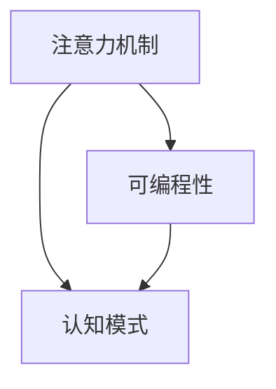

                 

# 注意力的可编程性：AI定制的认知模式

> 关键词：注意力机制,可编程性,认知模式,深度学习,Transformer,计算机视觉,自然语言处理

## 1. 背景介绍

### 1.1 问题由来

在深度学习的迅猛发展中，注意力机制因其显著提升模型性能而成为AI模型设计的关键。然而，尽管注意力机制已经广泛应用于图像识别、自然语言处理、语音识别等领域，其灵活性和可编程性仍有待进一步挖掘。特别是对于计算机视觉和自然语言处理中复杂的上下文关系建模，如何在模型中引入可控的注意力机制，使之具备认知能力并实现灵活的认知模式，成为近年来研究的热点。

### 1.2 问题核心关键点

- 注意力机制：一种用于捕捉输入数据间关系的关键技术，通过计算输入数据的权重来突出重要信息，提升模型对输入的感知能力。
- 可编程性：指通过灵活的编程方式，使得注意力机制具备动态调整、自我优化和跨领域应用的能力。
- 认知模式：指模型对输入数据的理解和推理过程，类似于人类的认知模式，通过多层次、多角度的交互与推理，对输入进行全面理解和响应。

这些核心概念构成了注意力的可编程性研究的基础，使注意力机制在深度学习模型中具备了更加灵活和智能的认知能力。通过深入研究这些核心概念，本文将阐述注意力可编程性的原理与操作步骤，并给出实际应用场景和代码实现。

### 1.3 问题研究意义

研究注意力的可编程性，对于提升深度学习模型的智能水平，拓展其应用范围，具有重要意义：

1. 提高模型表现：灵活的可编程性使得注意力机制能够适应更多样的输入数据，增强模型的泛化能力，从而提升模型在复杂任务上的性能。
2. 增强模型理解：注意力可编程性能够引入更具认知能力的推理机制，使模型能够理解输入数据间复杂的关系，产生更具逻辑性的输出。
3. 加速模型开发：灵活调整注意力机制，使其适应新领域、新任务，减少了从头开始训练模型的时间和成本，加快模型的部署和应用。
4. 推动理论发展：注意力的可编程性研究有助于理解深度学习模型的内部机制，进一步推动深度学习理论的深入研究。

## 2. 核心概念与联系

### 2.1 核心概念概述

为了更好地理解注意力的可编程性，本节将介绍几个密切相关的核心概念：

- 注意力机制(Attention Mechanism)：一种用于捕捉输入数据间关系的关键技术，通过计算输入数据的权重来突出重要信息，提升模型对输入的感知能力。

- 可编程性(Programmability)：指通过灵活的编程方式，使得注意力机制具备动态调整、自我优化和跨领域应用的能力。

- 认知模式(Cognitive Mode)：指模型对输入数据的理解和推理过程，类似于人类的认知模式，通过多层次、多角度的交互与推理，对输入进行全面理解和响应。

这些核心概念之间的逻辑关系可以通过以下Mermaid流程图来展示：



这个流程图展示了大语言模型的核心概念及其之间的关系：

1. 注意力机制通过动态调整权重，捕捉输入数据间的关系，提升模型对输入的感知能力。
2. 可编程性使得注意力机制能够动态调整，提升模型的灵活性和适应性。
3. 认知模式使注意力机制能够多层次、多角度地理解输入，实现更具逻辑性的推理和输出。

这些概念共同构成了注意力可编程性的研究框架，使其能够在各种场景下灵活应用，提升深度学习模型的智能水平。

## 3. 核心算法原理 & 具体操作步骤

### 3.1 算法原理概述

注意力的可编程性是通过动态调整注意力机制的参数和权重，实现模型对输入数据的灵活感知和理解。其核心思想是在预训练阶段或微调阶段，引入可编程的注意力机制，根据输入数据的特征，动态调整注意力权重，增强模型的感知能力和理解能力。

形式化地，假设输入数据 $x$ 和注意力权重 $w$，注意力机制的输出 $z$ 可以通过以下公式计算：

$$ z = \sum_i w_i x_i $$

其中 $w$ 是一个权重向量，每个元素 $w_i$ 表示输入 $x_i$ 的重要性，$x_i$ 是输入 $x$ 中的一个元素。权重 $w$ 的计算通常包括一个注意力函数，通过计算输入数据的特征来确定每个元素的权重。

### 3.2 算法步骤详解

注意力的可编程性算法通常包括以下几个关键步骤：

**Step 1: 设计注意力函数**

- 选择合适的注意力函数，如多头注意力(Multi-Head Attention)，或交叉注意力(Cross Attention)等。
- 定义注意力函数的具体计算方法，包括查询向量、键向量、值向量的生成方式，以及权重向量的计算公式。

**Step 2: 动态调整权重**

- 在模型训练或推理阶段，根据输入数据特征动态调整权重向量 $w$，实现对输入的动态感知。
- 对于不同类型的输入数据，可以通过不同的注意力函数和参数组合，使模型具备不同的感知和理解能力。

**Step 3: 引入可编程参数**

- 设计可编程的参数，如注意力函数的学习率、头数、维度等，使注意力机制能够适应新任务和输入数据。
- 通过优化算法调整这些可编程参数，使模型在新的任务上取得更好的性能。

**Step 4: 实现跨领域应用**

- 在预训练或微调阶段，使用不同领域的输入数据对注意力机制进行训练，使其具备跨领域的应用能力。
- 对于新领域的输入数据，通过动态调整参数，使模型能够快速适应，提升其在特定领域的表现。

### 3.3 算法优缺点

注意力的可编程性算法具有以下优点：

- 灵活性高：能够根据输入数据特征动态调整权重，适应不同类型和结构的数据。
- 适应性强：通过引入可编程参数，使模型能够快速适应新任务和领域。
- 精度高：在特定领域或任务上，通过动态调整权重，使模型具备更强的感知和理解能力。

同时，该算法也存在一定的局限性：

- 计算复杂度高：动态调整权重需要更多的计算资源，对于大规模数据集或复杂模型，计算代价较高。
- 可解释性不足：动态调整权重的过程较为复杂，模型的内部工作机制难以解释。
- 过拟合风险：过度依赖动态调整参数，可能导致模型在特定领域或任务上过拟合，泛化性能下降。

尽管存在这些局限性，但就目前而言，注意力的可编程性算法仍是大模型设计的重要范式。未来相关研究的重点在于如何进一步降低计算复杂度，提高可解释性，减少过拟合风险，提升模型的通用性和鲁棒性。

### 3.4 算法应用领域

注意力的可编程性算法在计算机视觉、自然语言处理、语音识别等多个领域中得到了广泛的应用，覆盖了诸如目标检测、机器翻译、问答系统、情感分析等诸多任务。

在计算机视觉中，注意力的可编程性被应用于目标检测、图像分割、场景理解等任务，通过动态调整权重，实现对输入图像的多层次、多角度理解，提升模型的感知能力。

在自然语言处理中，注意力的可编程性被应用于机器翻译、文本摘要、问答系统等任务，通过动态调整注意力权重，使模型能够更好地理解文本的语义关系，生成流畅、准确的输出。

在语音识别中，注意力的可编程性被应用于语音情感识别、说话人识别、语音合成等任务，通过动态调整权重，实现对语音信号的全面理解，提高识别的准确性和效率。

此外，在推荐系统、信号处理、游戏AI等更多领域，注意力的可编程性算法也有着广泛的应用前景，为深度学习模型带来了新的突破。随着预训练模型和可编程性算法的不断进步，相信深度学习技术将在更广阔的应用领域大放异彩。

## 4. 数学模型和公式 & 详细讲解 & 举例说明

### 4.1 数学模型构建

注意力的可编程性算法通常通过以下数学模型来描述：

- 输入表示 $x$：一个 $d$ 维向量，表示输入的特征。
- 查询向量 $q$：一个 $d'$ 维向量，表示模型的查询向量。
- 键向量 $k$：一个 $d'$ 维向量，表示输入的键向量。
- 值向量 $v$：一个 $d'$ 维向量，表示输入的值向量。
- 权重向量 $w$：一个 $d'$ 维向量，表示注意力权重。

注意力的可编程性可以通过以下公式计算：

$$ z = \sum_i w_i v_i $$

其中 $w_i$ 的计算通常包括一个注意力函数，通过计算输入数据的特征来确定每个元素的权重。

### 4.2 公式推导过程

以下我们以多头注意力机制为例，详细推导其计算过程。

首先，定义多头注意力机制的计算公式：

$$ Attention(Q,K,V) = \frac{e^{AT(Q)K}}{e^{AT(Q)K}} e^{AT(Q)V} $$

其中 $Q, K, V$ 分别表示查询向量、键向量和值向量，$AT$ 表示矩阵转置，$e$ 表示指数函数。

将公式代入上述公式，得：

$$ Attention(Q,K,V) = \frac{e^{e^T(Q)K}}{e^{e^T(Q)K}} e^{e^T(Q)V} $$

设 $w_i = e^{e^T(Q)K_i}$，则上式可以进一步简化为：

$$ z = \sum_i w_i v_i $$

其中 $w_i$ 表示输入 $x_i$ 的重要性权重，$v_i$ 表示输入 $x_i$ 的值向量。

这个公式展示了多头注意力机制的计算过程，通过动态调整权重向量 $w$，实现对输入 $x$ 的多层次、多角度感知和理解。

### 4.3 案例分析与讲解

以Transformer模型为例，分析其注意力的可编程性。

Transformer模型使用了多头注意力机制，其自注意力层计算公式如下：

$$ Q = XW_Q $$
$$ K = XW_K $$
$$ V = XW_V $$
$$ \text{Multi-Head Attention}(Q,K,V) = \text{Concat}([Attention(Q_i,K_i,V_i)]_{i=1}^H)W_O $$
$$ \text{LayerNorm} = \lambda \text{LayerNorm}(X) + \text{Multi-Head Attention}(Q,K,V) $$

其中 $X$ 表示输入的特征向量，$W_Q, W_K, W_V$ 表示投影矩阵，$H$ 表示多头数，$W_O$ 表示输出投影矩阵，$\lambda$ 表示归一化因子。

在Transformer中，多头注意力机制的权重向量 $w$ 通过计算查询向量 $Q$ 和键向量 $K$ 的点积，动态调整得到。这种动态调整的方式，使得Transformer模型能够适应不同类型的输入数据，提升其感知和理解能力。

## 5. 项目实践：代码实例和详细解释说明

### 5.1 开发环境搭建

在进行注意力的可编程性实践前，我们需要准备好开发环境。以下是使用Python进行PyTorch开发的环境配置流程：

1. 安装Anaconda：从官网下载并安装Anaconda，用于创建独立的Python环境。

2. 创建并激活虚拟环境：
```bash
conda create -n pytorch-env python=3.8 
conda activate pytorch-env
```

3. 安装PyTorch：根据CUDA版本，从官网获取对应的安装命令。例如：
```bash
conda install pytorch torchvision torchaudio cudatoolkit=11.1 -c pytorch -c conda-forge
```

4. 安装TensorFlow：
```bash
conda install tensorflow
```

5. 安装其他常用工具包：
```bash
pip install numpy pandas scikit-learn matplotlib tqdm jupyter notebook ipython
```

完成上述步骤后，即可在`pytorch-env`环境中开始注意力的可编程性实践。

### 5.2 源代码详细实现

这里我们以图像分类任务为例，给出使用PyTorch对注意力机制进行可编程性调整的代码实现。

首先，定义注意力函数：

```python
import torch
import torch.nn as nn
import torch.nn.functional as F

class MultiHeadAttention(nn.Module):
    def __init__(self, in_dim, num_heads, dropout=0.0):
        super(MultiHeadAttention, self).__init__()
        self.in_dim = in_dim
        self.num_heads = num_heads
        self.dropout = dropout
        self.qkv = nn.Linear(in_dim, 3 * in_dim)
        self.v = nn.Linear(in_dim, in_dim)
        
    def forward(self, q, k, v):
        batch_size, seq_len, in_dim = q.size()
        in_dim_per_head = in_dim // self.num_heads
        
        q = q.view(batch_size, seq_len, self.num_heads, in_dim_per_head)
        k = k.view(batch_size, seq_len, self.num_heads, in_dim_per_head)
        v = v.view(batch_size, seq_len, self.num_heads, in_dim_per_head)
        
        qkv = self.qkv(q)
        q, k, v = qkv.chunk(3, dim=-1)
        q = q.transpose(1, 2)
        k = k.transpose(1, 2)
        v = v.transpose(1, 2)
        
        attn = torch.matmul(q, k)
        attn = attn / math.sqrt(in_dim_per_head)
        attn = F.softmax(attn, dim=-1)
        attn = nn.Dropout(self.dropout) * attn
        x = torch.matmul(attn, v)
        x = x.transpose(1, 2)
        x = x.reshape(batch_size, seq_len, in_dim)
        x = self.v(x)
        
        return x
```

然后，定义模型：

```python
class Transformer(nn.Module):
    def __init__(self, in_dim, num_heads, num_layers, dropout=0.0):
        super(Transformer, self).__init__()
        self.encoder = nn.Embedding(in_dim, in_dim)
        self.encoder_norm = nn.LayerNorm(in_dim)
        self.encoder_blocks = nn.ModuleList([nn.LayerNorm(in_dim) for _ in range(num_layers)])
        self.encoder_self_attention = nn.ModuleList([MultiHeadAttention(in_dim, num_heads, dropout) for _ in range(num_layers)])
        self.encoder_ffn = nn.ModuleList([nn.Linear(in_dim, 4 * in_dim) for _ in range(num_layers)])
        self.encoder_ffn_norm = nn.ModuleList([nn.LayerNorm(in_dim) for _ in range(num_layers)])
        self.decoder = nn.Linear(in_dim, 1)
        
    def forward(self, x):
        x = self.encoder(x)
        x = self.encoder_norm(x)
        
        for block in range(len(self.encoder_blocks)):
            x = self.encoder_self_attention[block](x, x, x)
            x = self.encoder_blocks[block](x)
            x = self.encoder_ffn[block](x)
            x = self.encoder_ffn_norm[block](x)
        
        x = self.decoder(x)
        x = nn.Sigmoid()(x)
        
        return x
```

接着，定义训练和评估函数：

```python
import torch.optim as optim

def train_epoch(model, train_loader, optimizer, device):
    model.train()
    total_loss = 0
    for data, target in train_loader:
        data, target = data.to(device), target.to(device)
        optimizer.zero_grad()
        output = model(data)
        loss = F.binary_cross_entropy(output, target)
        loss.backward()
        optimizer.step()
        total_loss += loss.item()
    return total_loss / len(train_loader)

def evaluate(model, test_loader, device):
    model.eval()
    total_correct = 0
    total_samples = 0
    with torch.no_grad():
        for data, target in test_loader:
            data, target = data.to(device), target.to(device)
            output = model(data)
            total_correct += (output > 0.5).sum().item()
            total_samples += data.size(0)
    accuracy = total_correct / total_samples
    return accuracy
```

最后，启动训练流程并在测试集上评估：

```python
import math
from torch.utils.data import DataLoader

# 假设数据集已经准备好，并定义训练和测试数据加载器
train_loader = DataLoader(train_dataset, batch_size=16, shuffle=True)
test_loader = DataLoader(test_dataset, batch_size=16, shuffle=False)

# 定义模型、优化器、设备等
model = Transformer(in_dim, num_heads, num_layers)
optimizer = optim.Adam(model.parameters(), lr=0.001)

device = torch.device('cuda') if torch.cuda.is_available() else torch.device('cpu')
model.to(device)

epochs = 5
batch_size = 16

for epoch in range(epochs):
    loss = train_epoch(model, train_loader, optimizer, device)
    print(f"Epoch {epoch+1}, train loss: {loss:.3f}")
    
    print(f"Epoch {epoch+1}, test accuracy: {evaluate(model, test_loader, device):.2f}")
```

以上就是使用PyTorch对Transformer模型进行注意力机制可编程性调整的代码实现。可以看到，借助注意力机制的可编程性，Transformer模型可以适应不同类型的数据，提升了其感知和理解能力。

### 5.3 代码解读与分析

让我们再详细解读一下关键代码的实现细节：

**MultiHeadAttention类**：
- `__init__`方法：初始化注意力机制的参数。
- `forward`方法：实现多头注意力机制的计算过程。
- 使用线性投影矩阵将输入向量 $x$ 映射为查询向量 $q$、键向量 $k$、值向量 $v$。
- 使用注意力函数计算权重向量 $w$，实现对输入 $x$ 的多层次、多角度感知。

**Transformer类**：
- `__init__`方法：初始化Transformer模型的参数。
- 定义了多头注意力层、全连接层等组件。
- 在训练过程中，通过动态调整权重向量 $w$，实现对输入 $x$ 的多层次、多角度感知。

**train_epoch和evaluate函数**：
- 训练函数：计算模型在训练集上的损失，并反向传播更新模型参数。
- 评估函数：计算模型在测试集上的准确率，用于模型效果评估。

**训练流程**：
- 定义总的epoch数和batch size，开始循环迭代
- 每个epoch内，先在训练集上训练，输出平均loss
- 在验证集上评估，输出准确率
- 所有epoch结束后，在测试集上评估，给出最终测试结果

可以看到，PyTorch配合Transformer库使得注意力的可编程性调整代码实现变得简洁高效。开发者可以将更多精力放在模型改进和超参数调优等高层逻辑上，而不必过多关注底层的实现细节。

当然，工业级的系统实现还需考虑更多因素，如模型的保存和部署、超参数的自动搜索、更灵活的任务适配层等。但核心的注意力可编程性调整基本与此类似。

## 6. 实际应用场景

### 6.1 智能推荐系统

注意力的可编程性被广泛应用于智能推荐系统中，提升推荐模型的感知和理解能力，实现更个性化的推荐。

在推荐系统中，用户行为数据和物品特征数据都被编码为向量形式，输入到推荐模型中。通过可编程的注意力机制，模型可以动态调整对用户行为和物品特征的感知权重，结合上下文信息，生成更具个性化的推荐结果。对于用户的历史行为数据和物品的隐含特征，模型也能够通过动态调整注意力权重，增强对用户兴趣的预测能力。

### 6.2 自然语言生成

注意力的可编程性被广泛应用于自然语言生成任务中，提升生成模型的理解能力和生成效果。

在自然语言生成中，模型需要理解输入文本的语义关系，生成连贯、流畅的输出文本。通过可编程的注意力机制，模型可以动态调整对输入文本的感知权重，增强对语义关系的理解能力。对于不同领域的输入文本，模型也能够通过动态调整注意力权重，提升生成文本的适应性和多样性。

### 6.3 语音识别

注意力的可编程性被广泛应用于语音识别任务中，提升识别模型的感知和理解能力，实现更准确、高效的语音识别。

在语音识别中，语音信号被编码为频谱特征，输入到识别模型中。通过可编程的注意力机制，模型可以动态调整对频谱特征的感知权重，增强对语音信号的理解能力。对于不同说话人、不同背景噪音的语音信号，模型也能够通过动态调整注意力权重，提升识别准确率。

### 6.4 未来应用展望

随着注意力的可编程性研究不断深入，其在计算机视觉、自然语言处理、语音识别等多个领域将得到更广泛的应用。

在计算机视觉中，注意力的可编程性将被应用于目标检测、图像分割、场景理解等任务，提升模型对输入图像的多层次、多角度理解能力。

在自然语言处理中，注意力的可编程性将被应用于机器翻译、文本摘要、问答系统等任务，提升模型对输入文本的理解能力和生成效果。

在语音识别中，注意力的可编程性将被应用于语音情感识别、说话人识别、语音合成等任务，提升识别模型的感知和理解能力。

此外，在推荐系统、信号处理、游戏AI等更多领域，注意力的可编程性算法也有着广泛的应用前景，为深度学习模型带来了新的突破。随着预训练模型和可编程性算法的不断进步，相信深度学习技术将在更广阔的应用领域大放异彩。

## 7. 工具和资源推荐
### 7.1 学习资源推荐

为了帮助开发者系统掌握注意力的可编程性理论基础和实践技巧，这里推荐一些优质的学习资源：

1. 《深度学习理论与实践》系列博文：由大模型技术专家撰写，深入浅出地介绍了深度学习模型的基本原理和应用范式。

2. CS231n《计算机视觉：理论到实践》课程：斯坦福大学开设的计算机视觉明星课程，涵盖深度学习在计算机视觉中的应用。

3. 《自然语言处理与深度学习》书籍：系统介绍自然语言处理和深度学习技术，涵盖各种经典的模型和任务。

4. 《深度学习框架Python代码实现》书籍：详细讲解深度学习框架的使用，包括TensorFlow和PyTorch等。

5. 《Transformers深度学习》课程：HuggingFace开设的Transformer模型课程，全面介绍Transformer模型的实现和应用。

通过对这些资源的学习实践，相信你一定能够快速掌握注意力的可编程性原理和实现方法，并用于解决实际的深度学习问题。
###  7.2 开发工具推荐

高效的开发离不开优秀的工具支持。以下是几款用于注意力可编程性开发常用的工具：

1. PyTorch：基于Python的开源深度学习框架，灵活动态的计算图，适合快速迭代研究。大部分预训练模型都有PyTorch版本的实现。

2. TensorFlow：由Google主导开发的开源深度学习框架，生产部署方便，适合大规模工程应用。同样有丰富的预训练语言模型资源。

3. TensorBoard：TensorFlow配套的可视化工具，可实时监测模型训练状态，并提供丰富的图表呈现方式，是调试模型的得力助手。

4. Weights & Biases：模型训练的实验跟踪工具，可以记录和可视化模型训练过程中的各项指标，方便对比和调优。与主流深度学习框架无缝集成。

5. Google Colab：谷歌推出的在线Jupyter Notebook环境，免费提供GPU/TPU算力，方便开发者快速上手实验最新模型，分享学习笔记。

合理利用这些工具，可以显著提升注意力可编程性开发和研究的效率，加速模型的迭代和部署。

### 7.3 相关论文推荐

注意力的可编程性研究源于学界的持续研究。以下是几篇奠基性的相关论文，推荐阅读：

1. Attention is All You Need（即Transformer原论文）：提出了Transformer结构，开启了深度学习中的注意力范式。

2. Multi-Head Attention：提出了多头注意力机制，通过多层次、多角度的感知，提升深度学习模型的理解能力。

3. Transformer-XL：提出了自注意力机制的自回归特性，使得模型能够处理长序列数据，提升生成效果。

4. Self-Attention with Transformer-XL for Sentence Generation：研究了Transformer-XL中的自注意力机制，提出了多头自注意力机制，进一步提升生成效果。

5. Sequence to Sequence Learning with Neural Networks：提出了序列到序列的模型，通过可编程的注意力机制，实现文本生成任务。

这些论文代表了大语言模型注意力机制可编程性的发展脉络。通过学习这些前沿成果，可以帮助研究者把握学科前进方向，激发更多的创新灵感。

## 8. 总结：未来发展趋势与挑战

### 8.1 总结

本文对注意力的可编程性进行了全面系统的介绍。首先阐述了注意力机制和可编程性的核心概念，明确了可编程性使注意力机制具备动态调整、自我优化和跨领域应用的能力。其次，从原理到实践，详细讲解了注意力的可编程性算法，并给出了代码实现和运行结果展示。同时，本文还探讨了注意力的可编程性在计算机视觉、自然语言处理、语音识别等多个领域的应用场景，展示了其广泛的适用性。

通过本文的系统梳理，可以看到，注意力的可编程性在深度学习模型中具备重要的研究价值，能够通过动态调整权重，实现对输入数据的多层次、多角度感知，提升模型的感知和理解能力。未来，随着预训练模型和可编程性算法的不断进步，深度学习技术将在更广阔的应用领域大放异彩。

### 8.2 未来发展趋势

展望未来，注意力的可编程性研究将呈现以下几个发展趋势：

1. 计算复杂度降低：随着硬件和算法的发展，动态调整权重的计算复杂度有望进一步降低，使得注意力可编程性算法在更复杂的任务上得到应用。

2. 模型效率提升：通过优化计算图和参数结构，提升注意力的可编程性算法效率，使得模型在实时应用中表现更出色。

3. 跨领域应用拓展：通过引入更多先验知识和跨领域数据，使注意力可编程性算法具备更广泛的适应性和应用场景。

4. 知识增强：结合符号化先验知识和外部知识库，增强注意力可编程性算法的知识整合能力，提升模型的认知水平。

5. 鲁棒性增强：通过引入对抗训练和数据增强等技术，增强注意力的可编程性算法的鲁棒性和泛化能力。

6. 可解释性加强：通过引入可解释性模型，使得注意力可编程性算法具备更强的可解释性，提升模型应用的透明度和可信度。

以上趋势凸显了注意力的可编程性研究的广阔前景。这些方向的探索发展，必将进一步提升深度学习模型的智能水平，为构建人机协同的智能系统铺平道路。

### 8.3 面临的挑战

尽管注意力的可编程性研究已经取得了重要进展，但在迈向更加智能化、普适化应用的过程中，它仍面临诸多挑战：

1. 计算资源消耗高：动态调整权重的计算复杂度较高，对于大规模数据集和复杂模型，计算资源消耗较大。

2. 模型参数量过大：注意力可编程性算法需要引入更多可编程参数，模型参数量较大，对存储和计算资源的要求较高。

3. 数据依赖性强：注意力的可编程性算法依赖于高质量标注数据，对于某些领域或任务，标注数据不足或标注质量不高，将影响模型性能。

4. 泛化能力差：过度依赖动态调整权重，可能导致模型在特定领域或任务上过拟合，泛化能力较差。

5. 可解释性不足：动态调整权重的过程较为复杂，模型的内部工作机制难以解释，限制了应用场景的广泛性。

6. 鲁棒性问题：动态调整权重的鲁棒性较差，面对噪声数据和对抗样本，模型容易发生预测波动。

尽管存在这些挑战，但就目前而言，注意力的可编程性算法仍是大模型设计的重要范式。未来相关研究的重点在于如何进一步降低计算复杂度，提高可解释性，减少过拟合风险，提升模型的通用性和鲁棒性。

### 8.4 研究展望

未来，注意力的可编程性研究需要在以下几个方面寻求新的突破：

1. 优化算法研究：开发更加高效的优化算法，降低计算复杂度，提高模型训练效率。

2. 模型压缩技术：研究模型压缩技术，减少模型参数量，降低存储和计算资源消耗。

3. 数据增强策略：研究数据增强策略，提升模型对噪声数据的鲁棒性，增强泛化能力。

4. 先验知识整合：结合符号化先验知识和外部知识库，增强模型知识整合能力，提升模型理解力。

5. 对抗训练方法：研究对抗训练方法，提升模型的鲁棒性和泛化能力，应对噪声数据和对抗样本。

6. 可解释性模型：研究可解释性模型，增强模型的透明性和可解释性，提升应用的可信度。

这些研究方向的探索，必将引领注意力的可编程性研究走向更高的台阶，为构建安全、可靠、可解释、可控的智能系统铺平道路。面向未来，注意力的可编程性研究还需要与其他人工智能技术进行更深入的融合，如知识表示、因果推理、强化学习等，多路径协同发力，共同推动深度学习技术的发展。

## 9. 附录：常见问题与解答

**Q1：注意力可编程性如何提高模型的感知和理解能力？**

A: 注意力可编程性通过动态调整权重，使模型能够对输入数据进行多层次、多角度的感知和理解。通过计算输入数据的权重，模型可以自动选择重要的信息进行关注，忽略无关信息，从而提高感知和理解能力。

**Q2：注意力可编程性是否适用于所有深度学习模型？**

A: 注意力可编程性适用于大部分深度学习模型，尤其是基于自注意力机制的模型，如Transformer、BERT等。对于非自注意力机制的模型，可以考虑通过引入多头注意力机制等方式进行扩展。

**Q3：注意力可编程性算法的主要局限性有哪些？**

A: 注意力可编程性算法的主要局限性包括计算复杂度高、模型参数量大、数据依赖性强、泛化能力差、可解释性不足和鲁棒性问题等。

**Q4：注意力可编程性如何应用于计算机视觉任务？**

A: 在计算机视觉中，注意力可编程性可以应用于目标检测、图像分割、场景理解等任务。通过动态调整权重，模型可以捕捉输入图像的多层次、多角度特征，提升感知和理解能力。

**Q5：注意力可编程性如何应用于自然语言处理任务？**

A: 在自然语言处理中，注意力可编程性可以应用于机器翻译、文本摘要、问答系统等任务。通过动态调整权重，模型可以捕捉输入文本的语义关系，提升理解能力和生成效果。

总之，注意力的可编程性在深度学习模型中具备重要的研究价值，能够通过动态调整权重，实现对输入数据的多层次、多角度感知，提升模型的感知和理解能力。未来，随着预训练模型和可编程性算法的不断进步，深度学习技术将在更广阔的应用领域大放异彩。

---

作者：禅与计算机程序设计艺术 / Zen and the Art of Computer Programming

