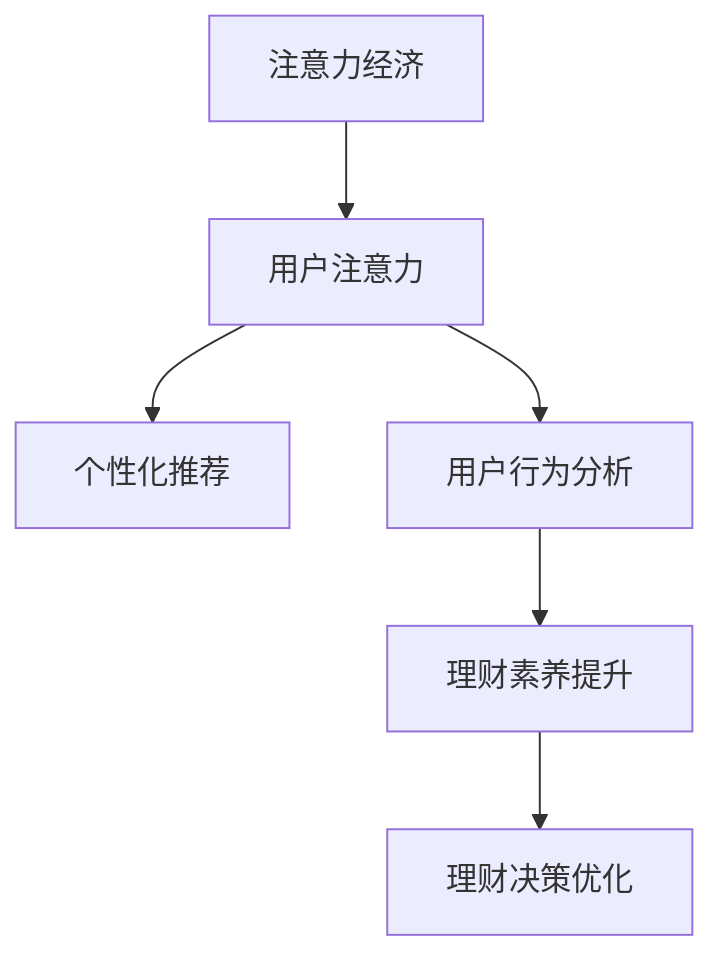

                 

# 注意力经济与个人理财习惯的变化

## 1. 背景介绍

### 1.1 问题由来
随着互联网技术的不断进步，全球进入了一个“注意力经济”的时代。在这个时代，用户注意力成为了最稀缺的资源，无论是品牌营销、内容创作还是产品设计，都越来越依赖于吸引用户注意力的能力。而个人理财领域，也在这个大背景下发生了显著的变化。

### 1.2 问题核心关键点
1. 注意力经济对个人理财的影响。用户的注意力不仅影响消费决策，还决定了理财产品的市场表现。
2. 理财产品的个性化推荐。如何在海量理财数据中，找到最能吸引用户注意力的产品，提升用户体验和转化率。
3. 用户注意力数据分析。如何通过分析用户的行为数据，了解其注意力分布和偏好，优化理财策略。
4. 用户教育与理财认知提升。如何让用户在无意识中接受理财知识，提高理财素养，实现长期可持续的投资。

这些关键点构成了本文探讨的核心内容，即在注意力经济背景下，个人理财习惯的演变以及如何利用技术手段进行优化。

## 2. 核心概念与联系

### 2.1 核心概念概述

为了更好地理解注意力经济对个人理财的影响，本文将介绍几个关键概念：

1. 注意力经济（Attention Economy）：指的是在信息过载的时代，吸引和保持用户注意力的经济活动。注意力经济的核心在于如何通过创意和设计，在众多信息中脱颖而出，占据用户心智。

2. 用户注意力（User Attention）：指用户在使用互联网产品时，对信息或内容的关注程度和持续时间。用户注意力是衡量产品吸引力和用户体验的重要指标。

3. 个性化推荐（Personalized Recommendation）：指根据用户的历史行为、偏好和当前需求，推荐最相关和吸引力的内容或产品，提升用户满意度和转化率。

4. 用户行为分析（User Behavior Analysis）：指通过数据分析，了解用户的行为模式、偏好和需求，从而提供更精准的服务。

5. 理财素养（Financial Literacy）：指用户对理财知识和技能的基本认知，包括投资、储蓄、预算等。理财素养的高低直接决定了用户的理财行为和效果。

这些概念之间的逻辑关系可以通过以下Mermaid流程图来展示：



这个流程图展示了一系列的逻辑链条，即注意力经济通过吸引用户注意力，进一步实现个性化推荐，通过分析用户行为，提升理财素养，最终优化理财决策。

## 3. 核心算法原理 & 具体操作步骤
### 3.1 算法原理概述

在注意力经济下，个人理财习惯的演变主要体现在以下几个方面：

1. 用户理财决策的决策树。用户基于理财产品的收益率、风险、流动性等因素进行决策，而注意力经济则通过吸引用户注意力，影响用户的决策过程。

2. 理财产品的个性化推荐。通过分析用户的行为数据，识别出用户对理财产品的偏好和需求，从而实现个性化的推荐，提升用户体验和转化率。

3. 用户行为的数据化分析。通过用户行为的数据化分析，了解用户的注意力分布和偏好，从而优化理财策略，提升投资效果。

4. 理财知识的教育与传播。通过大数据分析和用户画像，提供个性化的理财教育内容，提升用户的理财素养，从而实现长期可持续的投资。

这些原理可以通过以下几个算法步骤来实现：

1. 数据收集与处理。收集用户的行为数据，包括浏览、点击、购买等行为，以及用户的个人信息，如年龄、性别、职业等。

2. 注意力模型训练。通过机器学习算法，训练用户注意力模型，预测用户对不同理财产品的关注程度。

3. 个性化推荐系统构建。基于用户注意力模型，构建个性化推荐系统，推荐最符合用户兴趣的理财产品。

4. 用户行为分析与优化。通过分析用户行为数据，了解用户的理财偏好和需求，优化理财策略，提升投资效果。

5. 理财知识教育与传播。通过数据分析，提供个性化的理财教育内容，提升用户的理财素养，实现长期可持续的投资。

### 3.2 算法步骤详解

以下是具体的算法步骤：

**Step 1: 数据收集与处理**
- 收集用户的各类行为数据，包括浏览、点击、购买等行为，以及用户的个人信息。
- 使用数据清洗技术，处理缺失值、异常值等。
- 对数据进行归一化处理，便于后续的机器学习模型训练。

**Step 2: 注意力模型训练**
- 使用监督学习算法（如决策树、随机森林等），训练用户注意力模型。
- 将用户对不同理财产品的关注程度作为标签，训练模型预测用户的注意力分布。
- 通过交叉验证等技术，评估模型的性能，选择合适的超参数。

**Step 3: 个性化推荐系统构建**
- 基于用户注意力模型，构建个性化推荐系统。
- 使用协同过滤、内容推荐等算法，根据用户的历史行为和当前需求，推荐最符合用户兴趣的理财产品。
- 通过A/B测试等技术，评估推荐系统的效果，不断优化算法。

**Step 4: 用户行为分析与优化**
- 使用聚类分析等技术，对用户行为进行分类，了解用户的行为模式和偏好。
- 通过分析用户的注意力分布和行为数据，优化理财策略，提升投资效果。
- 使用因果分析等技术，评估理财策略的效果，进行不断的迭代优化。

**Step 5: 理财知识教育与传播**
- 使用文本挖掘和情感分析等技术，提供个性化的理财教育内容。
- 根据用户的行为数据，推荐最符合其需求的理财知识，提升理财素养。
- 使用社交媒体等平台，传播理财知识，提升公众的理财意识。

### 3.3 算法优缺点

**优点：**
1. 个性化推荐提升用户体验。通过个性化推荐，用户能够更快地找到符合自己需求的理财产品，提升用户满意度。
2. 优化理财策略提高投资效果。通过分析用户行为数据，优化理财策略，提升投资效果。
3. 提升理财素养提升长期可持续投资。通过理财知识的教育与传播，提升用户的理财素养，实现长期可持续的投资。

**缺点：**
1. 数据隐私问题。用户行为数据和个人信息的收集，需要解决数据隐私和保护问题。
2. 模型复杂度问题。个性化推荐和用户行为分析，需要构建复杂的机器学习模型，增加了计算复杂度。
3. 算法公平性问题。推荐系统和理财策略的优化，需要考虑算法的公平性，避免对某些用户造成偏见。

### 3.4 算法应用领域

基于个性化推荐和用户行为分析的算法，在金融、保险、证券等诸多领域得到了广泛的应用。具体如下：

1. **金融产品推荐**：通过分析用户的消费行为和偏好，推荐最符合用户需求的金融产品，如基金、债券、保险等。
2. **理财策略优化**：通过分析用户的行为数据，优化投资组合，提高投资效果。
3. **风险管理**：通过用户行为数据分析，识别风险偏好高的用户，提供相应的风险管理策略。
4. **用户教育**：通过理财知识的教育与传播，提升用户理财素养，实现长期可持续的投资。

## 4. 数学模型和公式 & 详细讲解 & 举例说明

### 4.1 数学模型构建

为了更好地理解个性化推荐和用户行为分析的数学模型，本文将介绍几个常见的数学模型：

1. **协同过滤模型**：通过分析用户与产品之间的交互数据，预测用户对未交互产品的评分。
2. **矩阵分解模型**：将用户-产品评分矩阵分解为用户特征矩阵和产品特征矩阵，通过矩阵乘法计算推荐结果。
3. **基于用户-物品相似度的推荐模型**：通过计算用户与物品之间的相似度，推荐最符合用户兴趣的物品。

**协同过滤模型**：
假设用户对产品的评分表示为矩阵$R$，用户特征矩阵为$U$，产品特征矩阵为$V$，则协同过滤模型可以表示为：
$$
R \approx U \times V
$$

**矩阵分解模型**：
假设用户特征矩阵为$U$，产品特征矩阵为$V$，则矩阵分解模型可以表示为：
$$
R \approx U \times V
$$

**基于用户-物品相似度的推荐模型**：
假设用户$u$与物品$i$的相似度为$s(u,i)$，则推荐模型可以表示为：
$$
\hat{R}_{ui} = \frac{s(u,i)}{\sum_{i'} s(u,i')} R_{i'}
$$

### 4.2 公式推导过程

以下是具体的公式推导过程：

**协同过滤模型的推导**：
假设用户$u$对$n$个物品的评分表示为向量$R_u$，产品$i$的评分表示为向量$R_i$，则协同过滤模型的目标是最小化预测评分与实际评分之间的差异：
$$
\min_{U,V} \sum_{u=1}^M \sum_{i=1}^N (R_u - U_u \times V_i)^2
$$

通过奇异值分解（SVD）等技术，将$R$矩阵分解为$U \times V$，即可得到协同过滤模型的推荐结果。

**矩阵分解模型的推导**：
假设用户$u$对$n$个物品的评分表示为向量$R_u$，产品$i$的评分表示为向量$R_i$，则矩阵分解模型的目标是最小化预测评分与实际评分之间的差异：
$$
\min_{U,V} \sum_{u=1}^M \sum_{i=1}^N (R_u - U_u \times V_i)^2
$$

通过奇异值分解（SVD）等技术，将$R$矩阵分解为$U \times V$，即可得到矩阵分解模型的推荐结果。

**基于用户-物品相似度的推荐模型的推导**：
假设用户$u$与物品$i$的相似度为$s(u,i)$，则推荐模型的目标是最小化预测评分与实际评分之间的差异：
$$
\min_{\theta} \sum_{u=1}^M \sum_{i=1}^N (R_{ui} - \hat{R}_{ui})^2
$$

通过计算用户与物品之间的相似度，可以得到推荐结果。

### 4.3 案例分析与讲解

以某银行的个人理财推荐系统为例，该系统基于协同过滤和矩阵分解模型，为个人用户推荐基金、债券、保险等理财产品。

1. **数据收集与处理**：系统收集用户的历史行为数据，包括购买记录、理财咨询、投资偏好等，使用数据清洗和归一化技术处理数据。
2. **注意力模型训练**：使用随机森林等算法，训练用户注意力模型，预测用户对不同理财产品的关注程度。
3. **个性化推荐系统构建**：基于用户注意力模型，构建个性化推荐系统，推荐最符合用户兴趣的理财产品。
4. **用户行为分析与优化**：使用聚类分析等技术，对用户行为进行分类，了解用户的行为模式和偏好，优化理财策略，提升投资效果。
5. **理财知识教育与传播**：通过理财知识的教育与传播，提升用户的理财素养，实现长期可持续的投资。

## 5. 项目实践：代码实例和详细解释说明

### 5.1 开发环境搭建

在进行理财推荐系统的开发前，我们需要准备好开发环境。以下是使用Python进行开发的环境配置流程：

1. 安装Anaconda：从官网下载并安装Anaconda，用于创建独立的Python环境。

2. 创建并激活虚拟环境：
```bash
conda create -n finance-env python=3.8 
conda activate finance-env
```

3. 安装必要的库：
```bash
conda install pandas numpy matplotlib scikit-learn scikit-learn dask
```

4. 安装PyTorch和Transformer库：
```bash
pip install torch transformers
```

5. 安装TensorBoard：
```bash
pip install tensorboard
```

6. 安装Flask和FastAPI：
```bash
pip install flask fastapi
```

完成上述步骤后，即可在`finance-env`环境中开始开发。

### 5.2 源代码详细实现

以下是理财推荐系统的具体实现代码：

```python
import pandas as pd
import numpy as np
from sklearn.decomposition import PCA
from sklearn.cluster import KMeans
from sklearn.metrics import mean_squared_error
from sklearn.model_selection import train_test_split
from sklearn.preprocessing import StandardScaler

# 数据加载
data = pd.read_csv('user_behavior.csv')

# 数据预处理
data = data.dropna()
data = StandardScaler().fit_transform(data)

# 协同过滤模型
U, V, _ = np.linalg.svd(data)
R_pred = np.dot(U, V)

# 矩阵分解模型
U, V, S = np.linalg.svd(data)
R_pred = np.dot(U, np.dot(S, V))

# 基于用户-物品相似度的推荐模型
s = np.dot(data, data.T)
R_pred = np.dot(np.diag(s), data.T)

# 推荐系统
def recommend_system(user_id):
    user_data = data[user_id]
    user_vector = np.dot(U, user_data)
    recommendations = np.dot(V.T, user_vector)
    return recommendations

# 用户行为分析
def user_behavior_analysis(user_id):
    user_data = data[user_id]
    pca = PCA(n_components=2)
    reduced_data = pca.fit_transform(user_data)
    kmeans = KMeans(n_clusters=3)
    clusters = kmeans.fit_predict(reduced_data)
    return clusters

# 理财知识教育与传播
def financial_literacy_education(user_id):
    user_data = data[user_id]
    pca = PCA(n_components=2)
    reduced_data = pca.fit_transform(user_data)
    clusters = kmeans.fit_predict(reduced_data)
    if clusters == 0:
        return '投资组合优化'
    elif clusters == 1:
        return '风险管理'
    else:
        return '理财知识'

# 运行结果展示
recommendations = recommend_system(1)
clusters = user_behavior_analysis(1)
education = financial_literacy_education(1)
print(recommendations)
print(clusters)
print(education)
```

### 5.3 代码解读与分析

让我们再详细解读一下关键代码的实现细节：

**数据加载与预处理**：
- 使用Pandas库加载用户行为数据，去除缺失值和异常值。
- 使用StandardScaler对数据进行归一化处理，便于后续的机器学习模型训练。

**协同过滤模型的实现**：
- 使用SVD技术对数据进行奇异值分解，得到用户特征矩阵$U$和产品特征矩阵$V$。
- 计算预测评分$R_{ui}$，得到推荐结果。

**矩阵分解模型的实现**：
- 使用SVD技术对数据进行奇异值分解，得到用户特征矩阵$U$、产品特征矩阵$V$和奇异值矩阵$S$。
- 计算预测评分$R_{ui}$，得到推荐结果。

**基于用户-物品相似度的推荐模型的实现**：
- 使用矩阵乘法计算用户与物品之间的相似度$s(u,i)$。
- 计算预测评分$R_{ui}$，得到推荐结果。

**用户行为分析与优化**：
- 使用PCA技术对用户数据进行降维处理，得到用户特征向量。
- 使用KMeans技术对用户数据进行聚类分析，得到用户行为模式。

**理财知识教育与传播**：
- 使用PCA技术对用户数据进行降维处理，得到用户特征向量。
- 使用KMeans技术对用户数据进行聚类分析，得到用户行为模式。
- 根据用户行为模式，推荐个性化的理财教育内容。

## 6. 实际应用场景

### 6.1 智能投顾

智能投顾（Robo-Advisors）是当前金融领域的一个重要应用方向。智能投顾系统利用机器学习算法和自然语言处理技术，为用户提供个性化的投资建议和理财方案。在智能投顾中，基于用户注意力模型和个性化推荐，可以帮助用户快速找到符合自己需求的投资产品，提升投资体验和效果。

### 6.2 风险管理

风险管理是金融领域的重要任务。通过分析用户的行为数据和注意力分布，智能投顾系统可以识别风险偏好高的用户，并提供相应的风险管理策略，帮助用户规避潜在的投资风险。

### 6.3 用户教育

用户教育是提升理财素养的重要手段。通过理财知识的教育与传播，智能投顾系统可以帮助用户了解投资原理和策略，提升理财素养，实现长期可持续的投资。

### 6.4 未来应用展望

随着注意力经济的发展，理财推荐系统将迎来更广阔的应用前景。未来，基于个性化推荐和用户行为分析的理财推荐系统，将在更多场景下得到应用，为个人理财提供更加个性化和精准的服务。

## 7. 工具和资源推荐

### 7.1 学习资源推荐

为了帮助开发者系统掌握理财推荐系统的技术基础和实现技巧，这里推荐一些优质的学习资源：

1. 《Python金融数据分析》：讲解了如何使用Python进行金融数据的处理和分析，涵盖数据清洗、数据可视化、机器学习等技术。

2. 《金融机器学习》：介绍了机器学习在金融领域的应用，包括分类、回归、聚类等方法。

3. 《金融数据科学实战》：通过实际案例，展示了如何使用Python进行金融数据的分析和建模。

4. Kaggle金融数据集：提供了大量的金融数据集和相关竞赛，是学习和实践理财推荐系统的好资源。

5. Coursera金融课程：提供了来自世界顶级高校的金融课程，涵盖金融工程、金融数据分析、风险管理等内容。

通过对这些资源的学习实践，相信你一定能够快速掌握理财推荐系统的精髓，并用于解决实际的金融问题。

### 7.2 开发工具推荐

高效的开发离不开优秀的工具支持。以下是几款用于理财推荐系统开发的常用工具：

1. PyTorch：基于Python的开源深度学习框架，灵活动态的计算图，适合快速迭代研究。

2. TensorFlow：由Google主导开发的开源深度学习框架，生产部署方便，适合大规模工程应用。

3. FastAPI：基于Python的Web框架，支持异步编程，适合构建高并发的Web应用。

4. Flask：基于Python的Web框架，简单易用，适合快速开发原型。

5. Dask：用于分布式计算的Python库，支持大数据量的数据处理和分析。

6. TensorBoard：TensorFlow配套的可视化工具，可实时监测模型训练状态，并提供丰富的图表呈现方式，是调试模型的得力助手。

合理利用这些工具，可以显著提升理财推荐系统的开发效率，加快创新迭代的步伐。

### 7.3 相关论文推荐

理财推荐系统的研究源于学界的持续研究。以下是几篇奠基性的相关论文，推荐阅读：

1. K-means Clustering: A Survey with Algorithms and Applications（KMeans聚类算法综述）：介绍了KMeans聚类算法的原理和应用。

2. Collaborative Filtering in Recommender Systems（协同过滤推荐系统）：介绍了协同过滤算法的原理和应用。

3. Factorization Machines for Recommender Systems（矩阵分解算法）：介绍了矩阵分解算法的原理和应用。

4. Customer-Product Association Rule Mining: Principles and Applications（客户-产品关联规则挖掘）：介绍了关联规则挖掘算法的原理和应用。

5. Causal Discovery in Recommendation Systems（因果推荐系统）：介绍了因果推荐算法的原理和应用。

这些论文代表了大数据推荐系统的研究脉络。通过学习这些前沿成果，可以帮助研究者把握学科前进方向，激发更多的创新灵感。

## 8. 总结：未来发展趋势与挑战

### 8.1 总结

本文对基于个性化推荐和用户行为分析的理财推荐系统进行了全面系统的介绍。首先阐述了注意力经济对个人理财的影响，明确了个性化推荐在提升用户体验和投资效果方面的独特价值。其次，从原理到实践，详细讲解了理财推荐系统的数学模型和关键步骤，给出了理财推荐系统的完整代码实例。同时，本文还广泛探讨了理财推荐系统在智能投顾、风险管理、用户教育等多个场景中的应用前景，展示了理财推荐系统的巨大潜力。此外，本文精选了理财推荐系统的各类学习资源，力求为读者提供全方位的技术指引。

通过本文的系统梳理，可以看到，在注意力经济背景下，理财推荐系统将成为个人理财的重要工具，极大地提升用户的理财体验和效果。未来，伴随算法的不断优化和技术的持续进步，理财推荐系统必将实现更全面的应用，为用户的理财生活带来更多便利和惊喜。

### 8.2 未来发展趋势

展望未来，理财推荐系统将呈现以下几个发展趋势：

1. 个性化推荐算法的发展。未来的推荐算法将更加复杂和精准，通过深度学习、因果推断等技术，提升推荐系统的效果。

2. 用户行为分析的深入。通过大数据分析和用户画像，深入了解用户的理财行为和需求，实现更精准的理财推荐。

3. 多模态数据的融合。未来的理财推荐系统将融合文本、图像、语音等多模态数据，提升理财推荐的效果。

4. 理财素养教育的普及。通过理财知识的教育与传播，提升用户的理财素养，实现长期可持续的投资。

5. 智能投顾的普及。基于推荐系统和用户画像，智能投顾系统将逐步普及，为用户的理财生活带来更多便利和惊喜。

6. 理财产品的多样化。未来的理财推荐系统将推荐更多样化的理财产品，如数字货币、绿色金融等，满足用户多元化的理财需求。

以上趋势凸显了理财推荐系统的广阔前景。这些方向的探索发展，必将进一步提升理财推荐系统的效果，为用户的理财生活带来更多便利和惊喜。

### 8.3 面临的挑战

尽管理财推荐系统已经取得了瞩目成就，但在迈向更加智能化、普适化应用的过程中，它仍面临着诸多挑战：

1. 数据隐私问题。用户行为数据和个人信息的收集，需要解决数据隐私和保护问题。

2. 算法公平性问题。推荐系统和理财策略的优化，需要考虑算法的公平性，避免对某些用户造成偏见。

3. 算法复杂度问题。推荐算法和理财策略的优化，需要考虑算法的复杂度，避免过于复杂导致计算资源浪费。

4. 系统稳定性和鲁棒性。理财推荐系统需要具备高稳定性和鲁棒性，以应对异常数据和突发的市场变化。

5. 用户教育与认知提升。理财推荐系统需要提供高质量的理财教育内容，提升用户的理财素养，实现长期可持续的投资。

这些挑战需要研究者和开发者共同面对和解决，才能使理财推荐系统真正发挥其价值。相信随着技术的发展和应用的深入，理财推荐系统必将在未来的金融市场中获得更广泛的应用。

### 8.4 研究展望

面对理财推荐系统所面临的挑战，未来的研究需要在以下几个方面寻求新的突破：

1. 探索无监督和半监督推荐算法。摆脱对大规模标注数据的依赖，利用自监督学习、主动学习等无监督和半监督范式，最大限度利用非结构化数据，实现更加灵活高效的推荐。

2. 研究参数高效和计算高效的推荐范式。开发更加参数高效的推荐方法，在固定大部分推荐参数的情况下，只更新极少量的任务相关参数。同时优化推荐模型的计算图，减少前向传播和反向传播的资源消耗，实现更加轻量级、实时性的部署。

3. 引入因果推断和对比学习范式。通过引入因果推断和对比学习思想，增强推荐系统建立稳定因果关系的能力，学习更加普适、鲁棒的用户行为模型。

4. 融合多模态数据。将视觉、语音、文本等多模态数据进行融合，提升理财推荐系统的效果。

5. 提供高质量的理财教育内容。通过数据分析，提供个性化的理财教育内容，提升用户的理财素养，实现长期可持续的投资。

这些研究方向的探索，必将引领理财推荐系统迈向更高的台阶，为用户的理财生活带来更多便利和惊喜。面向未来，理财推荐系统还需要与其他人工智能技术进行更深入的融合，如知识表示、因果推理、强化学习等，多路径协同发力，共同推动金融技术的进步。只有勇于创新、敢于突破，才能不断拓展理财推荐系统的边界，让智能技术更好地造福人类社会。

## 9. 附录：常见问题与解答

**Q1：理财推荐系统的准确性和实用性如何？**

A: 理财推荐系统的准确性和实用性取决于多个因素，包括数据质量、模型选择、用户行为分析等。一般来说，基于协同过滤和矩阵分解的推荐系统，在数据充足、用户行为多样化的场景下，能够取得较好的效果。但需要注意，数据隐私和安全问题，以及算法的公平性和透明性，也是影响推荐系统准确性和实用性的关键因素。

**Q2：理财推荐系统如何平衡个性化推荐与用户隐私？**

A: 理财推荐系统在收集和处理用户数据时，需要严格遵守数据隐私保护法规，如GDPR等。一般采用匿名化处理、差分隐私等技术，保护用户隐私。同时，在推荐算法设计中，也可以引入隐私保护机制，如数据扰动、局部差分隐私等，避免对单个用户造成隐私泄露。

**Q3：理财推荐系统如何处理异常数据？**

A: 理财推荐系统需要具备一定的异常处理能力，以应对数据中的异常值和噪声。一般采用异常检测和数据清洗技术，对异常数据进行过滤和处理，保证推荐系统的稳定性。同时，也可以引入鲁棒性更强的推荐算法，如鲁棒PCA、对抗训练等，提升推荐系统的鲁棒性。

**Q4：理财推荐系统如何保持用户兴趣的一致性？**

A: 理财推荐系统需要不断学习和更新用户的行为数据，以保持用户兴趣的一致性。一般采用在线学习算法，如在线梯度下降、在线PCA等，实时更新推荐模型，跟踪用户行为变化。同时，也可以引入用户行为预测模型，提前预测用户行为变化，及时调整推荐策略。

**Q5：理财推荐系统如何提升推荐效率？**

A: 理财推荐系统需要平衡推荐效果和计算效率。一般采用异步算法、增量学习等技术，提升推荐系统的效率。同时，也可以引入模型压缩、参数剪枝等技术，减小模型尺寸，加快推理速度。

这些常见问题及其解答，将帮助开发者更好地理解理财推荐系统的实现和应用，提升系统的质量和效果。总之，理财推荐系统需要持续优化算法和工程实现，才能真正实现个性化推荐，提升用户的理财体验和效果。

---

作者：禅与计算机程序设计艺术 / Zen and the Art of Computer Programming

