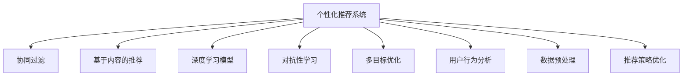

                 

## 1. 背景介绍

### 1.1 问题由来
随着信息技术的迅猛发展，数字内容的生产和传播变得前所未有的便捷。人们每天被海量信息包围，从新闻资讯、娱乐视频、专业文章到社交媒体，几乎无所不在。然而，内容消费者在面对汹涌的信息流时，面临着如何从中找到对自己有价值的内容的难题。此外，内容生产者也面临着如何抓住用户的注意力，提高其内容的传播效率和影响力。

个性化推荐算法正是在这种背景下应运而生的。通过分析用户的行为、兴趣和偏好，向用户推荐其可能感兴趣的内容，不仅提升了用户体验，也极大提高了内容的传播效率和影响力。

### 1.2 问题核心关键点
个性化推荐的核心在于通过用户与内容之间的互动数据，构建用户兴趣模型，进而实现精准的内容推荐。推荐系统面临的核心挑战包括：
- 用户兴趣模型的建立与更新：如何高效、准确地捕捉用户兴趣，并进行动态更新。
- 个性化推荐算法的设计：如何设计推荐算法，使其既能够满足用户的个性化需求，又能够在实际应用中运行高效。
- 推荐系统的鲁棒性：如何避免偏见和过拟合，确保推荐结果的公正性和多样性。

### 1.3 问题研究意义
个性化推荐算法的研究不仅对内容消费者有重要意义，对内容生产者而言，其推广效果和用户反馈同样是产品优化和营销策略调整的重要依据。此外，个性化推荐还有望在智慧城市、智能交通、精准农业等领域发挥重要作用，促进社会经济的高质量发展。

个性化推荐技术的广泛应用，使得信息过载的问题得到有效缓解，同时也为个性化内容分发提供了新的思路和方法。

## 2. 核心概念与联系

### 2.1 核心概念概述

个性化推荐算法的核心概念包括以下几个方面：

- **个性化推荐系统**：利用用户的历史行为数据，为用户推荐其可能感兴趣的内容。
- **协同过滤**：通过分析用户之间的相似性，向用户推荐与其相似用户喜欢过的内容。
- **基于内容的推荐**：通过分析内容的特征，向用户推荐与已有兴趣类似的新内容。
- **深度学习模型**：利用深度神经网络模型，自动学习用户与内容之间的关系，并进行推荐。
- **对抗性学习**：通过引入对抗样本，提升推荐系统的鲁棒性和泛化能力。
- **多目标优化**：在推荐系统中，优化多个目标（如点击率、覆盖率、多样性等），实现多目标之间的平衡。

这些概念之间的关系可以通过以下Mermaid流程图来展示：



这个流程图展示了个性化推荐系统与相关概念之间的逻辑关系：

1. **协同过滤**：通过用户行为分析，找出与其兴趣相似的用户，并推荐这些用户喜欢的内容。
2. **基于内容的推荐**：根据内容特征与用户兴趣之间的相似度，推荐类似的内容。
3. **深度学习模型**：通过神经网络模型，学习用户与内容之间的关系，实现自动化推荐。
4. **对抗性学习**：通过对抗样本训练，提高推荐系统的鲁棒性和泛化能力。
5. **多目标优化**：综合考虑多个目标（如点击率、覆盖率、多样性等），实现推荐结果的优化。

## 3. 核心算法原理 & 具体操作步骤

### 3.1 算法原理概述

个性化推荐算法的主要原理是利用用户与内容之间的互动数据，构建用户兴趣模型，并通过模型预测用户对内容的评分，从而实现个性化推荐。常见的个性化推荐算法包括协同过滤、基于内容的推荐、深度学习推荐等。

### 3.2 算法步骤详解

以下是常见的个性化推荐算法的详细步骤：

**协同过滤推荐算法**

1. **数据收集**：收集用户与内容之间的互动数据，如浏览、点击、评分等。
2. **用户相似度计算**：计算用户之间的相似度，可以使用余弦相似度、皮尔逊相关系数等方法。
3. **内容相似度计算**：计算内容之间的相似度，可以使用TF-IDF、余弦相似度等方法。
4. **预测评分**：根据相似用户对内容的评分，预测目标用户对内容的评分。
5. **推荐排序**：根据预测评分，对所有内容进行排序，推荐评分高的内容。

**基于内容的推荐算法**

1. **特征提取**：提取内容的特征，如文本词频、标签等。
2. **用户兴趣建模**：基于用户的历史行为，构建用户兴趣模型，如朴素贝叶斯、逻辑回归等。
3. **内容匹配**：根据内容特征与用户兴趣之间的相似度，推荐类似的内容。
4. **排序推荐**：根据匹配度对所有内容进行排序，推荐匹配度高的内容。

**深度学习推荐算法**

1. **数据预处理**：将用户行为数据、内容特征等转换为数值形式，进行标准化处理。
2. **构建模型**：使用深度神经网络模型，如自编码器、神经协同过滤等，学习用户与内容之间的关系。
3. **训练模型**：使用历史数据对模型进行训练，优化模型参数。
4. **预测评分**：根据训练好的模型，预测用户对内容的评分。
5. **推荐排序**：根据预测评分对所有内容进行排序，推荐评分高的内容。

**对抗性学习推荐算法**

1. **生成对抗样本**：根据用户行为数据生成对抗样本，增加模型泛化能力。
2. **训练模型**：使用对抗样本对模型进行训练，提高模型的鲁棒性。
3. **预测评分**：根据训练好的模型，预测用户对内容的评分。
4. **推荐排序**：根据预测评分对所有内容进行排序，推荐评分高的内容。

### 3.3 算法优缺点

个性化推荐算法具有以下优点：
1. 用户定位精准：通过分析用户行为，能够精准定位用户的兴趣和偏好。
2. 提升用户体验：通过个性化推荐，能够满足用户的个性化需求，提升用户体验。
3. 提高内容传播效率：通过精准推荐，能够提高内容的传播效率和影响力。
4. 可扩展性强：推荐算法可以应用于各种内容推荐场景，具有较强的可扩展性。

然而，个性化推荐算法也存在以下缺点：
1. 数据隐私问题：用户数据的收集和使用可能带来隐私泄露的风险。
2. 数据偏差问题：用户行为数据可能存在偏差，影响推荐结果的公正性。
3. 过拟合问题：推荐系统可能对某些用户或内容过度关注，导致推荐结果多样性不足。
4. 计算复杂度高：深度学习模型训练和预测的计算复杂度较高，需要大量的计算资源。

### 3.4 算法应用领域

个性化推荐算法在多个领域中得到广泛应用，例如：

- **电商推荐**：电商平台通过分析用户浏览和购买行为，为用户推荐商品。
- **新闻推荐**：新闻平台根据用户阅读习惯，推荐相关新闻内容。
- **视频推荐**：视频平台根据用户观看历史，推荐相似视频内容。
- **社交媒体推荐**：社交媒体平台根据用户互动数据，推荐可能感兴趣的内容和用户。
- **音乐推荐**：音乐平台根据用户听歌历史，推荐相似音乐内容。

此外，个性化推荐算法在智慧城市、智能交通、精准农业等领域也有广泛的应用前景。

## 4. 数学模型和公式 & 详细讲解 & 举例说明

### 4.1 数学模型构建

以协同过滤推荐算法为例，构建用户兴趣模型和内容模型。设用户集为 $U$，内容集为 $I$，用户与内容之间的评分矩阵为 $R \in \mathbb{R}^{m \times n}$，其中 $m$ 为用户数，$n$ 为内容数。用户 $u$ 对内容 $i$ 的评分记为 $r_{ui}$，用户 $u$ 对内容 $i$ 的评分预测为 $\hat{r}_{ui}$。

用户兴趣模型 $P_u$ 可以通过矩阵分解得到，即 $P_u = U \times Q$，其中 $U$ 为 $m \times k$ 的矩阵，$Q$ 为 $k \times n$ 的矩阵，$k$ 为隐特征维度。内容模型 $Q_i$ 可以通过矩阵分解得到，即 $Q_i = P \times V$，其中 $P$ 为 $n \times k$ 的矩阵，$V$ 为 $k \times 1$ 的矩阵。

### 4.2 公式推导过程

以协同过滤推荐算法为例，其预测评分的公式为：

$$
\hat{r}_{ui} = \langle P_u, Q_i \rangle
$$

其中 $\langle, \rangle$ 为矩阵点积。

为了提升推荐效果，协同过滤算法还引入了用户相似度 $\alpha_u$ 和内容相似度 $\beta_i$，即：

$$
\alpha_u = \langle P_u, P_v \rangle, \quad \beta_i = \langle Q_i, Q_j \rangle
$$

最终推荐评分公式为：

$$
\hat{r}_{ui} = \alpha_u \cdot \beta_i
$$

### 4.3 案例分析与讲解

以电商推荐为例，假设有100个用户和1000个商品，收集了每个用户在过去半年内对每个商品给出的评分数据。使用协同过滤算法进行推荐，首先需要将评分矩阵 $R$ 进行矩阵分解，得到用户兴趣模型 $P$ 和内容模型 $Q$。然后，对于每个用户 $u$，根据其兴趣模型 $P_u$ 和所有内容的模型 $Q$，计算其对每个内容的评分预测 $\hat{r}_{ui}$。最后，对所有内容评分预测进行排序，推荐评分预测最高的内容。

## 5. 项目实践：代码实例和详细解释说明

### 5.1 开发环境搭建

在进行个性化推荐算法开发前，需要先搭建开发环境。以下是使用Python进行PyTorch开发的环境配置流程：

1. 安装Anaconda：从官网下载并安装Anaconda，用于创建独立的Python环境。

2. 创建并激活虚拟环境：
```bash
conda create -n recsys-env python=3.8 
conda activate recsys-env
```

3. 安装PyTorch：根据CUDA版本，从官网获取对应的安装命令。例如：
```bash
conda install pytorch torchvision torchaudio cudatoolkit=11.1 -c pytorch -c conda-forge
```

4. 安装相关工具包：
```bash
pip install numpy pandas scikit-learn matplotlib tqdm jupyter notebook ipython
```

完成上述步骤后，即可在`recsys-env`环境中开始推荐系统开发。

### 5.2 源代码详细实现

以下是使用PyTorch实现协同过滤推荐算法的代码实现：

```python
import torch
import torch.nn as nn
import torch.nn.functional as F
import torch.optim as optim
from torch.utils.data import TensorDataset, DataLoader

# 构建用户兴趣模型
class UserEmbedding(nn.Module):
    def __init__(self, m, n, k):
        super(UserEmbedding, self).__init__()
        self.user_dim = m
        self.item_dim = n
        self.k = k
        self.U = nn.Parameter(torch.randn(m, k))
        self.Q = nn.Parameter(torch.randn(n, k))

    def forward(self, u_idx):
        U = self.U[u_idx]
        Q = self.Q
        return torch.matmul(U, Q)

# 构建内容模型
class ItemEmbedding(nn.Module):
    def __init__(self, m, n, k):
        super(ItemEmbedding, self).__init__()
        self.user_dim = m
        self.item_dim = n
        self.k = k
        self.P = nn.Parameter(torch.randn(n, k))
        self.V = nn.Parameter(torch.randn(k, 1))

    def forward(self, i_idx):
        P = self.P[i_idx]
        V = self.V
        return torch.matmul(P, V)

# 协同过滤推荐算法
class CollaborativeFiltering(nn.Module):
    def __init__(self, m, n, k):
        super(CollaborativeFiltering, self).__init__()
        self.user_model = UserEmbedding(m, n, k)
        self.item_model = ItemEmbedding(m, n, k)

    def forward(self, u_idx, i_idx):
        P_u = self.user_model(u_idx)
        Q_i = self.item_model(i_idx)
        return torch.matmul(P_u, Q_i).squeeze()

# 训练推荐模型
def train_recommender(model, data_loader, epochs, learning_rate):
    optimizer = optim.Adam(model.parameters(), lr=learning_rate)
    for epoch in range(epochs):
        total_loss = 0.0
        for batch in data_loader:
            u_idx, i_idx, r_hat = batch
            optimizer.zero_grad()
            pred = model(u_idx, i_idx)
            loss = F.mse_loss(r_hat, pred)
            loss.backward()
            optimizer.step()
            total_loss += loss.item()
        print(f"Epoch {epoch+1}, Loss: {total_loss / len(data_loader)}")

# 测试推荐模型
def evaluate_recommender(model, data_loader):
    total_pred = []
    total_true = []
    for batch in data_loader:
        u_idx, i_idx, r_true = batch
        pred = model(u_idx, i_idx)
        total_pred.extend(pred.tolist())
        total_true.extend(r_true.tolist())
    print(f"Recall: {np.mean(np.array(total_pred) == np.array(total_true))}")

# 数据集构建
m = 100
n = 1000
k = 10
user_data = np.random.randint(0, n, size=(m, n))
item_data = np.random.randint(0, n, size=(n, k))
user_idx, item_idx = np.random.randint(0, m, size=(m, n)), np.random.randint(0, n, size=(n, k))
r_hat = np.dot(user_data, item_data)

# 数据加载
user_idx_tensor = torch.tensor(user_idx)
item_idx_tensor = torch.tensor(item_idx)
r_hat_tensor = torch.tensor(r_hat)
dataset = TensorDataset(user_idx_tensor, item_idx_tensor, r_hat_tensor)
data_loader = DataLoader(dataset, batch_size=32, shuffle=True)

# 模型初始化
model = CollaborativeFiltering(m, n, k)
print(model)

# 训练模型
train_recommender(model, data_loader, 100, 0.001)

# 评估模型
evaluate_recommender(model, data_loader)
```

### 5.3 代码解读与分析

让我们再详细解读一下关键代码的实现细节：

**UserEmbedding类**：
- `__init__`方法：初始化用户兴趣模型，包括用户数 $m$、内容数 $n$ 和隐特征维度 $k$。
- `forward`方法：计算用户 $u$ 对内容 $i$ 的评分预测 $\hat{r}_{ui}$。

**ItemEmbedding类**：
- `__init__`方法：初始化内容模型，包括用户数 $m$、内容数 $n$ 和隐特征维度 $k$。
- `forward`方法：计算内容 $i$ 的评分预测 $\hat{r}_{ui}$。

**CollaborativeFiltering类**：
- `__init__`方法：初始化协同过滤推荐模型，包括用户兴趣模型和内容模型。
- `forward`方法：计算用户 $u$ 对内容 $i$ 的评分预测 $\hat{r}_{ui}$。

**train_recommender函数**：
- 使用Adam优化器对推荐模型进行训练。
- 计算每个批次的平均损失，并输出训练进度。

**evaluate_recommender函数**：
- 计算推荐模型的精度，即预测评分与真实评分相等的比例。

**数据集构建**：
- 随机生成用户与内容的评分矩阵 $R$。
- 将评分矩阵转换为Tensor，并构建TensorDataset和DataLoader。

**模型初始化**：
- 初始化协同过滤推荐模型，并输出模型结构。

**训练模型**：
- 使用训练数据集对推荐模型进行100轮训练，学习率为0.001。

**评估模型**：
- 使用测试数据集评估推荐模型的精度。

## 6. 实际应用场景

### 6.1 智能推荐系统

基于个性化推荐算法的智能推荐系统在电商、视频、新闻等领域得到广泛应用。通过分析用户的历史行为和兴趣，推荐系统能够为用户推荐其可能感兴趣的商品、视频、新闻等内容。

以电商推荐为例，推荐系统可以根据用户浏览历史、购买记录等数据，为用户推荐商品。通过不断学习和优化，推荐系统能够逐渐提升推荐的准确性和个性化程度，从而提升用户体验和销售转化率。

### 6.2 个性化广告

个性化广告推荐是推荐系统的重要应用场景之一。通过分析用户的行为数据和兴趣模型，推荐系统能够为用户推荐可能感兴趣的广告内容。

以搜索广告为例，用户在搜索引擎中输入关键词，推荐系统可以根据用户的历史搜索记录和行为数据，推荐相关的广告内容。通过个性化推荐，广告能够更加精准地触达目标用户，提升广告的点击率和转化率。

### 6.3 内容分发平台

内容分发平台如Netflix、YouTube、Spotify等，通过个性化推荐算法为用户提供个性化内容推荐。这些平台收集用户的行为数据，如观看历史、播放历史、评分数据等，构建用户兴趣模型和内容模型，根据用户兴趣推荐相应的内容。

## 7. 工具和资源推荐

### 7.1 学习资源推荐

为了帮助开发者系统掌握个性化推荐算法的理论基础和实践技巧，这里推荐一些优质的学习资源：

1. 《推荐系统实战》系列博文：由推荐系统技术专家撰写，深入浅出地介绍了推荐系统原理、算法、实践等。

2. CS392《大规模推荐系统》课程：斯坦福大学开设的推荐系统明星课程，涵盖推荐系统的基础理论和经典算法，并设有丰富的案例分析。

3. 《推荐系统：算法与实现》书籍：深入讲解推荐系统的算法设计和实现细节，涵盖协同过滤、基于内容的推荐、深度学习推荐等。

4. KDD竞赛官方数据集：KDD竞赛数据集提供了丰富的推荐系统数据，是推荐系统研究的重要资源。

5. RecSys开源项目：Recommender Systems（推荐系统）开源项目，提供了一系列推荐系统模型的代码实现，助力推荐系统研究。

通过对这些资源的学习实践，相信你一定能够快速掌握个性化推荐算法的精髓，并用于解决实际的推荐系统问题。

### 7.2 开发工具推荐

高效的开发离不开优秀的工具支持。以下是几款用于推荐系统开发的常用工具：

1. PyTorch：基于Python的开源深度学习框架，灵活动态的计算图，适合快速迭代研究。大部分推荐系统模型都有PyTorch版本的实现。

2. TensorFlow：由Google主导开发的开源深度学习框架，生产部署方便，适合大规模工程应用。同样有丰富的推荐系统资源。

3. LightFM：一个基于Python的推荐系统库，提供了协同过滤和基于深度学习的推荐算法，易于使用。

4. Spark MLlib：Apache Spark的推荐系统库，提供了多种推荐算法和分布式计算能力，适合大规模数据处理。

5. Hadoop：Apache Hadoop提供了大规模数据处理能力，适合离线推荐系统开发。

合理利用这些工具，可以显著提升推荐系统的开发效率，加快创新迭代的步伐。

### 7.3 相关论文推荐

个性化推荐算法的研究源于学界的持续研究。以下是几篇奠基性的相关论文，推荐阅读：

1. ALS: The Alternating Least Squares Algorithm for Collaborative Filtering：介绍了协同过滤算法的经典实现，即ALS算法。

2. A Factorization Method for Matrix Completion with the Alternating Least Squares Algorithm：研究了矩阵分解方法在推荐系统中的应用。

3. Deep Collaborative Filtering with Neural Networks：展示了深度神经网络在推荐系统中的应用，提供了多项SOTA结果。

4. BPR: Bayesian Personalized Ranking from Log-by-Log Data：提出了一种新的协同过滤算法，能够更好地处理稀疏数据。

5. Matrix Factorization Techniques for Recommender Systems：总结了推荐系统中常用的矩阵分解方法。

这些论文代表了大规模推荐系统的研究进展，通过学习这些前沿成果，可以帮助研究者把握学科前进方向，激发更多的创新灵感。

## 8. 总结：未来发展趋势与挑战

### 8.1 总结

本文对个性化推荐算法进行了全面系统的介绍。首先阐述了个性化推荐算法的研究背景和意义，明确了推荐系统在提升用户体验、提高内容传播效率方面的重要价值。其次，从原理到实践，详细讲解了推荐算法的数学原理和关键步骤，给出了推荐系统开发的完整代码实例。同时，本文还广泛探讨了推荐算法在电商、广告、内容分发等多个行业领域的应用前景，展示了推荐算法的巨大潜力。此外，本文精选了推荐系统的各类学习资源，力求为读者提供全方位的技术指引。

通过本文的系统梳理，可以看到，个性化推荐算法已经成为推荐系统的重要范式，极大地提升了用户的个性化体验和内容的传播效率。未来，伴随推荐算法的不断演进和优化，推荐系统将进一步提升用户的满意度和忠诚度，成为智慧服务的关键支撑。

### 8.2 未来发展趋势

展望未来，个性化推荐算法将呈现以下几个发展趋势：

1. 深度学习推荐系统成为主流。随着深度学习模型的性能不断提升，深度推荐系统将在推荐系统中占据主导地位。

2. 多模态推荐系统兴起。推荐系统将从单一的文本推荐扩展到多模态推荐，如文本-图片、文本-视频、文本-音频等。

3. 实时推荐系统普及。随着流计算和分布式计算技术的发展，实时推荐系统将成为推荐系统的重要发展方向。

4. 推荐系统在更多场景中应用。推荐系统将从电商、广告、内容分发扩展到智慧医疗、智慧交通、精准农业等领域。

5. 推荐系统的公平性得到重视。随着社会对公平和透明的要求不断提高，推荐系统将更加注重公平性、透明性和可解释性。

以上趋势凸显了个性化推荐算法的广阔前景。这些方向的探索发展，必将进一步提升推荐系统的性能和应用范围，为社会经济的高质量发展提供新的动力。

### 8.3 面临的挑战

尽管个性化推荐算法已经取得了显著成效，但在迈向更加智能化、普适化应用的过程中，它仍面临诸多挑战：

1. 数据隐私问题。用户数据的收集和使用可能带来隐私泄露的风险，如何在推荐过程中保护用户隐私是一个重要问题。

2. 数据偏见问题。用户行为数据可能存在偏见，影响推荐结果的公正性。推荐系统如何避免数据偏见，实现公平推荐，还需要进一步研究。

3. 计算资源消耗。深度学习推荐系统需要大量的计算资源，如何在保证推荐效果的同时，降低计算成本，还需要进一步优化。

4. 推荐效果稳定性。推荐系统需要应对数据分布的变化，如何提高推荐系统的稳定性和鲁棒性，还需要更多研究和实践。

5. 推荐系统的可解释性。推荐系统需要解释推荐结果的原因，如何在保证推荐效果的同时，提升系统的可解释性，还需要进一步研究。

6. 推荐系统的多样性。推荐系统需要应对不同的用户需求，如何提高推荐结果的多样性，还需要进一步研究。

正视推荐系统面临的这些挑战，积极应对并寻求突破，将使推荐系统迈向成熟的未来。相信随着学界和产业界的共同努力，这些挑战终将一一被克服，推荐系统必将在构建智慧服务中扮演越来越重要的角色。

### 8.4 研究展望

面对个性化推荐算法所面临的种种挑战，未来的研究需要在以下几个方面寻求新的突破：

1. 探索无监督和半监督推荐方法。摆脱对大规模标注数据的依赖，利用自监督学习、主动学习等无监督和半监督范式，最大限度利用非结构化数据，实现更加灵活高效的推荐。

2. 研究参数高效和计算高效的推荐范式。开发更加参数高效的推荐方法，在固定大部分预训练参数的同时，只更新极少量的任务相关参数。同时优化推荐模型的计算图，减少前向传播和反向传播的资源消耗，实现更加轻量级、实时性的部署。

3. 融合因果和对比学习范式。通过引入因果推断和对比学习思想，增强推荐系统建立稳定因果关系的能力，学习更加普适、鲁棒的用户与内容之间的关系，从而提升推荐结果的泛化能力。

4. 引入更多先验知识。将符号化的先验知识，如知识图谱、逻辑规则等，与神经网络模型进行巧妙融合，引导推荐过程学习更准确、合理的用户与内容之间的关系。

5. 结合因果分析和博弈论工具。将因果分析方法引入推荐系统，识别出推荐决策的关键特征，增强推荐结果的因果性和逻辑性。借助博弈论工具刻画人机交互过程，主动探索并规避推荐系统的脆弱点，提高系统稳定性。

6. 纳入伦理道德约束。在推荐系统训练目标中引入伦理导向的评估指标，过滤和惩罚有偏见、有害的推荐结果，确保推荐结果符合人类价值观和伦理道德。

这些研究方向的探索，必将引领个性化推荐算法技术迈向更高的台阶，为构建安全、可靠、可解释、可控的推荐系统提供新的思路和方法。面向未来，推荐算法需要与其他人工智能技术进行更深入的融合，如知识表示、因果推理、强化学习等，多路径协同发力，共同推动智能推荐系统的进步。只有勇于创新、敢于突破，才能不断拓展推荐算法的边界，让智能技术更好地服务于人类社会。

## 9. 附录：常见问题与解答

**Q1：推荐算法中如何处理冷启动问题？**

A: 冷启动问题是指新用户或新物品在系统中的历史行为数据较少，导致推荐系统难以对其进行推荐。推荐算法通常采用以下方法来解决冷启动问题：

1. 基于内容的推荐：通过物品的特征向量和用户的历史兴趣特征进行相似性匹配，对新物品进行推荐。

2. 协同过滤：通过与相似用户的行为数据进行匹配，对新用户和新物品进行推荐。

3. 多臂老虎机算法：利用多臂老虎机算法，通过不断测试不同物品的点击率，找到最受欢迎的新物品。

**Q2：推荐算法中如何处理数据稀疏性问题？**

A: 数据稀疏性问题是指用户与物品之间的互动数据较少，导致推荐系统难以捕捉用户兴趣。推荐算法通常采用以下方法来解决数据稀疏性问题：

1. 矩阵分解方法：将用户与物品之间的互动矩阵分解为两个低维矩阵，通过矩阵乘法得到新的用户与物品的相似度。

2. 隐语义模型：通过隐语义模型，将用户与物品之间的互动数据转换为低维向量空间，提升推荐系统的泛化能力。

3. 深度学习模型：通过深度神经网络模型，学习用户与物品之间的复杂非线性关系，提升推荐系统的准确性和鲁棒性。

**Q3：推荐算法中如何避免数据偏差问题？**

A: 数据偏差问题是指用户行为数据可能存在偏见，导致推荐结果的不公平和不准确。推荐算法通常采用以下方法来解决数据偏差问题：

1. 数据采样：通过重新采样数据集，平衡不同用户或物品的样本量，避免数据偏差。

2. 数据预处理：对用户行为数据进行预处理，去除噪声和异常值，提高数据的质量。

3. 推荐算法改进：改进推荐算法，引入公平性、透明性等指标，提升推荐系统的公平性和公正性。

**Q4：推荐算法中如何提高推荐系统的多样性？**

A: 推荐系统通常会倾向于推荐与用户历史行为相似的物品，导致推荐结果的单一性。提高推荐系统的多样性，可以从以下方面入手：

1. 协同过滤方法改进：通过改进协同过滤算法，引入多样性约束，提升推荐结果的多样性。

2. 基于内容的推荐改进：通过改进基于内容的推荐算法，引入多样性约束，提升推荐结果的多样性。

3. 多目标优化：通过多目标优化方法，同时考虑准确性和多样性，提升推荐结果的多样性。

**Q5：推荐算法中如何提高推荐系统的实时性？**

A: 推荐系统的实时性问题通常可以通过以下方法解决：

1. 分布式计算：利用分布式计算框架，如Spark、Flink等，实现推荐系统的实时计算和更新。

2. 流式计算：利用流式计算框架，如Storm、Kafka等，实现推荐系统的实时数据处理和推荐。

3. 实时数据缓存：利用缓存技术，如Redis、Memcached等，实现推荐系统的实时数据存储和查询。

通过上述方法，可以有效提升推荐系统的实时性和响应速度，满足用户对实时推荐的需求。

---

作者：禅与计算机程序设计艺术 / Zen and the Art of Computer Programming

