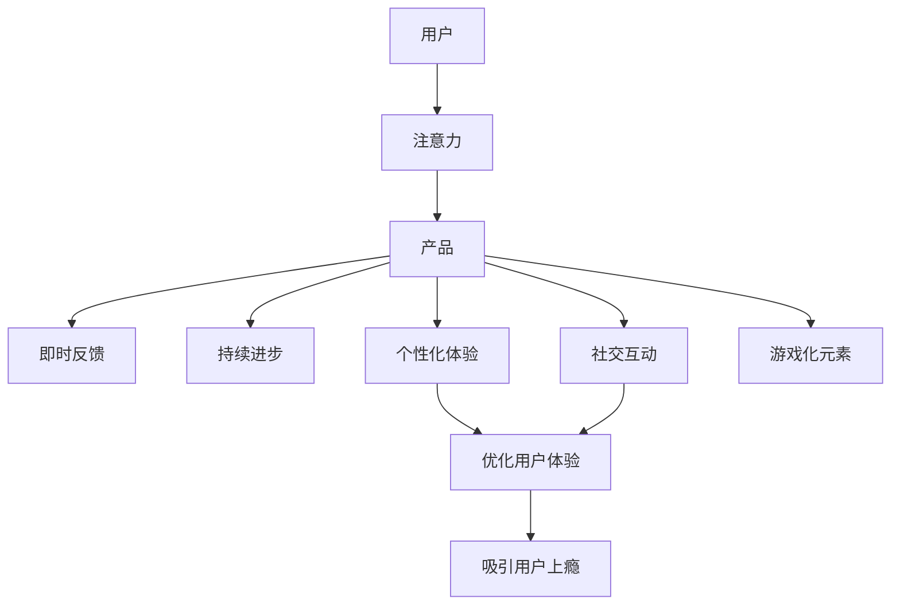

                 

# 注意力经济与用户体验优化策略：创建令人上瘾和引人入胜的产品

在数字时代，产品体验的竞争已经成为企业竞争的核心。如何吸引用户的注意力，让他们在众多选择中选中你的产品，并持续使用，是每个产品经理和设计师必须面对的挑战。在追求产品使用便利性的同时，如何优化用户体验，让用户产生"上瘾"感，并持续回归，成为新兴的注意力经济研究重点。本文将从注意力经济与用户体验优化的角度出发，探讨如何通过设计引人入胜的产品，提升用户粘性，打造出真正令人上瘾的产品。

## 1. 背景介绍

### 1.1 问题由来

在移动互联网快速发展的背景下，用户获取信息的渠道愈发多样化，用户注意力也随之变得稀缺。产品竞争从功能之战转变为体验之战。例如，应用商店的推荐算法会根据用户的使用习惯和行为数据，持续优化产品的展示排名，使优质产品更容易被用户发现。同时，用户对优质产品的期望值也在不断提升，需要更为吸引人、令人上瘾的产品才能赢得市场。

### 1.2 问题核心关键点

目前，打造令人上瘾的产品已成为企业产品战略的核心方向。用户上瘾的机制主要包括以下几个方面：

1. **即时反馈**：用户在完成任务后，能够立即获得反馈，如完成成就、积分奖励等。
2. **持续进步**：用户在不断积累经验和技能的过程中，感到进步和成长。
3. **社交互动**：用户通过与其他用户的互动，获得社交认可和归属感。
4. **定制化体验**：产品根据用户偏好和行为，提供个性化推荐，提升用户体验。
5. **游戏化元素**：通过积分、关卡、徽章等游戏化机制，增强用户使用动力。
6. **刺激新鲜感**：定期更新产品内容，保持用户新鲜感和兴趣。

因此，本文将重点探讨如何通过以上策略，优化用户体验，构建出令人上瘾和引人入胜的产品。

## 2. 核心概念与联系

### 2.1 核心概念概述

本文将从以下几个核心概念入手，探讨它们如何共同作用，提升用户体验，进而达到吸引用户上瘾的目的。

- **注意力经济**：在数字时代，注意力资源的价值远超物质资源。企业通过优化产品设计，吸引用户注意力，从而实现商业价值。
- **用户上瘾**：用户对产品产生依赖感，重复使用，保持长期稳定活跃度。
- **即时反馈**：用户完成操作后，系统立即给予反馈，增强用户成就感。
- **持续进步**：用户在使用产品过程中，不断学习和成长，提高用户粘性。
- **社交互动**：用户与他人互动，形成社区和社交网络，增强归属感和认同感。
- **个性化体验**：根据用户行为和偏好，提供个性化推荐和服务，提升用户体验。
- **游戏化元素**：通过游戏机制增加趣味性和互动性，提高用户使用动机。

这些概念之间存在紧密联系，形成一个完整的用户体验优化框架。在实际应用中，企业需要根据具体产品特点，灵活运用这些策略，打造令人上瘾的产品。

### 2.2 核心概念原理和架构的 Mermaid 流程图



### 2.3 核心概念之间的联系

1. **注意力**：用户通过搜索、浏览等方式，找到满足自己需求的产品。注意力是所有其他策略实施的前提。
2. **即时反馈**：用户在使用产品过程中，立即获得操作反馈，从而感知产品价值，增加用户粘性。
3. **持续进步**：用户在使用过程中不断学习和提升，形成习惯，从而提升产品使用率。
4. **社交互动**：用户与他人互动，提升归属感，增强用户忠诚度。
5. **个性化体验**：用户获得量身定制的服务，提升满意度。
6. **游戏化元素**：通过趣味性强的游戏机制，提高用户使用动机。
7. **用户体验优化**：通过综合运用以上策略，打造令人上瘾的产品。

这些策略相辅相成，构建起完整的产品体验优化架构，实现用户粘性最大化。

## 3. 核心算法原理 & 具体操作步骤

### 3.1 算法原理概述

本文将从注意力经济的角度，探讨如何优化用户体验，提升用户粘性。核心算法主要分为以下几类：

- **用户行为分析**：通过数据分析技术，识别用户的行为模式和偏好，优化产品功能设计。
- **即时反馈设计**：设计合理的即时反馈机制，增强用户成就感。
- **个性化推荐算法**：通过机器学习和推荐算法，提供个性化推荐，提升用户满意度。
- **游戏化设计**：引入游戏化元素，如积分、徽章等，增强用户动机。

### 3.2 算法步骤详解

#### 3.2.1 用户行为分析

1. **数据收集**：通过日志、点击流、用户反馈等渠道，收集用户的行为数据。
2. **数据清洗与预处理**：清洗异常数据，进行数据标准化和归一化处理。
3. **特征提取**：通过文本挖掘、时间序列分析等方法，提取用户行为特征。
4. **用户分群**：基于用户行为特征，进行聚类分析和标签划分，形成用户群体。
5. **行为模式分析**：分析用户行为模式和特征，识别出核心行为和行为路径。

#### 3.2.2 即时反馈设计

1. **任务设计**：设计用户可完成的任务，如积分、成就、勋章等。
2. **反馈时机**：在用户完成任务后，立即给予反馈，增强成就感。
3. **反馈内容**：反馈内容应具有明确性和可操作性，如积分、成就、文字提示等。

#### 3.2.3 个性化推荐算法

1. **推荐引擎设计**：选择或设计推荐算法，如协同过滤、基于内容的推荐、深度学习推荐等。
2. **推荐模型训练**：基于用户历史行为数据，训练推荐模型。
3. **推荐策略实施**：将推荐结果融入到产品中，如首页推荐、个性化推送等。

#### 3.2.4 游戏化设计

1. **游戏机制设计**：设计积分、徽章、关卡等游戏化元素，增加趣味性。
2. **游戏元素融入**：将游戏元素融入到产品中，如积分排行榜、成就展示等。
3. **用户互动设计**：设计用户互动机制，增强社交互动和社区感。

### 3.3 算法优缺点

#### 3.3.1 即时反馈

**优点**：
- 增强用户成就感，提升用户粘性。
- 即时反馈，用户感受更敏锐，对产品有更好的感知。
- 可实现精细化运营，对用户行为进行精准激励。

**缺点**：
- 成本较高，需要大量技术支持。
- 容易产生过度依赖，导致用户停滞不前。
- 反馈内容设计不当，可能产生负面效果。

#### 3.3.2 个性化推荐

**优点**：
- 提升用户满意度，增强用户粘性。
- 优化用户体验，提高产品竞争力。
- 精准定位用户需求，实现精准运营。

**缺点**：
- 需要大量标注数据，数据获取成本较高。
- 推荐模型复杂，训练难度较大。
- 推荐效果可能存在偏差，导致用户流失。

#### 3.3.3 游戏化设计

**优点**：
- 增加用户使用动机，提升用户活跃度。
- 用户互动性强，增强社交归属感。
- 丰富产品内容，增加用户粘性。

**缺点**：
- 游戏机制设计不当，可能导致用户疲劳。
- 过度依赖游戏元素，可能影响产品核心功能。
- 用户游戏体验可能不一致，影响整体感知。

### 3.4 算法应用领域

基于即时反馈、个性化推荐和游戏化设计的用户体验优化算法，已在多个领域得到了广泛应用。

- **电商推荐系统**：电商平台通过个性化推荐，提高用户购买转化率，增强用户粘性。
- **社交媒体平台**：社交媒体平台通过游戏化元素和即时反馈，提高用户活跃度，增加用户粘性。
- **游戏应用**：游戏应用通过丰富多样的游戏化元素，吸引用户持续游戏，增强用户粘性。
- **内容平台**：内容平台通过个性化推荐，提高用户浏览量和停留时间，增强用户粘性。

## 4. 数学模型和公式 & 详细讲解 & 举例说明

### 4.1 数学模型构建

本文将从用户行为分析的角度，探讨如何构建用户行为分析模型。设用户行为数据为 $D=\{(x_i,y_i)\}_{i=1}^N$，其中 $x_i$ 为行为特征向量，$y_i$ 为标签（如购买行为、浏览行为等）。

定义用户行为模型为 $P(y|x;\theta)$，其中 $\theta$ 为模型参数，通过最大化似然函数进行模型训练。设训练样本的似然函数为 $\mathcal{L}(\theta)=\prod_{i=1}^N P(y_i|x_i;\theta)$，通过优化 $\mathcal{L}(\theta)$，求解最优参数 $\theta^*$。

### 4.2 公式推导过程

在实际应用中，我们通常使用一些经典的推荐算法进行用户行为分析。以下以协同过滤算法为例，推导推荐模型的损失函数和参数更新公式。

**协同过滤算法**：
协同过滤算法基于用户行为数据的相似性，推荐用户可能感兴趣的商品。设 $D=\{(r_{ui},r_{vi})\}_{i,j=1}^N$ 为用户-商品行为数据矩阵，$r_{ui}$ 表示用户 $u$ 对商品 $i$ 的行为评分，$r_{vi}$ 表示用户 $v$ 对商品 $i$ 的行为评分。

协同过滤算法的目标是最小化用户-商品评分矩阵 $R$ 与模型预测矩阵 $\hat{R}$ 的均方误差：

$$
\mathcal{L}(\theta)=\frac{1}{2}\sum_{i=1}^N \sum_{j=1}^N (r_{ij}-\hat{r}_{ij})^2
$$

其中 $\hat{r}_{ij}$ 为协同过滤算法的预测值，通常使用用户 $u$ 和 $v$ 的评分计算得到。

通过随机梯度下降等优化算法，最小化上述损失函数，求解最优参数 $\theta^*$。

### 4.3 案例分析与讲解

设某电商平台的商品推荐系统，已收集到用户 $u$ 对商品 $i$ 的评分数据 $D=\{(r_{ui},r_{vi})\}_{i,j=1}^N$。我们需要使用协同过滤算法对该用户进行商品推荐，其推荐过程和结果如下：

1. **数据预处理**：对原始评分数据进行标准化处理，计算用户 $u$ 的评分均值和标准差，进行归一化：$\hat{r}_{ui}=\frac{r_{ui}-\mu_u}{\sigma_u}$。

2. **相似度计算**：计算用户 $u$ 与用户 $v$ 的相似度 $s_{uv}$，通常使用余弦相似度：$s_{uv}=\cos(\theta^T\vec{x_u}-\theta^T\vec{x_v})$。

3. **推荐计算**：根据用户 $u$ 和用户 $v$ 的相似度，计算商品 $i$ 的预测评分：$\hat{r}_{iu}=s_{uv}\hat{r}_{vi}$。

4. **结果排序**：根据预测评分对商品进行排序，推荐前 $k$ 个评分最高的商品。

假设用户 $u$ 对商品 $i$ 的预测评分为 $0.8$，根据协同过滤算法，最终推荐的商品列表中，评分最高的前 $5$ 个商品依次为 $i_1$、$i_2$、$i_3$、$i_4$、$i_5$。用户 $u$ 可以通过点击商品卡片，获得积分、成就等即时反馈，提升用户粘性。

## 5. 项目实践：代码实例和详细解释说明

### 5.1 开发环境搭建

在进行用户体验优化实践前，我们需要准备好开发环境。以下是使用Python进行开发的环境配置流程：

1. 安装Anaconda：从官网下载并安装Anaconda，用于创建独立的Python环境。

2. 创建并激活虚拟环境：
```bash
conda create -n user_behavior_analysis python=3.8 
conda activate user_behavior_analysis
```

3. 安装相关依赖包：
```bash
conda install pandas numpy scikit-learn matplotlib tqdm jupyter notebook ipython
```

完成上述步骤后，即可在`user_behavior_analysis`环境中开始项目实践。

### 5.2 源代码详细实现

下面我们以电商推荐系统为例，给出使用Python和Scikit-learn进行用户行为分析的代码实现。

首先，定义用户行为分析的数据处理函数：

```python
import pandas as pd
from sklearn.preprocessing import StandardScaler
from sklearn.metrics.pairwise import cosine_similarity
from scipy.spatial import distance

def preprocess_data(df):
    # 标准化处理
    scaler = StandardScaler()
    df = scaler.fit_transform(df)
    
    # 计算相似度
    similarity_matrix = cosine_similarity(df)
    
    # 根据相似度排序推荐商品
    idx = similarity_matrix.argsort()[::-1]
    return df, idx

# 读取数据
df = pd.read_csv('user_behavior.csv')
df = preprocess_data(df)
```

然后，定义推荐函数：

```python
def recommend_items(user_df, user_index, num_recommendations=5):
    # 获取用户行为向量
    user_vector = user_df.iloc[user_index]
    
    # 计算相似度最高的前5个用户
    similar_users = user_df[similarity_matrix[:,user_index].argsort()[:num_recommendations]]
    
    # 推荐商品
    recommended_items = similar_users.iloc[:,1:].sum(axis=1)
    return recommended_items
```

最后，测试推荐函数：

```python
user_index = 0
recommended_items = recommend_items(df, user_index)
print(recommended_items)
```

以上代码展示了基于协同过滤算法的推荐系统实现，通过标准化和相似度计算，推荐用户可能感兴趣的商品。同时，该推荐结果可以作为即时反馈的一部分，增强用户粘性。

### 5.3 代码解读与分析

让我们再详细解读一下关键代码的实现细节：

**preprocess_data函数**：
- **标准化处理**：使用标准化方法对原始评分数据进行归一化处理。
- **计算相似度**：计算用户之间的余弦相似度矩阵，为后续推荐提供相似度信息。
- **排序推荐**：根据相似度矩阵排序，选择相似度最高的前5个用户进行推荐。

**recommend_items函数**：
- **获取用户行为向量**：将用户 $u$ 的评分向量提取出来，用于计算相似度。
- **计算相似度最高的用户**：选择与用户 $u$ 最相似的前5个用户，作为推荐用户。
- **推荐商品**：将推荐用户对商品 $i$ 的评分累加，得到商品 $i$ 的预测评分。

代码实现中，我们通过标准化和相似度计算，实现了协同过滤算法的推荐过程。推荐结果可以作为即时反馈的一部分，增强用户粘性。

## 6. 实际应用场景

### 6.1 智能推荐系统

智能推荐系统已经广泛应用于电商、视频、新闻等多个领域。通过对用户行为数据的分析，推荐系统能够为用户提供个性化推荐，提升用户体验和满意度。

在电商领域，推荐系统通过分析用户的浏览、购买行为，推荐用户可能感兴趣的商品。通过协同过滤算法、基于内容的推荐等方法，实现精准推荐，提高用户购买转化率。

在视频平台，推荐系统通过分析用户观看行为，推荐用户可能喜欢的视频内容。通过协同过滤、深度学习推荐等方法，提升用户观看体验和留存率。

在新闻平台，推荐系统通过分析用户阅读行为，推荐用户可能感兴趣的文章。通过协同过滤、自然语言处理等方法，实现个性化推荐，提高用户点击率。

### 6.2 社交网络平台

社交网络平台通过游戏化设计和即时反馈，增强用户粘性。例如，微信通过朋友圈、公众号、小程序等，提供丰富多样的游戏化元素，如点赞、分享、评论等。同时，通过即时反馈，如点赞数、好友数等，增强用户成就感，提升用户活跃度。

此外，社交网络平台还通过个性化推荐算法，推荐用户可能感兴趣的内容，提升用户互动和社交体验。例如，微信朋友圈通过分析用户浏览行为，推荐用户可能感兴趣的文章和好友状态，提高用户粘性。

### 6.3 游戏应用

游戏应用通过游戏化设计和即时反馈，增强用户动机和粘性。例如，王者荣耀通过积分、勋章、关卡等游戏化元素，增强用户游戏动机和成就感。通过即时反馈，如击败数、获胜率等，增强用户粘性。

此外，游戏应用还通过个性化推荐算法，推荐用户可能感兴趣的游戏关卡和道具，提升用户游戏体验和留存率。例如，王者荣耀通过分析用户游戏行为，推荐用户可能感兴趣的游戏关卡和英雄，提高用户游戏粘性。

## 7. 工具和资源推荐

### 7.1 学习资源推荐

为了帮助开发者系统掌握用户体验优化和推荐算法的理论基础和实践技巧，这里推荐一些优质的学习资源：

1. 《推荐系统实战》书籍：全面介绍推荐系统的工作原理和实现方法，涵盖协同过滤、基于内容的推荐、深度学习推荐等多种推荐算法。

2. Coursera《Recommender Systems》课程：由斯坦福大学开设的推荐系统经典课程，涵盖推荐系统基础和算法实现，适合初学者和进阶者学习。

3. Arxiv论文《Collaborative Filtering for Implicit Feedback Datasets》：介绍协同过滤算法的原理和实现方法，适用于数据量较大的推荐系统。

4. Google Scholar论文《Large Scale Online Learning for Recommender Systems》：介绍在线推荐系统的实现方法和算法优化，适合处理大规模推荐数据。

5. Kaggle推荐系统竞赛：通过竞赛形式，学习和实践推荐系统算法，适合实战选手锻炼技能。

通过对这些资源的学习实践，相信你一定能够快速掌握推荐系统的精髓，并用于解决实际的推荐问题。

### 7.2 开发工具推荐

高效的开发离不开优秀的工具支持。以下是几款用于推荐系统开发的常用工具：

1. Python：基于Python的推荐系统开发语言，灵活方便，生态丰富。推荐系统常用库包括Scikit-learn、TensorFlow、PyTorch等。

2. TensorFlow：由Google主导开发的开源深度学习框架，适合大规模推荐系统的实现。TensorFlow提供丰富的推荐引擎和优化工具。

3. PyTorch：基于Python的深度学习框架，灵活高效，适合小规模推荐系统的实现。PyTorch推荐引擎和优化工具较少，但API简单，易于使用。

4. NumPy：基于Python的数值计算库，推荐系统中常用的矩阵运算和数据处理功能。

5. pandas：基于Python的数据分析库，推荐系统中常用的数据处理和统计功能。

6. Scikit-learn：基于Python的机器学习库，推荐系统中常用的分类、回归、聚类等算法。

合理利用这些工具，可以显著提升推荐系统开发的效率，加快创新迭代的步伐。

### 7.3 相关论文推荐

推荐系统发展迅速，学界和工业界涌现出大量前沿成果。以下是几篇奠基性的相关论文，推荐阅读：

1. 《Collaborative Filtering for Implicit Feedback Datasets》：介绍协同过滤算法的原理和实现方法，适用于数据量较大的推荐系统。

2. 《Factorization Machines》：介绍因子化机算法，适用于推荐系统中的特征工程和模型训练。

3. 《Deep Collaborative Filtering》：介绍深度学习推荐系统，适用于处理大规模推荐数据。

4. 《Neural Topic Models for News Article Recommendation》：介绍神经网络模型在新闻推荐系统中的应用，提升推荐系统效果。

5. 《User Representation Learning in Recommendation Systems》：介绍用户表示学习算法，提升推荐系统的个性化推荐效果。

这些论文代表推荐系统的最新进展，阅读这些前沿成果，可以帮助你掌握推荐系统的最新技术动态。

## 8. 总结：未来发展趋势与挑战

### 8.1 总结

本文从注意力经济与用户体验优化的角度，探讨了如何通过设计引人入胜的产品，提升用户粘性。通过即时反馈、个性化推荐、游戏化元素等策略，打造出令人上瘾的产品。

通过本文的系统梳理，可以看到，用户体验优化策略在大规模数字产品中的应用已经十分广泛，用户粘性已经成为数字产品竞争的关键。未来的产品设计需要更加注重用户体验，通过优化设计，提高用户满意度，增强用户粘性。

### 8.2 未来发展趋势

展望未来，用户体验优化策略将继续引领数字产品的创新发展。以下是几大未来发展趋势：

1. **多模态交互**：未来的数字产品将越来越多地融合视觉、听觉等多模态交互方式，提升用户沉浸感和体验。例如，增强现实(AR)和虚拟现实(VR)技术的普及，将改变用户的互动方式。

2. **人工智能驱动**：人工智能技术的进步，将进一步优化用户体验，提高产品智能化水平。例如，自然语言处理(NLP)和计算机视觉(CV)技术的应用，将提升产品推荐的精准度。

3. **个性化定制**：随着用户数据的积累，未来的产品将更加个性化定制，满足用户的独特需求。例如，智能推荐系统的算法将更加精准，根据用户行为和兴趣提供量身定制的内容。

4. **社交网络的融合**：社交网络平台的普及，将进一步增强用户的社交互动和归属感。例如，社交网络平台的游戏化元素和即时反馈机制，将提升用户粘性。

5. **数据隐私保护**：随着用户隐私意识的提升，未来的产品将更加注重数据隐私保护。例如，隐私保护算法和数据匿名化技术的应用，将保护用户数据安全。

6. **算法透明和可解释**：未来的产品将更加注重算法的透明性和可解释性，提升用户信任度。例如，算法可解释性和公平性研究，将增强用户的算法理解和信任。

以上趋势凸显了用户体验优化策略的广阔前景，这些方向的探索发展，必将进一步提升数字产品的性能和用户体验，为人类生活带来更多便利和乐趣。

### 8.3 面临的挑战

尽管用户体验优化策略已经取得了一定的成效，但在向更加智能化、个性化、隐私化方向发展的过程中，它仍面临诸多挑战：

1. **数据获取和处理**：优质的用户体验优化策略需要大量的用户数据，数据获取和处理成本较高。如何低成本、高效地获取和处理用户数据，是当前的一大挑战。

2. **用户隐私保护**：用户数据隐私保护是一个重要问题，尤其是在大数据时代。如何确保用户数据安全，保护用户隐私，是未来产品设计的重要任务。

3. **算法透明和公平**：算法的透明性和公平性问题，是用户体验优化策略中的关键。如何确保算法的透明性和公平性，增强用户信任，是未来产品设计的重要课题。

4. **多模态融合**：多模态交互的普及，带来了新的挑战。如何融合视觉、听觉等多种交互方式，提升用户体验，是未来的研究方向。

5. **个性化优化**：随着用户需求的个性化程度提升，如何设计更加个性化的用户体验，满足用户的独特需求，是未来的重要方向。

6. **算法效率**：用户体验优化策略涉及复杂的算法模型，如何在保证效果的同时，提升算法效率，优化计算资源，是未来的研究方向。

7. **算法鲁棒性**：用户体验优化策略涉及复杂的算法模型，如何确保算法的鲁棒性和稳定性，避免过度拟合和异常情况，是未来的重要课题。

这些挑战需要产品团队在设计和实现中，不断探索和创新，以确保用户体验优化策略的可持续发展和应用。

### 8.4 研究展望

面对用户体验优化策略所面临的挑战，未来的研究需要在以下几个方面寻求新的突破：

1. **多模态交互融合**：将视觉、听觉、触觉等多种交互方式融合，提升用户沉浸感和体验。例如，增强现实和虚拟现实技术的应用，将改变用户的互动方式。

2. **个性化推荐优化**：通过深度学习、强化学习等方法，提升推荐系统的精准度和个性化程度。例如，利用生成对抗网络(GAN)等技术，生成更加多样化的推荐内容。

3. **用户行为建模**：通过大数据和机器学习技术，建立更加全面和准确的用户行为模型，提升推荐系统的个性化推荐效果。例如，利用神经网络模型，对用户行为进行建模和预测。

4. **社交网络分析**：通过社交网络分析技术，发现用户之间的潜在关联和影响，提升推荐系统的社交性。例如，利用图神经网络(GNN)等技术，分析社交网络的结构和关系。

5. **隐私保护算法**：开发更加高效和安全的隐私保护算法，保护用户数据隐私。例如，利用差分隐私技术，保护用户数据匿名性。

6. **算法透明和公平**：开发更加透明和公平的算法，增强用户信任。例如，利用可解释性模型和公平性评估技术，提升算法的透明性和公平性。

7. **多模态交互融合**：将视觉、听觉、触觉等多种交互方式融合，提升用户沉浸感和体验。例如，增强现实和虚拟现实技术的应用，将改变用户的互动方式。

这些研究方向的探索，必将引领用户体验优化策略的发展，推动数字产品向更加智能化、个性化、隐私化方向发展。面向未来，用户体验优化策略的研究将继续深入，为人类生活带来更多便利和乐趣。

## 9. 附录：常见问题与解答

**Q1：如何平衡用户粘性和产品体验？**

A: 在实际产品设计中，需要平衡用户粘性和产品体验。通过合理的游戏化设计和即时反馈机制，增强用户粘性，同时注重产品质量和功能设计，提升用户满意度。例如，可以通过优化用户界面和操作流程，提升产品的易用性，减少用户操作负担。

**Q2：推荐系统如何处理用户偏好变化？**

A: 推荐系统需要不断适应用户偏好变化，才能保持用户的持续活跃。可以通过定期更新用户行为数据，重新训练推荐模型，实现动态推荐。例如，利用在线学习算法，实时更新推荐模型参数，提高推荐效果。

**Q3：如何避免推荐算法中的数据偏差？**

A: 推荐算法中的数据偏差问题，会导致推荐效果不佳，甚至可能误导用户。可以通过数据清洗和预处理，去除异常数据和噪声，确保数据质量。例如，利用数据增强和特征选择等方法，提升数据质量和推荐效果。

**Q4：推荐系统如何处理冷启动问题？**

A: 冷启动问题指新用户或新物品没有足够的历史数据，难以进行精准推荐。可以通过使用协同过滤和基于内容的推荐等方法，减少对历史数据的依赖。例如，利用用户画像和物品属性，进行相似度计算，实现精准推荐。

**Q5：推荐系统如何处理用户隐私问题？**

A: 推荐系统需要处理大量用户数据，隐私保护问题尤为关键。可以通过数据匿名化和差分隐私技术，保护用户隐私。例如，利用数据脱敏技术，保护用户数据匿名性，防止数据泄露。

总之，推荐系统是一个涉及数据、算法、隐私等多方面的复杂系统，需要综合考虑用户体验、数据隐私、算法透明等多个维度，才能实现有效的推荐和个性化服务。通过对这些问题的深入探讨，相信你能够更好地设计和实现推荐系统，提升用户体验和满意度。

---

作者：禅与计算机程序设计艺术 / Zen and the Art of Computer Programming

