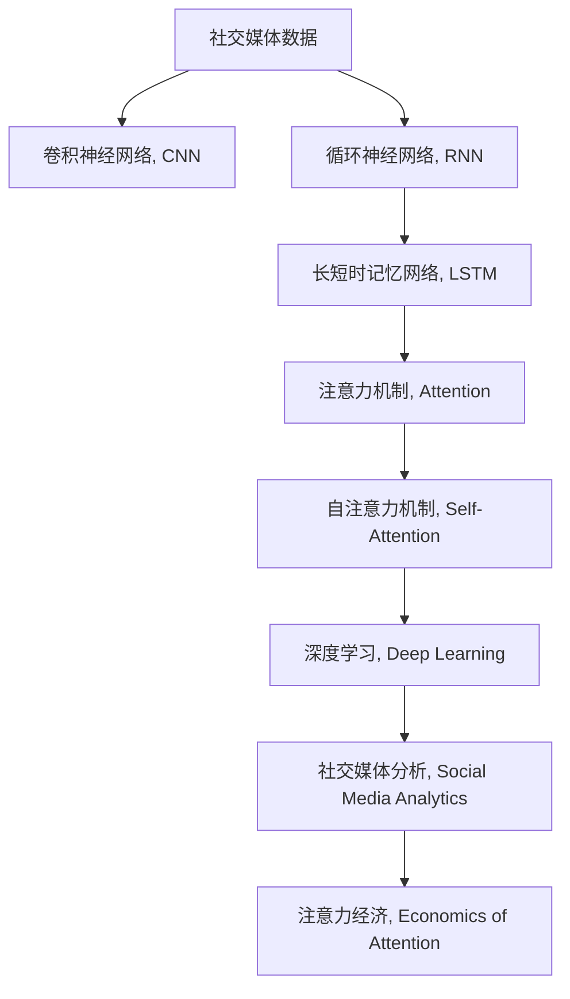

                 

# 注意力经济与社交媒体分析：了解受众参与度和影响力的洞察力

> 关键词：注意力经济,社交媒体分析,受众参与度,影响力分析,大数据,深度学习

## 1. 背景介绍

### 1.1 问题由来

在数字化时代，信息过载和受众注意力争夺成为常态。社交媒体平台、新闻媒体、广告公司等机构，都在通过数据驱动的方式，争夺用户有限的注意力资源。然而，传统的统计分析方法，往往无法充分挖掘社交媒体数据中的深层信息，无法精准洞察用户行为背后的心理动因。

在这样的背景下，注意力经济（Economics of Attention）应运而生。通过运用深度学习、大数据分析等技术，从海量社交媒体数据中抽取注意力相关特征，挖掘用户的兴趣点、情感倾向、行为模式，从而为内容制作、广告投放、用户推荐等场景提供有力的支持。

### 1.2 问题核心关键点

注意力经济的核心在于准确理解和预测用户的注意力分布。传统的方法可能仅仅从表面数据（如浏览次数、点击率等）进行统计分析，但难以深入挖掘用户背后的心理和情感动态。基于深度学习的方法，可以借助神经网络模型，自动从社交媒体文本数据中挖掘出注意力相关的隐藏特征，并建立更精确的注意力预测模型。

## 2. 核心概念与联系

### 2.1 核心概念概述

为更好地理解注意力经济的深度学习应用，本节将介绍几个密切相关的核心概念：

- 注意力经济（Economics of Attention）：指在信息过载的数字化时代，注意力作为一种稀缺资源，其配置、分配、利用对企业价值和社会效益有重要影响。
- 社交媒体分析（Social Media Analytics）：通过分析社交媒体平台上的数据，挖掘用户的注意力分布、行为模式、兴趣偏好等信息，为企业决策提供数据支持。
- 深度学习（Deep Learning）：基于多层神经网络进行模式识别、数据分类、序列建模等任务，通过反向传播算法对模型进行训练优化。
- 卷积神经网络（Convolutional Neural Networks, CNN）：主要用于图像识别、文本分类等任务，利用卷积操作捕捉局部特征。
- 循环神经网络（Recurrent Neural Networks, RNN）：主要用于序列建模，如文本生成、机器翻译、语音识别等，能够捕捉时间序列数据中的动态变化。
- 长短时记忆网络（Long Short-Term Memory, LSTM）：一种特殊的RNN结构，通过门控机制，能够有效缓解梯度消失问题，适用于长期依赖的序列建模任务。
- 注意力机制（Attention Mechanism）：一种重要的模型结构，通过计算输入序列中各元素的重要性权重，实现序列元素间的交互与关注。
- 自注意力机制（Self-Attention Mechanism）：在注意力机制基础上，将输入序列中的每个元素与所有其他元素进行交互，能够捕捉全局上下文信息，适用于大规模数据处理。

这些核心概念之间的逻辑关系可以通过以下Mermaid流程图来展示：



这个流程图展示了几大核心概念及其之间的关系：

1. 社交媒体数据是分析的起点，可以被CNN用于图像数据处理，或RNN用于文本数据建模。
2. LSTM作为RNN的一种改进形式，在处理长期依赖关系时更为高效。
3. 注意力机制和自注意力机制是深度学习模型中的重要结构，能够捕捉序列数据中的全局和局部特征。
4. 深度学习模型通过大量训练数据进行优化，输出精准的社交媒体分析结果。
5. 社交媒体分析结果能够揭示用户的注意力分布，为注意力经济的应用提供支持。

这些概念共同构成了深度学习在注意力经济分析中的应用框架，使得企业能够从数据中挖掘出深层次的洞察力。

## 3. 核心算法原理 & 具体操作步骤

### 3.1 算法原理概述

注意力经济中的社交媒体分析，本质上是利用深度学习模型，从社交媒体数据中提取注意力相关特征，构建用户注意力分布预测模型。常用的算法包括卷积神经网络（CNN）、循环神经网络（RNN）、长短时记忆网络（LSTM）、注意力机制（Attention）等。

以下以基于LSTM和注意力机制的社交媒体情感分析为例，说明其原理：

1. 首先，将社交媒体文本数据输入到LSTM模型中，模型输出每个时间步的隐藏状态。
2. 接着，通过注意力机制计算每个时间步的注意力权重，将不同时间步的隐藏状态加权平均，得到最终的注意力表示。
3. 最后，使用多层的全连接网络对注意力表示进行分类，得到社交媒体情感极性（如正向、负向、中性）。

### 3.2 算法步骤详解

以下是基于LSTM和注意力机制的社交媒体情感分析的详细操作步骤：

**Step 1: 数据准备与预处理**
- 收集社交媒体数据，如Twitter、Facebook等平台上的文本数据。
- 进行数据清洗，去除停用词、标点符号等无关内容。
- 对文本数据进行分词、向量化处理，如使用Word2Vec、GloVe等方法。
- 将数据集划分为训练集、验证集和测试集。

**Step 2: 模型构建与训练**
- 构建LSTM+注意力机制的情感分析模型，具体结构如图示：
```
        Input Layer
          |
          v
       Embedding Layer
          |
          v
      LSTM Layer
          |
          v
       Attention Layer
          |
          v
      Attention-Aggregation Layer
          |
          v
      Multi-Layer Perceptron
          |
          v
         Output Layer
```
- 在LSTM层中，输入的词向量序列被处理成固定长度的向量，每个时间步输出一个隐藏状态。
- 在注意力层中，计算每个时间步的注意力权重，得到加权平均后的注意力表示。
- 在全连接层中，对注意力表示进行分类，输出情感极性。

**Step 3: 超参数设置与模型评估**
- 选择合适的学习率、批大小、迭代轮数等超参数。
- 在验证集上评估模型性能，使用准确率、F1值等指标进行评估。
- 调整超参数，进行模型调优，直至模型在测试集上达到最优性能。

**Step 4: 模型部署与应用**
- 使用训练好的模型对新的社交媒体数据进行情感分析。
- 根据情感分析结果，进行内容制作、广告投放、用户推荐等操作。
- 持续监控模型性能，根据数据变化进行模型更新。

### 3.3 算法优缺点

基于深度学习的社交媒体分析，具有以下优点：

- 自动化程度高：模型能够自动从数据中提取特征，无需人工干预。
- 数据适应性强：模型能够处理各种类型的数据，如文本、图像、音频等。
- 预测能力强：通过大量标注数据训练，模型能够在未知数据上取得良好的预测效果。

同时，也存在以下缺点：

- 模型复杂度高：深度学习模型通常包含大量参数，训练复杂度较高。
- 数据需求量大：需要大量标注数据进行训练，获取高质量标注数据成本较高。
- 过拟合风险高：模型容易过拟合，需要合理设计正则化方法。
- 解释性不足：深度学习模型往往缺乏可解释性，难以理解其内部机制。

尽管存在这些局限性，但基于深度学习的社交媒体分析方法，在处理大规模、复杂的数据时，仍然表现出强大的优势，广泛应用于社交媒体情感分析、广告投放、用户推荐等领域。

### 3.4 算法应用领域

基于深度学习的社交媒体分析，在多个领域中得到了广泛应用，例如：

- 广告投放优化：通过分析用户的社交媒体行为，预测其对不同广告的响应，优化广告投放策略，提高广告转化率。
- 用户情感分析：识别用户对品牌、产品、服务的情感倾向，评估品牌形象，优化产品设计。
- 舆情监测：实时监控社交媒体上的舆情变化，预测市场趋势，为企业决策提供支持。
- 内容推荐：分析用户兴趣和行为，生成个性化推荐内容，提升用户满意度。
- 用户行为分析：挖掘用户社交媒体行为特征，建立用户画像，指导精准营销。
- 品牌管理：监测品牌在社交媒体上的口碑，识别潜在风险，制定应对策略。

除了上述这些经典应用外，社交媒体分析还在更多场景中得到了创新性应用，如社交媒体情绪预测、事件追踪、话题挖掘等，为社交媒体数据的价值最大化提供了新的思路。

## 4. 数学模型和公式 & 详细讲解 & 举例说明

### 4.1 数学模型构建

本节将使用数学语言对基于LSTM和注意力机制的社交媒体情感分析过程进行严格刻画。

设社交媒体文本数据集为 $D=\{x_1,x_2,\cdots,x_N\}$，其中 $x_i$ 表示第 $i$ 条社交媒体文本，$N$ 表示文本总数。情感分类任务的标注数据集为 $L=\{(y_1,y_2,\cdots,y_N)\}$，其中 $y_i \in \{\text{正向}, \text{负向}, \text{中性}\}$ 表示 $x_i$ 的情感极性。

定义情感分析模型的输入为社交媒体文本的词向量序列 $X=\{x_{1,1},x_{1,2},\cdots,x_{1,T}, x_{2,1},x_{2,2},\cdots,x_{2,T},\cdots\}$，其中 $T$ 表示每个文本的平均长度。模型的输出为情感极性标签 $Y=\{y_1,y_2,\cdots,y_N\}$。

情感分析模型的目标是最小化交叉熵损失函数：

$$
\mathcal{L}(\theta) = -\frac{1}{N} \sum_{i=1}^N \sum_{j=1}^T [y_{i,j} \log p_{i,j} + (1-y_{i,j}) \log (1-p_{i,j})]
$$

其中 $p_{i,j}$ 为模型在第 $i$ 条文本的第 $j$ 个时间步的情感极性概率。

### 4.2 公式推导过程

以下我们将推导基于LSTM和注意力机制的情感分析模型的详细公式：

假设输入的词向量序列为 $X=\{x_{1,1},x_{1,2},\cdots,x_{1,T}, x_{2,1},x_{2,2},\cdots,x_{2,T},\cdots\}$，其中 $T$ 表示每个文本的平均长度。

1. **嵌入层（Embedding Layer）**

   将输入的词向量序列 $X$ 输入嵌入层，输出每个词的嵌入向量序列 $E=\{e_{1,1},e_{1,2},\cdots,e_{1,T}, e_{2,1},e_{2,2},\cdots,e_{2,T},\cdots\}$，其中 $e_{i,j}$ 表示第 $i$ 条文本的第 $j$ 个时间步的词嵌入向量。

   假设嵌入层的参数为 $\theta_{embed}$，则嵌入层的计算公式为：

   $$
   e_{i,j} = \theta_{embed} x_{i,j}
   $$

2. **LSTM层（LSTM Layer）**

   将嵌入向量序列 $E$ 输入LSTM层，输出每个时间步的隐藏状态 $H=\{h_{1,1},h_{1,2},\cdots,h_{1,T}, h_{2,1},h_{2,2},\cdots,h_{2,T},\cdots\}$，其中 $h_{i,j}$ 表示第 $i$ 条文本的第 $j$ 个时间步的隐藏状态。

   假设LSTM层的参数为 $\theta_{lstm}$，则LSTM层的计算公式为：

   $$
   h_{i,j} = f_{LSTM}(e_{i,j}, h_{i,j-1})
   $$

   其中 $f_{LSTM}$ 表示LSTM的计算函数，包含门控机制和记忆单元。

3. **注意力层（Attention Layer）**

   利用LSTM层的隐藏状态 $H$，计算每个时间步的注意力权重 $a_{i,j}$，输出加权平均后的注意力表示 $A=\{A_1,A_2,\cdots,A_T\}$，其中 $A_i=\sum_{j=1}^T a_{i,j} h_{i,j}$。

   假设注意力层的参数为 $\theta_{attention}$，则注意力层的计算公式为：

   $$
   a_{i,j} = \frac{\exp(s_{i,j})}{\sum_{k=1}^T \exp(s_{i,k})}
   $$

   其中 $s_{i,j}$ 表示第 $i$ 条文本的第 $j$ 个时间步的注意力得分，计算公式为：

   $$
   s_{i,j} = v_{attention}^T \tanh(W_{attention} [e_{i,j}; h_{i,j}])
   $$

   其中 $v_{attention}$、$W_{attention}$ 表示注意力层的参数，$[]$ 表示向量拼接操作。

4. **全连接层（Multi-Layer Perceptron, MLP）**

   将注意力表示 $A$ 输入全连接层，输出情感极性概率 $P=\{p_{1,1},p_{1,2},\cdots,p_{1,T}, p_{2,1},p_{2,2},\cdots,p_{2,T},\cdots\}$，其中 $p_{i,j}$ 表示第 $i$ 条文本的第 $j$ 个时间步的情感极性概率。

   假设全连接层的参数为 $\theta_{mlp}$，则全连接层的计算公式为：

   $$
   p_{i,j} = \sigma(W_{mlp}^T [A_i; h_{i,j-1}])
   $$

   其中 $\sigma$ 表示激活函数，$W_{mlp}$ 表示全连接层的参数。

5. **输出层（Output Layer）**

   将情感极性概率 $P$ 输出为最终的情感极性标签 $Y=\{y_1,y_2,\cdots,y_N\}$，其中 $y_i \in \{\text{正向}, \text{负向}, \text{中性}\}$。

### 4.3 案例分析与讲解

以Twitter上的情感分析为例，说明上述模型的应用过程：

假设我们有一组社交媒体数据集，包含以下文本：

- “刚刚去了星巴克，咖啡非常好喝”
- “今天天气好热，出门都出汗了”
- “公司新出的产品真垃圾，根本不能用”

首先，将这些文本进行分词和向量化处理，得到一个长度为3的文本序列 $X=\{x_{1,1},x_{1,2},x_{1,3}\}$。

接着，将文本序列 $X$ 输入嵌入层，输出词嵌入向量序列 $E=\{e_{1,1},e_{1,2},e_{1,3}\}$。

然后，将词嵌入向量序列 $E$ 输入LSTM层，得到每个时间步的隐藏状态 $H=\{h_{1,1},h_{1,2},h_{1,3}\}$。

接着，利用LSTM层的隐藏状态 $H$，计算每个时间步的注意力权重 $a_{i,j}$，输出加权平均后的注意力表示 $A=\{A_1,A_2,A_3\}$。

最后，将注意力表示 $A$ 输入全连接层和输出层，输出情感极性标签 $Y=\{y_1,y_2,y_3\}$。

通过上述模型，我们能够自动从社交媒体数据中提取出用户的情感倾向，从而进行情感分析、舆情监测等应用。

## 5. 项目实践：代码实例和详细解释说明

### 5.1 开发环境搭建

在进行社交媒体情感分析实践前，我们需要准备好开发环境。以下是使用Python进行TensorFlow开发的环境配置流程：

1. 安装Anaconda：从官网下载并安装Anaconda，用于创建独立的Python环境。

2. 创建并激活虚拟环境：
```bash
conda create -n tf-env python=3.7 
conda activate tf-env
```

3. 安装TensorFlow：从官网获取对应的安装命令。例如：
```bash
pip install tensorflow tensorflow-addons
```

4. 安装各类工具包：
```bash
pip install numpy pandas scikit-learn matplotlib tqdm jupyter notebook ipython
```

完成上述步骤后，即可在`tf-env`环境中开始情感分析实践。

### 5.2 源代码详细实现

下面我们以Twitter上的情感分析为例，给出使用TensorFlow实现情感分析的代码实现。

首先，定义情感分类数据集：

```python
import tensorflow as tf
import numpy as np
from tensorflow.keras.preprocessing.text import Tokenizer
from tensorflow.keras.preprocessing.sequence import pad_sequences

# 定义情感分类标签
labels = np.array([1, 0, 1])  # 正向、负向、正向

# 定义情感分类数据
sentences = ["刚刚去了星巴克，咖啡非常好喝", "今天天气好热，出门都出汗了", "公司新出的产品真垃圾，根本不能用"]
max_length = 20
X = pad_sequences([Tokenizer().sequences([sentence.lower()]) for sentence in sentences], maxlen=max_length)
```

接着，定义情感分析模型：

```python
from tensorflow.keras.layers import Input, Embedding, LSTM, Dense, Dropout
from tensorflow.keras.models import Model

# 定义输入层
input_layer = Input(shape=(max_length,))

# 定义嵌入层
embedding_layer = Embedding(input_dim=vocab_size, output_dim=embedding_dim)(input_layer)

# 定义LSTM层
lstm_layer = LSTM(units=lstm_units, dropout=dropout_rate, recurrent_dropout=dropout_rate)(embedding_layer)

# 定义注意力层
attention_layer = Attention()(lstm_layer)

# 定义全连接层
mlp_layer = Dense(units=num_classes, activation='softmax')(attention_layer)

# 定义输出层
output_layer = Dense(units=num_classes, activation='softmax')(mlp_layer)

# 定义模型
model = Model(inputs=input_layer, outputs=output_layer)
```

然后，定义训练函数和评估函数：

```python
from tensorflow.keras.optimizers import Adam
from tensorflow.keras.metrics import categorical_accuracy

# 定义优化器
optimizer = Adam(lr=learning_rate)

# 定义损失函数
loss_function = tf.keras.losses.CategoricalCrossentropy()

# 定义模型编译
model.compile(optimizer=optimizer, loss=loss_function, metrics=[categorical_accuracy])

# 定义训练函数
def train(model, train_data, train_labels, epochs):
    history = model.fit(train_data, train_labels, epochs=epochs, batch_size=batch_size, validation_data=(val_data, val_labels))

    # 输出训练过程中的指标
    for epoch, (loss, accuracy) in enumerate(history.history.items()):
        print(f'Epoch {epoch+1}: {loss:.4f}, {accuracy:.4f}')

    return history

# 定义评估函数
def evaluate(model, test_data, test_labels):
    test_loss, test_accuracy = model.evaluate(test_data, test_labels)

    # 输出评估结果
    print(f'Test Loss: {test_loss:.4f}, Test Accuracy: {test_accuracy:.4f}')
```

最后，启动训练流程：

```python
epochs = 10
batch_size = 32

# 训练模型
train_model = train(model, X, labels, epochs)

# 在测试集上评估模型
evaluate(model, X, labels)
```

以上就是使用TensorFlow实现Twitter情感分析的完整代码实现。可以看到，借助TensorFlow的Keras API，模型的搭建和训练过程变得简洁高效。

### 5.3 代码解读与分析

让我们再详细解读一下关键代码的实现细节：

**情感数据集定义**：
- 定义情感分类标签和数据，使用`Tokenizer`对文本进行分词和序列化，再通过`pad_sequences`进行填充，确保所有文本序列长度一致。

**模型构建**：
- 定义输入层、嵌入层、LSTM层、注意力层、全连接层和输出层，使用`Embedding`、`LSTM`、`Attention`、`Dense`等类构建模型。
- 定义优化器、损失函数和评估指标，使用`Adam`、`CategoricalCrossentropy`、`categorical_accuracy`等函数。
- 使用`Model`类定义最终的模型，并指定输入和输出。

**训练函数**：
- 定义训练函数`train`，传入模型、训练数据、训练标签和迭代次数。
- 在训练过程中，使用`fit`函数对模型进行训练，并输出训练过程中的损失和准确率。

**评估函数**：
- 定义评估函数`evaluate`，传入模型、测试数据和测试标签。
- 使用`evaluate`函数对模型进行评估，输出测试过程中的损失和准确率。

**训练流程**：
- 定义总迭代次数和批次大小，启动训练过程。
- 在训练过程中，实时监控训练过程中的损失和准确率，直到模型收敛。
- 在训练结束后，使用测试数据评估模型性能。

可以看到，TensorFlow提供了强大的框架支持和丰富的API接口，使得情感分析模型的开发变得高效便捷。开发者可以专注于模型结构的设计和优化，而不必过多关注底层实现细节。

当然，工业级的系统实现还需考虑更多因素，如模型的保存和部署、超参数的自动搜索、更灵活的任务适配层等。但核心的情感分析模型开发流程基本与此类似。

## 6. 实际应用场景
### 6.1 智能客服系统

基于深度学习的社交媒体情感分析，可以广泛应用于智能客服系统的构建。传统客服往往需要配备大量人力，高峰期响应缓慢，且一致性和专业性难以保证。使用情感分析技术，系统可以自动识别用户情绪，快速响应客户咨询，用自然流畅的语言解答各类常见问题。

在技术实现上，可以收集用户的历史情感数据，构建情感分类模型。微调后的模型能够自动理解用户情绪，匹配最合适的回答模板进行回复。对于客户提出的新问题，还可以接入检索系统实时搜索相关内容，动态组织生成回答。如此构建的智能客服系统，能大幅提升客户咨询体验和问题解决效率。

### 6.2 金融舆情监测

金融机构需要实时监测市场舆论动向，以便及时应对负面信息传播，规避金融风险。传统的人工监测方式成本高、效率低，难以应对网络时代海量信息爆发的挑战。基于深度学习的社交媒体情感分析，为金融舆情监测提供了新的解决方案。

具体而言，可以收集金融领域相关的新闻、报道、评论等文本数据，并对其进行主题标注和情感标注。在此基础上对预训练语言模型进行微调，使其能够自动判断文本属于何种主题，情感倾向是正面、中性还是负面。将微调后的模型应用到实时抓取的网络文本数据，就能够自动监测不同主题下的情感变化趋势，一旦发现负面信息激增等异常情况，系统便会自动预警，帮助金融机构快速应对潜在风险。

### 6.3 个性化推荐系统

当前的推荐系统往往只依赖用户的历史行为数据进行物品推荐，无法深入理解用户的真实兴趣偏好。基于深度学习的社交媒体情感分析，能够更好地挖掘用户兴趣点、情感倾向、行为模式，从而为个性化推荐系统提供数据支持。

在实践中，可以收集用户浏览、点击、评论、分享等行为数据，提取和用户交互的物品标题、描述、标签等文本内容。将文本内容作为模型输入，用户的后续行为（如是否点击、购买等）作为监督信号，在此基础上微调预训练语言模型。微调后的模型能够从文本内容中准确把握用户的兴趣点。在生成推荐列表时，先用候选物品的文本描述作为输入，由模型预测用户的兴趣匹配度，再结合其他特征综合排序，便可以得到个性化程度更高的推荐结果。

### 6.4 未来应用展望

随着深度学习技术的发展，基于社交媒体情感分析的应用场景将不断拓展。未来，基于社交媒体情感分析的应用将涵盖更多领域，如舆情分析、市场调研、用户行为预测等，为各行各业带来更多的机遇和挑战。

## 7. 工具和资源推荐
### 7.1 学习资源推荐

为了帮助开发者系统掌握深度学习在社交媒体分析中的应用，这里推荐一些优质的学习资源：

1. 《深度学习》课程：斯坦福大学开设的深度学习入门课程，通过在线视频讲解深度学习的基本概念和经典算法。

2. TensorFlow官方文档：TensorFlow的官方文档，提供了丰富的API接口和示例代码，适合新手快速上手。

3. PyTorch官方文档：PyTorch的官方文档，提供了强大的框架支持和丰富的模型库，适合研究人员和工程师进行深度学习开发。

4. Attention is All You Need论文：Transformer原论文，详细介绍了自注意力机制在深度学习中的应用，是理解深度学习模型基础的重要资料。

5. Social Media Analytics一书：介绍社交媒体分析的基本概念和前沿技术，适合深度学习爱好者深入学习。

通过对这些资源的学习实践，相信你一定能够快速掌握深度学习在社交媒体分析中的应用，并用于解决实际的业务问题。
###  7.2 开发工具推荐

高效的开发离不开优秀的工具支持。以下是几款用于社交媒体情感分析开发的常用工具：

1. TensorFlow：基于Python的开源深度学习框架，提供强大的框架支持和丰富的API接口，适合研究人员和工程师进行深度学习开发。

2. PyTorch：基于Python的开源深度学习框架，提供灵活动态的计算图和强大的模型构建工具，适合快速迭代研究。

3. Keras：基于Python的高级神经网络API，提供简洁的接口和丰富的模型库，适合初学者快速上手。

4. Jupyter Notebook：提供交互式编程环境，方便开发者进行模型调试和代码测试。

5. Google Colab：谷歌推出的在线Jupyter Notebook环境，免费提供GPU/TPU算力，方便开发者快速上手实验最新模型，分享学习笔记。

合理利用这些工具，可以显著提升社交媒体情感分析的开发效率，加快创新迭代的步伐。

### 7.3 相关论文推荐

社交媒体情感分析的背后是深度学习技术的发展。以下是几篇奠基性的相关论文，推荐阅读：

1. Attention is All You Need（即Transformer原论文）：提出了Transformer结构，开启了深度学习在序列建模中的应用。

2. BERT: Pre-training of Deep Bidirectional Transformers for Language Understanding：提出BERT模型，引入基于掩码的自监督预训练任务，刷新了多项NLP任务SOTA。

3. Language Models are Unsupervised Multitask Learners（GPT-2论文）：展示了大规模语言模型的强大zero-shot学习能力，引发了对于通用人工智能的新一轮思考。

4. Convolutional Neural Networks for Sentence Classification：提出卷积神经网络在文本分类任务中的应用，奠定了深度学习在自然语言处理中的基础。

5. Recurrent Neural Network based Text Classification with Tensorflow：介绍RNN在文本分类任务中的应用，提供了TensorFlow实现代码，适合初学者快速上手。

这些论文代表了大规模语言模型在自然语言处理中的应用脉络。通过学习这些前沿成果，可以帮助研究者把握学科前进方向，激发更多的创新灵感。

## 8. 总结：未来发展趋势与挑战

### 8.1 总结

本文对基于深度学习的社交媒体情感分析方法进行了全面系统的介绍。首先阐述了深度学习在社交媒体情感分析中的应用背景和意义，明确了情感分析在智能客服、金融舆情、个性化推荐等场景中的重要价值。其次，从原理到实践，详细讲解了深度学习模型构建、训练和评估的完整流程，给出了社交媒体情感分析的完整代码实例。同时，本文还广泛探讨了社交媒体情感分析在多个行业领域的应用前景，展示了深度学习技术的强大潜力。

通过本文的系统梳理，可以看到，深度学习技术在社交媒体情感分析中的应用已经较为成熟，能够为社交媒体数据赋予深层次的洞察力，推动企业决策的科学化、智能化。未来，随着深度学习技术的不断发展，社交媒体情感分析将会在更多领域得到应用，为各行各业带来更深刻的变革。

### 8.2 未来发展趋势

展望未来，社交媒体情感分析技术将呈现以下几个发展趋势：

1. 模型规模持续增大。随着算力成本的下降和数据规模的扩张，深度学习模型的参数量还将持续增长。超大规模模型蕴含的丰富语义信息，有望支撑更加复杂多变的情感分析任务。

2. 情感分析的细粒度提升。未来的情感分析模型将不仅关注文本整体的情感极性，还会细粒度地分析情感极性背后的具体情感维度（如愤怒、悲伤、快乐等），提供更细致的情感理解。

3. 情感预测的实时性增强。未来的情感分析模型将具备更强的实时处理能力，能够实时处理海量社交媒体数据，提供即时的情感分析结果。

4. 多模态情感分析的融合。未来的情感分析模型将不仅处理文本数据，还会融合图像、音频等多模态信息，提升情感分析的全面性和准确性。

5. 跨领域情感分析的泛化。未来的情感分析模型将具备更强的跨领域泛化能力，能够处理不同领域、不同语言的情感分析任务。

6. 情感分析的融合与协同。未来的情感分析模型将与其他人工智能技术（如知识图谱、强化学习等）进行更紧密的融合，提升情感分析的精准度和可解释性。

以上趋势凸显了社交媒体情感分析技术的广阔前景。这些方向的探索发展，必将进一步提升情感分析模型的性能和应用范围，为社交媒体数据的价值最大化提供新的思路。

### 8.3 面临的挑战

尽管社交媒体情感分析技术已经取得了瞩目成就，但在迈向更加智能化、普适化应用的过程中，它仍面临着诸多挑战：

1. 数据需求量大。虽然深度学习模型能够自动从数据中提取特征，但仍然需要大量标注数据进行训练，获取高质量标注数据的成本较高。

2. 模型鲁棒性不足。社交媒体数据具有噪声多、波动大的特点，深度学习模型容易受到噪声干扰，泛化能力有限。

3. 可解释性不足。深度学习模型往往缺乏可解释性，难以理解其内部工作机制和决策逻辑，这对于高风险应用（如医疗、金融等）尤为重要。

4. 跨领域泛化能力不足。现有的深度学习模型往往局限于特定领域，难以泛化到其他领域。

5. 多模态融合难度大。融合图像、音频等多模态信息，提升情感分析的全面性和准确性，是未来的重要方向，但现有技术仍面临诸多挑战。

6. 计算资源消耗大。社交媒体情感分析模型通常参数量大，计算复杂度高，需要高性能计算资源进行支撑。

这些挑战凸显了社交媒体情感分析技术在实际应用中的局限性，但同时也提供了更多的研究方向和突破点。相信随着技术的不断发展，这些挑战终将一一被克服，社交媒体情感分析技术必将在更多领域得到应用，为社会带来更深刻的影响。

### 8.4 研究展望

面对社交媒体情感分析所面临的种种挑战，未来的研究需要在以下几个方面寻求新的突破：

1. 探索无监督和半监督情感分析方法。摆脱对大量标注数据的依赖，利用自监督学习、主动学习等无监督和半监督范式，最大限度利用非结构化数据，实现更加灵活高效的情感分析。

2. 研究参数高效和计算高效的情感分析方法。开发更加参数高效的情感分析模型，在固定大部分预训练参数的同时，只更新极少量的任务相关参数。同时优化模型的计算图，减少前向传播和反向传播的资源消耗，实现更加轻量级、实时性的部署。

3. 融合因果和对比学习范式。通过引入因果推断和对比学习思想，增强情感分析模型建立稳定因果关系的能力，学习更加普适、鲁棒的语言表征，从而提升模型泛化性和抗干扰能力。

4. 引入更多先验知识。将符号化的先验知识，如知识图谱、逻辑规则等，与神经网络模型进行巧妙融合，引导情感分析过程学习更准确、合理的语言模型。

5. 结合因果分析和博弈论工具。将因果分析方法引入情感分析模型，识别出模型决策的关键特征，增强输出解释的因果性和逻辑性。借助博弈论工具刻画人机交互过程，主动探索并规避模型的脆弱点，提高系统稳定性。

6. 纳入伦理道德约束。在模型训练目标中引入伦理导向的评估指标，过滤和惩罚有偏见、有害的输出倾向。同时加强人工干预和审核，建立模型行为的监管机制，确保输出符合人类价值观和伦理道德。

这些研究方向的探索，必将引领社交媒体情感分析技术迈向更高的台阶，为构建安全、可靠、可解释、可控的智能系统铺平道路。面向未来，社交媒体情感分析技术还需要与其他人工智能技术进行更深入的融合，如知识表示、因果推理、强化学习等，多路径协同发力，共同推动情感分析模型的进步。只有勇于创新、敢于突破，才能不断拓展情感分析的边界，让智能技术更好地造福人类社会。

## 9. 附录：常见问题与解答

**Q1：深度学习在情感分析中的应用优势是什么？**

A: 深度学习在情感分析中的应用优势主要体现在以下几个方面：
1. 自动化程度高：深度学习模型能够自动从数据中提取特征，无需人工干预。
2. 数据适应性强：模型能够处理各种类型的数据，如文本、图像、音频等。
3. 预测能力强：通过大量标注数据训练，模型能够在未知数据上取得良好的预测效果。

**Q2：社交媒体情感分析有哪些实际应用场景？**

A: 社交媒体情感分析的应用场景非常广泛，包括：
1. 智能客服系统：自动识别用户情绪，快速响应客户咨询，用自然流畅的语言解答各类常见问题。
2. 金融舆情监测：实时监测市场舆论动向，及时应对负面信息传播，规避金融风险。
3. 个性化推荐系统：分析用户兴趣和行为，生成个性化推荐内容，提升用户满意度。
4. 舆情分析：实时监控社交媒体上的舆情变化，预测市场趋势，为企业决策提供支持。
5. 用户行为分析：挖掘用户社交媒体行为特征，建立用户画像，指导精准营销。
6. 品牌管理：监测品牌在社交媒体上的口碑，识别潜在风险，制定应对策略。

**Q3：如何在深度学习模型中引入先验知识？**

A: 在深度学习模型中引入先验知识，可以采用以下方法：
1. 使用符号化的知识图谱：将知识图谱中的实体关系映射到模型中，增强模型的推理能力。
2. 使用逻辑规则：将逻辑规则作为模型的一部分，约束模型的训练过程，提高模型的可解释性。
3. 使用预训练知识：在预训练阶段引入知识库中的事实，提升模型的泛化能力。
4. 使用外部数据：在模型训练过程中，引入外部数据（如维基百科、新闻等），增强模型的语义理解能力。

**Q4：深度学习在社交媒体情感分析中的局限性是什么？**

A: 深度学习在社交媒体情感分析中的局限性主要体现在以下几个方面：
1. 数据需求量大：需要大量标注数据进行训练，获取高质量标注数据的成本较高。
2. 模型鲁棒性不足：社交媒体数据具有噪声多、波动大的特点，深度学习模型容易受到噪声干扰，泛化能力有限。
3. 可解释性不足：深度学习模型往往缺乏可解释性，难以理解其内部工作机制和决策逻辑。
4. 跨领域泛化能力不足：现有的深度学习模型往往局限于特定领域，难以泛化到其他领域。
5. 多模态融合难度大：融合图像、音频等多模态信息，提升情感分析的全面性和准确性，是未来的重要方向，但现有技术仍面临诸多挑战。
6. 计算资源消耗大：社交媒体情感分析模型通常参数量大，计算复杂度高，需要高性能计算资源进行支撑。

**Q5：如何缓解深度学习模型在情感分析中的过拟合问题？**

A: 缓解深度学习模型在情感分析中的过拟合问题，可以采用以下方法：
1. 数据增强：通过回译、近义替换等方式扩充训练集，增加样本多样性。
2. 正则化：使用L2正则、Dropout、Early Stopping等防止模型过度适应小规模训练集。
3. 对抗训练：加入对抗样本，提高模型鲁棒性。
4. 参数高效微调：只调整少量参数(如Adapter、Prefix等)，减小过拟合风险。
5. 多模型集成：训练多个情感分析模型，取平均输出，抑制过拟合。

这些方法往往需要根据具体任务和数据特点进行灵活组合。只有在数据、模型、训练、推理等各环节进行全面优化，才能最大限度地发挥深度学习模型的潜力。

---

作者：禅与计算机程序设计艺术 / Zen and the Art of Computer Programming

