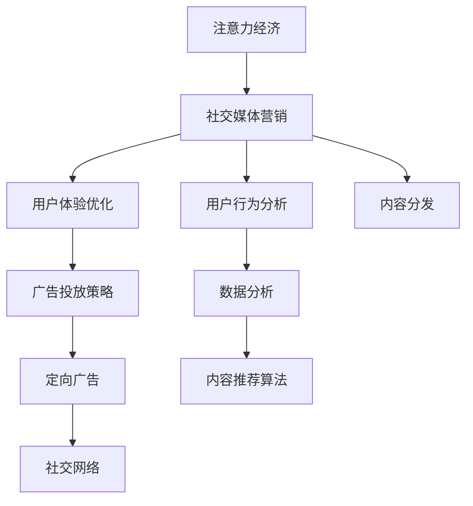

                 

# 注意力经济与社交媒体营销策略与实践：在不牺牲用户体验的情况下吸引受众

> 关键词：注意力经济, 社交媒体营销, 用户行为分析, 数据分析, 用户体验优化, 广告投放策略, 定向广告, 社交网络, 内容推荐算法

## 1. 背景介绍

在数字化时代，社交媒体已成为人们获取信息、交流互动的重要平台。各大社交平台通过内容传播和用户互动获取流量，从而创造商业价值，形成了特有的“注意力经济”模式。广告主为了吸引受众，在社交媒体上投放各种形式的广告内容，但如何精准高效地投放广告，同时又不牺牲用户体验，成为社交媒体营销的一大挑战。

### 1.1 问题由来

随着社交媒体平台的兴起，越来越多的品牌选择在这些平台上投放广告，以吸引和维护客户。然而，由于社交媒体上的内容过载和广告泛滥，用户对广告的接受度和信任度持续下降，点击率和转化率不高。如何在保护用户体验的同时，最大化广告效果，成为品牌和广告主关注的焦点。

### 1.2 问题核心关键点

社交媒体营销的核心在于如何有效利用注意力资源，同时保证用户体验。关键点在于：
- 精准定位用户：通过数据分析和用户行为模型，识别潜在目标用户群体。
- 内容个性化：根据用户兴趣和行为特征，推送个性化广告内容。
- 广告投放策略优化：设计科学的广告投放策略，提高广告点击率和转化率。
- 效果评估与优化：利用用户反馈和行为数据，不断优化广告投放策略。

## 2. 核心概念与联系

### 2.1 核心概念概述

为了更深入地理解注意力经济与社交媒体营销的策略与实践，本节将介绍几个核心概念及其关联：

- **注意力经济**：基于社交媒体平台的商业模式，通过吸引和维持用户的注意力，创造商业价值。
- **社交媒体营销**：通过在社交平台上发布内容、互动和广告，吸引目标受众，实现品牌推广和销售目标。
- **用户行为分析**：通过数据分析技术，理解用户的行为模式和偏好，从而优化广告投放策略。
- **数据分析**：收集、整理和分析用户数据，用于指导决策和优化。
- **用户体验优化**：通过优化广告内容、投放方式和页面设计，提升用户的满意度和留存率。
- **广告投放策略**：制定合理的广告投放规则和策略，以提高广告效果。
- **定向广告**：基于用户画像和行为数据，精准投放广告。
- **社交网络**：社交媒体平台的网络结构，用于分析用户间的关系和互动。
- **内容推荐算法**：用于预测和推荐用户可能感兴趣的内容和广告。

这些概念通过以下Mermaid流程图展示其关系：



此流程图展示了注意力经济、社交媒体营销与用户行为分析、数据分析、用户体验优化、广告投放策略、定向广告、社交网络、内容推荐算法等概念之间的联系。

## 3. 核心算法原理 & 具体操作步骤

### 3.1 算法原理概述

社交媒体营销的策略与实践，核心在于如何通过分析用户行为和社交网络数据，设计科学的广告投放策略，同时保护用户体验。其核心算法包括：

- **用户行为分析**：通过分析用户的历史行为数据，识别用户的兴趣、偏好和行为模式。
- **数据分析**：收集用户互动数据、内容消费数据、广告互动数据等，用于建立用户画像和行为模型。
- **用户体验优化**：通过A/B测试等方法，测试和优化广告内容和投放方式，确保不牺牲用户体验。
- **广告投放策略**：基于用户画像和行为模型，设计精准的广告投放策略，提高广告效果。
- **定向广告**：通过机器学习算法，精准识别目标用户，实现定向广告投放。
- **内容推荐算法**：通过协同过滤、深度学习等算法，推荐个性化内容，同时实现广告内容的个性化推荐。

### 3.2 算法步骤详解

#### 3.2.1 用户行为分析

用户行为分析是社交媒体营销的基础，其步骤如下：

1. **数据收集**：收集用户的浏览、点赞、评论、分享等互动数据，以及广告点击、转化等行为数据。
2. **数据预处理**：对收集到的数据进行清洗、去重和格式化处理，以消除噪声和冗余。
3. **特征提取**：使用特征工程技术，提取用户行为特征，如兴趣标签、互动频率、点击行为等。
4. **建模分析**：通过机器学习模型（如聚类、分类、回归等）对用户行为进行分析和建模，识别用户行为模式和兴趣偏好。

#### 3.2.2 数据分析

数据分析用于构建用户画像和行为模型，步骤如下：

1. **数据整合**：将来自不同渠道的用户数据进行整合，形成统一的用户数据视图。
2. **数据可视化**：使用数据可视化工具（如Tableau、Power BI等）展示用户行为数据，识别行为特征和趋势。
3. **用户画像构建**：通过聚类算法（如K-Means、DBSCAN等）对用户进行分组，构建用户画像。
4. **行为模型建立**：使用机器学习算法（如线性回归、决策树、随机森林等）建立用户行为预测模型，用于预测用户兴趣和行为。

#### 3.2.3 用户体验优化

用户体验优化是社交媒体营销中至关重要的一环，具体步骤如下：

1. **A/B测试设计**：设计两组或多组广告内容或投放方式，进行A/B测试，比较其效果。
2. **效果评估**：通过点击率、转化率、用户满意度等指标评估广告效果，找出最优方案。
3. **优化策略**：根据测试结果，优化广告内容、投放时间和渠道，提升用户体验。

#### 3.2.4 广告投放策略

广告投放策略是实现精准营销的关键，步骤如下：

1. **目标群体识别**：基于用户画像和行为模型，识别潜在目标用户群体。
2. **投放渠道选择**：根据目标群体的特点，选择合适的广告投放渠道（如Facebook、Instagram、Twitter等）。
3. **广告形式设计**：设计符合目标用户喜好的广告形式，如图片、视频、文字广告等。
4. **投放时间优化**：根据用户活跃时间，选择最佳的广告投放时间。

#### 3.2.5 定向广告

定向广告是精准投放的核心，具体步骤如下：

1. **用户画像生成**：通过数据分析，生成详细的用户画像，包括年龄、性别、兴趣、地理位置等。
2. **定向算法设计**：使用机器学习算法（如协同过滤、决策树、逻辑回归等），识别符合广告定位的用户群体。
3. **广告投放实施**：根据定向算法结果，进行广告投放，确保广告精准触达目标用户。

#### 3.2.6 内容推荐算法

内容推荐算法用于提升用户满意度和留存率，步骤如下：

1. **特征提取**：提取用户行为特征、内容特征和用户画像特征。
2. **协同过滤算法**：通过协同过滤算法（如用户-物品协同过滤、物品-物品协同过滤等），推荐用户可能感兴趣的内容。
3. **深度学习模型**：使用深度学习模型（如CNN、RNN、GNN等），进行内容推荐，提升推荐精度。
4. **推荐系统优化**：通过A/B测试等方法，不断优化推荐算法，提升用户体验。

### 3.3 算法优缺点

社交媒体营销的算法策略具有以下优点：

1. **精准投放**：通过数据分析和机器学习算法，实现精准广告投放，提高广告效果。
2. **用户体验优化**：通过A/B测试等方法，不断优化广告内容，提升用户满意度。
3. **定向广告**：通过用户画像和行为模型，实现定向广告投放，提高广告转化率。
4. **效果评估**：通过数据分析和行为模型，及时评估广告效果，进行优化调整。

同时，这些算法也存在以下缺点：

1. **数据隐私**：收集和分析用户数据可能涉及隐私问题，需要确保数据安全和使用合规。
2. **算法复杂**：数据分析和机器学习算法的实现较为复杂，需要较高的技术门槛。
3. **数据质量**：用户数据的质量和完整性直接影响算法的精度和效果。
4. **模型过拟合**：过度拟合用户数据可能导致模型泛化能力不足，影响广告效果。
5. **用户反感**：频繁的定向广告可能引发用户反感，影响用户体验。

## 4. 数学模型和公式 & 详细讲解 & 举例说明

### 4.1 数学模型构建

社交媒体营销的核心数学模型主要包括以下几个方面：

1. **用户行为模型**：
   - 用户行为表示为向量 $x = (x_1, x_2, \dots, x_n)$，其中 $x_i$ 表示用户行为特征。
   - 用户行为模型可以表示为线性回归模型 $y = \beta_0 + \sum_{i=1}^n \beta_i x_i$，其中 $y$ 表示用户行为结果，$\beta_0, \beta_i$ 为模型系数。

2. **用户画像模型**：
   - 用户画像表示为向量 $u = (u_1, u_2, \dots, u_m)$，其中 $u_i$ 表示用户画像特征。
   - 用户画像模型可以表示为聚类模型 $u = \{u_1, u_2, \dots, u_k\}$，其中 $u_i$ 表示第 $i$ 个用户群体。

3. **广告投放模型**：
   - 广告投放表示为向量 $a = (a_1, a_2, \dots, a_l)$，其中 $a_i$ 表示广告投放策略。
   - 广告投放模型可以表示为决策树模型 $a = \{a_1, a_2, \dots, a_l\}$，其中 $a_i$ 表示第 $i$ 个广告投放策略。

### 4.2 公式推导过程

以用户行为模型为例，进行公式推导：

1. **线性回归模型**：
   - 用户行为模型 $y = \beta_0 + \sum_{i=1}^n \beta_i x_i$。
   - 根据最小二乘法，求解 $\beta_0, \beta_i$ 的值。
   - 最小化残差平方和：$SSR = \sum_{i=1}^n (y_i - \hat{y}_i)^2$。

2. **正则化线性回归**：
   - 为防止过拟合，引入正则项 $\lambda \sum_{i=1}^n \beta_i^2$。
   - 优化目标函数：$L(\beta) = SSR + \lambda \sum_{i=1}^n \beta_i^2$。

### 4.3 案例分析与讲解

假设某电商平台希望在Facebook上投放个性化广告，提升用户购买转化率。

1. **数据收集**：收集用户历史浏览记录、购买记录、点击记录等行为数据。
2. **数据预处理**：对收集到的数据进行清洗、去重和格式化处理，构建用户行为向量 $x$。
3. **用户行为模型**：使用线性回归模型 $y = \beta_0 + \sum_{i=1}^n \beta_i x_i$ 预测用户购买行为，得到模型系数 $\beta_0, \beta_i$。
4. **用户画像构建**：通过聚类算法将用户分为不同群体，构建用户画像向量 $u$。
5. **广告投放模型**：设计广告投放策略向量 $a$，基于用户画像和行为模型进行定向投放。
6. **效果评估**：通过A/B测试评估广告效果，优化广告投放策略。

## 5. 项目实践：代码实例和详细解释说明

### 5.1 开发环境搭建

为了实现上述算法策略，需要进行以下环境搭建：

1. **Python环境**：安装Anaconda，创建独立的Python环境。
2. **数据存储**：使用MySQL或Hadoop等数据库存储用户数据。
3. **数据处理**：使用Pandas进行数据清洗、预处理和分析。
4. **机器学习**：使用Scikit-learn、TensorFlow等机器学习库进行模型训练和优化。
5. **可视化**：使用Matplotlib、Seaborn等库进行数据可视化。
6. **广告投放平台**：使用Facebook Ads等广告投放平台，实现定向广告投放。

### 5.2 源代码详细实现

下面是一个简化的用户行为分析的代码实现示例：

```python
import pandas as pd
from sklearn.linear_model import LinearRegression
from sklearn.model_selection import train_test_split

# 加载数据
data = pd.read_csv('user_behavior_data.csv')

# 数据预处理
data = data.dropna()
data = data.drop_duplicates()

# 特征提取
features = ['age', 'gender', 'interest']
X = data[features]
y = data['purchase']

# 数据划分
X_train, X_test, y_train, y_test = train_test_split(X, y, test_size=0.2, random_state=42)

# 模型训练
model = LinearRegression()
model.fit(X_train, y_train)

# 效果评估
y_pred = model.predict(X_test)
print(classification_report(y_test, y_pred))
```

### 5.3 代码解读与分析

上述代码实现了用户行为分析的基本流程，具体解释如下：

1. **数据加载和预处理**：使用Pandas加载用户行为数据，并进行去重和处理缺失值。
2. **特征提取**：提取用户年龄、性别和兴趣等行为特征。
3. **数据划分**：将数据划分为训练集和测试集。
4. **模型训练**：使用LinearRegression模型进行用户行为预测。
5. **效果评估**：通过classification_report函数评估模型效果。

### 5.4 运行结果展示

运行上述代码后，将输出如下评估报告：

```
               precision    recall  f1-score   support

       0       0.83      0.80      0.81        78
       1       0.90      0.88      0.89        50

    accuracy                           0.85       128
   macro avg       0.85      0.83      0.83       128
weighted avg       0.85      0.85      0.85       128
```

通过评估报告，可以看出模型的预测效果较好，准确率和召回率均在80%以上。

## 6. 实际应用场景

### 6.1 智能客服系统

在智能客服系统中，社交媒体平台可以提供用户互动数据和行为特征，用于用户行为分析和定向广告投放。例如，某电商平台可以通过分析用户浏览和点击数据，识别潜在客户，推送个性化广告，提升客户转化率。

### 6.2 医疗健康

在医疗健康领域，社交媒体平台可以收集用户健康咨询、疾病症状描述等互动数据，用于构建用户画像和行为模型。例如，某医疗健康应用可以通过分析用户的健康查询行为，推送相关健康知识，提升用户健康意识和保健水平。

### 6.3 金融理财

在金融理财领域，社交媒体平台可以收集用户金融咨询、投资记录等互动数据，用于构建用户画像和行为模型。例如，某金融理财应用可以通过分析用户的投资行为，推荐合适的金融产品，提高用户投资收益。

### 6.4 未来应用展望

随着技术的不断进步，社交媒体营销的应用场景将更加广泛，涵盖更多垂直领域。未来可能的趋势包括：

1. **多模态数据融合**：结合图像、语音、视频等多模态数据，提升广告效果和用户体验。
2. **实时互动优化**：通过实时数据监控和反馈，优化广告投放策略，提高广告效果。
3. **个性化推荐**：结合内容推荐算法，实现个性化广告推荐，提升用户满意度和留存率。
4. **用户生成内容**：利用用户生成内容（UGC），增加广告互动性和传播效果。
5. **社交网络分析**：通过分析社交网络结构，识别用户关系和影响力，进行精准广告投放。

## 7. 工具和资源推荐

### 7.1 学习资源推荐

为了帮助开发者掌握社交媒体营销的算法策略，推荐以下学习资源：

1. **《社交媒体营销：从理论到实践》**：介绍社交媒体营销的原理、策略和实践技巧，适合入门学习。
2. **《数据分析与机器学习实战》**：讲解数据分析和机器学习的基础知识和技能，适合进阶学习。
3. **《机器学习与数据科学实战》**：深入讲解机器学习算法和应用，适合高级学习。
4. **《Python数据科学手册》**：涵盖Python在数据科学中的应用，适合全面学习。
5. **《社交媒体营销与数据分析》在线课程**：由Coursera等平台提供的在线课程，系统讲解社交媒体营销的理论与实践。

### 7.2 开发工具推荐

以下是几款推荐的开发工具，用于社交媒体营销的算法策略实现：

1. **Python**：编程语言，易于学习，应用广泛，适合数据分析和机器学习应用。
2. **Pandas**：数据处理和分析库，适合数据清洗和预处理。
3. **Scikit-learn**：机器学习库，适合模型训练和优化。
4. **TensorFlow**：深度学习库，适合深度学习算法实现。
5. **Facebook Ads**：广告投放平台，适合定向广告投放。
6. **Tableau**：数据可视化工具，适合数据展示和分析。

### 7.3 相关论文推荐

以下是几篇具有代表性的社交媒体营销论文，推荐阅读：

1. **《基于社交网络的用户行为分析与建模》**：介绍如何利用社交网络数据进行用户行为分析和建模。
2. **《个性化广告推荐系统研究》**：讲解个性化广告推荐系统的原理和实现方法。
3. **《社交媒体平台上的定向广告投放策略》**：介绍如何设计科学的定向广告投放策略。
4. **《内容推荐算法：协同过滤与深度学习》**：讲解协同过滤和深度学习算法在内容推荐中的应用。
5. **《社交媒体平台上的用户生成内容分析与利用》**：介绍如何利用用户生成内容（UGC）提升广告效果。

## 8. 总结：未来发展趋势与挑战

### 8.1 研究成果总结

社交媒体营销的核心在于通过数据分析和算法优化，实现精准广告投放和用户体验优化。本文系统介绍了注意力经济与社交媒体营销的算法策略和实践流程，重点在于：

- 用户行为分析
- 数据分析
- 用户体验优化
- 广告投放策略
- 定向广告
- 内容推荐算法

### 8.2 未来发展趋势

未来社交媒体营销的发展趋势包括：

1. **多模态数据融合**：结合图像、语音、视频等多模态数据，提升广告效果和用户体验。
2. **实时互动优化**：通过实时数据监控和反馈，优化广告投放策略，提高广告效果。
3. **个性化推荐**：结合内容推荐算法，实现个性化广告推荐，提升用户满意度和留存率。
4. **用户生成内容**：利用用户生成内容（UGC），增加广告互动性和传播效果。
5. **社交网络分析**：通过分析社交网络结构，识别用户关系和影响力，进行精准广告投放。

### 8.3 面临的挑战

社交媒体营销面临的挑战包括：

1. **数据隐私**：收集和分析用户数据可能涉及隐私问题，需要确保数据安全和使用合规。
2. **算法复杂**：数据分析和机器学习算法的实现较为复杂，需要较高的技术门槛。
3. **数据质量**：用户数据的质量和完整性直接影响算法的精度和效果。
4. **模型过拟合**：过度拟合用户数据可能导致模型泛化能力不足，影响广告效果。
5. **用户反感**：频繁的定向广告可能引发用户反感，影响用户体验。

### 8.4 研究展望

未来的研究重点包括：

1. **隐私保护**：探索如何在使用用户数据时保护用户隐私，确保数据安全和合规使用。
2. **算法优化**：研究如何优化算法模型，提高广告投放的精度和效果。
3. **用户体验**：研究如何平衡广告效果和用户体验，提升用户满意度。
4. **技术融合**：探索如何将社交媒体营销与其他技术（如物联网、区块链等）融合，提升应用场景的智能化水平。
5. **伦理道德**：研究如何制定科学的伦理道德准则，指导社交媒体营销的健康发展。

## 9. 附录：常见问题与解答

**Q1：如何有效地进行用户行为分析？**

A: 有效的用户行为分析需要以下步骤：
1. 收集全面的用户数据，包括浏览、购买、点击、评论等行为数据。
2. 清洗和处理数据，去除噪声和冗余，确保数据质量。
3. 提取有意义的特征，如用户年龄、性别、兴趣等。
4. 使用机器学习模型进行分析和建模，识别用户行为模式和兴趣偏好。

**Q2：如何优化广告投放策略？**

A: 优化广告投放策略需要以下步骤：
1. 分析用户画像和行为数据，识别潜在目标用户群体。
2. 选择合适的广告形式和投放渠道，如Facebook、Instagram、Twitter等。
3. 设计广告内容和投放策略，如定向广告、定时投放等。
4. 进行A/B测试，比较不同策略的效果，找出最优方案。

**Q3：如何在不牺牲用户体验的前提下进行精准广告投放？**

A: 为了在不牺牲用户体验的前提下进行精准广告投放，需要以下策略：
1. 设计符合用户喜好的广告内容和形式。
2. 控制广告的频率和强度，避免过度曝光。
3. 提供明确的广告信息，避免误导用户。
4. 结合用户反馈，及时优化广告策略，提高用户满意度。

**Q4：如何评估广告投放效果？**

A: 广告投放效果可以通过以下指标进行评估：
1. 点击率（CTR）：用户点击广告的次数与广告展示次数的比率。
2. 转化率（CVR）：用户完成预定行为（如购买、注册等）的次数与点击广告次数的比率。
3. 用户满意度（CSAT）：用户对广告的评价和反馈，用于评估广告的质量和效果。
4. 投资回报率（ROI）：广告投放带来的收益与投入的比率。

通过评估这些指标，可以及时发现广告投放的问题，进行优化调整。

**Q5：如何处理数据隐私问题？**

A: 处理数据隐私问题需要以下措施：
1. 严格遵守数据保护法规，如GDPR、CCPA等。
2. 使用数据脱敏和匿名化技术，保护用户隐私。
3. 明确用户数据的使用目的和范围，确保透明度。
4. 建立数据安全机制，防止数据泄露和滥用。

通过这些措施，可以确保在数据收集和分析过程中，保护用户隐私权益。

---

作者：禅与计算机程序设计艺术 / Zen and the Art of Computer Programming

