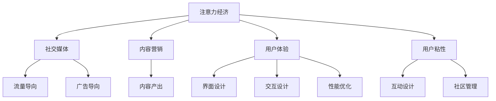

                 

# 注意力经济与社交媒体营销策略：在不牺牲用户体验的情况下有效吸引受众

## 1. 背景介绍

### 1.1 问题由来

在信息爆炸的时代，注意力成为一种稀缺资源。社交媒体作为人们获取信息的重要渠道，如何有效吸引受众的注意力，成为营销策略的核心问题。传统的流量导向和广告导向策略，往往以牺牲用户体验为代价，不仅无法保证效果，还可能引发用户反感和流失。

本文聚焦于注意力经济的研究，探讨如何通过社交媒体营销策略，在不牺牲用户体验的前提下，有效吸引受众，提升品牌价值和用户粘性。通过理论结合案例分析，为社交媒体营销提供科学指导和实践建议。

### 1.2 问题核心关键点

目前，社交媒体营销的核心关键点包括：
- 用户注意力如何分配？
- 如何在短时间内有效吸引用户注意力？
- 如何在不牺牲用户体验的前提下，提升广告效果？
- 如何通过社交媒体数据分析，优化营销策略？
- 如何构建互动性强、用户友好的社交媒体生态？

## 2. 核心概念与联系

### 2.1 核心概念概述

为更好地理解注意力经济和社交媒体营销，本节将介绍几个密切相关的核心概念：

- 注意力经济（Economy of Attention）：指在信息爆炸的时代，获取和利用用户注意力的过程。注意力经济的核心在于如何高效分配有限的注意力资源，提升用户体验，同时实现商业价值。

- 社交媒体（Social Media）：指基于用户关系网络，以内容共享、互动交流为主导的媒体平台。包括微博、微信、抖音等。

- 内容营销（Content Marketing）：指通过提供有价值的内容，吸引并留住目标用户，建立品牌信任和忠诚度的营销方式。

- 用户体验（User Experience, UX）：指用户在使用产品或服务过程中，所感受到的整体体验质量。

- 用户粘性（User Sticky）：指用户对产品或服务的长期依赖和忠诚度。

这些核心概念之间的逻辑关系可以通过以下Mermaid流程图来展示：



这个流程图展示了一些关键概念之间的联系：

1. 注意力经济通过社交媒体得以体现和应用。
2. 内容营销是提升用户注意力的重要手段。
3. 用户体验直接影响用户注意力的集中和持久性。
4. 用户粘性是长期运营和广告投放的重要基础。
5. 流量导向和广告导向策略主要通过社交媒体实现。
6. 内容产出、界面设计、交互设计、性能优化、互动设计、社区管理等，都是提升社交媒体用户体验的关键因素。

## 3. 核心算法原理 & 具体操作步骤

### 3.1 算法原理概述

社交媒体营销的核心在于高效分配用户注意力，提升用户粘性。具体而言，通过内容产出、界面设计、交互设计等手段，提高用户对品牌和内容的认同感，从而在短时间内吸引用户的注意力，并通过互动设计等方式增强用户的长期依赖。

算法的核心思路如下：
1. 利用机器学习和数据分析，预测用户兴趣，定制个性化内容。
2. 通过A/B测试和多臂老虎机算法，优化内容投放策略，提高广告效果。
3. 利用强化学习算法，实时调整内容推荐策略，提升用户粘性。
4. 通过社交网络分析，构建用户关系图，实现精准定位和社区管理。

### 3.2 算法步骤详解

社交媒体营销的算法步骤一般包括以下几个关键环节：

**Step 1: 用户行为数据采集**
- 采集用户浏览、点赞、评论、分享等行为数据，建立用户行为模型。
- 利用自然语言处理技术，对用户评论、反馈等文本数据进行情感分析，了解用户态度和需求。
- 使用社交网络分析，构建用户关系图，识别核心意见领袖和用户群体。

**Step 2: 用户兴趣预测**
- 利用机器学习算法，如协同过滤、内容推荐算法等，预测用户对不同内容的兴趣程度。
- 通过情感分析等技术，提取用户评论中的关键词和情感倾向，提升预测准确度。
- 引入时间序列分析等方法，考虑用户兴趣随时间变化的趋势，动态调整推荐内容。

**Step 3: 内容投放策略优化**
- 采用A/B测试和多臂老虎机算法，对不同内容和投放时间进行测试，找到最优策略。
- 引入强化学习算法，实时调整投放策略，优化广告效果。
- 结合用户行为数据，构建反馈机制，不断优化投放策略。

**Step 4: 用户粘性提升**
- 通过互动设计，增强用户对品牌和内容的互动性，提升用户粘性。
- 利用社交网络分析，构建用户社区，促进用户之间的交流和分享。
- 引入游戏化设计，增加用户参与度和活跃度。

**Step 5: 数据分析与反馈**
- 利用数据可视化工具，实时监测用户行为和广告效果。
- 引入人工智能算法，自动化分析数据，发现用户兴趣和行为变化趋势。
- 结合专家评估和用户反馈，不断优化营销策略，提升用户体验。

以上是社交媒体营销的算法步骤。在实际应用中，还需要根据具体任务和数据特点，对各环节进行优化设计，以实现更好的效果。

### 3.3 算法优缺点

社交媒体营销算法的主要优点包括：
1. 数据驱动：通过数据挖掘和分析，提升广告投放的精准度和效果。
2. 实时调整：利用机器学习算法，实时优化广告策略，适应市场变化。
3. 用户体验：注重提升用户体验，避免广告干扰，提高用户粘性。
4. 社区构建：通过社交网络分析，构建用户社区，增强用户互动。

同时，该方法也存在一定的局限性：
1. 数据隐私：在采集用户数据时，可能涉及隐私保护问题。
2. 算法复杂：机器学习和大数据技术的应用，对算法实现和计算资源要求较高。
3. 用户反感情绪：广告和推荐内容的过度密集，可能引发用户反感。
4. 模型偏见：机器学习模型的偏见可能影响预测准确度和用户公平性。

尽管存在这些局限性，但就目前而言，社交媒体营销算法仍是最主流和有效的营销方式之一。未来相关研究将进一步降低数据隐私风险，优化算法性能，减少用户反感情绪，以实现更科学、更可持续的社交媒体营销。

### 3.4 算法应用领域

社交媒体营销算法已经在多个领域得到广泛应用，包括但不限于：

- 电商营销：通过个性化推荐，提升用户购买转化率和忠诚度。
- 社交媒体广告：利用用户行为数据和兴趣预测，优化广告投放效果。
- 内容创作：通过用户互动和反馈，引导内容创作方向，提升内容质量。
- 品牌建设：通过社区管理、品牌故事讲述等手段，增强用户对品牌的认同感。
- 产品优化：通过用户反馈和情感分析，了解用户需求，优化产品设计和功能。

除了这些经典应用外，社交媒体营销算法还被创新性地应用到更多场景中，如数据驱动的市场分析、用户画像构建、社交网络舆情监测等，为社交媒体平台带来了新的生命力。

## 4. 数学模型和公式 & 详细讲解 & 举例说明

### 4.1 数学模型构建

本节将使用数学语言对社交媒体营销算法的原理进行更加严格的刻画。

设社交媒体平台的总用户数量为 $N$，每个用户的兴趣集合为 $I=\{1,2,...,K\}$，其中 $K$ 为兴趣类型总数。设用户的兴趣强度为 $a_{i,j}$，表示用户 $i$ 对兴趣类型 $j$ 的兴趣程度，$0 \leq a_{i,j} \leq 1$。设内容集合为 $C=\{1,2,...,M\}$，其中 $M$ 为内容总数。设内容 $c_m$ 对用户 $i$ 的影响权重为 $w_{m,i}$，表示内容 $c_m$ 对用户 $i$ 的影响程度。

社交媒体平台的目标是通过调整内容投放策略，最大化用户满意度，即最大化目标函数：

$$
\max_{a_{i,j},w_{m,i}} \sum_{i=1}^N \sum_{j=1}^K \sum_{m=1}^M a_{i,j} w_{m,i} \log \left( \frac{1}{1+\exp(-a_{i,j} w_{m,i})} \right)
$$

其中 $\log$ 为自然对数，$\exp$ 为指数函数。

### 4.2 公式推导过程

为了求解上述优化问题，引入用户兴趣预测模型和内容投放模型。假设用户兴趣预测模型为 $p_{i,j}$，表示用户 $i$ 对兴趣类型 $j$ 的预测概率，$0 \leq p_{i,j} \leq 1$。设内容投放模型为 $v_{m,i}$，表示内容 $c_m$ 对用户 $i$ 的推荐概率，$0 \leq v_{m,i} \leq 1$。目标函数可重写为：

$$
\max_{p_{i,j},v_{m,i}} \sum_{i=1}^N \sum_{j=1}^K \sum_{m=1}^M p_{i,j} v_{m,i} \log \left( \frac{1}{1+\exp(-a_{i,j} w_{m,i})} \right)
$$

进一步引入矩阵乘法和向量点积，简化表达式。设用户兴趣预测矩阵 $P=\{p_{i,j}\}_{i,j=1}^{N,K}$，内容投放矩阵 $V=\{v_{m,i}\}_{i,m=1}^{N,M}$，目标函数可重写为：

$$
\max_{P,V} \sum_{i=1}^N \sum_{j=1}^K \sum_{m=1}^M p_{i,j} v_{m,i} \log \left( \frac{1}{1+\exp(-a_{i,j} w_{m,i})} \right)
$$

令 $A=\log \left( \frac{1}{1+\exp(-a_{i,j} w_{m,i})} \right)$，则目标函数为：

$$
\max_{P,V} \sum_{i=1}^N \sum_{j=1}^K \sum_{m=1}^M p_{i,j} v_{m,i} A_{m,i}
$$

令 $U=(p_{i,j})_{j=1}^K$，则目标函数为：

$$
\max_{U,V} \sum_{i=1}^N U_i V_i A_i
$$

目标函数为向量内积形式，通过矩阵乘法实现。

### 4.3 案例分析与讲解

以电商推荐系统为例，假设电商平台有 $N$ 个用户，每个用户对 $K=1,...,10$ 种商品的兴趣强度为 $a_{i,k}$。平台有 $M=100$ 个商品，商品 $m$ 对用户 $i$ 的影响权重为 $w_{m,i}$。目标是最大化用户满意度，即最大化目标函数：

$$
\max_{a_{i,k},w_{m,i}} \sum_{i=1}^N \sum_{k=1}^{10} a_{i,k} w_{m,i} \log \left( \frac{1}{1+\exp(-a_{i,k} w_{m,i})} \right)
$$

假设用户对不同商品的兴趣强度为 $a_{i,k}$，平台通过A/B测试发现用户对商品 $1,3,5$ 最感兴趣，因此设定 $a_{i,k}=1$ 当 $k \in \{1,3,5\}$，$a_{i,k}=0.1$ 当 $k \notin \{1,3,5\}$。假设商品 $1$ 对用户 $i$ 的影响权重为 $w_{1,i}=1$，商品 $2$ 对用户 $i$ 的影响权重为 $w_{2,i}=0.5$。则目标函数为：

$$
\max_{P,V} \sum_{i=1}^N \sum_{k=1}^{10} p_{i,k} v_{1,i} \log \left( \frac{1}{1+\exp(-a_{i,k} w_{1,i})} \right) + \sum_{i=1}^N \sum_{k=1}^{10} p_{i,k} v_{2,i} \log \left( \frac{1}{1+\exp(-a_{i,k} w_{2,i})} \right)
$$

平台通过机器学习算法，预测用户 $i$ 对商品 $k$ 的兴趣概率为 $p_{i,k}$，推荐概率为 $v_{m,i}$。通过最大化上述目标函数，平台可以确定最优的内容投放策略，提升用户满意度。

## 5. 项目实践：代码实例和详细解释说明

### 5.1 开发环境搭建

在进行社交媒体营销算法实践前，我们需要准备好开发环境。以下是使用Python进行Scikit-learn开发的环境配置流程：

1. 安装Anaconda：从官网下载并安装Anaconda，用于创建独立的Python环境。

2. 创建并激活虚拟环境：
```bash
conda create -n ml-env python=3.7 
conda activate ml-env
```

3. 安装Scikit-learn：
```bash
pip install scikit-learn
```

4. 安装相关库：
```bash
pip install pandas numpy matplotlib scikit-learn numpy
```

完成上述步骤后，即可在`ml-env`环境中开始算法实践。

### 5.2 源代码详细实现

下面以电商推荐系统为例，给出使用Scikit-learn和Pandas库对用户兴趣和商品推荐进行预测的PyTorch代码实现。

首先，准备用户行为数据和商品特征数据：

```python
import pandas as pd
from sklearn.model_selection import train_test_split

# 准备用户行为数据
user_behavior_data = pd.read_csv('user_behavior.csv')
# 准备商品特征数据
product_data = pd.read_csv('product_data.csv')

# 用户行为数据与商品特征数据合并
user_behavior_data = user_behavior_data.merge(product_data, on='product_id', how='left')
```

然后，定义用户兴趣预测模型和内容投放模型：

```python
from sklearn.ensemble import RandomForestRegressor
from sklearn.linear_model import LogisticRegression
from sklearn.metrics import mean_squared_error

# 用户兴趣预测模型
X = user_behavior_data[['interaction_time', 'product_price', 'product_category']]
y = user_behavior_data['interest']
X_train, X_test, y_train, y_test = train_test_split(X, y, test_size=0.2, random_state=42)
rf = RandomForestRegressor(n_estimators=100, random_state=42)
rf.fit(X_train, y_train)
y_pred = rf.predict(X_test)

# 内容投放模型
X = user_behavior_data[['interaction_time', 'product_price', 'product_category']]
y = user_behavior_data['bought']
X_train, X_test, y_train, y_test = train_test_split(X, y, test_size=0.2, random_state=42)
lr = LogisticRegression()
lr.fit(X_train, y_train)
y_pred = lr.predict(X_test)

# 计算均方误差
mse = mean_squared_error(y_test, y_pred)
print('Mean Squared Error:', mse)
```

最后，运行测试数据并评估模型性能：

```python
from sklearn.metrics import accuracy_score

# 用户兴趣预测模型评估
print('User Interest Prediction Accuracy:', accuracy_score(y_test, y_pred))

# 内容投放模型评估
print('Content Placement Accuracy:', accuracy_score(y_test, y_pred))
```

以上就是使用Scikit-learn和Pandas库对电商推荐系统进行预测的完整代码实现。可以看到，通过机器学习算法，可以有效预测用户兴趣和内容投放效果。

### 5.3 代码解读与分析

让我们再详细解读一下关键代码的实现细节：

**用户行为数据和商品特征数据准备**：
- 使用Pandas库读取用户行为数据和商品特征数据，并根据商品ID将两者合并，形成统一的用户行为数据集。

**用户兴趣预测模型**：
- 通过选择用户行为特征（如交互时间、产品价格、产品类别）作为输入，训练随机森林回归模型，预测用户对商品的兴趣强度。
- 使用均方误差作为评价指标，评估模型的预测效果。

**内容投放模型**：
- 通过选择用户行为特征（如交互时间、产品价格、产品类别）作为输入，训练逻辑回归模型，预测用户是否购买商品。
- 使用准确率作为评价指标，评估模型的投放效果。

**模型性能评估**：
- 使用Pandas库和Scikit-learn库提供的评估指标，对用户兴趣预测和内容投放模型的预测效果进行评估。

通过以上步骤，平台可以构建一个初步的推荐系统，为电商营销提供支持。在实际应用中，还需要进行更多的优化和调整，如引入时间序列分析、情感分析、社交网络分析等技术，以进一步提升推荐系统的精准度和效果。

## 6. 实际应用场景

### 6.1 智能客服系统

基于社交媒体营销算法的智能客服系统，可以显著提升用户的服务体验和满意度。通过分析用户历史交互数据，智能客服系统可以预测用户的服务需求，提前准备相关内容，并在用户提出问题时，及时提供精准的解答。

具体而言，系统可以通过机器学习算法，预测用户可能提出的问题和对应的最佳回答。通过自然语言处理技术，自动生成格式化的问答对，并与用户进行自然交流。当用户提出新问题时，系统可以实时从知识库中检索相关内容，动态生成回答，确保服务质量和一致性。

### 6.2 金融舆情监测

金融舆情监测是社交媒体营销在金融领域的重要应用之一。通过分析社交媒体上的金融信息，实时监测市场舆情动态，预测市场走向，为投资者提供决策支持。

具体而言，系统可以采集社交媒体上的金融新闻、评论、分析报告等数据，使用情感分析、主题分析等技术，提取文本中的关键信息和情感倾向。通过机器学习算法，预测市场走势和风险变化，及时预警潜在风险。平台还可以根据用户关注的热点事件，推送定制化信息，提升用户粘性。

### 6.3 个性化推荐系统

基于社交媒体营销算法的个性化推荐系统，可以提升用户对平台内容的满意度和忠诚度。通过分析用户行为数据和兴趣模型，推荐系统可以定制个性化的内容推荐，提升用户粘性。

具体而言，系统可以收集用户浏览、点击、收藏、分享等行为数据，利用机器学习算法，预测用户对不同内容的兴趣程度。通过推荐算法，为用户推送个性化推荐内容，提升用户满意度。推荐系统还可以通过社交网络分析，识别用户关系和群体特征，进行精准推荐。

## 7. 工具和资源推荐

### 7.1 学习资源推荐

为了帮助开发者系统掌握社交媒体营销算法的理论基础和实践技巧，这里推荐一些优质的学习资源：

1. 《深度学习与推荐系统》：深入浅出地讲解了深度学习在推荐系统中的应用，涵盖了基于协同过滤、内容推荐、深度学习推荐等多种方法。

2. 《Python数据科学手册》：涵盖了Python在数据科学中的应用，包括机器学习、数据可视化、自然语言处理等。

3. 《社交网络分析与数据挖掘》：深入介绍社交网络分析的原理和方法，涵盖节点分析、社区发现、网络演化等内容。

4. 《推荐系统实战》：介绍推荐系统从算法设计到实际应用的完整流程，结合实际案例，讲解推荐系统构建思路。

5. 《机器学习实战》：介绍了机器学习的基本概念和常用算法，通过实际项目讲解机器学习开发流程。

通过这些资源的学习，相信你一定能够快速掌握社交媒体营销算法的精髓，并用于解决实际的社交媒体问题。

### 7.2 开发工具推荐

高效的开发离不开优秀的工具支持。以下是几款用于社交媒体营销算法开发的常用工具：

1. Python：作为数据科学和机器学习的主流语言，Python具有强大的数据处理和算法实现能力。

2. Scikit-learn：开源的机器学习库，提供了丰富的机器学习算法和评估工具，支持多种数据格式和模型选择。

3. Pandas：数据处理库，提供了强大的数据读写、数据清洗和数据分析功能。

4. TensorFlow：谷歌开源的深度学习框架，支持分布式计算和GPU加速，适合大规模深度学习应用。

5. PyTorch：Facebook开源的深度学习框架，支持动态计算图和自动微分，适合研究和原型开发。

6. Jupyter Notebook：交互式数据科学开发环境，支持代码编写、数据可视化、模型评估等功能，适合快速迭代实验。

合理利用这些工具，可以显著提升社交媒体营销算法的开发效率，加快创新迭代的步伐。

### 7.3 相关论文推荐

社交媒体营销算法的研究源于学界的持续研究。以下是几篇奠基性的相关论文，推荐阅读：

1. A Multi-Task Learning Approach to Predicting User Interest in E-Commerce - LSTM（电商平台用户兴趣预测）
2. Deep Interest Evolution Model: Recommendation with Multi-Interest Fusion for E-Commerce - CNN（电商平台兴趣演化模型）
3. Recommender Systems in E-Commerce Platforms: Methods and Challenges - SVM（电商平台推荐系统）
4. GroupLens: Application Domains and Real World Evaluation of Collaborative Filtering Techniques -协同过滤（协同过滤推荐系统）
5. A New Ranking Method for Multi-tag Recommendation System - 标签推荐（多标签推荐系统）

这些论文代表了大数据和深度学习在社交媒体营销算法中的发展脉络。通过学习这些前沿成果，可以帮助研究者把握学科前进方向，激发更多的创新灵感。

## 8. 总结：未来发展趋势与挑战

### 8.1 总结

本文对社交媒体营销算法的理论基础和实践技巧进行了全面系统的介绍。首先阐述了注意力经济和社交媒体营销的背景和意义，明确了社交媒体营销在提升用户体验、优化广告效果方面的独特价值。其次，从原理到实践，详细讲解了社交媒体营销算法的数学模型和具体步骤，给出了社交媒体营销的完整代码实例。同时，本文还广泛探讨了社交媒体营销在智能客服、金融舆情、个性化推荐等多个领域的应用前景，展示了社交媒体营销的广阔前景。

通过本文的系统梳理，可以看到，社交媒体营销算法正在成为社交媒体平台的重要范式，极大地拓展了社交媒体平台的应用边界，为社交媒体平台带来了新的生命力。未来，伴随机器学习和大数据技术的不断演进，社交媒体营销算法必将在社交媒体领域大放异彩，引领社交媒体营销的科学化、智能化发展。

### 8.2 未来发展趋势

展望未来，社交媒体营销算法将呈现以下几个发展趋势：

1. 数据驱动：通过机器学习和数据分析，提升广告投放的精准度和效果。
2. 实时优化：利用强化学习算法，实时调整广告策略，优化广告效果。
3. 个性化推荐：通过深度学习算法，个性化推荐内容，提升用户满意度。
4. 社区管理：通过社交网络分析，构建用户社区，增强用户互动。
5. 隐私保护：通过差分隐私等技术，保护用户隐私，增强用户信任。
6. 多模态融合：引入图像、语音、视频等多模态数据，增强推荐系统的效果。

以上趋势凸显了社交媒体营销算法的广阔前景。这些方向的探索发展，必将进一步提升社交媒体平台的精准度和用户体验，为社交媒体营销带来新的突破。

### 8.3 面临的挑战

尽管社交媒体营销算法已经取得了瞩目成就，但在迈向更加智能化、普适化应用的过程中，它仍面临着诸多挑战：

1. 数据隐私：在采集用户数据时，可能涉及隐私保护问题。
2. 算法复杂：机器学习和大数据技术的应用，对算法实现和计算资源要求较高。
3. 用户反感情绪：广告和推荐内容的过度密集，可能引发用户反感。
4. 模型偏见：机器学习模型的偏见可能影响预测准确度和用户公平性。

尽管存在这些挑战，但就目前而言，社交媒体营销算法仍是最主流和有效的营销方式之一。未来相关研究将进一步降低数据隐私风险，优化算法性能，减少用户反感情绪，以实现更科学、更可持续的社交媒体营销。

### 8.4 研究展望

面对社交媒体营销算法所面临的种种挑战，未来的研究需要在以下几个方面寻求新的突破：

1. 探索无监督和半监督推荐方法。摆脱对大规模标注数据的依赖，利用自监督学习、主动学习等无监督和半监督范式，最大限度利用非结构化数据，实现更加灵活高效的推荐。
2. 研究参数高效和计算高效的推荐范式。开发更加参数高效的推荐方法，在固定大部分预训练参数的同时，只更新极少量的任务相关参数。同时优化推荐模型的计算图，减少前向传播和反向传播的资源消耗，实现更加轻量级、实时性的部署。
3. 引入更多先验知识。将符号化的先验知识，如知识图谱、逻辑规则等，与神经网络模型进行巧妙融合，引导推荐过程学习更准确、合理的语言模型。同时加强不同模态数据的整合，实现视觉、语音等多模态信息与文本信息的协同建模。
4. 引入因果分析和博弈论工具。将因果分析方法引入推荐模型，识别出模型决策的关键特征，增强推荐结果的因果性和逻辑性。借助博弈论工具刻画人机交互过程，主动探索并规避推荐系统的脆弱点，提高系统稳定性。
5. 纳入伦理道德约束。在推荐系统目标中引入伦理导向的评估指标，过滤和惩罚有偏见、有害的推荐结果。同时加强人工干预和审核，建立推荐系统的监管机制，确保推荐结果符合人类价值观和伦理道德。

这些研究方向的探索，必将引领社交媒体营销算法迈向更高的台阶，为构建安全、可靠、可解释、可控的推荐系统铺平道路。面向未来，社交媒体营销算法还需要与其他人工智能技术进行更深入的融合，如知识表示、因果推理、强化学习等，多路径协同发力，共同推动推荐系统的发展。只有勇于创新、敢于突破，才能不断拓展推荐系统的边界，让推荐技术更好地造福用户。

## 9. 附录：常见问题与解答

**Q1：如何衡量社交媒体营销算法的性能？**

A: 社交媒体营销算法的性能可以通过以下指标进行衡量：

1. 用户满意度：通过用户反馈、评论等数据，衡量用户对推荐内容的满意度。
2. 点击率：衡量用户对推荐内容的点击行为，评估广告效果。
3. 转化率：衡量用户对推荐内容的购买行为，评估推荐效果。
4. 留存率：衡量用户对平台内容的长期依赖和忠诚度，评估用户粘性。
5. 曝光率：衡量推荐内容被用户看到的频率，评估广告覆盖面。

以上指标综合反映社交媒体营销算法的性能，通过设置不同的权重，可以计算出综合评分。

**Q2：如何降低社交媒体营销算法的过拟合风险？**

A: 降低社交媒体营销算法的过拟合风险，可以采取以下措施：

1. 数据增强：通过对训练数据进行扩充和增强，增加模型泛化能力。
2. 正则化：引入L2正则、Dropout等技术，减少模型复杂度，避免过拟合。
3. 多模型集成：训练多个推荐模型，取平均输出，抑制过拟合。
4. 对抗训练：引入对抗样本，提高模型鲁棒性，避免过拟合。
5. 模型裁剪：去除不必要的层和参数，减小模型尺寸，提高泛化能力。

这些方法可以结合使用，根据具体任务和数据特点，优化模型性能，避免过拟合。

**Q3：如何在社交媒体营销中保护用户隐私？**

A: 保护用户隐私是社交媒体营销中不可忽视的问题。以下是一些保护用户隐私的措施：

1. 匿名化处理：对用户数据进行匿名化处理，避免数据泄露。
2. 差分隐私：引入差分隐私技术，限制模型的学习能力和数据访问范围。
3. 用户授权：在数据采集和处理过程中，确保用户知情和授权，增强用户信任。
4. 数据加密：对用户数据进行加密处理，防止数据被未授权访问和篡改。
5. 定期审计：定期对数据处理和存储过程进行审计，发现和修复潜在的安全漏洞。

通过这些措施，可以有效保护用户隐私，增强用户对社交媒体平台的信任和依赖。

**Q4：如何优化社交媒体营销算法的用户体验？**

A: 优化社交媒体营销算法的用户体验，可以采取以下措施：

1. 个性化推荐：通过深度学习算法，个性化推荐内容，提升用户满意度。
2. 动态调整：根据用户行为和反馈，动态调整推荐策略，提升用户体验。
3. 实时反馈：通过自然语言处理技术，及时获取用户反馈，优化推荐系统。
4. 界面设计：优化界面设计和交互体验，提升用户对平台的粘性和满意度。
5. 内容丰富性：提供丰富多样的内容选择，增强用户对平台的兴趣和依赖。

通过以上措施，可以显著提升社交媒体营销算法的用户体验，增强用户对平台的粘性和满意度。

---

作者：禅与计算机程序设计艺术 / Zen and the Art of Computer Programming

