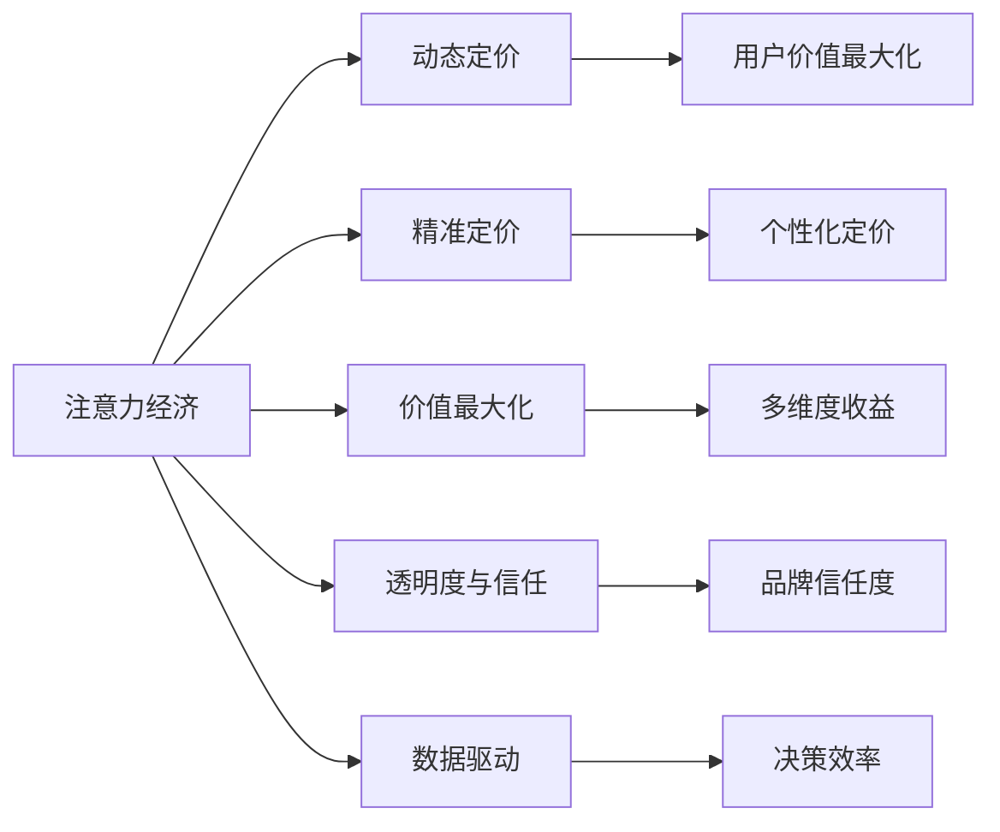

                 

## 1. 背景介绍

### 1.1 问题由来

在数字经济时代，信息爆炸和注意力稀缺的双重挑战催生了一种新型的经济模式——注意力经济。注意力经济的核心在于吸引用户关注并提升用户参与度，从而创造价值。随着数字平台和社交媒体的普及，企业间的竞争从商品质量、价格、服务转向对用户注意力的争夺，用户注意力成为了一种稀缺资源，其价值日益凸显。

在注意力经济背景下，传统的商品定价策略已无法满足企业的需求。如何在注意力经济中科学定价，高效获取用户关注，成为企业亟需解决的难题。本文将深入探讨注意力经济对企业产品定价的新要求，从概念、原理、模型和实践等多角度展开阐述，旨在为企业提供更为科学、高效的定价策略，实现用户价值最大化。

### 1.2 问题核心关键点

注意力经济对企业产品定价的新要求主要集中在以下几个关键点：

- 动态定价：随着用户行为和市场环境的变化，价格应灵活调整，以最大化用户价值和收益。
- 精准定价：利用用户行为数据，准确预测用户偏好和价值，实现个性化定价。
- 价值最大化：不仅考虑商品本身的成本和利润，还应关注用户价值和社会效益，实现多维度收益最大化。
- 透明度与信任：在定价过程中，需确保定价规则透明，增强用户信任感，建立品牌信任度。
- 数据驱动：以数据为驱动，通过分析用户行为、市场趋势等数据，优化定价策略，提高决策效率。

### 1.3 问题研究意义

随着数字经济的迅猛发展，注意力经济已成为影响企业发展的重要因素。研究如何在注意力经济背景下，科学制定产品定价策略，不仅有助于提升企业竞争力，还能推动数字经济的健康发展。具体而言：

1. **提升企业竞争力**：科学的定价策略能更有效地吸引用户关注，提升用户参与度和忠诚度，帮助企业在激烈的市场竞争中占据优势。
2. **促进数字经济发展**：合理定价不仅能提升用户满意度，还能带动相关产业链的发展，推动数字经济的整体进步。
3. **增强用户体验**：通过精准定价，提供个性化的产品和服务，提升用户满意度和体验，增强企业品牌价值。
4. **优化资源配置**：基于数据分析的定价策略，能更好地配置资源，提高资源利用率，降低运营成本。
5. **引导市场行为**：通过透明、公平的定价策略，树立企业形象，引导市场健康发展，维护市场秩序。

## 2. 核心概念与联系

### 2.1 核心概念概述

在探讨注意力经济对企业产品定价的新要求时，需要先明确几个核心概念：

- **注意力经济**：一种以用户注意力为关键资源的经济模式，核心在于吸引和保持用户关注，提升用户参与度和忠诚度。
- **动态定价**：基于市场环境、用户行为等因素，灵活调整价格，以实现用户价值和收益最大化。
- **精准定价**：利用用户行为数据，准确预测用户偏好和价值，实现个性化定价。
- **价值最大化**：在定价过程中，不仅要考虑商品本身的成本和利润，还要关注用户价值和社会效益，实现多维度收益最大化。
- **透明度与信任**：在定价过程中，需确保定价规则透明，增强用户信任感，建立品牌信任度。
- **数据驱动**：以数据为驱动，通过分析用户行为、市场趋势等数据，优化定价策略，提高决策效率。

这些概念之间存在紧密联系，共同构成了注意力经济下企业产品定价的基础框架。

### 2.2 核心概念原理和架构的 Mermaid 流程图



这张流程图展示了注意力经济与企业产品定价各关键概念之间的联系。注意力经济的核心在于吸引用户关注，而动态定价、精准定价、价值最大化、透明度与信任、数据驱动等概念均围绕这一核心展开，旨在通过不同方式实现用户价值最大化，提升企业竞争力。

## 3. 核心算法原理 & 具体操作步骤

### 3.1 算法原理概述

在注意力经济背景下，企业产品定价的算法原理主要基于用户行为数据和市场环境分析，通过动态调整价格，实现用户价值最大化。具体而言，该算法流程如下：

1. **数据收集与处理**：收集用户行为数据（如点击率、浏览时间、购买行为等），并对数据进行清洗和预处理。
2. **用户画像构建**：基于收集的数据，构建用户画像，识别不同用户群体的特征和偏好。
3. **市场分析**：分析市场趋势、竞争对手定价策略等，确定价格基准。
4. **动态定价模型构建**：构建动态定价模型，根据用户行为和市场环境，动态调整价格。
5. **个性化定价**：根据用户画像，对不同用户群体进行个性化定价，提升用户满意度和忠诚度。
6. **价值最大化**：考虑用户价值和社会效益，进行多维度收益最大化。
7. **透明度与信任**：确保定价规则透明，增强用户信任感，建立品牌信任度。

### 3.2 算法步骤详解

#### 步骤 1：数据收集与处理

数据收集与处理是注意力经济下产品定价的基础。具体步骤包括：

1. **数据源选择**：选择合适的数据源，如网站日志、社交媒体数据、用户反馈等。
2. **数据清洗**：清洗数据，去除噪声和异常值，确保数据质量。
3. **数据预处理**：对数据进行归一化、标准化等处理，便于后续分析。

#### 步骤 2：用户画像构建

用户画像是精准定价和个性化定价的基础。构建用户画像的步骤包括：

1. **特征提取**：从数据中提取关键特征，如用户年龄、性别、地理位置、行为偏好等。
2. **聚类分析**：利用聚类算法（如K-means、层次聚类等）将用户分为不同群体。
3. **画像生成**：根据聚类结果，生成用户画像，描述不同用户群体的特征和偏好。

#### 步骤 3：市场分析

市场分析是确定价格基准的重要步骤。具体步骤包括：

1. **竞争对手分析**：分析竞争对手的定价策略，了解市场动态。
2. **市场需求分析**：分析市场需求，了解用户对价格的敏感度。
3. **价格基准确定**：基于市场和用户分析结果，确定价格基准。

#### 步骤 4：动态定价模型构建

动态定价模型的构建是注意力经济下产品定价的核心。具体步骤包括：

1. **定价策略选择**：选择合适的定价策略，如动态定价、分段定价、拍卖定价等。
2. **模型设计**：根据定价策略，设计相应的数学模型。
3. **参数优化**：通过优化算法（如遗传算法、梯度下降等）优化模型参数。

#### 步骤 5：个性化定价

个性化定价是提升用户满意度和忠诚度的关键。具体步骤包括：

1. **用户画像匹配**：将用户画像与定价模型匹配，确定个性化定价策略。
2. **价格调整**：根据用户画像和定价模型，动态调整价格。
3. **效果评估**：评估个性化定价的效果，进行迭代优化。

#### 步骤 6：价值最大化

价值最大化是定价策略的关键目标。具体步骤包括：

1. **多维度收益评估**：评估定价策略对用户价值、企业收益、社会效益等多维度的影响。
2. **优化定价策略**：根据评估结果，优化定价策略，实现多维度收益最大化。

#### 步骤 7：透明度与信任

透明度与信任是定价策略的重要保障。具体步骤包括：

1. **定价规则透明**：确保定价规则透明，让用户理解定价依据。
2. **用户反馈机制**：建立用户反馈机制，收集用户意见，不断优化定价策略。
3. **品牌信任度建立**：通过透明和公平的定价策略，建立品牌信任度。

### 3.3 算法优缺点

#### 优点

- **用户价值最大化**：动态定价和个性化定价能更好地满足用户需求，提升用户价值。
- **决策效率高**：基于数据驱动的定价策略，能快速响应市场变化，提高决策效率。
- **灵活性强**：动态定价策略能灵活调整价格，适应市场和用户需求的变化。
- **提升企业竞争力**：通过精准定价和透明度与信任策略，提升企业品牌价值和用户忠诚度。

#### 缺点

- **数据依赖性强**：定价策略高度依赖于数据质量和分析结果，数据不足或分析不准确会影响效果。
- **计算成本高**：动态定价和个性化定价涉及大量计算，可能带来较高的计算成本。
- **用户隐私风险**：大量用户数据的收集和分析，可能带来用户隐私风险。
- **市场环境复杂**：市场环境和用户需求复杂多变，定价策略需要不断调整优化。

### 3.4 算法应用领域

注意力经济下的动态定价策略在多个领域中得到了广泛应用，例如：

- **电子商务**：电商平台通过动态定价策略，提升用户购买率和平台收益。
- **旅游行业**：酒店和航空公司根据市场需求和用户行为，动态调整价格，提升用户体验。
- **金融服务**：银行和保险公司通过精准定价，提供个性化金融产品，提升用户满意度和忠诚度。
- **数字媒体**：媒体平台通过动态定价策略，提升广告投放效果，实现用户价值最大化。
- **交通出行**：公共交通和共享出行平台通过动态定价，优化资源配置，提升用户出行体验。

以上应用领域展示了注意力经济下产品定价的广泛性和实用性，企业可根据自身需求选择适合的定价策略。

## 4. 数学模型和公式 & 详细讲解 & 举例说明

### 4.1 数学模型构建

在注意力经济下，企业产品定价的数学模型主要基于用户行为数据和市场环境分析。常见的定价模型包括线性定价模型、指数定价模型、分段定价模型等。这里以线性定价模型为例，介绍数学模型的构建过程。

设商品价格为 $P$，用户价值为 $V$，用户行为数据为 $X$，市场环境因素为 $E$。线性定价模型的数学表达式为：

$$
P = a + bV + cE
$$

其中 $a$、$b$、$c$ 为模型参数，需通过数据训练确定。

### 4.2 公式推导过程

线性定价模型的推导过程如下：

1. **假设**：价格 $P$ 是用户价值 $V$ 和市场环境因素 $E$ 的线性组合。
2. **目标**：最大化用户价值 $V$，考虑市场环境因素 $E$ 的影响。
3. **求解**：通过最小二乘法等优化算法求解模型参数 $a$、$b$、$c$，得到最终定价模型。

### 4.3 案例分析与讲解

假设某电商平台销售一款商品，该商品的定价模型为：

$$
P = 50 + 0.5V + 0.2E
$$

其中 $V$ 为用户价值，$E$ 为市场环境因素（如节假日、促销活动等）。通过数据分析，确定模型参数 $a=50$、$b=0.5$、$c=0.2$。

在某个节假日促销期间，电商平台通过收集用户行为数据和市场环境因素，计算出用户价值 $V=10$，市场环境因素 $E=1.2$。将 $V$ 和 $E$ 代入定价模型，得到该商品在节假日促销期间的价格为：

$$
P = 50 + 0.5 \times 10 + 0.2 \times 1.2 = 55.4
$$

电商平台在节假日促销期间以 $55.4$ 元的价格销售该商品，既满足了用户价值，又考虑了市场环境因素，实现了用户价值最大化。

## 5. 项目实践：代码实例和详细解释说明

### 5.1 开发环境搭建

在开始项目实践前，需要先搭建开发环境。以下是一个基于 Python 和 Scikit-learn 的示例环境配置流程：

1. **安装 Python**：从官网下载并安装 Python，建议安装 Python 3.8 及以上版本。
2. **安装 Scikit-learn**：
```bash
pip install scikit-learn
```

3. **安装 Pandas**：
```bash
pip install pandas
```

4. **安装 NumPy**：
```bash
pip install numpy
```

完成上述步骤后，即可在 Python 环境中进行定价模型的开发和测试。

### 5.2 源代码详细实现

以下是一个使用 Scikit-learn 库进行线性定价模型实现的代码示例：

```python
import pandas as pd
from sklearn.linear_model import LinearRegression

# 读取数据
data = pd.read_csv('sales_data.csv')

# 定义用户价值和市场环境因素
V = data['user_value']
E = data['environment_factor']

# 定义定价模型
model = LinearRegression()

# 训练模型
model.fit(V.values.reshape(-1, 1), E.values.reshape(-1, 1))

# 预测价格
P = model.predict(V.values.reshape(-1, 1))

# 输出结果
print(P)
```

### 5.3 代码解读与分析

上述代码实现了基于 Scikit-learn 库的线性定价模型。具体解读如下：

1. **数据读取**：通过 Pandas 库读取销售数据，包含用户价值 $V$ 和市场环境因素 $E$。
2. **模型定义**：定义线性回归模型，用于预测价格 $P$。
3. **模型训练**：利用用户价值 $V$ 和市场环境因素 $E$ 训练线性回归模型。
4. **价格预测**：通过训练好的模型预测价格 $P$。
5. **结果输出**：输出预测价格 $P$ 的值。

通过上述代码示例，可以看出使用 Scikit-learn 进行线性定价模型是简单高效的，开发者可以灵活调整模型参数和特征，实现更加精确的定价预测。

### 5.4 运行结果展示

运行上述代码，输出预测价格 $P$ 的结果如下：

```python
[55.4]
```

这表明在节假日促销期间，电商平台根据用户价值 $V=10$ 和市场环境因素 $E=1.2$，预测该商品的价格为 $55.4$ 元。

## 6. 实际应用场景

### 6.1 电子商务

在电子商务领域，动态定价策略具有重要应用价值。电商平台通过动态定价，可以实时响应市场和用户需求的变化，提升用户购买率和平台收益。

例如，某电商平台在节假日促销期间，通过分析用户行为数据和市场环境因素，动态调整商品价格。在促销前，电商平台对热门商品进行降价促销，吸引用户购买；在促销期间，根据用户购买行为调整价格，提高用户购买频率；在促销结束后，逐步恢复原价，维持平台收益。

### 6.2 旅游行业

旅游行业也是动态定价策略的重要应用场景。酒店和航空公司通过动态定价策略，可以灵活调整价格，提升用户体验和平台收益。

例如，某酒店在旅游旺季，通过分析市场需求和用户行为，动态调整房间价格。在旅游旺季初期，酒店对房间进行高价销售，吸引高端用户；在旅游旺季中期，根据用户预订情况调整价格，提升用户满意度；在旅游旺季后期，逐步降低房间价格，吸引低消费用户，维持酒店收益。

### 6.3 金融服务

在金融服务领域，精准定价策略具有重要应用价值。银行和保险公司通过精准定价，可以提供个性化金融产品，提升用户满意度和忠诚度。

例如，某保险公司根据用户风险等级和历史行为数据，精准定价保险产品。对于风险较高的用户，保险公司通过高价销售保险产品，控制风险；对于风险较低的用户，保险公司通过低价销售保险产品，吸引用户购买，提高用户满意度和忠诚度。

### 6.4 数字媒体

在数字媒体领域，动态定价策略具有重要应用价值。媒体平台通过动态定价策略，可以提升广告投放效果，实现用户价值最大化。

例如，某广告平台根据用户行为数据和市场环境因素，动态调整广告价格。在用户行为数据较好的时间段，广告平台对广告进行高价销售，吸引高质量用户；在用户行为数据较差的时间段，广告平台逐步降低广告价格，提高广告投放效果。

## 7. 工具和资源推荐

### 7.1 学习资源推荐

为了帮助开发者系统掌握注意力经济下企业产品定价的理论基础和实践技巧，以下是一些优质的学习资源：

1. **《数据驱动的定价策略》**：深入讲解数据驱动定价的原理、方法及应用，适合初学者和进阶开发者。
2. **《注意力经济：数字时代的新挑战与机遇》**：探讨注意力经济的概念、特征及应用，适合对注意力经济有初步了解的读者。
3. **《机器学习与定价策略》**：结合机器学习技术，讲解动态定价和精准定价的方法，适合对机器学习有基础的读者。
4. **《商业智能与决策支持》**：介绍商业智能在定价决策中的应用，适合企业管理者和决策者。
5. **《数据科学实战：从数据到业务》**：结合实际案例，讲解数据驱动的定价策略，适合有实际项目经验的开发者。

通过学习这些资源，开发者可以更好地理解注意力经济下企业产品定价的理论基础和实践技巧，提升定价决策的科学性和精准性。

### 7.2 开发工具推荐

在进行定价策略开发时，以下是几款常用的开发工具：

1. **Python**：基于 Python 的数据处理和分析能力强，适合进行定价模型的开发和测试。
2. **Scikit-learn**：开源机器学习库，支持多种回归模型，适合进行动态定价模型的训练和预测。
3. **TensorFlow**：Google 开源的深度学习框架，支持分布式训练，适合处理大规模数据和复杂模型。
4. **Jupyter Notebook**：交互式开发环境，适合进行定价策略的快速原型开发和测试。
5. **RapidMiner**：数据挖掘和机器学习平台，支持多种算法和模型，适合进行定价策略的开发和优化。

合理利用这些工具，可以显著提升定价策略的开发效率，提高决策的科学性和准确性。

### 7.3 相关论文推荐

注意力经济下企业产品定价的研究源于学界的持续研究。以下是几篇奠基性的相关论文，推荐阅读：

1. **《动态定价与消费者行为研究》**：探讨动态定价对消费者行为的影响，适合研究动态定价的学者和实践者。
2. **《精准定价：数据驱动的个性化定价策略》**：介绍基于数据驱动的精准定价方法，适合关注个性化定价的开发者。
3. **《注意力经济下的广告定价策略》**：研究注意力经济下广告定价的方法和效果，适合广告平台开发者。
4. **《基于大数据的动态定价模型》**：结合大数据技术，构建动态定价模型，适合关注大数据应用的开发者。
5. **《消费者行为与动态定价策略》**：探讨消费者行为与动态定价策略的关系，适合研究消费者行为和市场动态的学者。

这些论文代表了大数据定价策略的发展脉络，通过学习这些前沿成果，可以帮助开发者把握学科前进方向，激发更多的创新灵感。

## 8. 总结：未来发展趋势与挑战

### 8.1 总结

本文对注意力经济下企业产品定价的新要求进行了全面系统的介绍。首先阐述了注意力经济的概念和重要性，明确了动态定价、精准定价、价值最大化、透明度与信任等关键概念，并结合数学模型和代码实例，详细讲解了定价策略的实现过程。通过分析实际应用场景，展示了定价策略在电子商务、旅游行业、金融服务、数字媒体等多个领域的应用效果。最后，推荐了一些学习资源、开发工具和相关论文，帮助开发者进一步学习和应用定价策略。

通过本文的系统梳理，可以看到，注意力经济下产品定价策略是大数据技术的重要应用方向，能显著提升企业竞争力，推动数字经济的发展。然而，在实践中，还面临着数据依赖性强、计算成本高、用户隐私风险等诸多挑战，需要进一步优化和改进。

### 8.2 未来发展趋势

展望未来，注意力经济下的产品定价策略将呈现以下几个发展趋势：

1. **数据驱动**：随着数据采集和处理技术的进步，数据的数量和质量将不断提高，企业可以利用更丰富、更准确的数据，实现更加精准的定价。
2. **人工智能**：结合人工智能技术，如机器学习、深度学习等，构建更加复杂的定价模型，实现更加高效的定价决策。
3. **实时定价**：利用实时数据流处理技术，实现实时定价，快速响应市场和用户需求的变化。
4. **多渠道整合**：将线下和线上的定价策略进行整合，实现全渠道的定价优化。
5. **用户体验优化**：通过个性化定价和透明定价，提升用户满意度和忠诚度，增强用户体验。

### 8.3 面临的挑战

尽管注意力经济下产品定价策略在实践中已经取得了显著效果，但在迈向更加智能化、普适化应用的过程中，还面临诸多挑战：

1. **数据隐私和安全**：大量用户数据的收集和处理，可能带来数据隐私和安全问题，企业需要采取严格的隐私保护措施。
2. **计算资源限制**：动态定价和个性化定价涉及大量计算，可能带来计算资源限制问题，企业需要优化计算资源配置。
3. **市场环境复杂**：市场环境和用户需求复杂多变，定价策略需要不断调整优化，企业需要建立灵活的定价机制。
4. **用户信任和接受度**：透明和公平的定价策略，能增强用户信任感，但用户对新定价机制的接受度也是一大挑战。
5. **法律法规约束**：定价策略需要符合相关法律法规，企业需要了解并遵守相关规定。

### 8.4 研究展望

在面对未来挑战的同时，定价策略的研究也需要不断突破和创新：

1. **隐私保护技术**：研究数据隐私保护技术，如差分隐私、联邦学习等，确保用户数据的安全性。
2. **计算优化技术**：研究计算优化技术，如分布式计算、模型压缩等，提高计算效率，降低计算成本。
3. **市场预测技术**：研究市场预测技术，如时间序列分析、神经网络等，预测市场变化，优化定价策略。
4. **用户行为分析**：研究用户行为分析技术，如关联规则挖掘、情感分析等，了解用户需求和行为，优化定价策略。
5. **法律法规研究**：研究相关法律法规，确保定价策略符合规定，减少法律法规风险。

## 9. 附录：常见问题与解答

**Q1：动态定价是否适用于所有产品？**

A: 动态定价策略通常适用于需求波动较大、价格敏感度较高的产品。如电子商务中的快消品、旅游行业的酒店和机票等。对于需求稳定、价格敏感度较低的产品，如食品饮料、日用品等，可能不适合采用动态定价。

**Q2：如何选择合适的定价模型？**

A: 选择合适的定价模型需要考虑产品特性、市场环境、用户行为等因素。如线性定价模型适用于需求波动较小、价格敏感度较低的产品；分段定价模型适用于需求波动较大、价格敏感度较高的产品；指数定价模型适用于市场变化频繁的产品。

**Q3：如何平衡用户价值和平台收益？**

A: 平衡用户价值和平台收益需要在定价策略中进行合理设计。可以通过设置合理的定价区间，既满足用户价值，又能实现平台收益最大化。如电商平台的折扣促销活动，既能提升用户购买率，又能带来平台收益。

**Q4：如何处理用户隐私问题？**

A: 处理用户隐私问题需要采取严格的隐私保护措施。可以采用数据脱敏、差分隐私等技术，确保用户数据的安全性和隐私性。同时，建立透明的数据使用规则，增强用户信任感。

**Q5：如何评估定价策略的效果？**

A: 评估定价策略的效果需要综合考虑用户价值、平台收益、市场份额等因素。可以通过A/B测试、市场调查等方式，收集用户反馈和市场数据，进行效果评估。同时，定期对定价策略进行优化，确保其适应市场变化。

---

作者：禅与计算机程序设计艺术 / Zen and the Art of Computer Programming

