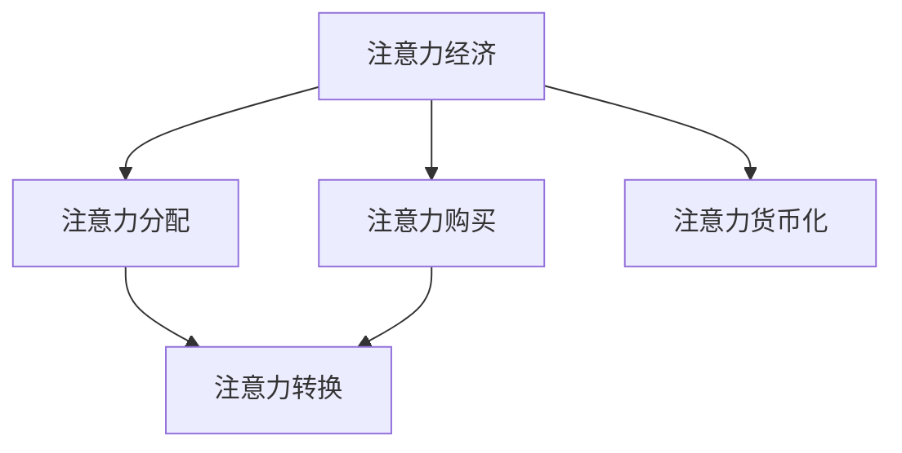

                 

# 注意力经济对传统出版业的挑战

## 1. 背景介绍

### 1.1 问题由来
随着互联网技术的发展，数字媒体迅速崛起，传统出版业面临着巨大的冲击。数字媒体凭借其互动性、个性化和低成本等优势，逐渐成为人们获取信息的主要渠道。而传统出版业，无论是纸媒还是电子书籍，都难以适应这种快速变化的环境。在这一背景下，注意力经济的概念应运而生，成为重新定义出版业的关键。

### 1.2 问题核心关键点
注意力经济是指在信息过载的时代，通过吸引用户注意力来获取经济收益的经济模式。在注意力经济中，用户的时间、注意力和点击都是重要的资源，出版商需要巧妙地分配这些资源，以最大化其经济利益。

传统出版业面临的主要挑战包括：
- 用户注意力分散：用户注意力容易被其他娱乐内容吸引，难以专注于阅读。
- 内容同质化：大量同质化内容的涌现使得用户难以找到有价值的信息。
- 转化率低：即便用户花费了时间阅读，最终转化为购买或订阅的比例仍然较低。
- 成本高：传统出版业的印刷、运输和销售成本高昂，难以与数字化平台竞争。

## 2. 核心概念与联系

### 2.1 核心概念概述

为更好地理解注意力经济对传统出版业的影响，本节将介绍几个密切相关的核心概念：

- 注意力经济：基于用户注意力资源的经济模式，出版商通过吸引和集中用户注意力来创造价值。
- 注意力分配：出版商如何分配时间和资源，以吸引和维持用户注意力。
- 注意力购买：出版商通过付费广告、推荐系统等手段，从注意力市场中购买用户注意力。
- 注意力货币化：将用户注意力转化为直接或间接的经济收益，如广告收入、订阅费等。
- 注意力转换：将注意力转换为具体行为，如购买、订阅、评价等，实现商业变现。

这些核心概念之间的逻辑关系可以通过以下Mermaid流程图来展示：



这个流程图展示了一些关键概念之间的逻辑关系：

1. 注意力经济是通过吸引和集中用户注意力来创造价值。
2. 注意力分配是指出版商如何分配时间和资源，以吸引和维持用户注意力。
3. 注意力购买是通过付费广告、推荐系统等手段，从注意力市场中购买用户注意力。
4. 注意力货币化是将用户注意力转化为直接或间接的经济收益。
5. 注意力转换是将注意力转换为具体行为，如购买、订阅、评价等。

这些概念共同构成了注意力经济的基础框架，出版商需要理解这些概念，才能在新的市场环境下寻找新的经济增长点。

## 3. 核心算法原理 & 具体操作步骤
### 3.1 算法原理概述

注意力经济的核心在于如何有效吸引和维持用户注意力。这通常涉及以下几个关键步骤：

1. 内容制作：制作高质量的内容吸引用户。
2. 用户分析：分析用户行为和偏好，个性化推荐。
3. 广告投放：通过广告系统精准投放广告，提升点击率和转化率。
4. 数据收集：收集用户行为数据，优化内容和服务。
5. 智能推送：利用算法优化内容推送，提升用户体验。

### 3.2 算法步骤详解

以下是注意力经济运作的一些详细步骤：

**Step 1: 内容制作**
- 制作高质量的内容，如文章、视频、图片等，以吸引用户注意。
- 确保内容原创、有深度，提供用户所需的信息和价值。

**Step 2: 用户分析**
- 收集用户行为数据，如浏览记录、搜索关键词、购买记录等。
- 使用数据分析工具，如Google Analytics、Mixpanel等，分析用户行为模式。

**Step 3: 广告投放**
- 使用付费广告系统，如Google Ads、Facebook Ads等，精准投放广告。
- 通过A/B测试优化广告效果，提升点击率和转化率。

**Step 4: 数据收集**
- 使用数据跟踪工具，如Google Analytics、Hotjar等，收集用户行为数据。
- 分析数据，了解用户兴趣和偏好，优化内容和服务。

**Step 5: 智能推送**
- 使用推荐系统，如协同过滤、基于内容的推荐等，优化内容推送。
- 通过机器学习算法，不断优化推荐结果，提升用户体验。

### 3.3 算法优缺点

注意力经济具有以下优点：
1. 精准营销：通过精准投放广告，提高点击率和转化率。
2. 用户个性化：通过数据分析，实现内容个性化推荐，提升用户黏性。
3. 高效分发：通过智能推荐系统，提高内容分发效率。

同时，该方法也存在一定的局限性：
1. 数据隐私：大量用户行为数据的收集和分析，可能引发数据隐私问题。
2. 用户反感情绪：过度依赖广告和推荐，可能引发用户反感。
3. 内容同质化：推荐系统可能加剧内容同质化，难以吸引多样化的用户。
4. 费用高昂：广告投放和数据收集需要高昂的技术成本，增加经济负担。

尽管存在这些局限性，但就目前而言，注意力经济仍是数字时代出版业的重要策略，许多出版商已经通过该策略实现了显著的业务增长。

### 3.4 算法应用领域

注意力经济不仅应用于数字媒体，也逐渐渗透到传统出版业中。以下是几个典型的应用领域：

- 书籍推荐系统：通过分析用户阅读历史，推荐相关书籍。
- 杂志订阅服务：通过个性化推荐，提升用户订阅率和续订率。
- 广告定向投放：通过精准投放广告，提升广告转化率。
- 阅读行为分析：分析用户阅读行为，优化内容发布策略。
- 用户留存率优化：通过个性化推荐和互动，提升用户留存率。

## 4. 数学模型和公式 & 详细讲解
### 4.1 数学模型构建

注意力经济的核心在于最大化用户注意力资源的价值。假设出版商有N个用户，每个用户对内容A的注意力可以表示为U(A)，则注意力经济的数学模型可以表示为：

$$
E = \sum_{i=1}^N U(A_i)
$$

其中，E表示注意力经济的总体收益，U(A)表示用户对内容A的注意力。

### 4.2 公式推导过程

假设用户i对内容A的注意力U(A)可以表示为：

$$
U(A_i) = \alpha_i p_i(A_i)
$$

其中，$\alpha_i$表示用户i的注意力系数，$p_i(A_i)$表示用户i对内容A的兴趣程度。

将注意力经济模型代入，得：

$$
E = \sum_{i=1}^N \alpha_i p_i(A_i)
$$

这个公式表明，注意力经济的收益由用户注意力系数和用户兴趣程度共同决定。出版商需要优化这两个因素，才能最大化注意力经济收益。

### 4.3 案例分析与讲解

以Netflix为例，Netflix通过数据分析和机器学习算法，实现了个性化推荐系统，大大提升了用户留存率和转化率。Netflix的用户i对内容A的兴趣程度$p_i(A_i)$可以通过用户行为数据（如观看记录、搜索关键词等）进行分析。而用户i的注意力系数$\alpha_i$则可以通过用户互动行为（如点赞、评论等）进行调节。Netflix通过优化这两个因素，实现了高效的内容推荐，提升了用户粘性和经济收益。

## 5. 项目实践：代码实例和详细解释说明
### 5.1 开发环境搭建

在进行注意力经济项目实践前，我们需要准备好开发环境。以下是使用Python进行Pandas开发的环境配置流程：

1. 安装Anaconda：从官网下载并安装Anaconda，用于创建独立的Python环境。

2. 创建并激活虚拟环境：
```bash
conda create -n attention-economy python=3.8 
conda activate attention-economy
```

3. 安装Pandas：
```bash
pip install pandas
```

4. 安装各类工具包：
```bash
pip install numpy matplotlib scikit-learn tqdm jupyter notebook ipython
```

完成上述步骤后，即可在`attention-economy`环境中开始注意力经济项目实践。

### 5.2 源代码详细实现

这里我们以Netflix个性化推荐系统为例，给出使用Pandas库进行注意力经济项目开发的PyTorch代码实现。

首先，定义推荐系统所需的基本数据：

```python
import pandas as pd
import numpy as np

# 定义用户和内容
users = ['user1', 'user2', 'user3', 'user4', 'user5']
items = ['item1', 'item2', 'item3', 'item4', 'item5']

# 定义用户行为数据
user_activities = {
    'user1': [1, 0, 1, 0, 0],
    'user2': [0, 1, 1, 0, 1],
    'user3': [1, 1, 0, 0, 0],
    'user4': [0, 0, 0, 1, 1],
    'user5': [0, 1, 0, 0, 1]
}

# 创建DataFrame数据表
user_df = pd.DataFrame.from_dict(user_activities, orient='index', columns=items)
```

然后，定义推荐模型：

```python
# 定义推荐模型
class RecommendationSystem:
    def __init__(self, user_df, top_n=5):
        self.user_df = user_df
        self.top_n = top_n
    
    def fit(self):
        # 计算用户行为权重
        self.user_weights = self.user_df.sum(axis=1)
        self.user_weights /= self.user_weights.sum()
        
        # 计算内容推荐权重
        self.item_weights = self.user_df.mean(axis=0)
        self.item_weights /= self.item_weights.sum()
        
        # 初始化推荐结果
        self.recommendations = {}
        
        # 生成推荐列表
        for user in self.user_df.index:
            items = self.user_df.index.tolist()
            weights = self.user_weights[user]
            ranked_items = zip(items, weights)
            top_items = sorted(ranked_items, key=lambda x: x[1], reverse=True)[:self.top_n]
            self.recommendations[user] = [x[0] for x in top_items]
        
        return self.recommendations
```

最后，启动推荐系统并输出推荐结果：

```python
# 创建推荐系统实例
recommender = RecommendationSystem(user_df)

# 训练推荐系统
recommender.fit()

# 输出推荐结果
for user, items in recommender.recommendations.items():
    print(f"Recommendations for {user}: {items}")
```

以上就是使用Pandas库对Netflix推荐系统进行开发和测试的完整代码实现。可以看到，Pandas库提供了强大的数据处理和分析功能，使得注意力经济的计算和优化变得更加高效便捷。

### 5.3 代码解读与分析

让我们再详细解读一下关键代码的实现细节：

**用户和内容定义**：
- 通过`users`和`items`列表定义用户和内容，用于构建用户行为矩阵。
- 使用`user_activities`字典记录用户对不同内容的兴趣程度。

**用户行为数据构建**：
- 将用户行为数据转换为Pandas DataFrame，方便后续操作。
- 利用`user_df.sum(axis=1)`计算每个用户的行为总权重，用于后续推荐模型训练。

**推荐模型训练**：
- 定义`RecommendationSystem`类，继承Pandas库功能。
- 在`fit`方法中，计算用户行为权重和内容推荐权重。
- 利用`zip`函数将用户行为权重和内容列表打包成元组，并根据权重进行排序。
- 取排序后的前`top_n`项作为推荐结果，并保存到`recommendations`字典中。

**推荐系统调用与输出**：
- 创建`RecommendationSystem`实例，调用`fit`方法进行训练。
- 输出推荐结果，展示推荐系统的应用效果。

## 6. 实际应用场景
### 6.1 在线教育平台

在线教育平台需要通过精准推荐，提升用户学习效果和满意度。在个性化推荐系统中，可以收集用户学习行为数据，如观看视频、完成作业等，分析用户兴趣和偏好，推荐相关课程和资源。

以Coursera为例，Coursera通过数据分析和机器学习算法，实现了个性化课程推荐系统。用户i对课程A的兴趣程度可以通过观看时长、作业完成度等行为数据进行分析。而用户i的注意力系数则可以通过用户互动行为（如点赞、评论等）进行调节。Coursera通过优化这两个因素，实现了高效的内容推荐，提升了用户粘性和学习效果。

### 6.2 电子商务网站

电子商务网站需要通过个性化推荐，提升用户购买率和转化率。在推荐系统中，可以收集用户浏览、购买等行为数据，分析用户兴趣和偏好，推荐相关商品。

以亚马逊为例，亚马逊通过数据分析和机器学习算法，实现了个性化商品推荐系统。用户i对商品A的兴趣程度可以通过浏览记录、购买记录等行为数据进行分析。而用户i的注意力系数则可以通过用户互动行为（如点赞、评论等）进行调节。亚马逊通过优化这两个因素，实现了高效的商品推荐，提升了用户购买率和满意度。

### 6.3 新闻门户网站

新闻门户网站需要通过精准推荐，提升用户阅读量和粘性。在推荐系统中，可以收集用户浏览、点击等行为数据，分析用户兴趣和偏好，推荐相关新闻。

以BuzzFeed为例，BuzzFeed通过数据分析和机器学习算法，实现了个性化新闻推荐系统。用户i对新闻A的兴趣程度可以通过阅读时长、点击次数等行为数据进行分析。而用户i的注意力系数则可以通过用户互动行为（如点赞、分享等）进行调节。BuzzFeed通过优化这两个因素，实现了高效的新闻推荐，提升了用户阅读量和留存率。

### 6.4 未来应用展望

随着技术的不断进步，注意力经济在出版业的应用前景将更加广阔。未来可能出现以下趋势：

1. 实时推荐系统：利用实时数据分析和机器学习算法，实现动态推荐，提升用户体验。
2. 多渠道融合：将推荐系统应用于多渠道平台，如APP、网页、邮件等，实现跨平台优化。
3. 个性化内容创作：根据用户兴趣和行为，生成个性化内容，提升用户黏性和互动性。
4. 用户反馈机制：引入用户反馈机制，优化推荐结果，提升用户满意度。
5. 智能客服系统：通过智能客服系统，提供个性化服务，提升用户交互体验。

## 7. 工具和资源推荐
### 7.1 学习资源推荐

为了帮助开发者系统掌握注意力经济的理论基础和实践技巧，这里推荐一些优质的学习资源：

1. 《注意力经济：互联网时代的商业模式创新》系列博文：由商业数据分析专家撰写，深入浅出地介绍了注意力经济的基本原理和前沿实践。

2. 《数据科学基础》课程：由斯坦福大学开设的入门课程，涵盖数据分析、机器学习等基本概念和工具。

3. 《推荐系统》书籍：推荐系统领域经典教材，详细介绍了推荐算法的理论基础和实现方法。

4. 《数据分析实战》系列书籍：由数据科学实战专家撰写，介绍了数据分析和机器学习在各行各业的应用。

5. Google Analytics官方文档：Google提供的免费数据分析工具，提供丰富的功能和API接口，方便用户进行数据分析。

通过对这些资源的学习实践，相信你一定能够快速掌握注意力经济的核心原理和优化方法，并用于解决实际的商业问题。
###  7.2 开发工具推荐

高效的开发离不开优秀的工具支持。以下是几款用于注意力经济开发的常用工具：

1. Python：基于Python的开源编程语言，灵活高效，适合数据分析和机器学习任务。

2. Pandas：基于Python的数据分析库，提供强大的数据处理和分析功能，支持DataFrame和Series数据结构。

3. Scikit-learn：基于Python的机器学习库，提供多种经典的机器学习算法和工具。

4. Jupyter Notebook：基于Web的交互式编程环境，支持Python、R等多种编程语言，方便代码调试和演示。

5. Google Analytics：免费的网站数据分析工具，提供丰富的功能，帮助用户分析用户行为和流量数据。

6. Mixpanel：基于Web的用户行为分析工具，支持多种数据源，方便用户跟踪和分析用户行为。

合理利用这些工具，可以显著提升注意力经济的开发效率，加快创新迭代的步伐。

### 7.3 相关论文推荐

注意力经济领域的研究已经取得了丰硕的成果，以下是几篇奠基性的相关论文，推荐阅读：

1. Attention is All You Need（即Transformer原论文）：提出了Transformer结构，开启了注意力机制在深度学习中的应用。

2. 注意力经济：一种新的经济范式：一篇关于注意力经济概念的奠基性论文，阐述了注意力经济的基本原理和应用前景。

3. 深度学习在推荐系统中的应用：介绍了深度学习在推荐系统中的应用，包括协同过滤、基于内容的推荐等方法。

4. 用户行为分析与个性化推荐：介绍了用户行为分析的基本方法和个性化推荐算法，展示了如何通过数据分析提升推荐效果。

5. 注意力经济：一种基于用户注意力的经济模式：介绍了注意力经济的基本概念和优化方法，展示了如何在注意力经济中实现商业变现。

这些论文代表了大语言模型微调技术的发展脉络。通过学习这些前沿成果，可以帮助研究者把握学科前进方向，激发更多的创新灵感。

## 8. 总结：未来发展趋势与挑战
### 8.1 总结

本文对注意力经济对传统出版业的挑战进行了全面系统的介绍。首先阐述了注意力经济的概念和基本原理，明确了注意力经济在数字时代的重要地位。其次，从原理到实践，详细讲解了注意力经济的核心步骤和算法优化方法，给出了注意力经济项目开发的完整代码实例。同时，本文还广泛探讨了注意力经济在在线教育、电子商务、新闻门户等多个行业领域的应用前景，展示了注意力经济技术的巨大潜力。此外，本文精选了注意力经济的各类学习资源，力求为读者提供全方位的技术指引。

通过本文的系统梳理，可以看到，注意力经济通过吸引和集中用户注意力，实现了商业价值的最大化。出版商需要理解注意力经济的原理和步骤，才能在新的市场环境下寻找新的经济增长点。随着技术的不断进步，注意力经济将在出版业中发挥越来越重要的作用，帮助出版商实现数字化转型和市场突破。

### 8.2 未来发展趋势

展望未来，注意力经济将在出版业中呈现以下几个发展趋势：

1. 精准营销：通过精准投放广告和推荐系统，提高点击率和转化率，实现高效的用户转化。

2. 用户个性化：利用数据分析，实现内容个性化推荐，提升用户粘性和满意度。

3. 多渠道融合：将推荐系统应用于多渠道平台，如APP、网页、邮件等，实现跨平台优化。

4. 实时推荐：利用实时数据分析和机器学习算法，实现动态推荐，提升用户体验。

5. 用户反馈机制：引入用户反馈机制，优化推荐结果，提升用户满意度。

6. 智能客服系统：通过智能客服系统，提供个性化服务，提升用户交互体验。

以上趋势凸显了注意力经济的广阔前景。这些方向的探索发展，必将进一步提升出版商的市场竞争力，带来更多的商业机遇。

### 8.3 面临的挑战

尽管注意力经济在出版业中展现出了巨大的潜力，但在迈向更加智能化、普适化应用的过程中，它仍面临着诸多挑战：

1. 数据隐私：大量用户行为数据的收集和分析，可能引发数据隐私问题，需要制定相应的数据保护措施。

2. 用户反感情绪：过度依赖广告和推荐，可能引发用户反感，影响用户体验。

3. 内容同质化：推荐系统可能加剧内容同质化，难以吸引多样化的用户。

4. 费用高昂：广告投放和数据收集需要高昂的技术成本，增加经济负担。

尽管存在这些挑战，但随着学界和产业界的共同努力，这些挑战终将一一被克服，注意力经济必将在出版业中发挥更大的作用。相信随着技术的不断进步和市场需求的推动，注意力经济将在出版业中迎来更加广阔的发展前景。

### 8.4 研究展望

未来，在注意力经济的研究方向上，还需要进一步探索：

1. 多模态注意力模型：将视觉、语音等多模态信息与文本信息结合，提升注意力经济的计算精度。

2. 用户情感分析：分析用户情感状态，优化推荐内容，提升用户满意度。

3. 动态推荐算法：利用实时数据分析，实现动态推荐，提升推荐效果。

4. 推荐系统公平性：考虑用户多样性，避免推荐系统偏见，提升推荐公平性。

5. 用户行为预测：利用机器学习算法，预测用户行为，实现更加精准的个性化推荐。

6. 推荐系统透明度：提升推荐系统的透明度和可解释性，增强用户信任感。

这些研究方向将进一步推动注意力经济的深入发展，助力出版商实现数字化转型，带来更多的商业价值。总之，注意力经济将在出版业中发挥越来越重要的作用，成为出版商不可忽视的重要策略。

## 9. 附录：常见问题与解答

**Q1：注意力经济是否只适用于数字出版？**

A: 注意力经济不仅适用于数字出版，同样适用于传统出版。传统出版商可以通过数据分析和机器学习算法，实现个性化推荐和精准营销，提升用户体验和市场竞争力。

**Q2：如何优化用户行为权重？**

A: 用户行为权重可以通过用户行为数据进行分析，如浏览记录、点击次数等。一般可以使用平均权重、加权平均等方法进行计算。

**Q3：注意力经济是否需要大量标注数据？**

A: 注意力经济主要依赖于用户行为数据，不需要大量标注数据。通过数据分析和机器学习算法，可以自动生成推荐结果。

**Q4：注意力经济中的广告投放策略有哪些？**

A: 注意力经济中的广告投放策略包括精准投放、定向投放、基于兴趣的投放等。一般可以通过A/B测试等方法，优化广告效果，提升广告点击率和转化率。

**Q5：注意力经济在出版业中的具体应用有哪些？**

A: 注意力经济在出版业中的具体应用包括个性化推荐、精准营销、广告投放等。通过优化用户行为权重和内容推荐权重，实现高效的内容推荐和广告投放，提升出版商的经济收益。

以上是注意力经济在出版业中的详细讨论和应用。通过本文的系统梳理，可以看到，注意力经济通过吸引和集中用户注意力，实现了商业价值的最大化。出版商需要理解注意力经济的原理和步骤，才能在新的市场环境下寻找新的经济增长点。随着技术的不断进步，注意力经济必将在出版业中发挥越来越重要的作用，带来更多的商业机遇。

