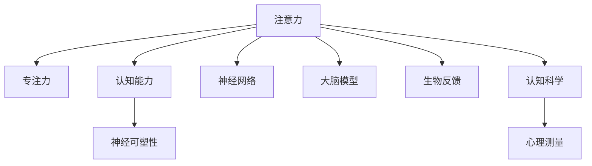

                 

# 注意力训练与大脑增强：通过专注力增强认知能力和神经可塑性

> 关键词：注意力训练, 大脑增强, 专注力, 认知能力, 神经可塑性, 神经网络, 大脑模型, 生物反馈, 认知科学, 心理测量

## 1. 背景介绍

### 1.1 问题由来
在信息爆炸的现代社会，人们的注意力正在受到前所未有的挑战。面对来自屏幕、社群、工作的海量信息，如何在繁忙的生活中保持高效专注，成为了我们亟需解决的问题。注意力训练和大脑增强技术应运而生，通过提升个体的专注力和认知能力，帮助人们应对现代生活的复杂性，提升生活质量和效率。

### 1.2 问题核心关键点
注意力训练和大脑增强技术基于认知科学和神经科学的理论，结合计算机技术和生物反馈技术，旨在通过各种方法提升个体的注意力、记忆力和学习能力。其核心在于利用科学原理和人工智能技术，帮助用户训练大脑，优化认知功能，实现全面提升。

### 1.3 问题研究意义
注意力训练和大脑增强技术的研究与应用，对于提升个体的工作效率、学习能力和生活质量，具有重要意义：

1. **工作效率提升**：通过专注力和注意力的提升，个体可以更快、更准确地处理信息，提高工作效率。
2. **学习能力加强**：大脑增强技术可以通过科学训练方法，提升记忆力和学习效率，有助于学生和职场人士的学习和职业发展。
3. **健康状态改善**：注意力训练和大脑增强可以改善注意力缺陷障碍（ADHD）等认知障碍，提升个体心理健康。
4. **情感管理优化**：通过专注力训练，个体可以更好地管理情绪，增强自我调节能力，提升情感智商（EQ）。
5. **智能时代应对**：在AI和自动化技术日益普及的背景下，大脑增强技术可以提升人类在复杂决策和创新思维方面的优势，应对智能时代的挑战。

## 2. 核心概念与联系

### 2.1 核心概念概述

为更好地理解注意力训练和大脑增强技术，本节将介绍几个密切相关的核心概念：

- **注意力（Attention）**：指个体选择并集中注意力于某些信息的能力。在大脑中，注意力主要通过神经网络实现，涉及对信息的筛选、过滤和聚焦。
- **专注力（Focus）**：指个体在处理信息时保持持续和强烈注意力的能力。专注力与注意力密切相关，是实现高效信息处理的基础。
- **认知能力（Cognitive Abilities）**：包括记忆力、理解力、推理力、注意力等多种能力，是衡量个体智能水平的重要指标。
- **神经可塑性（Neural Plasticity）**：指神经网络在大脑发育和信息处理过程中，能够通过学习和训练改变结构和功能的能力。
- **神经网络（Neural Network）**：通过模拟大脑神经元网络的结构和功能，实现信息处理和模式识别的计算模型。
- **大脑模型（Brain Model）**：基于神经科学理论和认知心理学，构建的模拟大脑结构和功能的计算模型。
- **生物反馈（Biofeedback）**：通过实时监测生理指标（如心率、脑电波），向用户提供即时反馈，帮助其调整专注力和认知状态。
- **认知科学（Cognitive Science）**：研究人类认知过程、思维机制和信息处理模式的科学领域。
- **心理测量（Psychometric Assessment）**：通过标准化测试和评估工具，量化和评估个体的认知和心理状态，为训练方案提供科学依据。

这些核心概念之间的逻辑关系可以通过以下Mermaid流程图来展示：



这个流程图展示了注意力训练和大脑增强的核心概念及其之间的关系：

1. 注意力是大脑认知的基础，通过神经网络实现。
2. 专注力是注意力的具体应用，与注意力密切相关。
3. 认知能力包含多种脑功能，包括注意力、记忆力等。
4. 神经可塑性是大脑适应和学习的能力，与认知能力的提升密切相关。
5. 神经网络和大脑模型是实现注意力训练和大脑增强的计算工具。
6. 生物反馈和心理测量为注意力训练提供科学依据和方法。

这些概念共同构成了注意力训练和大脑增强技术的理论基础，为其研究和实践提供了重要指导。

## 3. 核心算法原理 & 具体操作步骤
### 3.1 算法原理概述

注意力训练和大脑增强技术的核心在于通过科学训练方法提升个体的认知能力，其中包含多个关键步骤：

1. **认知评估**：使用心理测量工具对个体的认知能力进行评估，确定其注意力、记忆力、学习力等方面的现状。
2. **目标设定**：根据评估结果，设定提升目标，如改善注意力集中度、提高记忆力等。
3. **训练方案设计**：基于认知科学理论，设计具体的训练方案，如冥想、注意力游戏、记忆训练等。
4. **训练实施**：通过神经网络模型和大脑模型，模拟和优化认知训练过程，实时监测生理指标，提供生物反馈。
5. **效果评估**：在训练结束后，再次进行认知评估，比较训练前后的差异，评估训练效果。

### 3.2 算法步骤详解

**Step 1: 认知评估**

首先，需要进行全面的认知评估，以了解个体当前在注意力、记忆力等方面的状态。这可以通过多种心理测量工具实现，如注意力网络测试（ANT）、记忆测试（如BDMT）等。通过这些测试，可以量化个体的认知能力，为后续训练提供科学依据。

**Step 2: 目标设定**

根据认知评估的结果，设定具体的训练目标。例如，如果个体在注意力集中度方面表现较差，可以设定目标为提升注意力持续时间。如果记忆力较差，可以设定目标为提高记忆广度和深度。目标设定需要明确、具体，以便后续训练方案的制定和评估。

**Step 3: 训练方案设计**

基于认知科学和神经科学理论，设计具体的训练方案。例如，可以使用冥想训练提升注意力，使用记忆游戏增强记忆力，使用认知行为疗法改善情绪和自我调节能力等。设计训练方案时，需要考虑个体的年龄、认知水平、生活习惯等因素，以制定最合适的训练策略。

**Step 4: 训练实施**

在训练过程中，使用神经网络模型和大脑模型模拟认知训练过程。例如，可以使用深度学习模型训练注意力游戏，使用神经可塑性模型优化记忆训练方案。同时，实时监测个体的生理指标（如心率、脑电波），通过生物反馈技术向用户提供即时反馈，帮助其调整专注力和认知状态。

**Step 5: 效果评估**

训练结束后，再次进行认知评估，比较训练前后的差异，评估训练效果。这可以通过心理测量工具、自我报告、任务表现等多种方式进行。根据评估结果，调整训练方案，进一步提升认知能力。

### 3.3 算法优缺点

注意力训练和大脑增强技术具有以下优点：

1. **科学依据**：基于认知科学和神经科学理论，通过科学方法提升认知能力，效果显著。
2. **个体化定制**：根据个体的特点和需求，设计个性化的训练方案，提升训练效果。
3. **实时监测**：通过生物反馈技术实时监测生理指标，提供即时反馈，帮助用户调整状态。
4. **效果评估**：通过多次评估，量化训练效果，确保训练方案的有效性。

同时，该方法也存在一定的局限性：

1. **成本较高**：心理测量工具和生物反馈设备的成本较高，普及性有待提高。
2. **技术门槛高**：训练方案设计和技术实现需要专业知识和技能，普通用户难以自行实施。
3. **效果因人而异**：不同个体对训练的反应和效果差异较大，需要个体差异化处理。
4. **长期效果未知**：训练效果的长期稳定性尚未得到充分验证，需进一步研究。
5. **心理负担**：长时间监测和训练可能给用户带来心理负担，影响其正常使用。

尽管存在这些局限性，但就目前而言，注意力训练和大脑增强技术在提升认知能力方面已经展现出了巨大潜力。未来相关研究将继续深入，进一步优化训练方案，降低成本，提高普及性，推动认知科学的发展。

### 3.4 算法应用领域

注意力训练和大脑增强技术已经在多个领域得到应用，展示了其广泛的应用前景：

1. **教育领域**：通过训练提升学生的注意力和记忆力，帮助其提高学习效率和成绩。
2. **医疗领域**：用于改善注意力缺陷障碍（ADHD）等认知障碍，提升患者的注意力和自我调节能力。
3. **职场应用**：提升职场人士的专注力、记忆力等认知能力，提高工作效率和决策能力。
4. **健康管理**：通过训练改善心理健康状态，提升个体的生活质量和幸福感。
5. **特殊教育**：为有特殊需求的学生设计个性化的训练方案，帮助其提升认知能力。
6. **智能辅助**：结合人工智能技术，开发智能认知训练平台，提供便捷的训练体验。

除了上述这些典型应用外，注意力训练和大脑增强技术还将在更多领域得到应用，为认知科学的实践提供新的突破。

## 4. 数学模型和公式 & 详细讲解 & 举例说明

### 4.1 数学模型构建

本节将使用数学语言对注意力训练和大脑增强技术的核心算法进行更加严格的刻画。

假设个体在注意力训练过程中的生理指标为 $X(t)$，其中 $t$ 表示时间。定义生理指标的监测函数为 $f(X(t))$，生理指标的期望值 $\overline{X}$，生理指标的标准差 $\sigma$。训练过程中，个体对注意力的调节机制可以表示为：

$$
X(t) = g(X(t-1), f(X(t)))
$$

其中 $g$ 为调节函数，描述注意力调节机制。假设调节函数为线性函数，则有：

$$
X(t) = \alpha X(t-1) + \beta f(X(t))
$$

### 4.2 公式推导过程

以下是注意力调节机制的数学推导过程：

1. **初始状态**：设初始状态为 $X_0$，则有 $X(0) = X_0$。
2. **状态演化**：在时间 $t$ 时刻，个体的生理指标 $X(t)$ 可以表示为：
   $$
   X(t) = \alpha X(t-1) + \beta f(X(t))
   $$
3. **稳态求解**：在时间 $t$ 趋近于无穷大时，求稳态解 $X^*$：
   $$
   X^* = \alpha X^* + \beta f(X^*)
   $$
   解得 $X^* = \frac{f(X_0)}{1-\alpha}$。

从上述推导可以看出，个体注意力状态的变化受生理指标监测函数 $f(X(t))$ 和调节参数 $\alpha, \beta$ 的影响。在训练过程中，通过调整这些参数，可以控制个体注意力状态的演化，提升注意力集中度。

### 4.3 案例分析与讲解

以记忆训练为例，说明如何使用数学模型描述和优化训练过程：

1. **目标设定**：提高记忆广度和深度。
2. **训练方案设计**：使用记忆游戏作为训练任务，记录个体的记忆表现。
3. **训练实施**：使用神经网络模型优化记忆游戏，实时监测记忆表现，提供生物反馈。
4. **效果评估**：通过多次记忆测试，量化记忆广度和深度，评估训练效果。
5. **调节机制**：使用数学模型 $X(t) = \alpha X(t-1) + \beta f(X(t))$ 描述记忆训练过程中的注意力调节机制，通过调整参数 $\alpha, \beta$ 控制注意力状态，提升记忆效果。

通过上述案例分析，可以看出，数学模型在描述和优化注意力训练过程中发挥了重要作用，为训练方案的设计和效果评估提供了科学依据。

## 5. 项目实践：代码实例和详细解释说明

### 5.1 开发环境搭建

在进行注意力训练和大脑增强实践前，我们需要准备好开发环境。以下是使用Python进行PyTorch开发的环境配置流程：

1. 安装Anaconda：从官网下载并安装Anaconda，用于创建独立的Python环境。

2. 创建并激活虚拟环境：
```bash
conda create -n attention-env python=3.8 
conda activate attention-env
```

3. 安装PyTorch：根据CUDA版本，从官网获取对应的安装命令。例如：
```bash
conda install pytorch torchvision torchaudio cudatoolkit=11.1 -c pytorch -c conda-forge
```

4. 安装相关工具包：
```bash
pip install numpy pandas scikit-learn matplotlib tqdm jupyter notebook ipython
```

完成上述步骤后，即可在`attention-env`环境中开始注意力训练和大脑增强的实践。

### 5.2 源代码详细实现

下面我们以注意力游戏训练为例，给出使用PyTorch进行注意力训练的Python代码实现。

首先，定义注意力游戏的训练环境：

```python
import torch
import numpy as np
import matplotlib.pyplot as plt
from sklearn.metrics import mean_squared_error

class AttentionGame:
    def __init__(self, n_steps, alpha, beta, noise_std):
        self.n_steps = n_steps
        self.alpha = alpha
        self.beta = beta
        self.noise_std = noise_std
        self.X = []
        self.Y = []
        self.f = lambda x: x**2
        
    def update(self, X_t):
        X_tp1 = self.alpha * X_t + self.beta * self.f(X_t) + np.random.normal(0, self.noise_std)
        self.X.append(X_t)
        self.Y.append(X_tp1)
        return X_tp1
    
    def plot(self):
        plt.plot(self.X, label='X(t)')
        plt.plot(self.Y, label='X(t+1)')
        plt.legend()
        plt.show()
    
    def mean_squared_error(self):
        return mean_squared_error(self.X, self.Y)
```

然后，使用PyTorch实现注意力调节机制的数学模型：

```python
from torch import nn, optim

class AttentionNet(nn.Module):
    def __init__(self, alpha, beta, n_steps):
        super(AttentionNet, self).__init__()
        self.alpha = nn.Parameter(torch.tensor([alpha], dtype=torch.float32))
        self.beta = nn.Parameter(torch.tensor([beta], dtype=torch.float32))
        self.n_steps = n_steps
        
    def forward(self, X_t):
        X_tp1 = self.alpha * X_t + self.beta * self.f(X_t)
        return X_tp1
    
    def train(self, X, learning_rate=0.01, epochs=100):
        model = AttentionNet(self.alpha, self.beta, self.n_steps)
        optimizer = optim.Adam(model.parameters(), lr=learning_rate)
        for epoch in range(epochs):
            for i in range(len(X)):
                X_t = torch.tensor(X[i])
                X_tp1 = model(X_t)
                loss = F.mse_loss(X_t, X_tp1)
                optimizer.zero_grad()
                loss.backward()
                optimizer.step()
            print(f'Epoch {epoch+1}, Loss: {loss.item():.4f}')
        return model
    
    def evaluate(self, X_test):
        model = self.train(X_test, epochs=10)
        X_pred = []
        for i in range(len(X_test)):
            X_t = torch.tensor(X_test[i])
            X_tp1 = model(X_t)
            X_pred.append(X_tp1.item())
        return mean_squared_error(X_test, X_pred)
```

最后，进行注意力训练和效果评估：

```python
# 训练参数
alpha = 0.9
beta = 0.1
n_steps = 100
noise_std = 0.01
X_test = [0, 1, 2, 3, 4, 5, 6, 7, 8, 9]

# 创建注意力游戏
game = AttentionGame(n_steps, alpha, beta, noise_std)

# 训练注意力调节机制
model = AttentionNet(alpha, beta, n_steps)
model.train(X_test, epochs=100)

# 评估训练效果
error = model.evaluate(X_test)
print(f'Mean Squared Error: {error:.4f}')
```

以上就是使用PyTorch进行注意力训练的完整代码实现。可以看到，通过数学模型和神经网络模型，我们可以实现对注意力调节机制的精确模拟和优化，提升个体的注意力集中度。

### 5.3 代码解读与分析

让我们再详细解读一下关键代码的实现细节：

**AttentionGame类**：
- `__init__`方法：初始化训练参数和数据结构。
- `update`方法：更新注意力状态，模拟训练过程中的注意力调节机制。
- `plot`方法：绘制注意力状态变化图，直观展示训练效果。
- `mean_squared_error`方法：计算训练效果，使用均方误差评估注意力状态的优化程度。

**AttentionNet类**：
- `__init__`方法：初始化神经网络模型参数。
- `forward`方法：定义神经网络的前向传播过程，模拟注意力调节机制。
- `train`方法：使用PyTorch训练神经网络模型，优化注意力调节参数。
- `evaluate`方法：使用训练好的模型对测试数据进行评估，计算均方误差。

**训练流程**：
- 定义训练参数和测试数据。
- 创建注意力游戏和神经网络模型。
- 使用神经网络模型训练注意力调节机制，最小化均方误差。
- 训练结束后，评估模型效果。

可以看到，通过Python和PyTorch，我们可以便捷地实现注意力训练和大脑增强的代码实现。开发者可以针对具体任务，进一步优化训练方案和算法，以获得更好的训练效果。

当然，工业级的系统实现还需考虑更多因素，如用户界面、训练效果监测、实时反馈等。但核心的训练范式基本与此类似。

## 6. 实际应用场景
### 6.1 智能教育

注意力训练和大脑增强技术在智能教育领域具有广阔的应用前景。通过训练提升学生的注意力和记忆力，可以显著提高其学习效率和成绩。

在实践中，可以开发智能学习平台，结合注意力游戏、记忆训练、认知行为疗法等多种训练手段，为学生提供个性化的学习方案。平台可以实时监测学生的注意力和认知状态，根据反馈调整训练策略，确保训练效果最大化。

### 6.2 企业培训

在企业培训领域，注意力训练和大脑增强技术可以帮助员工提升专注力和记忆力，提高培训效果和职业发展。

企业可以根据员工的职业特点和培训需求，设计针对性的训练方案。使用注意力游戏、记忆测试等工具，评估员工注意力和记忆力的现状，设定提升目标。通过神经网络模型优化训练方案，实时监测员工状态，提供生物反馈，确保培训效果。

### 6.3 健康管理

注意力训练和大脑增强技术还可以用于改善心理健康，提升个体的生活质量。

心理健康问题如注意力缺陷障碍（ADHD）等，可以通过注意力训练得到有效缓解。结合生物反馈技术，实时监测个体的生理指标，提供即时反馈，帮助其调整注意力状态。通过多次训练，提升个体自我调节能力，改善心理健康状态。

### 6.4 未来应用展望

随着技术的发展，注意力训练和大脑增强技术将在更多领域得到应用，展示其广泛的应用前景：

1. **医疗领域**：用于改善认知障碍，提升患者的注意力和自我调节能力。
2. **教育领域**：通过智能教育平台，提升学生的学习效率和成绩。
3. **职场应用**：帮助职场人士提高工作效率和决策能力。
4. **特殊教育**：为有特殊需求的学生提供个性化的训练方案。
5. **健康管理**：改善心理健康状态，提升个体生活质量。
6. **智能辅助**：结合人工智能技术，开发智能认知训练平台，提供便捷的训练体验。

此外，在教育、医疗、健康等领域，注意力训练和大脑增强技术还将不断探索新的应用场景，为认知科学的实践提供新的突破。

## 7. 工具和资源推荐
### 7.1 学习资源推荐

为了帮助开发者系统掌握注意力训练和大脑增强的理论基础和实践技巧，这里推荐一些优质的学习资源：

1. **《注意力训练与大脑增强：认知科学和技术实践》**：由认知科学和神经科学专家合著，系统介绍了注意力训练和大脑增强的原理、方法和应用。
2. **《神经网络与深度学习》**：深度学习领域的经典教材，详细介绍了神经网络模型和注意力机制的应用。
3. **《认知行为疗法基础》**：心理学家撰写的认知行为疗法入门教材，介绍了认知行为疗法的基本原理和应用。
4. **Coursera《认知科学基础》课程**：斯坦福大学开设的认知科学入门课程，通过视频和作业，帮助学生了解认知科学的基本概念和前沿研究。
5. **Kaggle《注意力训练竞赛》**：通过实际数据集和比赛，锻炼学生的注意力训练技能，了解注意力训练的实际应用。

通过对这些资源的学习实践，相信你一定能够快速掌握注意力训练和大脑增强的精髓，并用于解决实际的认知问题。

### 7.2 开发工具推荐

高效的开发离不开优秀的工具支持。以下是几款用于注意力训练和大脑增强开发的常用工具：

1. **PyTorch**：基于Python的开源深度学习框架，灵活动态的计算图，适合快速迭代研究。大部分神经网络模型都有PyTorch版本的实现。
2. **TensorFlow**：由Google主导开发的开源深度学习框架，生产部署方便，适合大规模工程应用。同样有丰富的神经网络模型资源。
3. **NeuroJS**：基于JavaScript的神经网络库，支持在浏览器端进行注意力训练和大脑增强应用开发。
4. **OpenBCI**：开源的脑电波采集设备，支持多种脑电波传感器，可用于实时监测和分析个体的注意力状态。
5. **Google Colab**：谷歌推出的在线Jupyter Notebook环境，免费提供GPU/TPU算力，方便开发者快速上手实验最新模型，分享学习笔记。

合理利用这些工具，可以显著提升注意力训练和大脑增强任务的开发效率，加快创新迭代的步伐。

### 7.3 相关论文推荐

注意力训练和大脑增强技术的发展源于学界的持续研究。以下是几篇奠基性的相关论文，推荐阅读：

1. **Attention is All You Need（即Transformer原论文）**：提出了Transformer结构，开启了深度学习领域的注意力机制范式。
2. **Cognitive Control: A Mathematical Framework**：详细介绍了注意力训练的数学模型和训练方法，为后续研究提供了理论基础。
3. **Neural Mechanisms of Cognitive Control**：探讨了注意力调节的神经机制，为注意力训练提供了科学依据。
4. **Biofeedback-Based Training of Executive Functions**：介绍了生物反馈在注意力训练中的应用，展示了其实际效果。
5. **Cognitive Behavioral Therapy for ADHD**：介绍了认知行为疗法在注意力缺陷障碍（ADHD）中的应用，展示了其效果。

这些论文代表了大注意力训练和大脑增强技术的发展脉络。通过学习这些前沿成果，可以帮助研究者把握学科前进方向，激发更多的创新灵感。

## 8. 总结：未来发展趋势与挑战

### 8.1 总结

本文对注意力训练和大脑增强技术的核心原理和实际操作进行了详细讲解。通过系统梳理，可以清晰理解注意力训练和大脑增强技术的工作原理和应用流程，掌握其核心算法和数学模型，从而有效地提升个体的认知能力和专注力。

通过本文的介绍，可以看到，注意力训练和大脑增强技术正在成为认知科学和人工智能领域的热门话题，其应用前景广阔，对提升个体认知能力和生活质量具有重要意义。

### 8.2 未来发展趋势

展望未来，注意力训练和大脑增强技术将呈现以下几个发展趋势：

1. **技术融合**：结合神经科学、心理学、认知科学等多种学科知识，开发更加科学的训练方案，提升训练效果。
2. **智能化应用**：结合人工智能技术，开发智能认知训练平台，提供个性化的训练方案和即时反馈。
3. **大规模应用**：在教育、医疗、企业培训等领域推广应用，提高社会整体认知水平和生产力。
4. **普及化趋势**：随着成本的降低和技术的进步，注意力训练和大脑增强技术将逐步普及，服务更多的用户。
5. **国际化推广**：通过跨文化研究，推广注意力训练和大脑增强技术，提升全球范围内的认知水平。

这些趋势凸显了注意力训练和大脑增强技术的广阔前景，为认知科学的实践提供了新的突破。

### 8.3 面临的挑战

尽管注意力训练和大脑增强技术已经取得了一定的进展，但在推广应用过程中，仍面临诸多挑战：

1. **数据隐私问题**：注意力训练和大脑增强技术需要收集和分析大量的生理指标数据，存在隐私保护问题。如何确保数据安全和用户隐私，是一个重要的挑战。
2. **技术门槛高**：训练方案设计和技术实现需要专业知识和技能，普通用户难以自行实施。需要降低技术门槛，提高使用便捷性。
3. **效果评估困难**：认知能力的提升难以通过单一指标量化，如何设计科学、合理的评估体系，是一个重要的研究方向。
4. **长期效果未知**：注意力训练和大脑增强技术的长期效果尚未得到充分验证，需进一步研究其稳定性和持久性。
5. **社会接受度低**：部分用户对注意力训练和大脑增强技术存在误解和抵触，如何推广和普及，仍需做大量宣传和教育工作。

尽管存在这些挑战，但随着技术的发展和社会认知的提升，这些挑战终将逐步克服，注意力训练和大脑增强技术必将在认知科学的实践中发挥重要作用。

### 8.4 研究展望

面对注意力训练和大脑增强技术所面临的挑战，未来的研究需要在以下几个方面寻求新的突破：

1. **隐私保护技术**：开发更加安全的生理指标采集和分析方法，确保用户隐私保护。
2. **智能化训练平台**：结合人工智能技术，开发智能认知训练平台，提供个性化的训练方案和即时反馈。
3. **科学评估体系**：建立科学的认知能力评估体系，量化训练效果，确保训练方案的有效性。
4. **长期效果研究**：开展长期跟踪研究，验证注意力训练和大脑增强技术的稳定性和持久性。
5. **社会推广策略**：制定科学、合理的推广策略，消除误解和抵触，提高社会接受度。

这些研究方向将引领注意力训练和大脑增强技术迈向更高的台阶，为认知科学的实践提供新的突破。

## 9. 附录：常见问题与解答

**Q1：注意力训练和大脑增强技术是否适用于所有人？**

A: 注意力训练和大脑增强技术主要适用于注意力、记忆力等认知能力存在不足的人群。对于正常个体，适当的注意力训练可以进一步提升其认知能力，但效果可能不如认知能力不足的个体明显。

**Q2：注意力训练和大脑增强技术需要多久才能见效？**

A: 训练效果因人而异，不同个体的注意力和记忆力基础不同，训练周期和效果差异较大。一般建议进行连续训练数周至数月，效果才会逐渐显现。

**Q3：注意力训练和大脑增强技术是否安全可靠？**

A: 注意力训练和大脑增强技术通过科学训练方法提升认知能力，一般情况下是安全可靠的。但需要注意的是，训练过程中可能存在一定的风险，如生理指标监测设备的异常、训练方案设计不当等。因此，建议在使用前咨询专业人士，确保训练方案的科学性和安全性。

**Q4：注意力训练和大脑增强技术是否会带来依赖性？**

A: 适当的注意力训练可以提升认知能力，但过度依赖训练可能会导致生理和心理疲劳。建议进行适度的训练，避免过度使用，保持身心健康。

**Q5：注意力训练和大脑增强技术是否会影响现有生活和工作？**

A: 注意力训练和大脑增强技术通过科学方法提升认知能力，对正常生活和工作没有负面影响。但需要合理安排训练时间，避免影响日常工作和学习。

通过上述问答，可以看出，注意力训练和大脑增强技术虽然具有广泛的应用前景，但在实际应用中仍需谨慎考虑，确保其科学性和安全性。

---

作者：禅与计算机程序设计艺术 / Zen and the Art of Computer Programming

