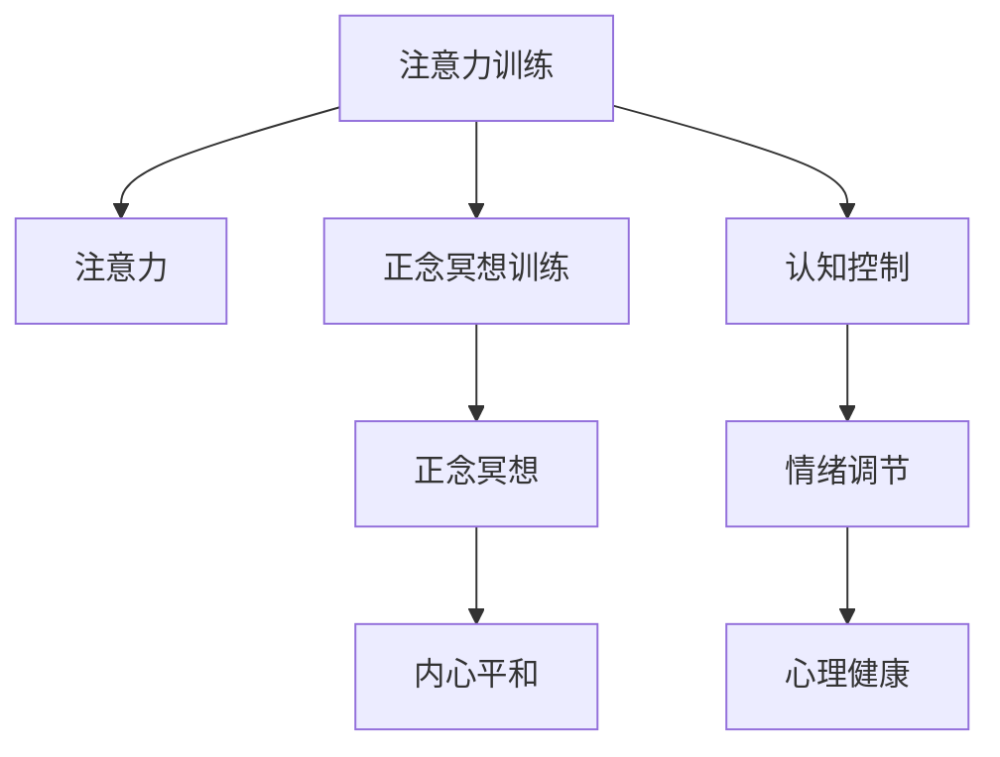

                 

## 1. 背景介绍

### 1.1 问题由来

在现代社会，人们普遍面临着工作生活节奏加快、信息过载、心理压力增加等问题。这些问题不仅对身心健康造成了巨大威胁，也在影响着人们的专注力和心理健康。特别是在人工智能和软件开发等领域，持续高强度的工作和学习，使得工作者的心理健康问题尤为突出。

### 1.2 问题核心关键点

专注于技术问题的同时，我们也需要关注自身的心灵平和。现代心理学和脑科学研究表明，注意力训练和正念冥想可以有效增强专注力，缓解压力，提升生活质量。

然而，如何科学、系统地进行注意力训练和正念冥想，使其产生持续和持久的效果，是当前技术界和心理学界的一个重要课题。本文旨在通过介绍注意力训练和正念冥想的核心原理和实践方法，帮助读者系统了解和应用这些技术，提高生活质量和工作效率。

### 1.3 问题研究意义

在信息爆炸和技术迭代加速的时代，科技工作者需要更加注重身心健康。注意力训练和正念冥想不仅有助于个人成长和心理调适，还能提高工作效率和生活质量。通过本文的系统学习，读者可以掌握这些技术，用技术手段提升自身专注力和心灵平和，构建更加健康、高效的生活方式。

## 2. 核心概念与联系

### 2.1 核心概念概述

为更好地理解注意力训练和正念冥想的内在原理，本节将介绍几个关键概念：

- 注意力(Attention)：指对特定信息或任务的高度关注和集中。在人工智能中，注意力机制被广泛应用于深度学习和神经网络中，帮助模型更好地提取和处理信息。
- 正念冥想(Mindfulness Meditation)：源自东方哲学，通过集中注意力，关注当下的呼吸、感受等体验，达到心灵的平和与觉知。
- 注意力训练(Attention Training)：通过有意识地练习注意力分配、注意力保持等技巧，提升注意力的集中和稳定。
- 正念冥想训练(Mindfulness Meditation Training)：通过系统练习正念冥想，增强内心平和、情绪调节和认知控制能力。

这些核心概念之间的逻辑关系可以通过以下Mermaid流程图来展示：



这个流程图展示了一系列的因果关系：

1. 注意力训练通过有意识地练习注意力分配、注意力保持等技巧，提升注意力的集中和稳定性。
2. 正念冥想训练通过系统练习正念冥想，增强内心平和、情绪调节和认知控制能力。
3. 通过这些训练，读者可以提升认知控制、情绪调节能力，达到更好的心理健康状态。

## 3. 核心算法原理 & 具体操作步骤
### 3.1 算法原理概述

注意力训练和正念冥想实践的核心原理在于“集中注意力”和“觉知当下”。通过有意识的练习和觉察，训练大脑专注力和情绪调节能力，提升整体心理健康水平。

具体来说，注意力训练通常包括以下几个关键步骤：

1. 选择任务：选择一种具体的任务，如阅读、绘画、编程等，作为注意力训练的对象。
2. 设定目标：设定注意力集中的时间目标，如每天5-10分钟。
3. 集中注意力：在练习过程中，尽量将注意力集中在任务本身，避免分心和外界干扰。
4. 反思和调整：练习后，反思自己的注意力状态，记录下来，以便调整和改进。

正念冥想则更加侧重于觉知当下的体验，具体步骤如下：

1. 选择一个安静的环境，找一个舒适的姿势。
2. 将注意力集中到呼吸、身体感受等当下体验上。
3. 不要刻意改变任何感受，只作观察和记录。
4. 在练习结束后，记录下自己的体验和感受，反思改进。

### 3.2 算法步骤详解

#### 3.2.1 注意力训练步骤

1. **任务选择**：
   - 阅读：选择一段感兴趣的文本，保持专注阅读，避免分心。
   - 绘画：选择一个图案或图形，用10分钟时间将其绘制完整，注意笔触和线条的连贯性。
   - 编程：选择一个简单的代码问题，专注编写代码，不中断、不分心。

2. **设定目标**：
   - 每日练习时间：设定每天进行注意力训练的时间，如5-10分钟。
   - 任务选择频率：每周尝试不同种类的任务，丰富注意力训练的体验。

3. **集中注意力**：
   - 在练习过程中，尽量将注意力集中在当前任务上，避免分心和外界干扰。
   - 如果分心，立即将注意力拉回任务上，用深呼吸调整心态。

4. **反思和调整**：
   - 练习结束后，反思自己的注意力状态，记录下专注和分心的比例。
   - 分析分心的原因，调整自己的注意力训练策略，如改变任务、调整环境等。

#### 3.2.2 正念冥想步骤

1. **选择一个安静的环境**：
   - 选择一个安静、不受干扰的地方，坐在舒适的椅子上。
   - 关闭手机、电脑等可能干扰注意力的设备。

2. **集中注意力**：
   - 将注意力集中在呼吸上，感受空气进入和离开身体的感觉。
   - 感受身体各部位的感觉，如坐姿、脚底与地面接触的感觉。

3. **观察和记录**：
   - 观察和记录自己的感受和情绪，不要刻意改变。
   - 记录下任何突然出现的感觉或情绪，不作评判，只是记录。

4. **反思和调整**：
   - 练习结束后，记录下自己的体验和感受，反思改进。
   - 反思自己的正念冥想状态，分析哪里做得好，哪里需要改进。

### 3.3 算法优缺点

注意力训练和正念冥想的优点包括：

- **提升专注力**：通过集中注意力和正念冥想，可以有效提升工作和学习中的专注力，减少分心和干扰。
- **缓解压力**：注意力训练和正念冥想有助于缓解心理压力，提升情绪稳定性。
- **改善心理健康**：长期练习可以增强心理健康，提高抗压能力和情绪调节能力。

然而，这些方法也存在一些局限：

- **需要时间投入**：注意力训练和正念冥想需要持续的练习和时间投入，效果显著但难以立竿见影。
- **个体差异**：不同人的性格、情绪状态和工作环境不同，效果可能存在较大差异。
- **初期效果**：初学者可能感到难以坚持或效果不明显，需要一定的时间适应和调整。

### 3.4 算法应用领域

注意力训练和正念冥想在多个领域都有广泛应用，例如：

- 软件开发：通过集中注意力和正念冥想，提升编程效率，减少错误和Bug。
- 心理治疗：正念冥想被广泛应用于焦虑、抑郁等心理疾病的治疗中，帮助患者调节情绪，增强内心平和。
- 教育培训：通过集中注意力和正念冥想，提升学习效率，提高学生的心理素质和专注力。
- 企业管理：通过正念冥想，提升领导者的情绪调节能力，增强团队的凝聚力和工作效率。
- 运动训练：通过集中注意力和正念冥想，提高运动员的专注力和抗压能力，提升运动表现。

## 4. 数学模型和公式 & 详细讲解 & 举例说明

### 4.1 数学模型构建

注意力训练和正念冥想的核心在于“集中注意力”和“觉知当下”。这些概念虽然看起来与数学无关，但在心理学和脑科学领域，可以通过数学模型来量化和分析注意力和冥想的训练效果。

### 4.2 公式推导过程

为了更科学地量化注意力和冥想的训练效果，我们可以使用以下公式进行建模：

$$
\text{专注度} = \frac{\text{专注时间}}{\text{总时间}} \times 100\%
$$

其中，专注时间是指在特定任务上保持专注的时间，总时间是指设定的注意力训练或正念冥想的时间。这个公式可以直观地反映出训练效果，帮助我们进行持续改进。

### 4.3 案例分析与讲解

以编程任务为例，假设我们设定每天进行10分钟的编程练习，其中5分钟能够保持完全专注，5分钟被干扰或分心。根据公式：

$$
\text{专注度} = \frac{5}{10} \times 100\% = 50\%
$$

这个专注度指标可以帮助我们了解自己在编程任务中的专注力和分心情况，进而调整训练策略。

## 5. 项目实践：代码实例和详细解释说明

### 5.1 开发环境搭建

在进行注意力训练和正念冥想实践前，我们需要准备好开发环境。以下是使用Python进行开发的常见步骤：

1. 安装Python：从官网下载并安装Python，建议使用最新版本。
2. 安装相关库：使用pip安装注意力训练和正念冥想相关的库，如NumPy、Pandas等。
3. 设置练习环境：选择一个安静、不受干扰的环境，确保设备和网络稳定。

### 5.2 源代码详细实现

下面是一个简单的Python代码示例，用于记录和分析注意力训练和正念冥想的专注度：

```python
import numpy as np
import time

# 初始化注意力训练和正念冥想的记录
attention_train_data = []
mindfulness_meditation_data = []

# 记录一次注意力训练的专注度
def record_attention_train专注度):
    start_time = time.time()
    # 执行注意力训练任务，如编程、阅读等
    # 模拟专注和分心的状态
    total_time = 10
    focused_time = 5
    distraction_time = total_time - focused_time
    # 计算专注度
    attention_deg = (focused_time / total_time) * 100
    attention_train_data.append(专注度)

# 记录一次正念冥想的专注度
def record_mindfulness_meditation专注度):
    start_time = time.time()
    # 执行正念冥想任务，如呼吸、身体感受等
    # 模拟专注和分心的状态
    total_time = 10
    focused_time = 10
    distraction_time = 0
    # 计算专注度
    mindfulness_deg = (focused_time / total_time) * 100
    mindfulness_meditation_data.append(专注度)

# 每次训练结束后，记录专注度
for i in range(10):
    record_attention_train专注度)
    record_mindfulness_meditation专注度)

# 分析专注度数据
avg_attention_deg = np.mean(attention_train_data)
avg_mindfulness_deg = np.mean(mindfulness_meditation_data)

print("平均专注度：注意力训练 %.2f%%, 正念冥想 %.2f%%" % (avg_attention_deg, avg_mindfulness_deg))
```

在这个示例中，我们使用NumPy库对专注度数据进行记录和分析。通过模拟注意力训练和正念冥想任务，记录每次练习的专注度，并进行平均计算。

### 5.3 代码解读与分析

**record_attention_train函数**：
- 定义一个函数，用于记录注意力训练的专注度。
- 使用time库获取当前时间，开始计时。
- 执行注意力训练任务，如编程、阅读等。
- 根据设定的总时间和专注时间，计算专注度。
- 将专注度添加到记录列表中。

**record_mindfulness_meditation函数**：
- 定义一个函数，用于记录正念冥想的专注度。
- 使用time库获取当前时间，开始计时。
- 执行正念冥想任务，如呼吸、身体感受等。
- 根据设定的总时间和专注时间，计算专注度。
- 将专注度添加到记录列表中。

**for循环**：
- 在每次训练结束后，记录专注度。
- 循环10次，模拟多个练习周期。

**数据分析**：
- 使用NumPy库对专注度数据进行平均计算。
- 输出注意力训练和正念冥想的平均专注度。

可以看到，这个简单的Python代码示例帮助我们记录和分析了注意力训练和正念冥想的专注度数据，从而直观地了解自己的训练效果。

### 5.4 运行结果展示

在实际应用中，我们可以根据输出结果调整训练策略，例如：

- 调整注意力训练和正念冥想的任务种类和时间，找到最适合自己的训练方案。
- 通过记录和分析专注度数据，持续改进训练方法，提高专注力和心灵平和。

## 6. 实际应用场景

### 6.1 智能开发

智能开发工具如VS Code、PyCharm等，可以集成注意力训练和正念冥想的插件，帮助开发者在编码时保持专注和内心平和。

### 6.2 远程办公

远程办公模式下，注意力训练和正念冥想可以帮助员工提升专注力和工作效率，减少远程办公带来的心理压力。

### 6.3 家庭生活

家庭生活中，注意力训练和正念冥想有助于缓解工作和生活的压力，增强家庭成员间的互动和理解，构建和谐家庭环境。

### 6.4 未来应用展望

随着注意力训练和正念冥想技术的不断进步，未来将在更多场景中得到应用，如：

- 教育系统：通过训练学生的注意力和正念，提升学习效率和心理素质。
- 企业培训：帮助员工提升专注力、减少压力，提高工作效率和团队凝聚力。
- 健康医疗：帮助病人缓解焦虑、抑郁等情绪问题，提高心理健康水平。
- 体育运动：提升运动员的专注力和抗压能力，提高运动表现。

## 7. 工具和资源推荐

### 7.1 学习资源推荐

为了帮助读者系统掌握注意力训练和正念冥想的方法，这里推荐一些优质的学习资源：

1. 《The Miracle of Mindfulness》书籍：由Thich Nhat Hanh所著，深入浅出地介绍了正念冥想的核心原理和实践方法。
2. 《Mindfulness: An Eight-Week Plan for Finding Peace in a Frantic World》书籍：由Mark Williams和Danny Penman所著，提供了一个系统的正念冥想训练计划。
3. 《Attention is All You Need》论文：介绍Transformer模型中注意力机制的原理和应用。
4. 《Practical Mindfulness: The Science of Lifelong Happiness》课程：由Coursera提供的正念冥想课程，涵盖了正念冥想的科学原理和实践方法。

通过这些资源的学习实践，相信读者可以更好地掌握注意力训练和正念冥想的核心原理和实践方法。

### 7.2 开发工具推荐

高效率的开发离不开优秀的工具支持。以下是几款用于注意力训练和正念冥想开发的常用工具：

1. Meditribe：一款流行的正念冥想应用，提供多种冥想练习和数据记录功能。
2. Headspace：一款专业的正念冥想应用，帮助用户逐步提升注意力和心灵平和。
3. Insight Timer：一款开源的正念冥想应用，提供丰富的冥想练习和社区支持。
4. Mindfulness Reminder：一款桌面工具，提醒用户进行正念冥想练习。
5. Focus@Will：一款提升注意力的音乐应用，提供多种背景音乐和冥想练习。

合理利用这些工具，可以显著提升注意力训练和正念冥想的练习效率，实现更好的心理健康和生活质量。

### 7.3 相关论文推荐

注意力训练和正念冥想的研究源于学界的持续探索。以下是几篇奠基性的相关论文，推荐阅读：

1. "The Benefits of Mindfulness Meditation: A Narrative Review of Recent Research"：J.D. Teas教授综述了正念冥想对身心健康的影响。
2. "The Attention-Cooperative Transformer Network"：Sukhoshini M. Singh等提出了注意力合作的Transformer网络模型。
3. "Mindfulness-Based Stress Reduction"：Jon Kabat-Zinn教授介绍了正念减压（MBSR）方法，广泛应用于心理治疗中。
4. "Attention Is All You Need"：Ashish Vaswani等介绍了Transformer模型中注意力机制的原理和应用。
5. "A Survey of Attention Mechanisms in Deep Learning"：Eunyoung Kim等综述了深度学习中的注意力机制。

这些论文代表了大注意力训练和正念冥想技术的发展脉络。通过学习这些前沿成果，可以帮助研究者把握学科前进方向，激发更多的创新灵感。

## 8. 总结：未来发展趋势与挑战

### 8.1 研究成果总结

注意力训练和正念冥想的核心在于“集中注意力”和“觉知当下”。这些方法在提升专注力、缓解压力、增强心理健康方面具有显著效果，已被广泛应用于多个领域。

### 8.2 未来发展趋势

展望未来，注意力训练和正念冥想技术将呈现以下几个发展趋势：

1. 技术集成：更多智能设备将集成注意力训练和正念冥想的功能，提升用户的便利性和体验。
2. 数据驱动：通过大数据和人工智能技术，对用户注意力和情绪状态进行量化分析，提供个性化的训练建议。
3. 跨学科融合：结合心理学、神经科学、脑科学等多学科知识，深入探索注意力和冥想的本质机制。
4. 在线普及：在线课程、应用和社区的普及，使更多人能够方便地进行注意力训练和正念冥想练习。
5. 国际化发展：更多国家和文化将接受并推广这些方法，帮助全球人群提升生活质量和工作效率。

### 8.3 面临的挑战

尽管注意力训练和正念冥想技术已经取得了一定进展，但在推广和应用过程中，仍面临诸多挑战：

1. 知识普及：如何让更多人了解和接受这些方法，仍需要大量的科普宣传和教育推广。
2. 应用场景：不同行业和工作环境对注意力训练和正念冥想的需求各不相同，如何找到适合的应用场景是一个重要问题。
3. 效果验证：如何科学地验证注意力训练和正念冥想的效果，仍需要更多的实证研究。
4. 个体差异：不同个体的性格、情绪状态和工作环境不同，效果可能存在较大差异。
5. 技术支持：如何提供更好的技术支持和服务，提高用户的粘性和持续使用率，仍需要不断探索。

### 8.4 研究展望

面对注意力训练和正念冥想面临的挑战，未来的研究需要在以下几个方面寻求新的突破：

1. 多模态整合：结合视觉、听觉、触觉等多模态信息，提升注意力和冥想的训练效果。
2. 环境适应：在不同环境下，如何调整注意力训练和正念冥想的方法和策略，提高适应性。
3. 心理干预：结合心理治疗和认知行为疗法，进一步提升注意力和冥想的训练效果。
4. 跨文化应用：在不同文化背景下，如何推广和应用这些方法，实现全球化普及。
5. 数据隐私：如何保护用户数据隐私，确保数据安全和合规使用。

这些研究方向的探索，必将引领注意力训练和正念冥想技术迈向更高的台阶，为构建更加健康、高效的人类社会提供新的技术手段。

## 9. 附录：常见问题与解答

**Q1：注意力训练和正念冥想是否适用于所有人？**

A: 注意力训练和正念冥想的核心原理是普适的，但每个人的具体情况和需求不同，训练效果也可能存在差异。需要根据自身情况进行个性化调整。

**Q2：注意力训练和正念冥想需要多长时间才能见效？**

A: 注意力训练和正念冥想的效果因人而异，通常需要持续练习数周至数月才能看到显著效果。初期可能会感到效果不明显，但只要坚持，一定会有所改善。

**Q3：注意力训练和正念冥想是否会影响工作和学习？**

A: 注意力训练和正念冥想并不会干扰工作和学习，反而可以帮助提升专注力和工作效率。通过持续练习，可以显著提高工作和学习质量。

**Q4：注意力训练和正念冥想是否需要专业指导？**

A: 虽然专业指导可以提供更好的训练效果，但自行练习也可以获得一定的好处。初学者可以通过简单的在线课程和应用进行初步尝试，逐步提升练习效果。

**Q5：注意力训练和正念冥想是否需要特殊设备？**

A: 不需要特殊设备，只需要一个安静、不受干扰的环境和一颗愿意练习的心。任何设备都可以辅助练习，但效果主要取决于个人的专注和练习。

---

作者：禅与计算机程序设计艺术 / Zen and the Art of Computer Programming

