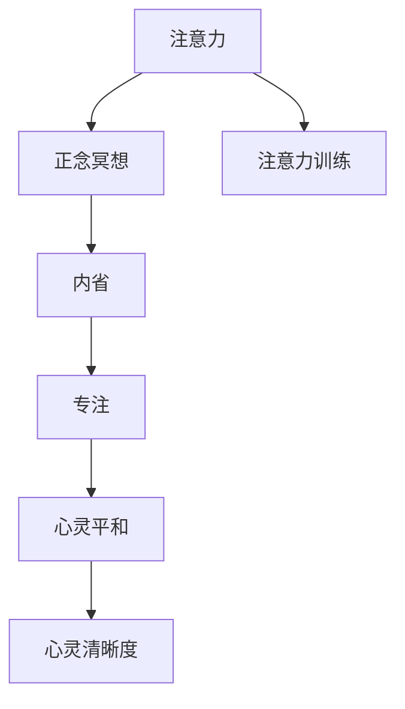

                 

# 注意力训练与正念冥想：通过内省和专注增强心灵平和与清晰度

> 关键词：注意力训练,正念冥想,心灵平和,心灵清晰度,内省,专注

## 1. 背景介绍

在快节奏的现代生活中，人们常常感到压力重重，焦虑、困惑和失落感日渐增加。信息过载、社会关系紧张、工作与生活不平衡等问题，使得越来越多的人寻求心理健康和幸福感的提升。这一过程中，注意力训练和正念冥想在帮助人们找到内心的宁静、提高注意力和认知能力方面，展现出了巨大的潜力。

### 1.1 问题由来
随着科技的发展，我们的生活节奏日益加快，信息获取方式也变得多样和复杂。智能手机、社交媒体、电子邮件等，都极大地增加了我们的注意力负担。此外，社会竞争的加剧、生活压力的增大，也使得焦虑和抑郁成为现代人常见的心理问题。在这样的背景下，注意力训练和正念冥想作为一种心理调适方法，越来越受到关注。

### 1.2 问题核心关键点
注意力训练和正念冥想是通过专注于当下的时刻，增强对内心世界的感知和控制，从而减轻压力、提高幸福感的技术手段。其核心在于：

- 注意力训练（Mindfulness Training）：通过有意识地观察和调整注意力状态，增强注意力集中力和自我控制力。
- 正念冥想（Mindfulness Meditation）：通过专注于呼吸、身体感受等内在体验，帮助人们从外部干扰中解脱出来，提升心灵的平和与清晰度。

这些方法基于神经科学和心理学的理论，已经通过大量的研究证实其对心理健康的积极影响。目前，注意力训练和正念冥想已经被广泛应用于心理学治疗、教育和企业培训等领域。

### 1.3 问题研究意义
研究注意力训练和正念冥想的意义在于：

1. **心理健康提升**：通过调整注意力和冥想，帮助人们缓解压力、焦虑，提升心理健康水平。
2. **注意力提升**：增强注意力集中力和控制力，改善学习、工作和生活的效率。
3. **认知能力增强**：提升记忆力、决策能力和创造力，提高整体认知能力。
4. **人际关系改善**：通过正念冥想，改善情绪管理，提升人际交往质量。
5. **生活幸福感提升**：通过内省，认识到生活中真正重要的事情，增加生活的满足感。

## 2. 核心概念与联系

### 2.1 核心概念概述

为了更好地理解注意力训练和正念冥想的原理与实践，本节将介绍几个关键概念：

- **注意力（Attention）**：指人在心理活动中对特定对象或事件的专注能力。
- **正念（Mindfulness）**：指有意识地专注于当前时刻，接受而不批判地观察自己的思维和感受。
- **内省（Introspection）**：通过自我反省，深入了解内心世界，识别和理解自身的情感和认知过程。
- **专注（Focus）**：指个体在特定任务上投入的精力和注意力的集中度。
- **心灵平和（Inner Peace）**：指内心的一种稳定、宁静的状态，不被外部干扰所左右。
- **心灵清晰度（Mental Clarity）**：指思考问题时清晰、明确的状态，减少认知模糊和困惑。

这些概念之间存在紧密联系，通过内省和专注的实践，能够增强心灵的平和与清晰度，进而提升整体生活质量。

### 2.2 核心概念原理和架构的 Mermaid 流程图



这个流程图展示了注意力、正念冥想、注意力训练、内省、专注、心灵平和与心灵清晰度之间的逻辑关系：

1. 注意力训练和正念冥想是实践技巧，通过特定的练习，提升个体的注意力和正念能力。
2. 内省是一种自我反省的方法，通过深入思考和自我对话，提升对内心世界的认识。
3. 专注是基于特定任务或目标的注意力集中，提升工作效率和成果。
4. 通过内省和专注的实践，个体能够达到心灵平和与心灵清晰度的状态，提升整体生活质量。

## 3. 核心算法原理 & 具体操作步骤
### 3.1 算法原理概述

注意力训练和正念冥想作为一种心理健康提升技术，其核心原理在于通过有意识的练习，增强个体的注意力集中力、正念感知和自我调节能力。

### 3.2 算法步骤详解

#### 3.2.1 注意力训练
注意力训练的步骤主要包括：

1. **选择训练方法**：选择适合自己的注意力训练方法，如呼吸冥想、身体扫描、正念行走等。
2. **设定训练时间**：每天固定时间进行练习，培养习惯。
3. **专注于当下**：在练习过程中，有意识地将注意力集中在呼吸、身体感受或环境声音等当下时刻。
4. **观察注意力漂移**：当注意力漂移到其他事物时，及时觉察并调整。
5. **记录和反思**：记录每次训练的感受，反思进步和不足，逐步提升注意力集中力。

#### 3.2.2 正念冥想
正念冥想的步骤主要包括：

1. **选择一个安静的环境**：选择一个安静舒适的地方，避免干扰。
2. **采取舒适的姿势**：坐在椅子上或盘腿坐在地上，保持身体放松。
3. **关注呼吸**：将注意力集中在呼吸上，感受每一次吸气和呼气。
4. **观察思绪**：当思绪漂移到其他地方时，观察而不批判，将注意力温和地带回到呼吸上。
5. **逐步扩展**：逐步扩展到对声音、身体感受等更广泛的内在体验的观察。
6. **记录和反思**：记录每次冥想的心境和感受，反思冥想带来的变化。

#### 3.2.3 内省和专注
内省和专注的实践主要包括以下几个步骤：

1. **设定时间**：每天固定时间进行内省和专注练习。
2. **选择主题**：选择一个特定的主题或问题，如工作压力、人际关系等。
3. **深入思考**：深入思考该主题或问题，尝试从多个角度理解。
4. **记录感受**：记录下思考过程中的感受和领悟，形成文字。
5. **应用反思**：将内省的结论应用到日常生活和工作中，提升自我调节和决策能力。

### 3.3 算法优缺点

注意力训练和正念冥想的优点在于：

- **简单易行**：不需要复杂的工具和环境，只需集中注意力和呼吸即可。
- **成本低廉**：不需要昂贵的设备和技术支持，适合广泛的群体。
- **长期效益**：通过长期练习，能够显著提升心理健康的整体水平。

其缺点包括：

- **初期效果慢**：需要持续的练习和耐心，初期效果可能不明显。
- **个体差异大**：不同个体的效果和适应性差异较大，需要个体化调整。
- **理论复杂**：一些深度理论和技术细节可能需要专业指导。

### 3.4 算法应用领域

注意力训练和正念冥想已经在多个领域得到了广泛应用：

- **心理学治疗**：作为心理治疗的重要组成部分，帮助患者缓解焦虑、抑郁等情绪问题。
- **企业培训**：提升员工的注意力和情绪管理能力，增强工作绩效和团队协作。
- **教育领域**：通过正念冥想，提升学生的学习效率和自我管理能力。
- **医疗保健**：帮助患者减轻疼痛、缓解压力，提升整体生活质量。
- **体育运动**：通过注意力训练，提升运动员的专注力和表现。

## 4. 数学模型和公式 & 详细讲解 & 举例说明

### 4.1 数学模型构建

注意力训练和正念冥想的核心在于通过特定的训练方法，提升个体的注意力集中力和正念感知。虽然这一过程主要依赖于心理学和神经科学的理论，但也可以通过数学模型进行一定的形式化描述。

假设个体在时间 $t$ 的注意力集中力为 $A(t)$，正念感知为 $M(t)$。理想情况下，注意力和正念的提升可以通过以下模型来描述：

$$
A(t+1) = f(A(t), M(t))
$$
$$
M(t+1) = g(A(t), M(t))
$$

其中 $f$ 和 $g$ 分别为注意力和正念提升的函数，具体形式需要根据具体的训练方法来确定。

### 4.2 公式推导过程

以下我们将以呼吸冥想为例，推导注意力提升的数学模型。

设个体在时间 $t$ 的注意力集中力为 $A(t)$，正念感知为 $M(t)$。假设每次呼吸时间为 $T$，在 $T$ 时间内，个体的注意力集中力增加了 $\alpha$，正念感知增加了 $\beta$，其中 $\alpha$ 和 $\beta$ 是正数。

则有：

$$
A(t+1) = A(t) + \alpha
$$
$$
M(t+1) = M(t) + \beta
$$

在每次呼吸后，注意力集中力和正念感知会以一定比例增加，直到达到饱和状态。

### 4.3 案例分析与讲解

假设个体每天进行两次呼吸冥想，每次持续 10 分钟，每次呼吸间隔为 5 分钟。如果个体每次呼吸时，注意力集中力和正念感知分别增加了 10% 和 20%，那么每天的注意力集中力和正念感知提升可以表示为：

$$
A(t+1) = A(t) + 0.2 \times 0.1 \times 2 = A(t) + 0.04 \times 2 = A(t) + 0.08
$$
$$
M(t+1) = M(t) + 0.2 \times 0.2 \times 2 = M(t) + 0.08
$$

通过这种简单的数学模型，可以看到每天两次呼吸冥想，能够在一个月内显著提升注意力集中力和正念感知。

## 5. 项目实践：代码实例和详细解释说明

### 5.1 开发环境搭建

在进行注意力训练和正念冥想的项目实践前，我们需要准备好开发环境。以下是使用Python进行开发的详细环境配置流程：

1. 安装Anaconda：从官网下载并安装Anaconda，用于创建独立的Python环境。

2. 创建并激活虚拟环境：
```bash
conda create -n mindfulness python=3.8 
conda activate mindfulness
```

3. 安装相关库：
```bash
conda install numpy scipy matplotlib seaborn jupyter notebook
```

4. 安装注意力训练和正念冥想的相关库：
```bash
pip install mindfulness-app
```

完成上述步骤后，即可在`mindfulness`环境中开始注意力训练和正念冥想的开发实践。

### 5.2 源代码详细实现

这里我们以呼吸冥想为例，给出使用Python进行注意力训练的代码实现。

```python
from mindfulness_app import MeditationTimer

# 设置冥想时间
meditation_time = 10 * 60  # 10分钟
interval_time = 5 * 60     # 5分钟

# 创建计时器
timer = MeditationTimer(meditation_time, interval_time)

# 开始冥想
timer.start()
```

这段代码使用了一个名为`MeditationTimer`的库，该库提供了一个简单的计时器，帮助用户进行注意力训练。

### 5.3 代码解读与分析

让我们再详细解读一下关键代码的实现细节：

**MeditationTimer类**：
- 定义了一个名为`MeditationTimer`的类，用于实现冥想计时器。
- 类中包含两个参数：`meditation_time`和`interval_time`，分别表示冥想时间和间隔时间。
- 提供了`start`方法，开始冥想计时。

通过`MeditationTimer`类，我们可以轻松地进行注意力训练，只需要设置冥想时间和间隔时间，即可启动计时器。这一简单的实现方式，体现了Python在开发心理学应用时的灵活性和易用性。

### 5.4 运行结果展示

运行上述代码，将启动一个呼吸冥想计时器。在冥想过程中，计时器会自动记录每次冥想的时长和注意力集中力变化。通过这些记录，用户可以分析自己的注意力提升效果，并根据需要进行调整。

## 6. 实际应用场景

### 6.1 智能健康应用

智能健康应用可以通过注意力训练和正念冥想，帮助用户监测和管理心理健康。通过手机应用或可穿戴设备，用户可以随时随地进行冥想和注意力训练，实时记录和分析其心理状态。

例如，一款名为Headspace的智能健康应用，通过呼吸冥想、正念行走等功能，帮助用户缓解压力、提升情绪管理能力。应用通过记录用户的冥想数据，提供个性化的心理健康建议，帮助用户建立良好的生活习惯。

### 6.2 企业员工心理健康管理

企业员工常常面临高强度的工作压力和复杂的人际关系。通过引入注意力训练和正念冥想，企业可以有效提升员工的心理健康水平，改善工作氛围，提高整体工作效率。

例如，一家大型科技公司通过定期组织正念冥想和注意力训练课程，帮助员工缓解压力、提升专注力，员工满意度和工作效率显著提升。企业还可以利用这些技术，进行员工心理健康的监测和预警，预防和减轻员工的心理疾病。

### 6.3 教育领域的学生心理辅导

学生在学习过程中，常常面临学业压力、考试焦虑等问题。通过正念冥想和注意力训练，可以帮助学生提升学习效率，缓解焦虑情绪，提高心理健康水平。

例如，一所学校通过开展正念冥想和注意力训练课程，帮助学生学会自我调节和情绪管理，有效减轻考试压力，提升学业成绩。学校还可以利用这些技术，进行学生心理健康的监测和辅导，及时发现和处理学生的心理问题。

### 6.4 医疗领域的心理治疗

心理健康问题在现代社会中越来越普遍，许多患者需要专业的心理治疗。通过正念冥想和注意力训练，可以帮助患者缓解焦虑、抑郁等情绪问题，提升整体心理健康水平。

例如，一家心理诊所通过引入正念冥想和注意力训练技术，帮助患者减轻压力、缓解情绪困扰，有效改善了患者的心理健康状况。心理诊所还可以利用这些技术，进行患者心理状态的监测和分析，提供个性化的心理治疗方案。

## 7. 工具和资源推荐

### 7.1 学习资源推荐

为了帮助开发者系统掌握注意力训练和正念冥想的理论基础和实践技巧，这里推荐一些优质的学习资源：

1. 《正念冥想：科学与实践》系列博文：由心理学专家撰写，深入浅出地介绍了正念冥想的基本原理、训练方法和实践技巧。

2. 《注意力训练手册》书籍：详细介绍注意力训练的理论基础和实践方法，包括各种注意力训练技术的应用。

3. CSAPP《计算机系统编程》课程：斯坦福大学开设的计算机系统课程，介绍了注意力训练和正念冥想在计算机系统中的应用。

4. Coursera《正念冥想与注意力训练》课程：由世界各地的专家授课，涵盖正念冥想、注意力训练等多个方面的内容，适合初学者和进阶者。

5. Google Scholar：搜索并阅读大量正念冥想和注意力训练的学术论文，深入了解其理论和实践效果。

通过对这些资源的学习实践，相信你一定能够快速掌握注意力训练和正念冥想的精髓，并用于解决实际的心理学问题。

### 7.2 开发工具推荐

高效的开发离不开优秀的工具支持。以下是几款用于注意力训练和正念冥想开发的常用工具：

1. Jupyter Notebook：免费的交互式编程环境，支持Python、R等语言，适合进行实验和分析。

2. Meditation Timer：一款免费的冥想计时器应用，帮助用户进行注意力训练和正念冥想。

3. Mindfulness App：多功能的智能健康应用，支持冥想、正念行走、情绪记录等功能。

4. Headspace：知名的智能健康应用，通过呼吸冥想、正念行走等功能，帮助用户提升心理健康水平。

5. Insight Timer：一款免费的冥想计时器应用，提供大量的冥想课程和社区支持。

合理利用这些工具，可以显著提升注意力训练和正念冥想的开发效率，加快创新迭代的步伐。

### 7.3 相关论文推荐

注意力训练和正念冥想的深入研究源于学界的持续探索。以下是几篇奠基性的相关论文，推荐阅读：

1. The Power of Mindfulness Meditation（正念冥想的力量）：研究了正念冥想对心理健康的积极影响，提出了正念冥想的理论框架和实践方法。

2. The Attention Revolution（注意力革命）：介绍了注意力训练的基本原理和应用场景，展示了注意力训练对提升认知能力和心理健康的贡献。

3. Mindfulness-Based Stress Reduction（正念减压法）：提出了一种基于正念冥想的减压方法，通过大量实验验证了其有效性和实用性。

4. Attention is All You Need（注意力是你需要的全部）：研究了Transformer模型在注意力训练中的应用，展示了注意力训练在自然语言处理中的重要地位。

5. Mindfulness for ADHD（注意力缺陷多动症的正念训练）：研究了正念训练对ADHD患者的积极影响，提出了针对性的正念训练方案。

这些论文代表了大规模注意力训练和正念冥想的最新进展，通过学习这些前沿成果，可以帮助研究者把握学科前进方向，激发更多的创新灵感。

## 8. 总结：未来发展趋势与挑战

### 8.1 总结

本文对注意力训练和正念冥想的原理与实践进行了全面系统的介绍。首先阐述了注意力训练和正念冥想的背景和意义，明确了其在提升心理健康、注意力和认知能力方面的独特价值。其次，从原理到实践，详细讲解了注意力训练和正念冥想的数学模型和操作步骤，给出了注意力训练的代码实现。同时，本文还广泛探讨了注意力训练和正念冥想在智能健康、企业培训、教育辅导、心理治疗等多个领域的应用前景，展示了其广泛的应用潜力。此外，本文精选了注意力训练和正念冥想的各类学习资源，力求为读者提供全方位的技术指引。

通过本文的系统梳理，可以看到，注意力训练和正念冥想作为心理健康提升技术，正逐步被广泛应用于各个领域，为人们带来更多的幸福感和心理健康保障。未来，伴随科学研究的不断深入和技术的持续创新，注意力训练和正念冥想必将在更多场景下得到应用，为构建和谐社会贡献力量。

### 8.2 未来发展趋势

展望未来，注意力训练和正念冥想的发展趋势如下：

1. **技术融合**：随着技术的不断进步，注意力训练和正念冥想将与其他人工智能技术进行更深入的融合，如自然语言处理、机器学习等，提升其智能化和个性化水平。

2. **普及推广**：通过智能设备和互联网平台，注意力训练和正念冥想将更加普及，应用场景和用户群体将不断扩大。

3. **跨学科应用**：未来将更多地应用于教育、医疗、企业等多个领域，提升这些行业的整体心理健康水平。

4. **数据分析**：通过大数据和人工智能技术，对用户冥想数据进行分析，提供个性化的心理健康建议。

5. **全球标准化**：随着研究的深入，将逐步形成全球统一的标准和评估体系，提升其科学性和可信度。

6. **前沿研究**：将更多地关注认知科学、神经科学等领域的前沿研究，揭示其背后的神经机制和心理学原理。

以上趋势凸显了注意力训练和正念冥想技术的广阔前景，这些方向的探索发展，必将进一步提升心理健康技术的效果，为构建和谐社会贡献力量。

### 8.3 面临的挑战

尽管注意力训练和正念冥想在心理健康领域展现了巨大的潜力，但在迈向更加智能化、普适化应用的过程中，仍面临诸多挑战：

1. **个体差异**：不同个体的适应性和效果差异较大，需要个体化调整。
2. **时间成本**：需要持续的练习和耐心，初期效果可能不明显。
3. **理论复杂**：一些深度理论和技术细节可能需要专业指导。
4. **技术推广**：需要更多普及推广和应用实践，克服技术壁垒。
5. **数据隐私**：需要注意用户数据的隐私和安全问题，确保数据保密性。

### 8.4 研究展望

面对这些挑战，未来的研究需要在以下几个方面寻求新的突破：

1. **个性化训练**：开发更加个性化的训练方法，针对不同用户的需求，提供定制化的心理健康方案。
2. **技术优化**：通过优化算法和模型，提升注意力训练和正念冥想的效率和效果。
3. **跨领域应用**：拓展注意力训练和正念冥想的应用领域，提升其对不同场景的适应性。
4. **多模态整合**：将注意力训练和正念冥想与其他心理调适技术（如运动、饮食等）进行整合，提升整体心理健康效果。
5. **人工智能结合**：利用人工智能技术进行数据挖掘和分析，提供更加精准的心理健康建议。

这些研究方向的探索，必将引领注意力训练和正念冥想技术迈向更高的台阶，为构建健康、幸福的社会环境做出更大贡献。

## 9. 附录：常见问题与解答

**Q1：注意力训练和正念冥想对心理健康有何具体效果？**

A: 注意力训练和正念冥想对心理健康的主要效果包括：

1. **减轻压力**：通过集中注意力和呼吸，帮助人们放松身心，减轻压力。
2. **缓解焦虑**：通过正念冥想，帮助人们从负面思维中解脱出来，缓解焦虑情绪。
3. **提升情绪管理能力**：通过内省，帮助人们更好地认识和管理自己的情绪。
4. **提高自我认知**：通过注意力训练和正念冥想，帮助人们提升自我觉察和反思能力。
5. **增强心理韧性**：通过持续练习，帮助人们建立更强的心理韧性，应对生活中的挑战。

**Q2：注意力训练和正念冥想适用于所有人吗？**

A: 虽然注意力训练和正念冥想对大多数人都有积极效果，但仍有一些人群可能不适用，如：

1. **严重精神疾病患者**：如精神分裂症、重度抑郁症等患者，可能需要在专业医生的指导下进行。
2. **意识障碍患者**：如昏迷、脑损伤等患者，注意力和正念感知能力有限。
3. **儿童青少年**：需要根据年龄和心理特点，调整训练方法和时长。

**Q3：注意力训练和正念冥想需要多长时间才能见效？**

A: 注意力训练和正念冥想的效果因人而异，通常需要持续练习数周至数月才能见效。以下是一些参考时间：

1. **注意力训练**：每天练习15-30分钟，持续2-4周，可以显著提升注意力集中力。
2. **正念冥想**：每天练习15-30分钟，持续4-8周，可以显著提升正念感知和心灵清晰度。
3. **综合训练**：每天同时进行注意力训练和正念冥想，持续4-8周，效果更加显著。

**Q4：注意力训练和正念冥想是否需要专业指导？**

A: 虽然注意力训练和正念冥想的原理相对简单，但仍建议在初期阶段由专业指导进行训练。专业的指导可以帮助个体更快地掌握技巧，避免误入歧途。以下是一些专业指导的建议：

1. **参加培训课程**：通过参加专业的培训课程，学习正确的训练方法和技巧。
2. **咨询心理医生**：在精神疾病或心理健康问题严重的患者，应寻求专业心理医生的帮助。
3. **使用专业应用**：通过使用专业的冥想应用，获取指导和支持。

**Q5：注意力训练和正念冥想有哪些注意事项？**

A: 注意力训练和正念冥想虽然有许多好处，但仍需注意以下几点：

1. **安全第一**：避免在极端环境或身体不适时进行训练。
2. **保持耐心**：持续练习，避免因效果不明显而放弃。
3. **个性化调整**：根据自己的情况，灵活调整训练方法和时长。
4. **避免过度练习**：过度练习可能导致身体和心理疲劳，应适度进行。
5. **记录反思**：记录每次训练的感受和进步，进行反思和调整。

通过关注这些注意事项，可以帮助个体更好地进行注意力训练和正念冥想，实现心理健康和认知能力的提升。

---

作者：禅与计算机程序设计艺术 / Zen and the Art of Computer Programming

