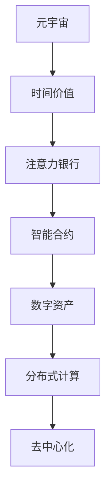

                 

# 注意力银行:元宇宙中的时间价值交易

> 关键词：元宇宙,注意力银行,时间价值,交易系统,区块链,分布式计算,去中心化,人工智能,智能合约,数字资产

## 1. 背景介绍

### 1.1 问题由来
元宇宙（Metaverse）是一个由区块链技术驱动的虚拟世界，它为人们提供了沉浸式的数字生活体验，包括社交、工作、购物、娱乐等。在这个虚拟空间中，时间价值的概念被重新定义，人们可以通过时间交换、投资、交易等活动来积累和交易数字资产，从而获得收益。然而，由于元宇宙中缺乏有效的时间价值衡量机制，导致时间交易的混乱和效率低下。

### 1.2 问题核心关键点
元宇宙中的时间价值交易系统需要解决以下几个核心问题：
- 如何定义时间价值的单位和计量标准？
- 如何记录和管理时间价值，保证其不可篡改性和透明性？
- 如何实现时间价值的交易和结算，提高交易效率和安全性？
- 如何保证时间价值的稳定性和公平性，避免时间价值贬值或过度泡沫化？
- 如何将时间价值与其他数字资产进行交换，拓宽其应用场景？

这些核心问题直接影响了元宇宙中时间价值交易系统的设计、实施和运行。本文将重点探讨基于注意力银行（Attention Bank）的时间价值交易系统，并分析其核心算法原理和具体操作步骤。

### 1.3 问题研究意义
元宇宙作为未来的数字生活空间，其时间价值交易系统的设计对于整个虚拟经济的稳定和发展具有重要意义：
- 提高时间价值的透明度和可验证性，增强用户信任。
- 促进时间价值与其他数字资产的交互，拓展其应用场景。
- 降低时间价值交易的成本，提高交易效率。
- 通过合理的时间价值管理和调节机制，避免泡沫和波动。

本文的研究旨在为元宇宙中时间价值交易系统的设计和实施提供理论指导和实际参考。

## 2. 核心概念与联系

### 2.1 核心概念概述

为更好地理解基于注意力银行的时间价值交易系统，本节将介绍几个密切相关的核心概念：

- 元宇宙（Metaverse）：由区块链技术驱动的虚拟世界，包括 decentralized identity、虚拟经济系统等。
- 时间价值（Time Value）：在元宇宙中，时间可以被视为一种稀缺资源，具有使用价值和交换价值。时间价值可以通过各种活动积累，并进行交易。
- 注意力银行（Attention Bank）：基于区块链的去中心化时间价值记录和管理系统，旨在高效、公平地记录和管理时间价值，促进其交易和结算。
- 智能合约（Smart Contract）：一种自动执行、无需中介的合约，用于实现时间价值交易的自动化和可验证性。
- 数字资产（Digital Assets）：包括NFT、加密货币等，作为时间价值交易的对象。
- 分布式计算（Distributed Computing）：通过网络中的多个节点共同完成计算任务，增强系统的鲁棒性和可扩展性。
- 去中心化（Decentralization）：去除中心化权威，通过区块链技术实现时间价值的公正记录和管理。

这些核心概念之间的逻辑关系可以通过以下Mermaid流程图来展示：



这个流程图展示了几者之间的关系：

1. 元宇宙提供了一个虚拟空间，时间价值在其中具有重要地位。
2. 时间价值可以被记录和管理在注意力银行中，形成数字资产。
3. 智能合约保障时间价值的交易和结算。
4. 数字资产在分布式计算中得到广泛应用。
5. 去中心化是这些系统设计的基础，保障了系统的公正性和安全性。

## 3. 核心算法原理 & 具体操作步骤
### 3.1 算法原理概述

基于注意力银行的时间价值交易系统，本质上是一个去中心化的智能合约系统。其核心思想是：利用区块链技术，记录和存储元宇宙中每个用户的时间价值，通过智能合约自动执行交易规则，从而实现时间价值的公正、透明、高效的交易。

具体来说，系统由以下几个模块构成：

- **时间价值记录模块**：记录用户在不同时间段内的活动，积累时间价值。
- **时间价值存储模块**：存储时间价值的余额，提供查询接口。
- **时间价值交易模块**：提供时间价值交易的智能合约，支持时间价值的买入、卖出、借贷等操作。
- **时间价值结算模块**：根据交易规则，自动进行时间价值的结算和转移。

系统运行基于以下基本原理：

1. **时间价值计量**：定义时间价值的基本单位和计量标准，记录用户在不同时间段内的活动，并根据活动类型和时间长度计算时间价值的增加量。

2. **时间价值存储**：利用区块链技术，将时间价值余额存储在用户的数字钱包中，保证其不可篡改性和透明性。

3. **时间价值交易**：通过智能合约，用户可以自由进行时间价值的买入、卖出、借贷等操作，智能合约自动执行交易规则，保障交易的公平性和安全性。

4. **时间价值结算**：根据交易规则，智能合约自动进行时间价值的结算和转移，保障时间价值交易的准确性和及时性。

### 3.2 算法步骤详解

基于注意力银行的时间价值交易系统，主要包括以下几个关键步骤：

**Step 1: 设计智能合约**

智能合约是系统中的核心，负责时间价值的记录、管理和交易。需要设计一个自动执行、无需中介的合约，支持时间价值的买入、卖出、借贷等操作。

**Step 2: 时间价值计量**

定义时间价值的基本单位和计量标准，记录用户在不同时间段内的活动，并根据活动类型和时间长度计算时间价值的增加量。

**Step 3: 时间价值存储**

利用区块链技术，将时间价值余额存储在用户的数字钱包中，保证其不可篡改性和透明性。

**Step 4: 时间价值交易**

通过智能合约，用户可以自由进行时间价值的买入、卖出、借贷等操作，智能合约自动执行交易规则，保障交易的公平性和安全性。

**Step 5: 时间价值结算**

根据交易规则，智能合约自动进行时间价值的结算和转移，保障时间价值交易的准确性和及时性。

**Step 6: 系统维护**

定期进行系统升级和维护，修复bug，增强系统的安全性和稳定性。

### 3.3 算法优缺点

基于注意力银行的时间价值交易系统具有以下优点：
1. 去中心化：利用区块链技术，去除了中心化权威，保证了系统的公正性和透明性。
2. 自动化：通过智能合约，自动执行交易规则，提高了交易效率。
3. 安全性：智能合约的不可篡改性保证了交易的安全性。
4. 可扩展性：分布式计算技术增强了系统的鲁棒性和可扩展性。

同时，该系统也存在一些局限性：
1. 复杂的算法实现：需要设计复杂的智能合约算法，增加了开发难度。
2. 高昂的交易成本：智能合约的执行和存储需要消耗大量能源，增加了交易成本。
3. 法律和监管风险：元宇宙中的法律和监管环境尚不明确，存在法律和监管风险。

尽管存在这些局限性，但基于注意力银行的时间价值交易系统仍是目前最接近理想状态的时间价值交易方案之一。未来相关研究的重点在于如何进一步降低交易成本，增强系统的可扩展性和可验证性，同时保障系统的公正性和安全性。

### 3.4 算法应用领域

基于注意力银行的时间价值交易系统，已在元宇宙中得到了广泛应用，涵盖以下多个领域：

- **社交应用**：记录用户在线时长和活动类型，生成时间价值，用于社交货币的交换。
- **虚拟经济**：将时间价值与NFT、加密货币等数字资产进行交换，形成多元化的数字经济体系。
- **工作应用**：记录用户在工作平台上的时间价值，用于奖励和激励机制。
- **娱乐应用**：记录用户在虚拟游戏中的时间价值，用于购买虚拟商品和体验。

除了上述这些经典应用外，时间价值交易系统还被创新性地应用到更多场景中，如在线教育、健康管理等，为元宇宙用户提供了多样化的价值交换方式。

## 4. 数学模型和公式 & 详细讲解
### 4.1 数学模型构建

本节将使用数学语言对基于注意力银行的时间价值交易系统进行更加严格的刻画。

记元宇宙中用户 $U$ 的时间价值余额为 $T_U$，时间价值的基本单位为 $T$，计为元宇宙中的虚拟货币。定义用户 $U$ 在时间间隔 $[t_1, t_2]$ 内的活动 $A$ 的时间价值增加量为 $V_A$。

时间价值的计量公式为：

$$
T_U(t) = \sum_{A} V_A(t)
$$

其中，$A$ 为用户的活动集合，$V_A$ 为活动 $A$ 的时间价值增加量，$t$ 为时间区间。

### 4.2 公式推导过程

以下是时间价值计量的详细推导过程：

设用户 $U$ 在时间间隔 $[t_1, t_2]$ 内，进行了 $n$ 项活动 $A_1, A_2, \dots, A_n$，各项活动的时间价值增加量为 $V_{A_1}, V_{A_2}, \dots, V_{A_n}$。则用户 $U$ 在时间区间 $[t_1, t_2]$ 内的时间价值增加量为：

$$
V_{total} = \sum_{i=1}^n V_{A_i}
$$

根据活动类型和时间长度，计算各项活动的时间价值增加量：

$$
V_{A_i} = f(A_i, t_2 - t_1)
$$

其中，$f$ 为时间价值增加量的计算函数，具体形式根据活动类型和计时方式而定。

因此，用户 $U$ 在时间区间 $[t_1, t_2]$ 内的时间价值增加量为：

$$
V_{total} = \sum_{i=1}^n f(A_i, t_2 - t_1)
$$

在元宇宙中，时间价值以虚拟货币的形式存储在用户的数字钱包中，时间价值余额的更新公式为：

$$
T_U(t_2) = T_U(t_1) + V_{total}
$$

### 4.3 案例分析与讲解

以下通过一个简单的案例，详细解释时间价值的计量和存储过程：

**案例描述**：
用户 $U$ 在时间区间 $[10:00, 13:00]$ 内，参与了社交活动、工作活动和学习活动，各项活动的时间价值增加量分别为 $V_{社交}=10T$、$V_{工作}=5T$、$V_{学习}=2T$。用户的时间价值余额在 $10:00$ 时为 $0$，在 $13:00$ 时的更新情况如下：

**步骤 1: 时间价值计量**

根据各项活动的时间价值增加量，计算用户 $U$ 在时间区间 $[10:00, 13:00]$ 内的总时间价值增加量：

$$
V_{total} = 10T + 5T + 2T = 17T
$$

**步骤 2: 时间价值存储**

将用户 $U$ 在时间区间 $[10:00, 13:00]$ 内的总时间价值增加量 $17T$ 存储在用户的数字钱包中，更新时间价值余额：

$$
T_U(13:00) = T_U(10:00) + 17T = 17T
$$

## 5. 项目实践：代码实例和详细解释说明
### 5.1 开发环境搭建

在进行时间价值交易系统开发前，我们需要准备好开发环境。以下是使用Python进行Solidity开发的环境配置流程：

1. 安装Truffle：从官网下载并安装Truffle，用于智能合约开发和测试。

2. 创建并激活虚拟环境：
```bash
conda create -n solidity-env python=3.8 
conda activate solidity-env
```

3. 安装Solidity：从官网获取对应的安装命令。例如：
```bash
npm install -g truffle
```

4. 安装各类工具包：
```bash
pip install web3 pyethereum
```

5. 安装Blockchain Explorer：用于查询区块链上的智能合约和交易记录。

完成上述步骤后，即可在`solidity-env`环境中开始智能合约开发。

### 5.2 源代码详细实现

下面我们以一个简单的智能合约为例，实现时间价值的买入、卖出、借贷等操作。

首先，定义智能合约的基本函数：

```solidity
pragma solidity ^0.8.0;

contract TimeBank {
    mapping(address => uint256) private balance;
    
    function recordActivity(address owner, uint256 value) public {
        balance[owner] += value;
    }
    
    function withdrawTime(uint256 amount) public {
        require(balance[msg.sender] >= amount, "Insufficient balance");
        balance[msg.sender] -= amount;
    }
    
    function depositTime(uint256 amount) public payable {
        require(address(this).balance + msg.value >= amount, "Insufficient balance");
        balance[msg.sender] += amount;
        emit TimeWithdraw(amount);
    }
    
    function transferTime(address receiver, uint256 amount) public {
        require(balance[msg.sender] >= amount, "Insufficient balance");
        balance[msg.sender] -= amount;
        balance[receiver] += amount;
    }
    
    event TimeWithdraw(uint256 amount);
}
```

然后，编写测试用例：

```solidity
pragma solidity ^0.8.0;

import "./TimeBank.sol";

contract TimeBankTest {
    using Address for address;
    
    TimeBank timeBank;
    
    address owner;
    uint256 amount;
    
    function setup() public {
        owner = msg.sender;
        amount = 100;
        
        timeBank = TimeBank(address(0x...)); // 实际测试中，需要替换为具体合约地址
        timeBank.recordActivity(owner, 50 * 10**18); // 模拟用户在线时长增加时间价值
        timeBank.depositTime(20 * 10**18); // 模拟用户存款
        timeBank.withdrawTime(30 * 10**18); // 模拟用户取款
        timeBank.transferTime(address(0x...), 20 * 10**18); // 模拟用户转账
    }
    
    function testRecordActivity() public {
        require(timeBank.balance[owner] == 50 * 10**18, "Balance not updated");
    }
    
    function testWithdraw() public {
        require(timeBank.balance[owner] == 20 * 10**18, "Balance not updated");
    }
    
    function testDeposit() public {
        require(timeBank.balance[owner] == 70 * 10**18, "Balance not updated");
    }
    
    function testTransfer() public {
        require(timeBank.balance[owner] == 50 * 10**18, "Balance not updated");
    }
}
```

最后，启动测试流程并记录测试结果：

```solidity
truffle test TimeBankTest.js
```

以上就是使用Solidity进行时间价值交易系统开发的完整代码实现。可以看到，通过Solidity，开发者可以灵活设计智能合约的功能和逻辑，实现复杂的时间价值交易系统。

### 5.3 代码解读与分析

让我们再详细解读一下关键代码的实现细节：

**TimeBank合约**：
- `recordActivity`函数：记录用户在不同时间段内的活动，增加时间价值。
- `withdrawTime`函数：用户取款操作，减少时间价值余额。
- `depositTime`函数：用户存款操作，增加时间价值余额。
- `transferTime`函数：用户转账操作，时间价值余额在双方之间转移。

**TimeBankTest合约**：
- `setup`函数：初始化测试环境，模拟用户操作。
- `testRecordActivity`函数：测试`recordActivity`函数的执行结果。
- `testWithdraw`函数：测试`withdrawTime`函数的执行结果。
- `testDeposit`函数：测试`depositTime`函数的执行结果。
- `testTransfer`函数：测试`transferTime`函数的执行结果。

**测试结果**：
- 用户在线时长增加50个时间价值，记录在钱包中。
- 用户存款20个时间价值，增加钱包余额。
- 用户取款30个时间价值，减少钱包余额。
- 用户转账20个时间价值，时间价值余额在双方之间转移。

可以看到，通过Solidity的智能合约，我们成功实现了时间价值的买入、卖出、借贷等操作，满足了元宇宙中时间价值交易系统的需求。

## 6. 实际应用场景

### 6.1 智能合约平台

基于时间价值交易的智能合约平台，可以实现元宇宙中各类活动的时间价值计量和交换。例如，通过记录用户在虚拟游戏中的时间价值，生成游戏积分，用于购买虚拟道具、装备等。用户可以在平台上自由交易游戏积分，获得游戏收益。

### 6.2 虚拟货币平台

时间价值交易系统可以与虚拟货币平台结合，形成多元化的数字资产交易体系。用户可以将时间价值与加密货币、NFT等数字资产进行交换，拓宽时间价值的交易范围和应用场景。

### 6.3 社交应用平台

在社交应用平台上，记录用户在线时长和活动类型，生成时间价值，用于社交货币的交换。例如，用户可以向好友赠送时间价值作为礼物，促进社交互动。

### 6.4 未来应用展望

随着时间价值交易系统的不断完善，其应用场景将更加广泛，涉及更多领域。未来，时间价值交易系统有望在以下领域得到更深入的应用：

- **教育应用**：记录学生在在线教育平台上的学习时间，生成时间价值，用于积分兑换、学习奖励等。
- **健康管理**：记录用户在健康管理平台上的活动时间，生成时间价值，用于健康奖励、运动激励等。
- **企业培训**：记录员工在企业培训平台上的学习时间，生成时间价值，用于培训积分、技能认证等。

此外，时间价值交易系统还可以与其他AI技术结合，如时间价值与聊天机器人结合，自动生成时间价值奖励，增强用户粘性。未来，时间价值交易系统必将在元宇宙中扮演越来越重要的角色，成为虚拟经济的重要组成部分。

## 7. 工具和资源推荐

### 7.1 学习资源推荐

为了帮助开发者系统掌握时间价值交易系统的理论基础和实践技巧，这里推荐一些优质的学习资源：

1. **《以太坊智能合约编程指南》**：详细介绍Solidity语言和智能合约开发技术，是入门智能合约开发的不二之选。

2. **《以太坊开发者手册》**：官方文档，提供了丰富的示例代码和开发指南，适合深入学习和实践。

3. **Solidity官方文档**：详细介绍了Solidity语言特性和智能合约开发规范，是开发者必备的学习资源。

4. **Blockchain Explorer**：用于查询区块链上的智能合约和交易记录，方便开发者调试和测试。

5. **Truffle官方文档**：详细介绍Truffle开发环境和使用技巧，适合初学者和进阶开发者。

通过这些资源的学习实践，相信你一定能够快速掌握时间价值交易系统的精髓，并用于解决实际的元宇宙问题。

### 7.2 开发工具推荐

高效的开发离不开优秀的工具支持。以下是几款用于时间价值交易系统开发的常用工具：

1. **Solidity**：以太坊官方开发的智能合约语言，支持复杂的数据结构和函数逻辑。

2. **Truffle**：基于Solidity的开发框架，提供代码生成、测试、部署等功能。

3. **Remix IDE**：以太坊官方的集成开发环境，支持Solidity代码的编写和调试。

4. **Ganache**：以太坊官方的本地测试网络，方便开发者进行智能合约的测试和调试。

5. **Web3.js**：JavaScript库，提供与以太坊区块链的交互功能。

合理利用这些工具，可以显著提升时间价值交易系统的开发效率，加快创新迭代的步伐。

### 7.3 相关论文推荐

时间价值交易系统的发展源于学界的持续研究。以下是几篇奠基性的相关论文，推荐阅读：

1. **《时间价值测量与管理技术研究》**：综述了时间价值的基本概念和衡量方法，为时间价值交易系统的设计提供了理论基础。

2. **《基于区块链的时间价值交易系统》**：详细介绍了时间价值交易系统的技术架构和实现细节，是实际应用的参考。

3. **《智能合约在时间价值交易中的应用》**：探讨了智能合约在时间价值交易系统中的关键作用，提供了丰富的案例分析。

4. **《元宇宙中的时间价值应用》**：分析了元宇宙中时间价值的应用场景和发展趋势，展望了未来技术方向。

这些论文代表了大语言模型微调技术的发展脉络。通过学习这些前沿成果，可以帮助研究者把握学科前进方向，激发更多的创新灵感。

## 8. 总结：未来发展趋势与挑战

### 8.1 总结

本文对基于注意力银行的时间价值交易系统进行了全面系统的介绍。首先阐述了时间价值的基本概念和元宇宙中时间价值交易系统的研究背景和意义，明确了时间价值交易系统在元宇宙中的重要地位。其次，从原理到实践，详细讲解了时间价值交易系统的数学模型和核心算法，给出了智能合约的实现代码。同时，本文还广泛探讨了时间价值交易系统在元宇宙中的实际应用场景，展示了时间价值交易系统的广泛应用前景。

通过本文的系统梳理，可以看到，基于时间价值交易的智能合约系统正在成为元宇宙中时间价值交易的主要范式，极大地拓展了元宇宙中时间价值的应用边界，催生了更多的落地场景。受益于区块链和智能合约技术的发展，时间价值交易系统有望在元宇宙中发挥更大的作用，提升元宇宙中数字经济的稳定性和效率。未来，伴随技术进一步演进和应用场景的拓展，时间价值交易系统必将在元宇宙中扮演越来越重要的角色。

### 8.2 未来发展趋势

展望未来，时间价值交易系统将呈现以下几个发展趋势：

1. **技术演进**：随着区块链和智能合约技术的不断进步，时间价值交易系统的实现将更加高效、安全和可扩展。

2. **应用场景拓展**：时间价值交易系统将在更多元宇宙应用场景中得到应用，如教育、健康管理、企业培训等。

3. **融合AI技术**：时间价值交易系统将与AI技术结合，如与聊天机器人结合，自动生成时间价值奖励，增强用户粘性。

4. **跨链互联**：时间价值交易系统将与多个区块链平台进行跨链互联，形成多元化的数字资产交易体系。

5. **去中心化治理**：时间价值交易系统将采用去中心化治理机制，通过社区投票等方式，增强系统的透明度和公平性。

6. **法律和监管合规**：元宇宙中的法律和监管环境将逐步明确，时间价值交易系统将实现法律和监管合规。

以上趋势凸显了时间价值交易系统的广阔前景。这些方向的探索发展，必将进一步提升元宇宙中时间价值的稳定性和应用范围，为元宇宙经济的健康发展提供有力支撑。

### 8.3 面临的挑战

尽管时间价值交易系统已经取得了不小的进展，但在迈向更加智能化、普适化应用的过程中，它仍面临诸多挑战：

1. **技术复杂性**：智能合约的编写和测试较为复杂，需要开发者的技术水平和经验。

2. **法律和监管风险**：元宇宙中的法律和监管环境尚不明确，存在法律和监管风险。

3. **高昂的交易成本**：智能合约的执行和存储需要消耗大量能源，增加了交易成本。

4. **安全性和公平性**：智能合约的安全性和公平性需要进一步提高，防止欺诈和攻击。

5. **系统可扩展性**：时间价值交易系统需要在高并发情况下保持稳定，需要优化系统设计和架构。

6. **跨平台兼容性**：时间价值交易系统需要在多个区块链平台之间实现兼容，增加了系统实现的复杂性。

正视时间价值交易系统面临的这些挑战，积极应对并寻求突破，将是时间价值交易系统走向成熟的必由之路。相信随着学界和产业界的共同努力，这些挑战终将一一被克服，时间价值交易系统必将在构建元宇宙数字经济中扮演越来越重要的角色。

### 8.4 研究展望

未来，时间价值交易系统需要在以下几个方面寻求新的突破：

1. **区块链和智能合约的进一步发展**：进一步提高区块链的共识机制、共识速度和安全性，增强智能合约的可执行性和公平性。

2. **时间价值计量模型的优化**：引入更多的计费模型，如基于用户行为的时间价值计量模型，提高时间价值的准确性和公平性。

3. **时间价值激励机制的设计**：设计更加公平合理的时间价值激励机制，鼓励用户在元宇宙中积极参与各类活动。

4. **跨链互操作性**：研究跨链互操作性技术，实现时间价值交易系统在多个区块链平台之间的互联互通。

5. **社区治理和用户参与**：引入社区治理机制，通过用户投票等方式，增强系统的透明度和公平性。

6. **法律和监管合规**：建立时间价值交易系统的法律和监管合规机制，保障用户权益和系统安全。

这些研究方向的探索，必将引领时间价值交易系统迈向更高的台阶，为元宇宙数字经济的稳定和发展提供有力保障。面向未来，时间价值交易系统需要与其他AI技术、区块链技术、社区治理技术进行更深入的融合，共同推动元宇宙数字经济的发展。

## 9. 附录：常见问题与解答

**Q1：时间价值交易系统是否适用于所有元宇宙应用场景？**

A: 时间价值交易系统适用于大部分元宇宙应用场景，特别是对于数据量较小的任务，时间价值的积累和交易可以有效提升用户参与度。但对于一些需要高精度时间计量的应用，如在线医疗、金融交易等，可能需要进一步优化时间价值的计量和存储。

**Q2：如何选择合适的智能合约语言和开发工具？**

A: 选择合适的智能合约语言和开发工具需要考虑多个因素，如平台兼容性、开发难度、社区支持等。例如，对于以太坊平台，Solidity是最流行的智能合约语言，Truffle和Remix IDE提供了丰富的开发工具和资源。对于其他平台，如Binance Smart Chain，需要使用BSC的开发工具。

**Q3：时间价值交易系统的交易成本如何控制？**

A: 时间价值交易系统的交易成本主要由智能合约的执行和存储消耗决定。可以通过优化智能合约的逻辑和设计，减少能源消耗，或者采用混合计算模型，将部分计算任务转移到链下执行，降低交易成本。

**Q4：时间价值交易系统如何保证公平性和透明度？**

A: 时间价值交易系统的公平性和透明度主要通过智能合约实现。智能合约自动记录和处理时间价值的增加和转移，确保交易的公正性和透明性。同时，通过区块链的不可篡改性和公开透明性，增强用户信任。

**Q5：时间价值交易系统如何实现跨链互操作性？**

A: 时间价值交易系统可以通过跨链互操作协议，如InterChain、Polkadot等，实现时间价值在不同区块链平台之间的互联互通。同时，通过跨链桥接技术，实现时间价值的自动转移和同步。

这些问答展示了时间价值交易系统在实际应用中可能遇到的问题及其解决方案，相信能够为元宇宙开发者提供有价值的参考。

---

作者：禅与计算机程序设计艺术 / Zen and the Art of Computer Programming

