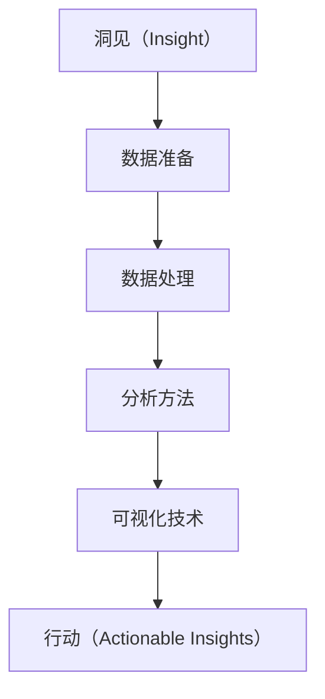

                 

# 洞见的力量：从反思到升华

## 1. 背景介绍

### 1.1 问题由来

随着信息技术的高速发展，数据量的爆炸式增长已经渗透到生活的方方面面。在技术领域，无论是人工智能、大数据、云计算，还是区块链、物联网、5G，都面临着数据处理、分析和利用的巨大挑战。在这个过程中，“洞见”（Insight）变得越来越重要。

洞见，顾名思义，就是通过对大量数据进行深度分析，从中提取有价值的洞察，为企业决策、产品迭代、客户体验优化等提供依据。然而，洞见并非易得。大数据带来的不仅仅是数据量的增长，更是数据复杂性的加剧。如何从庞杂的数据中提取有用的洞见，一直是数据科学家和技术开发者面临的巨大挑战。

### 1.2 问题核心关键点

为了应对这一挑战，技术领域发展出了众多的方法和工具。但核心关键点仍然集中在如何高效、准确地从数据中提取洞见。具体而言，包括以下几个方面：

- **数据质量**：高质量的数据是提取洞见的基础。需要确保数据的完整性、准确性、一致性和时效性。
- **数据处理技术**：包括数据清洗、数据转换、数据集成等，使得数据具备分析价值。
- **分析方法**：包括统计分析、机器学习、深度学习等，从数据中发现模式、关联和趋势。
- **可视化技术**：通过图表、仪表盘等形式，将洞见直观地呈现给用户。
- **解读与行动**：将洞见转化为可执行的策略和行动，实现价值最大化。

这些关键点构成了洞见提取的全过程，即从数据准备、分析到呈现和应用的循环。

## 2. 核心概念与联系

### 2.1 核心概念概述

为更好地理解洞见提取的过程，本节将介绍几个密切相关的核心概念：

- **洞见（Insight）**：通过对数据的深度分析，发现其中的规律、关联和趋势，为企业或个人提供有价值的指导。
- **数据质量（Data Quality）**：确保数据的准确性、完整性、一致性和时效性，是洞见提取的基础。
- **数据处理（Data Processing）**：包括数据清洗、转换和集成等，使得数据具备分析价值。
- **分析方法（Analysis Methods）**：包括统计分析、机器学习、深度学习等，从数据中发现模式、关联和趋势。
- **可视化技术（Visualization）**：通过图表、仪表盘等形式，将洞见直观地呈现给用户。
- **行动（Actionable Insights）**：将洞见转化为可执行的策略和行动，实现价值最大化。

这些核心概念之间的逻辑关系可以通过以下Mermaid流程图来展示：



这个流程图展示了洞见提取的全过程：从数据准备、处理到分析、可视化，最终转化为可执行的洞见。

## 3. 核心算法原理 & 具体操作步骤

### 3.1 算法原理概述

洞见提取的过程，本质上是一个数据驱动的分析和决策支持过程。其核心思想是通过对数据的深度分析和挖掘，发现潜在的规律和趋势，从而提供决策依据。这一过程包括数据准备、数据处理、分析方法和可视化技术等多个环节，最终将洞见转化为可执行的策略和行动。

### 3.2 算法步骤详解

#### 3.2.1 数据准备

数据准备是洞见提取的第一步。具体步骤包括：

1. **数据收集**：从各种渠道收集数据，包括内部系统和外部数据源。
2. **数据清洗**：去除重复、错误和缺失的数据，确保数据的完整性和准确性。
3. **数据转换**：将原始数据转换为适合分析的格式，如标准化、归一化等。
4. **数据集成**：将来自不同来源的数据进行整合，构建统一的数据视图。

#### 3.2.2 数据处理

数据处理是洞见提取的核心环节。具体步骤包括：

1. **特征工程**：选择和构造对分析有意义的特征。
2. **数据转换**：进行特征变换、归一化等操作，使数据适合后续分析。
3. **数据集成**：将处理后的数据进行整合，构建分析模型所需的数据集。

#### 3.2.3 分析方法

分析方法是洞见提取的关键步骤。具体步骤包括：

1. **统计分析**：通过描述性统计方法，发现数据的基本特征和趋势。
2. **机器学习**：使用监督学习、无监督学习等算法，从数据中发现模式和关联。
3. **深度学习**：利用神经网络等复杂模型，提取数据中的高层次特征和抽象概念。

#### 3.2.4 可视化技术

可视化技术是将洞见直观呈现的重要手段。具体步骤包括：

1. **图表选择**：根据洞见类型选择合适的图表形式，如折线图、柱状图、散点图等。
2. **数据映射**：将数据映射到图表上，确保数据的准确性和可读性。
3. **交互设计**：通过交互式设计，增强用户体验，方便用户深入了解洞见。

#### 3.2.5 行动（Actionable Insights）

将洞见转化为可执行的策略和行动，是洞见提取的最终目标。具体步骤包括：

1. **策略制定**：根据洞见，制定相应的业务策略和行动计划。
2. **执行监控**：跟踪执行情况，评估策略效果，并进行调整。
3. **效果评估**：对策略效果进行评估，确保洞见能够转化为实际价值。

### 3.3 算法优缺点

洞见提取方法具有以下优点：

- **全面性**：能够涵盖数据准备、处理、分析、可视化和行动等多个环节，确保洞见的全面性和可靠性。
- **深度性**：利用先进的数据处理和分析方法，能够深入挖掘数据中的深层次洞见。
- **直观性**：通过可视化技术，将洞见直观呈现，方便用户理解和应用。
- **灵活性**：能够根据具体需求，灵活调整分析方法和策略，适应不同的业务场景。

但同时，也存在一些局限性：

- **复杂性**：洞见提取过程复杂，需要跨学科的知识和技能。
- **资源需求**：需要大量的计算资源和数据存储空间，对技术基础设施有较高要求。
- **隐私问题**：在处理敏感数据时，需要考虑数据隐私和安全性问题。

尽管存在这些局限性，但整体而言，洞见提取方法仍然是大数据时代不可替代的重要技术手段。

### 3.4 算法应用领域

洞见提取方法广泛应用于各个领域，如金融、零售、医疗、制造等。具体应用场景包括：

- **金融风险管理**：通过分析客户行为数据，预测和防范金融风险。
- **零售市场分析**：通过分析消费者购买数据，优化产品设计和市场营销策略。
- **医疗健康管理**：通过分析患者数据，提高诊疗水平和健康管理效果。
- **制造业生产优化**：通过分析生产数据，优化生产流程和资源配置。

## 4. 数学模型和公式 & 详细讲解 & 举例说明

### 4.1 数学模型构建

洞见提取的数学模型通常包括数据准备、数据处理、分析方法和可视化技术等多个环节。以下以机器学习模型为例，构建洞见提取的数学模型。

假设有一组数据集 $D=\{(x_i, y_i)\}_{i=1}^N$，其中 $x_i$ 为特征向量，$y_i$ 为标签。设训练集为 $D_t$，测试集为 $D_e$。

定义模型的损失函数为 $\ell(\theta, x_i, y_i) = \mathbb{E}_{(x,y)}[\ell(y,\theta(x))]$，其中 $\theta$ 为模型参数。

### 4.2 公式推导过程

以线性回归模型为例，推导损失函数的梯度公式。

假设模型的预测值为 $y'=\theta^T x$，其中 $\theta$ 为模型参数。定义损失函数为均方误差损失：

$$
\ell(\theta, x_i, y_i) = \frac{1}{2N} \sum_{i=1}^N (y_i - \theta^T x_i)^2
$$

其梯度为：

$$
\nabla_\theta \ell(\theta) = \frac{1}{N} \sum_{i=1}^N (y_i - \theta^T x_i) x_i
$$

通过梯度下降等优化算法，可以不断更新模型参数 $\theta$，最小化损失函数 $\ell(\theta)$。

### 4.3 案例分析与讲解

以医疗健康管理为例，分析如何使用机器学习模型提取洞见。

假设有一组患者数据集 $D=\{(x_i, y_i)\}_{i=1}^N$，其中 $x_i$ 为患者的各项指标，$y_i$ 为健康状态标签。

通过数据清洗、特征工程等预处理步骤，将原始数据转换为适合分析的格式。然后使用机器学习模型对数据进行训练，选择预测效果最好的模型作为洞见提取的工具。

通过分析模型的预测结果，可以发现不同特征对健康状态的影响，如年龄、体重、血压等。进一步使用可视化技术，将结果以图表形式呈现，方便医生和患者理解。最后，根据洞见制定相应的健康管理策略，如调整饮食、增加运动等。

## 5. 项目实践：代码实例和详细解释说明

### 5.1 开发环境搭建

在进行洞见提取项目开发前，我们需要准备好开发环境。以下是使用Python进行Scikit-learn开发的开发环境配置流程：

1. 安装Anaconda：从官网下载并安装Anaconda，用于创建独立的Python环境。

2. 创建并激活虚拟环境：
```bash
conda create -n pyenv python=3.8 
conda activate pyenv
```

3. 安装Scikit-learn：从官网获取对应的安装命令。例如：
```bash
conda install scikit-learn
```

4. 安装各类工具包：
```bash
pip install numpy pandas scikit-learn matplotlib tqdm jupyter notebook ipython
```

完成上述步骤后，即可在`pyenv`环境中开始项目实践。

### 5.2 源代码详细实现

以下以医疗健康管理为例，给出使用Scikit-learn对患者数据进行线性回归模型训练和结果可视化的PyTorch代码实现。

首先，定义医疗健康管理数据处理函数：

```python
import pandas as pd
from sklearn.model_selection import train_test_split
from sklearn.preprocessing import StandardScaler
from sklearn.linear_model import LinearRegression
import matplotlib.pyplot as plt

def preprocess_data(data_path, target_col, test_size=0.2, scaler=False):
    # 读取数据
    data = pd.read_csv(data_path)
    
    # 分割数据集
    train, test = train_test_split(data, test_size=test_size, random_state=42)
    
    # 标准化数据
    if scaler:
        scaler = StandardScaler()
        train = scaler.fit_transform(train)
        test = scaler.transform(test)
    
    # 分离特征和标签
    X_train = train.drop(target_col, axis=1)
    y_train = train[target_col]
    X_test = test.drop(target_col, axis=1)
    y_test = test[target_col]
    
    return X_train, y_train, X_test, y_test
```

然后，定义模型和优化器：

```python
from sklearn.linear_model import LinearRegression

model = LinearRegression()
```

接着，定义训练和评估函数：

```python
def train_model(X_train, y_train, X_test, y_test):
    # 训练模型
    model.fit(X_train, y_train)
    
    # 评估模型
    y_pred = model.predict(X_test)
    mse = np.mean((y_pred - y_test) ** 2)
    rmse = np.sqrt(mse)
    print(f"RMSE: {rmse:.2f}")
    
    # 可视化结果
    plt.scatter(y_test, y_pred)
    plt.xlabel('Actual')
    plt.ylabel('Predicted')
    plt.show()
    
train_model(X_train, y_train, X_test, y_test)
```

最后，启动训练流程并在测试集上评估：

```python
# 加载数据
data_path = 'patients.csv'
target_col = 'health_state'
X_train, y_train, X_test, y_test = preprocess_data(data_path, target_col)

# 训练模型
train_model(X_train, y_train, X_test, y_test)
```

以上就是使用Scikit-learn对患者数据进行线性回归模型训练和结果可视化的完整代码实现。可以看到，Scikit-learn提供了丰富的工具包和接口，使得机器学习模型的开发变得简洁高效。

### 5.3 代码解读与分析

让我们再详细解读一下关键代码的实现细节：

**preprocess_data函数**：
- 读取数据集，并对其进行分割、标准化等预处理操作。
- 分离特征和标签，并返回处理后的训练集和测试集。

**train_model函数**：
- 使用训练集数据训练线性回归模型。
- 使用测试集数据评估模型性能，并计算均方误差（RMSE）。
- 使用Matplotlib绘制散点图，可视化模型的预测结果。

**训练流程**：
- 加载数据集，并调用preprocess_data函数进行预处理。
- 调用train_model函数训练模型，并在测试集上评估性能。

可以看出，Scikit-learn的API设计非常简洁，开发者可以专注于算法实现和数据分析，而不必过多关注底层实现细节。

当然，工业级的系统实现还需考虑更多因素，如模型的保存和部署、超参数的自动搜索、更灵活的任务适配层等。但核心的洞见提取范式基本与此类似。

## 6. 实际应用场景

### 6.1 金融风险管理

金融领域需要实时监控市场动态，预测和防范风险。传统的统计分析方法往往需要大量的人工介入，难以适应快速变化的市场环境。基于机器学习模型的洞见提取，可以自动化地发现市场趋势和异常，为决策提供支持。

在实践中，可以收集市场交易数据、新闻报道、社交媒体等数据源，并使用机器学习模型进行训练和预测。通过分析模型的预测结果，可以发现市场波动、异常交易等潜在风险，及时采取应对措施。

### 6.2 零售市场分析

零售业需要深入了解消费者行为和市场趋势，优化营销策略和库存管理。传统的市场调研方法费时费力，成本高昂。基于数据驱动的洞见提取，可以自动化地分析消费者数据，发现消费模式和趋势。

在实践中，可以收集消费者购买数据、评价数据、社交媒体数据等，并使用机器学习模型进行训练和预测。通过分析模型的预测结果，可以发现消费热点、趋势变化等，优化营销策略和库存管理，提高销售额和客户满意度。

### 6.3 医疗健康管理

医疗领域需要实时监控患者数据，提高诊疗水平和健康管理效果。传统的医疗数据分析方法依赖人工，效率低下。基于机器学习模型的洞见提取，可以自动化地分析患者数据，发现健康趋势和异常。

在实践中，可以收集患者诊疗数据、健康监测数据、社交媒体数据等，并使用机器学习模型进行训练和预测。通过分析模型的预测结果，可以发现健康风险、疾病趋势等，制定相应的健康管理策略，提高诊疗水平和健康管理效果。

### 6.4 未来应用展望

随着数据科学和机器学习技术的不断发展，基于洞见提取的解决方案将在更多领域得到应用，为各行各业带来变革性影响。

在智慧医疗领域，基于洞见提取的医疗健康管理系统，可以自动化地分析患者数据，发现健康风险和趋势，提高诊疗水平和健康管理效果。

在智能制造领域，基于洞见提取的生产管理系统，可以自动化地分析生产数据，发现生产瓶颈和优化方案，提高生产效率和质量。

在智能交通领域，基于洞见提取的交通管理系统，可以自动化地分析交通数据，发现交通拥堵和异常，优化交通管理方案，提高交通效率和安全性。

此外，在智慧城市、智能家居、智慧教育等众多领域，基于洞见提取的技术应用也将不断涌现，为各行各业带来新的价值。相信随着技术的日益成熟，洞见提取将成为大数据时代的重要技术手段，推动各行各业迈向智能化的新纪元。

## 7. 工具和资源推荐

### 7.1 学习资源推荐

为了帮助开发者系统掌握洞见提取的理论基础和实践技巧，这里推荐一些优质的学习资源：

1. **《数据科学导论》**：一本全面介绍数据科学基础和实践的教材，适合初学者入门。
2. **Coursera《数据科学基础》课程**：由斯坦福大学教授主讲，涵盖数据处理、统计分析、机器学习等多个环节。
3. **Kaggle数据科学竞赛**：通过参加实际的数据科学竞赛，提升实践能力和问题解决能力。
4. **GitHub开源项目**：通过学习优秀的开源项目代码，提升编程能力和思维能力。
5. **Python数据科学社区**：包括Pandas、NumPy、Scikit-learn等多个重要库的官方文档和社区讨论，是学习资源的重要来源。

通过对这些资源的学习实践，相信你一定能够快速掌握洞见提取的精髓，并用于解决实际的数据分析问题。

### 7.2 开发工具推荐

高效的开发离不开优秀的工具支持。以下是几款用于洞见提取开发的常用工具：

1. **Jupyter Notebook**：一个基于Web的交互式编程环境，支持Python、R等多种语言，适合数据分析和机器学习开发。
2. **Pandas**：一个强大的数据分析库，支持数据清洗、处理和转换等功能。
3. **NumPy**：一个高效的科学计算库，支持数组运算和线性代数等功能。
4. **Scikit-learn**：一个强大的机器学习库，支持各种常见的机器学习算法和模型。
5. **TensorFlow**：一个开源的深度学习框架，支持大规模神经网络的构建和训练。
6. **Keras**：一个高层次的深度学习库，提供简单易用的API，适合快速原型开发。

合理利用这些工具，可以显著提升洞见提取任务的开发效率，加快创新迭代的步伐。

### 7.3 相关论文推荐

洞见提取技术的发展源于学界的持续研究。以下是几篇奠基性的相关论文，推荐阅读：

1. **《数据挖掘：概念与技术》**：一本经典的机器学习教材，详细介绍了数据挖掘的基础理论和方法。
2. **《机器学习：实战指南》**：一本实用的机器学习教程，适合实际开发和项目实践。
3. **《深度学习：一种新范式》**：一本介绍深度学习理论和实践的书籍，涵盖神经网络、卷积神经网络、循环神经网络等多个方向。
4. **《自然语言处理综述》**：一本介绍自然语言处理理论和实践的综述性论文，涵盖各种NLP技术。

这些论文代表了大数据和机器学习技术的发展脉络。通过学习这些前沿成果，可以帮助研究者把握学科前进方向，激发更多的创新灵感。

## 8. 总结：未来发展趋势与挑战

### 8.1 总结

本文对基于数据驱动的洞见提取方法进行了全面系统的介绍。首先阐述了洞见提取的背景和意义，明确了洞见在数据驱动决策中的重要性。其次，从原理到实践，详细讲解了洞见提取的数学模型和关键步骤，给出了洞见提取任务开发的完整代码实例。同时，本文还广泛探讨了洞见提取方法在金融风险管理、零售市场分析、医疗健康管理等多个领域的应用前景，展示了洞见提取范式的巨大潜力。此外，本文精选了洞见提取技术的各类学习资源，力求为读者提供全方位的技术指引。

通过本文的系统梳理，可以看到，基于数据驱动的洞见提取方法正在成为数据分析的重要技术手段，极大地拓展了数据的应用边界，催生了更多的落地场景。受益于大数据和机器学习技术的快速发展，洞见提取方法必将在更多领域得到应用，为各行各业带来深远影响。

### 8.2 未来发展趋势

展望未来，洞见提取技术将呈现以下几个发展趋势：

1. **智能化水平提升**：随着人工智能技术的不断进步，基于深度学习模型的洞见提取方法将更加智能化，能够处理更复杂的任务和数据。
2. **自动化程度提高**：自动化数据清洗、特征工程和模型训练等环节，将进一步提升洞见提取的效率和效果。
3. **实时性增强**：通过引入流式数据处理技术，洞见提取方法将具备实时性，能够动态调整策略和行动。
4. **跨领域融合**：与自然语言处理、计算机视觉、语音识别等技术结合，构建更加全面的洞见提取体系。
5. **个性化优化**：根据用户需求和行为特征，优化洞见提取方法和策略，提供更加个性化的洞见服务。

这些趋势凸显了洞见提取技术的广阔前景。这些方向的探索发展，必将进一步提升数据分析的深度和广度，为各行各业带来新的价值。

### 8.3 面临的挑战

尽管洞见提取技术已经取得了显著成就，但在迈向更加智能化、普适化应用的过程中，仍面临诸多挑战：

1. **数据质量问题**：如何确保数据的准确性、完整性和一致性，是洞见提取的基础。
2. **计算资源需求**：高复杂度的深度学习模型需要大量的计算资源和存储空间，对技术基础设施有较高要求。
3. **隐私保护问题**：在处理敏感数据时，如何保障数据隐私和安全性，是一个重要挑战。
4. **模型解释性问题**：深度学习模型的黑盒性质，使得洞见提取结果难以解释，影响其应用效果。
5. **跨领域应用问题**：如何将洞见提取方法应用到不同领域，需要跨学科的知识和技能。

尽管存在这些挑战，但整体而言，洞见提取技术仍然是大数据时代不可或缺的重要技术手段。相信随着技术的不断进步和优化，这些挑战将逐步得到解决，洞见提取方法必将在更多领域得到广泛应用。

### 8.4 研究展望

面对洞见提取面临的种种挑战，未来的研究需要在以下几个方面寻求新的突破：

1. **数据预处理自动化**：开发自动化的数据清洗和特征工程工具，提升数据处理效率和效果。
2. **模型压缩与优化**：开发更加轻量级、高效能的模型压缩和优化方法，降低计算资源需求。
3. **模型可解释性增强**：研究模型解释性和透明性的方法，增强洞见提取结果的可信度和可解释性。
4. **跨领域知识融合**：研究跨领域知识融合方法，提升洞见提取方法的通用性和鲁棒性。
5. **隐私保护技术**：研究数据隐私保护技术，确保洞见提取过程中的数据安全和隐私保护。

这些研究方向将为洞见提取技术带来新的突破，进一步推动大数据和人工智能技术的发展。总之，洞见提取技术需要在数据准备、分析、可视化等多个环节进行全面优化，方能发挥其最大价值，推动各行各业迈向智能化新纪元。

## 9. 附录：常见问题与解答

**Q1：如何保证数据的质量和完整性？**

A: 保证数据的质量和完整性是洞见提取的基础。具体措施包括：
1. **数据清洗**：去除重复、错误和缺失的数据。
2. **数据验证**：通过统计分析和可视化技术，验证数据的合理性。
3. **数据标注**：对于标注数据，确保标注的准确性和一致性。

**Q2：如何选择和构造适合分析的特征？**

A: 选择和构造对分析有意义的特征是洞见提取的关键。具体措施包括：
1. **特征选择**：根据领域知识和经验，选择与分析目标相关的特征。
2. **特征构造**：通过特征工程，构造新的特征，提高数据的分析价值。
3. **特征优化**：根据模型性能和计算资源，优化特征的维度和类型。

**Q3：如何评估模型的性能和效果？**

A: 评估模型的性能和效果是洞见提取的重要环节。具体措施包括：
1. **损失函数**：选择适合任务和模型的损失函数，评估模型的预测效果。
2. **指标选择**：根据任务类型，选择适合的评估指标，如准确率、召回率、F1值等。
3. **交叉验证**：使用交叉验证技术，评估模型在不同数据集上的泛化能力。

**Q4：如何实现模型可解释性和透明性？**

A: 实现模型可解释性和透明性是洞见提取的关键。具体措施包括：
1. **模型可视化**：通过可视化技术，展示模型的决策过程和关键特征。
2. **特征重要性分析**：分析模型的特征重要性，识别关键特征和重要因素。
3. **局部可解释性**：研究局部可解释性方法，提供模型输出的详细解释。

**Q5：如何保护数据隐私和安全性？**

A: 保护数据隐私和安全性是洞见提取的重要环节。具体措施包括：
1. **数据匿名化**：去除或模糊化敏感信息，保护用户隐私。
2. **访问控制**：通过权限管理，限制数据的访问和使用。
3. **数据加密**：对敏感数据进行加密，防止数据泄露。

这些措施可以有效提升洞见提取的可靠性和安全性，保障数据隐私和用户权益。总之，洞见提取技术需要在数据准备、分析、可视化等多个环节进行全面优化，方能发挥其最大价值，推动各行各业迈向智能化新纪元。

---

作者：禅与计算机程序设计艺术 / Zen and the Art of Computer Programming

