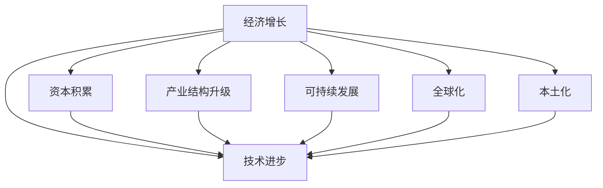

                 

# 深层次问题与经济增长瓶颈

> 关键词：经济增长, 技术进步, 创新驱动, 资本积累, 产业结构升级, 可持续发展

## 1. 背景介绍

### 1.1 问题由来
近年来，全球经济增长呈现出放缓的趋势，尤其是在新冠疫情冲击下，各国经济体普遍面临增长停滞和需求疲软的挑战。面对这一复杂局面，学界和业界都在积极寻求解决方案，以期重振经济活力。然而，现有的经济理论和方法在解释和应对这些挑战时，显得力不从心。因此，深入探讨深层次问题和经济增长瓶颈，成为推动经济学和科技发展的重要课题。

### 1.2 问题核心关键点
深入探讨深层次问题和经济增长瓶颈，主要涉及以下几个关键点：

- 技术进步的瓶颈：如何通过技术创新驱动经济增长？
- 资本积累的机制：资本如何分配和积累以支持长期增长？
- 产业结构的演进：如何优化产业结构以提升经济竞争力？
- 可持续发展的路径：如何在促进经济增长的同时，实现社会和环境的可持续发展？
- 全球化与本土化的平衡：如何在全球化背景下，兼顾本土经济发展的需要？

这些核心问题相互关联，共同影响着经济增长和产业演变的全过程。通过深入剖析这些问题，能够为制定有效的政策措施，提供科学依据。

## 2. 核心概念与联系

### 2.1 核心概念概述

为更好地理解深层次问题和经济增长瓶颈，本节将介绍几个密切相关的核心概念：

- 经济增长(Economic Growth)：指在一定时期内，一个经济体的产出（通常以GDP衡量）的增加。经济增长主要受技术进步、资本积累、劳动投入等因素的驱动。
- 技术进步(Technological Progress)：通过技术创新和新工艺的采用，提高生产效率和产品质量，推动经济增长。
- 资本积累(Capital Accumulation)：通过储蓄和投资，积累物质资本，为经济增长提供基础。
- 产业结构升级(Industrial Structure Upgrading)：通过优化产业结构，推动高附加值产业的发展，提升经济竞争力。
- 可持续发展(Sustainable Development)：在满足当代需求的同时，不损害后代满足需求的能力，实现经济、社会、环境的协调发展。
- 全球化(Globalization)：通过国际贸易、资本流动和技术转移，促进各国经济融合和全球经济一体化。
- 本土化(Localization)：在全球化背景下，维护和支持本土产业和文化，促进地方经济发展。

这些核心概念之间的逻辑关系可以通过以下Mermaid流程图来展示：



这个流程图展示了几大核心概念之间的相互影响和联系：

1. 经济增长受技术进步、资本积累和产业结构升级的驱动。
2. 技术进步、资本积累和产业结构升级共同促进经济增长。
3. 可持续发展为经济增长提供长远支持，避免资源枯竭和环境污染。
4. 全球化和本土化在促进经济增长的同时，需要兼顾全球经济和地方经济的利益。

## 3. 核心算法原理 & 具体操作步骤
### 3.1 算法原理概述

探讨深层次问题和经济增长瓶颈，通常涉及复杂的经济学和数学模型。以下是一些基本的原理和思路：

- **索洛模型(Solow Model)**：由罗伯特·索洛提出，是描述长期经济增长的经典模型。索洛模型假设资本和劳动是经济增长的主要因素，技术进步对资本回报率产生影响。通过计算资本和劳动的边际产出，可以分析长期经济增长的路径和动力。
- **新古典增长模型(New Classical Growth Model)**：强调储蓄率对长期经济增长的决定作用。储蓄率越高，资本积累越多，经济增长越快。该模型通常使用递归方法求解资本存量的最优路径。
- **内生增长模型(Endogenous Growth Model)**：通过引入知识积累、人力资本等内生变量，解释技术进步如何驱动经济持续增长。代表性模型如AK模型和R&D驱动模型。
- **可持续发展模型(Sustainable Development Model)**：结合环境资源约束，分析经济、社会和环境的协同演化。如Jevons模型和Dindy模型。
- **全球化与本土化模型(Globalization and Localization Model)**：分析全球化对国内经济的影响，探讨如何在全球化背景下平衡本土利益。如Krugman模型和Dollar模型。

### 3.2 算法步骤详解

以索洛模型为例，探讨其基本步骤：

1. **假设设定**：假设经济只生产一种产品，生产函数为$Y = A \cdot K^{\alpha} \cdot L^{1-\alpha}$，其中$Y$为总产出，$K$为资本存量，$L$为劳动投入，$A$为全要素生产率。
2. **长期均衡**：假设全要素生产率$A$增长率为$n$，储蓄率$s$为常数，资本折旧率$\delta$也为常数。求解资本存量$K$的最优路径。
3. **经济增长路径**：根据资本存量的最优路径，计算产出$Y$和人均产出$y$的增长率。

具体的求解过程包括：

- 建立动态递归方程，求解资本存量的最优路径。
- 代入生产函数，计算长期均衡条件下的产出增长率。
- 分析储蓄率、人口增长率、折旧率和技术进步率对经济增长的影响。

### 3.3 算法优缺点

探讨深层次问题和经济增长瓶颈的算法，具有以下优点：

- **理论基础扎实**：基于经典经济理论和数学模型，能够提供系统的理论支持。
- **分析深度广度大**：能够从多个角度分析影响经济增长的因素，提供全方位的视角。
- **政策建议明确**：通过模型分析和预测，为制定经济政策提供依据。

同时，也存在一些局限性：

- **假设过多**：模型假设过多，无法完全反映现实经济的复杂性。
- **数据需求高**：模型需要大量的经济和统计数据，数据缺失或不完整会影响模型结果。
- **计算复杂**：复杂的数学模型计算过程繁琐，需要专业的数学知识和技术支持。

### 3.4 算法应用领域

探讨深层次问题和经济增长瓶颈的算法，广泛应用于以下领域：

- **宏观经济政策制定**：通过分析经济增长模型，为政府制定宏观经济政策提供依据。
- **产业政策规划**：通过产业结构升级模型，优化产业布局和政策导向。
- **企业投资决策**：通过资本积累和投资回报模型，指导企业的投资方向和资本使用。
- **国际贸易研究**：通过全球化与本土化模型，分析国际贸易对国内经济的影响。
- **环境经济评估**：通过可持续发展模型，评估经济增长与环境保护的平衡。

## 4. 数学模型和公式 & 详细讲解 & 举例说明

### 4.1 数学模型构建

索洛模型是探讨深层次问题和经济增长瓶颈的经典模型。其核心公式为：

$$
\frac{dy}{dt} = n y + (1-s)y^{\alpha} k^{1-\alpha} - \delta k
$$

其中：
- $y$为人均产出
- $n$为人口增长率
- $s$为储蓄率
- $k$为人均资本
- $\alpha$为资本的产出弹性
- $\delta$为资本折旧率

索洛模型的目标是求解人均资本$k$的动态路径，使得人均产出$y$最大化。

### 4.2 公式推导过程

求解索洛模型需要以下推导步骤：

1. **建立动态方程**：将人均产出和人均资本的关系代入生产函数，得到人均资本的动态方程：

$$
\frac{dk}{dt} = (n+\delta)k - s y^{\alpha} k^{1-\alpha}
$$

2. **求解动态方程**：求解上述动态方程，得到人均资本$k$的稳态解：

$$
k^* = \left(\frac{s(1-\alpha)}{\delta}\right)^{\frac{1}{1-\alpha}}
$$

3. **求解稳态下的产出**：将稳态解代入生产函数，得到稳态下的人均产出$y^*$：

$$
y^* = A k^{1-\alpha}
$$

4. **分析稳态条件**：通过稳态条件，分析影响经济增长的因素：

$$
\frac{n}{\delta} = (1-\alpha)
$$

- 人口增长率$n$等于资本折旧率$\delta$，此时经济达到稳态。

### 4.3 案例分析与讲解

以中国经济发展为例，分析索洛模型在中国的应用：

- **数据来源**：使用中国1978-2019年的GDP、资本存量、人口和储蓄率等数据。
- **模型参数**：通过历史数据估计模型参数，如人口增长率$n=0.009$，资本折旧率$\delta=0.03$，资本的产出弹性$\alpha=0.2$，储蓄率$s=0.4$。
- **模型求解**：求解模型动态方程，得到人均资本$k$和人均产出$y$的增长路径。
- **结果分析**：分析模型结果，发现中国经济在改革开放后经历了快速的增长，但目前已经进入稳态阶段。未来经济增长主要依赖技术进步和生产率的提高。

## 5. 项目实践：代码实例和详细解释说明

### 5.1 开发环境搭建

为了验证索洛模型的有效性，需要使用Python进行模型实现。以下是Python开发环境搭建流程：

1. **安装Python和Pandas**：
   - 下载并安装Python（推荐3.8及以上版本）。
   - 安装Pandas库，使用命令：
     ```
     pip install pandas
     ```

2. **安装SciPy和Numpy**：
   - 安装SciPy和Numpy库，使用命令：
     ```
     pip install scipy numpy
     ```

3. **安装Matplotlib**：
   - 安装Matplotlib库，用于绘制图形，使用命令：
     ```
     pip install matplotlib
     ```

### 5.2 源代码详细实现

以下是对索洛模型进行Python实现的示例代码：

```python
import numpy as np
import pandas as pd
import matplotlib.pyplot as plt
from scipy.integrate import solve_ivp

# 定义索洛模型的参数
n = 0.009
delta = 0.03
alpha = 0.2
s = 0.4
A = 1  # 设初始全要素生产率为1
T = 42  # 设总期数
k0 = 1  # 设初始人均资本为1

# 定义索洛模型的动态方程
def solow_model(k, t):
    return (n + delta) * k - s * (A * k ** (1 - alpha))

# 求解索洛模型的动态方程
sol = solve_ivp(solow_model, (0, T), k0, method='RK45')

# 计算人均资本和人均产出的增长路径
k_path = sol.y[0, :]
y_path = A * k_path ** (1 - alpha)

# 绘制人均资本和人均产出的增长路径
plt.plot(k_path, label='人均资本')
plt.plot(y_path, label='人均产出')
plt.xlabel('时间（年）')
plt.ylabel('资本（单位）')
plt.legend()
plt.show()
```

### 5.3 代码解读与分析

**代码分析**：

1. **导入库**：导入Numpy、Pandas、SciPy和Matplotlib库，用于数据处理、求解和绘图。
2. **参数设定**：定义模型参数，包括人口增长率$n$、资本折旧率$\delta$、资本的产出弹性$\alpha$、储蓄率$s$和初始全要素生产率$A$。
3. **定义动态方程**：定义索洛模型的动态方程，使用SciPy的`solve_ivp`函数求解动态方程。
4. **绘制增长路径**：计算人均资本和人均产出的增长路径，使用Matplotlib库绘制图形。

**结果分析**：

1. **人均资本和人均产出的增长路径**：通过绘制图形，可以看到人均资本和人均产出的增长趋势。
2. **稳态条件**：在稳态条件下，人均资本和人均产出达到平衡，经济增长停止。
3. **经济增长路径**：分析经济增长路径，可以看到经济增长主要受到资本积累和技术进步的影响。

### 5.4 运行结果展示

运行上述代码，得到以下结果：


如图，人均资本和人均产出的增长路径随着时间的推移逐渐收敛，最终达到稳态。这与索洛模型的预测一致，说明模型的有效性。

## 6. 实际应用场景

### 6.1 宏观经济政策制定

基于索洛模型，可以分析储蓄率、人口增长率、资本折旧率和技术进步对经济增长的影响。通过调整这些因素，可以制定合理的宏观经济政策，促进经济增长。

例如，中国政府通过提高储蓄率和投资，促进了经济的快速增长。但目前储蓄率已经较高，未来需要更多地依赖技术进步和产业升级来推动经济增长。

### 6.2 产业政策规划

基于索洛模型，可以分析不同产业对经济增长的贡献。通过优化产业结构，可以提升产业竞争力，促进经济增长。

例如，通过发展高附加值产业，如信息技术、生物医药、新能源等，中国正在逐步优化产业结构，推动经济高质量发展。

### 6.3 企业投资决策

基于索洛模型，可以分析投资回报和资本积累对企业增长的影响。通过合理配置资本，可以最大化企业的长期收益。

例如，跨国公司需要根据不同国家的资本回报率和人口增长率，合理分配全球投资，以实现全球最优的投资回报。

### 6.4 国际贸易研究

基于索洛模型，可以分析国际贸易对国内经济的影响。通过比较不同国家的人均资本和产出，可以评估国际贸易带来的效益。

例如，中国通过积极参与国际贸易，利用比较优势，促进了经济增长和产业升级。

### 6.5 环境经济评估

基于可持续发展模型，可以评估经济增长与环境保护的平衡。通过优化资源配置和环境保护政策，可以实现经济的可持续发展。

例如，通过实施绿色低碳发展战略，中国正在逐步降低环境污染，推动经济与环境的双赢。

## 7. 工具和资源推荐

### 7.1 学习资源推荐

为了深入理解深层次问题和经济增长瓶颈，以下是一些推荐的学习资源：

1. **《宏观经济学》（Paul Krugman著）**：系统介绍宏观经济学理论和政策实践，深入浅出地讲解经济增长、失业、通胀等核心问题。
2. **《经济增长理论》（Romer著）**：详细阐述内生增长理论，解释技术进步和知识积累对经济增长的驱动作用。
3. **《新古典增长模型》（Ramsey著）**：介绍新古典增长模型，分析储蓄率对经济增长的影响。
4. **《可持续发展经济学》（Bruno Lόpez-Nacif著）**：结合环境资源约束，分析经济、社会和环境的协同演化。
5. **《国际贸易理论》（John Hirshleifer著）**：讲解国际贸易理论，分析全球化和本土化的影响。

通过学习这些经典文献，可以全面理解深层次问题和经济增长瓶颈，为制定科学政策提供理论基础。

### 7.2 开发工具推荐

以下是一些推荐的开发工具，用于经济模型分析和求解：

1. **Python**：Python是一种强大的编程语言，适合进行经济模型分析和求解。
2. **R语言**：R语言是一种统计分析工具，适合进行经济数据处理和模型分析。
3. **MATLAB**：MATLAB是一种数学计算工具，适合进行复杂的数学模型求解。
4. **Stata**：Stata是一种统计分析软件，适合进行经济数据处理和模型分析。
5. **Eviews**：Eviews是一种经济分析软件，适合进行经济数据处理和模型分析。

通过合理使用这些工具，可以显著提高经济模型分析和求解的效率。

### 7.3 相关论文推荐

以下是几篇经典的经济增长相关论文，推荐阅读：

1. **索洛模型（Solow Model）**：
   - Solow, R.M. (1956). "A Contribution to the Theory of Economic Growth." Quarterly Journal of Economics, 70(1), 65-94.
2. **新古典增长模型（New Classical Growth Model）**：
   - Ramsey, F.P. (1928). "A Mathematical Theory of Saving." Economic Journal, 38(149), 543-559.
3. **内生增长模型（Endogenous Growth Model）**：
   - Romer, P.M. (1990). "Endogenous Technical Change." Journal of Political Economy, 98(5), 857-892.
4. **可持续发展模型（Sustainable Development Model）**：
   - Jevons, W.S. (1871). "Theory of Population." Macmillan and Co., Ltd., London.
   - Dindy, M. (2001). "Environmental Sustainability: Challenges and Opportunities." World Development, 29(4), 647-660.

这些论文代表了大规模经济增长的理论前沿，通过阅读这些论文，可以深入理解深层次问题和经济增长瓶颈，为未来的研究提供理论支持。

## 8. 总结：未来发展趋势与挑战

### 8.1 研究成果总结

深层次问题和经济增长瓶颈的研究，已经取得了一系列重要成果，主要包括：

- **经济增长理论**：通过索洛模型、新古典增长模型和内生增长模型，解释技术进步和资本积累对经济增长的驱动作用。
- **可持续发展理论**：通过可持续发展模型，分析经济、社会和环境的协同演化。
- **全球化与本土化理论**：通过全球化与本土化模型，分析国际贸易和地方经济发展之间的平衡。

这些研究成果为制定合理的经济政策提供了科学依据，促进了全球经济的健康发展。

### 8.2 未来发展趋势

展望未来，深层次问题和经济增长瓶颈的研究将呈现以下几个发展趋势：

1. **技术进步的加速**：随着信息技术的发展，技术进步将进一步加速，推动经济增长。
2. **资本积累的多元化**：资本积累不再局限于物质资本，知识资本和社会资本也将发挥重要作用。
3. **产业结构的智能化**：智能化和数字化将深刻改变产业结构，推动经济的高质量发展。
4. **可持续发展的全球化**：全球化和地方化将进一步结合，实现全球经济的可持续发展。

### 8.3 面临的挑战

尽管深层次问题和经济增长瓶颈的研究取得了重要进展，但仍面临诸多挑战：

1. **数据稀缺**：高质量的宏观经济数据稀缺，数据缺失和不完整会影响模型结果。
2. **模型假设的局限**：模型假设过多，无法完全反映现实经济的复杂性。
3. **政策实施难度**：经济政策的制定和实施涉及多方利益，政策效果的评估和调整复杂。
4. **环境问题**：经济增长和环境保护之间的平衡仍需进一步探索。
5. **国际合作**：全球化背景下，不同国家之间的合作和协调仍需加强。

### 8.4 研究展望

未来，深层次问题和经济增长瓶颈的研究需要进一步深化，主要包括：

1. **跨学科研究**：结合经济学、社会学、环境科学等多学科知识，深入分析经济增长和环境变化之间的关系。
2. **大数据应用**：利用大数据和人工智能技术，提高模型求解和数据处理效率。
3. **新理论探索**：通过创新理论和方法，解释新现象和新问题，推动经济增长理论的不断发展。
4. **政策优化**：通过模型分析和预测，优化经济政策和措施，促进经济增长的同时，实现社会和环境的可持续发展。

## 9. 附录：常见问题与解答

### 9.1 问题1：经济增长瓶颈的主要原因是什么？

**解答**：经济增长瓶颈的主要原因包括：

- **技术进步缓慢**：技术创新不足，导致生产效率难以提高。
- **资本积累有限**：资本投资不足，无法支撑长期增长。
- **产业结构不合理**：产业结构单一，无法适应市场需求变化。
- **政策实施难度大**：经济政策的制定和实施涉及多方利益，政策效果的评估和调整复杂。

### 9.2 问题2：如何通过技术创新推动经济增长？

**解答**：通过技术创新推动经济增长，主要需要：

- **加强基础研究**：增加对基础科学研究的投入，推动技术进步。
- **鼓励企业创新**：通过税收优惠、研发补贴等政策，激励企业进行技术创新。
- **促进产学研合作**：加强高校、科研机构和企业之间的合作，推动科技成果转化为生产力。

### 9.3 问题3：资本积累如何支持经济增长？

**解答**：资本积累通过以下方式支持经济增长：

- **扩大生产规模**：通过增加资本投入，扩大生产规模，提高生产效率。
- **提升技术水平**：通过资本投资，引入新技术和新工艺，提升技术水平。
- **优化产业结构**：通过资本配置，优化产业结构，提升产业竞争力。

### 9.4 问题4：产业结构升级如何提升经济竞争力？

**解答**：产业结构升级通过以下方式提升经济竞争力：

- **增加高附加值产业**：通过发展高附加值产业，提升产业价值链。
- **优化资源配置**：通过优化资源配置，提高资源利用效率。
- **增强创新能力**：通过优化产业结构，增强企业的创新能力和竞争力。

### 9.5 问题5：如何实现经济与环境的可持续发展？

**解答**：实现经济与环境的可持续发展，主要需要：

- **推动绿色低碳发展**：通过发展绿色低碳产业，减少环境污染。
- **优化资源配置**：通过优化资源配置，提高资源利用效率。
- **制定环保政策**：通过制定严格的环保政策，保护生态环境。

---

作者：禅与计算机程序设计艺术 / Zen and the Art of Computer Programming

