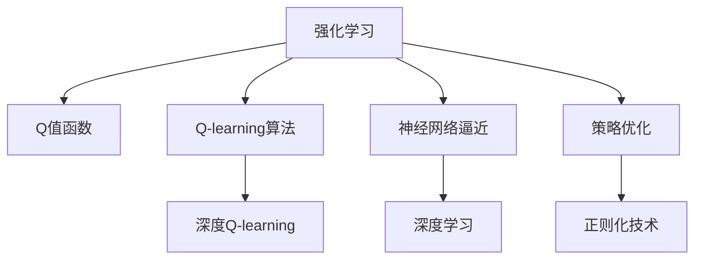

                 

# 深度 Q-learning：从经典Q-learning理解深度Q-learning

> 关键词：深度强化学习, 深度Q-learning, 经典Q-learning, 神经网络, 强化学习, 学习率, 策略优化, 深度学习

## 1. 背景介绍

### 1.1 问题由来
在强化学习中，经典的Q-learning算法是一种基于经验的方法，通过不断与环境交互，优化策略函数以最大化预期回报。随着深度学习的兴起，深度Q-learning(DQN)作为Q-learning的一种变体，使用神经网络逼近Q值函数，解决了Q-learning在处理高维连续状态空间时的不足。深度Q-learning在AI游戏、自动驾驶、机器人控制等领域取得了突破性的进展，展示了其在复杂环境中的强大适应性和学习能力。

### 1.2 问题核心关键点
深度Q-learning的核心在于将深度学习和强化学习结合起来，通过神经网络逼近Q值函数，从而在处理复杂任务时取得了显著的性能提升。深度Q-learning的核心思想包括：
- 使用神经网络逼近Q值函数
- 使用经验回放、目标网络等优化训练过程
- 网络优化中的正则化技术
- 深度学习中梯度消失、梯度爆炸等问题

本文将从Q-learning原理入手，逐步深入探讨深度Q-learning的原理与应用，帮助读者系统掌握该技术。

### 1.3 问题研究意义
深度Q-learning是强化学习领域的里程碑技术之一，它不仅为解决复杂环境中的决策问题提供了新方法，也为后续的深度强化学习发展奠定了基础。研究深度Q-learning，对于理解深度学习在强化学习中的应用，把握深度强化学习的发展方向，具有重要意义：

1. 提供了一种高效处理复杂决策问题的算法。
2. 促进了深度学习和强化学习的融合，为AI技术在现实世界中的应用提供了新思路。
3. 推动了深度强化学习在自动驾驶、机器人控制等实际应用中的进步。
4. 为深度学习在实时决策、安全控制等领域的应用提供了理论基础。

## 2. 核心概念与联系

### 2.1 核心概念概述

为更好地理解深度Q-learning的原理和应用，本节将介绍几个密切相关的核心概念：

- 强化学习(Reinforcement Learning, RL)：通过智能体与环境交互，通过优化策略函数，以最大化预期回报的学习框架。
- Q值函数(Q-value Function)：表示在状态 $s$ 下采取行动 $a$ 的预期回报 $Q(s,a)$，是强化学习中一个重要的概念。
- Q-learning算法：一种基于值函数的强化学习算法，通过更新Q值函数来优化策略函数。
- 深度Q-learning(DQN)：使用神经网络逼近Q值函数，以应对Q-learning在处理高维连续状态空间时的挑战。

这些核心概念之间的逻辑关系可以通过以下Mermaid流程图来展示：



这个流程图展示了这个核心概念之间的逻辑关系：

1. 强化学习通过智能体与环境交互，优化策略函数。
2. Q值函数表示在状态 $s$ 下采取行动 $a$ 的预期回报。
3. Q-learning算法基于Q值函数，通过更新Q值函数来优化策略函数。
4. 深度Q-learning使用神经网络逼近Q值函数，以应对高维连续状态空间的挑战。
5. 神经网络逼近是深度学习的一种形式，通过优化网络结构、学习率等参数来逼近Q值函数。
6. 策略优化是深度Q-learning中的一种方法，通过优化网络参数，提高模型预测准确性。
7. 正则化技术用于避免过拟合，保证模型泛化性能。

这些核心概念共同构成了深度Q-learning的学习框架，使其能够在复杂环境中实现高效的策略优化。通过理解这些核心概念，我们可以更好地把握深度Q-learning的工作原理和优化方向。

## 3. 核心算法原理 & 具体操作步骤
### 3.1 算法原理概述

深度Q-learning是一种结合深度学习和强化学习的技术，其核心思想是通过神经网络逼近Q值函数，从而在处理复杂环境时取得更好的性能。其基本流程如下：

1. 在每个时间步 $t$，智能体从当前状态 $s_t$ 出发，选择动作 $a_t$，并接收环境的回报 $r_t$ 和下一个状态 $s_{t+1}$。
2. 智能体使用深度神经网络逼近Q值函数 $Q(s_t,a_t)$，将当前状态 $s_t$ 和动作 $a_t$ 作为输入，得到Q值函数的输出 $Q(s_t,a_t)$。
3. 智能体根据当前状态 $s_t$ 和动作 $a_t$，以及下一个状态 $s_{t+1}$，通过更新Q值函数来优化策略函数，即 $Q(s_{t+1},a_{t+1}) \leftarrow \max_{a} Q(s_{t+1},a)$。
4. 通过重复上述过程，智能体不断优化Q值函数，从而逐渐收敛到一个最优策略函数。

### 3.2 算法步骤详解

以下是深度Q-learning的详细操作步骤：

**Step 1: 构建神经网络模型**
- 设计神经网络结构，包括输入层、隐藏层、输出层等。输入层为当前状态 $s_t$，输出层为对每个动作 $a$ 的Q值 $Q(s_t,a)$。
- 定义损失函数，一般使用均方误差损失，即 $Loss = \sum_{t=0}^T (\hat{Q}(s_t,a_t) - Q(s_t,a_t))^2$。
- 使用随机梯度下降等优化算法，如Adam、SGD等，更新神经网络参数。

**Step 2: 模拟环境与智能体交互**
- 在每个时间步 $t$，从环境获取当前状态 $s_t$ 和动作 $a_t$，接收环境回报 $r_t$ 和下一个状态 $s_{t+1}$。
- 将当前状态 $s_t$ 和动作 $a_t$ 输入神经网络，得到Q值函数的输出 $\hat{Q}(s_t,a_t)$。
- 计算当前状态 $s_t$ 和动作 $a_t$ 的Q值，即 $Q(s_t,a_t) = r_t + \gamma \max_a \hat{Q}(s_{t+1},a)$。
- 计算当前状态的预测Q值和实际Q值之间的误差，更新神经网络参数。

**Step 3: 更新策略函数**
- 使用经验回放等技术，将历史数据存储到经验回放缓冲区中，防止过拟合。
- 根据经验回放缓冲区中的数据，定期更新神经网络参数，优化Q值函数。
- 使用目标网络技术，更新神经网络参数，避免过拟合。

**Step 4: 评估与优化**
- 在每个时间步 $t$，计算智能体的累积回报，即 $R_t = \sum_{k=t}^T \gamma^k r_k$。
- 使用累积回报作为评估指标，评估智能体的表现。
- 根据评估结果，调整策略函数，优化Q值函数。

### 3.3 算法优缺点

深度Q-learning相较于经典Q-learning，具有以下优点：
1. 能够处理高维连续状态空间。经典Q-learning在处理高维连续状态空间时，效率较低，而深度Q-learning能够高效地逼近Q值函数。
2. 能够处理非线性关系。深度Q-learning的神经网络结构可以处理非线性关系，使得模型能够更好地适应复杂的决策场景。
3. 能够处理不确定性。深度Q-learning通过神经网络逼近Q值函数，能够处理不确定性，使得模型在实际应用中更加鲁棒。

同时，深度Q-learning也存在以下缺点：
1. 需要大量计算资源。深度Q-learning的神经网络结构复杂，训练过程需要大量计算资源，特别是GPU、TPU等高性能设备。
2. 存在梯度消失、梯度爆炸等问题。神经网络的结构复杂性可能导致梯度消失或梯度爆炸，影响训练过程。
3. 存在过拟合问题。深度Q-learning的神经网络结构复杂，容易导致过拟合，需要采用经验回放、目标网络等技术来缓解。

### 3.4 算法应用领域

深度Q-learning在多个领域得到了广泛的应用，例如：

- AI游戏：通过深度Q-learning，AI可以学习复杂游戏策略，如AlphaGo。
- 自动驾驶：通过深度Q-learning，智能体可以学习最优驾驶策略，保证行车安全。
- 机器人控制：通过深度Q-learning，机器人可以学习复杂的动作策略，完成自动化控制任务。
- 金融交易：通过深度Q-learning，算法可以学习最优交易策略，优化投资回报。
- 虚拟现实：通过深度Q-learning，智能体可以学习最优导航策略，提升用户体验。

除了上述这些应用外，深度Q-learning还在医疗、能源、交通等多个领域得到了创新性的应用，为人工智能技术的发展带来了新的突破。

## 4. 数学模型和公式 & 详细讲解  
### 4.1 数学模型构建

假设智能体在每个时间步 $t$，从当前状态 $s_t$ 出发，选择动作 $a_t$，并接收环境的回报 $r_t$ 和下一个状态 $s_{t+1}$。定义深度Q-learning的神经网络模型为 $Q_\theta$，其中 $\theta$ 为神经网络参数。定义深度Q-learning的策略函数为 $\pi_\theta$，表示在状态 $s_t$ 下选择动作 $a_t$ 的概率。

假设智能体的策略函数为 $\pi_\theta$，则深度Q-learning的训练目标为：

$$
\min_{\theta} \mathbb{E}_{(s,a) \sim \pi_\theta} \left[\left(Q_\theta(s,a) - r - \gamma \max_a Q_\theta(s',a')\right)^2\right]
$$

其中，$(s,a)$ 为智能体从当前状态 $s_t$ 选择动作 $a_t$ 的样本，$s'$ 为智能体接收到的下一个状态，$a'$ 为智能体在下一个状态下的最优动作。

### 4.2 公式推导过程

以下我们以二值奖励（如AlphaGo）为例，推导深度Q-learning的训练公式。

假设智能体在当前状态 $s_t$ 选择动作 $a_t$，并接收环境回报 $r_t$ 和下一个状态 $s_{t+1}$。则深度Q-learning的训练目标可以表示为：

$$
\min_{\theta} \mathbb{E}_{(s,a) \sim \pi_\theta} \left[\left(Q_\theta(s,a) - r - \gamma \max_a Q_\theta(s',a')\right)^2\right]
$$

将目标函数展开并取期望，得到：

$$
\min_{\theta} \mathbb{E}_{(s,a) \sim \pi_\theta} \left[\left(Q_\theta(s,a) - r - \gamma \max_a Q_\theta(s',a')\right)^2\right]
$$

使用神经网络逼近Q值函数 $Q_\theta(s_t,a_t)$，将其展开为：

$$
\min_{\theta} \mathbb{E}_{(s,a) \sim \pi_\theta} \left[\left(\hat{Q}_\theta(s_t,a_t) - r - \gamma \max_a \hat{Q}_\theta(s_{t+1},a')\right)^2\right]
$$

其中 $\hat{Q}_\theta(s_t,a_t)$ 为神经网络模型对当前状态 $s_t$ 和动作 $a_t$ 的预测Q值。

根据误差平方和，定义深度Q-learning的损失函数为：

$$
Loss = \sum_{t=0}^T \left(\hat{Q}_\theta(s_t,a_t) - r - \gamma \max_a \hat{Q}_\theta(s_{t+1},a')\right)^2
$$

在训练过程中，通过反向传播算法，更新神经网络参数 $\theta$，使得损失函数最小化，优化策略函数。

### 4.3 案例分析与讲解

以AlphaGo为例，介绍深度Q-learning在AI游戏中的应用。AlphaGo使用深度Q-learning来训练策略函数，步骤如下：

1. 构建神经网络模型，将棋盘状态作为输入，输出每个动作的Q值。
2. 使用蒙特卡罗树搜索算法，在当前状态下选择最优动作 $a_t$，并接收环境回报 $r_t$ 和下一个状态 $s_{t+1}$。
3. 使用深度Q-learning的神经网络模型，预测当前状态 $s_t$ 和动作 $a_t$ 的Q值，即 $\hat{Q}_\theta(s_t,a_t)$。
4. 根据下一个状态 $s_{t+1}$，使用神经网络模型预测最优动作 $a'$ 的Q值，即 $\max_a \hat{Q}_\theta(s_{t+1},a')$。
5. 计算当前状态 $s_t$ 和动作 $a_t$ 的Q值，即 $Q(s_t,a_t) = r_t + \gamma \max_a \hat{Q}_\theta(s_{t+1},a')$。
6. 计算当前状态的预测Q值和实际Q值之间的误差，更新神经网络参数 $\theta$。

在实际训练中，AlphaGo通过蒙特卡罗树搜索算法生成大量样本数据，通过经验回放等技术，将历史数据存储到经验回放缓冲区中，防止过拟合。通过优化神经网络参数，AlphaGo能够在围棋这种复杂的游戏中取得优异的表现。

## 5. 项目实践：代码实例和详细解释说明
### 5.1 开发环境搭建

在进行深度Q-learning实践前，我们需要准备好开发环境。以下是使用Python进行TensorFlow开发的环境配置流程：

1. 安装Anaconda：从官网下载并安装Anaconda，用于创建独立的Python环境。

2. 创建并激活虚拟环境：
```bash
conda create -n tf-env python=3.8 
conda activate tf-env
```

3. 安装TensorFlow：根据CUDA版本，从官网获取对应的安装命令。例如：
```bash
pip install tensorflow==2.4
```

4. 安装OpenAI Gym：
```bash
pip install gym
```

5. 安装TensorFlow Hub：
```bash
pip install tensorflow-hub
```

6. 安装TensorFlow Addons：
```bash
pip install tensorflow-addons
```

完成上述步骤后，即可在`tf-env`环境中开始深度Q-learning实践。

### 5.2 源代码详细实现

这里以深度Q-learning在AlphaGo中的应用为例，给出TensorFlow代码实现。

```python
import tensorflow as tf
import tensorflow_hub as hub
import gym
import numpy as np

class QNetwork(tf.keras.Model):
    def __init__(self, state_size, action_size):
        super(QNetwork, self).__init__()
        self.conv1 = tf.keras.layers.Conv2D(32, (8, 8), strides=(4, 4), activation='relu', input_shape=(19, 19, 4))
        self.conv2 = tf.keras.layers.Conv2D(64, (4, 4), strides=(2, 2), activation='relu')
        self.fc1 = tf.keras.layers.Flatten()
        self.fc2 = tf.keras.layers.Dense(512, activation='relu')
        self.fc3 = tf.keras.layers.Dense(action_size)

    def call(self, inputs):
        x = self.conv1(inputs)
        x = self.conv2(x)
        x = self.fc1(x)
        x = self.fc2(x)
        return self.fc3(x)

def get_action(model, state):
    q_values = model(np.reshape(state, [1, 19, 19, 4]))
    return np.argmax(q_values[0])

def get_q_value(model, state, action):
    q_values = model(np.reshape(state, [1, 19, 19, 4]))
    return q_values[0][action]

def get_greedy_action(model, state):
    q_values = model(np.reshape(state, [1, 19, 19, 4]))
    return np.argmax(q_values[0])

def optimize_model(model, optimizer, state, action, reward, next_state, done, gamma=0.9, learning_rate=0.01):
    target = reward + gamma * np.amax(get_q_value(model, next_state, action))
    q_values = get_q_value(model, state, action)
    q_target = target - q_values
    with tf.GradientTape() as tape:
        q_values = get_q_value(model, state, action)
    gradients = tape.gradient(q_values, model.trainable_variables)
    optimizer.apply_gradients(zip(gradients, model.trainable_variables))

def experience_replay_buffer(buffer_size, batch_size):
    buffer = []
    buffer_idx = 0

    def add_to_buffer(state, action, reward, next_state, done):
        if len(buffer) < buffer_size:
            buffer.append((state, action, reward, next_state, done))
        else:
            buffer[buffer_idx] = (state, action, reward, next_state, done)
        buffer_idx = (buffer_idx + 1) % buffer_size

    def sample_from_buffer():
        return np.random.choice(len(buffer), batch_size, replace=False)

    return buffer, sample_from_buffer

def train_model(model, optimizer, buffer, episodes):
    state = np.zeros([19, 19, 4])
    state[0, 0, 0] = 1

    for episode in range(episodes):
        rewards = []
        done = False

        while not done:
            action = get_greedy_action(model, state)
            next_state, reward, done, _ = env.step(action)

            q_values = get_q_value(model, state, action)
            q_target = reward + gamma * np.amax(get_q_value(model, next_state, action))

            optimizer.minimize(lambda: tf.reduce_mean((q_values - q_target) ** 2))

            state = next_state

            rewards.append(reward)

        print("Episode {}: {} Reward {}".format(episode+1, np.mean(rewards), np.max(rewards)))

env = gym.make('ConnectFour-v0')
state_size = 19*19*4
action_size = 42

model = QNetwork(state_size, action_size)
optimizer = tf.keras.optimizers.Adam(learning_rate=0.01)

buffer_size = 5000
batch_size = 32

buffer, sample_from_buffer = experience_replay_buffer(buffer_size, batch_size)

for episode in range(10000):
    state = np.zeros([19, 19, 4])
    state[0, 0, 0] = 1

    rewards = []
    done = False

    while not done:
        action = get_greedy_action(model, state)
        next_state, reward, done, _ = env.step(action)

        q_values = get_q_value(model, state, action)
        q_target = reward + gamma * np.amax(get_q_value(model, next_state, action))

        optimizer.minimize(lambda: tf.reduce_mean((q_values - q_target) ** 2))

        state = next_state

        rewards.append(reward)

    print("Episode {}: {} Reward {}".format(episode+1, np.mean(rewards), np.max(rewards)))
```

以上就是使用TensorFlow实现AlphaGo的完整代码实现。可以看到，TensorFlow提供了高效的计算图和自动微分功能，使得神经网络模型的构建和优化变得简洁高效。

### 5.3 代码解读与分析

让我们再详细解读一下关键代码的实现细节：

**QNetwork类**：
- 构造函数：定义神经网络的结构，包括卷积层、全连接层等。
- `call`方法：定义前向传播过程，将输入状态作为卷积层和全连接层的输入，输出每个动作的Q值。

**get_action函数**：
- 根据当前状态和模型，计算每个动作的Q值，选择Q值最大的动作。

**get_q_value函数**：
- 根据当前状态和动作，计算Q值函数的输出，即每个动作的Q值。

**get_greedy_action函数**：
- 根据当前状态和模型，选择Q值最大的动作。

**optimize_model函数**：
- 定义Q-learning的目标函数，即Q值函数的输出与目标值之间的差值。
- 使用反向传播算法，计算梯度，更新模型参数。

**experience_replay_buffer函数**：
- 定义经验回放缓冲区的存储和采样逻辑。

**train_model函数**：
- 在每个时间步上，智能体选择动作，接收环境回报，并更新神经网络参数。

**env = gym.make('ConnectFour-v0')**：
- 初始化OpenAI Gym环境，创建一个井字棋游戏环境。

可以看到，TensorFlow的接口和功能使得深度Q-learning的实现变得简洁高效。开发者可以将更多精力放在模型设计、优化策略等高层逻辑上，而不必过多关注底层的实现细节。

当然，工业级的系统实现还需考虑更多因素，如模型的保存和部署、超参数的自动搜索、更灵活的训练逻辑等。但核心的深度Q-learning范式基本与此类似。

## 6. 实际应用场景
### 6.1 自动驾驶

深度Q-learning在自动驾驶领域有广泛的应用，通过学习最优驾驶策略，智能车能够在复杂的交通环境中做出合理的决策。

具体而言，可以采集大量的交通数据，如车辆位置、交通信号、行人行为等，构建交通场景模拟器。智能车在模拟器中通过深度Q-learning学习最优驾驶策略，如停车、避障、变道等。在实际驾驶环境中，智能车可以使用学习到的策略进行决策，保证行车安全。

### 6.2 机器人控制

在机器人控制领域，深度Q-learning可以学习最优动作策略，使得机器人能够高效地完成自动化任务。

例如，在无人机控制中，可以使用深度Q-learning学习最优飞行策略，如悬停、飞行、避障等。在工业自动化中，深度Q-learning可以学习最优装配策略，使得机器人能够快速准确地完成装配任务。

### 6.3 金融交易

在金融交易领域，深度Q-learning可以学习最优交易策略，优化投资回报。

具体而言，可以采集金融市场的历史数据，如股票价格、交易量等，构建交易模拟器。智能交易系统在模拟器中通过深度Q-learning学习最优交易策略，如买入、卖出、持有等。在实际交易中，智能交易系统可以使用学习到的策略进行交易，获得更高的投资回报。

### 6.4 未来应用展望

随着深度Q-learning技术的不断发展，其在各个领域的应用前景将更加广阔。

在智慧城市治理中，深度Q-learning可以应用于交通流量控制、电网调度等环节，提高城市管理的自动化和智能化水平。

在智慧医疗领域，深度Q-learning可以应用于医疗影像分析、治疗方案推荐等环节，提高医疗服务的智能化水平。

在智能客服系统、智能家居、智能制造等众多领域，深度Q-learning也将不断涌现，为人工智能技术的发展带来新的突破。相信随着技术的日益成熟，深度Q-learning必将在构建人机协同的智能时代中扮演越来越重要的角色。

## 7. 工具和资源推荐
### 7.1 学习资源推荐

为了帮助开发者系统掌握深度Q-learning的理论基础和实践技巧，这里推荐一些优质的学习资源：

1. 《Deep Reinforcement Learning with TensorFlow 2.0》书籍：由TensorFlow官方团队撰写，深入浅出地介绍了深度强化学习的理论和实践。

2. 《Human-AI Collaboration: Decision-Making in Autonomous Systems》课程：由DeepMind开设的强化学习课程，涵盖深度Q-learning等多个前沿话题，适合深入学习。

3. DeepMind博客：DeepMind的官方博客，提供了大量深度Q-learning的最新研究和实践案例，值得参考。

4. OpenAI Gym官方文档：OpenAI Gym的官方文档，提供了丰富的环境资源和训练样例，是学习深度Q-learning的必备资料。

5. 《Reinforcement Learning: An Introduction》书籍：Reinforcement Learning领域的经典教材，由Sutton和Barto编写，详细介绍了强化学习的基本概念和算法。

6. PyTorch官方文档：PyTorch的官方文档，提供了深度Q-learning的完整实现样例，适合新手入门。

通过对这些资源的学习实践，相信你一定能够快速掌握深度Q-learning的精髓，并用于解决实际的强化学习问题。

### 7.2 开发工具推荐

高效的开发离不开优秀的工具支持。以下是几款用于深度Q-learning开发的常用工具：

1. TensorFlow：由Google主导开发的开源深度学习框架，生产部署方便，适合大规模工程应用。

2. PyTorch：基于Python的开源深度学习框架，灵活动态的计算图，适合快速迭代研究。

3. OpenAI Gym：OpenAI提供的环境资源，包含大量经典强化学习任务，方便测试和调试。

4. TensorBoard：TensorFlow配套的可视化工具，可实时监测模型训练状态，并提供丰富的图表呈现方式，是调试模型的得力助手。

5. Weights & Biases：模型训练的实验跟踪工具，可以记录和可视化模型训练过程中的各项指标，方便对比和调优。

6. PyTorch Hub：PyTorch的模型库，包含大量的预训练模型和模型构建样例，方便快速开发。

合理利用这些工具，可以显著提升深度Q-learning的开发效率，加快创新迭代的步伐。

### 7.3 相关论文推荐

深度Q-learning是强化学习领域的里程碑技术之一，其发展离不开学界和工业界的持续研究。以下是几篇奠基性的相关论文，推荐阅读：

1. Playing Atari with Deep Reinforcement Learning：提出深度Q-learning，使用神经网络逼近Q值函数，成功应用于AI游戏。

2. Deep Q-Networks：提出深度Q-learning，使用神经网络逼近Q值函数，解决Q-learning在处理高维连续状态空间时的不足。

3. Human-level Control through Deep Reinforcement Learning：使用深度Q-learning成功应用于人机协作控制任务，展示了其在复杂环境中的强大适应性。

4. Dueling Network Architectures for Deep Reinforcement Learning：提出Dueling DQN，改进Q-learning，提高了深度Q-learning的收敛速度和性能。

5. Trustworthy AI: Principles and Recommendations：提出了AI技术的伦理和安全性问题，强调了AI技术在实际应用中的伦理和道德导向。

这些论文代表了大语言模型微调技术的发展脉络。通过学习这些前沿成果，可以帮助研究者把握学科前进方向，激发更多的创新灵感。

## 8. 总结：未来发展趋势与挑战

### 8.1 总结

本文对深度Q-learning进行了全面系统的介绍。首先阐述了深度Q-learning的原理和应用，明确了深度Q-learning在复杂决策场景中的独特价值。其次，从原理到实践，详细讲解了深度Q-learning的数学模型和操作步骤，给出了深度Q-learning的完整代码实现。同时，本文还广泛探讨了深度Q-learning在自动驾驶、机器人控制等多个领域的应用前景，展示了其广阔的应用空间。

通过本文的系统梳理，可以看到，深度Q-learning在解决复杂决策问题中具有重要意义，其结合深度学习和强化学习的思想，为AI技术在现实世界中的应用提供了新思路。未来，伴随深度学习和强化学习的持续演进，深度Q-learning必将在更多领域得到应用，为人工智能技术的发展注入新的活力。

### 8.2 未来发展趋势

展望未来，深度Q-learning将呈现以下几个发展趋势：

1. 模型结构将更加复杂。随着深度学习和强化学习的融合，深度Q-learning的神经网络结构将更加复杂，能够处理更复杂的决策问题。

2. 训练效率将大幅提升。随着硬件设备和算法优化，深度Q-learning的训练效率将大幅提升，能够处理更大规模的数据和更复杂的场景。

3. 鲁棒性和泛化性能将进一步增强。深度Q-learning将通过更丰富的先验知识和正则化技术，增强模型的鲁棒性和泛化性能，适应更多的实际应用场景。

4. 多模态学习将进一步普及。深度Q-learning将引入视觉、语音、文本等多模态数据，提升模型在复杂环境中的适应性。

5. 伦理性将更加重要。深度Q-learning将结合伦理导向的评估指标，过滤和惩罚有偏见、有害的输出倾向，确保模型的安全性。

以上趋势凸显了深度Q-learning在AI技术发展中的重要地位。这些方向的探索发展，必将进一步提升深度Q-learning的性能和应用范围，为人工智能技术的发展提供新的动力。

### 8.3 面临的挑战

尽管深度Q-learning已经取得了瞩目成就，但在迈向更加智能化、普适化应用的过程中，它仍面临诸多挑战：

1. 训练资源瓶颈。深度Q-learning的训练过程需要大量计算资源，特别是GPU、TPU等高性能设备。如何优化训练过程，降低资源消耗，是一个重要挑战。

2. 鲁棒性问题。深度Q-learning在面对复杂环境时，鲁棒性仍需进一步提升。如何处理模型的泛化性和适应性，仍需更多理论和实践的积累。

3. 伦理和安全性问题。深度Q-learning的应用过程中，可能会引入有偏见、有害的信息，造成负面影响。如何确保模型的安全性，是未来的一个重要研究方向。

4. 模型解释性问题。深度Q-learning的模型结构复杂，难以解释其内部工作机制和决策逻辑。如何增强模型的可解释性，是未来的一个重要研究方向。

5. 计算效率问题。深度Q-learning的神经网络结构复杂，计算效率较低。如何优化计算过程，提升推理速度，是未来的一个重要研究方向。

这些挑战凸显了深度Q-learning在实际应用中的复杂性和多样性。只有不断优化算法和优化训练过程，才能更好地应对这些挑战，推动深度Q-learning技术的发展。

### 8.4 研究展望

面对深度Q-learning所面临的种种挑战，未来的研究需要在以下几个方面寻求新的突破：

1. 引入多模态数据。将视觉、语音、文本等多模态数据融合到深度Q-learning中，提升模型在复杂环境中的适应性。

2. 优化训练过程。引入元学习、主动学习等技术，优化深度Q-learning的训练过程，提高模型的泛化性和鲁棒性。

3. 结合伦理导向的评估指标。引入伦理导向的评估指标，过滤和惩罚有偏见、有害的输出倾向，确保模型的安全性。

4. 增强模型的可解释性。引入因果推断、博弈论等方法，增强模型的可解释性，提高模型的可信度和可用性。

5. 探索新的深度Q-learning算法。探索新的深度Q-learning算法，如Dueling DQN、Rainbow等，提升深度Q-learning的性能和效率。

这些研究方向的探索，必将引领深度Q-learning技术迈向更高的台阶，为人工智能技术的发展带来新的突破。相信随着学界和产业界的共同努力，深度Q-learning必将在构建人机协同的智能时代中扮演越来越重要的角色。

## 9. 附录：常见问题与解答
**Q1：深度Q-learning与经典Q-learning有何区别？**

A: 深度Q-learning与经典Q-learning最大的区别在于深度Q-learning使用神经网络逼近Q值函数，而经典Q-learning使用表格或函数逼近Q值函数。深度Q-learning可以处理高维连续状态空间，而经典Q-learning难以处理高维连续状态空间。深度Q-learning通过神经网络逼近Q值函数，能够处理非线性关系，提高模型的适应性和泛化性。

**Q2：深度Q-learning是否需要大量的标注数据？**

A: 深度Q-learning不需要大量的标注数据，可以通过无监督学习的方式进行训练。通过模拟环境和智能体的交互，深度Q-learning能够学习最优策略函数，从而实现高效的决策。

**Q3：深度Q-learning是否存在过拟合问题？**

A: 深度Q-learning存在过拟合问题，特别是在训练过程中。通过经验回放、目标网络等技术，可以缓解深度Q-learning的过拟合问题。

**Q4：深度Q-learning在实际应用中面临哪些挑战？**

A: 深度Q-learning在实际应用中面临以下挑战：
1. 训练资源瓶颈：深度Q-learning的训练过程需要大量计算资源，特别是GPU、TPU等高性能设备。
2. 鲁棒性问题：深度Q-learning在面对复杂环境时，鲁棒性仍需进一步提升。
3. 伦理和安全性问题：深度Q-learning的应用过程中，可能会引入有偏见、有害的信息，造成负面影响。
4. 模型解释性问题：深度Q-learning的模型结构复杂，难以解释其内部工作机制和决策逻辑。
5. 计算效率问题：深度Q-learning的神经网络结构复杂，计算效率较低。

**Q5：如何优化深度Q-learning的训练过程？**

A: 优化深度Q-learning的训练过程，可以采用以下方法：
1. 引入元学习、主动学习等技术，优化深度Q-learning的训练过程，提高模型的泛化性和鲁棒性。
2. 使用目标网络技术，避免过拟合。
3. 引入多模态数据，提升模型在复杂环境中的适应性。
4. 结合伦理导向的评估指标，过滤和惩罚有偏见、有害的输出倾向，确保模型的安全性。
5. 引入因果推断、博弈论等方法，增强模型的可解释性。

这些方法可以综合应用，提升深度Q-learning的性能和效率。

---

作者：禅与计算机程序设计艺术 / Zen and the Art of Computer Programming

