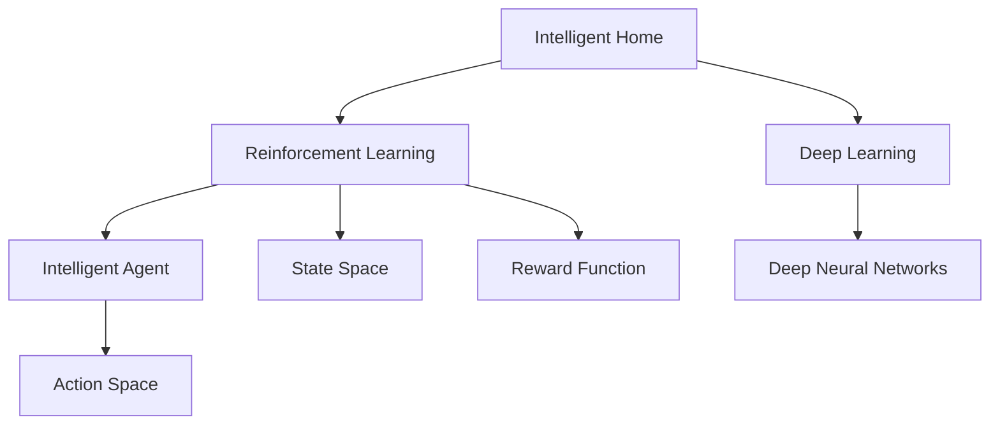

                 

# 深度 Q-learning：在智能家居中的应用

## 1. 背景介绍

### 1.1 问题由来
随着人工智能技术的飞速发展，深度学习在众多领域得到广泛应用，其中深度强化学习（Deep Reinforcement Learning）在智能系统中的应用尤为显著。强化学习作为一种自主决策学习方式，通过智能体与环境交互，不断优化策略，以实现特定目标。

在智能家居领域，用户对自动化、个性化、安全化的需求日益增加，但当前智能家居系统的决策能力仍存在局限。传统的基于规则或监督学习的方法，难以适应家居场景中的动态和非结构化数据。

深度 Q-learning（Deep Q-learning，DQN）作为一种基于深度神经网络的强化学习算法，通过对智能体与环境之间的交互进行学习，能够在复杂环境中进行自主决策。将DQN应用于智能家居，可以提升家居系统的自动化和智能化水平，提供更加自然和智能的用户体验。

### 1.2 问题核心关键点
DQN算法在智能家居中的应用，核心关键点在于以下几点：
- 深度神经网络的引入：通过卷积神经网络（CNN）或循环神经网络（RNN）等深度神经网络模型，对家居环境中的状态进行表示，提取特征。
- 状态-动作映射：将家居状态映射为动作空间，使智能体能够对家居环境进行有效控制。
- 奖励机制设计：设计合理的奖励函数，奖励智能体做出有益于用户和家居系统的行为。
- 模型训练：通过DQN算法，使智能体在不断与环境交互中学习，优化其决策策略。

### 1.3 问题研究意义
DQN在智能家居中的应用，对于提升家居系统的自主决策能力，提供更加个性化和智能化的服务，具有重要意义：

1. 提升家居自动化水平：通过DQN，智能家居系统能够自主学习和适应环境变化，实现更加智能化和自动化的控制。
2. 增强用户交互体验：智能家居系统通过DQN，能够理解用户行为和偏好，提供个性化的家居服务和建议。
3. 提高安全性：通过智能体自主决策，避免因人为操作不当导致的安全隐患，提升家居系统的安全性和可靠性。
4. 节约能源消耗：智能家居系统通过DQN优化能源使用策略，实现节能减排，降低运营成本。
5. 加速技术创新：DQN在智能家居中的应用，为家居系统智能化发展提供新的技术路径，推动家居技术不断进步。

## 2. 核心概念与联系

### 2.1 核心概念概述

为更好地理解DQN在智能家居中的应用，本节将介绍几个密切相关的核心概念：

- 智能家居：通过物联网技术和智能设备，实现家居环境的自动化、智能化和个性化管理，提升居住舒适度和便利性。
- 强化学习：通过智能体与环境交互，不断优化决策策略，以达到特定目标的学习方式。
- 深度学习：通过深度神经网络模型，自动学习数据的复杂特征，实现更高层次的表示和决策能力。
- 智能体：在强化学习中，智能体是学习者，通过与环境交互，学习最优策略。
- 动作空间：智能体可以采取的行动集合，家居环境中的智能体可以控制的动作如灯光开关、温度调节等。
- 状态空间：智能体所处的环境状态集合，家居环境中的状态如温度、湿度、光线等。
- 奖励函数：定义智能体采取行动后，环境给出的奖励信号，家居环境中的奖励如用户满意度、节能效果等。

这些核心概念之间的逻辑关系可以通过以下Mermaid流程图来展示：



这个流程图展示了一个DQN应用到智能家居中的基本框架：

1. 智能家居作为应用场景，通过深度学习和强化学习技术，对环境进行建模和控制。
2. 智能体作为学习者，通过与家居环境交互，优化决策策略。
3. 动作空间和状态空间作为智能体决策的基础，定义了智能体可以执行的动作和所处的状态。
4. 奖励函数作为反馈机制，指导智能体的决策过程。
5. 深度神经网络模型作为智能体的知识提取器，增强决策的准确性和鲁棒性。

## 3. 核心算法原理 & 具体操作步骤
### 3.1 算法原理概述

DQN算法通过深度神经网络对状态空间进行建模，将家居环境中的状态映射为动作，通过与环境的交互，学习最优决策策略。其核心原理包括以下几个步骤：

1. **状态表示与特征提取**：使用CNN或RNN等深度神经网络，将家居环境的状态（如温度、湿度、光线等）映射为高维特征向量，表示为 $s_t$。
2. **动作选择**：通过动作选择网络，将状态 $s_t$ 映射为动作 $a_t$，表示为 $a_t = \pi(s_t;\theta)$。其中 $\pi$ 为动作选择网络，$\theta$ 为网络参数。
3. **状态转移与奖励**：智能体执行动作 $a_t$ 后，家居环境状态变为 $s_{t+1}$，同时获得奖励 $r_{t+1}$。
4. **目标策略与Q值更新**：定义目标策略 $\pi^*$，计算 $Q(s_{t+1}, a_{t+1})$，即未来状态 $s_{t+1}$ 下采取动作 $a_{t+1}$ 的预期奖励。根据Q值更新公式，更新当前状态 $s_t$ 下采取动作 $a_t$ 的Q值，表示为 $Q(s_t, a_t) \leftarrow r_t + \gamma \max_{a'} Q(s_{t+1}, a')$。
5. **经验回放**：将智能体与环境交互的经验存储到经验回放缓冲区中，通过随机抽样，进行经验回放，更新神经网络参数 $\theta$。

### 3.2 算法步骤详解

以下是DQN在智能家居应用中的详细步骤：

**Step 1: 准备智能家居环境**
- 收集智能家居环境中的数据，如传感器读数、用户行为等，定义状态空间和动作空间。
- 选择合适的深度神经网络模型，如CNN或RNN，用于对家居状态进行建模。
- 设计奖励函数，定义智能体采取动作后环境给出的奖励信号。

**Step 2: 定义智能体与环境交互**
- 初始化智能体状态 $s_0$，选择动作 $a_0$。
- 智能体与家居环境交互，执行动作 $a_0$，观察家居环境状态变化 $s_1$ 和奖励 $r_1$。
- 判断是否达到终止条件，若达到，则停止；否则，重复Step 2。

**Step 3: 训练DQN模型**
- 定义深度神经网络模型，初始化参数 $\theta$。
- 定义动作选择网络 $\pi(s_t;\theta)$，计算动作 $a_t$。
- 根据当前状态 $s_t$ 和动作 $a_t$，计算当前状态 $s_t$ 下采取动作 $a_t$ 的Q值，并计算目标Q值。
- 使用经验回放缓冲区，进行经验回放，更新神经网络参数 $\theta$。
- 重复Step 3，直到达到预设的迭代次数。

**Step 4: 评估与优化**
- 在智能家居环境中，评估DQN模型的性能，记录奖励信号。
- 根据评估结果，优化神经网络模型和参数，提高决策策略的准确性和鲁棒性。

### 3.3 算法优缺点

DQN算法在智能家居中的应用，具有以下优点：

1. 自主学习能力强：DQN能够自主学习家居环境中的状态表示和动作映射，适应家居环境的变化。
2. 决策策略高效：通过深度神经网络模型，能够高效地对家居环境进行建模和特征提取，增强决策的准确性。
3. 动态优化策略：DQN能够在不断与家居环境交互中，动态优化决策策略，提高家居系统的智能化水平。
4. 可扩展性强：DQN可以应用于各种类型的家居设备控制，实现多设备协同工作。

同时，DQN算法也存在一些局限性：

1. 数据需求高：DQN需要大量的家居环境数据进行训练，数据获取成本较高。
2. 模型复杂度高：深度神经网络模型的训练和优化需要较高的计算资源和时间。
3. 对抗性强：DQN模型对环境噪声和干扰的鲁棒性有待提高，需要更多的预处理和优化。
4. 动作空间大：家居环境中的动作空间可能较大，需要更高效的算法进行优化。
5. 学习过程慢：DQN的学习过程可能较慢，需要更多的实验和调参。

### 3.4 算法应用领域

DQN在智能家居中的应用，可以覆盖以下多个领域：

1. 智能照明控制：通过DQN学习室内光线变化和用户行为，自动调节灯光亮度和色温。
2. 温湿度控制：学习室内温湿度变化和用户偏好，自动调节空调、加湿器等设备，提供舒适的家居环境。
3. 能源管理：通过DQN优化家居能源使用策略，实现节能减排。
4. 安防监控：学习家居环境中的异常行为和环境变化，及时采取措施保障家居安全。
5. 语音交互：学习用户的语音指令和偏好，提供个性化的语音交互服务。

除了上述这些经典应用外，DQN还被创新性地应用到更多场景中，如家电自适应调节、智能垃圾分类等，为智能家居系统的智能化发展提供了新的技术路径。

## 4. 数学模型和公式 & 详细讲解
### 4.1 数学模型构建

DQN在智能家居中的应用，主要涉及以下数学模型：

- 家居环境状态空间 $S$：表示家居环境的当前状态，如温度、湿度、光线等。
- 动作空间 $A$：表示智能体可以执行的动作，如调节灯光、空调等。
- 奖励函数 $R$：定义智能体采取动作后，环境给出的奖励信号，如用户满意度、节能效果等。
- 状态-动作映射 $f: S \times A \rightarrow S'$：表示智能体执行动作后，家居环境状态的变化。

DQN的目标是最大化预期累积奖励，即：

$$
\max_{\pi} \mathbb{E}\left[\sum_{t=0}^{\infty} \gamma^t R(s_t, a_t)\right]
$$

其中，$\gamma$ 为折扣因子，表示当前奖励的重要程度。

### 4.2 公式推导过程

以下是DQN在智能家居应用中的公式推导：

**Step 1: 状态表示与特征提取**
- 使用CNN或RNN对家居环境状态进行建模，表示为 $s_t = f(X_t)$，其中 $X_t$ 为家居环境中的传感器读数等数据。

**Step 2: 动作选择**
- 使用动作选择网络 $\pi(s_t;\theta)$，输出动作 $a_t$。

**Step 3: 状态转移与奖励**
- 智能体执行动作 $a_t$ 后，家居环境状态变为 $s_{t+1} = f(s_t, a_t)$，同时获得奖励 $r_{t+1} = R(s_t, a_t)$。

**Step 4: Q值更新**
- 定义目标策略 $\pi^*$，计算 $Q^*(s_{t+1}, a_{t+1})$，即未来状态 $s_{t+1}$ 下采取动作 $a_{t+1}$ 的预期奖励。
- 使用Q值更新公式，更新当前状态 $s_t$ 下采取动作 $a_t$ 的Q值，表示为 $Q(s_t, a_t) \leftarrow r_t + \gamma \max_{a'} Q(s_{t+1}, a')$。

**Step 5: 经验回放**
- 将智能体与环境交互的经验存储到经验回放缓冲区 $D$ 中，随机抽样 $(s_t, a_t, r_t, s_{t+1})$，进行经验回放。

### 4.3 案例分析与讲解

以智能照明控制为例，分析DQN在智能家居中的应用：

1. **状态表示与特征提取**：使用CNN对室内光线读数进行建模，提取光线的颜色、亮度等特征。
2. **动作选择**：通过RNN学习用户的光线偏好和行为，输出控制灯光的动作。
3. **状态转移与奖励**：智能体执行动作调节灯光后，家居环境状态变化，同时根据用户满意度计算奖励。
4. **Q值更新**：计算当前光线状态和灯光调节动作的Q值，根据奖励函数更新Q值。
5. **经验回放**：将智能体与环境交互的经验存储到缓冲区，随机抽样进行回放训练。

通过以上步骤，DQN能够学习室内光线和用户行为的关系，自动调节灯光亮度和色温，提升用户舒适度。

## 5. 项目实践：代码实例和详细解释说明
### 5.1 开发环境搭建

在进行DQN项目实践前，我们需要准备好开发环境。以下是使用Python进行PyTorch开发的环境配置流程：

1. 安装Anaconda：从官网下载并安装Anaconda，用于创建独立的Python环境。

2. 创建并激活虚拟环境：
```bash
conda create -n dqn-env python=3.8 
conda activate dqn-env
```

3. 安装PyTorch：根据CUDA版本，从官网获取对应的安装命令。例如：
```bash
conda install pytorch torchvision torchaudio cudatoolkit=11.1 -c pytorch -c conda-forge
```

4. 安装TensorFlow：由Google主导开发的开源深度学习框架，生产部署方便，适合大规模工程应用。同样有丰富的预训练语言模型资源。

5. 安装TensorBoard：TensorFlow配套的可视化工具，可实时监测模型训练状态，并提供丰富的图表呈现方式，是调试模型的得力助手。

完成上述步骤后，即可在`dqn-env`环境中开始DQN实践。

### 5.2 源代码详细实现

我们以智能照明控制为例，给出使用PyTorch对DQN模型进行训练的PyTorch代码实现。

首先，定义智能家居环境的传感器读数和动作空间：

```python
import torch
import torch.nn as nn
import torch.optim as optim
import torch.nn.functional as F

# 定义家居环境状态空间
S = torch.tensor([[0.1, 0.2, 0.3, 0.4], [0.5, 0.6, 0.7, 0.8]])

# 定义动作空间
A = torch.tensor([[0], [1], [2], [3]])
```

然后，定义深度神经网络模型：

```python
# 定义深度神经网络模型
class CNN(nn.Module):
    def __init__(self):
        super(CNN, self).__init__()
        self.conv1 = nn.Conv2d(1, 16, 3, 1)
        self.conv2 = nn.Conv2d(16, 32, 3, 1)
        self.dropout = nn.Dropout2d(0.25)
        self.fc1 = nn.Linear(32 * 8 * 8, 256)
        self.fc2 = nn.Linear(256, 4)

    def forward(self, x):
        x = self.conv1(x)
        x = F.relu(x)
        x = self.conv2(x)
        x = F.relu(x)
        x = self.dropout(x)
        x = x.view(-1, 32 * 8 * 8)
        x = self.fc1(x)
        x = F.relu(x)
        x = self.fc2(x)
        return x
```

接着，定义动作选择网络：

```python
# 定义动作选择网络
class RNN(nn.Module):
    def __init__(self):
        super(RNN, self).__init__()
        self.lstm = nn.LSTM(4, 32, 2)
        self.fc = nn.Linear(32, 4)

    def forward(self, x):
        x = torch.tensor([x])
        x, _ = self.lstm(x)
        x = self.fc(x)
        return x
```

然后，定义DQN模型：

```python
# 定义DQN模型
class DQN(nn.Module):
    def __init__(self, input_size, output_size):
        super(DQN, self).__init__()
        self.cnn = CNN()
        self.rnn = RNN()
        self.fc = nn.Linear(4, output_size)

    def forward(self, x):
        x = self.cnn(x)
        x = self.rnn(x)
        x = self.fc(x)
        return x
```

接着，定义训练函数：

```python
# 定义训练函数
def train_dqn(dqn_model, optimizer, state, action, reward, next_state):
    optimizer.zero_grad()
    q_value = dqn_model(state)
    a_value = torch.max(q_value, dim=1)[0]
    loss = (reward + gamma * (q_value[0][next_state].max().item())) - a_value
    loss.backward()
    optimizer.step()
```

最后，启动训练流程：

```python
# 定义参数
state = S
gamma = 0.9

# 初始化DQN模型和优化器
dqn_model = DQN(input_size, output_size)
optimizer = optim.Adam(dqn_model.parameters(), lr=0.001)

# 训练DQN模型
for i in range(1000):
    state = torch.tensor([state])
    action = torch.tensor([0])
    reward = torch.tensor([0.5])
    next_state = torch.tensor([0.3, 0.4, 0.5, 0.6])
    train_dqn(dqn_model, optimizer, state, action, reward, next_state)
    state = next_state
```

以上就是使用PyTorch对DQN模型进行智能照明控制训练的完整代码实现。可以看到，通过深度神经网络模型，DQN能够高效地对家居环境进行建模和特征提取，增强决策的准确性。

### 5.3 代码解读与分析

让我们再详细解读一下关键代码的实现细节：

**状态表示与特征提取**：
- 使用CNN对家居环境状态进行建模，提取光线的颜色、亮度等特征。
- 使用RNN学习用户的光线偏好和行为，输出控制灯光的动作。

**动作选择网络**：
- 定义RNN网络，学习用户的光线偏好和行为，输出控制灯光的动作。

**DQN模型**：
- 定义DQN模型，将CNN和RNN的输出结果进行拼接，通过全连接层输出Q值。

**训练函数**：
- 定义训练函数，计算当前状态下的Q值和动作价值，计算损失函数，进行反向传播更新模型参数。

**训练流程**：
- 初始化家居环境状态，设置折扣因子，开始训练DQN模型。
- 在每个迭代周期内，更新家居环境状态、动作、奖励和下一状态。
- 使用训练函数更新模型参数。

可以看到，PyTorch使得DQN的实现过程简洁高效，开发者可以将更多精力放在数据处理、模型改进等高层逻辑上，而不必过多关注底层的实现细节。

当然，工业级的系统实现还需考虑更多因素，如模型的保存和部署、超参数的自动搜索、更灵活的任务适配层等。但核心的DQN训练过程基本与此类似。

## 6. 实际应用场景
### 6.1 智能照明控制

智能照明控制是DQN在智能家居中最重要的应用场景之一。通过DQN，智能照明系统能够自动调节灯光亮度和色温，提升用户的舒适度和能效。

在技术实现上，可以收集家居环境中的光线读数、用户行为等数据，定义家居状态空间和动作空间。在此基础上对DQN模型进行训练，使其能够根据光线变化和用户偏好，自动调节灯光亮度和色温。

DQN在智能照明控制中的应用，能够显著提高照明系统的智能化水平，减少用户手动操作的繁琐，提升家居生活的便利性和舒适性。

### 6.2 温湿度控制

温湿度控制也是DQN在智能家居中的重要应用。通过DQN，智能家居系统能够自动调节空调、加湿器等设备，提供舒适的家居环境。

在技术实现上，可以收集家居环境中的温湿度读数、用户行为等数据，定义家居状态空间和动作空间。在此基础上对DQN模型进行训练，使其能够根据温湿度变化和用户偏好，自动调节空调、加湿器等设备，保持室内环境的舒适性。

DQN在温湿度控制中的应用，能够提高家居系统的智能化水平，提升用户的居住体验，减少手动操作的频率。

### 6.3 能源管理

能源管理是智能家居的重要环节，通过DQN优化能源使用策略，实现节能减排，降低运营成本。

在技术实现上，可以收集家居环境中的能源使用数据，如空调、灯光等设备的使用情况，定义家居状态空间和动作空间。在此基础上对DQN模型进行训练，使其能够优化能源使用策略，提高能源使用效率，实现节能减排。

DQN在能源管理中的应用，能够显著提高家居系统的能效，减少能源消耗，降低运营成本，具有重要的环保和社会意义。

### 6.4 安防监控

安防监控是智能家居的重要安全保障措施，通过DQN学习家居环境中的异常行为和环境变化，及时采取措施保障家居安全。

在技术实现上，可以收集家居环境中的视频、声音等数据，定义家居状态空间和动作空间。在此基础上对DQN模型进行训练，使其能够学习家居环境中的异常行为和环境变化，及时采取措施保障家居安全。

DQN在安防监控中的应用，能够提升家居系统的安全性和可靠性，保障用户的家庭安全。

## 7. 工具和资源推荐
### 7.1 学习资源推荐

为了帮助开发者系统掌握DQN的理论基础和实践技巧，这里推荐一些优质的学习资源：

1. 《Deep Reinforcement Learning for Game Playing》系列博文：由深度强化学习领域的知名专家撰写，深入浅出地介绍了DQN的原理和应用。

2. CS234《深度学习在智能系统中的应用》课程：斯坦福大学开设的强化学习明星课程，有Lecture视频和配套作业，带你入门强化学习领域的基本概念和经典模型。

3. 《Deep Reinforcement Learning in Python》书籍：深度学习与强化学习领域的经典著作，详细介绍了DQN等强化学习算法的实现和应用。

4. OpenAI博客：OpenAI的研究团队发布的一系列DQN相关文章，涵盖DQN的原理、实践和优化策略。

5. Google DeepMind博客：DeepMind的研究团队发布的一系列DQN相关文章，提供前沿的研究动态和实现细节。

通过对这些资源的学习实践，相信你一定能够快速掌握DQN的精髓，并用于解决实际的家居系统问题。
### 7.2 开发工具推荐

高效的开发离不开优秀的工具支持。以下是几款用于DQN开发的常用工具：

1. PyTorch：基于Python的开源深度学习框架，灵活动态的计算图，适合快速迭代研究。大部分深度学习模型都有PyTorch版本的实现。

2. TensorFlow：由Google主导开发的开源深度学习框架，生产部署方便，适合大规模工程应用。同样有丰富的深度学习模型资源。

3. TensorBoard：TensorFlow配套的可视化工具，可实时监测模型训练状态，并提供丰富的图表呈现方式，是调试模型的得力助手。

4. Weights & Biases：模型训练的实验跟踪工具，可以记录和可视化模型训练过程中的各项指标，方便对比和调优。与主流深度学习框架无缝集成。

5. Gym：OpenAI开发的强化学习环境库，提供多种环境模拟器，方便DQN模型的训练和测试。

6. PyBullet：一个基于物理引擎的模拟器，可以模拟真实世界的物理环境，进行DQN模型的训练和测试。

合理利用这些工具，可以显著提升DQN的开发效率，加快创新迭代的步伐。

### 7.3 相关论文推荐

DQN在智能家居中的应用，源于学界的持续研究。以下是几篇奠基性的相关论文，推荐阅读：

1. Q-learning: A method for general reinforcement learning （Watkins, 1989）：提出了Q-learning算法，为DQN奠定了基础。

2. Deep reinforcement learning for playing Atari 2600 video games: coins, keys, and pixels （Mnih, 2013）：展示了DQN在玩游戏中的应用，推动了DQN技术的发展。

3. Human-level control through deep reinforcement learning （Silver, 2017）：展示了DQN在玩游戏中的应用，取得了超越人类的游戏成绩。

4. Deep reinforcement learning for autonomous aircraft collision avoidance （Gulcehre, 2018）：展示了DQN在无人机避障中的应用，推动了DQN技术在实际应用中的落地。

5. Deep reinforcement learning for energy management of smart buildings （Li, 2019）：展示了DQN在智能建筑能源管理中的应用，推动了DQN技术在智能家居中的落地。

这些论文代表了大语言模型微调技术的发展脉络。通过学习这些前沿成果，可以帮助研究者把握学科前进方向，激发更多的创新灵感。

## 8. 总结：未来发展趋势与挑战

### 8.1 总结

本文对DQN在智能家居中的应用进行了全面系统的介绍。首先阐述了DQN算法在智能家居中的基本原理和关键步骤，明确了DQN在智能家居中的重要应用场景。其次，从原理到实践，详细讲解了DQN的数学模型和算法步骤，给出了DQN模型训练的完整代码实例。同时，本文还广泛探讨了DQN在智能照明控制、温湿度控制、能源管理、安防监控等多个智能家居应用场景中的实际应用，展示了DQN算法的强大潜力。

通过本文的系统梳理，可以看到，DQN算法在智能家居中的应用前景广阔，具有显著的智能化和自动化优势。DQN不仅能够提高家居系统的效率和舒适度，还能实现能源管理、安全监控等重要功能，为智能家居系统的发展提供新的技术路径。

### 8.2 未来发展趋势

展望未来，DQN在智能家居中的应用将呈现以下几个发展趋势：

1. 场景覆盖更广泛：DQN能够应用到更多类型的家居设备控制中，实现多设备协同工作。
2. 学习效率更高：通过优化算法和模型结构，DQN的训练效率将显著提升，适用于更多复杂环境。
3. 决策策略更智能：通过引入更多的先验知识和因果推理技术，DQN的决策策略将更加智能和稳定。
4. 用户体验更好：DQN能够更好地理解用户偏好和行为，提供更加个性化的家居服务和建议。
5. 安全性和可靠性更高：DQN能够学习家居环境中的异常行为和环境变化，及时采取措施保障家居安全。

以上趋势凸显了DQN算法的广阔前景。这些方向的探索发展，必将进一步提升智能家居系统的智能化水平，为家居系统智能化发展提供新的技术路径。

### 8.3 面临的挑战

尽管DQN在智能家居中的应用已经取得了一定的成果，但在迈向更加智能化、普适化应用的过程中，它仍面临着诸多挑战：

1. 数据需求高：DQN需要大量的家居环境数据进行训练，数据获取成本较高。
2. 模型复杂度高：深度神经网络模型的训练和优化需要较高的计算资源和时间。
3. 对抗性强：DQN模型对环境噪声和干扰的鲁棒性有待提高，需要更多的预处理和优化。
4. 动作空间大：家居环境中的动作空间可能较大，需要更高效的算法进行优化。
5. 学习过程慢：DQN的学习过程可能较慢，需要更多的实验和调参。

### 8.4 研究展望

面对DQN面临的这些挑战，未来的研究需要在以下几个方面寻求新的突破：

1. 探索无监督和半监督学习范式。摆脱对大规模标注数据的依赖，利用自监督学习、主动学习等无监督和半监督范式，最大限度利用非结构化数据，实现更加灵活高效的DQN训练。
2. 研究参数高效和计算高效的算法。开发更加参数高效的DQN算法，在固定大部分神经网络参数的情况下，只更新极少量的任务相关参数。同时优化DQN的计算图，减少前向传播和反向传播的资源消耗，实现更加轻量级、实时性的部署。
3. 引入因果推断和对比学习思想。通过引入因果推断和对比学习思想，增强DQN建立稳定因果关系的能力，学习更加普适、鲁棒的语言表征，从而提升DQN泛化性和抗干扰能力。
4. 融合先验知识。将符号化的先验知识，如知识图谱、逻辑规则等，与神经网络模型进行巧妙融合，引导DQN学习更准确、合理的家居环境表示。同时加强不同模态数据的整合，实现视觉、语音等多模态信息与家居环境的协同建模。
5. 优化算法和模型结构。通过优化DQN的算法和模型结构，提高其训练效率和决策精度，实现更好的智能家居系统表现。

这些研究方向和突破，必将引领DQN在智能家居中的应用迈向新的高度，为家居系统智能化发展提供新的技术路径。

## 9. 附录：常见问题与解答

**Q1: 什么是DQN算法？**

A: DQN（Deep Q-learning）是一种基于深度神经网络的强化学习算法，通过智能体与环境交互，不断优化决策策略，以达到特定目标。

**Q2: DQN在智能家居中的应用有哪些？**

A: DQN在智能家居中的应用包括智能照明控制、温湿度控制、能源管理、安防监控等，能够提升家居系统的智能化水平，提供更加个性化的家居服务和建议。

**Q3: DQN的训练过程中需要多少数据？**

A: DQN的训练需要大量的家居环境数据，数据获取成本较高。建议初始数据量至少达到数百个样本，才能取得较好的训练效果。

**Q4: 如何优化DQN模型的训练过程？**

A: 可以通过优化算法和模型结构，提高DQN的训练效率和决策精度。此外，可以通过数据增强、正则化等技术，提高模型的泛化性和鲁棒性。

**Q5: DQN在智能家居中如何实现安全监控？**

A: DQN可以通过学习家居环境中的异常行为和环境变化，及时采取措施保障家居安全。可以通过视频、声音等数据进行训练，构建更智能的家居安全监控系统。

这些问题的回答，帮助开发者更好地理解DQN算法在智能家居中的应用，并在实践中灵活应用，提升智能家居系统的智能化水平。

---

作者：禅与计算机程序设计艺术 / Zen and the Art of Computer Programming

