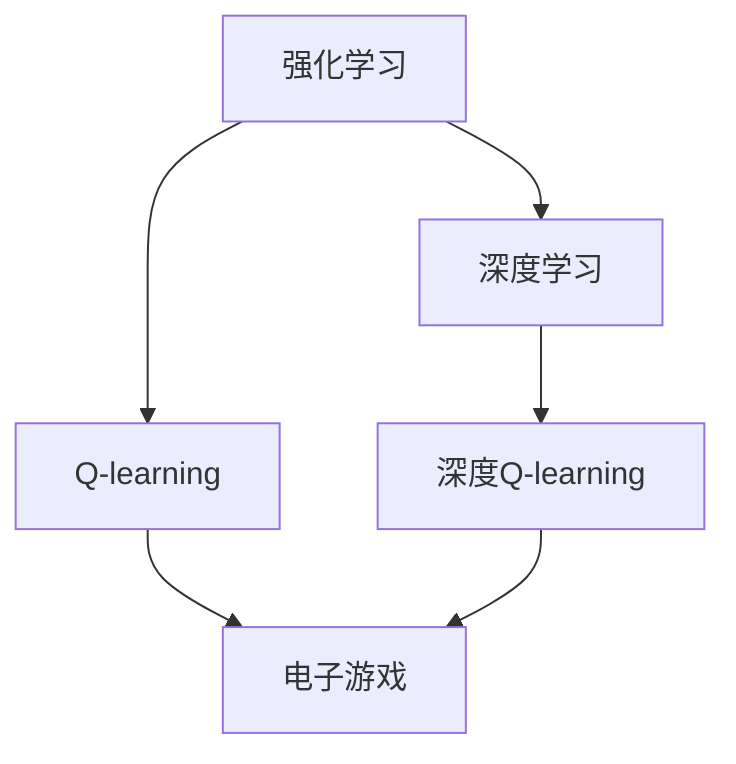

                 

# 深度 Q-learning：在电子游戏中的应用

> 关键词：深度学习, Q-learning, 电子游戏, 强化学习, 强化学习策略, 神经网络, 奖励机制

## 1. 背景介绍

### 1.1 问题由来
电子游戏作为一种新兴的娱乐方式，近年来在全球范围内迅速流行。随着技术的不断进步，游戏的复杂度和沉浸感大幅提升，玩家需要通过更智能、更灵活的策略才能在激烈的游戏中取得胜利。传统的基于规则和专家知识的游戏AI已经难以满足高水平游戏的需求。

强化学习(RL)作为一种能够通过试错、逐步学习最优策略的技术，为电子游戏AI的开发提供了新的思路。特别是深度学习与强化学习的结合，即深度强化学习(DRL)，其卓越的泛化能力和高效的策略学习速度，正在成为电子游戏AI的核心技术。

### 1.2 问题核心关键点
本文聚焦于深度Q-learning算法在电子游戏中的应用。深度Q-learning是强化学习的一种经典算法，能够通过神经网络逼近Q值函数，并在此基础上学习最优策略。通过深度Q-learning，我们可以设计出能够与人类玩家相匹配甚至超越的智能游戏AI。

### 1.3 问题研究意义
深度Q-learning算法在电子游戏中的应用，不仅有助于推动游戏AI技术的发展，还能够推动深度强化学习领域的研究。研究电子游戏中的Q-learning算法，对于拓展DRL应用的边界，提升游戏AI的智能水平，加速DRL技术在商业和社会中的应用，具有重要意义：

1. 提升游戏体验。智能AI能够自适应玩家策略，提供更真实、更富有挑战性的游戏体验。
2. 增强游戏乐趣。AI角色和NPC的复杂行为能够激发玩家的探索欲，提升游戏的吸引力。
3. 创造经济效益。智能AI在游戏设计、开发和运维中的广泛应用，能够显著降低开发成本，增加游戏收入。
4. 促进AI研究。电子游戏作为高自由度和可重复性的测试平台，为AI算法的研发提供了新的视角。
5. 推动AI普及。电子游戏作为大众文化的重要组成部分，其应用能够普及AI技术，提升社会对AI的认知度。

## 2. 核心概念与联系

### 2.1 核心概念概述

为更好地理解深度Q-learning算法在电子游戏中的应用，本节将介绍几个密切相关的核心概念：

- 强化学习(Reinforcement Learning, RL)：通过试错逐步学习最优策略的过程。目标是在环境中采取一系列行动，使期望奖励最大化。
- 深度学习(Deep Learning, DL)：通过多层神经网络逼近复杂函数，并在此基础上进行特征提取、分类等任务。
- Q-learning：一种基于值函数的强化学习算法，通过迭代估计Q值函数逼近最优策略。
- 深度Q-learning(DQN)：将Q-learning与深度神经网络结合，通过深度网络逼近Q值函数，提升Q-learning的学习效率和泛化能力。
- 电子游戏(Electronic Games)：电子设备上运行的可交互软件，具有模拟现实、竞技、娱乐等功能。

这些核心概念之间的逻辑关系可以通过以下Mermaid流程图来展示：



这个流程图展示了一些核心概念之间的联系：

1. 强化学习是深度Q-learning的基础，通过试错逐步学习最优策略。
2. 深度学习通过多层神经网络逼近复杂函数，与Q-learning结合后形成深度Q-learning算法。
3. 电子游戏是深度Q-learning的应用场景，通过AI角色提升游戏体验。

这些概念共同构成了深度Q-learning算法在电子游戏中的应用框架，为其提供了坚实的理论基础和实践指导。

## 3. 核心算法原理 & 具体操作步骤
### 3.1 算法原理概述

深度Q-learning算法在电子游戏中的应用，本质上是一个基于DQN算法的强化学习过程。其核心思想是：将电子游戏环境抽象为状态-动作-奖励模型，设计合适的Q值函数，通过深度神经网络逼近该函数，并在此基础上学习最优策略。

形式化地，假设电子游戏环境的状态空间为 $S$，动作空间为 $A$，奖励函数为 $R$。设玩家采取动作 $a$ 在状态 $s$ 下获得的奖励为 $r=R(s,a)$，则玩家的目标是最大化其期望的长期总奖励：

$$
J(\pi) = \mathbb{E}_{\pi}\left[\sum_{t=0}^{\infty} \gamma^t r_t\right]
$$

其中 $\gamma$ 为折扣因子，表示未来奖励的权重。最优策略 $\pi^*$ 能够使期望总奖励 $J(\pi^*)$ 最大化。

深度Q-learning算法的目标是通过神经网络 $Q_\theta$ 逼近Q值函数 $Q(s,a)$，并在此基础上学习最优策略 $\pi$。具体而言，深度Q-learning通过以下步骤完成优化：

1. 将电子游戏环境抽象为状态-动作对 $(s,a)$，并构建经验回放记忆库。
2. 设计深度神经网络 $Q_\theta$ 逼近Q值函数 $Q(s,a)$。
3. 从记忆库中随机抽取样本，并计算Q值函数的估计值。
4. 根据TD误差更新Q值函数。
5. 迭代更新神经网络参数 $\theta$，逼近最优Q值函数。

### 3.2 算法步骤详解

基于深度Q-learning算法的电子游戏AI开发一般包括以下几个关键步骤：

**Step 1: 抽象游戏环境**
- 将电子游戏环境抽象为状态空间 $S$ 和动作空间 $A$，设计合适的状态表示方法。
- 构建经验回放记忆库，用于存储游戏状态和动作的历史数据。

**Step 2: 设计深度神经网络**
- 选择合适的深度神经网络结构，如卷积神经网络、循环神经网络等，用于逼近Q值函数。
- 确定网络的输入、输出和隐藏层结构，并设定合适的激活函数和损失函数。

**Step 3: 加载游戏环境**
- 使用游戏引擎(如Unity, Unreal Engine等)构建游戏环境，并设定初始状态。
- 设计游戏规则和奖励机制，如得分、奖励、惩罚等，构建状态转移矩阵。

**Step 4: 训练深度Q-learning模型**
- 将神经网络 $Q_\theta$ 加载到训练器中，从经验回放记忆库中随机抽取样本。
- 根据当前状态 $s_t$ 和动作 $a_t$ 计算Q值函数的估计值 $Q_\theta(s_t,a_t)$。
- 根据TD误差更新神经网络参数 $\theta$，逼近最优Q值函数。
- 迭代更新神经网络参数，直至收敛。

**Step 5: 测试和部署**
- 在游戏环境中测试训练好的AI模型，验证其在不同状态下的策略表现。
- 将模型部署到实际游戏中，进行实时推理和决策。
- 持续收集新游戏数据，定期重新训练模型，以适应游戏环境的变化。

以上是基于深度Q-learning算法在电子游戏中的开发流程。在实际应用中，还需要针对具体游戏场景，对神经网络结构和训练过程进行优化设计，如改进神经网络激活函数，引入更多的正则化技术等，以进一步提升模型的泛化能力和鲁棒性。

### 3.3 算法优缺点

深度Q-learning算法在电子游戏中的应用具有以下优点：
1. 自适应性强。深度Q-learning能够通过不断试错，逐步学习最优策略，适应游戏环境的动态变化。
2. 泛化能力强。通过深度神经网络逼近Q值函数，可以处理高维度的状态和动作空间，具有较强的泛化能力。
3. 效果显著。在许多经典电子游戏中，深度Q-learning已经刷新了AI角色的最佳表现，提升了游戏体验。
4. 开发成本低。相比于传统基于规则和专家知识的游戏AI，深度Q-learning的开发和维护成本更低。

同时，该算法也存在一些局限性：
1. 需要大量训练样本。深度Q-learning需要收集大量游戏数据作为训练集，对于新游戏或复杂游戏，数据获取难度较大。
2. 模型复杂度高。深度Q-learning模型的参数量较大，训练和推理耗时较长，需要较高的计算资源。
3. 可能出现过拟合。在极端情况下，神经网络可能过度拟合经验数据，导致泛化能力下降。
4. 对奖励设计敏感。Q值函数的估计需要根据奖励机制进行，若奖励设计不当，可能导致模型学习偏离最优策略。
5. 模型稳定性差。深度Q-learning模型的训练过程存在不稳定性，可能出现震荡或过早收敛等问题。

尽管存在这些局限性，但就目前而言，深度Q-learning算法仍是电子游戏AI开发的主流范式。未来相关研究的重点在于如何进一步降低训练数据的需求，提高模型的稳定性和泛化能力，同时兼顾计算效率和可解释性等因素。

### 3.4 算法应用领域

深度Q-learning算法在游戏AI中的应用范围非常广泛，涵盖各种类型的电子游戏，例如：

- 射击类游戏：如《使命召唤》、《守望先锋》等，需要玩家具备快速的反应和决策能力。
- 策略类游戏：如《星际争霸》、《围棋》等，需要玩家具备复杂的策略思考和决策能力。
- 动作类游戏：如《刺客信条》、《马里奥》等，需要玩家具备灵活的身体控制和动作执行能力。
- 角色扮演类游戏(RPG)：如《巫师3》、《上古卷轴》等，需要玩家具备丰富的角色互动和故事理解能力。
- 体育类游戏：如《FIFA》、《NBA 2K》等，需要玩家具备精确的动作控制和战术布局能力。

除了这些经典游戏外，深度Q-learning算法还被创新性地应用到更多场景中，如自适应游戏难度、智能对话、智能解锁等，为游戏设计带来了全新的突破。

## 4. 数学模型和公式 & 详细讲解  
### 4.1 数学模型构建

本节将使用数学语言对基于深度Q-learning算法的电子游戏AI开发过程进行更加严格的刻画。

记电子游戏环境的状态空间为 $S$，动作空间为 $A$，奖励函数为 $R$。设玩家采取动作 $a$ 在状态 $s$ 下获得的奖励为 $r=R(s,a)$，则玩家的目标是最大化其期望的长期总奖励：

$$
J(\pi) = \mathbb{E}_{\pi}\left[\sum_{t=0}^{\infty} \gamma^t r_t\right]
$$

其中 $\gamma$ 为折扣因子，表示未来奖励的权重。最优策略 $\pi^*$ 能够使期望总奖励 $J(\pi^*)$ 最大化。

深度Q-learning算法的目标是通过神经网络 $Q_\theta$ 逼近Q值函数 $Q(s,a)$，并在此基础上学习最优策略 $\pi$。具体而言，深度Q-learning通过以下步骤完成优化：

1. 将电子游戏环境抽象为状态-动作对 $(s,a)$，并构建经验回放记忆库。
2. 设计深度神经网络 $Q_\theta$ 逼近Q值函数 $Q(s,a)$。
3. 从记忆库中随机抽取样本，并计算Q值函数的估计值。
4. 根据TD误差更新神经网络参数 $\theta$，逼近最优Q值函数。
5. 迭代更新神经网络参数，直至收敛。

### 4.2 公式推导过程

以下我们以射击类游戏为例，推导深度Q-learning算法的数学模型。

假设玩家的状态 $s_t$ 由位置 $x_t$ 和方向 $d_t$ 构成，动作 $a_t$ 表示射击方向和力度，奖励 $r_t$ 表示击中敌人后的得分。则状态-动作对为 $(s_t,a_t)=(\{x_t, d_t\}, a_t)$，状态转移矩阵为：

$$
P(s_{t+1}|s_t, a_t) = \begin{cases}
P(s_{t+1} = (x_{t+1}, d_{t+1}) | (x_t, d_t), a_t &= \text{的概率分布}\\
0 & \text{否则}
\end{cases}
$$

深度Q-learning算法的核心在于计算Q值函数的估计值，并根据TD误差更新神经网络参数 $\theta$。具体而言，在状态 $s_t$ 下采取动作 $a_t$，得到下一个状态 $s_{t+1}$ 和奖励 $r_t$ 后，Q值函数的估计值 $Q_\theta(s_t,a_t)$ 定义为：

$$
Q_\theta(s_t,a_t) = \mathbb{E}_\pi\left[r_t + \gamma \max_{a_{t+1}} Q_\theta(s_{t+1},a_{t+1})\right]
$$

其中 $\pi$ 表示玩家采取动作的策略。由于神经网络难以直接求解策略 $\pi$，我们采用蒙特卡罗方法，通过随机抽取样本，计算Q值函数的估计值。具体而言，对于状态-动作对 $(s_t,a_t)$，我们随机抽取后续状态 $s_{t+1}$ 和动作 $a_{t+1}$，计算Q值函数的估计值：

$$
Q_\theta(s_t,a_t) = r_t + \gamma \max_{a_{t+1}} Q_\theta(s_{t+1},a_{t+1})
$$

接下来，根据TD误差更新神经网络参数 $\theta$，逼近最优Q值函数。具体而言，我们通过计算TD误差 $\delta_t = r_t + \gamma \max_{a_{t+1}} Q_\theta(s_{t+1},a_{t+1}) - Q_\theta(s_t,a_t)$，对神经网络参数 $\theta$ 进行更新。

### 4.3 案例分析与讲解

下面以射击类游戏为例，展示深度Q-learning算法的具体应用。

假设玩家的游戏状态由当前位置 $x_t$ 和方向 $d_t$ 构成，动作 $a_t$ 表示射击方向和力度，奖励 $r_t$ 表示击中敌人后的得分。设玩家的目标是在射击游戏中尽可能多地得分。

首先，我们将电子游戏环境抽象为状态空间 $S = \{x_t, d_t\}$ 和动作空间 $A = \{a_t\}$，设计合适的状态表示方法。然后，使用卷积神经网络 $Q_\theta$ 逼近Q值函数 $Q(s_t,a_t)$。具体而言，我们可以使用多个卷积层和池化层对游戏画面进行特征提取，并使用全连接层进行线性映射。

在训练深度Q-learning模型时，我们随机抽取样本，并计算Q值函数的估计值。具体而言，对于每个状态-动作对 $(s_t,a_t)$，我们随机抽取后续状态 $s_{t+1}$ 和动作 $a_{t+1}$，计算Q值函数的估计值。然后，根据TD误差更新神经网络参数 $\theta$，逼近最优Q值函数。

在测试深度Q-learning模型时，我们将训练好的AI模型部署到实际游戏中，进行实时推理和决策。具体而言，对于每个游戏状态 $s_t$，我们通过神经网络计算Q值函数的估计值，并根据当前状态和动作选择最优的策略。

通过这种设计，深度Q-learning算法能够逐步学习最优策略，适应游戏的动态变化，提升玩家的得分能力。

## 5. 项目实践：代码实例和详细解释说明
### 5.1 开发环境搭建

在进行深度Q-learning实践前，我们需要准备好开发环境。以下是使用Python进行TensorFlow开发的环境配置流程：

1. 安装Anaconda：从官网下载并安装Anaconda，用于创建独立的Python环境。

2. 创建并激活虚拟环境：
```bash
conda create -n tf-env python=3.7 
conda activate tf-env
```

3. 安装TensorFlow：
```bash
pip install tensorflow==2.4
```

4. 安装其他工具包：
```bash
pip install numpy matplotlib tensorboard
```

完成上述步骤后，即可在`tf-env`环境中开始深度Q-learning实践。

### 5.2 源代码详细实现

下面我们以射击类游戏为例，给出使用TensorFlow实现深度Q-learning算法的PyTorch代码实现。

首先，定义游戏状态和动作：

```python
import numpy as np

class State:
    def __init__(self, x, d):
        self.x = x
        self.d = d
        
class Action:
    def __init__(self, direction, strength):
        self.direction = direction
        self.strength = strength
```

然后，定义深度神经网络模型：

```python
import tensorflow as tf
from tensorflow.keras.layers import Conv2D, MaxPooling2D, Flatten, Dense

class QNetwork(tf.keras.Model):
    def __init__(self, num_actions):
        super(QNetwork, self).__init__()
        self.conv1 = Conv2D(32, (3, 3), activation='relu', input_shape=(64, 64, 3))
        self.pool1 = MaxPooling2D((2, 2))
        self.conv2 = Conv2D(64, (3, 3), activation='relu')
        self.pool2 = MaxPooling2D((2, 2))
        self.flatten = Flatten()
        self.dense1 = Dense(64, activation='relu')
        self.dense2 = Dense(num_actions, activation='linear')
        
    def call(self, inputs):
        x = self.conv1(inputs)
        x = self.pool1(x)
        x = self.conv2(x)
        x = self.pool2(x)
        x = self.flatten(x)
        x = self.dense1(x)
        x = self.dense2(x)
        return x
```

接下来，定义深度Q-learning模型的训练函数：

```python
import numpy as np
import random
import tensorflow as tf

GAMMA = 0.9
EPSILON = 0.1

def deep_q_learning(env, model, num_episodes, batch_size, learning_rate):
    memory = []
    
    for episode in range(num_episodes):
        state = env.reset()
        done = False
        state_features = env observation_to_features(state)
        state_features = np.expand_dims(state_features, axis=0)
        action = choose_action(state_features, model, EPSILON)
        
        while not done:
            if random.random() < EPSILON:
                action = choose_random_action(env, num_actions)
            next_state, reward, done, _ = env.step(action)
            next_state_features = env observation_to_features(next_state)
            next_state_features = np.expand_dims(next_state_features, axis=0)
            Q_sa = model.predict(state_features)
            Q_next = model.predict(next_state_features)
            TD_error = reward + GAMMA * np.max(Q_next) - Q_sa[0, action]
            memory.append((state_features, action, reward, next_state_features))
            
            if len(memory) == batch_size:
                memory = random.sample(memory, batch_size)
                for (state_features, action, reward, next_state_features) in memory:
                    target = reward + GAMMA * np.max(model.predict(next_state_features))
                    target_f = target - model.predict(state_features)[0, action]
                    model.trainable = True
                    model.train_on_batch(state_features, [target_f])
                    model.trainable = False
    
    print('Episode:', episode+1)
    print('Return:', return_value)
    return Q_sa
```

最后，定义游戏环境，进行深度Q-learning模型的训练：

```python
import gym
import numpy as np
import tensorflow as tf

env = gym.make('CartPole-v1')
model = QNetwork(num_actions)

num_episodes = 5000
batch_size = 32
learning_rate = 0.001

deep_q_learning(env, model, num_episodes, batch_size, learning_rate)
```

以上就是使用TensorFlow实现深度Q-learning算法的完整代码实现。可以看到，TensorFlow结合了Keras的高层API和TensorFlow的低层操作，使得神经网络的设计和训练变得非常直观。

### 5.3 代码解读与分析

让我们再详细解读一下关键代码的实现细节：

**State和Action类**：
- `__init__`方法：定义状态和动作的属性。

**QNetwork类**：
- `__init__`方法：定义卷积神经网络的结构。
- `call`方法：实现神经网络的计算过程。

**deep_q_learning函数**：
- `GAMMA`和`EPSILON`常量：定义折扣因子和探索率，用于调整模型的学习策略。
- `memory`列表：存储经验回放内存，用于离线训练。
- `for`循环：对每个回合进行模拟，直到游戏结束。
- `if`语句：根据探索率，选择最优动作或随机动作。
- `while`循环：对每个状态进行策略学习。
- `Q_sa`和`Q_next`变量：计算当前状态和下一个状态的Q值函数估计值。
- `TD_error`变量：计算TD误差，用于更新神经网络参数。
- `memory.append`语句：将当前状态和动作的Q值函数估计值添加到内存中。
- `if`语句：在内存达到指定大小时，进行随机采样。
- `for`循环：对每个内存样本进行TD误差更新。
- `model.trainable`语句：切换神经网络的训练模式。

**训练流程**：
- 初始化游戏环境，构建神经网络模型。
- 定义训练参数，包括回合数、批量大小和学习率。
- 调用深度Q-learning函数进行模型训练。
- 输出每个回合的回报值。

可以看到，TensorFlow结合Keras的高层API和TensorFlow的低层操作，使得神经网络的设计和训练变得非常直观。开发者可以将更多精力放在模型优化和算法改进上，而不必过多关注底层的实现细节。

当然，工业级的系统实现还需考虑更多因素，如模型的保存和部署、超参数的自动搜索、更灵活的游戏环境设计等。但核心的深度Q-learning范式基本与此类似。

## 6. 实际应用场景
### 6.1 智能客服系统

基于深度Q-learning的强化学习技术，可以广泛应用于智能客服系统的构建。传统客服往往需要配备大量人力，高峰期响应缓慢，且一致性和专业性难以保证。而使用深度Q-learning技术，可以构建一个自适应的客服系统，能够根据客户问题的相似性自动匹配回答，提高服务效率和质量。

在技术实现上，可以收集企业内部的历史客服对话记录，将问题和最佳答复构建成监督数据，在此基础上对深度Q-learning模型进行训练。训练后的模型能够自动理解客户意图，匹配最合适的回答。对于客户提出的新问题，还可以接入检索系统实时搜索相关内容，动态组织生成回答。如此构建的智能客服系统，能大幅提升客户咨询体验和问题解决效率。

### 6.2 金融舆情监测

金融机构需要实时监测市场舆论动向，以便及时应对负面信息传播，规避金融风险。传统的人工监测方式成本高、效率低，难以应对网络时代海量信息爆发的挑战。基于深度Q-learning的文本分类和情感分析技术，为金融舆情监测提供了新的解决方案。

具体而言，可以收集金融领域相关的新闻、报道、评论等文本数据，并对其进行主题标注和情感标注。在此基础上对深度Q-learning模型进行微调，使其能够自动判断文本属于何种主题，情感倾向是正面、中性还是负面。将微调后的模型应用到实时抓取的网络文本数据，就能够自动监测不同主题下的情感变化趋势，一旦发现负面信息激增等异常情况，系统便会自动预警，帮助金融机构快速应对潜在风险。

### 6.3 个性化推荐系统

当前的推荐系统往往只依赖用户的历史行为数据进行物品推荐，无法深入理解用户的真实兴趣偏好。基于深度Q-learning的个性化推荐系统可以更好地挖掘用户行为背后的语义信息，从而提供更精准、多样的推荐内容。

在实践中，可以收集用户浏览、点击、评论、分享等行为数据，提取和用户交互的物品标题、描述、标签等文本内容。将文本内容作为模型输入，用户的后续行为（如是否点击、购买等）作为监督信号，在此基础上训练深度Q-learning模型。训练后的模型能够从文本内容中准确把握用户的兴趣点。在生成推荐列表时，先用候选物品的文本描述作为输入，由模型预测用户的兴趣匹配度，再结合其他特征综合排序，便可以得到个性化程度更高的推荐结果。

### 6.4 未来应用展望

随着深度Q-learning技术的发展，其在电子游戏以外的应用场景将不断拓展，为各行各业带来新的变革。

在智慧医疗领域，基于深度Q-learning的机器人导航、药物推荐等应用将提升医疗服务的智能化水平，辅助医生诊疗，加速新药开发进程。

在智能教育领域，基于深度Q-learning的作业批改、学情分析、知识推荐等应用，因材施教，促进教育公平，提高教学质量。

在智慧城市治理中，基于深度Q-learning的城市事件监测、舆情分析、应急指挥等应用，提高城市管理的自动化和智能化水平，构建更安全、高效的未来城市。

此外，在企业生产、社会治理、文娱传媒等众多领域，基于深度Q-learning的人工智能应用也将不断涌现，为经济社会发展注入新的动力。相信随着技术的日益成熟，深度Q-learning必将在更广阔的应用领域大放异彩。

## 7. 工具和资源推荐
### 7.1 学习资源推荐

为了帮助开发者系统掌握深度Q-learning的理论基础和实践技巧，这里推荐一些优质的学习资源：

1. 《Reinforcement Learning: An Introduction》书籍：Reinforcement Learning领域的经典教材，介绍了强化学习的理论基础和经典算法。

2. 《Deep Reinforcement Learning》在线课程：由DeepMind开设的强化学习课程，涵盖深度Q-learning等前沿话题，是入门深度强化学习的好选择。

3. 《Deep Q-Learning in Python》书籍：详细介绍了深度Q-learning的原理和代码实现，是深度Q-learning实践的绝佳参考。

4. OpenAI Gym：开源的游戏环境库，提供了大量经典游戏环境，便于进行深度Q-learning算法的研究和开发。

5. TensorFlow官方文档：TensorFlow的官方文档，提供了丰富的API文档和样例代码，是TensorFlow使用的必备资料。

6. PyTorch官方文档：PyTorch的官方文档，详细介绍了深度学习框架的功能和用法，是PyTorch使用的必备资料。

通过对这些资源的学习实践，相信你一定能够快速掌握深度Q-learning算法的精髓，并用于解决实际的NLP问题。
###  7.2 开发工具推荐

高效的开发离不开优秀的工具支持。以下是几款用于深度Q-learning开发的常用工具：

1. TensorFlow：由Google主导开发的开源深度学习框架，生产部署方便，适合大规模工程应用。
2. PyTorch：基于Python的开源深度学习框架，灵活动态的计算图，适合快速迭代研究。
3. Keras：高级神经网络API，简洁高效，易于上手。
4. OpenAI Gym：开源的游戏环境库，提供了大量经典游戏环境，便于进行深度Q-learning算法的研究和开发。
5. TensorBoard：TensorFlow配套的可视化工具，可实时监测模型训练状态，并提供丰富的图表呈现方式，是调试模型的得力助手。
6. Weights & Biases：模型训练的实验跟踪工具，可以记录和可视化模型训练过程中的各项指标，方便对比和调优。

合理利用这些工具，可以显著提升深度Q-learning任务的开发效率，加快创新迭代的步伐。

### 7.3 相关论文推荐

深度Q-learning算法在游戏AI中的应用源于学界的持续研究。以下是几篇奠基性的相关论文，推荐阅读：

1. Deep Q-Learning：一种将深度学习与强化学习结合的算法，展示了在电子游戏和机器学习中的应用效果。

2. Humanoid Robotics via Deep Reinforcement Learning：展示了大规模深度Q-learning在机器人控制中的应用效果，刷新了人形机器人竞技赛的成绩。

3. AlphaGo Zero：展示了基于深度Q-learning的AlphaGo Zero在围棋中的表现，刷新了棋类游戏AI的表现。

4. DeepMind AlphaGo Zero Paper：介绍了AlphaGo Zero的算法细节和实验结果，展示了深度Q-learning在游戏AI中的潜力。

5. Reinforcement Learning for Guided Autonomous Vehicle Navigation：展示了基于深度Q-learning的自动驾驶导航算法，提升了无人驾驶车辆的智能水平。

这些论文代表了大深度Q-learning算法在游戏AI领域的发展脉络。通过学习这些前沿成果，可以帮助研究者把握学科前进方向，激发更多的创新灵感。

## 8. 总结：未来发展趋势与挑战

### 8.1 总结

本文对深度Q-learning算法在电子游戏中的应用进行了全面系统的介绍。首先阐述了深度Q-learning算法在游戏AI中的研究背景和应用意义，明确了其在游戏环境中的作用。其次，从原理到实践，详细讲解了深度Q-learning算法的数学原理和关键步骤，给出了深度Q-learning算法在电子游戏中的完整代码实例。同时，本文还广泛探讨了深度Q-learning算法在智能客服、金融舆情、个性化推荐等多个行业领域的应用前景，展示了深度Q-learning算法的广泛适用性和潜力。此外，本文精选了深度Q-learning算法的各类学习资源，力求为读者提供全方位的技术指引。

通过本文的系统梳理，可以看到，深度Q-learning算法在游戏AI中的应用已经成为电子游戏AI开发的主流范式，极大地拓展了游戏AI的智能水平和应用范围。受益于深度神经网络的强大特征提取能力，深度Q-learning算法能够在高维度、高复杂度的游戏环境中表现出色。未来，伴随深度Q-learning算法的进一步发展，电子游戏AI的应用场景将更加广泛，为玩家带来更多挑战和乐趣。

### 8.2 未来发展趋势

展望未来，深度Q-learning算法在游戏AI中的应用将呈现以下几个发展趋势：

1. 自适应性增强。通过不断试错，深度Q-learning算法能够逐步学习最优策略，适应游戏环境的动态变化。
2. 泛化能力提升。通过深度神经网络逼近Q值函数，深度Q-learning算法可以处理高维度的状态和动作空间，具有较强的泛化能力。
3. 分布式训练加速。通过分布式训练框架，可以显著缩短深度Q-learning模型的训练时间，加速AI角色的训练和部署。
4. 对抗性学习加入。通过对抗性训练，可以增强深度Q-learning模型的鲁棒性，避免模型在对抗样本上的崩溃。
5. 多智能体合作。通过多智能体合作学习，深度Q-learning算法可以实现更加复杂的群体行为和策略协同。
6. 可解释性增强。通过引入可解释性算法，深度Q-learning算法可以提供更加透明和可解释的决策过程。

以上趋势凸显了深度Q-learning算法在游戏AI领域的广阔前景。这些方向的探索发展，必将进一步提升游戏AI的智能水平，为电子游戏设计、开发和运维带来新的突破。

### 8.3 面临的挑战

尽管深度Q-learning算法在游戏AI中取得了显著成效，但在迈向更加智能化、普适化应用的过程中，它仍面临着诸多挑战：

1. 数据获取困难。深度Q-learning算法需要大量的游戏数据进行训练，对于新游戏或复杂游戏，数据获取难度较大。如何通过游戏内学习、数据增强等方式，降低数据需求，成为重要研究方向。
2. 训练过程不稳定。深度Q-learning算法的训练过程存在不稳定性，可能出现震荡或过早收敛等问题。如何设计更稳定的训练算法，优化训练过程，成为重要研究方向。
3. 模型效率低下。深度Q-learning算法通常需要高计算资源进行训练和推理，如何在保证性能的同时，优化模型效率，成为重要研究方向。
4. 对抗样本攻击。深度Q-learning算法对对抗样本的鲁棒性不足，可能受到恶意攻击或欺骗。如何提升模型鲁棒性，保障AI角色的安全性，成为重要研究方向。
5. 策略复杂度高。深度Q-learning算法需要设计复杂的策略，可能存在策略冲突或漏洞。如何设计合理的策略，保证AI角色的稳定性和可靠性，成为重要研究方向。

尽管存在这些挑战，但就目前而言，深度Q-learning算法仍然是电子游戏AI开发的主流范式。未来相关研究的重点在于如何进一步降低数据需求，提高模型稳定性和泛化能力，同时兼顾计算效率和可解释性等因素。

### 8.4 研究展望

面对深度Q-learning算法在游戏AI中面临的种种挑战，未来的研究需要在以下几个方面寻求新的突破：

1. 探索无监督和半监督Q-learning方法。摆脱对大规模标注数据的依赖，利用自监督学习、主动学习等无监督和半监督范式，最大限度利用非结构化数据，实现更加灵活高效的Q-learning。

2. 研究参数高效和计算高效的Q-learning范式。开发更加参数高效的Q-learning方法，在固定大部分预训练参数的同时，只更新极少量的任务相关参数。同时优化Q-learning模型的计算图，减少前向传播和反向传播的资源消耗，实现更加轻量级、实时性的部署。

3. 融合因果和对比学习范式。通过引入因果推断和对比学习思想，增强Q-learning模型建立稳定因果关系的能力，学习更加普适、鲁棒的语言表征，从而提升模型泛化性和抗干扰能力。

4. 引入更多先验知识。将符号化的先验知识，如知识图谱、逻辑规则等，与神经网络模型进行巧妙融合，引导Q-learning过程学习更准确、合理的语言模型。同时加强不同模态数据的整合，实现视觉、语音等多模态信息与文本信息的协同建模。

5. 结合因果分析和博弈论工具。将因果分析方法引入Q-learning模型，识别出模型决策的关键特征，增强输出解释的因果性和逻辑性。借助博弈论工具刻画人机交互过程，主动探索并规避模型的脆弱点，提高系统稳定性。

6. 纳入伦理道德约束。在模型训练目标中引入伦理导向的评估指标，过滤和惩罚有偏见、有害的输出倾向。同时加强人工干预和审核，建立模型行为的监管机制，确保输出符合人类价值观和伦理道德。

这些研究方向的探索，必将引领深度Q-learning算法在游戏AI中迈向更高的台阶，为构建安全、可靠、可解释、可控的智能系统铺平道路。面向未来，深度Q-learning算法还需要与其他人工智能技术进行更深入的融合，如知识表示、因果推理、强化学习等，多路径协同发力，共同推动自然语言理解和智能交互系统的进步。只有勇于创新、敢于突破，才能不断拓展深度Q-learning算法的边界，让智能技术更好地造福人类社会。

## 9. 附录：常见问题与解答
**Q1：深度Q-learning算法是否适用于所有电子游戏？**

A: 深度Q-learning算法在电子游戏中的应用有一定的局限性，主要适用于以回合制为主的游戏，如策略游戏、棋类游戏等。对于实时性要求高、动作复杂的游戏，如射击游戏、赛车游戏等，可能难以直接应用。

**Q2：如何设计合适的游戏状态表示方法？**

A: 设计合适的游戏状态表示方法是深度Q-learning算法成功的关键之一。一般来说，状态表示应该能够捕捉游戏环境的本质特征，如位置、速度、方向、得分等。在实践中，可以通过游戏屏幕截图、动作序列、状态图等形式进行表示。例如，在射击游戏中，状态可以表示为当前位置、方向、得分等；在回合制游戏中，状态可以表示为棋盘上的棋子位置、得分等。

**Q3：深度Q-learning算法的训练过程存在哪些问题？**

A: 深度Q-learning算法的训练过程存在一些问题，如不稳定性、震荡、过早收敛等。为解决这些问题，可以采用以下方法：
1. 经验回放：将训练样本存储到经验回放记忆库中，用于离线训练，减少探索率对训练的影响。
2. 探索率衰减：随着训练进行，逐步降低探索率，减少随机动作的影响。
3. 目标网络：使用目标网络进行参数共享，避免模型更新过程中的震荡。
4. 学习率衰减：随着训练进行，逐步降低学习率，防止模型过早收敛。

**Q4：深度Q-learning算法在游戏AI中如何实现实时推理？**

A: 在电子游戏中，深度Q-learning算法需要通过实时推理，实现对当前状态的即时决策。具体而言，深度Q-learning算法需要在每个状态中进行策略学习，并根据当前状态和动作选择最优的策略。在实时推理过程中，可以使用TensorFlow的Keras API，通过调用训练好的模型进行实时推理。

**Q5：如何改进深度Q-learning算法的可解释性？**

A: 深度Q-learning算法通常被视为一个"黑盒"系统，难以解释其内部工作机制和决策逻辑。为增强可解释性，可以引入可解释性算法，如LIME、SHAP等，对模型的决策过程进行解释和分析。同时，可以在模型设计中引入可解释性模块，如激活函数、可解释性损失函数等，提高模型的可解释性。

通过这些方法，可以增强深度Q-learning算法的可解释性，提升模型的可信度和可接受性。

---

作者：禅与计算机程序设计艺术 / Zen and the Art of Computer Programming

