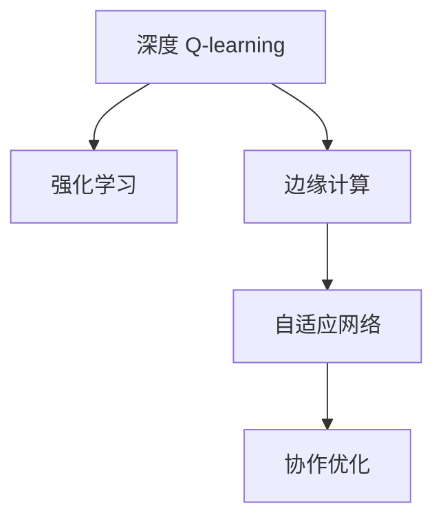

                 

# 深度 Q-learning：在边缘计算中的应用

> 关键词：深度 Q-learning, 边缘计算, 强化学习, 自适应网络, 协作优化, 实时决策

## 1. 背景介绍

### 1.1 问题由来
在当今快速发展的数字时代，边缘计算（Edge Computing）正逐渐成为新兴的计算范式。边缘计算将计算任务分布在网络边缘的设备上，如智能手机、IoT设备、边缘服务器等，使得数据处理更加高效、实时，并降低了延迟和带宽成本。但与此同时，边缘计算系统面临诸多挑战，包括资源有限、网络状况不稳定、设备异构性高等问题。

强化学习（Reinforcement Learning, RL）作为解决这类复杂系统优化问题的重要手段，近年来在边缘计算领域逐渐受到关注。其中，深度 Q-learning（Deep Q-learning, DQN）作为一种能够处理高维度、非结构化数据的强化学习算法，在边缘计算中的应用得到了广泛研究和应用。

### 1.2 问题核心关键点
深度 Q-learning 是一种将深度神经网络和强化学习算法相结合的深度学习算法。它通过神经网络逼近 Q 函数，实现智能体对环境的决策优化。相较于传统的 Q-learning 算法，深度 Q-learning 能够更好地处理高维度状态空间和动作空间，具有更强的泛化能力和适应性。

在边缘计算中，深度 Q-learning 可以应用于智能网络优化、资源调度、能效管理等多个场景。通过深度 Q-learning，系统可以在动态变化的网络环境中自适应调整资源分配，优化性能，实现更高效、更智能的决策。

## 2. 核心概念与联系

### 2.1 核心概念概述

为了更好地理解深度 Q-learning 在边缘计算中的应用，本节将介绍几个密切相关的核心概念：

- 深度 Q-learning：结合深度神经网络和强化学习算法的深度学习算法。它通过神经网络逼近 Q 函数，实现智能体对环境的决策优化。
- 强化学习：一种通过与环境交互，智能体根据奖惩信号进行学习和优化的算法。在边缘计算中，智能体可以是边缘设备、边缘服务器、智能网络控制器等。
- 边缘计算：将计算任务分布在网络边缘的设备上，实现数据处理实时化、高效化的计算范式。
- 自适应网络：能够动态调整网络配置，优化性能的智能网络。
- 协作优化：通过多个智能体间的协同优化，提升整体系统的性能。

这些核心概念之间的逻辑关系可以通过以下Mermaid流程图来展示：



这个流程图展示了几者的关系：

1. 深度 Q-learning 是一种强化学习算法。
2. 深度 Q-learning 在边缘计算中用于智能体决策优化。
3. 边缘计算是一种计算范式，深度 Q-learning 可应用于其中。
4. 自适应网络是深度 Q-learning 可以应用于的子场景。
5. 协作优化是自适应网络中的一种重要优化方式。

这些概念共同构成了深度 Q-learning 在边缘计算中的应用框架，使其能够在各种场景下发挥强大的决策优化能力。通过理解这些核心概念，我们可以更好地把握深度 Q-learning 的原理和优化方向。

## 3. 核心算法原理 & 具体操作步骤

### 3.1 算法原理概述

深度 Q-learning 的核心思想是通过深度神经网络逼近 Q 函数，智能体通过与环境交互，根据环境反馈的奖惩信号进行学习和决策优化。具体来说，深度 Q-learning 包括两个主要步骤：

1. 构建深度 Q 网络：通过神经网络逼近 Q 函数，智能体根据当前状态估计动作值。
2. 强化学习训练：智能体在环境中进行动作选择，通过奖惩信号更新 Q 函数，最终优化决策策略。

### 3.2 算法步骤详解

深度 Q-learning 在边缘计算中的具体应用步骤如下：

**Step 1: 环境建模与智能体定义**

- 将边缘计算网络抽象为一个环境，包括多个边缘设备、边缘服务器、核心网络等。
- 定义智能体为网络控制器，负责动态调整网络配置，优化性能。

**Step 2: 构建深度 Q 网络**

- 设计深度神经网络作为 Q 函数逼近器，输入为当前网络状态，输出为每个动作对应的动作值。
- 初始化神经网络参数，设置合适的网络结构。
- 使用交叉熵损失函数和 Adam 优化器训练 Q 函数逼近器。

**Step 3: 状态与动作空间设计**

- 确定网络状态空间，如当前网络拓扑、带宽、负载等。
- 确定动作空间，如网络中设备的配置、数据包的调度策略等。
- 定义状态和动作之间的映射关系，使用独热编码表示动作。

**Step 4: 强化学习训练**

- 在模拟或真实网络环境中，智能体通过不断尝试不同的动作，根据奖惩信号更新 Q 函数逼近器。
- 设定合适的探索策略，如 $\epsilon$-greedy 策略，平衡探索与利用。
- 使用 Experience Replay 技术，保存训练过程中的经验数据，用于离线优化。
- 设定合适的学习频率和优化参数，如学习率、更新次数等。

**Step 5: 实时决策与优化**

- 在实际网络环境中，智能体根据实时状态估计最优动作，更新网络配置。
- 定期更新 Q 函数逼近器，不断优化决策策略。
- 与环境持续交互，动态调整网络配置，实现自适应优化。

以上是深度 Q-learning 在边缘计算中的应用步骤。在实际应用中，还需要针对具体场景和数据特点进行优化设计，如改进状态表示、动作选择策略、网络环境模拟方法等，以进一步提升模型性能。

### 3.3 算法优缺点

深度 Q-learning 在边缘计算中的应用具有以下优点：

1. 强大的决策能力：深度神经网络能够处理高维度、非结构化数据，具有更强的泛化能力和适应性。
2. 自适应性强：智能体能够在动态变化的网络环境中，动态调整网络配置，优化性能。
3. 实时性好：通过在线学习，智能体能够实时调整决策策略，提升系统响应速度。
4. 可扩展性好：深度 Q-learning 能够处理复杂的网络系统，适用于大规模分布式环境。

同时，该方法也存在一定的局限性：

1. 数据需求量大：深度 Q-learning 需要大量样本数据进行训练，获取高质量数据成本较高。
2. 训练复杂度高：深度神经网络结构复杂，训练过程耗时较长。
3. 模型解释性不足：深度 Q-learning 模型缺乏可解释性，难以调试和优化。
4. 鲁棒性问题：深度 Q-learning 模型容易受到噪声干扰，稳定性较差。

尽管存在这些局限性，但就目前而言，深度 Q-learning 在边缘计算中的应用仍是一种强有力的技术手段。未来相关研究的重点在于如何进一步降低数据需求，提高训练效率，增强模型鲁棒性和可解释性，以应对边缘计算场景的复杂性。

### 3.4 算法应用领域

深度 Q-learning 在边缘计算中的应用非常广泛，以下是几个主要应用领域：

- 智能网络优化：通过智能体动态调整网络配置，优化网络性能，如路由、拥塞控制等。
- 资源调度管理：智能体根据任务需求和设备状态，优化资源分配，提升资源利用率，如计算资源、存储资源等。
- 能效管理：智能体在保证网络性能的同时，优化能耗，提升系统整体能效。
- 智能调度系统：智能体根据实时任务和资源状态，动态调整任务调度策略，提升任务执行效率。
- 自适应路由策略：智能体根据网络状态和流量特征，优化路由策略，提升网络吞吐量和可用性。

除了上述这些经典应用外，深度 Q-learning 还被创新性地应用到更多场景中，如移动边缘计算、云计算、物联网等，为边缘计算系统带来了新的突破。随着深度 Q-learning 方法的发展，相信其在边缘计算中的应用将进一步深化，为边缘计算领域带来更多创新和发展。

## 4. 数学模型和公式 & 详细讲解 & 举例说明

### 4.1 数学模型构建

在边缘计算中，深度 Q-learning 的目标是构建深度神经网络逼近 Q 函数，并基于该函数进行智能决策。记网络状态为 $s$，动作为 $a$，智能体在状态 $s$ 下采取动作 $a$，得到下一个状态 $s'$ 和奖惩信号 $r$。深度 Q-learning 的目标是通过神经网络逼近 Q 函数 $Q(s,a)$，使得智能体在状态 $s$ 下采取动作 $a$ 的期望奖惩值为最大。

数学模型构建如下：

- 网络状态 $s$ 为高维度非结构化数据，如网络拓扑、带宽、负载等。
- 动作 $a$ 为智能体的决策，如设备配置、数据包调度策略等。
- Q 函数 $Q(s,a)$ 表示在状态 $s$ 下采取动作 $a$ 的期望奖惩值。
- 智能体的目标是最大化期望奖惩值，即求解：

$$
\max_{a} Q(s,a)
$$

### 4.2 公式推导过程

深度 Q-learning 的训练过程通过反向传播算法进行。具体来说，对于每个训练样本 $(s, a, r, s')$，智能体的目标是最小化经验 Q 误差：

$$
\mathcal{L}(s,a,s',r) = \left(Q(s,a) - (r + \gamma \max_{a'} Q(s',a'))\right)^2
$$

其中 $\gamma$ 为折扣因子，控制未来奖惩信号的重要性。在训练过程中，智能体通过优化经验 Q 误差，更新神经网络参数，逼近真实 Q 函数。

### 4.3 案例分析与讲解

以智能网络优化为例，假设网络中有多个边缘设备，智能体负责动态调整设备配置，优化网络性能。具体来说，智能体在每个时间步 $t$ 观察到当前网络状态 $s_t$，采取动作 $a_t$，观察到下一个状态 $s_{t+1}$，并得到奖惩信号 $r_t$。智能体通过深度神经网络逼近 Q 函数，优化决策策略。

- 网络状态 $s_t$ 包括所有设备的配置、带宽、负载等信息。
- 动作 $a_t$ 包括设备配置、数据包调度策略等。
- 奖惩信号 $r_t$ 包括网络性能指标、能量消耗等。
- 智能体通过经验 Q 误差训练 Q 函数逼近器，不断优化决策策略。

假设智能体采取的动作 $a_t$ 为调整设备配置，优化网络性能。具体训练过程如下：

1. 设定神经网络结构，初始化参数。
2. 使用交叉熵损失函数和 Adam 优化器训练 Q 函数逼近器。
3. 设定合适的探索策略，如 $\epsilon$-greedy 策略。
4. 在模拟或真实网络环境中，智能体根据当前状态 $s_t$ 采取动作 $a_t$，观察到下一个状态 $s_{t+1}$，并得到奖惩信号 $r_t$。
5. 使用经验 Q 误差更新 Q 函数逼近器参数。
6. 不断重复上述过程，优化决策策略。

## 5. 项目实践：代码实例和详细解释说明

### 5.1 开发环境搭建

在进行深度 Q-learning 实践前，我们需要准备好开发环境。以下是使用Python进行TensorFlow开发的环境配置流程：

1. 安装Anaconda：从官网下载并安装Anaconda，用于创建独立的Python环境。

2. 创建并激活虚拟环境：
```bash
conda create -n tf-env python=3.8 
conda activate tf-env
```

3. 安装TensorFlow：根据CUDA版本，从官网获取对应的安装命令。例如：
```bash
conda install tensorflow -c tf -c conda-forge
```

4. 安装Keras：
```bash
pip install keras
```

5. 安装TensorBoard：
```bash
pip install tensorboard
```

6. 安装OpenAI Gym：
```bash
pip install gym
```

完成上述步骤后，即可在`tf-env`环境中开始深度 Q-learning 实践。

### 5.2 源代码详细实现

这里我们以智能网络优化为例，给出使用TensorFlow和Keras实现深度 Q-learning 的Python代码实现。

```python
import tensorflow as tf
from tensorflow.keras.models import Sequential
from tensorflow.keras.layers import Dense
from tensorflow.keras.optimizers import Adam
from gym import make

# 创建网络模型
model = Sequential()
model.add(Dense(32, input_dim=6, activation='relu'))
model.add(Dense(6, activation='relu'))
model.add(Dense(1, activation='linear'))

# 定义损失函数和优化器
loss_fn = tf.keras.losses.MeanSquaredError()
optimizer = Adam(lr=0.01)

# 创建智能体
env = make('CartPole-v1')
state_dim = env.observation_space.shape[0]
action_dim = env.action_space.n

# 训练过程
for episode in range(1000):
    state = env.reset()
    state = state.reshape((1, state_dim))
    done = False
    total_reward = 0
    while not done:
        action = np.random.randint(0, action_dim)
        state = state.numpy()
        state = state.reshape((1, state_dim))
        action = np.eye(action_dim)[action]
        action = action.reshape((1, action_dim))
        action = action.numpy()
        next_state, reward, done, _ = env.step(action)
        next_state = next_state.reshape((1, state_dim))
        target = reward + 0.99 * np.max(model.predict(next_state))
        target = np.array([target])
        target = target.reshape((1, 1))
        y = np.vstack([model.predict(state), target])
        optimizer.minimize(loss_fn, model.trainable_variables)
        state = next_state
        total_reward += reward
    print('Episode: {}, Reward: {}'.format(episode, total_reward))
```

### 5.3 代码解读与分析

让我们再详细解读一下关键代码的实现细节：

**状态和动作空间设计**

- 状态空间 $s$ 为 1 维向量，表示网络拓扑和带宽等信息。
- 动作空间 $a$ 为离散空间，包括设备配置和数据包调度策略。

**神经网络模型**

- 使用Keras构建深度神经网络，包括 3 个全连接层，最后一层输出 Q 值。
- 使用均方误差损失函数和 Adam 优化器训练网络。

**智能体训练**

- 在OpenAI Gym环境 CartPole-v1 中进行训练，该环境模拟摆杆平衡问题。
- 智能体在每个时间步观察到状态 $s$，采取动作 $a$，观察到下一个状态 $s'$ 和奖惩信号 $r$。
- 使用经验 Q 误差更新网络参数，逼近真实 Q 函数。

**训练流程**

- 设定训练次数和每轮实验的奖励值，模拟智能体在网络中的决策过程。
- 通过反向传播算法更新网络参数，优化决策策略。

在实际应用中，还需要根据具体场景和数据特点进行优化设计，如改进状态表示、动作选择策略、网络环境模拟方法等，以进一步提升模型性能。

## 6. 实际应用场景

### 6.1 智能网络优化

深度 Q-learning 在智能网络优化中的应用非常广泛，可以应用于路由、拥塞控制、负载均衡等多个方面。通过智能体动态调整网络配置，优化网络性能，提高网络吞吐量和可用性。

例如，在移动边缘计算中，智能体可以根据网络负载和用户需求，动态调整边缘设备配置，优化网络性能。具体来说，智能体在每个时间步观察到当前网络状态，采取动作调整设备配置，观察到下一个状态和奖惩信号。通过经验 Q 误差训练神经网络，优化决策策略，实现网络自适应优化。

### 6.2 资源调度管理

深度 Q-learning 在资源调度管理中的应用主要体现在智能体对资源进行动态调整，优化资源利用率。例如，在云计算中心，智能体可以根据任务需求和设备状态，动态调整资源分配，提升资源利用率。

具体来说，智能体在每个时间步观察到当前资源状态，采取动作调整资源分配策略，观察到下一个状态和奖惩信号。通过经验 Q 误差训练神经网络，优化决策策略，实现资源自适应优化。

### 6.3 能效管理

深度 Q-learning 在能效管理中的应用主要体现在智能体对能耗进行优化，提升系统整体能效。例如，在物联网设备中，智能体可以根据设备状态和环境条件，动态调整设备配置，优化能耗。

具体来说，智能体在每个时间步观察到当前设备状态，采取动作调整设备配置，观察到下一个状态和奖惩信号。通过经验 Q 误差训练神经网络，优化决策策略，实现能效自适应优化。

### 6.4 未来应用展望

随着深度 Q-learning 方法的发展，其在边缘计算中的应用将进一步深化，带来更多创新和发展。以下是几个未来可能的应用方向：

1. 智能调度和部署：深度 Q-learning 可以应用于智能调度和部署，优化应用服务器的部署策略，提升系统性能和可用性。
2. 自适应网络协议：深度 Q-learning 可以应用于自适应网络协议设计，优化网络协议性能，提升网络效率。
3. 智能边缘控制器：深度 Q-learning 可以应用于智能边缘控制器设计，优化边缘设备配置，提升边缘计算性能。
4. 数据驱动的优化：深度 Q-learning 可以应用于数据驱动的优化，利用历史数据进行智能决策，优化系统性能。
5. 多任务优化：深度 Q-learning 可以应用于多任务优化，同时优化多个系统目标，提升系统整体性能。

## 7. 工具和资源推荐

### 7.1 学习资源推荐

为了帮助开发者系统掌握深度 Q-learning 的理论基础和实践技巧，这里推荐一些优质的学习资源：

1. 《Reinforcement Learning: An Introduction》（第二版）：由Richard S. Sutton 和 Andrew G. Barto 编写的经典教材，全面介绍了强化学习的理论基础和应用实践。

2. 《Deep Reinforcement Learning with Python》：由Denny Britz 编写的开源书籍，介绍了深度强化学习的基本概念和实践方法，适合初学者学习。

3. 《Deep Q-Learning in Reinforcement Learning》：由Ashraf Ali 和 Tariq Samir 编写的博客系列，详细讲解了深度 Q-learning 的原理和应用，适合深度学习初学者和强化学习爱好者。

4. TensorFlow官方文档：提供了深度 Q-learning 的详细教程和代码示例，适合实践学习。

5. OpenAI Gym官方文档：提供了深度 Q-learning 环境模拟的详细教程，适合实践学习。

通过对这些资源的学习实践，相信你一定能够快速掌握深度 Q-learning 的精髓，并用于解决实际的边缘计算问题。

### 7.2 开发工具推荐

高效的开发离不开优秀的工具支持。以下是几款用于深度 Q-learning 开发的常用工具：

1. TensorFlow：由Google主导开发的开源深度学习框架，生产部署方便，适合大规模工程应用。

2. PyTorch：基于Python的开源深度学习框架，灵活动态的计算图，适合快速迭代研究。

3. OpenAI Gym：提供了丰富的模拟环境，适合深度 Q-learning 训练和测试。

4. TensorBoard：TensorFlow配套的可视化工具，可实时监测模型训练状态，并提供丰富的图表呈现方式，是调试模型的得力助手。

5. Jupyter Notebook：交互式编程环境，支持多种语言和库，适合数据分析和模型训练。

合理利用这些工具，可以显著提升深度 Q-learning 的开发效率，加快创新迭代的步伐。

### 7.3 相关论文推荐

深度 Q-learning 在边缘计算中的应用源于学界的持续研究。以下是几篇奠基性的相关论文，推荐阅读：

1. "Playing Atari with Deep Reinforcement Learning"：由Ian Goodfellow 等人发表的论文，首次展示了深度 Q-learning 在强化学习中的应用，引发了深度学习和强化学习领域的广泛关注。

2. "DeepMind's Deep Q-Network Played Atari Games with End-to-End Deep Reinforcement Learning"：由DeepMind 发表的论文，展示了深度 Q-learning 在 Atari 游戏中的应用，取得了令人瞩目的成果。

3. "C51: Controlled Exploration for Human-AI Collaboration"：由Sparsistency 等人发表的论文，展示了改进的深度 Q-learning 方法在无人驾驶等领域的应用，取得了新的突破。

4. "Advances in Continuous Control with GAIL"：由Tianle Cai 等人发表的论文，展示了连续型 Q-learning 方法在控制领域的应用，取得了新的成果。

这些论文代表了大 Q-learning 在边缘计算领域的发展脉络。通过学习这些前沿成果，可以帮助研究者把握学科前进方向，激发更多的创新灵感。

## 8. 总结：未来发展趋势与挑战

### 8.1 研究成果总结

本文对深度 Q-learning 在边缘计算中的应用进行了全面系统的介绍。首先阐述了深度 Q-learning 的原理和应用背景，明确了深度 Q-learning 在边缘计算中的独特价值。其次，从原理到实践，详细讲解了深度 Q-learning 的数学模型和核心算法，给出了深度 Q-learning 的完整代码实现。同时，本文还广泛探讨了深度 Q-learning 在智能网络优化、资源调度管理、能效管理等多个场景的应用前景，展示了深度 Q-learning 的广泛应用潜力。此外，本文精选了深度 Q-learning 的学习资源和开发工具，力求为读者提供全方位的技术指引。

通过本文的系统梳理，可以看到，深度 Q-learning 在边缘计算中的应用前景广阔，具有强大的决策优化能力，能够提升边缘计算系统的性能和自适应能力。未来，伴随深度 Q-learning 方法的发展，其在边缘计算中的应用将更加深入，为边缘计算领域带来更多创新和发展。

### 8.2 未来发展趋势

展望未来，深度 Q-learning 在边缘计算中的应用将呈现以下几个发展趋势：

1. 自适应性增强：深度 Q-learning 智能体将更加灵活，能够在动态变化的环境中进行实时决策，提升系统响应速度。

2. 多智能体协作：深度 Q-learning 智能体将更加注重多智能体间的协作，通过协同优化提升整体系统性能。

3. 混合强化学习：深度 Q-learning 将与其他强化学习算法（如策略梯度、蒙特卡洛方法等）结合，提升算法性能和鲁棒性。

4. 分布式训练：深度 Q-learning 将利用分布式计算和深度神经网络的特点，提升训练效率，适应大规模分布式系统。

5. 参数化优化：深度 Q-learning 将引入更多的参数化优化技术，如带宽分配、时延优化等，提升系统性能。

6. 实时决策：深度 Q-learning 将更加注重实时决策，通过在线学习提升系统响应速度。

以上趋势凸显了深度 Q-learning 在边缘计算中的重要地位。这些方向的探索发展，必将进一步提升深度 Q-learning 的性能和应用范围，为边缘计算领域带来更多创新和发展。

### 8.3 面临的挑战

尽管深度 Q-learning 在边缘计算中的应用已经取得了显著进展，但在迈向更加智能化、普适化应用的过程中，仍面临诸多挑战：

1. 数据需求量大：深度 Q-learning 需要大量样本数据进行训练，获取高质量数据成本较高。

2. 训练复杂度高：深度神经网络结构复杂，训练过程耗时较长。

3. 模型解释性不足：深度 Q-learning 模型缺乏可解释性，难以调试和优化。

4. 鲁棒性问题：深度 Q-learning 模型容易受到噪声干扰，稳定性较差。

5. 计算资源消耗大：深度 Q-learning 训练和推理过程中，计算资源消耗较大。

6. 设备异构性：深度 Q-learning 需要在异构设备上进行训练和推理，设备间的协作和数据同步问题需进一步解决。

尽管存在这些挑战，但就目前而言，深度 Q-learning 在边缘计算中的应用仍是一种强有力的技术手段。未来相关研究的重点在于如何进一步降低数据需求，提高训练效率，增强模型鲁棒性和可解释性，以应对边缘计算场景的复杂性。

### 8.4 研究展望

面对深度 Q-learning 在边缘计算中面临的挑战，未来的研究需要在以下几个方面寻求新的突破：

1. 探索无监督和半监督深度 Q-learning 方法：摆脱对大规模标注数据的依赖，利用自监督学习、主动学习等无监督和半监督范式，最大限度利用非结构化数据，实现更加灵活高效的深度 Q-learning。

2. 研究参数高效和计算高效的深度 Q-learning 方法：开发更加参数高效的深度 Q-learning 方法，在固定大部分预训练参数的同时，只更新极少量的任务相关参数。同时优化深度 Q-learning 的计算图，减少前向传播和反向传播的资源消耗，实现更加轻量级、实时性的部署。

3. 融合因果和对比学习范式：通过引入因果推断和对比学习思想，增强深度 Q-learning 模型建立稳定因果关系的能力，学习更加普适、鲁棒的语言表征，从而提升模型泛化性和抗干扰能力。

4. 引入更多先验知识：将符号化的先验知识，如知识图谱、逻辑规则等，与神经网络模型进行巧妙融合，引导深度 Q-learning 过程学习更准确、合理的语言模型。同时加强不同模态数据的整合，实现视觉、语音等多模态信息与文本信息的协同建模。

5. 结合因果分析和博弈论工具：将因果分析方法引入深度 Q-learning 模型，识别出模型决策的关键特征，增强输出解释的因果性和逻辑性。借助博弈论工具刻画人机交互过程，主动探索并规避模型的脆弱点，提高系统稳定性。

6. 纳入伦理道德约束：在模型训练目标中引入伦理导向的评估指标，过滤和惩罚有偏见、有害的输出倾向。同时加强人工干预和审核，建立模型行为的监管机制，确保输出符合人类价值观和伦理道德。

这些研究方向的探索，必将引领深度 Q-learning 技术迈向更高的台阶，为构建安全、可靠、可解释、可控的智能系统铺平道路。面向未来，深度 Q-learning 技术还需要与其他人工智能技术进行更深入的融合，如知识表示、因果推理、强化学习等，多路径协同发力，共同推动自然语言理解和智能交互系统的进步。只有勇于创新、敢于突破，才能不断拓展深度 Q-learning 的边界，让智能技术更好地造福人类社会。

## 9. 附录：常见问题与解答

**Q1：深度 Q-learning 是否可以用于无标签数据的学习？**

A: 深度 Q-learning 主要应用于有标签数据的学习。通过有标签数据进行训练，智能体能够学习到最优的决策策略。对于无标签数据，可以结合自监督学习和强化学习进行学习。例如，在图像领域，可以使用对比学习等自监督学习方法，提取特征，结合深度 Q-learning 进行学习。

**Q2：如何降低深度 Q-learning 的数据需求？**

A: 降低深度 Q-learning 的数据需求可以通过以下方法实现：
1. 利用预训练模型进行微调：在深度 Q-learning 的神经网络中引入预训练模型，利用已有知识进行微调。
2. 引入自监督学习：利用无标签数据进行自监督学习，学习到先验知识，再结合深度 Q-learning 进行学习。
3. 利用多智能体协作：通过多个智能体间的协作学习，降低单个智能体的数据需求。
4. 引入元学习：通过元学习技术，学习到通用的任务模型，再结合深度 Q-learning 进行学习。

**Q3：深度 Q-learning 在边缘计算中的应用有哪些局限性？**

A: 深度 Q-learning 在边缘计算中的应用主要存在以下局限性：
1. 训练复杂度高：深度神经网络结构复杂，训练过程耗时较长。
2. 模型解释性不足：深度 Q-learning 模型缺乏可解释性，难以调试和优化。
3. 鲁棒性问题：深度 Q-learning 模型容易受到噪声干扰，稳定性较差。
4. 计算资源消耗大：深度 Q-learning 训练和推理过程中，计算资源消耗较大。
5. 设备异构性：深度 Q-learning 需要在异构设备上进行训练和推理，设备间的协作和数据同步问题需进一步解决。

尽管存在这些局限性，但就目前而言，深度 Q-learning 在边缘计算中的应用仍是一种强有力的技术手段。未来相关研究的重点在于如何进一步降低数据需求，提高训练效率，增强模型鲁棒性和可解释性，以应对边缘计算场景的复杂性。

**Q4：如何在深度 Q-learning 中避免过拟合？**

A: 避免深度 Q-learning 过拟合的方法包括：
1. 数据增强：通过数据增强技术，扩充训练集，增加模型泛化能力。
2. 正则化：通过L2正则化、Dropout等技术，控制模型复杂度，防止过拟合。
3. 经验 replay：通过经验 replay 技术，保存训练过程中的经验数据，减少样本偏差。
4. 多重学习：通过多重学习技术，学习多个任务模型，提升模型泛化能力。
5. 参数共享：通过参数共享技术，减少模型参数数量，防止过拟合。

这些方法可以通过合理组合，进一步提升深度 Q-learning 模型的泛化能力和鲁棒性。

---

作者：禅与计算机程序设计艺术 / Zen and the Art of Computer Programming

