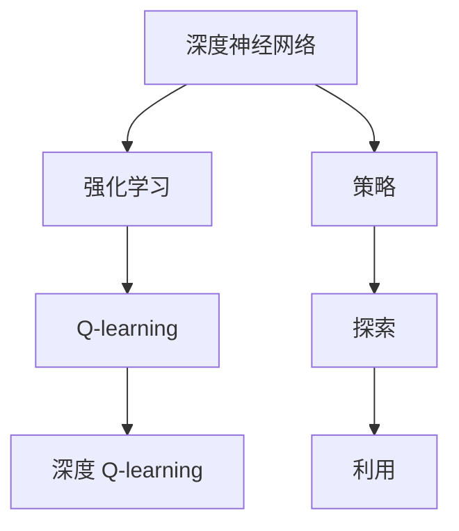

                 

## 1. 背景介绍

### 1.1 问题由来

深度学习和强化学习是当前AI研究的两大热门方向。深度学习擅长从大量标注数据中学习模式，实现高效的图像、语音和自然语言处理等任务。而强化学习则通过试错学习，在无标注数据的情况下，让智能体在环境中通过不断试错，逐步学会最优策略，进而完成各种决策和控制任务。

然而，深度学习和强化学习虽各有所长，但各有局限。深度学习需要大量标注数据，且学习过程高度依赖于人工干预。而强化学习则面临“探索与利用”的困境：如何在探索未知状态的同时，利用已知信息实现最优策略，是强化学习中的一个核心问题。

近年来，研究者开始探索将深度学习和强化学习结合起来，希望取长补短，拓展二者在各自领域的优势。其中，深度 Q-learning 就是这种结合的典型方法。

### 1.2 问题核心关键点

深度 Q-learning 将深度神经网络和强化学习的 Q-learning 方法结合起来，通过深度神经网络来逼近 Q-value，实现策略优化。其主要思想是，通过深度神经网络对每个状态-动作对的 Q-value 进行估计，然后利用 Q-learning 的策略优化公式，调整神经网络的参数，从而实现对环境的最优策略。

该方法在理论上结合了深度学习和强化学习的优点，但在实际应用中也面临一些挑战。如何设计神经网络的架构，避免过拟合，以及如何与环境进行交互，保证学习效率和稳定性，是需要深入研究的课题。

### 1.3 问题研究意义

深度 Q-learning 的提出，拓展了强化学习的应用场景，使其能够处理更复杂、更大规模的决策和控制问题。在自动驾驶、机器人控制、游戏AI等领域，深度 Q-learning 已经展示了强大的应用潜力。

此外，深度 Q-learning 也为深度学习的探索提供了一个新的思路。通过结合强化学习的探索能力，深度 Q-learning 可以引导深度网络在更广泛的数据空间中学习，避免陷入局部最优。这种结合方式，有望在未来推动深度学习领域的新一轮技术突破。

## 2. 核心概念与联系

### 2.1 核心概念概述

为了更好地理解深度 Q-learning 方法，本节将介绍几个关键概念：

- **深度神经网络(Deep Neural Network, DNN)**：一种多层次的非线性模型，通过学习大量参数，实现对复杂模式的逼近。
- **强化学习(Reinforcement Learning, RL)**：智能体在与环境交互的过程中，通过观察、决策和反馈，逐步学会最优策略的过程。
- **Q-learning**：一种基于值函数的强化学习算法，通过估计每个状态-动作对的 Q-value，指导智能体采取最优动作。
- **深度 Q-learning**：结合深度神经网络和强化学习的 Q-learning 方法，通过神经网络逼近 Q-value，实现策略优化。
- **策略(Strategy)**：智能体在特定状态下的决策规则，用于指导其行为。
- **探索(Exploration)**：智能体在未知状态下进行随机决策，以探索更多环境信息的过程。
- **利用(Exploitation)**：智能体在已知状态下采取最优动作，以利用已有信息实现最优策略。

这些概念之间的逻辑关系可以通过以下 Mermaid 流程图来展示：



这个流程图展示了几者之间的联系：

1. 深度神经网络作为强化学习的工具，通过学习函数逼近 Q-value。
2. Q-learning 是强化学习的一种方法，通过估计 Q-value 指导智能体决策。
3. 深度 Q-learning 是结合深度神经网络和 Q-learning 的强化学习算法。
4. 策略用于指导智能体的行为，探索用于发现未知状态，利用用于实现最优策略。

## 3. 核心算法原理 & 具体操作步骤

### 3.1 算法原理概述

深度 Q-learning 的算法原理如下：

1. 使用深度神经网络 $Q_\theta(s,a)$ 对每个状态-动作对的 Q-value 进行估计。
2. 使用 Q-learning 的策略优化公式，更新神经网络的参数 $\theta$，使得：

$$
Q_\theta(s,a) \rightarrow Q_\theta(s,a) + \alpha(r + \gamma \max_a Q_\theta(s',a') - Q_\theta(s,a))
$$

其中 $s$ 为当前状态，$a$ 为当前动作，$r$ 为当前状态下的即时奖励，$s'$ 为下一个状态，$a'$ 为下一个状态下的动作，$\alpha$ 为学习率，$\gamma$ 为折扣因子。

该公式的含义是，智能体通过观察当前状态和动作，获得即时奖励 $r$，然后根据下一个状态 $s'$ 和动作 $a'$ 的 Q-value 进行策略优化。

### 3.2 算法步骤详解

深度 Q-learning 的具体操作步骤如下：

1. **环境设计**：首先，需要设计合适的环境，以模拟智能体的决策过程。环境需要定义状态空间、动作空间、奖励函数等关键参数，以便神经网络能够对 Q-value 进行估计。

2. **神经网络设计**：选择合适的深度神经网络模型，如卷积神经网络(CNN)、递归神经网络(RNN)、深度置信网络(DBN)等。需要考虑网络的深度、宽度、激活函数等超参数，以适应特定任务的要求。

3. **训练数据生成**：通过与环境的交互，生成一批批的状态-动作-奖励数据。这些数据将用于训练深度神经网络，使其能够逼近 Q-value。

4. **模型训练**：使用反向传播算法，根据 Q-learning 的策略优化公式，更新神经网络的参数 $\theta$。

5. **策略优化**：使用训练好的神经网络 $Q_\theta$ 作为策略，对智能体进行控制。根据当前状态 $s$，智能体选择动作 $a$，以最大化 Q-value。

6. **模型评估**：在测试集上评估智能体的性能，计算各项指标，如累计奖励、策略稳定性等。

### 3.3 算法优缺点

深度 Q-learning 方法具有以下优点：

- **结合深度学习和强化学习的优势**：通过深度神经网络逼近 Q-value，充分发挥深度学习对复杂模式的处理能力和强化学习的探索能力。
- **泛化能力强**：深度 Q-learning 可以处理更大规模、更复杂的问题，具有较强的泛化能力。
- **自适应性高**：通过不断与环境交互，深度 Q-learning 可以自适应地调整策略，适应不同的环境变化。

然而，该方法也存在一些缺点：

- **训练时间长**：深度 Q-learning 需要大量训练数据和计算资源，训练时间较长。
- **过拟合风险**：由于神经网络具有较多的参数，容易过拟合。
- **环境依赖性强**：环境设计不当，可能影响智能体的学习效果。
- **策略不稳定**：由于探索与利用的平衡问题，深度 Q-learning 在特定情况下，策略可能不够稳定。

### 3.4 算法应用领域

深度 Q-learning 已经在多个领域得到了应用，包括自动驾驶、机器人控制、游戏AI等。

在自动驾驶中，深度 Q-learning 可以用于车辆决策规划，通过学习驾驶策略，实现最优的避障、加速、变道等操作。在机器人控制中，深度 Q-learning 可以用于路径规划和任务执行，通过与环境的交互，学习最优的移动策略和任务执行计划。在游戏AI中，深度 Q-learning 可以用于玩家行为预测和策略优化，通过学习游戏规则和玩家反应，实现最优的策略选择。

## 4. 数学模型和公式 & 详细讲解 & 举例说明

### 4.1 数学模型构建

深度 Q-learning 的数学模型可以表示为：

- **状态表示**：使用向量 $\mathbf{s}$ 表示当前状态。
- **动作表示**：使用向量 $\mathbf{a}$ 表示当前动作。
- **奖励函数**：使用函数 $R(\mathbf{s},\mathbf{a})$ 表示当前状态和动作的即时奖励。
- **下一个状态表示**：使用向量 $\mathbf{s'}$ 表示下一个状态。
- **下一个动作表示**：使用向量 $\mathbf{a'}$ 表示下一个动作。
- **策略**：使用函数 $\pi_\theta(\mathbf{s},\mathbf{a})$ 表示在当前状态下，选择动作的概率分布。

**目标函数**：

$$
J(\theta) = \mathbb{E}_\pi\left[\sum_{t=0}^{T-1} R(\mathbf{s}_t,\mathbf{a}_t) + \gamma \max_{\mathbf{a}_{t+1}} Q_\theta(\mathbf{s}_{t+1},\mathbf{a}_{t+1}) \right]
$$

其中，$\mathbb{E}_\pi$ 表示在策略 $\pi$ 下求期望，$T$ 为最大时间步数。

**优化目标**：

$$
\theta^* = \mathop{\arg\min}_{\theta} J(\theta)
$$

### 4.2 公式推导过程

深度 Q-learning 的公式推导如下：

**目标函数导数**：

$$
\frac{\partial J(\theta)}{\partial \theta} = \mathbb{E}_\pi\left[\sum_{t=0}^{T-1} \nabla_\theta Q_\theta(\mathbf{s}_t,\mathbf{a}_t) + \gamma \nabla_\theta Q_\theta(\mathbf{s}_{t+1},\mathbf{a}_{t+1}) \right]
$$

**优化目标导数**：

$$
\nabla_\theta J(\theta) = \frac{\partial J(\theta)}{\partial \theta}
$$

**Q-value 估计**：

$$
Q_\theta(\mathbf{s},\mathbf{a}) = \mathbb{E}_{\mathbf{s'} \sim p} [R(\mathbf{s},\mathbf{a}) + \gamma \max_{\mathbf{a'}} Q_\theta(\mathbf{s'},\mathbf{a'})]
$$

其中，$p$ 为状态转移概率。

**策略优化**：

$$
\pi_\theta(\mathbf{s},\mathbf{a}) = \frac{\exp(Q_\theta(\mathbf{s},\mathbf{a}))}{\sum_{\mathbf{a}} \exp(Q_\theta(\mathbf{s},\mathbf{a}))}
$$

其中，$\exp$ 表示指数函数。

### 4.3 案例分析与讲解

以游戏AI中的 Pong 游戏为例，解释深度 Q-learning 的应用过程：

1. **环境设计**：Pong 游戏有两个玩家，一个球和一个拍子，玩家的目标是将球打到对方区域，得分。设计状态空间为 $\mathbf{s} = (x_p, y_p, x_b, y_b, x_l, y_l, x_r, y_r)$，其中 $x_p, y_p$ 表示玩家位置，$x_b, y_b$ 表示球位置，$x_l, y_l$ 和 $x_r, y_r$ 表示左右区域的边界位置。

2. **神经网络设计**：使用卷积神经网络 CNN 作为深度 Q-learning 的策略网络。网络的输入为 $\mathbf{s}$，输出为 $\mathbf{a} = (u,v)$，表示玩家拍子的上下移动距离。

3. **训练数据生成**：通过与 Pong 游戏的交互，生成一批批的状态-动作-奖励数据。例如，玩家击球得分，得到即时奖励 $r = +1$；玩家漏球失分，得到即时奖励 $r = -1$。

4. **模型训练**：使用反向传播算法，根据 Q-learning 的策略优化公式，更新神经网络的参数 $\theta$。具体步骤为：

- 通过神经网络 $Q_\theta$ 估计每个状态-动作对的 Q-value。
- 根据即时奖励 $r$ 和下一个状态 $s'$ 的 Q-value 计算策略优化公式。
- 使用梯度下降算法更新神经网络的参数 $\theta$。

5. **策略优化**：使用训练好的神经网络 $Q_\theta$ 作为策略，对智能体进行控制。例如，在每个时间步，智能体根据当前状态 $s$ 选择动作 $a$，以最大化 Q-value。

6. **模型评估**：在测试集上评估智能体的性能，计算累计奖励等指标。例如，在 Pong 游戏中，计算智能体连续得分的次数，作为策略的稳定性指标。

## 5. 项目实践：代码实例和详细解释说明

### 5.1 开发环境搭建

在进行深度 Q-learning 实践前，我们需要准备好开发环境。以下是使用 Python 和 TensorFlow 进行代码开发的环境配置流程：

1. 安装 Anaconda：从官网下载并安装 Anaconda，用于创建独立的 Python 环境。

2. 创建并激活虚拟环境：
```bash
conda create -n tf-env python=3.8 
conda activate tf-env
```

3. 安装 TensorFlow：根据 CUDA 版本，从官网获取对应的安装命令。例如：
```bash
pip install tensorflow
```

4. 安装 TensorBoard：用于可视化模型的训练和推理过程。

5. 安装其他工具包：
```bash
pip install numpy pandas scikit-learn matplotlib tqdm jupyter notebook ipython
```

完成上述步骤后，即可在 `tf-env` 环境中开始深度 Q-learning 的实践。

### 5.2 源代码详细实现

下面以 Pong 游戏为例，给出使用 TensorFlow 进行深度 Q-learning 的代码实现。

首先，定义 Pong 游戏环境：

```python
import tensorflow as tf
import gym

env = gym.make('Pong-v0')
```

然后，定义神经网络模型：

```python
import tensorflow as tf
import numpy as np

model = tf.keras.Sequential([
    tf.keras.layers.Conv2D(32, (3, 3), activation='relu', input_shape=(84, 84, 1)),
    tf.keras.layers.MaxPooling2D((2, 2)),
    tf.keras.layers.Flatten(),
    tf.keras.layers.Dense(64, activation='relu'),
    tf.keras.layers.Dense(4)
])
```

接着，定义训练和评估函数：

```python
def train(model, env, gamma, epsilon):
    state = preprocess_state(env.reset())
    done = False
    while not done:
        if np.random.rand() < epsilon:
            action = np.random.choice(4)
        else:
            action = np.argmax(model.predict(state)[0])
        next_state, reward, done, _ = env.step(action)
        next_state = preprocess_state(next_state)
        state_q = model.predict(state)
        next_state_q = model.predict(next_state)
        max_next_state_q = np.max(next_state_q)
        q = reward + gamma * max_next_state_q
        model.trainable = True
        state_q[0][action] = q
        model.trainable = False
        state = next_state
    return model

def evaluate(model, env, num_steps):
    state = preprocess_state(env.reset())
    done = False
    rewards = []
    while not done:
        action = np.argmax(model.predict(state)[0])
        next_state, reward, done, _ = env.step(action)
        rewards.append(reward)
        state = preprocess_state(next_state)
    return np.sum(rewards) / num_steps

def preprocess_state(state):
    state = np.reshape(state, [1, 84, 84, 1])
    state = tf.keras.preprocessing.image.img_to_array(state)
    state = tf.keras.applications.mobilenet_v2.preprocess_input(state)
    state = np.expand_dims(state, axis=0)
    return state
```

最后，启动训练流程并在测试集上评估：

```python
gamma = 0.99
epsilon = 1.0
steps = 1000000
model = train(model, env, gamma, epsilon)
print(evaluate(model, env, steps))
```

以上就是使用 TensorFlow 进行 Pong 游戏深度 Q-learning 的完整代码实现。可以看到，TensorFlow 提供了丰富的 API 和工具，可以方便地构建、训练和评估深度神经网络。

### 5.3 代码解读与分析

让我们再详细解读一下关键代码的实现细节：

**Pong 游戏环境定义**：
- 使用 `gym.make('Pong-v0')` 创建 Pong 游戏环境。

**神经网络模型定义**：
- 使用 `tf.keras.Sequential` 定义神经网络结构，包括卷积层、池化层、全连接层和输出层。

**训练函数**：
- `train` 函数：通过与游戏环境的交互，生成一批批状态-动作-奖励数据。使用反向传播算法更新神经网络参数。
- 在每次迭代中，首先从环境中获取状态和动作，计算即时奖励和下一个状态的 Q-value，然后更新神经网络参数。
- 在更新参数前，将神经网络参数设为不可训练，更新完成后再设为可训练。

**评估函数**：
- `evaluate` 函数：通过与游戏环境的交互，计算智能体的累计奖励。

**状态预处理**：
- `preprocess_state` 函数：将游戏状态转换为模型可接受的输入格式。

**训练和评估流程**：
- 在训练函数中，循环迭代 $steps$ 次，每次迭代中，从游戏环境获取状态和动作，计算即时奖励和下一个状态的 Q-value，然后更新神经网络参数。
- 在评估函数中，从游戏环境获取状态和动作，计算智能体的累计奖励。

可以看到，TensorFlow 提供了丰富的工具和 API，使得深度 Q-learning 的实现变得简单高效。开发者可以通过调参和优化，提升模型的性能。

当然，工业级的系统实现还需考虑更多因素，如模型的保存和部署、超参数的自动搜索、更加灵活的任务适配层等。但核心的深度 Q-learning 范式基本与此类似。

## 6. 实际应用场景

### 6.1 智能机器人

深度 Q-learning 可以应用于智能机器人的决策规划中，实现自主导航和任务执行。例如，通过与环境的交互，智能机器人可以学习最优的移动策略和操作计划，完成避障、拾取物品等任务。

在技术实现上，可以设计一个机器人控制环境，通过与机器人的交互，生成状态-动作-奖励数据。然后，使用深度神经网络逼近 Q-value，指导机器人进行策略优化。最终，智能机器人可以在复杂环境中自主导航，完成各种任务。

### 6.2 自动驾驶

深度 Q-learning 也可以应用于自动驾驶领域，实现车辆决策规划和避障控制。例如，通过与驾驶环境的交互，车辆可以学习最优的加速、变道和避障策略，实现自动驾驶。

在技术实现上，可以设计一个驾驶模拟环境，通过与车辆的交互，生成状态-动作-奖励数据。然后，使用深度神经网络逼近 Q-value，指导车辆进行策略优化。最终，自动驾驶车辆可以在复杂道路环境中实现自主驾驶，完成各种驾驶任务。

### 6.3 股票交易

深度 Q-learning 还可以应用于股票交易领域，实现智能投资策略的优化。例如，通过与股票市场的交互，智能投资系统可以学习最优的买入和卖出策略，实现收益最大化。

在技术实现上，可以设计一个股票交易环境，通过与智能投资系统的交互，生成状态-动作-奖励数据。然后，使用深度神经网络逼近 Q-value，指导智能投资系统进行策略优化。最终，智能投资系统可以在股票市场中实现自主投资，完成各种交易任务。

## 7. 工具和资源推荐

### 7.1 学习资源推荐

为了帮助开发者系统掌握深度 Q-learning 的理论基础和实践技巧，这里推荐一些优质的学习资源：

1. **《深度学习》(Deep Learning)**：Ian Goodfellow 著，系统介绍了深度学习的理论基础和应用实践，是深度学习的入门必读。

2. **《强化学习：基础与挑战》(Reinforcement Learning: Foundations and Challenges)**：Richard S. Sutton 和 Andrew G. Barto 著，全面介绍了强化学习的理论基础和算法细节，是强化学习的经典教材。

3. **《深度 Q-learning 入门》(Deep Q-Learning for Beginners)**：开源项目，提供了深度 Q-learning 的代码实现和详细解释，适合入门学习。

4. **《TensorFlow 官方文档》**：TensorFlow 官方文档，提供了丰富的 API 和工具，方便开发者快速上手和实践深度 Q-learning。

5. **《Python 强化学习》(Python Reinforcement Learning)**：开源项目，提供了多种强化学习算法的代码实现，包括深度 Q-learning，适合学习和实践。

通过对这些资源的学习实践，相信你一定能够快速掌握深度 Q-learning 的精髓，并用于解决实际的强化学习问题。

### 7.2 开发工具推荐

高效的开发离不开优秀的工具支持。以下是几款用于深度 Q-learning 开发的常用工具：

1. **TensorFlow**：由 Google 主导开发的开源深度学习框架，生产部署方便，适合大规模工程应用。

2. **PyTorch**：由 Facebook 主导开发的深度学习框架，灵活性高，适合快速迭代研究。

3. **JAX**：Google 开发的可微分编程框架，支持自动微分和向量化的计算图，适合高性能计算。

4. **RLlib**：Facebook 开发的强化学习库，提供了多种强化学习算法的实现，包括深度 Q-learning，适合研究和实践。

5. **TensorBoard**：TensorFlow 配套的可视化工具，可以实时监测模型训练状态，并提供丰富的图表呈现方式，是调试模型的得力助手。

6. ** Gym**：OpenAI 开发的强化学习环境库，提供了多种游戏和模拟环境，方便开发者测试和训练深度 Q-learning 模型。

合理利用这些工具，可以显著提升深度 Q-learning 的开发效率，加快创新迭代的步伐。

### 7.3 相关论文推荐

深度 Q-learning 的提出和发展，源于学界的持续研究。以下是几篇奠基性的相关论文，推荐阅读：

1. **Deep Q-learning for Humanoid Robots**：Deep Q-learning 在机器人控制中的应用，展示了其强大的应用潜力。

2. **Playing Atari with Deep Reinforcement Learning**：通过与游戏环境的交互，深度 Q-learning 在 Pong 游戏中的应用，展示了其良好的效果。

3. **Deep Reinforcement Learning for Partially Observed Multiagent Systems**：深度 Q-learning 在多智能体系统中的应用，展示了其灵活性和普适性。

4. **Playing Video Games with Recurrent Neural Networks**：通过与游戏环境的交互，深度 Q-learning 在 AlphaGo 中的应用，展示了其在游戏AI中的应用潜力。

5. **Object-Centric Reinforcement Learning**：通过引入对象中心化的思想，深度 Q-learning 在复杂环境中的表现，展示了其适应性和泛化能力。

这些论文代表了大语言模型微调技术的发展脉络。通过学习这些前沿成果，可以帮助研究者把握学科前进方向，激发更多的创新灵感。

## 8. 总结：未来发展趋势与挑战

### 8.1 总结

本文对深度 Q-learning 方法进行了全面系统的介绍。首先阐述了深度学习和强化学习的结合背景和意义，明确了深度 Q-learning 在将深度学习和强化学习优势结合起来，提升智能体的决策能力和泛化能力方面的独特价值。其次，从原理到实践，详细讲解了深度 Q-learning 的数学模型和操作步骤，给出了深度 Q-learning 任务开发的完整代码实例。同时，本文还广泛探讨了深度 Q-learning 在智能机器人、自动驾驶、股票交易等多个领域的应用前景，展示了深度 Q-learning 的广泛应用潜力。

通过本文的系统梳理，可以看到，深度 Q-learning 方法已经展现出了强大的应用价值和前景，有望在未来推动深度学习和强化学习领域的进一步突破。

### 8.2 未来发展趋势

展望未来，深度 Q-learning 技术将呈现以下几个发展趋势：

1. **与深度学习结合更加紧密**：深度 Q-learning 将更多地与深度学习结合，结合深度神经网络逼近 Q-value，实现更复杂的策略优化。

2. **跨模态融合**：深度 Q-learning 将更多地应用于跨模态数据融合中，结合视觉、听觉、语言等多种模态信息，实现更加全面的决策和控制。

3. **多智能体系统**：深度 Q-learning 将更多地应用于多智能体系统中，通过协同学习，实现更加复杂的任务和场景。

4. **自适应和自优化**：深度 Q-learning 将更多地融入自适应和自优化机制，动态调整策略，适应不同的环境和任务。

5. **安全性和可靠性**：深度 Q-learning 将更多地考虑安全性和可靠性问题，保证系统的稳定性和鲁棒性，避免模型风险。

以上趋势凸显了深度 Q-learning 技术的广阔前景。这些方向的探索发展，必将进一步提升智能体在复杂环境中的决策和控制能力，推动智能体技术向更加智能化、普适化应用迈进。

### 8.3 面临的挑战

尽管深度 Q-learning 技术已经取得了瞩目成就，但在迈向更加智能化、普适化应用的过程中，它仍面临着诸多挑战：

1. **训练时间和计算资源需求高**：深度 Q-learning 需要大量训练数据和计算资源，训练时间较长，需要优化算法和硬件设备。

2. **过拟合和泛化能力不足**：由于深度神经网络的复杂性，深度 Q-learning 模型容易过拟合，泛化能力不足。

3. **环境设计复杂**：环境设计不当，可能影响智能体的学习效果，需要结合实际问题进行优化。

4. **策略不稳定**：由于探索与利用的平衡问题，深度 Q-learning 策略可能不够稳定，需要引入更多探索机制。

5. **安全和伦理问题**：深度 Q-learning 模型可能学习到有害信息，需要引入伦理和安全机制，保证模型的可靠性。

6. **资源优化**：深度 Q-learning 模型在实际部署中，需要考虑资源优化问题，如模型压缩、并行计算等。

这些挑战需要研究者从算法、硬件、环境设计等多个方面进行综合考虑，不断优化和改进深度 Q-learning 方法，使其能够更好地适应实际应用场景。

### 8.4 研究展望

面对深度 Q-learning 所面临的诸多挑战，未来的研究需要在以下几个方面寻求新的突破：

1. **参数高效微调方法**：开发更加参数高效的微调方法，在固定大部分预训练参数的情况下，只更新极少量的任务相关参数，减小过拟合风险。

2. **混合策略优化**：引入混合策略优化方法，结合探索和利用，平衡探索与利用的关系，提高智能体的策略稳定性和泛化能力。

3. **自适应强化学习**：研究自适应强化学习方法，动态调整智能体的策略，适应不同的环境和任务。

4. **多模态深度 Q-learning**：将深度 Q-learning 应用到多模态数据融合中，结合视觉、听觉、语言等多种模态信息，实现更加全面的决策和控制。

5. **分布式训练和推理**：研究分布式训练和推理方法，通过多台机器协同训练和推理，提高深度 Q-learning 的计算效率和稳定性。

6. **安全性和可靠性**：研究深度 Q-learning 的安全性和可靠性问题，引入伦理和安全机制，保证模型的可靠性。

这些研究方向的探索，必将引领深度 Q-learning 技术迈向更高的台阶，为智能体技术的发展提供新的动力。面向未来，深度 Q-learning 技术需要在深度学习和强化学习的结合、多模态融合、自适应优化等方面进行深入研究，推动智能体技术的不断进步。

## 9. 附录：常见问题与解答

**Q1：深度 Q-learning 是否适用于所有强化学习任务？**

A: 深度 Q-learning 在处理复杂、高维度的强化学习任务时，具有显著优势。但对于一些简单、低维度的任务，传统强化学习算法如Q-learning、SARSA等，可能更加高效。因此，需要根据具体任务的特点，选择合适的算法。

**Q2：如何设计神经网络的架构，避免过拟合？**

A: 设计神经网络的架构时，需要考虑网络的深度、宽度、激活函数等超参数，以适应特定任务的要求。同时，可以采用正则化技术如L2正则、Dropout等，避免过拟合。在训练过程中，还可以使用早停策略(Early Stopping)，及时停止训练，防止过拟合。

**Q3：如何在深度 Q-learning 中处理探索与利用问题？**

A: 在深度 Q-learning 中，可以通过引入 $\epsilon$-greedy策略，平衡探索和利用。在每次决策时，以一定的概率 $\epsilon$ 随机选择一个动作，以 $\alpha$ 概率选择 Q-value 最大的动作，其余时间选择 Q-value 最大的动作。

**Q4：如何评估深度 Q-learning 的性能？**

A: 深度 Q-learning 的性能可以通过累计奖励、策略稳定性等指标进行评估。具体来说，可以在测试集上运行智能体，计算累计奖励，并绘制累计奖励的趋势图，观察智能体的性能变化。

**Q5：深度 Q-learning 在实际应用中需要注意哪些问题？**

A: 在实际应用中，深度 Q-learning 需要考虑资源优化、环境设计、超参数调整等问题。需要根据具体任务的要求，优化神经网络架构，调整超参数，确保模型的泛化能力和稳定性。

总之，深度 Q-learning 作为深度学习和强化学习的结合，具有广泛的应用前景和潜力。未来，随着技术的不断进步，深度 Q-learning 将进一步推动智能体技术的发展，为更多领域的智能化应用提供新的解决方案。

---

作者：禅与计算机程序设计艺术 / Zen and the Art of Computer Programming

