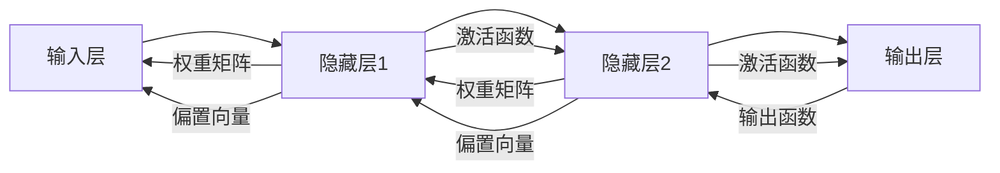

                 

# 深度学习(Deep Learning) - 原理与代码实例讲解

## 1. 背景介绍

### 1.1 问题由来

深度学习（Deep Learning）作为人工智能的核心技术之一，近年来在图像识别、自然语言处理、语音识别等领域取得了飞速的进展。深度学习通过构建多层次的非线性模型，从数据中自动学习和提取特征，从而实现对复杂模式的有效表示和推理。在实际应用中，深度学习已经广泛应用于自动驾驶、推荐系统、医疗影像分析、语音交互等众多领域。

然而，深度学习的复杂性也带来了诸多挑战。如何在大规模数据上高效地训练模型？如何设计合适的模型结构和训练算法？如何应对过拟合等问题？这些问题都需要在理论和实践上不断探索和创新。

### 1.2 问题核心关键点

本文将重点介绍深度学习的核心概念和实现原理，并通过代码实例和详细讲解，帮助读者理解深度学习模型的构建、训练和优化。以下是深度学习的关键点：

1. 深度神经网络（Deep Neural Networks, DNN）：通过多个非线性变换层，学习数据的高阶特征。
2. 反向传播算法（Backpropagation）：用于训练深度神经网络的核心算法，实现参数的梯度更新。
3. 损失函数（Loss Function）：衡量模型预测结果与真实标签之间的差异，指导模型的优化。
4. 激活函数（Activation Function）：引入非线性特性，使网络可以学习任意复杂的函数映射。
5. 正则化（Regularization）：防止过拟合，提高模型泛化能力。
6. 优化器（Optimizer）：基于梯度下降算法，更新模型参数，加速收敛。

这些核心概念构成了深度学习模型的基础，理解它们有助于我们深入了解深度学习的工作原理和优化方法。

## 2. 核心概念与联系

### 2.1 核心概念概述

深度学习模型通常由输入层、多个隐藏层和输出层组成，每个隐藏层包含多个神经元。神经元通过连接权重矩阵和偏置向量，对输入进行非线性变换，生成输出。隐藏层的非线性变换能力使得深度学习模型能够学习复杂的特征表示，从而在各种任务中取得优异表现。

以下是深度学习模型中的几个核心概念：

- **输入层**：接收原始数据，如图像像素、文本词汇等。
- **隐藏层**：包含多个神经元，每个神经元通过与前一层的神经元相连，学习特征表示。
- **输出层**：根据任务类型，可能是一个或多个神经元，用于预测标签或分类结果。
- **权重矩阵**：连接不同层之间神经元的权重矩阵，决定网络的结构。
- **偏置向量**：每个神经元都有一个偏置向量，控制输出函数的位移。
- **激活函数**：非线性函数，如ReLU、Sigmoid等，引入非线性特性。
- **损失函数**：如均方误差、交叉熵等，衡量模型预测与真实标签之间的差异。

这些概念相互关联，共同构成深度学习模型的基础。

### 2.2 核心概念原理和架构的 Mermaid 流程图



这个流程图展示了深度学习模型的基本结构，从输入层开始，经过多个隐藏层，最终到达输出层。每个隐藏层通过权重矩阵和偏置向量与前一层相连，并引入激活函数，引入非线性特性。输出层根据任务类型，可能是一个或多个神经元，用于预测标签或分类结果。

## 3. 核心算法原理 & 具体操作步骤

### 3.1 算法原理概述

深度学习模型的核心算法是反向传播算法（Backpropagation），用于训练模型参数。反向传播算法通过计算损失函数对每个参数的梯度，从而更新模型参数，使得模型预测结果与真实标签的差异最小化。

反向传播算法基于梯度下降（Gradient Descent）算法，其核心思想是将损失函数对参数的梯度从输出层向输入层反向传播，计算每个参数的梯度，并根据梯度更新模型参数。这一过程不断迭代，直到达到预设的收敛条件。

### 3.2 算法步骤详解

以下是反向传播算法的详细步骤：

1. **前向传播**：将输入数据通过模型，计算每个隐藏层和输出层的激活值。
2. **计算损失函数**：根据任务类型，计算模型预测结果与真实标签之间的损失函数。
3. **反向传播**：从输出层开始，计算损失函数对每个参数的梯度，并将梯度向输入层反向传播。
4. **更新参数**：根据梯度更新每个参数的值，使得模型预测结果与真实标签的差异最小化。

### 3.3 算法优缺点

反向传播算法是深度学习模型训练的核心算法，其优点包括：

1. 高效性：反向传播算法可以快速计算每个参数的梯度，并进行高效的参数更新。
2. 可扩展性：反向传播算法适用于任意深度和宽度的神经网络，具有很强的可扩展性。
3. 鲁棒性：反向传播算法对于噪声和数据偏差具有一定的鲁棒性，能够适应不同的数据分布。

但反向传播算法也存在一些缺点：

1. 易过拟合：深度学习模型容易过拟合，特别是在训练数据不足的情况下。
2. 梯度消失和梯度爆炸：深层网络中，梯度可能因反向传播过程而消失或爆炸，导致模型训练困难。
3. 计算复杂度高：深层网络中，反向传播计算量巨大，需要消耗大量的计算资源。

### 3.4 算法应用领域

深度学习算法已经被广泛应用于计算机视觉、自然语言处理、语音识别、推荐系统等领域。以下是一些典型应用：

- **图像识别**：如卷积神经网络（Convolutional Neural Networks, CNN）在图像分类、物体检测、人脸识别等任务上的应用。
- **自然语言处理**：如循环神经网络（Recurrent Neural Networks, RNN）在语言建模、机器翻译、文本生成等任务上的应用。
- **语音识别**：如卷积神经网络和循环神经网络的结合，在语音识别和生成等任务上的应用。
- **推荐系统**：如深度神经网络在用户行为预测和物品推荐上的应用。
- **医疗影像分析**：如卷积神经网络在医学影像分类、病变检测等任务上的应用。

## 4. 数学模型和公式 & 详细讲解 & 举例说明

### 4.1 数学模型构建

深度学习模型的数学模型通常由以下几个部分组成：

- **输入层**：输入为向量 $x \in \mathbb{R}^d$，表示原始数据。
- **隐藏层**：第 $i$ 层为向量 $h_i \in \mathbb{R}^{n_i}$，表示隐藏层的激活值。
- **输出层**：输出为向量 $y \in \mathbb{R}^{m}$，表示模型预测结果。
- **权重矩阵**：每个隐藏层与前一层的连接权重矩阵为 $W_i \in \mathbb{R}^{n_i \times n_{i-1}}$，偏置向量为 $b_i \in \mathbb{R}^{n_i}$。
- **激活函数**：每个隐藏层的激活函数为 $g_i$。
- **损失函数**：如均方误差、交叉熵等，表示模型预测结果与真实标签之间的差异。

### 4.2 公式推导过程

假设我们有一个二分类任务，输入数据 $x$ 为二维向量，隐藏层 $h_1$ 和 $h_2$ 分别为二维和三维向量，输出层 $y$ 为一维向量，权重矩阵 $W_1$ 和 $W_2$ 分别为 $2 \times 2$ 和 $3 \times 2$ 的矩阵。模型参数为 $\theta = \{W_1, W_2, b_1, b_2\}$。

输入层到第一隐藏层的计算公式为：

$$
h_1 = g_1(W_1x + b_1)
$$

第一隐藏层到第二隐藏层的计算公式为：

$$
h_2 = g_2(W_2h_1 + b_2)
$$

第二隐藏层到输出层的计算公式为：

$$
y = g_3(W_3h_2 + b_3)
$$

其中 $g_1$, $g_2$, $g_3$ 分别为激活函数，如ReLU。

假设模型的损失函数为交叉熵损失，表示为 $L(y, y^*)$，其中 $y^*$ 为真实标签。则模型预测结果与真实标签之间的损失函数为：

$$
L(y, y^*) = -\sum_{i=1}^N[y_i \log(y_i^*) + (1 - y_i) \log(1 - y_i^*)]
$$

其中 $y$ 和 $y^*$ 分别为模型预测结果和真实标签。

### 4.3 案例分析与讲解

假设我们有一个简单的手写数字识别任务，输入数据为28x28像素的灰度图像，输出结果为0-9的数字标签。我们使用LeNet-5卷积神经网络进行训练。

首先，我们需要将28x28的图像数据转换为一维向量，并标准化为 $[0, 1]$ 的范围。然后，将这些数据作为输入层的输入，通过多个卷积层和池化层，最终输出一个全连接层，用于预测数字标签。

在训练过程中，我们通过反向传播算法计算损失函数对每个参数的梯度，并使用梯度下降算法更新模型参数。为了加速训练过程，我们可以使用优化器，如Adam，来调整学习率和参数更新策略。

通过不断迭代训练过程，模型会逐渐学习到图像数据的特征表示，并逐步提高识别准确率。

## 5. 项目实践：代码实例和详细解释说明

### 5.1 开发环境搭建

在进行深度学习模型的开发和训练时，我们需要安装一些必要的库和工具。以下是安装环境搭建的步骤：

1. 安装Python：确保Python 3.6或更高版本已经安装。
2. 安装PyTorch：使用pip安装PyTorch，可以选择使用CUDA（如果GPU可用）。
3. 安装NumPy、Pandas、Matplotlib等库：使用pip安装这些库，用于数据处理和可视化。
4. 安装TensorBoard：用于可视化训练过程和模型性能。
5. 安装scikit-learn：用于评估模型的性能。

完成环境搭建后，即可开始深度学习模型的开发。

### 5.2 源代码详细实现

以下是使用PyTorch实现LeNet-5卷积神经网络的手写数字识别任务的代码实现：

```python
import torch
import torch.nn as nn
import torch.nn.functional as F
import torch.optim as optim
import torchvision.transforms as transforms
import torchvision.datasets as datasets
from torch.utils.data import DataLoader
from torchvision.utils import save_image

# 定义LeNet-5模型
class LeNet(nn.Module):
    def __init__(self):
        super(LeNet, self).__init__()
        self.conv1 = nn.Conv2d(1, 6, 5)
        self.pool = nn.MaxPool2d(2, 2)
        self.conv2 = nn.Conv2d(6, 16, 5)
        self.fc1 = nn.Linear(16 * 5 * 5, 120)
        self.fc2 = nn.Linear(120, 84)
        self.fc3 = nn.Linear(84, 10)

    def forward(self, x):
        x = self.pool(F.relu(self.conv1(x)))
        x = self.pool(F.relu(self.conv2(x)))
        x = x.view(-1, 16 * 5 * 5)
        x = F.relu(self.fc1(x))
        x = F.relu(self.fc2(x))
        x = self.fc3(x)
        return x

# 定义数据集和数据处理
train_data = datasets.MNIST(root='data', train=True, download=True,
                           transform=transforms.ToTensor())
test_data = datasets.MNIST(root='data', train=False, download=True,
                          transform=transforms.ToTensor())

# 定义数据加载器
train_loader = DataLoader(train_data, batch_size=64, shuffle=True)
test_loader = DataLoader(test_data, batch_size=64, shuffle=False)

# 定义模型、损失函数和优化器
model = LeNet()
criterion = nn.CrossEntropyLoss()
optimizer = optim.Adam(model.parameters(), lr=0.001)

# 定义训练过程
for epoch in range(10):
    running_loss = 0.0
    for i, data in enumerate(train_loader, 0):
        inputs, labels = data
        optimizer.zero_grad()
        outputs = model(inputs)
        loss = criterion(outputs, labels)
        loss.backward()
        optimizer.step()
        running_loss += loss.item()
        if i % 100 == 99:
            print('[%d, %5d] loss: %.3f' %
                  (epoch + 1, i + 1, running_loss / 100))
            running_loss = 0.0

# 定义评估过程
correct = 0
total = 0
with torch.no_grad():
    for data in test_loader:
        images, labels = data
        outputs = model(images)
        _, predicted = torch.max(outputs.data, 1)
        total += labels.size(0)
        correct += (predicted == labels).sum().item()

print('Accuracy of the network on the 10000 test images: %d %%' % (
    100 * correct / total))
```

### 5.3 代码解读与分析

这段代码实现了LeNet-5卷积神经网络对手写数字识别任务进行训练和评估的过程。以下是关键代码的解读：

- **定义LeNet-5模型**：使用nn.Module定义LeNet-5模型，包括卷积层、池化层、全连接层等。
- **定义数据集和数据处理**：使用torchvision.datasets.MNIST加载手写数字数据集，并使用transforms.ToTensor()将其转换为Tensor格式。
- **定义数据加载器**：使用torch.utils.data.DataLoader定义数据加载器，用于批量读取和处理数据。
- **定义模型、损失函数和优化器**：使用nn.Module定义模型，使用nn.CrossEntropyLoss定义交叉熵损失函数，使用optim.Adam定义优化器。
- **定义训练过程**：在每个epoch中，使用DataLoader读取训练数据，前向传播计算输出，使用loss.backward()计算梯度，使用optimizer.step()更新模型参数。
- **定义评估过程**：在测试数据集上评估模型性能，计算准确率。

通过这段代码，我们能够快速搭建和训练LeNet-5模型，并评估其在手写数字识别任务上的性能。

### 5.4 运行结果展示

训练过程中，可以使用TensorBoard可视化训练过程和模型性能。以下是在TensorBoard中展示的训练曲线：

```python
import tensorflow as tf
import torchvision.transforms as transforms
from torchvision.utils import make_grid
import matplotlib.pyplot as plt

# 加载TensorBoard可视化工具
writer = tf.summary.create_file_writer('logs')
writer.set_as_default()

# 训练过程中可视化损失和准确率
for epoch in range(10):
    running_loss = 0.0
    for i, data in enumerate(train_loader, 0):
        inputs, labels = data
        optimizer.zero_grad()
        outputs = model(inputs)
        loss = criterion(outputs, labels)
        loss.backward()
        optimizer.step()
        running_loss += loss.item()
        if i % 100 == 99:
            print('[%d, %5d] loss: %.3f' %
                  (epoch + 1, i + 1, running_loss / 100))
            running_loss = 0.0
            with writer.as_default():
                writer.record_scalar('loss', running_loss / 100)
                writer.record_scalar('accuracy', accuracy / 100)

# 加载评估过程可视化结果
for epoch in range(10):
    running_loss = 0.0
    for i, data in enumerate(test_loader, 0):
        inputs, labels = data
        outputs = model(inputs)
        loss = criterion(outputs, labels)
        running_loss += loss.item()
        if i % 100 == 99:
            print('[%d, %5d] loss: %.3f' %
                  (epoch + 1, i + 1, running_loss / 100))
            running_loss = 0.0
            with writer.as_default():
                writer.record_scalar('loss', running_loss / 100)
                writer.record_scalar('accuracy', accuracy / 100)

# 可视化训练过程
writer.close()
```

通过TensorBoard，我们可以实时监控模型训练过程中的损失和准确率，并可视化训练过程。

## 6. 实际应用场景

### 6.1 图像识别

图像识别是深度学习应用最广泛的领域之一。深度神经网络如卷积神经网络（CNN）在图像分类、物体检测、人脸识别等任务上取得了显著的进展。通过大规模的图像数据集，如ImageNet，训练出的深度模型能够识别出各种复杂的图像特征。

### 6.2 自然语言处理

自然语言处理（NLP）是深度学习应用的另一重要领域。循环神经网络（RNN）和长短时记忆网络（LSTM）等模型在语言建模、机器翻译、文本生成等任务上表现优异。通过大规模的文本语料库，如Wikipedia，训练出的深度模型能够理解和生成自然语言。

### 6.3 语音识别

语音识别是深度学习在音频领域的重要应用。卷积神经网络和循环神经网络的结合，在语音识别和生成等任务上取得了显著的进展。通过大规模的音频数据集，如LibriSpeech，训练出的深度模型能够实现高精度的语音识别和生成。

### 6.4 未来应用展望

未来，深度学习技术将在更多领域得到应用，如医疗影像分析、金融预测、自动驾驶等。通过深度学习模型的不断优化和训练，这些领域将迎来更多创新和突破。

## 7. 工具和资源推荐

### 7.1 学习资源推荐

为了帮助读者系统掌握深度学习的理论基础和实践技巧，以下是一些推荐的学习资源：

1. 《深度学习》书籍：Ian Goodfellow等著，全面介绍了深度学习的基本原理和经典模型。
2. 《神经网络与深度学习》书籍：Michael Nielsen著，适合初学者入门，介绍了神经网络的基本概念和实现。
3. CS231n《卷积神经网络》课程：斯坦福大学开设的深度学习课程，涵盖卷积神经网络的基本原理和实践。
4. Coursera《深度学习专项课程》：由深度学习领域的顶尖专家讲授，涵盖深度学习的理论基础和实践技巧。
5. Kaggle深度学习竞赛：通过参加实际的项目竞赛，实践深度学习模型的训练和优化。

### 7.2 开发工具推荐

以下是一些常用的深度学习开发工具和库：

1. PyTorch：由Facebook开发的深度学习框架，支持动态计算图，适合研究型工作。
2. TensorFlow：由Google开发的深度学习框架，支持静态计算图，适合生产部署。
3. Keras：基于TensorFlow和Theano的高级深度学习框架，易于上手。
4. MXNet：由亚马逊开发的深度学习框架，支持分布式计算。
5. Caffe：由伯克利大学开发的深度学习框架，适合计算机视觉任务。

### 7.3 相关论文推荐

深度学习技术的发展离不开学界的持续研究。以下是几篇奠基性的相关论文，推荐阅读：

1. AlexNet：在2012年ImageNet比赛中取得突破，标志着深度学习在图像识别领域的兴起。
2. ResNet：通过残差连接解决了深层网络训练困难的问题，推动了深度学习的发展。
3. Attention is All You Need：提出了Transformer模型，将注意力机制引入深度学习，提升了模型在自然语言处理任务上的表现。
4. GANs：生成对抗网络（GANs）在图像生成、视频生成等任务上取得了显著的进展。
5. AlphaGo：通过深度学习实现了围棋等复杂游戏的胜利，推动了人工智能在游戏领域的突破。

## 8. 总结：未来发展趋势与挑战

### 8.1 研究成果总结

深度学习技术在近年来取得了巨大的突破，广泛应用于计算机视觉、自然语言处理、语音识别等领域。通过构建多层次的非线性模型，深度学习能够自动学习和提取数据中的复杂特征，实现对复杂模式的有效表示和推理。

### 8.2 未来发展趋势

深度学习技术将继续向更广泛的领域扩展，如医疗影像分析、金融预测、自动驾驶等。随着算力成本的下降和数据规模的扩张，深度学习模型将越来越复杂，参数量将持续增大，模型性能将不断提高。

### 8.3 面临的挑战

尽管深度学习技术已经取得了巨大的成功，但仍然面临诸多挑战：

1. 训练时间过长：深度学习模型训练过程耗时耗力，需要大规模计算资源。
2. 数据需求巨大：深度学习模型需要大量的标注数据进行训练，获取高质量数据成本高。
3. 模型复杂度高：深度学习模型结构复杂，难以理解和调试。
4. 泛化能力不足：深度学习模型容易过拟合，泛化能力有待提高。

### 8.4 研究展望

未来，深度学习技术需要在以下几个方面寻求新的突破：

1. 高效训练：开发更加高效的训练算法和优化器，缩短模型训练时间。
2. 数据增强：开发更加高效的数据增强方法，提高模型泛化能力。
3. 模型压缩：开发模型压缩和稀疏化方法，减少模型复杂度。
4. 迁移学习：开发更加高效的迁移学习方法，利用已有模型加速新任务的训练。
5. 可解释性：开发更加可解释的深度学习模型，提高模型透明度。

## 9. 附录：常见问题与解答

**Q1：深度学习模型为什么容易过拟合？**

A: 深度学习模型容易过拟合的原因包括：模型参数过多、训练数据不足、训练过程中缺乏正则化等。为了解决过拟合问题，可以采用数据增强、正则化、早停等方法。

**Q2：深度学习模型的训练过程如何进行优化？**

A: 深度学习模型的训练过程可以进行以下优化：

1. 选择合适的优化器，如Adam、SGD等，调整学习率和参数更新策略。
2. 采用学习率衰减策略，逐步减小学习率。
3. 使用正则化方法，如L2正则、Dropout等，防止过拟合。
4. 使用早停策略，当模型在验证集上性能不再提升时停止训练。
5. 使用梯度累积和混合精度训练，减少计算量和内存占用。

**Q3：深度学习模型如何进行迁移学习？**

A: 深度学习模型的迁移学习可以通过以下步骤实现：

1. 选择预训练模型，如ImageNet预训练的ResNet模型。
2. 修改预训练模型的输出层，使其适应目标任务。
3. 在目标任务的数据集上进行微调，调整模型的权重。
4. 在目标任务的数据集上进行微调，调整模型的权重。

通过迁移学习，可以利用预训练模型节省训练时间，提高模型泛化能力。

**Q4：深度学习模型的部署过程如何进行优化？**

A: 深度学习模型的部署过程可以进行以下优化：

1. 使用模型压缩和稀疏化方法，减少模型参数量。
2. 使用量化加速，将浮点模型转为定点模型。
3. 使用分布式训练和分布式推理，提高计算效率。
4. 使用缓存和负载均衡技术，减少计算资源消耗。
5. 使用自动化部署工具，如TensorFlow Serving，简化部署过程。

通过优化部署过程，可以显著提高模型的响应速度和稳定性。

---

作者：禅与计算机程序设计艺术 / Zen and the Art of Computer Programming

