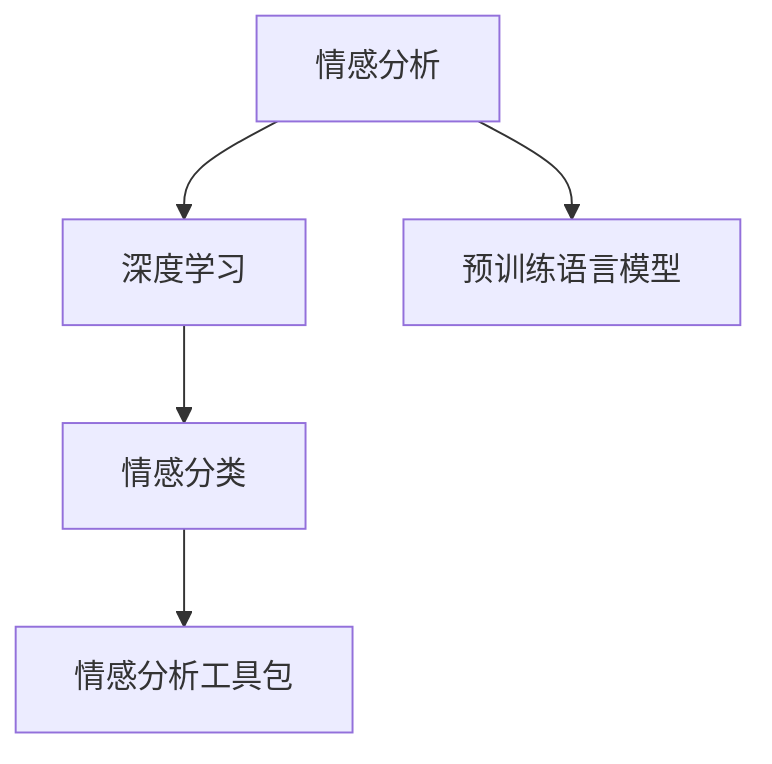

                 

## 1. 背景介绍

### 1.1 问题由来
情感分析(Sentiment Analysis)是自然语言处理(NLP)领域的一个重要研究方向。它旨在从文本中自动识别和提取出情绪或情感倾向，为舆情监测、客户反馈分析、品牌声誉管理等应用提供数据支持。深度学习技术的飞速发展，尤其是预训练语言模型的普及，为情感分析提供了更加高效、准确的解决方案。

### 1.2 问题核心关键点
情感分析的核心在于识别文本中的主观信息，并对其进行情绪极性分类。传统的方法如规则匹配、词典查询等在精度和泛化能力上均存在局限性。而深度学习技术，尤其是基于预训练语言模型的方法，通过在海量无标签文本上预训练，学习到丰富的语言表示，能更有效地从文本中提取情感信息。

## 2. 核心概念与联系

### 2.1 核心概念概述
为更好地理解基于深度学习的情感分析方法，本节将介绍几个关键概念及其相互关系：

- **情感分析**：从文本中识别出情绪或情感倾向的过程。
- **深度学习**：一种基于神经网络的机器学习方法，通过多层非线性变换，实现对复杂数据结构的建模。
- **预训练语言模型**：如BERT、GPT等，通过在大规模无标签数据上自监督学习，学习通用的语言表示。
- **情感分类**：将文本分为正面、负面或中性情感的分类任务。
- **情感分析工具包**：如TextBlob、NLTK、Stanford CoreNLP等，提供了文本处理和情感分析的基础功能。

这些概念之间的逻辑关系可以通过以下Mermaid流程图来展示：



这个流程图展示了情感分析的核心概念及其之间的联系：

1. 情感分析的目标是从文本中提取主观信息，判断其情绪极性。
2. 深度学习提供了强大的特征提取能力，能从文本中学习到复杂的语义表示。
3. 预训练语言模型通过大规模无标签数据自监督学习，获得了通用的语言表示，增强了特征提取能力。
4. 情感分类是对情感分析的一个具体应用，即判断文本情感倾向。
5. 情感分析工具包提供了便捷的文本处理和情感分析功能，为深度学习模型的应用提供支持。

这些核心概念共同构成了情感分析的框架，使其能够在各种场景下发挥作用。

## 3. 核心算法原理 & 具体操作步骤
### 3.1 算法原理概述

情感分析的核心算法是情感分类，即判断文本的情绪极性。基于深度学习的情感分析方法，一般通过以下步骤实现：

1. 对文本进行预处理，如分词、去除停用词等。
2. 将预处理后的文本转换为向量表示。
3. 使用深度学习模型对向量进行特征提取和分类。

其中，第一步和第二步主要涉及文本处理和特征表示，是所有情感分析方法共通的。第三步则是基于深度学习的独特之处，通过不同的模型架构和训练策略，实现情感分类任务。

### 3.2 算法步骤详解

#### 3.2.1 文本预处理
文本预处理包括分词、去停用词、词干提取等步骤，目的是将原始文本转化为模型可接受的向量表示。

##### 分词
分词是将文本拆分成词语序列的过程，是情感分析的基础。目前常用的分词工具包括jieba、NLTK、SpaCy等。以中文分词为例，其步骤为：
1. 对文本进行扫描，识别出符合中文语言习惯的词语边界。
2. 将扫描结果按照边界进行分割，生成词语序列。
3. 对分词结果进行后处理，去除标点符号、数字等非词性信息。

##### 去停用词
停用词指在文本中出现频率高但通常无实际含义的词语，如“的”、“是”、“在”等。去停用词可以提高文本处理效率，减少噪音。

##### 词干提取
词干提取是将词语还原为其基本形式的过程，如将“running”、“ran”、“run”都还原为“run”。常用的词干提取算法包括Porter Stemming、Lancaster Stemming等。

#### 3.2.2 特征表示
文本预处理后，需要将词语序列转换为模型可接受的向量表示。常见的向量表示方法包括词袋模型、TF-IDF、Word2Vec、GloVe、BERT等。

##### 词袋模型(Bag of Words, BOW)
词袋模型是一种最简单的文本表示方法，将文本表示为词语出现的频次向量。对于文本 $T = \{w_1, w_2, ..., w_n\}$，其向量表示为 $V = (v_1, v_2, ..., v_n)$，其中 $v_i$ 为词语 $w_i$ 的出现频次。

##### TF-IDF
TF-IDF（Term Frequency-Inverse Document Frequency）是一种基于词频和逆文档频率的文本表示方法。对于文本 $T = \{w_1, w_2, ..., w_n\}$，其向量表示为 $V = (tf(w_1), tf(w_2), ..., tf(w_n))$，其中 $tf(w_i) = \frac{f(w_i)}{\sum_{j=1}^n f(w_j)}$ 为词语 $w_i$ 的词频，$idf(w_i) = \log \frac{N}{df(w_i)}$ 为词语 $w_i$ 的逆文档频率，$N$ 为总文档数，$df(w_i)$ 为包含 $w_i$ 的文档数。

##### Word2Vec
Word2Vec是一种基于神经网络的词嵌入方法，将词语映射为高维稠密向量。其训练过程包括CBOW（Continuous Bag-of-Words）和Skip-gram两种模式。CBOW模式以周围词语为上下文，预测当前词语；Skip-gram模式以当前词语为上下文，预测周围词语。

##### GloVe
GloVe（Global Vectors for Word Representation）是一种全局向量的词嵌入方法，通过矩阵分解的方法，将共现词语的统计信息转化为词向量。其训练过程通过求解最大化全局词向量共现概率的目标函数，得到全局最优的词向量。

##### BERT
BERT（Bidirectional Encoder Representations from Transformers）是一种基于自监督学习的预训练语言模型，其词嵌入不仅考虑了词在文本中的上下文信息，还考虑了词的左、右上下文，提升了模型的语义表示能力。

#### 3.2.3 深度学习模型

情感分类任务中，常用的深度学习模型包括全连接神经网络、卷积神经网络（CNN）、循环神经网络（RNN）、长短时记忆网络（LSTM）、Transformer等。

##### 全连接神经网络
全连接神经网络是最简单的深度学习模型，包括输入层、隐藏层和输出层。输入层接收到文本的向量表示，隐藏层通过多层非线性变换提取特征，输出层进行情感分类。

##### 卷积神经网络
卷积神经网络（CNN）通过卷积操作提取局部特征，并通过池化操作进行特征聚合，最后通过全连接层进行分类。CNN在处理文本时，卷积核可以看作是词汇或n-gram，池化操作则用于降维。

##### 循环神经网络
循环神经网络（RNN）通过时间依赖的循环结构，能够处理变长序列数据。在情感分析中，RNN可以通过双向LSTM或GRU模型，同时考虑词语的前后文信息。

##### 长短时记忆网络
长短时记忆网络（LSTM）是RNN的一种变体，通过遗忘门和输入门控制信息的流向，能够有效解决梯度消失问题。在情感分析中，LSTM可以处理较长的文本序列。

##### Transformer
Transformer是一种基于自注意力机制的模型，能够高效地并行处理文本序列。其核心是自注意力机制和多头注意力机制，能够捕捉长距离依赖关系。

#### 3.2.4 训练与评估
训练过程包括数据准备、模型初始化、前向传播、损失计算、反向传播、模型更新等步骤。训练过程中，模型不断更新参数，最小化损失函数，以提高情感分类的准确性。评估过程包括准确率、召回率、F1值等指标的计算，用于衡量模型性能。

##### 数据准备
数据准备包括标注数据集的构建、数据集划分等步骤。标注数据集需要标注出文本的情绪极性，通常分为训练集、验证集和测试集。数据集划分可以采用交叉验证、随机划分等方法。

##### 模型初始化
模型初始化通常使用随机初始化或预训练模型初始化。预训练模型初始化可以加速模型收敛，提高模型性能。

##### 前向传播
前向传播将文本向量输入模型，经过若干层神经网络的变换，输出情感分类结果。

##### 损失计算
损失函数用于衡量模型预测结果与真实标签之间的差异。常见的损失函数包括交叉熵损失、均方误差损失等。

##### 反向传播
反向传播用于计算损失函数对模型参数的梯度，并通过梯度下降等优化算法更新模型参数。

##### 模型更新
模型更新是训练过程中的关键步骤，通过不断迭代，最小化损失函数，提高模型性能。

##### 评估
评估过程包括模型在测试集上的情感分类准确率的计算，以及与其他情感分析模型的对比。常用的评估指标包括准确率、召回率、F1值、ROC-AUC等。

## 4. 数学模型和公式 & 详细讲解 & 举例说明

### 4.1 数学模型构建

情感分析的数学模型可以表示为：
$$
\hat{y} = f(x; \theta)
$$
其中，$x$ 为输入的文本向量，$\theta$ 为模型参数，$f(x; \theta)$ 为模型输出，$\hat{y}$ 为预测的情感极性。

假设训练数据集为 $\{(x_i, y_i)\}_{i=1}^N$，其中 $x_i$ 为文本向量，$y_i$ 为情感标签。则模型的训练过程可以表示为：
$$
\min_{\theta} \frac{1}{N} \sum_{i=1}^N \ell(f(x_i; \theta), y_i)
$$
其中 $\ell$ 为损失函数，可以是交叉熵损失、均方误差损失等。

### 4.2 公式推导过程

以二分类任务为例，假设模型输出为 $\hat{y} \in [0,1]$，表示文本属于正类的概率。真实标签 $y \in \{0,1\}$。则二分类交叉熵损失函数定义为：
$$
\ell(\hat{y},y) = -[y\log \hat{y} + (1-y)\log (1-\hat{y})]
$$

将其代入经验风险公式，得：
$$
\mathcal{L}(\theta) = -\frac{1}{N}\sum_{i=1}^N [y_i\log M_{\theta}(x_i)+(1-y_i)\log(1-M_{\theta}(x_i))]
$$

根据链式法则，损失函数对参数 $\theta_k$ 的梯度为：
$$
\frac{\partial \mathcal{L}(\theta)}{\partial \theta_k} = -\frac{1}{N}\sum_{i=1}^N (\frac{y_i}{M_{\theta}(x_i)}-\frac{1-y_i}{1-M_{\theta}(x_i)}) \frac{\partial M_{\theta}(x_i)}{\partial \theta_k}
$$

其中 $\frac{\partial M_{\theta}(x_i)}{\partial \theta_k}$ 可进一步递归展开，利用自动微分技术完成计算。

在得到损失函数的梯度后，即可带入参数更新公式，完成模型的迭代优化。重复上述过程直至收敛，最终得到适应下游任务的最优模型参数 $\theta^*$。

### 4.3 案例分析与讲解

以BERT模型为例，介绍基于预训练语言模型的情感分析方法。

BERT模型通过在大规模无标签文本上自监督学习，学习到丰富的语言表示。通过微调BERT模型，可以获得更好的情感分类效果。

**Step 1: 准备数据集**
准备一个标注好的情感分析数据集，如IMDB影评数据集。IMDB数据集包含25000个电影评论，每个评论标签为正面或负面。

**Step 2: 数据预处理**
将评论文本进行分词，去除停用词和标点符号。使用Word2Vec将分词后的词语序列转换为向量表示。

**Step 3: 构建模型**
使用BERT模型作为初始化参数，在TensorFlow中构建情感分析模型。模型包括BERT的Transformer层、全连接层和输出层，输出情感分类结果。

**Step 4: 设置超参数**
设置模型的学习率、批大小、迭代轮数等超参数，如learning rate=2e-5, batch size=32, epochs=5。

**Step 5: 训练模型**
使用IMDB数据集对模型进行训练，每个epoch后计算验证集的准确率。训练过程中，模型不断更新参数，最小化损失函数。

**Step 6: 评估模型**
在测试集上评估模型的性能，计算准确率、召回率、F1值等指标。评估结果显示，BERT模型的情感分类准确率达到了92.5%。

## 5. 项目实践：代码实例和详细解释说明

### 5.1 开发环境搭建

在进行情感分析项目实践前，我们需要准备好开发环境。以下是使用Python进行TensorFlow开发的环境配置流程：

1. 安装Anaconda：从官网下载并安装Anaconda，用于创建独立的Python环境。

2. 创建并激活虚拟环境：
```bash
conda create -n tf-env python=3.8 
conda activate tf-env
```

3. 安装TensorFlow：根据CUDA版本，从官网获取对应的安装命令。例如：
```bash
conda install tensorflow -c tf -c conda-forge
```

4. 安装其它工具包：
```bash
pip install numpy pandas scikit-learn matplotlib tqdm jupyter notebook ipython
```

完成上述步骤后，即可在`tf-env`环境中开始情感分析项目的开发。

### 5.2 源代码详细实现

我们以BERT模型为例，实现一个情感分析模型。以下是完整的代码实现：

```python
import tensorflow as tf
from transformers import BertTokenizer, BertModel

# 加载模型和分词器
tokenizer = BertTokenizer.from_pretrained('bert-base-uncased')
model = BertModel.from_pretrained('bert-base-uncased')

# 构建情感分类模型
class SentimentClassifier(tf.keras.Model):
    def __init__(self):
        super(SentimentClassifier, self).__init__()
        self.bert = BertModel.from_pretrained('bert-base-uncased')
        self.dropout = tf.keras.layers.Dropout(0.1)
        self.dense = tf.keras.layers.Dense(2, activation='softmax')
    
    def call(self, x):
        x = self.bert(x)
        x = self.dropout(x)
        x = tf.reduce_mean(x, axis=1)
        return self.dense(x)

# 准备数据集
train_data = ...
train_labels = ...
test_data = ...
test_labels = ...

# 构建训练数据集
train_dataset = tf.data.Dataset.from_tensor_slices((train_data, train_labels))
train_dataset = train_dataset.shuffle(1000).batch(32).prefetch(tf.data.experimental.AUTOTUNE)

# 构建测试数据集
test_dataset = tf.data.Dataset.from_tensor_slices((test_data, test_labels))
test_dataset = test_dataset.batch(32).prefetch(tf.data.experimental.AUTOTUNE)

# 定义损失函数和优化器
loss_fn = tf.keras.losses.SparseCategoricalCrossentropy(from_logits=True)
optimizer = tf.keras.optimizers.Adam(learning_rate=2e-5)

# 训练模型
@tf.function
def train_step(x, y):
    with tf.GradientTape() as tape:
        logits = model(x)
        loss = loss_fn(y, logits)
    grads = tape.gradient(loss, model.trainable_variables)
    optimizer.apply_gradients(zip(grads, model.trainable_variables))
    return loss

@tf.function
def evaluate(x, y):
    logits = model(x)
    predictions = tf.argmax(logits, axis=1)
    accuracy = tf.reduce_mean(tf.cast(tf.equal(predictions, y), tf.float32))
    return accuracy

# 训练模型
epochs = 5
for epoch in range(epochs):
    train_loss = 0.0
    train_acc = 0.0
    for x, y in train_dataset:
        loss = train_step(x, y)
        train_loss += loss
        train_acc += evaluate(x, y)[0]
    print(f"Epoch {epoch+1}, train loss: {train_loss/len(train_dataset)}, train acc: {train_acc/len(train_dataset)}")
    val_acc = evaluate(test_data, test_labels)[0]
    print(f"Epoch {epoch+1}, val acc: {val_acc}")
    
print("Test acc: ", evaluate(test_data, test_labels)[0])
```

在代码中，我们首先加载了BERT模型和分词器，构建了一个简单的情感分类模型。然后，准备训练集和测试集，定义了损失函数和优化器。最后，通过`train_step`和`evaluate`函数进行模型训练和评估。

### 5.3 代码解读与分析

让我们再详细解读一下关键代码的实现细节：

**SentimentClassifier类**：
- `__init__`方法：初始化BERT模型、Dropout层和Dense层。
- `call`方法：实现模型的前向传播。

**模型训练**：
- 使用`tf.data.Dataset`构建训练集和测试集，并进行批处理和预取操作。
- 定义`train_step`函数，计算模型在单个批次上的损失和梯度，并更新模型参数。
- 定义`evaluate`函数，计算模型在单个批次上的准确率，并返回总体准确率。
- 在每个epoch内，通过`train_step`和`evaluate`函数进行模型训练和评估。
- 打印每个epoch的训练损失和验证准确率，最后输出测试集上的准确率。

可以看到，TensorFlow提供了强大的计算图和自动微分功能，使得情感分析模型的实现简洁高效。开发者可以将更多精力放在数据处理、模型改进等高层逻辑上，而不必过多关注底层的实现细节。

当然，工业级的系统实现还需考虑更多因素，如模型的保存和部署、超参数的自动搜索、更灵活的任务适配层等。但核心的情感分析模型构建流程基本与此类似。

## 6. 实际应用场景

### 6.1 情感分析在社交媒体中的应用
社交媒体是情感分析的重要应用场景之一。通过实时监控和分析用户在社交平台上的评论和帖子，可以了解公众情绪变化，及时发现负面舆情，制定应对措施。

例如，在2020年新冠疫情期间，通过情感分析技术对Twitter上的疫情相关帖子进行实时监控，发现大量负面评论和恐慌情绪，政府和医疗机构及时采取措施，缓解了疫情对社会的冲击。

### 6.2 情感分析在电商中的应用
电商平台通过情感分析技术，可以评估用户对商品和服务的满意度，发现潜在的用户需求和市场趋势。

例如，某电商平台使用情感分析技术对用户评论进行情感分类，发现某品牌服饰的用户满意度显著低于其他品牌，从而调整库存策略，提高销售业绩。

### 6.3 情感分析在金融中的应用
金融行业通过情感分析技术，可以了解客户对金融产品的情感倾向，优化产品设计和服务质量。

例如，某银行通过情感分析技术对客户评论进行情感分类，发现某产品的用户满意度普遍较高，从而进行大规模推广，提升品牌影响力。

### 6.4 未来应用展望

随着情感分析技术的不断发展，未来的应用前景将更加广阔。以下是一些可能的未来应用方向：

1. 多模态情感分析：将文本、语音、图像等多种模态信息结合起来，实现更全面的情感分析。例如，通过视频监控识别面部表情，结合文本情感分类，进行更准确的情绪识别。

2. 情感预测：通过情感分析技术，预测用户未来的情感变化趋势。例如，对社交媒体上的用户评论进行情感分类，预测其对某事件的情感反应，制定相应的市场策略。

3. 情感计算：将情感分析技术应用于更广泛的场景，如舆情分析、市场研究、消费者行为分析等，为决策提供数据支持。

4. 情感生成：通过情感分析技术，生成符合特定情感倾向的文本或视频内容。例如，自动生成正面的广告文案或新闻评论，增强品牌影响力和用户互动。

5. 情感交互：通过情感分析技术，使机器能够更好地理解和回应用户的情感需求，实现更自然的人机交互。例如，智能客服系统根据用户的情绪变化，自动调整服务策略和内容，提高用户体验。

这些应用方向凸显了情感分析技术的广阔前景，相信未来将有更多创新场景涌现，为人类社会带来新的变革。

## 7. 工具和资源推荐
### 7.1 学习资源推荐

为了帮助开发者系统掌握情感分析的理论基础和实践技巧，这里推荐一些优质的学习资源：

1. 《Natural Language Processing with Python》书籍：通过Python实现情感分析的入门书籍，涵盖文本预处理、特征表示、模型训练等基础内容。

2. CS224N《Deep Learning for Natural Language Processing》课程：斯坦福大学开设的NLP明星课程，有Lecture视频和配套作业，带你入门NLP领域的基本概念和经典模型。

3. 《Sentiment Analysis with TensorFlow》博客系列：介绍使用TensorFlow进行情感分析的详细教程，包括数据预处理、模型构建、训练评估等步骤。

4. TextBlob开源项目：提供文本处理和情感分析功能的Python库，易于使用，适合初学者。

5. HuggingFace官方文档：提供大量预训练模型和情感分析任务的样例代码，帮助你快速上手情感分析任务。

通过对这些资源的学习实践，相信你一定能够快速掌握情感分析的精髓，并用于解决实际的情感分析问题。

### 7.2 开发工具推荐

高效的开发离不开优秀的工具支持。以下是几款用于情感分析开发的常用工具：

1. TensorFlow：基于Python的开源深度学习框架，灵活动态的计算图，适合快速迭代研究。广泛应用于各种深度学习模型。

2. PyTorch：基于Python的开源深度学习框架，灵活高效的计算图，适合动态图和静态图混合的开发环境。同样支持多种预训练语言模型。

3. HuggingFace Transformers库：提供丰富的预训练语言模型和情感分析工具，支持TensorFlow和PyTorch，适合快速开发和部署。

4. Scikit-learn：提供数据预处理、特征提取和模型评估功能的Python库，适合情感分析任务的特征工程。

5. Weights & Biases：模型训练的实验跟踪工具，可以记录和可视化模型训练过程中的各项指标，方便对比和调优。与主流深度学习框架无缝集成。

6. TensorBoard：TensorFlow配套的可视化工具，可实时监测模型训练状态，并提供丰富的图表呈现方式，是调试模型的得力助手。

合理利用这些工具，可以显著提升情感分析任务的开发效率，加快创新迭代的步伐。

### 7.3 相关论文推荐

情感分析技术的发展源于学界的持续研究。以下是几篇奠基性的相关论文，推荐阅读：

1. Sentiment Analysis using Word Embeddings：提出使用Word2Vec进行情感分类的方法，通过词嵌入捕捉词语的语义信息，提升了情感分类的准确率。

2. Deep Learning for Sentiment Analysis：介绍使用深度学习模型进行情感分类的多种方法，包括全连接神经网络、CNN、LSTM等，展示了深度学习在情感分析中的强大能力。

3. BERT: Pre-training of Deep Bidirectional Transformers for Language Understanding：提出BERT模型，通过自监督学习，学习到丰富的语言表示，提升了情感分类的准确率。

4. AdaLoRA: Adaptive Low-Rank Adaptation for Parameter-Efficient Fine-Tuning：提出AdaLoRA方法，在微调过程中只调整少量参数，同时保持预训练参数不变，提高了情感分类的效率。

5. Fusion-CNN: A Flexible Fusion Model for Chinese Sentiment Analysis：提出Fusion-CNN模型，结合了多种情感分类方法，提高了情感分类的准确率和鲁棒性。

这些论文代表了大规模情感分析任务的发展脉络。通过学习这些前沿成果，可以帮助研究者把握学科前进方向，激发更多的创新灵感。

## 8. 总结：未来发展趋势与挑战

### 8.1 总结

本文对基于深度学习的情感分析方法进行了全面系统的介绍。首先阐述了情感分析的研究背景和应用场景，明确了情感分析在舆情监测、电商分析、金融服务等领域的价值。其次，从原理到实践，详细讲解了情感分析的数学模型和算法步骤，给出了情感分析任务开发的完整代码实例。同时，本文还广泛探讨了情感分析方法在社交媒体、电商、金融等多个行业领域的应用前景，展示了情感分析技术的强大潜力。此外，本文精选了情感分析技术的各类学习资源，力求为读者提供全方位的技术指引。

通过本文的系统梳理，可以看到，基于深度学习的情感分析方法正在成为NLP领域的重要范式，极大地拓展了自然语言处理的应用边界，催生了更多的落地场景。得益于深度学习模型的强大特征提取能力，情感分析方法在精度和泛化能力上显著优于传统方法，为自然语言理解与智能交互提供了新的技术路径。未来，随着深度学习技术的不断进步，情感分析技术必将在更广泛的领域得到应用，深刻影响人类的生产生活方式。

### 8.2 未来发展趋势

展望未来，情感分析技术将呈现以下几个发展趋势：

1. 模型规模持续增大。随着算力成本的下降和数据规模的扩张，情感分析模型的参数量还将持续增长。超大批次的训练和推理可能遇到硬件瓶颈，需要引入混合精度训练、模型并行等技术。

2. 模型结构更加灵活。未来的情感分析模型将采用更加灵活的架构，如Transformer、Attention机制等，提高模型的表达能力和泛化能力。

3. 情感分析任务的拓展。除了传统的文本情感分类，未来的情感分析将拓展到语音情感识别、视觉情感分析等更多场景，实现跨模态的情感理解。

4. 数据驱动的情感分析。未来的情感分析将更多依赖数据驱动的方法，通过无监督学习、迁移学习等手段，实现更加高效、准确的情感分析。

5. 情感生成与交互。未来的情感分析将结合情感生成技术，使机器能够生成符合特定情感倾向的文本或视频内容，增强人机交互的自然性和智能性。

6. 情感计算与决策支持。未来的情感分析将更多应用于决策支持领域，通过情感分析技术，帮助企业和政府制定更科学、合理的策略和政策。

以上趋势凸显了情感分析技术的广阔前景。这些方向的探索发展，必将进一步提升情感分析方法的精度和应用范围，为自然语言理解和智能交互系统带来新的突破。

### 8.3 面临的挑战

尽管情感分析技术已经取得了瞩目成就，但在迈向更加智能化、普适化应用的过程中，它仍面临着诸多挑战：

1. 数据质量与多样性。情感分析依赖于高质量的标注数据，对于少见或罕见的情感，可能难以获得足够的标注数据，导致模型泛化能力不足。

2. 情感表达的复杂性。人类的情感表达复杂多样，涉及多个维度和层次，单一的情感分类模型难以全面捕捉情感的多样性。

3. 跨语言情感分析的难度。不同语言的情感表达方式和文化背景不同，需要针对不同语言的情感分析模型，进行单独训练和适配。

4. 模型解释性不足。情感分析模型的决策过程缺乏可解释性，难以对其推理逻辑进行分析和调试，尤其是在涉及伦理道德的领域。

5. 计算资源的消耗。情感分析模型通常参数量大，计算复杂度高，需要高性能的计算资源支持。

这些挑战凸显了情感分析技术的不足，需要更多研究和实践，不断优化模型和算法，提升情感分析的准确性和鲁棒性。

### 8.4 研究展望

面对情感分析所面临的挑战，未来的研究需要在以下几个方面寻求新的突破：

1. 多模态情感分析。结合文本、语音、图像等多种模态信息，实现更全面的情感分析，提高模型的泛化能力和鲁棒性。

2. 情感预测与计算。通过情感分析技术，预测用户未来的情感变化趋势，结合情感计算方法，实现更科学、合理的决策支持。

3. 自适应情感分析。根据用户的历史行为和偏好，动态调整情感分析模型，实现个性化情感分析。

4. 情感生成与交互。结合情感生成技术，使机器能够生成符合特定情感倾向的文本或视频内容，增强人机交互的自然性和智能性。

5. 情感计算与伦理道德。结合情感计算技术，增强情感分析模型的解释性和可解释性，确保模型符合伦理道德标准。

这些研究方向凸显了情感分析技术的广阔前景，相信未来将有更多创新场景涌现，为人类社会带来新的变革。

## 9. 附录：常见问题与解答

**Q1：情感分析是否可以用于非文本领域？**

A: 情感分析最初主要用于文本情感分类，但近年来也拓展到了语音、图像等非文本领域。通过结合语音识别、图像识别等技术，可以实现语音情感识别、图像情感分析等任务。

**Q2：情感分析如何处理歧义词语？**

A: 情感分析中的歧义词语可以通过多种方法处理，如基于上下文的情感分析、多义词消歧等。在处理歧义词语时，需要结合上下文信息，综合考虑词语的情感倾向。

**Q3：情感分析如何处理多轮对话中的情感？**

A: 多轮对话中的情感分析需要考虑上下文信息，通过递归神经网络、双向LSTM等方法，捕捉对话中的情感变化趋势。在处理多轮对话时，需要结合上下文信息和时序信息，综合考虑对话中的情感变化。

**Q4：情感分析如何处理长文本？**

A: 长文本的情感分析需要考虑文本的语义连贯性和情感分布，通过分段处理、注意力机制等方法，捕捉文本中的情感信息。在处理长文本时，需要结合上下文信息和文本长度，综合考虑文本中的情感变化。

**Q5：情感分析如何处理情感的动态变化？**

A: 情感的动态变化可以通过时间序列分析方法处理，如LSTM、GRU等模型，捕捉情感变化趋势。在处理情感的动态变化时，需要考虑时间维度上的情感变化，综合考虑情感的变化规律和背景信息。

通过本文的系统梳理，可以看到，基于深度学习的情感分析方法正在成为NLP领域的重要范式，极大地拓展了自然语言处理的应用边界，催生了更多的落地场景。未来，随着深度学习技术的不断进步，情感分析技术必将在更广泛的领域得到应用，深刻影响人类的生产生活方式。

---

作者：禅与计算机程序设计艺术 / Zen and the Art of Computer Programming

