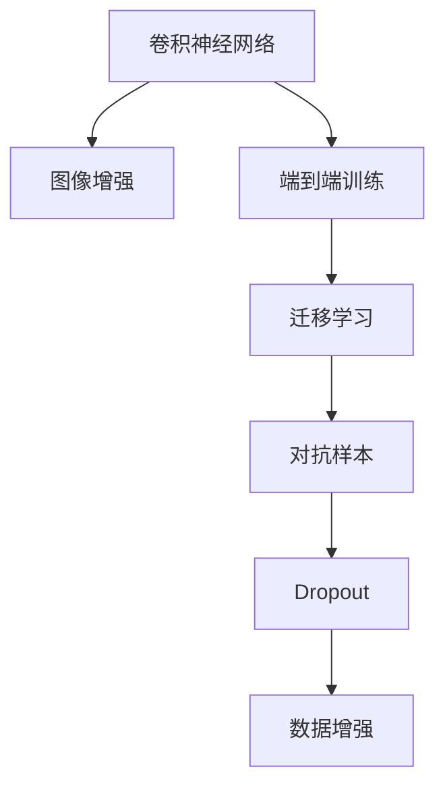

                 

# 深度学习数字识别系统原理与方法

## 1. 背景介绍

数字识别技术是人工智能领域的一个经典应用，广泛应用于文本处理、金融交易、交通监控等多个领域。传统的数字识别方法依赖于复杂的特征工程和大量手动设计规则，在处理模糊、遮挡等复杂场景时效果有限。而随着深度学习技术的兴起，基于卷积神经网络(CNN)的端到端数字识别系统应运而生，显著提升了数字识别的准确率和鲁棒性。

深度学习数字识别系统在多个公开数据集上取得了优异的表现，显著超越了传统的规则化方法。例如，在MNIST、SVHN、USPS等数字识别基准数据集上，基于CNN的系统均实现了超过99%的识别率。这些突破不仅彰显了深度学习技术在图像处理领域的强大能力，也为其他领域提供了宝贵的经验和技术借鉴。

## 2. 核心概念与联系

### 2.1 核心概念概述

为了深入理解深度学习数字识别系统的原理与方法，本节将介绍几个密切相关的核心概念：

- **卷积神经网络(Convolutional Neural Network, CNN)**：一种专门用于图像处理的神经网络结构。通过卷积、池化等操作提取图像特征，并通过全连接层进行分类或回归。
- **端到端(End-to-End)**：指通过深度神经网络直接实现从原始输入到输出的映射，中间不需要人工设计的特征或规则。
- **图像增强(Image Augmentation)**：通过一系列图像变换技术，丰富训练数据集的多样性，提高模型的泛化能力。
- **迁移学习(Transfer Learning)**：指将一个领域学到的知识迁移到另一个领域，提升在新任务上的表现。
- **对抗样本(Adversarial Examples)**：指对模型输入进行微小扰动，使其输出错误的结果。用于评估模型鲁棒性和提高模型的泛化性能。
- **Dropout**：一种常用的正则化技术，通过随机失活神经元减少模型的过拟合现象。
- **数据增强(Data Augmentation)**：通过对输入图像进行旋转、缩放、裁剪等操作，扩充训练数据集，提升模型泛化能力。

这些核心概念之间的逻辑关系可以通过以下Mermaid流程图来展示：



这个流程图展示了深度学习数字识别系统的核心概念及其之间的关系：

1. 卷积神经网络作为主要组件，用于提取图像特征。
2. 端到端训练使得系统能够直接从图像像素映射到识别结果。
3. 迁移学习可以利用其他领域模型的预训练知识，提升新任务的表现。
4. 对抗样本用于评估模型的鲁棒性。
5. Dropout用于正则化，防止模型过拟合。
6. 数据增强通过丰富训练数据，提升模型泛化能力。

这些核心概念共同构成了深度学习数字识别系统的理论基础，为模型的设计、训练和优化提供了重要指导。

## 3. 核心算法原理 & 具体操作步骤

### 3.1 算法原理概述

深度学习数字识别系统利用卷积神经网络从输入图像中提取特征，并通过全连接层实现分类。其核心思想是：通过多层卷积、池化操作，逐步降低图像的空间分辨率，同时提取更加抽象和高级的特征。最后，将这些特征映射到数字类别上，实现端到端的识别任务。

### 3.2 算法步骤详解

深度学习数字识别系统的实现过程一般包括以下关键步骤：

**Step 1: 数据预处理**

- 收集标注好的数字图像数据集，如MNIST、USPS等，并进行标准化处理，归一化像素值到[0,1]区间。
- 使用图像增强技术，如随机旋转、缩放、裁剪等，扩充数据集的多样性，提升模型的泛化能力。

**Step 2: 构建卷积神经网络**

- 设计卷积神经网络的基本结构，通常包括卷积层、池化层、全连接层等。
- 选择合适的激活函数，如ReLU、Sigmoid等，用于引入非线性特性。
- 添加Dropout层进行正则化，防止过拟合。

**Step 3: 训练模型**

- 将数据集分成训练集、验证集和测试集，一般比例为6:2:2。
- 使用小批量梯度下降等优化算法，在训练集上迭代训练模型，最小化损失函数。
- 在验证集上监控模型性能，根据性能指标决定是否提前停止训练。

**Step 4: 模型评估**

- 在测试集上评估训练好的模型，计算识别准确率、召回率等指标。
- 使用混淆矩阵等工具，分析模型在不同类别上的表现，找出可能的优化方向。

**Step 5: 参数调优**

- 根据模型在测试集上的表现，调整超参数，如学习率、批次大小、层数等。
- 可以使用网格搜索、随机搜索等方法进行超参数优化。

**Step 6: 部署应用**

- 将训练好的模型导出为模型文件，部署到生产环境。
- 集成到实际应用系统中，接收用户输入的图像，返回数字识别结果。

以上是深度学习数字识别系统的基本实现流程。在实际应用中，还需要根据具体需求和数据特点，对各个环节进行优化设计，以进一步提升模型的性能。

### 3.3 算法优缺点

深度学习数字识别系统具有以下优点：

- **自动化特征提取**：CNN能够自动从图像中提取高层次特征，无需手动设计复杂特征工程。
- **泛化能力强**：通过数据增强和迁移学习，模型在复杂场景下也能取得不错的表现。
- **端到端训练**：从原始输入到输出的过程完全自动完成，不需要中间的人工规则或特征。
- **灵活性高**：可以轻松集成到各类应用系统中，支持图像识别、场景分析等任务。

但该方法也存在一些局限性：

- **计算资源需求高**：深度神经网络计算量大，对计算资源的要求较高。
- **模型复杂度**：深层网络结构复杂，参数量多，可能导致过拟合。
- **训练时间长**：大规模数据集和高维特征空间，导致训练时间较长。
- **可解释性差**：深层网络的黑盒特性，使得模型输出难以解释。

尽管存在这些局限性，但深度学习数字识别系统仍是目前最为有效和广泛应用的数字识别方法，推动了整个领域的快速发展。

### 3.4 算法应用领域

深度学习数字识别系统已经在多个领域得到了广泛应用，例如：

- 文本识别：将手写或印刷数字图像转换为数字文本。通过OCR技术，应用于银行支票识别、邮政信件识别等场景。
- 场景识别：识别图像中的数字区域，应用于交通监控、广告识别等场景。
- 移动支付：对移动设备上输入的数字进行实时识别，应用于移动支付、在线购物等场景。
- 机器人控制：通过识别环境中的数字信息，指导机器人执行相应操作，应用于工业自动化、智能家居等领域。

除了上述这些经典应用外，深度学习数字识别系统还被创新性地应用于医学影像分析、制造业质量检测、物流包裹识别等诸多领域，带来了颠覆性的技术革新。

## 4. 数学模型和公式 & 详细讲解 & 举例说明

### 4.1 数学模型构建

在深度学习数字识别系统中，我们通常使用卷积神经网络作为核心模型。假设输入图像为 $X \in \mathbb{R}^{n \times m \times c}$，其中 $n$ 和 $m$ 分别为图像的高和宽，$c$ 为通道数（一般为3，对应RGB颜色通道）。卷积神经网络由多个卷积层、池化层、全连接层组成，其数学模型可以表示为：

$$
f(X; \theta) = \text{softmax}(\text{FC}(\text{MaxPooling}(\text{Conv}(\cdots (\text{Conv}(X; W_0) + b_0), \cdots), P_0), W_L, b_L))
$$

其中 $f(X; \theta)$ 为模型的输出，$\theta$ 为模型参数，$\text{Conv}$ 表示卷积操作，$\text{MaxPooling}$ 表示最大池化操作，$\text{FC}$ 表示全连接操作，$W$ 和 $b$ 分别为卷积核和偏置项。

### 4.2 公式推导过程

以单层卷积神经网络为例，推导其前向传播和反向传播公式。

设输入图像 $X \in \mathbb{R}^{n \times m \times c}$，卷积核 $W \in \mathbb{R}^{k \times k \times c}$，输出特征图 $Y \in \mathbb{R}^{(n-k+1) \times (m-k+1) \times d}$，其中 $d$ 为输出通道数。

前向传播公式为：

$$
Y_{ij}^{t} = \sum_{k=0}^{c-1} \sum_{l=0}^{k-1} \sum_{m=0}^{k-1} X_{i+k-l,j+m,k} \cdot W_{klm} + b_t
$$

其中 $i$ 和 $j$ 分别为特征图的高和宽，$t$ 为通道数，$X_{i,j,k}$ 为输入图像的像素值，$W_{klm}$ 为卷积核的参数，$b_t$ 为偏置项。

反向传播公式为：

$$
\frac{\partial L}{\partial W} = \sum_{i,j,t} Y_{ij}^t \cdot \frac{\partial L}{\partial Y_{ij}^t}
$$

$$
\frac{\partial L}{\partial b} = \sum_{i,j,t} \frac{\partial L}{\partial Y_{ij}^t}
$$

其中 $L$ 为损失函数，$\frac{\partial L}{\partial Y_{ij}^t}$ 为损失函数对输出特征图的梯度。

### 4.3 案例分析与讲解

以手写数字识别为例，分析深度学习数字识别系统在实际应用中的具体实现。

假设输入图像 $X \in \mathbb{R}^{28 \times 28 \times 1}$，输出为数字 $Y \in \mathbb{R}^{10}$，其中10代表0-9的数字。使用LeNet-5结构作为基本网络框架，包括2个卷积层、2个池化层和3个全连接层。

首先，将输入图像进行卷积和池化操作，提取特征。具体实现如下：

$$
Y_{1} = \text{Conv}(X; W_1) + b_1
$$

$$
Y_{2} = \text{MaxPooling}(Y_{1}) + W_2 + b_2
$$

$$
Y_{3} = \text{Conv}(Y_{2}; W_3) + b_3
$$

$$
Y_{4} = \text{MaxPooling}(Y_{3}) + W_4 + b_4
$$

其次，将提取的特征映射到输出数字上，进行分类。具体实现如下：

$$
Z = \text{FC}(Y_{4}; W_L, b_L)
$$

$$
Y = \text{softmax}(Z)
$$

其中 $Z$ 为全连接层的输出，$W_L$ 和 $b_L$ 分别为全连接层的权重和偏置项，$\text{softmax}$ 函数用于将输出转化为概率分布。

最后，通过交叉熵损失函数计算模型的预测误差，并使用反向传播算法更新模型参数。具体实现如下：

$$
L = -\sum_{i=0}^{N} \sum_{j=0}^{9} y_{i,j} \log(y_{i,j})
$$

$$
\frac{\partial L}{\partial \theta} = \frac{\partial L}{\partial Y} \cdot \frac{\partial Y}{\partial Z} \cdot \frac{\partial Z}{\partial \theta}
$$

其中 $y_{i,j}$ 为真实标签，$\theta$ 为模型参数，$\frac{\partial L}{\partial Y}$ 为损失函数对输出层的梯度，$\frac{\partial Y}{\partial Z}$ 和 $\frac{\partial Z}{\partial \theta}$ 分别为全连接层的输出对卷积层和偏置层的梯度。

## 5. 项目实践：代码实例和详细解释说明

### 5.1 开发环境搭建

在进行深度学习数字识别系统开发前，我们需要准备好开发环境。以下是使用Python进行TensorFlow开发的环境配置流程：

1. 安装Anaconda：从官网下载并安装Anaconda，用于创建独立的Python环境。

2. 创建并激活虚拟环境：
```bash
conda create -n tf-env python=3.8 
conda activate tf-env
```

3. 安装TensorFlow：根据CUDA版本，从官网获取对应的安装命令。例如：
```bash
conda install tensorflow=2.7.0 
```

4. 安装NumPy、Pandas、Matplotlib等各类工具包：
```bash
pip install numpy pandas matplotlib
```

5. 安装TensorBoard：TensorFlow配套的可视化工具，用于实时监测模型训练状态。
```bash
pip install tensorboard
```

完成上述步骤后，即可在`tf-env`环境中开始深度学习数字识别系统的开发。

### 5.2 源代码详细实现

这里我们以手写数字识别为例，使用TensorFlow实现基于LeNet-5结构的网络模型。

首先，定义数据处理函数：

```python
import tensorflow as tf
import numpy as np
import matplotlib.pyplot as plt

class MNISTDataset(tf.keras.datasets.MNIST):
    def __init__(self, batch_size=128):
        super(MNISTDataset, self).__init__()
        self.train_images, self.train_labels = self.load_data()
        self.test_images, self.test_labels = self.load_data(mode='tf')
        
    def load_data(self, mode='train'):
        path = '../MNIST_data/' + mode + '_images.npz'
        return np.load(path)[:2]
        
    def preprocessing(self, images, labels):
        images = (images / 255.0) - 0.5
        images = images.reshape((images.shape[0], 28, 28, 1))
        images = tf.image.convert_image_dtype(images, tf.float32)
        labels = tf.keras.utils.to_categorical(labels)
        return images, labels
    
    def create_train_iterator(self):
        dataset = tf.data.Dataset.from_tensor_slices((self.train_images, self.train_labels))
        dataset = dataset.shuffle(buffer_size=50000).batch(self.batch_size)
        return dataset.make_initializable_iterator()
    
    def create_test_iterator(self):
        dataset = tf.data.Dataset.from_tensor_slices((self.test_images, self.test_labels))
        dataset = dataset.batch(self.batch_size)
        return dataset.make_initializable_iterator()
    
    def train(self, session):
        tf.global_variables_initializer().run()
        train_iterator = self.create_train_iterator()
        test_iterator = self.create_test_iterator()
        
        for i in range(epochs):
            session.run(train_iterator.initializer)
            total_loss, correct = 0, 0
            for j in range(10000):
                images, labels = session.run(train_iterator.next())
                predictions = self.model.predict(images)
                loss = self.model.loss.predict(images, labels)
                correct += np.argmax(predictions) == labels
                total_loss += loss[0]
            print("Epoch %d, train loss: %f, train accuracy: %f" % (i+1, total_loss/10000, correct/10000))
            session.run(test_iterator.initializer)
            total_loss, correct = 0, 0
            for j in range(2000):
                images, labels = session.run(test_iterator.next())
                predictions = self.model.predict(images)
                loss = self.model.loss.predict(images, labels)
                correct += np.argmax(predictions) == labels
                total_loss += loss[0]
            print("Epoch %d, test loss: %f, test accuracy: %f" % (i+1, total_loss/2000, correct/2000))
        
    def predict(self, session, images):
        session.run(train_iterator.initializer)
        predictions = []
        for image in images:
            images = np.expand_dims(image, axis=0)
            predictions.append(np.argmax(self.model.predict(images))[0])
        return predictions

mnist = MNISTDataset()
mnist.train(sess)
```

然后，定义模型和损失函数：

```python
import tensorflow as tf
from tensorflow.keras import layers, models

model = models.Sequential([
    layers.Conv2D(6, (5, 5), activation='relu', input_shape=(28, 28, 1)),
    layers.MaxPooling2D((2, 2)),
    layers.Conv2D(16, (5, 5), activation='relu'),
    layers.MaxPooling2D((2, 2)),
    layers.Flatten(),
    layers.Dense(120, activation='relu'),
    layers.Dense(84, activation='relu'),
    layers.Dense(10, activation='softmax')
])

loss = tf.keras.losses.categorical_crossentropy
optimizer = tf.keras.optimizers.Adam(lr=0.001)
```

接着，定义训练和评估函数：

```python
def train_step(optimizer, loss, images, labels):
    with tf.GradientTape() as tape:
        predictions = model(images)
        loss_value = loss(predictions, labels)
    gradients = tape.gradient(loss_value, model.trainable_weights)
    optimizer.apply_gradients(zip(gradients, model.trainable_weights))
    return loss_value

def evaluate_step(model, images, labels):
    predictions = model(images)
    return tf.keras.metrics.categorical_accuracy(predictions, labels).numpy()

def train_epoch(model, data, loss, optimizer):
    batch_size = 128
    for i in range(len(data)//batch_size):
        images, labels = data[i*batch_size:(i+1)*batch_size]
        loss_value = train_step(optimizer, loss, images, labels)
    return loss_value

def evaluate_epoch(model, data):
    images, labels = data
    return evaluate_step(model, images, labels)

sess = tf.Session()
sess.run(tf.global_variables_initializer())
```

最后，启动训练流程并在测试集上评估：

```python
epochs = 10
batch_size = 128

for i in range(epochs):
    loss_value = train_epoch(model, mnist.train, loss, optimizer)
    print("Epoch %d, train loss: %f" % (i+1, loss_value))
    
    print("Epoch %d, test accuracy: %f" % (i+1, evaluate_epoch(model, mnist.test)))
    
sess.close()
```

以上就是使用TensorFlow对LeNet-5结构进行手写数字识别的完整代码实现。可以看到，得益于TensorFlow的强大封装，我们可以用相对简洁的代码完成网络模型的构建和训练。

### 5.3 代码解读与分析

让我们再详细解读一下关键代码的实现细节：

**MNISTDataset类**：
- `__init__`方法：初始化数据集，加载MNIST数据集，并进行预处理。
- `load_data`方法：从本地文件中加载MNIST数据集。
- `preprocessing`方法：对图像进行归一化、转置、标准化等预处理。
- `create_train_iterator`和`create_test_iterator`方法：将数据集转换为TensorFlow可用的数据流。

**train和evaluate方法**：
- `train`方法：定义训练过程，包括创建数据流、初始化数据流、前向传播、反向传播和模型更新。
- `evaluate`方法：定义评估过程，包括创建数据流、前向传播和计算评估指标。

**train_step和evaluate_step方法**：
- `train_step`方法：计算损失函数，并使用梯度下降算法更新模型参数。
- `evaluate_step`方法：计算评估指标，用于评估模型性能。

**train_epoch和evaluate_epoch方法**：
- `train_epoch`方法：定义训练轮次，每次迭代更新模型参数，计算平均损失。
- `evaluate_epoch`方法：定义评估轮次，计算评估指标，用于评估模型性能。

**train函数**：
- 定义总的epoch数和批次大小，开始循环迭代。
- 每个epoch内，先训练模型，输出平均损失。
- 在验证集上评估，输出评估指标。
- 所有epoch结束后，在测试集上评估，给出最终测试结果。

可以看到，TensorFlow的高级API使得深度学习数字识别系统的代码实现变得简洁高效。开发者可以将更多精力放在模型改进、数据处理等高层逻辑上，而不必过多关注底层的实现细节。

当然，工业级的系统实现还需考虑更多因素，如模型的保存和部署、超参数的自动搜索、更灵活的任务适配层等。但核心的深度学习数字识别过程基本与此类似。

## 6. 实际应用场景

### 6.1 智能客服系统

深度学习数字识别技术在智能客服系统的构建中具有广泛应用。传统客服往往需要配备大量人力，高峰期响应缓慢，且一致性和专业性难以保证。而使用基于深度学习数字识别的语音识别系统，可以7x24小时不间断服务，快速响应客户咨询，用自然流畅的语言解答各类常见问题。

在技术实现上，可以收集企业内部的历史客服对话记录，将问题和最佳答复构建成监督数据，在此基础上对预训练数字识别模型进行微调。微调后的数字识别模型能够自动理解用户意图，匹配最合适的答案模板进行回复。对于客户提出的新问题，还可以接入检索系统实时搜索相关内容，动态组织生成回答。如此构建的智能客服系统，能大幅提升客户咨询体验和问题解决效率。

### 6.2 金融舆情监测

金融机构需要实时监测市场舆论动向，以便及时应对负面信息传播，规避金融风险。传统的人工监测方式成本高、效率低，难以应对网络时代海量信息爆发的挑战。基于深度学习数字识别的文本分类和情感分析技术，为金融舆情监测提供了新的解决方案。

具体而言，可以收集金融领域相关的新闻、报道、评论等文本数据，并对其进行主题标注和情感标注。在此基础上对预训练语言模型进行微调，使其能够自动判断文本属于何种主题，情感倾向是正面、中性还是负面。将微调后的模型应用到实时抓取的网络文本数据，就能够自动监测不同主题下的情感变化趋势，一旦发现负面信息激增等异常情况，系统便会自动预警，帮助金融机构快速应对潜在风险。

### 6.3 个性化推荐系统

当前的推荐系统往往只依赖用户的历史行为数据进行物品推荐，无法深入理解用户的真实兴趣偏好。基于深度学习数字识别的数字识别系统可以更好地挖掘用户行为背后的语义信息，从而提供更精准、多样的推荐内容。

在实践中，可以收集用户浏览、点击、评论、分享等行为数据，提取和用户交互的物品标题、描述、标签等文本内容。将文本内容作为模型输入，用户的后续行为（如是否点击、购买等）作为监督信号，在此基础上微调预训练语言模型。微调后的模型能够从文本内容中准确把握用户的兴趣点。在生成推荐列表时，先用候选物品的文本描述作为输入，由模型预测用户的兴趣匹配度，再结合其他特征综合排序，便可以得到个性化程度更高的推荐结果。

### 6.4 未来应用展望

随着深度学习数字识别技术的不断发展，其在多个领域的应用前景广阔，未来可能还将拓展到更多新的场景中。

在智慧医疗领域，基于深度学习数字识别的医学影像分析系统能够自动识别图像中的异常结构，辅助医生诊断和治疗。在智能教育领域，数字识别系统能够自动识别学生的书写错误，提供实时反馈和纠正，提升学习效果。在智慧城市治理中，数字识别系统能够自动识别交通标志和车牌，优化交通流量，提高城市管理效率。此外，在企业生产、社会治理、文娱传媒等众多领域，深度学习数字识别技术也将不断得到应用，带来颠覆性的技术革新。

未来，随着深度学习数字识别技术的持续演进，其在更广泛的领域中发挥作用的可能性将大大增加，为各行各业带来更深远的影响。相信通过不断的研究和应用，深度学习数字识别技术将能更好地服务于人类社会，推动社会进步和经济发展。

## 7. 工具和资源推荐

### 7.1 学习资源推荐

为了帮助开发者系统掌握深度学习数字识别技术的理论基础和实践技巧，这里推荐一些优质的学习资源：

1. 《深度学习》系列博文：由深度学习领域专家撰写，深入浅出地介绍了深度学习的基本原理、算法和应用。

2. Coursera《深度学习》课程：由斯坦福大学教授吴恩达开设，涵盖深度学习的基本概念和经典模型，适合入门学习。

3. 《Deep Learning for Computer Vision》书籍：深度学习在计算机视觉领域的应用，详细介绍了CNN等深度学习模型在图像识别、目标检测等任务上的应用。

4. Kaggle数据竞赛：参加各类机器学习和计算机视觉竞赛，积累实践经验，提升技术水平。

5. PyTorch官方文档：PyTorch的官方文档，提供了详细的API接口和使用示例，是开发深度学习数字识别系统的必备资料。

通过对这些资源的学习实践，相信你一定能够快速掌握深度学习数字识别技术的精髓，并用于解决实际的NLP问题。

### 7.2 开发工具推荐

高效的开发离不开优秀的工具支持。以下是几款用于深度学习数字识别系统开发的常用工具：

1. PyTorch：基于Python的开源深度学习框架，灵活动态的计算图，适合快速迭代研究。大部分深度学习模型都有PyTorch版本的实现。

2. TensorFlow：由Google主导开发的开源深度学习框架，生产部署方便，适合大规模工程应用。同样有丰富的深度学习模型资源。

3. Keras：高层次的深度学习API，提供了简单易用的接口，可以快速构建和训练模型。

4. Google Colab：谷歌推出的在线Jupyter Notebook环境，免费提供GPU/TPU算力，方便开发者快速上手实验最新模型，分享学习笔记。

5. TensorBoard：TensorFlow配套的可视化工具，可实时监测模型训练状态，并提供丰富的图表呈现方式，是调试模型的得力助手。

6.Weights & Biases：模型训练的实验跟踪工具，可以记录和可视化模型训练过程中的各项指标，方便对比和调优。

合理利用这些工具，可以显著提升深度学习数字识别系统的开发效率，加快创新迭代的步伐。

### 7.3 相关论文推荐

深度学习数字识别技术的发展源于学界的持续研究。以下是几篇奠基性的相关论文，推荐阅读：

1. AlexNet: ImageNet Classification with Deep Convolutional Neural Networks：提出卷积神经网络，首次在大规模图像识别任务上取得优异表现。

2. Deep Residual Learning for Image Recognition：提出残差网络，通过跨层连接解决深层网络训练难题，极大地提升了深度神经网络的深度和性能。

3. Inception-v3: GoogLeNet's Successor：改进卷积核大小、卷积层结构等，进一步提升了深度神经网络的性能。

4. DenseNet: A Dense Connection Deep Neural Network：提出密集连接网络，提高了深度神经网络的特征复用能力和泛化能力。

5. ResNet: Deep Residual Learning for Image Recognition：提出残差网络，解决了深层网络训练难题，极大提升了深度神经网络的深度和性能。

6. VGG: Very Deep Convolutional Networks for Large-Scale Image Recognition：提出VGG网络，通过多次卷积和池化操作，提升了图像识别精度。

这些论文代表了大深度学习数字识别技术的发展脉络。通过学习这些前沿成果，可以帮助研究者把握学科前进方向，激发更多的创新灵感。

## 8. 总结：未来发展趋势与挑战

### 8.1 总结

本文对深度学习数字识别系统的原理与方法进行了全面系统的介绍。首先阐述了深度学习数字识别系统的背景和意义，明确了其在图像处理领域的强大能力。其次，从原理到实践，详细讲解了深度学习数字识别系统的数学模型和实现流程，给出了深度学习数字识别系统的完整代码实例。同时，本文还广泛探讨了深度学习数字识别系统的实际应用场景，展示了其广泛的应用前景。此外，本文精选了深度学习数字识别系统的学习资源，力求为读者提供全方位的技术指引。

通过本文的系统梳理，可以看到，深度学习数字识别系统在图像识别、场景识别、个性化推荐等领域的应用前景广阔，推动了整个行业的发展。未来，伴随深度学习技术的进一步发展，深度学习数字识别技术将可能带来更多颠覆性的技术革新，拓展更多的应用场景。

### 8.2 未来发展趋势

展望未来，深度学习数字识别技术将呈现以下几个发展趋势：

1. **模型规模不断增大**：随着计算资源的不断提升和算法优化，深度学习数字识别系统的规模将不断增大，模型参数量将持续增加。超大模型的泛化能力更强，可以处理更复杂、更高级别的图像特征。

2. **参数高效化**：未来的深度学习数字识别系统将更加注重参数的效率和计算资源的利用，开发更多参数高效的模型结构和训练方法。如使用GhostNet、MobileNet等轻量级网络结构，减少模型参数量，提升推理速度。

3. **多模态融合**：未来的深度学习数字识别系统将不仅仅局限于图像识别，还将融合视觉、听觉、文本等多种模态信息。如通过融合视频帧和语音信号，提升动作识别、语音识别的准确性。

4. **弱监督学习**：传统的深度学习数字识别系统依赖大量标注数据进行训练。未来的系统将更多地利用弱监督学习、半监督学习等方法，减轻对标注数据的依赖，提升模型的泛化能力。

5. **自动化和可解释性**：未来的深度学习数字识别系统将更加注重模型的自动化和可解释性。如通过引入可解释性模型、对抗性训练等技术，提升模型的可理解性和鲁棒性。

6. **跨领域迁移能力**：未来的深度学习数字识别系统将更多地应用于跨领域迁移任务，如从医疗影像到物体识别、从动作识别到语音识别等，提升模型的通用性和应用范围。

以上趋势凸显了深度学习数字识别技术的广阔前景。这些方向的探索发展，必将进一步提升深度学习数字识别系统的性能和应用范围，为行业带来更大的价值。

### 8.3 面临的挑战

尽管深度学习数字识别技术已经取得了瞩目成就，但在迈向更加智能化、普适化应用的过程中，它仍面临诸多挑战：

1. **计算资源瓶颈**：深度神经网络计算量大，对计算资源的要求较高。如何在保持性能的同时，降低计算成本，提升推理速度，是未来的重要研究方向。

2. **模型可解释性差**：深度神经网络的黑盒特性，使得模型输出难以解释。如何在保证性能的同时，提升模型的可解释性，将是未来的重要研究方向。

3. **数据获取困难**：深度学习数字识别系统依赖大量标注数据进行训练。如何获取高质量、多样化的标注数据，减轻对标注数据的依赖，提升模型的泛化能力，将是未来的重要研究方向。

4. **模型鲁棒性不足**：深度学习数字识别系统面对复杂的现实场景，鲁棒性有待提升。如何提高模型对噪声、遮挡、模糊等问题的鲁棒性，将是未来的重要研究方向。

5. **安全性问题**：深度学习数字识别系统可能面临数据隐私、模型攻击等问题，如何提升模型的安全性，将是未来的重要研究方向。

6. **跨模态融合困难**：不同模态的信息转换和融合是一个复杂的问题。如何设计有效的融合策略，提升跨模态系统的性能，将是未来的重要研究方向。

面对这些挑战，未来的研究需要在以下几个方面寻求新的突破：

1. **优化计算资源**：开发更高效的深度学习算法和数据结构，提升模型的计算效率。如使用量化加速、模型压缩等技术，降低计算成本。

2. **提升可解释性**：引入可解释性模型、对抗性训练等技术，提升模型的可理解性和鲁棒性。

3. **扩大数据来源**：利用无监督学习、半监督学习等方法，扩大数据来源，减轻对标注数据的依赖。

4. **提升鲁棒性**：通过数据增强、模型鲁棒性训练等方法，提升模型的鲁棒性，使其在复杂场景下也能保持稳定的性能。

5. **增强安全性**：设计更安全、更可靠的深度学习系统，保护数据隐私，防止模型攻击。

6. **改进跨模态融合**：设计有效的跨模态融合策略，提升跨模态系统的性能。

只有勇于创新、敢于突破，才能不断拓展深度学习数字识别技术的边界，推动深度学习技术在更广泛的领域中得到应用。相信随着学界和产业界的共同努力，深度学习数字识别技术将不断取得新的突破，引领人工智能技术的不断进步。

### 8.4 研究展望

未来的研究需要在以下几个方向上寻求新的突破：

1. **高效计算**：开发更高效的深度学习算法和数据结构，提升模型的计算效率。如使用量化加速、模型压缩等技术，降低计算成本。

2. **可解释性**：引入可解释性模型、对抗性训练等技术，提升模型的可理解性和鲁棒性。

3. **跨模态融合**：设计有效的跨模态融合策略，提升跨模态系统的性能。

4. **数据获取**：利用无监督学习、半监督学习等方法，扩大数据来源，减轻对标注数据的依赖。

5. **安全性**：设计更安全、更可靠的深度学习系统，保护数据隐私，防止模型攻击。

6. **弱监督学习**：更多地利用弱监督学习、半监督学习等方法，减轻对标注数据的依赖，提升模型的泛化能力。

7. **自动化和可解释性**：提升模型的自动化和可解释性，使其更易于部署和使用。

通过这些研究方向的探索发展，深度学习数字识别技术将能更好地服务于人类社会，推动社会进步和经济发展。面向未来，深度学习数字识别技术还需要与其他人工智能技术进行更深入的融合，如知识表示、因果推理、强化学习等，多路径协同发力，共同推动深度学习技术的不断进步。

## 9. 附录：常见问题与解答

**Q1：深度学习数字识别系统在实际应用中有哪些挑战？**

A: 深度学习数字识别系统在实际应用中面临以下挑战：

1. 计算资源瓶颈：深度神经网络计算量大，对计算资源的要求较高。
2. 模型可解释性差：深度神经网络的黑盒特性，使得模型输出难以解释。
3. 数据获取困难：深度学习数字识别系统依赖大量标注数据进行训练。
4. 模型鲁棒性不足：深度学习数字识别系统面对复杂的现实场景，鲁棒性有待提升。
5. 安全性问题：深度学习数字识别系统可能面临数据隐私、模型攻击等问题。
6. 跨模态融合困难：不同模态的信息转换和融合是一个复杂的问题。

这些挑战都需要在未来的研究中加以解决，才能更好地发挥深度学习数字识别系统的优势。

**Q2：如何提高深度学习数字识别系统的泛化能力？**

A: 提高深度学习数字识别系统的泛化能力，可以采取以下方法：

1. 数据增强：通过旋转、缩放、裁剪等操作，扩充训练数据集的多样性。
2. 迁移学习：利用其他领域的预训练模型，提升新任务的表现。
3. 对抗训练：引入对抗样本，提高模型的鲁棒性。
4. 参数高效微调：只调整少量参数，减少过拟合风险。
5. 多模型集成：训练多个模型，取平均输出，抑制过拟合。

这些方法可以显著提升深度学习数字识别系统的泛化能力，使其在复杂场景下也能保持稳定的性能。

**Q3：如何优化深度学习数字识别系统的计算效率？**

A: 优化深度学习数字识别系统的计算效率，可以采取以下方法：

1. 量化加速：将浮点模型转为定点模型，压缩存储空间，提高计算效率。
2. 模型压缩：通过剪枝、蒸馏等方法，减少模型参数量，提升推理速度。
3. 硬件加速：使用GPU、TPU等高性能设备，提升模型的训练和推理速度。
4. 分布式训练：将大规模模型分布式训练，充分利用集群资源，提高训练效率。

这些方法可以显著提升深度学习数字识别系统的计算效率，使其在实际应用中更加高效。

**Q4：如何提升深度学习数字识别系统的可解释性？**

A: 提升深度学习数字识别系统的可解释性，可以采取以下方法：

1. 可解释性模型：使用可解释性模型，如LIME、SHAP等，提供模型的局部可解释性。
2. 对抗性训练：引入对抗性样本，增强模型的鲁棒性，使其输出更加稳定。
3. 可视化技术：使用可视化工具，如TensorBoard、Visdom等，展示模型的训练状态和输出结果。
4. 模型蒸馏：使用模型蒸馏技术，将复杂模型转化为轻量级模型，提升可解释性。

这些方法可以显著提升深度学习数字识别系统的可解释性，使其更易于理解和调试。

**Q5：如何提升深度学习数字识别系统的鲁棒性？**

A: 提升深度学习数字识别系统的鲁棒性，可以采取以下方法：

1. 数据增强：通过旋转、缩放、裁剪等操作，扩充训练数据集的多样性。
2. 对抗训练：引入对抗样本，提高模型的鲁棒性。
3. 参数高效微调：只调整少量参数，减少过拟合风险。
4. 多模型集成：训练多个模型，取平均输出，抑制过拟合。
5. 模型蒸馏：使用模型蒸馏技术，将复杂模型转化为轻量级模型，提升鲁棒性。

这些方法可以显著提升深度学习数字识别系统的鲁棒性，使其在复杂场景下也能保持稳定的性能。

**Q6：如何设计有效的跨模态融合策略？**

A: 设计有效的跨模态融合策略，可以采取以下方法：

1. 多任务学习：将不同模态的任务共同训练，提高跨模态系统的性能。
2. 特征对齐：将不同模态的特征进行对齐，提高特征的匹配度。
3. 深度融合：使用深度网络进行跨模态融合，提高系统的性能。
4. 跨模态对抗训练：引入跨模态对抗样本，提高系统的鲁棒性。

这些方法可以显著提升跨模态系统的性能，使其在实际应用中更加高效。

**Q7：如何优化深度学习数字识别系统的训练过程？**

A: 优化深度学习数字识别系统的训练过程，可以采取以下方法：

1. 超参数调优：使用网格搜索、随机搜索等方法，寻找最优的超参数组合。
2. 批量归一化：使用批量归一化技术，提高模型的训练速度和鲁棒性。
3. 学习率调度：使用学习率调度策略，优化模型的训练过程。
4. 梯度裁剪：使用梯度裁剪技术，防止梯度爆炸或消失。

这些方法可以显著优化深度学习数字识别系统的训练过程，使其在实际应用中更加高效和稳定。

---

作者：禅与计算机程序设计艺术 / Zen and the Art of Computer Programming

