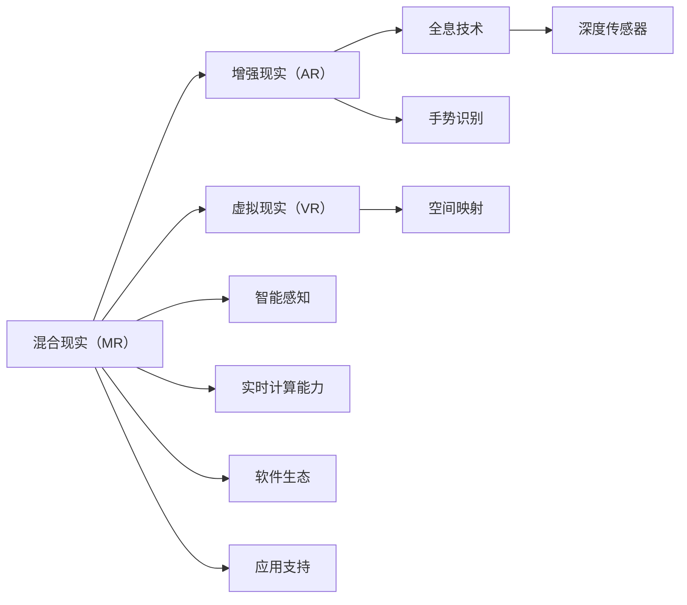

                 

# 混合现实（MR）探索：Microsoft HoloLens

> 关键词：混合现实（MR）, Microsoft HoloLens, 增强现实（AR）, 全息技术, 增强现实应用程序, 虚拟现实（VR）, 全息投影

## 1. 背景介绍

### 1.1 问题由来
随着科技的迅猛发展，增强现实（AR）和虚拟现实（VR）技术正逐步从游戏、娱乐等领域走向工业、医疗、教育等实际应用场景。Microsoft HoloLens作为混合现实（MR）领域的领军产品，以其丰富的功能、强大的兼容性和丰富的应用场景，为混合现实技术的发展和普及奠定了坚实基础。

混合现实（MR）结合了虚拟现实（VR）和增强现实（AR）的技术特点，通过将数字信息与现实世界的交互，提供了比传统二维界面更直观、更自然的信息展示方式。

### 1.2 问题核心关键点
Microsoft HoloLens的成功在于其独特的设计理念和先进的技术实现。以下是影响其技术发展和应用的关键点：

- **全息技术**：通过高质量的3D空间映射和全息投影技术，将虚拟信息与现实世界无缝融合。
- **集成度与便携性**：采用了紧凑的硬件设计，使其体积小巧、重量轻，易于携带。
- **智能感知与交互**：搭载了深度传感器、惯导系统和手势识别等硬件，实现了对用户的高度感知和交互。
- **软件生态与应用支持**：丰富的开发平台和开发工具，支持开发者快速构建和部署MR应用程序。
- **实时计算能力**：强大的计算平台支持，可以处理高强度的计算任务，确保实时渲染和交互。

这些核心技术点使得Microsoft HoloLens能够在众多领域，如教育、工业、医疗等，提供前所未有的沉浸式体验和高效的工作方式。

### 1.3 问题研究意义
Microsoft HoloLens的成功实践，不仅推动了混合现实技术的发展，也为其他技术供应商提供了宝贵的经验借鉴。研究Microsoft HoloLens的技术原理、架构设计和应用案例，能够帮助开发者和研究人员更深入地理解混合现实技术，探索更多创新的应用场景。

同时，随着混合现实技术的不断成熟，其在各行业的深度应用将进一步提升工作效率和用户体验，加速各行各业的数字化转型。

## 2. 核心概念与联系

### 2.1 核心概念概述

为了更好地理解Microsoft HoloLens的核心技术原理和架构设计，本节将介绍几个关键概念：

- **混合现实（MR）**：混合现实（MR）是将虚拟信息与现实世界融合的技术，通过在物理世界中增强信息层，提供更直观、自然的信息交互方式。
- **增强现实（AR）**：增强现实（AR）通过在现实世界的视觉叠加数字信息，使数字信息与现实世界共存。
- **虚拟现实（VR）**：虚拟现实（VR）完全由计算机生成的三维环境，用户通过头部追踪设备和控制器与虚拟环境交互。
- **全息技术**：全息技术通过3D空间映射和全息投影，将虚拟信息以3D形式呈现，提供更直观、自然的视觉体验。
- **深度传感器**：深度传感器通过测量不同角度的光，生成3D图像，用于环境重建和物体识别。
- **手势识别**：通过分析用户的手部动作，实现自然的手势交互。
- **空间映射**：将虚拟对象映射到物理空间，实现虚拟信息与现实世界的无缝融合。

这些概念之间存在紧密的联系，共同构成了混合现实（MR）的技术基础。

### 2.2 核心概念原理和架构的 Mermaid 流程图



以上流程图展示了混合现实（MR）与增强现实（AR）、虚拟现实（VR）之间的紧密联系，以及全息技术、深度传感器、手势识别、空间映射、智能感知、实时计算能力和软件生态在混合现实系统中的作用。

## 3. 核心算法原理 & 具体操作步骤

### 3.1 算法原理概述

Microsoft HoloLens的混合现实系统通过多层次的技术架构实现虚拟与现实世界的融合。其核心算法原理主要包括以下几个部分：

- **空间映射与重建**：通过深度传感器和计算机视觉技术，将物理世界中的环境信息进行3D重建。
- **全息投影**：将虚拟信息通过全息技术在3D空间中进行投影，与现实世界融合。
- **智能感知**：利用深度传感器、惯导系统和手势识别等硬件，实现对用户的高度感知。
- **实时渲染**：通过强大的计算平台，对虚拟信息进行实时渲染，确保流畅的交互体验。
- **交互设计**：设计直观、自然的手势和触摸交互方式，增强用户的沉浸感。

这些算法原理共同构成了Microsoft HoloLens的技术核心，使得其在混合现实领域具有很强的竞争力。

### 3.2 算法步骤详解

Microsoft HoloLens的混合现实系统主要包括以下几个关键步骤：

1. **数据采集**：通过深度传感器、摄像头和惯性传感器，采集环境信息、用户动作和手势。
2. **环境重建**：利用计算机视觉和深度学习技术，将采集的数据进行3D重建，生成虚拟空间模型。
3. **全息投影**：将虚拟信息通过全息投影技术映射到3D空间中，与现实世界融合。
4. **实时渲染**：对虚拟信息进行实时渲染，确保流畅的交互体验。
5. **交互设计**：设计直观、自然的手势和触摸交互方式，增强用户的沉浸感。
6. **应用开发**：开发者通过Microsoft HoloLens提供的开发平台和工具，快速构建和部署混合现实应用程序。

这些步骤共同构成了Microsoft HoloLens的混合现实系统，使得其在各种实际应用场景中都能提供良好的用户体验。

### 3.3 算法优缺点

Microsoft HoloLens的混合现实系统具有以下优点：

- **沉浸式体验**：通过全息技术和空间映射，提供了比传统界面更直观、自然的交互方式。
- **高效交互**：智能感知和实时渲染技术，确保了流畅、高效的交互体验。
- **便携性**：小巧紧凑的设计，使得Microsoft HoloLens易于携带和部署。
- **开发支持**：丰富的开发平台和工具，支持开发者快速构建和部署混合现实应用程序。

同时，该系统也存在一些缺点：

- **技术门槛**：需要较高的技术门槛，对开发者和用户的技能要求较高。
- **硬件限制**：较高的硬件要求，使得系统的成本和功耗较大。
- **应用限制**：目前主要应用于特定领域，如医疗、工业、教育等，应用场景较为有限。

尽管存在这些缺点，但Microsoft HoloLens在混合现实领域的领先地位仍然不可动摇。

### 3.4 算法应用领域

Microsoft HoloLens的混合现实系统已经在多个领域得到了广泛的应用，以下是几个典型的应用场景：

1. **教育**：通过MR技术，提供虚拟实验、虚拟课堂等沉浸式学习体验，提高学生的学习兴趣和效果。
2. **医疗**：用于手术模拟、医学培训和远程医疗，提供更直观、自然的操作和培训方式。
3. **工业**：在制造业、建筑业等领域，通过MR技术实现设备的远程维护、零部件的虚拟装配等。
4. **零售**：提供虚拟试穿、虚拟展示等体验，增强用户的购物体验。
5. **娱乐**：在电影、游戏等领域，提供更沉浸、互动的娱乐体验。

此外，Microsoft HoloLens还支持开发者在其平台上开发多种类型的应用程序，进一步拓展了其应用范围。

## 4. 数学模型和公式 & 详细讲解

### 4.1 数学模型构建

Microsoft HoloLens的混合现实系统涉及多个子系统，包括空间映射、全息投影、深度感知等，各个子系统之间通过算法和数据进行连接和交互。以下是一个简单的数学模型构建示例：

- **空间映射**：通过深度传感器获取环境信息，利用计算机视觉技术进行3D重建，生成虚拟空间模型。数学模型如下：

  $$
  \mathcal{M} = \mathcal{C}(\mathcal{D})
  $$

  其中，$\mathcal{M}$ 表示虚拟空间模型，$\mathcal{C}$ 表示计算机视觉和深度学习算法，$\mathcal{D}$ 表示深度传感器采集的环境信息。

- **全息投影**：将虚拟信息通过全息投影技术映射到3D空间中。数学模型如下：

  $$
  \mathcal{H}(\mathcal{M}) = \mathcal{V}
  $$

  其中，$\mathcal{H}$ 表示全息投影算法，$\mathcal{M}$ 表示虚拟空间模型，$\mathcal{V}$ 表示映射到3D空间中的虚拟信息。

- **深度感知**：通过深度传感器测量不同角度的光，生成3D图像，用于环境重建和物体识别。数学模型如下：

  $$
  \mathcal{D} = \mathcal{L}(\mathcal{I})
  $$

  其中，$\mathcal{D}$ 表示3D图像，$\mathcal{L}$ 表示深度感知算法，$\mathcal{I}$ 表示不同角度的光强信息。

### 4.2 公式推导过程

以下以空间映射和全息投影的数学模型为例，进行详细推导：

**空间映射**：

1. 首先，深度传感器采集环境信息 $\mathcal{D}$。
2. 利用计算机视觉技术，将 $\mathcal{D}$ 进行3D重建，生成虚拟空间模型 $\mathcal{M}$。
3. 将 $\mathcal{M}$ 映射到3D空间中，生成虚拟信息 $\mathcal{V}$。

**全息投影**：

1. 将虚拟信息 $\mathcal{V}$ 输入到全息投影算法 $\mathcal{H}$ 中。
2. 全息投影算法 $\mathcal{H}$ 将 $\mathcal{V}$ 投影到3D空间中，生成最终的虚拟信息 $\mathcal{V}'$。

### 4.3 案例分析与讲解

以医疗领域的手术模拟为例，展示Microsoft HoloLens的应用：

1. 深度传感器采集手术室的环境信息 $\mathcal{D}$。
2. 利用计算机视觉技术，将 $\mathcal{D}$ 进行3D重建，生成手术室的虚拟空间模型 $\mathcal{M}$。
3. 将虚拟手术工具和环境信息 $\mathcal{M}$ 输入到全息投影算法 $\mathcal{H}$ 中，生成虚拟手术环境 $\mathcal{V}'$。
4. 通过MR头显，医生可以实时查看虚拟手术环境，并进行虚拟手术操作。
5. 利用手势识别和触摸交互，医生可以与虚拟手术环境进行互动，完成手术模拟。

## 5. 项目实践：代码实例和详细解释说明

### 5.1 开发环境搭建

要使用Microsoft HoloLens进行开发，需要以下开发环境和工具：

1. **开发平台**：Windows 10 或 Windows 11。
2. **HoloLens开发工具**：Visual Studio 2019、Unity 或 Unreal Engine。
3. **SDK**：Microsoft HoloLens SDK。
4. **IDE**：Visual Studio 2019。

### 5.2 源代码详细实现

以下是一个简单的Unity项目代码示例，展示如何在Unity中使用Microsoft HoloLens进行开发：

```csharp
using UnityEngine;
using System.Collections;
using UnityEngine.XR.WSA.Input;

public class MRApplication : MonoBehaviour
{
    // 定义MR头显
    private HoloLensController controller;

    void Start()
    {
        // 初始化MR头显
        controller = new HoloLensController();
        controller.SetupEnvironment();
        controller.SetUpObserver();
    }

    void Update()
    {
        // 处理用户交互
        if (controller.IsInputActive())
        {
            // 获取手势输入
            Hand hand = controller.GetHand();
            float rotation = hand.GetRotation();
            float distance = hand.GetDistance();
            
            // 根据手势生成虚拟信息
            // 在场景中添加虚拟物体
            GameObject obj = Instantiate(objPrefab, hand.GetPosition(), Quaternion.Euler(0, rotation, 0));
            obj.transform.position = hand.GetPosition();
        }
    }
}

// 虚拟物体 prefab
public GameObject objPrefab;
```

### 5.3 代码解读与分析

**代码解读**：

1. **HoloLensController**：Microsoft HoloLens提供的SDK类，用于初始化、设置和获取MR头显的信息。
2. **SetupEnvironment**：初始化MR头显的环境，包括设置渲染目标、创建渲染管道等。
3. **SetUpObserver**：设置MR头显的观察者，用于获取用户的手势和触摸信息。
4. **IsInputActive**：判断用户是否正在进行手势输入。
5. **GetHand**：获取用户的手部信息，包括旋转和距离。
6. **GetPosition**：获取用户手势的当前位置。
7. **objPrefab**：虚拟物体的prefab，用于在场景中生成虚拟物体。

**代码分析**：

1. 首先，初始化MR头显环境，设置渲染目标和渲染管道。
2. 通过手势识别，获取用户的手部信息，包括旋转和距离。
3. 根据手势信息生成虚拟物体，并将其添加到场景中。
4. 通过不断循环，实时更新虚拟物体的状态和位置，保持与用户手势的同步。

## 6. 实际应用场景

### 6.1 智能制造

在智能制造领域，Microsoft HoloLens通过MR技术实现了设备的远程维护和零部件的虚拟装配，极大地提升了生产效率和质量控制。例如，在汽车制造厂，技术人员可以通过MR头显远程查看和操作生产设备，快速诊断和修复故障。同时，通过虚拟装配工具，可以快速模拟和优化生产流程，提升装配效率和质量。

### 6.2 医疗培训

在医疗领域，Microsoft HoloLens通过MR技术提供了虚拟手术培训平台，模拟真实的手术场景，帮助医生进行技能培训和手术模拟。例如，在手术培训中，医生可以通过MR头显查看虚拟手术环境，进行虚拟手术操作，提升手术技能和应对突发情况的能力。同时，通过虚拟手术反馈系统，实时评估手术操作的效果，提供改进建议。

### 6.3 教育培训

在教育培训领域，Microsoft HoloLens通过MR技术提供了虚拟课堂和实验室，增强学生的学习体验和效果。例如，在虚拟实验室中，学生可以通过MR头显查看和操作实验设备，进行实验操作和分析，提升实验技能和知识理解。同时，通过虚拟课堂，教师可以展示虚拟教学内容，增强学生的参与感和学习兴趣。

### 6.4 未来应用展望

未来，随着混合现实技术的不断发展和应用场景的拓展，Microsoft HoloLens将进一步拓展其在更多领域的应用。以下是几个可能的未来应用方向：

1. **房地产**：用于虚拟房屋参观、虚拟样板间等，提供更加直观、自然的界面体验。
2. **旅游**：用于虚拟旅游、虚拟导览等，增强旅游体验和互动性。
3. **文化展示**：用于虚拟博物馆、虚拟艺术展览等，提供更加丰富的展示方式和体验。
4. **游戏**：用于虚拟游戏场景、虚拟角色互动等，提供更加沉浸、互动的娱乐体验。
5. **社交**：用于虚拟社交平台、虚拟会议等，增强社交互动和沉浸感。

## 7. 工具和资源推荐

### 7.1 学习资源推荐

为了帮助开发者和研究人员深入了解Microsoft HoloLens的技术原理和应用场景，以下推荐一些优质的学习资源：

1. **Microsoft HoloLens官方文档**：详细介绍了Microsoft HoloLens的技术细节和API接口，是开发者学习的重要参考。
2. **Unity官方文档**：提供关于Unity在Microsoft HoloLens上的开发指南和示例代码，帮助开发者快速上手。
3. **Unreal Engine官方文档**：提供关于Unreal Engine在Microsoft HoloLens上的开发指南和示例代码，帮助开发者快速上手。
4. **HoloLens开发者社区**：开发者可以通过社区分享经验和代码，获取技术支持和资源共享。

### 7.2 开发工具推荐

Microsoft HoloLens的开发环境需要以下工具支持：

1. **Microsoft Visual Studio 2019**：支持Windows平台开发，提供良好的开发环境和调试工具。
2. **Unity**：支持MR应用程序的开发，提供丰富的3D引擎和开发工具。
3. **Unreal Engine**：支持MR应用程序的开发，提供强大的图形渲染和引擎支持。
4. **Visual Studio Code**：轻量级的代码编辑器，支持跨平台开发和调试。

### 7.3 相关论文推荐

以下是几篇与Microsoft HoloLens相关的优秀论文，推荐阅读：

1. "HoloLens Mixed Reality Development Guide"：Microsoft官方发布的MR开发指南，详细介绍了MR应用程序的开发流程和技术细节。
2. "HoloLens Anatomy: Understanding Microsoft's Mixed Reality Headset"：深入解析Microsoft HoloLens的硬件和软件架构，帮助开发者理解其技术原理。
3. "Mixed Reality Holographic Health: Medical Applications for HoloLens"：探讨Microsoft HoloLens在医疗领域的实际应用案例，提供有价值的参考和借鉴。
4. "A Survey on Mixed Reality in Education"：总结了MR技术在教育领域的应用和研究现状，为教育开发者提供方向和建议。

## 8. 总结：未来发展趋势与挑战

### 8.1 研究成果总结

Microsoft HoloLens的混合现实技术已经取得了显著的进展，在多个领域得到了广泛的应用。通过全息技术、深度感知、手势识别等技术，实现了虚拟与现实世界的无缝融合，为用户提供了沉浸式、自然的交互体验。

### 8.2 未来发展趋势

未来，随着混合现实技术的不断发展和应用场景的拓展，Microsoft HoloLens将进一步拓展其在更多领域的应用。以下是几个可能的未来发展方向：

1. **硬件性能提升**：随着硬件技术的进步，Microsoft HoloLens的性能和交互体验将进一步提升，支持更高强度的计算和渲染任务。
2. **应用场景扩展**：随着应用场景的不断拓展，Microsoft HoloLens将在更多领域，如房地产、旅游、文化展示等，提供更加丰富、自然的应用体验。
3. **跨平台支持**：通过跨平台技术，Microsoft HoloLens将支持更多的操作系统和设备，扩大其应用范围。
4. **生态系统完善**：通过完善开发平台和开发者社区，Microsoft HoloLens将吸引更多的开发者加入，共同推动混合现实技术的发展。

### 8.3 面临的挑战

尽管Microsoft HoloLens在混合现实领域取得了显著的进展，但仍面临一些挑战：

1. **技术门槛高**：需要较高的技术门槛，对开发者和用户的技能要求较高。
2. **硬件成本高**：较高的硬件要求，使得系统的成本和功耗较大。
3. **应用场景有限**：目前主要应用于特定领域，如医疗、工业、教育等，应用场景较为有限。
4. **用户接受度低**：由于用户体验和应用场景的限制，用户对MR技术的接受度仍然较低。

### 8.4 研究展望

未来，随着混合现实技术的不断发展和应用场景的拓展，Microsoft HoloLens将进一步提升其性能和用户体验，扩大其应用范围。同时，通过技术的不断创新和应用场景的深入挖掘，Microsoft HoloLens将引领混合现实技术的发展，推动各行各业的数字化转型。

## 9. 附录：常见问题与解答

**Q1: 什么是混合现实（MR）技术？**

A: 混合现实（MR）是将虚拟信息与现实世界融合的技术，通过在物理世界中增强信息层，提供更直观、自然的信息交互方式。与增强现实（AR）和虚拟现实（VR）相比，MR结合了两者的特点，既保留了虚拟信息，又增强了现实世界的互动性。

**Q2: 使用Microsoft HoloLens进行开发需要哪些工具？**

A: 使用Microsoft HoloLens进行开发需要以下工具：
1. Microsoft Visual Studio 2019
2. Unity
3. Unreal Engine
4. Visual Studio Code

**Q3: 什么是全息技术？**

A: 全息技术是一种将虚拟信息通过3D空间映射和投影，与现实世界融合的技术。通过全息技术，可以在现实世界中生成3D信息，提供更加直观、自然的视觉体验。Microsoft HoloLens通过全息投影技术，将虚拟信息映射到3D空间中，实现了虚拟与现实世界的无缝融合。

**Q4: 混合现实技术的应用前景如何？**

A: 混合现实技术在教育、医疗、工业、房地产等多个领域具有广阔的应用前景。例如，在教育领域，可以通过MR技术提供虚拟实验室和虚拟课堂，增强学生的学习体验和效果；在医疗领域，可以通过MR技术提供虚拟手术培训和远程医疗，提升医生的手术技能和应对突发情况的能力；在工业领域，可以通过MR技术提供设备的远程维护和零部件的虚拟装配，提升生产效率和质量控制。随着技术的不断发展和应用场景的拓展，混合现实技术将逐步普及，带来更多的创新应用。

---

作者：禅与计算机程序设计艺术 / Zen and the Art of Computer Programming

